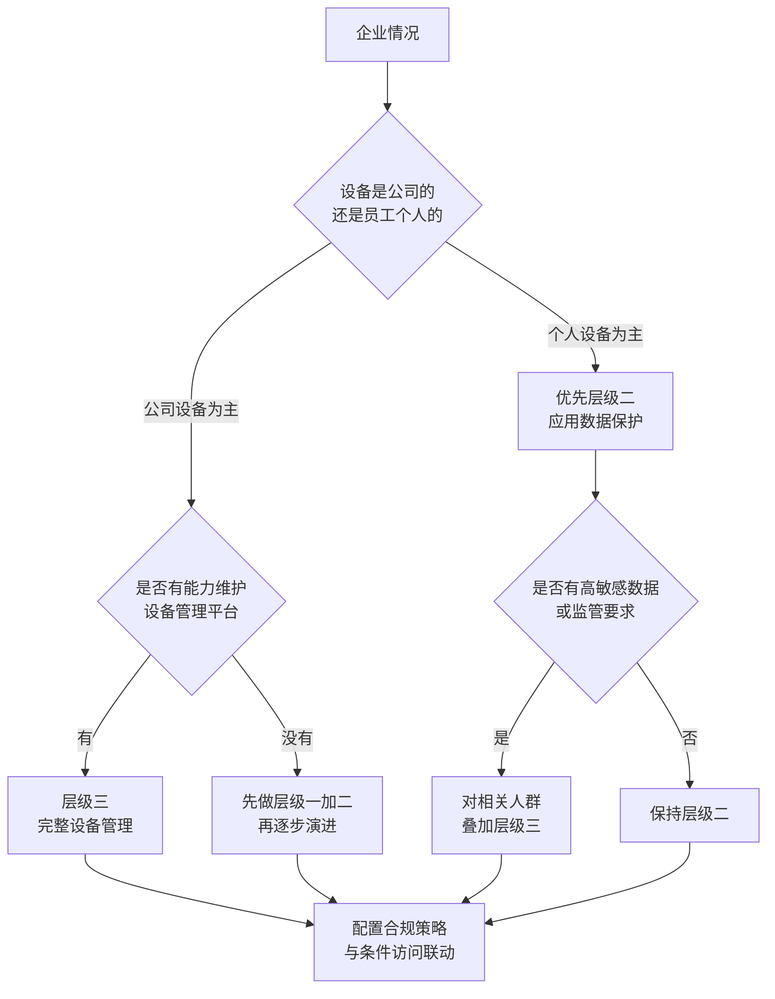
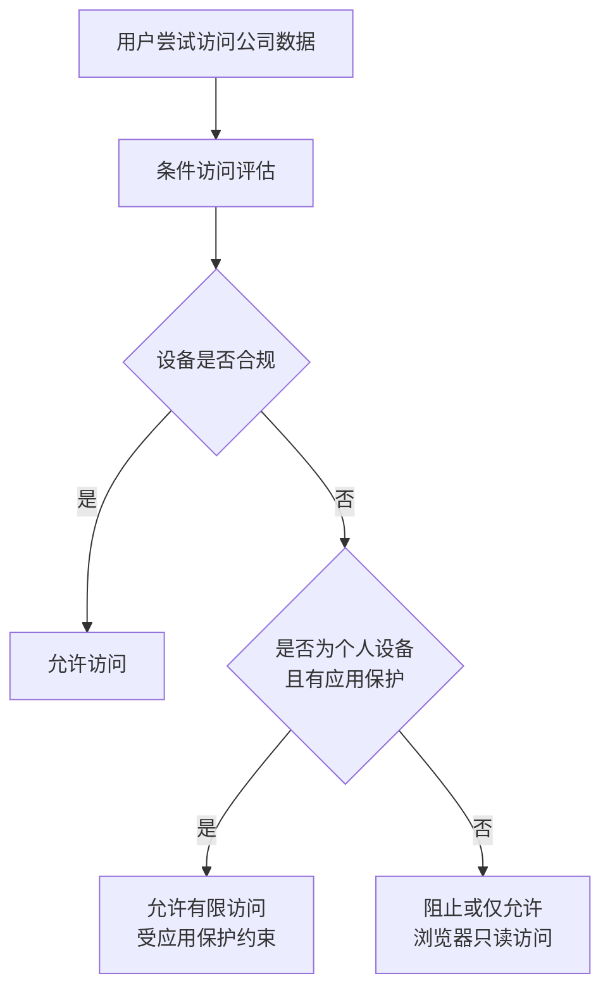
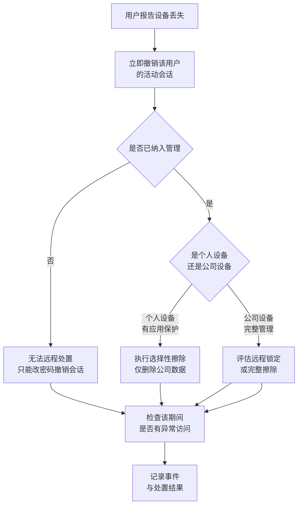
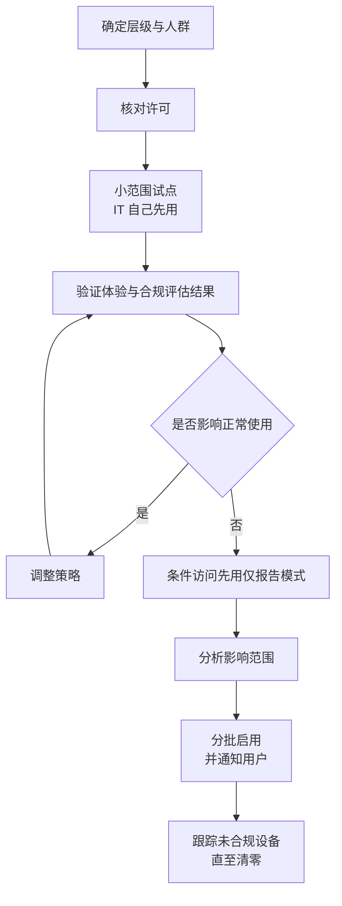

# 第5篇 安全合规与设备管理 · 第4节 设备管理与 Intune

> **所属：** 第5篇 安全、合规与设备管理。  
> **本节小节：** 5.36 ～ 5.49。  
> **本节性质：** 部署与治理。**决定公司数据在什么设备上、以什么条件被访问。**  
> **前置条件：** 已完成[第3节](03-保留策略与合规.md)；第1篇 1.23 的设备管理范围已确定。  
> **导航：** [返回第5篇目录](README.md)｜上一节：[保留策略与合规](03-保留策略与合规.md)｜下一节：[备份与恢复](05-备份与恢复.md)

---

## 5.36 本节目标

完成本节后应当达到：

1. 明确企业采用哪个层级的设备管理（三选一或组合）。
2. 理解"设备加入"与"设备注册"的区别及其影响。
3. 已按所选层级完成配置并验证。
4. 设备丢失、员工离职时有可执行的处置方案。

> **必做：** 设备管理是本篇中**最容易过度投入**的一项。不是所有企业都需要完整设备管理。先按 5.38 判断层级，再决定投入。

---

## 5.37 为什么要管设备

同一个账号，从不同设备访问的风险完全不同：

| 设备 | 风险 |
|---|---|
| 公司电脑（有补丁、有杀毒、磁盘加密） | 较低 |
| 员工家里的旧电脑（无补丁、可能有恶意软件） | **高** |
| 网吧或公共电脑 | **极高** |
| 员工个人手机（可能被家人使用、可能丢失） | 中高 |
| 已离职员工仍持有的设备 | **高** |

### 5.37.1 只做账号保护的局限

即使有 MFA，如果设备本身被控制：

- 恶意软件可以窃取已登录的令牌（第2篇 2.77）。
- 下载到本地的文件不受任何管控。
- 设备丢失后本地数据可能被读取。

> **推荐：** 设备管理的价值不在于"管住员工"，而在于**让"从哪台设备访问"成为可判断、可控制的条件**。这是零信任思路的关键一环。

---

## 5.38 三个管理层级（先选层级再谈工具）

| 层级 | 做什么 | 需要什么 | 适合 |
|---|---|---|---|
| **层级一：仅账号保护** | MFA、条件访问、会话控制；不管设备 | 已在第2篇完成 | 小型企业、无敏感数据、预算有限 |
| **层级二：应用数据保护** | 只保护公司应用中的数据（限制复制、另存、要求 PIN、可远程擦除公司数据） | Intune 相关许可 | **BYOD 场景的最佳性价比** |
| **层级三：完整设备管理** | 注册设备、强制合规（加密、补丁、防护）、配置策略 | Intune 相关许可 + 实施能力 | 公司自有设备、监管要求较高 |

### 5.38.1 层级选择流程

### 5.38.2 常见组合（多数企业的实际做法）

| 人群 | 层级 |
|---|---|
| 全体员工的账号 | 层级一（已完成） |
| 个人手机上的公司应用 | 层级二 |
| 公司发放的 Windows 电脑 | 层级三 |
| 高管、财务、研发 | 层级三 + 更严格条件 |
| 一线共享设备 | 视情况，可能层级二 |
| 外部来宾 | 仅层级一 + 访问范围限制 |

> **必做：** 层级决策要写明理由和适用人群，并核对许可（第1节 5.13）。**没有 Intune 相关许可就无法实施层级二和三**，这必须在采购阶段确认。

---

## 5.39 设备加入与设备注册的区别

这是新手最容易混淆的概念，直接影响策略是否生效。

| 类型 | 通俗理解 | 适合 | 特点 |
|---|---|---|---|
| **Microsoft Entra 加入**（Join） | 设备本身"属于公司"，用工作账号登录 Windows | 公司发放的 Windows 电脑 | 管理程度最高 |
| **Microsoft Entra 注册**（Register） | 设备属于个人，只是"登记"到公司以便访问资源 | 个人电脑、个人手机 | 管理程度较轻 |
| 混合加入 | 同时加入本地 AD 和 Entra | 已有本地 AD 的过渡场景 | 需要同步配合（第2篇第6节） |

### 5.39.1 对策略的影响

| 场景 | 影响 |
|---|---|
| 要求"合规设备"才能访问 | 设备必须已注册/加入并被评估为合规 |
| 个人设备只注册未加入 | 仍可满足部分策略，但可管控范围有限 |
| 未注册的设备 | 在启用相关条件访问后可能被直接阻止 |

> **高风险：** 启用"要求合规设备"的条件访问策略前，**必须先确认目标用户的设备都已注册/加入且被评估为合规**。否则会造成大面积无法访问——这是设备管理项目中最典型的事故。务必先用仅报告模式（第2篇 2.93）。

---

## 5.40 层级二：应用数据保护（BYOD 首选）

### 5.40.1 能做什么

在**不管理整台设备**的前提下，保护公司应用（Outlook、Teams、OneDrive 等）中的数据：

| 措施 | 说明 |
|---|---|
| 要求应用 PIN 或生物识别 | 打开公司应用需验证 |
| 限制复制粘贴 | 禁止把公司数据复制到个人应用 |
| 限制"另存为" | 禁止保存到个人存储位置 |
| 限制截屏（部分平台） | 降低泄露 |
| 加密应用内数据 | 本地数据受保护 |
| **选择性擦除** | 只删除公司数据，**不影响个人照片和信息** |
| 要求最低应用/系统版本 | 避免使用有已知漏洞的版本 |
| 离线宽限期 | 长期不联网后限制访问 |

### 5.40.2 为什么这是 BYOD 的最佳选择

> **推荐：** 员工对"公司管我的手机"抵触很大，但对"公司只管公司应用里的数据"接受度高得多。
>
> 沟通要点：
> - 公司**看不到**你的照片、微信、通话记录。
> - 公司**不能**擦除你的整台手机，只能删除公司应用里的公司数据。
> - 你离职时，公司只清除公司数据。
>
> 这几句话能显著降低推行阻力。

### 5.40.3 实施要点

- [ ] 明确哪些应用纳入保护范围。
- [ ] 明确限制项（复制粘贴、另存、PIN 要求）。
- [ ] 明确离职或丢失设备时的擦除流程。
- [ ] 先在试点用户上验证体验（过严会影响正常使用）。
- [ ] 与用户沟通说明（见上方要点）。
- [ ] 与条件访问联动（例如要求使用受保护的应用访问邮件）。

---

## 5.41 层级三：完整设备管理

### 5.41.1 合规策略（判断设备是否"健康"）

常见合规要求：

| 要求 | 说明 |
|---|---|
| 操作系统最低版本 | 避免已终止支持的系统（**注意 Windows 10 已终止支持，第4篇 4.5**） |
| 磁盘加密已启用 | 设备丢失时数据受保护 |
| 防病毒/端点防护已启用并更新 | 基础防护 |
| 防火墙已启用 | — |
| 需要密码/PIN 且满足复杂度 | — |
| 无越狱/Root | 移动设备 |
| 补丁在要求范围内 | 降低漏洞风险 |
| 设备未被标记为有风险 | 与端点检测联动（按许可） |

### 5.41.2 配置策略（统一设置设备）

| 类别 | 示例 |
|---|---|
| 安全基线 | 采用推荐的安全配置集合 |
| 加密 | 强制启用磁盘加密并托管恢复密钥 |
| 更新管理 | 补丁策略与重启行为 |
| 应用部署 | 推送 Office、Teams（第4篇第3节） |
| 浏览器与网络 | 代理、证书 |
| 本地管理员权限 | 限制普通用户的本地管理员权限 |
| USB 与外设 | 按需限制 |

### 5.41.3 与条件访问的联动（关键价值）

> **必做：** 设备管理的价值只有在**与条件访问联动**后才真正体现。只注册设备但不设访问条件，等于只做了资产登记。

---

## 5.42 个人电脑的处理（最现实的难题）

很多中国企业允许员工用个人电脑处理工作。

| 方案 | 说明 | 优缺点 |
|---|---|---|
| 完全禁止 | 只能用公司电脑 | 最安全但常不现实 |
| **仅浏览器访问 + 禁止下载** | 通过会话控制限制下载 | **性价比高**，个人电脑上不留公司文件 |
| 允许但要求注册与基本合规 | 个人设备也需满足条件 | 员工可能抵触 |
| 完全开放 | 无限制 | **风险高，不建议** |

> **推荐：** "**允许在个人电脑上通过浏览器访问，但禁止下载和同步**"是一个务实的平衡点：员工能应急处理工作，公司文件不落地到不受管的设备上。需要相应的条件访问与会话控制能力，实施前请核对许可。

---

## 5.43 共享设备与一线场景

| 场景 | 要点 |
|---|---|
| 车间、门店、值班室共享电脑 | 共享电脑激活（第4篇 4.10）；禁止保持登录；及时注销 |
| 共享平板 | 考虑共享设备模式（如支持），避免上一个用户数据残留 |
| 会议室设备 | 使用资源账号（第4篇 4.64） |
| 一线人员无固定设备 | 结合硬件安全密钥（第2篇 2.84） |
| 生产控制终端 | 通常不纳入常规管理，需单独隔离与评估 |

> **高风险：** 共享设备上如果保持登录状态，下一个使用者就能直接看到前一个人的邮件和文件。共享场景**必须**配置会话控制并培训用户及时注销。

---

## 5.44 设备丢失与被盗处置

### 5.44.1 处置流程

### 5.44.2 必须提前明确的事

- [ ] 谁有权执行擦除（权限敏感）。
- [ ] 个人设备擦除的**法律与告知要求**（应在 BYOD 政策中事先说明并获员工确认）。
- [ ] 公司设备完整擦除的审批要求。
- [ ] 未纳入管理的设备如何处置（通常只能撤销会话与改密码）。
- [ ] 事件记录与后续复核。

> **必做：** BYOD 政策必须**事先书面告知并获员工同意**，说明公司在什么情况下会擦除哪些数据。事后才说明容易引发争议。

---

## 5.45 与离职流程的衔接

| 动作 | 说明 |
|---|---|
| 禁止登录 + 撤销会话 | 第一步（第6篇） |
| 个人设备选择性擦除 | 清除公司数据 |
| 公司设备回收 | 登记归还状态；未归还的按流程处理 |
| 设备记录更新 | 从设备清单中移除或标记 |
| 检查离职前活动 | 审计日志核查（第2节 5.20） |

> **推荐：** 把"设备处置"作为离职清单的独立项。很多企业回收了电脑，但忘了清除员工个人手机上的公司邮箱，员工离职后仍能收到公司邮件。

---

## 5.46 部署顺序与试点

### 5.46.1 试点必须验证的内容

- [ ] 注册/加入流程用户能否自行完成（或需 IT 协助）。
- [ ] 合规评估结果是否正确（不要出现"明明加密了却判为不合规"）。
- [ ] 策略是否影响正常工作（例如复制粘贴限制过严）。
- [ ] 应用部署是否正常（第4篇）。
- [ ] 条件访问联动是否符合预期。
- [ ] 擦除功能是否可用（在测试设备上验证）。

> **必做：** 擦除功能**必须在测试设备上实际验证一次**。这个能力平时不用，但用到时通常是紧急情况，不能到那时才发现配置有问题。

---

## 5.47 设备清单与巡检

| 字段 | 说明 |
|---|---|
| 设备名称/编号 | — |
| 类型 | Windows / Mac / iOS / Android |
| 归属 | 公司 / 个人 |
| 使用人 | — |
| 管理状态 | 已加入 / 已注册 / 未管理 |
| 合规状态 | 合规 / 不合规 / 未评估 |
| 操作系统版本 | 是否受支持 |
| 加密状态 | — |
| 最近同步时间 | 长期未同步需关注 |
| 备注 | 例外说明 |

### 5.47.1 巡检项（纳入第6篇）

| 频率 | 检查项 |
|---|---|
| 每周 | 不合规设备清单与处理进度 |
| 每周 | 长期未同步的设备 |
| 每月 | 操作系统版本是否仍受支持 |
| 每月 | 未纳入管理但在访问公司数据的设备 |
| 每季度 | 设备清单与在职人员比对（发现离职未回收） |
| 每季度 | 擦除与恢复能力抽查 |

---

## 5.48 常见误区

| 误区 | 事实 |
|---|---|
| "有 MFA 就不用管设备" | 令牌可被恶意软件窃取；本地下载的文件不受管控 |
| "必须做完整设备管理才算安全" | 应用数据保护在 BYOD 场景往往性价比更高 |
| "注册设备就等于安全" | 不与条件访问联动，只是资产登记 |
| "可以直接启用要求合规设备" | 必须先确认设备已合规，否则大面积阻断 |
| "个人设备擦除会删光员工数据" | 选择性擦除只删公司数据，但**必须事先告知** |
| "公司电脑肯定合规" | 未加密、未打补丁、系统已终止支持的公司电脑很常见 |
| "擦除功能不用测" | 用到时是紧急情况，必须提前验证 |

---

## 5.49 本节完成检查表

- [ ] 已确定采用的管理层级及适用人群，并说明理由。
- [ ] 已核对 Intune 相关许可（无许可则层级二/三无法实施）。
- [ ] 已理解"Entra 加入"与"Entra 注册"的区别及对策略的影响。
- [ ] 若实施层级二：保护范围、限制项、擦除流程已确定并试点验证。
- [ ] 已向员工说明"公司看不到个人数据、只能清除公司数据"。
- [ ] 若实施层级三：合规策略已配置（系统版本、加密、防护、补丁、密码）。
- [ ] 合规策略已考虑 **Windows 10 已终止支持**的现状。
- [ ] 配置策略已确定（安全基线、加密与恢复密钥托管、更新、本地管理员限制）。
- [ ] **设备管理已与条件访问联动**，不是仅做资产登记。
- [ ] 启用"要求合规设备"前已用仅报告模式分析影响，并确认目标设备已合规。
- [ ] 个人电脑的处理方案已确定（建议：浏览器访问 + 禁止下载）。
- [ ] 共享设备场景已配置会话控制，并培训用户及时注销。
- [ ] 会议室设备使用资源账号并纳入巡检。
- [ ] 设备丢失处置流程已建立，含撤销会话、擦除方式、异常访问核查。
- [ ] **BYOD 政策已书面告知员工并获确认**，说明擦除范围。
- [ ] 擦除权限已限定到少数人并需审批。
- [ ] **擦除功能已在测试设备上实际验证。**
- [ ] 离职流程中已包含设备处置（含个人手机上的公司数据）。
- [ ] 试点已验证注册流程、合规评估准确性、策略对正常工作的影响。
- [ ] 设备清单已建立；未合规与未管理设备已跟踪处理。
- [ ] 巡检项已纳入第6篇的日常运维。

> **进入下一节的条件：** 层级已确定并完成配置与试点。下一节处理**备份与恢复**——这是很多企业以为"云上就不用管"的最大盲区。
