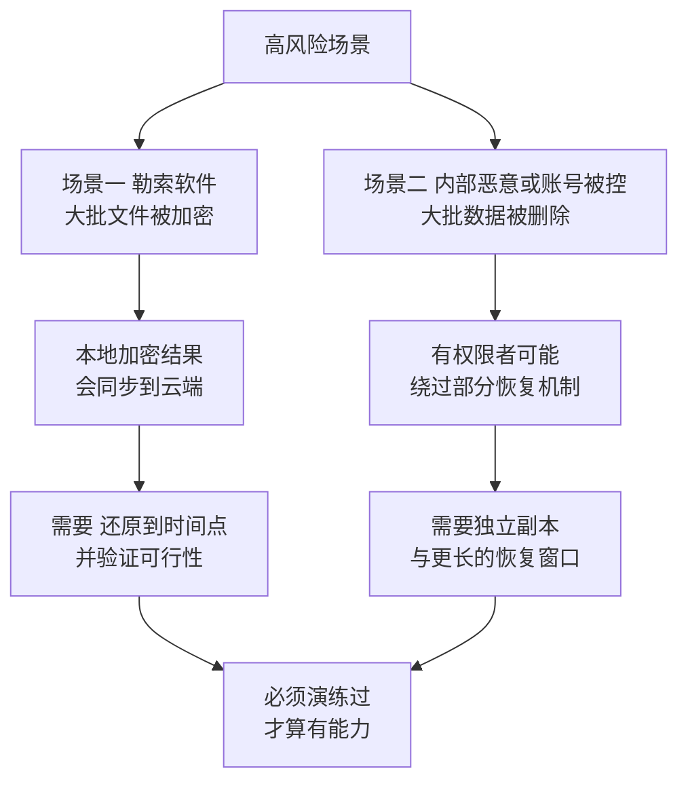
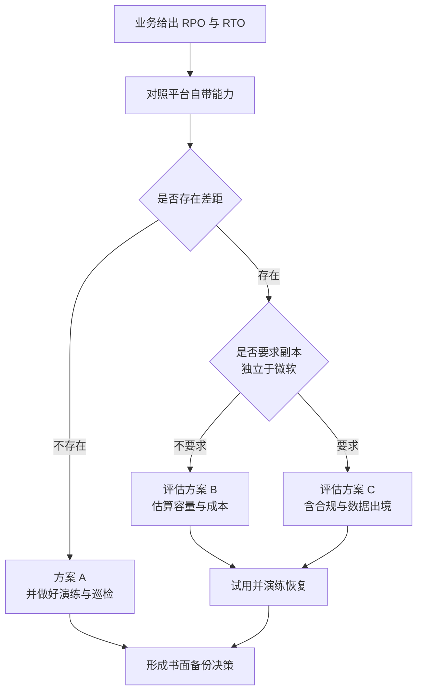

# 第5篇 安全合规与设备管理 · 第5节 备份与恢复

> **所属：** 第5篇 安全、合规与设备管理。  
> **本节小节：** 5.50 ～ 5.60。  
> **本节性质：** 风险决策。**这是很多企业以为"上云就不用管"的最大盲区。**  
> **复核日期：** 2026-08-28。含备份服务的定价模式与配置方式变化，实施前请复核官方页面。  
> **前置条件：** 已完成[第4节](04-设备管理与Intune.md)；第4篇 4.110 的恢复演练已完成。  
> **导航：** [返回第5篇目录](README.md)｜上一节：[设备管理与 Intune](04-设备管理与Intune.md)｜下一节：[本篇小结与参考资料](06-本篇小结与参考资料.md)

---

## 5.50 本节要回答的核心问题

> **"数据在微软云上，还需要备份吗？"**

这个问题不能用"是"或"否"回答。正确的回答方式是：**先弄清平台自带能力覆盖什么、不覆盖什么，再对照企业的恢复要求判断。**

本节完成后应当产出一份**书面的备份决策**，包含：

1. 平台自带能力清单及其局限。
2. 企业的恢复时间目标和恢复点目标。
3. 是否需要额外备份方案，选哪一种。
4. 恢复演练结果与责任人。

---

## 5.51 平台自带的恢复能力（覆盖什么）

| 能力 | 覆盖场景 | 大致范围 |
|---|---|---|
| 邮箱已删除项目恢复 | 用户误删邮件 | 有恢复窗口 |
| 可恢复项目文件夹 | 更深层的邮件恢复 | 有窗口与容量限制 |
| 邮箱在线归档 | 历史邮件存放 | ✅ **E3 已含**（Exchange Online Plan 2） |
| SharePoint/OneDrive 回收站 | 误删文件 | 约 93 天（第4篇 4.92） |
| **文件版本历史** | 误改、误覆盖、加密前版本 | 按配置 |
| **还原到时间点** | 批量误删、勒索加密 | 有可还原的时间范围 |
| 已删除站点恢复 | 误删站点 | 有窗口 |
| 已删除用户的 OneDrive | 离职数据 | 默认 30 天 + 93 天（第4篇 4.117） |
| 保留策略 | 合规保存 | 按策略（第3节） |

> **推荐：** 对**误删、误改、单点恢复**这类最常见的场景，平台自带能力通常已经足够。第4篇的恢复演练 R1～R3 验证的就是这部分。

---

## 5.52 平台自带能力的局限（不覆盖什么）

| 局限 | 说明 | 影响的场景 |
|---|---|---|
| **有时间窗口** | 超过保留期后无法恢复 | 几个月后才发现数据缺失 |
| 不是"任意时间点"的完整快照 | 恢复粒度和方式有限 | 需要精确回到某个历史状态 |
| 批量恢复效率 | 大规模恢复可能耗时较长 | 勒索事件后的全面恢复 |
| **恶意的彻底删除** | 有权限的人（或被盗的管理员账号）可能绕过部分机制 | 内部恶意或账号被控 |
| 保留策略不是备份 | 目的是合规保存与删除，不是恢复到时间点 | 误以为"有保留就有备份" |
| 覆盖范围 | 并非所有服务的所有数据类型都有同等恢复能力 | Teams 聊天、部分配置项 |
| 配置与策略本身 | 策略、规则、结构的恢复通常不在其中 | 配置被误删或误改 |

### 5.52.1 最需要警惕的两个场景

> **高风险：** 第4篇 4.108 已强调：**同步不是备份**。勒索软件加密本地文件后，加密结果会同步到云端。此时能救命的是版本历史和"还原到时间点"，而这两者都有**时间范围限制**，且必须演练过。

---

## 5.53 先确定恢复要求，再选方案

不要先问"买哪个备份产品"，先回答两个问题：

### 5.53.1 恢复点目标（RPO）

**"最多可以接受丢失多长时间的数据？"**

| 业务 | 可接受丢失 | 说明 |
|---|---|---|
| 财务凭证 | 待填写 | 通常要求很低 |
| 客户往来邮件 | 待填写 | — |
| 项目文件 | 待填写 | — |
| 个人草稿 | 待填写 | 可接受较高 |

### 5.53.2 恢复时间目标（RTO）

**"出事后多久必须恢复可用？"**

| 场景 | 要求恢复时间 | 说明 |
|---|---|---|
| 单个用户误删文件 | 待填写 | 通常几小时内 |
| 一个部门的文件被误删 | 待填写 | — |
| 勒索软件影响多个部门 | 待填写 | **这是最需要明确的** |
| 离职员工数据找回 | 待填写 | 通常可接受较慢 |

> **必做：** RPO 和 RTO 必须由**业务方给出**，不是 IT 假设。给出后要对照平台自带能力判断差距——这个差距就是"是否需要额外备份"的答案。

---

## 5.54 Microsoft 365 Backup（微软自己的备份服务）

很多资料还在说"必须用第三方备份"。实际上微软已提供自有备份服务，评估时应把它纳入选项。

### 5.54.1 基本情况

| 项目 | 说明 |
|---|---|
| 覆盖范围 | 可备份全部或选定的 **SharePoint 站点、OneDrive 账户、Exchange 邮箱** |
| 计费模式 | **按量付费**（基于受保护内容的容量），不是按用户席位 |
| 前提 | 需要有效的 Azure 订阅用于计费；通过 Microsoft 365 管理中心设置 |
| 数据位置 | 数据保留在 Microsoft 365 信任边界内 |
| 恢复方式 | 可恢复到原位置（覆盖）或新位置；支持常规与更快的恢复方式 |
| 恢复速度 | 官方说明 SharePoint/OneDrive 使用快速恢复点通常在数分钟到数十分钟完成，超大站点可能更久；邮箱恢复按每分钟处理若干项目计 |
| 配置变化 | **2026 年 4 月 1 日之后**新加入的客户使用管理中心账单节点下的新按量付费设置体验 |

官方说明见 [Microsoft 365 Backup 概述](https://learn.microsoft.com/en-us/microsoft-365/backup/backup-overview)、[设置 Microsoft 365 Backup](https://learn.microsoft.com/en-us/microsoft-365/backup/backup-setup) 与 [定价模式](https://learn.microsoft.com/en-us/microsoft-365/backup/backup-pricing?view=o365-worldwide)。

### 5.54.2 优点与需要注意的地方

| 优点 | 需要注意 |
|---|---|
| 数据不出微软信任边界（合规上更简单） | **按容量计费**：数据量大时成本需要测算 |
| 恢复速度快 | 覆盖范围为 SharePoint、OneDrive、Exchange；**其他数据类型需另行评估** |
| 无需额外基础设施 | 需要 Azure 订阅用于计费 |
| 在管理中心统一操作 | 配置方式和计费入口会随产品更新调整 |
| 与平台深度集成 | 与"独立于供应商的第三方副本"这一诉求不同（见 5.55） |

> **必做：** 采用前必须做两件事：**估算容量与成本**（用实际数据量乘以单价），以及**确认覆盖范围是否满足企业需求**。定价与覆盖范围以官方页面为准。

---

## 5.55 三种方案对比

| 方案 | 说明 | 优点 | 局限 |
|---|---|---|---|
| **A. 仅用平台自带能力** | 回收站、版本历史、还原到时间点、保留策略 | 无额外成本 | 有时间窗口；批量恢复能力有限；无独立副本 |
| **B. Microsoft 365 Backup** | 微软自有备份服务 | 恢复快、数据不出信任边界、无需额外基础设施 | 按容量计费；覆盖范围需确认；仍在微软生态内 |
| **C. 第三方备份** | 第三方厂商方案 | 可实现**独立于微软的副本**、覆盖面可能更广、可长期归档 | 成本较高；需评估数据流向与合规；**涉及数据出境需专项评估** |

### 5.55.1 决策流程

### 5.55.2 什么情况下需要"独立于微软的副本"

| 情况 | 说明 |
|---|---|
| 行业或合同要求副本独立于服务商 | 按要求执行 |
| 需要超长期归档（如十年以上） | 需评估可行性 |
| 担心租户级别的极端风险 | 例如账号被彻底接管 |
| 需要跨平台统一备份管理 | 与其他系统一起管理 |

> **推荐：** 多数中小企业的现实需求是"**能从误删和勒索中较快恢复**"，方案 A（做好演练）或方案 B 通常已足够。方案 C 主要服务于明确的合规或极端风险要求，不应作为默认选择。

---

## 5.56 各服务的覆盖范围核对

无论选哪个方案，都要逐项确认覆盖情况：

| 数据 | 平台自带 | 所选备份方案是否覆盖 | 备注 |
|---|---|---|---|
| Exchange 邮箱邮件 | 回收窗口内可恢复 | 待确认 | — |
| 邮箱日历与联系人 | 同上 | 待确认 | — |
| 在线归档 | 视配置 | 待确认 | — |
| 公共文件夹 | 视情况 | 待确认 | 常见盲区 |
| SharePoint 站点文件 | 回收站/时间点还原 | 待确认 | — |
| SharePoint 列表与页面 | 部分 | 待确认 | 常见盲区 |
| OneDrive 文件 | 回收站/时间点还原 | 待确认 | — |
| **Teams 聊天记录** | 受保留策略约束 | 待确认 | **常见盲区** |
| Teams 频道文件 | 即 SharePoint | 待确认 | — |
| Teams 会议录制 | 在 OneDrive/SharePoint 中 | 待确认 | 注意默认过期（第4篇 4.55） |
| Teams 团队结构与设置 | 通常不覆盖 | 待确认 | 常见盲区 |
| Entra 用户与组配置 | 通常不覆盖 | 待确认 | **配置类盲区** |
| 各类策略与规则配置 | 通常不覆盖 | 待确认 | **配置类盲区** |

### 5.56.1 配置类盲区的应对

> **必做：** 备份产品通常保护**数据**，不保护**配置**。因此必须自行维护配置的可重建能力：
>
> - [ ] 导出并留档关键配置（条件访问策略、邮件流规则、共享设置、保留策略、设备策略）。
> - [ ] 变更时更新留档（纳入变更管理，第6篇）。
> - [ ] 本方案文档本身就是重要的配置记录。
>
> 这一步成本很低，但在"策略被误删"或"人员流失后无人知道当初怎么配的"时非常关键。

---

## 5.57 恢复演练（本节的硬性要求）

第4篇 4.110 已做过 R1～R4。本节补充**跨服务和大范围**的演练。

| 编号 | 场景 | 演练内容 | 通过标准 |
|---|---|---|---|
| B1 | 单个邮箱误删邮件恢复 | 从可恢复项目恢复 | 成功且在 RTO 内 |
| B2 | 单个文件版本回退 | 版本历史 | 成功 |
| B3 | 批量文件误删恢复 | 回收站 / 时间点还原 | 成功，记录耗时 |
| B4 | **勒索加密场景恢复** | 在测试账号上模拟后还原 | 恢复到加密前状态 |
| B5 | 离职员工 OneDrive 数据取回 | 按保留期流程 | 成功 |
| B6 | **整个站点恢复** | 恢复一个测试站点 | 成功，记录耗时 |
| B7 | 若采用备份方案：从备份恢复 | 实际执行一次恢复 | 成功，记录耗时与完整性 |
| B8 | 关键配置重建 | 用留档重建一条策略 | 成功 |

### 5.57.1 演练记录要包含

- [ ] 执行人、日期、场景。
- [ ] 实际耗时（对照 RTO）。
- [ ] 数据完整性（对照 RPO）。
- [ ] 遇到的问题与解决方式。
- [ ] 用户可自助与必须管理员介入的界线。
- [ ] **结论：当前能力是否满足业务要求**；不满足的差距和改进计划。

> **必做：** **没有演练过的恢复能力不能算能力。** 演练结论是本节最重要的交付物，也是向管理层说明"是否需要额外投入"的依据。

---

## 5.58 备份决策书（本节核心交付物）

| 项目 | 内容 |
|---|---|
| 业务给出的 RPO | 待填写 |
| 业务给出的 RTO | 待填写 |
| 平台自带能力评估结论 | 待填写 |
| 识别出的差距 | 待填写 |
| 选择的方案（A / B / C） | 待填写 |
| 选择理由 | 待填写 |
| 覆盖范围（含已知盲区） | 待填写 |
| 未覆盖项的处理方式 | 待填写 |
| 预计成本 | 待填写 |
| 配置留档方案 | 待填写 |
| 演练结果摘要 | 待填写 |
| 演练周期与责任人 | 待填写 |
| 批准人（业务 + IT + 合规） | 待填写 |
| 复核日期 | 待填写 |

> **推荐：** 即使最终结论是"暂不额外投入备份"，也要**把这个决定和理由写下来并由管理层批准**。这样在出事时是"经评估接受的风险"，而不是"没人想过这件事"。

---

## 5.59 常见误区

| 误区 | 事实 |
|---|---|
| "数据在云上，微软会帮我们备份" | 平台提供恢复能力，但有窗口和范围限制；企业需自行评估是否足够 |
| "有保留策略就等于有备份" | 保留是为了合规保存与删除，不是为了恢复到时间点 |
| "同步就是备份" | 本地删除和加密会同步上云（第4篇 4.108） |
| "买了备份产品就安全了" | **没演练过的备份等于没有备份** |
| "备份能恢复所有东西" | 配置、策略、部分数据类型通常不在覆盖范围 |
| "必须用第三方备份" | 微软已有自有备份服务，应纳入评估 |
| "第三方备份一定更安全" | 需评估数据流向、合规和数据出境要求 |
| "回收站 93 天足够了" | 取决于"多久能发现问题"，几个月后才发现的情况很常见 |

---

## 5.60 本节完成检查表

- [ ] 已梳理平台自带恢复能力及其覆盖范围。
- [ ] 已明确平台自带能力的局限（时间窗口、批量恢复、恶意删除、配置类不覆盖）。
- [ ] **RPO 与 RTO 已由业务方给出**，不是 IT 假设。
- [ ] 已对照 RPO/RTO 识别出能力差距。
- [ ] 已把 **Microsoft 365 Backup** 纳入评估选项，并了解其按量付费模式与覆盖范围。
- [ ] 若考虑该服务：已估算容量与成本，并确认 Azure 订阅与配置方式。
- [ ] 若考虑第三方备份：已评估数据流向、合规与**数据出境**要求。
- [ ] 已在方案 A / B / C 中做出选择并书面说明理由。
- [ ] 覆盖范围已逐项核对，**已识别 Teams 聊天、公共文件夹、配置类等盲区**。
- [ ] 未覆盖项的处理方式已明确。
- [ ] **关键配置已导出留档**，并纳入变更管理持续更新。
- [ ] 恢复演练 B1～B8 已按适用范围完成并记录。
- [ ] **勒索场景（B4）已在测试账号上演练**，确认可恢复到加密前状态。
- [ ] 演练结论已明确回答"当前能力是否满足业务要求"。
- [ ] 差距与改进计划已记录并指定责任人。
- [ ] **备份决策书已完成并由业务、IT、合规共同批准**（即使结论是暂不额外投入）。
- [ ] 演练周期（建议至少每半年一次）与责任人已确定，并纳入第6篇巡检。

> **进入下一节的条件：** 备份决策书已批准、演练已完成。下一节汇总本篇小结、验收清单与参考资料。
