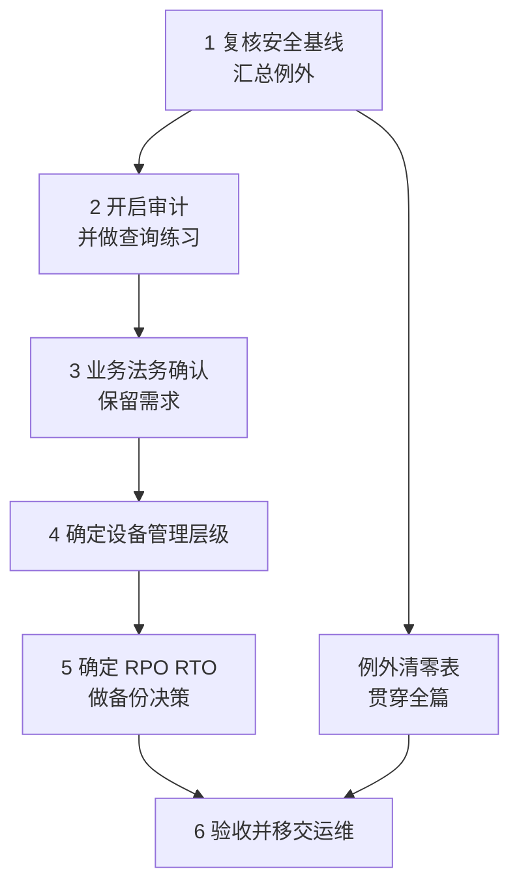

# 第5篇 安全、合规与设备管理

> **本篇作用：** 把前四篇散落的安全措施集中验证、把临时例外清零，并回答两个关键问题——**"出事了查得到吗？"** 和 **"出事了恢复得了吗？"**  
> **本篇性质：** 收口与兜底。多数配置不新增功能，但决定项目是否真的安全可交付。  
> **文档状态：** 本篇正文已完成（6 个小节文件）。表格中的“待填写”是企业实际数据占位。  
> **版本与复核日期：** v1.0，2026-08-28。  
> **对应原章节：** 第10章。  
> **导航：** [返回方案总目录](../README.md)｜上一篇：[第4篇 终端与协作](../04-终端与协作-Office-Teams-文件/README.md)

---

## 一、本篇小节文件

| 顺序 | 文件 | 覆盖小节 | 主要内容 | 关键动作 |
|---:|---|---|---|---|
| 1 | [安全基线与账号保护](01-安全基线与账号保护.md) | 5.1–5.14 | 风险优先级、基线 S1–S20、管理员加固、数据外流通道、**第三方应用授权**、告警联系人、**例外清零表** | 例外清零 |
| 2 | [日志、审计与告警](02-日志审计与告警.md) | 5.15–5.22 | 三类日志的区别、**审计默认保留 180 天**、查询练习 A1–A10、告警配置与响应 | 实际查询练习 |
| 3 | [保留策略与合规](03-保留策略与合规.md) | 5.23–5.35 | 保留/删除/法务保留/备份的区别、**保留需求表**、标签与 DLP 渐进实施 | 业务法务确认需求 |
| 4 | [设备管理与 Intune](04-设备管理与Intune.md) | 5.36–5.49 | 三个管理层级、加入与注册的区别、**应用数据保护（BYOD 首选）**、丢失处置 | 擦除功能实测 |
| 5 | [备份与恢复](05-备份与恢复.md) | 5.50–5.60 | 平台能力与局限、**RPO/RTO**、**Microsoft 365 Backup**、配置留档、演练 B1–B8 | 备份决策书 |
| 6 | [本篇小结与参考资料](06-本篇小结与参考资料.md) | — | 小结、**验收清单 V1–V40**、35 项交付物、30 项官方参考资料 | 验收 |

---

## 二、实施顺序

> **必做：** 本篇的执行顺序有意为之——**先建立可见性（审计），再谈保留和设备，最后决定备份**。没有审计就无法验证前面的措施是否真的生效。

---

## 三、本篇六条硬性纪律

1. **例外必须清零** —— 前四篇所有临时例外（条件访问排除、SMTP AUTH 过渡、邮件允许列表、宏受信任位置、旧版环境、外部共享例外、超期来宾）都要有结论和到期管理。
2. **第三方应用授权必须受控** —— 它不需要密码也不触发 MFA，是绕过 MFA 的常见路径。
3. **告警必须实测有人接收** —— 发到无人查看的邮箱等于没有告警。
4. **保留策略的删除动作不可逆** —— 先小范围测试再上线。
5. **DLP 从仅记录开始** —— 直接设为阻止会打断业务。
6. **恢复能力必须演练，含勒索场景** —— 没演练过的备份等于没有备份。

---

## 四、本篇必须产出的结论

- [ ] 安全基线状态表（**实际状态**，非计划状态）。
- [ ] 例外清零表（含负责人与到期日期）。
- [ ] 审计保留期是否满足企业回溯要求的结论。
- [ ] 保留需求表（业务、法务、财务、HR 确认）。
- [ ] 设备管理层级决策与 BYOD 政策（员工书面确认）。
- [ ] **RPO / RTO（业务给出）**。
- [ ] **备份决策书（已批准）** —— 即使结论是"暂不额外投入"也要书面批准。
- [ ] 恢复演练记录（含勒索场景）。
- [ ] 关键配置导出留档。
- [ ] 验收清单 V1～V40。

完整交付物清单（35 项）见[本篇小结与参考资料](06-本篇小结与参考资料.md)。

---

## 五、三条给新手的关键提醒

1. **"数据在云上，微软会帮我们备份"是错的也不全错。** 平台提供恢复能力，但有时间窗口和范围限制。正确做法是先让业务给出 RPO/RTO，再对照能力找差距。**微软现在有自己的按量付费备份服务**，评估时不要只考虑第三方。

2. **审计（标准）默认保留 180 天。** 如果企业需要一年以上的回溯（年度审计、法律取证），现在就要规划延长或导出，而不是等需要时才发现日志没了。

3. **BYOD 不必"管住整台手机"。** 应用数据保护只管公司应用里的数据，公司看不到员工的照片和微信，也不能擦除整台设备——这句话能让推行阻力下降一大半。但前提是**BYOD 政策要事先书面告知并获员工确认**。

---

## 六、阅读提示

- 提示标记 **必做 / 推荐 / 按需 / 高风险 / 验证点 / 回退点 / 许可证要求** 的含义见[方案总目录](../README.md)。
- 本篇多项能力取决于许可，**实施前必须按 5.13 核对当前服务说明和产品条款**。
- 本篇含审计保留期、备份定价模式等时效性内容，请按第6节末尾的复核表核对官方页面。
- 所有示例账号、域名和人员信息均为虚构数据。
