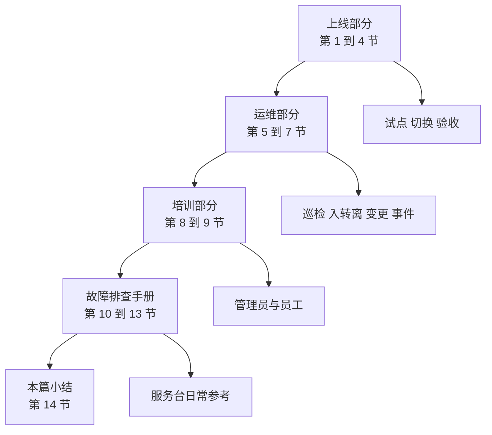
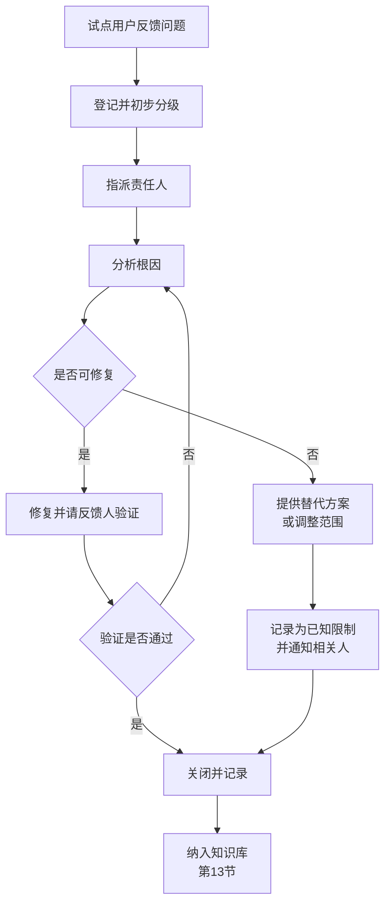

# 第6篇 上线运维与培训 · 第1节 试点实施

> **所属：** 第6篇 上线、运维与培训。  
> **本节小节：** 6.1 ～ 6.14。  
> **本节性质：** 风险控制。**试点是全项目最后一道、也是成本最低的一道防线。**  
> **前置条件：** 第2～5篇的技术配置已完成（可与第5篇部分工作并行）。  
> **导航：** [返回第6篇目录](README.md)｜下一节：[上线准备与切换计划](02-上线准备与切换计划.md)

---

## 6.1 本篇在整个项目中的位置

前五篇建好了系统，第6篇负责**让它平稳上线并长期跑下去**。

### 6.1.1 本篇要落地前五篇的遗留项

| 来源 | 遗留项 | 本篇处理位置 |
|---|---|---|
| 第5篇 5.12 | 例外清零表跟踪 | 第5节巡检、第7节变更 |
| 第2篇 2.118 | MFA 巡检与紧急账号演练 | 第5节 |
| 第3篇 3.94 | 迁移账号回收、误投补投 | 第4节 |
| 第4篇 4.117 | 离职五项必查 | 第6节 |
| 第5篇 5.20 | 离职前活动核查 | 第6节 |
| 第5篇 5.47 | 设备巡检 | 第5节 |
| 第5篇 5.57 | 恢复演练周期 | 第5节 |
| 各篇 | 故障排查方法 | 第10～13节 |

> **必做：** 项目结束时请对照上表逐项确认。这些是最容易"项目一结束就没人管"的内容。

---

## 6.2 为什么必须试点

试点不是"多此一举的流程"，而是用**少数人的可控问题**替代**全公司的不可控问题**。

| 不试点的后果 | 试点能提前发现的 |
|---|---|
| 上线当天服务台被打爆 | 用户实际会问什么问题 |
| 财务发现宏算错了数 | 兼容性问题（第4篇 4.18） |
| 助理无法访问领导邮箱 | 委派权限问题（第3篇 3.12） |
| 会议全程卡顿 | 网络与设备问题（第4篇 4.79） |
| 打印机突然发不出邮件 | 非人账号改造遗漏（第2篇 2.109） |
| 用户找不到文件 | 存放规则不清晰（第4篇 4.86） |

> **推荐：** 向管理层解释试点价值时，用一句话：**"试点是花两周时间，避免上线当天全公司停摆。"**

---

## 6.3 试点用户选择原则

试点的目标是**覆盖场景**，不是追求人数比例。

| 原则 | 说明 |
|---|---|
| 覆盖典型场景 | 每种使用模式至少一人 |
| 包含"麻烦"用户 | 有复杂宏、大邮箱、多设备的用户 |
| 包含愿意配合的人 | 会认真反馈而不是默默忍受 |
| 不要只选 IT 人员 | IT 会自动绕过问题，发现不了真实障碍 |
| 包含业务关键角色的**代表**（非全部） | 例如一名助理，而不是所有高管 |
| 避免全部选"技术好的人" | 他们能自己解决问题，掩盖了真实难度 |

### 6.3.1 建议的试点组成

| 角色 | 人数建议 | 验证重点 |
|---|---|---|
| IT 管理员 | 1～2 | 流程与工具 |
| 普通办公用户 | 2～3 | 基础体验 |
| **财务用户** | 1～2 | **宏、插件、开票工具** |
| 管理层或助理 | 1～2 | 邮箱委派、日历共享 |
| 销售/移动办公 | 1～2 | 手机端、外部协作 |
| 使用共享邮箱的用户 | 1～2 | 共享邮箱权限与代发 |
| 大邮箱用户 | 1～2 | 迁移时长与性能 |
| Mac 用户（如有） | 1 | 平台差异 |
| 共享电脑用户（如有） | 1 | 共享激活、注销 |
| 无手机岗位（如有） | 1 | MFA 替代方案 |
| 分支机构用户（如有） | 1～2 | 网络与会议质量 |

> **必做：** **财务用户必须参与试点。** 财务的宏和开票工具是最容易出问题、后果最严重的部分（第4篇 4.12）。

---

## 6.4 试点前准备清单

- [ ] 试点范围与名单已确定并通知本人。
- [ ] 试点用户已知情并同意配合（说明这是试点、可能遇到问题、如何反馈）。
- [ ] 试点周期已确定（建议 2～4 周，覆盖一个完整业务周期）。
- [ ] 服务台已安排专人支持试点。
- [ ] 反馈渠道已建立（专用群或工单标签）。
- [ ] 问题登记表已准备。
- [ ] 回退方案已准备（试点用户能恢复到原状态）。
- [ ] 各项测试用例已准备（引用前五篇）。
- [ ] 培训材料初稿已准备（第8、9节）。
- [ ] 试点通过标准已定义（6.13）。

> **推荐：** 建一个专门的试点反馈群，让试点用户能随时说"这个不好用"。**低门槛的反馈渠道**比正式工单更能收集到真实问题。

---

## 6.5 试点内容一：账号与 MFA

| 编号 | 验证内容 | 引用 | 状态 |
|---|---|---|---|
| P1 | 用户能自助完成 MFA 注册 | 第2篇 2.104 | ☐ |
| P2 | 注册指引清晰、用户看得懂 | 第2篇 2.103 | ☐ |
| P3 | 至少注册两种验证方式 | 第2篇 2.104 | ☐ |
| P4 | 换设备流程可执行 | 第2篇 2.106 | ☐ |
| P5 | 无手机岗位的替代方案可用 | 第2篇 2.105 | ☐ |
| P6 | 临时访问密码发放流程可执行 | 第2篇 2.104 | ☐ |
| P7 | 条件访问未误伤正常使用 | 第2篇 2.93 | ☐ |
| P8 | 用户理解"未发起的验证请求不要批准" | 第2篇 2.75 | ☐ |

---

## 6.6 试点内容二：邮件迁移

| 编号 | 验证内容 | 引用 | 状态 |
|---|---|---|---|
| P9 | 邮件、日历、联系人完整 | 第3篇 3.70 | ☐ |
| P10 | 共享邮箱可访问、发件人显示正确 | 第3篇 3.88 | ☐ |
| P11 | 委派关系可用 | 第3篇 3.70 | ☐ |
| P12 | Outlook 配置文件重建流程顺畅 | 第3篇 3.87 | ☐ |
| P13 | 手机端可正常收发 | 第3篇 3.89 | ☐ |
| P14 | 邮箱规则清单已发给本人并可重建 | 第3篇 3.90 | ☐ |
| P15 | 迁移耗时符合预期（用于工期校准） | 第3篇 3.61 | ☐ |
| P16 | 大邮箱用户体验可接受 | 第3篇 3.69 | ☐ |

---

## 6.7 试点内容三：Office 部署与兼容性

| 编号 | 验证内容 | 引用 | 状态 |
|---|---|---|---|
| P17 | 安装与激活成功 | 第4篇 4.25 | ☐ |
| P18 | **高风险宏由使用者本人验证结果正确** | 第4篇 4.18 | ☐ |
| P19 | 加载项（开票、签章、CRM）正常 | 第4篇 4.18 | ☐ |
| P20 | 业务系统导出 Excel/Word 正常 | 第4篇 4.18 | ☐ |
| P21 | 卸载旧版后用户数据完好 | 第4篇 4.24 | ☐ |
| P22 | 企业宏可正常运行（签名或受信任位置） | 第4篇 4.42 | ☐ |
| P23 | 打印与导出 PDF 正常 | 第4篇 4.18 | ☐ |
| P24 | 中文字体与排版正常 | 第4篇 4.28 | ☐ |

---

## 6.8 试点内容四：Teams 与会议

| 编号 | 验证内容 | 引用 | 状态 |
|---|---|---|---|
| P25 | 客户端登录与聊天正常 | 第4篇 4.82 | ☐ |
| P26 | 多人视频会议 + 屏幕共享质量可接受 | 第4篇 4.79 | ☐ |
| P27 | 在 Outlook 中创建 Teams 会议 | 第4篇 4.82 | ☐ |
| P28 | 会议大厅行为符合策略 | 第4篇 4.59 | ☐ |
| P29 | 录制并能找到录制文件 | 第4篇 4.55 | ☐ |
| P30 | 频道文件协作正常 | 第4篇 4.82 | ☐ |
| P31 | 外部人员参会/来宾访问符合策略 | 第4篇 4.75 | ☐ |
| P32 | 手机端会议可用 | 第4篇 4.82 | ☐ |

---

## 6.9 试点内容五：文件与共享

| 编号 | 验证内容 | 引用 | 状态 |
|---|---|---|---|
| P33 | 用户理解"文件放哪里"的规则 | 第4篇 4.86 | ☐ |
| P34 | 同步客户端正常，图标含义已培训 | 第4篇 4.104 | ☐ |
| P35 | 权限符合设计（实际用户验证） | 第4篇 4.115 | ☐ |
| P36 | 共享链接默认值符合策略 | 第4篇 4.97 | ☐ |
| P37 | 共同编辑可用 | 第4篇 4.107 | ☐ |
| P38 | 回收站与版本历史恢复可自助完成 | 第4篇 4.110 | ☐ |
| P39 | 出差前离线准备可执行 | 第4篇 4.104 | ☐ |
| P40 | 迁移的部门文件可正常访问 | 第4篇 4.115 | ☐ |

---

## 6.10 试点内容六：非人账号与业务系统

这一项**最容易被忽略**，但影响面很大。

| 编号 | 验证内容 | 引用 | 状态 |
|---|---|---|---|
| P41 | 打印机/扫描仪发信正常 | 第2篇 2.109 | ☐ |
| P42 | ERP/OA 通知邮件正常 | 第2篇 2.109 | ☐ |
| P43 | 工资单系统发信正常 | 第2篇 2.109 | ☐ |
| P44 | 监控告警邮件正常 | 第2篇 2.109 | ☐ |
| P45 | CRM 邮件归档插件正常 | 第4篇 4.18 | ☐ |
| P46 | 依赖旧文件路径的脚本已改造 | 第4篇 4.116 | ☐ |
| P47 | 会议室设备可正常入会 | 第4篇 4.82 | ☐ |

> **高风险：** P41～P44 这类"没有人在用但很重要"的发信场景，往往在正式上线后才被发现出问题——因为试点只测了人的使用，没测机器的使用。**必须专门测试。**

---

## 6.11 问题登记、分级与关闭

### 6.11.1 问题登记表

| 编号 | 问题描述 | 发现人 | 发现日期 | 影响范围 | 等级 | 责任人 | 处理方案 | 状态 | 关闭日期 |
|---|---|---|---|---|---|---|---|---|---|
| 待填写 | 待填写 | 待填写 | 待填写 | 待填写 | 待判定 | 待填写 | 待填写 | 开放 | — |

### 6.11.2 分级标准

| 等级 | 定义 | 上线影响 |
|---|---|---|
| **P1 严重** | 大量用户无法工作、数据丢失、业务中断 | **必须关闭才能上线** |
| P2 高 | 关键功能不可用或结果错误（如宏算错数） | **必须关闭或有可用替代方案** |
| P3 中 | 有替代办法的功能异常 | 可带方案上线，限期修复 |
| P4 低 | 使用不便、界面问题、优化建议 | 纳入改进计划 |

### 6.11.3 处理流程

> **必做：** 问题必须由**反馈人验证后才能关闭**。IT 自认为修好了就关闭，是试点失效的常见原因。

---

## 6.12 试点期间的沟通节奏

| 频率 | 动作 |
|---|---|
| 每天（首周） | 主动询问试点用户"有什么不顺" |
| 每周 | 试点例会：过一遍开放问题 |
| 每周 | 向项目组和管理层通报进展 |
| 随时 | 反馈群响应 |
| 试点结束 | 总结会 + 报告 |

> **推荐：** **主动问**比等用户报告有效得多。很多用户遇到问题会选择"绕过去"而不是反馈，这些"绕过"恰恰是上线后的隐患。

---

## 6.13 试点通过标准

试点结束时，逐项确认：

| 编号 | 通过条件 | 状态 |
|---|---|---|
| G1 | **P1 级问题数为 0** | ☐ |
| G2 | P2 级问题已关闭或有经批准的替代方案 | ☐ |
| G3 | 所有"高"级别 Office 依赖验证通过 | ☐ |
| G4 | 邮件迁移完整性验证通过（含日历、联系人、权限） | ☐ |
| G5 | 非人账号（打印机、业务系统）发信正常 | ☐ |
| G6 | 会议质量达到基线 | ☐ |
| G7 | 试点用户能自助完成 MFA 注册与常见操作 | ☐ |
| G8 | 培训材料已根据试点反馈修订 | ☐ |
| G9 | 服务台掌握常见问题处理方法 | ☐ |
| G10 | 迁移耗时实测数据已用于工期校准 | ☐ |
| G11 | 试点用户主观评价可接受 | ☐ |
| G12 | 试点报告已完成并获批准 | ☐ |

### 6.13.1 试点报告应包含

1. 试点范围与周期。
2. 验证项与结果（P1～P47）。
3. 发现的问题清单与处理结果。
4. 尚未解决的问题与影响评估。
5. 实测数据（迁移速度、会议质量）。
6. 用户反馈摘要（含负面反馈）。
7. 培训材料的修订点。
8. **对正式上线的建议**（可以上线 / 需要延期 / 需要调整范围）。
9. 批准签字。

> **必做：** 报告必须包含**负面反馈**。只写"试点顺利"的报告没有价值，也会让管理层对上线风险产生错误判断。

---

## 6.14 本节完成检查表

- [ ] 试点用户名单已确定，覆盖典型场景，**含财务用户**。
- [ ] 试点用户已知情并同意配合。
- [ ] 试点周期覆盖一个完整业务周期（建议 2～4 周）。
- [ ] 低门槛反馈渠道已建立并有人响应。
- [ ] 回退方案已准备。
- [ ] 验证项 P1～P47 已按适用范围执行并记录。
- [ ] **P18（宏结果由使用者本人验证）已完成。**
- [ ] **P41～P47（非人账号与业务系统）已专门测试。**
- [ ] 问题已登记、分级、指派责任人。
- [ ] 问题由**反馈人验证后**才关闭。
- [ ] 试点期间保持主动询问的沟通节奏。
- [ ] 试点通过标准 G1～G12 已逐项确认。
- [ ] 试点报告已完成，**含负面反馈和明确的上线建议**，并获批准。
- [ ] 培训材料已根据试点反馈修订（第8、9节）。
- [ ] 服务台已根据试点问题更新处理指引。

> **进入下一节的条件：** 试点通过标准全部满足、试点报告已批准。下一节做正式上线的准备与切换计划。
