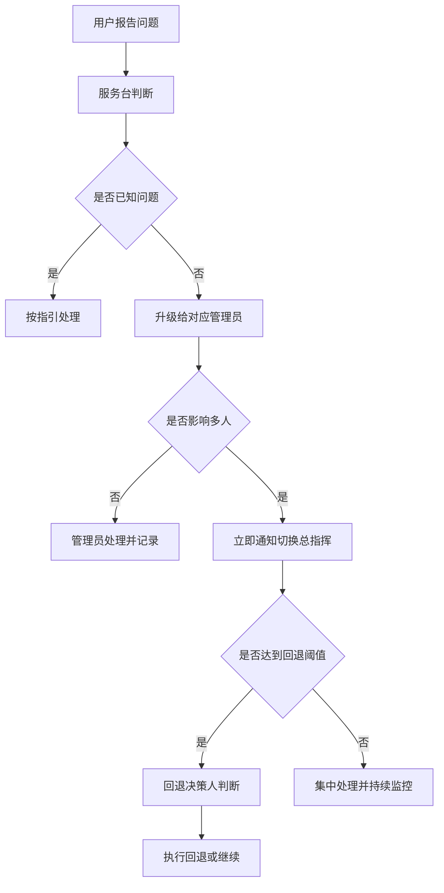

# 第6篇 上线运维与培训 · 第2节 上线准备与切换计划

> **所属：** 第6篇 上线、运维与培训。  
> **本节小节：** 6.15 ～ 6.22。  
> **本节性质：** 计划编制。**本节的产出物是切换当天所有人手里的那份"作战计划"。**  
> **前置条件：** 已完成[第1节](01-试点实施.md)，试点报告已批准。  
> **导航：** [返回第6篇目录](README.md)｜上一节：[试点实施](01-试点实施.md)｜下一节：[正式切换执行](03-正式切换执行.md)

---

## 6.15 本节目标

完成本节后应当产出**五份文档**：

1. 正式上线范围与批次表。
2. 切换时间表（细化到小时）。
3. 人员排班表（含值守与升级路径）。
4. 用户通知与培训计划。
5. 回退决策文件（触发阈值、决策人、执行步骤）。

> **必做：** 这五份文档必须**分发到每个参与者手里**，而不是只存在项目经理的电脑上。切换当天没有人有时间去问"下一步该干什么"。

---

## 6.16 确定上线范围与批次

### 6.16.1 批次划分原则（汇总前面各篇）

| 原则 | 来源 |
|---|---|
| 同一部门尽量同批 | 第3篇 3.58 |
| **有委派关系的用户必须同批** | 第3篇 3.58 |
| 关键部门不放首批，也不放最后 | 第3篇 3.58 |
| 每批规模匹配服务台能力 | 第2篇 2.102 |
| 避开财务月结、报税、发薪、业务高峰 | 第3篇 3.58 |
| 大邮箱用户提前评估或单独安排 | 第3篇 3.58 |
| 出差、休假人员单独安排 | 第2篇 2.111 |

### 6.16.2 批次表

| 批次 | 计划日期 | 范围 | 人数 | 负责人 | 现场支持 | 进入条件 | 完成条件 |
|---|---|---|---|---|---|---|---|
| 第1批 | 待填写 | IT + 试点扩展 | — | — | 是 | 试点报告批准 | 无 P1/P2 |
| 第2批 | 待填写 | 某业务部门 | — | — | 是 | 第1批稳定 | 无 P1 |
| 第3批 | 待填写 | 其他部门 | — | — | 部分 | 第2批稳定 | 无 P1 |
| 第4批 | 待填写 | 财务、管理层及助理 | — | — | 是 | 前批全部稳定 | 无 P1 |
| 收尾 | 待填写 | 出差、休假、例外 | — | — | 按需 | — | 清零 |

### 6.16.3 一次性上线还是分批

| 方式 | 适合 | 风险 |
|---|---|---|
| 一次性全员切换 | 人数少（如 50 人以下）、结构简单 | 风险集中，服务台压力大 |
| **分批切换** | 多数企业 | 周期长，需管理共存期 |

> **推荐：** 即使人数不多，也建议**至少分成两批**：先切一个部门，观察 1～2 个工作日，再切其余。多花两天，能显著降低"全公司同时出问题"的风险。

---

## 6.17 切换时间表（细化到小时）

以邮件切换为核心（引用第3篇 3.76），整合其他工作：

| 时间 | 动作 | 负责人 | 完成确认 |
|---|---|---|---|
| T-14 天 | 第一次用户通知；培训安排发布 | 项目经理 | ☐ |
| T-7 天 | 第二次通知 + 图文指引发布 | 项目经理 | ☐ |
| T-7 天 | 员工培训场次开始 | 培训负责人 | ☐ |
| T-3 天 | 第三次提醒；确认排班 | 项目经理 | ☐ |
| T-2 天 | **调低 DNS TTL** | 网络管理员 | ☐ |
| T-1 天 | **冻结变更** | IT 负责人 | ☐ |
| T-1 天 | 最后一次常规增量同步 | 邮件管理员 | ☐ |
| T-1 天 | 放行清单最终确认（第3篇 3.75） | 两人签字 | ☐ |
| **T 时刻** | **通知用户停止使用旧系统** | 项目经理 | ☐ |
| T+0.5h | 修改 MX 与 Autodiscover | 网络管理员 | ☐ |
| T+1h | 执行最后一次增量同步 | 邮件管理员 | ☐ |
| T+1h | 启用正式安全策略（如有待启用项） | 安全管理员 | ☐ |
| T+2h | 完成迁移批次并核对差异 | 邮件管理员 | ☐ |
| T+2h | 执行验证用例（第3篇 3.81） | 测试负责人 | ☐ |
| T+3h | 用户开始使用新邮箱、配置客户端 | 服务台 | ☐ |
| **T+4h** | **回退决策点** | 决策人 | ☐ |
| T+8h | 当日总结；未完成项登记 | 项目经理 | ☐ |
| T+1 天 | 检查旧系统误投并补投 | 邮件管理员 | ☐ |
| T+3 天 | 稳定确认；连续 3 天检查完成 | 邮件管理员 | ☐ |
| T+7 天 | 第一周检查（第4节） | 项目经理 | ☐ |

### 6.17.1 时间选择建议

| 建议 | 原因 |
|---|---|
| **周五晚间或周六上午** | 留出周末缓冲 |
| 不选月末月初 | 财务结账 |
| 不选长假前一天 | 出问题无人处理 |
| 不选重要客户活动期间 | 减少业务影响 |
| 保证切换后至少 4 小时有人值守 | 问题高发期 |

> **高风险：** 绝对不要"周五下午 5 点开始切、6 点下班"。这是最常见也最危险的安排。

---

## 6.18 人员排班与升级路径

### 6.18.1 排班表

| 角色 | 姓名 | 联系方式 | 值守时段 | 职责 |
|---|---|---|---|---|
| 切换总指挥 | 待填写 | 待填写 | 全程 | 统一决策 |
| **回退决策人** | 待填写 | 待填写 | 全程 | 宣布是否回退 |
| 邮件管理员 | 待填写 | 待填写 | 全程 | 迁移与邮件追踪 |
| 网络/DNS 负责人 | 待填写 | 待填写 | T-2 天至 T+4h | DNS 变更与验证 |
| 身份管理员 | 待填写 | 待填写 | 全程 | 登录与策略问题 |
| 终端负责人 | 待填写 | 待填写 | T+3h 起 | 客户端配置 |
| 服务台（多人） | 待填写 | 待填写 | T+3h 起加强 | 用户支持 |
| 业务联系人（各部门） | 待填写 | 待填写 | T+3h 起 | 业务侧协调 |
| 备份联系人 | 待填写 | 待填写 | 全程 | 主责人失联时接替 |

### 6.18.2 升级路径

> **必做：** 每个角色都要有**备份联系人**。切换当天主责人临时失联（生病、信号问题）而无人接替，会让整个计划瘫痪。

---

## 6.19 上线前技术检查（放行清单汇总）

汇总前五篇的放行条件，切换前逐项确认：

### 6.19.1 身份与访问

| 编号 | 检查项 | 引用 | 状态 |
|---|---|---|---|
| R1 | 所有目标用户账号已创建、许可已分配 | 第2篇 2.54 | ☐ |
| R2 | MFA 已在目标范围启用并验证 | 第2篇 2.119 | ☐ |
| R3 | 紧急访问账号可用、演练通过 | 第2篇 2.19 | ☐ |
| R4 | 条件访问策略已验证，紧急账号已排除 | 第2篇 2.99 | ☐ |
| R5 | 身份同步稳定、错误已清零（如适用） | 第2篇 2.70 | ☐ |

### 6.19.2 邮件

| 编号 | 检查项 | 引用 | 状态 |
|---|---|---|---|
| R6 | 全部收件对象已创建（含别名） | 第3篇 3.17 | ☐ |
| R7 | 共享邮箱权限已还原、登录已阻止 | 第3篇 3.17 | ☐ |
| R8 | 邮件流规则与安全策略已生效 | 第3篇 3.24、3.35 | ☐ |
| R9 | SPF/DKIM/DMARC 已就绪并实发验证 | 第2篇 2.39 | ☐ |
| R10 | 首次同步完成、增量同步正常 | 第3篇 3.74 | ☐ |
| R11 | DNS TTL 已调低并过原 TTL 周期 | 第3篇 3.75 | ☐ |
| R12 | DNS 原值已逐字记录 | 第3篇 3.75 | ☐ |

### 6.19.3 终端与协作

| 编号 | 检查项 | 引用 | 状态 |
|---|---|---|---|
| R13 | Office 已部署，高风险依赖已通过 | 第4篇 4.29 | ☐ |
| R14 | 宏安全已配置，企业宏可用 | 第4篇 4.42 | ☐ |
| R15 | Teams 策略已生效并验证 | 第4篇 4.67 | ☐ |
| R16 | 会议质量达到基线 | 第4篇 4.83 | ☐ |
| R17 | 文件存放规则已发布、共享默认值已收紧 | 第4篇 4.95、4.102 | ☐ |
| R18 | 文件迁移完成并验证（如适用） | 第4篇 4.118 | ☐ |

### 6.19.4 安全与恢复

| 编号 | 检查项 | 引用 | 状态 |
|---|---|---|---|
| R19 | 审计已开启并可查询 | 第5篇 5.22 | ☐ |
| R20 | 安全告警已配置并实测接收 | 第5篇 5.14 | ☐ |
| R21 | 保留策略已配置并测试 | 第5篇 5.35 | ☐ |
| R22 | 恢复演练已完成（含勒索场景） | 第5篇 5.60 | ☐ |
| R23 | 例外清零表已建立并有跟踪机制 | 第5篇 5.14 | ☐ |

### 6.19.5 支持与准备

| 编号 | 检查项 | 状态 |
|---|---|---|
| R24 | 非人账号（打印机、业务系统）改造完成 | ☐ |
| R25 | 用户通知已发出（至少三次） | ☐ |
| R26 | 图文指引已发布（MFA、Outlook、手机、文件） | ☐ |
| R27 | 员工培训已完成或已安排 | ☐ |
| R28 | 服务台已排班、指引就绪 | ☐ |
| R29 | 回退方案已批准、决策人在岗 | ☐ |
| R30 | 变更冻结已生效 | ☐ |
| R31 | 服务健康状态正常，无进行中平台事件 | ☐ |

> **必做：** R1～R31 未全部通过，不得开始切换。允许带**已批准的例外**上线，但必须书面记录例外内容、影响和责任人。

---

## 6.20 用户通知与培训计划

### 6.20.1 三次通知的内容差异

| 时间 | 重点 |
|---|---|
| **T-14 天** | 为什么要做、什么时候做、对你有什么影响、培训怎么参加 |
| **T-7 天** | 具体要做什么（图文指引）、切换期间注意事项、常见问题 |
| **T-3 天** | 提醒 + 求助方式 + 关键时间点 |

### 6.20.2 通知必须包含的七项

1. 切换时间（精确到小时）。
2. 期间的影响（可能短暂收不到邮件、请勿使用旧系统）。
3. **切换后要用户做什么**（登录、配置 Outlook、配置手机）。
4. 哪些内容需要用户自己重建（规则、签名）。
5. 常见问题（5～8 个）。
6. 求助方式与值班时间。
7. 紧急外部沟通的替代方式（电话）。

### 6.20.3 重点人群的额外沟通

| 人群 | 额外动作 |
|---|---|
| 管理层与助理 | 一对一说明 + 现场支持承诺 |
| 财务 | 避开结账期确认；重申账号变更须电话核实（第3篇 3.34） |
| 销售与客服 | 建议提前告知重要客户 |
| 分支机构 | 确认当地有人协助 |
| 出差人员 | 单独安排时间 |

---

## 6.21 回退决策文件

### 6.21.1 必须写明的内容

| 字段 | 内容 |
|---|---|
| **触发阈值** | 例如：切换后 2 小时内外部邮件完全无法接收；或影响人数超过 `___` 人；或 P1 问题持续超过 `___` 分钟 |
| **最晚决策时间** | 例如 T+4 小时 |
| **决策人** | 业务负责人 + IT 负责人共同确认（写明姓名与联系方式） |
| 执行人 | 具体到人 |
| 回退步骤 | 按顺序：恢复 DNS 原值 → 通知用户 → 验证旧系统 |
| **增量数据处理** | 切换后进入云端的新邮件如何导出补回、如何去重 |
| 用户通知 | 模板与发布渠道 |
| 验证方法 | 用与切换相同的用例验证旧系统 |
| 证据保存 | 截图、日志、报告的保存位置 |
| 再次上线条件 | 修复哪些问题、重新测试哪些项 |

### 6.21.2 关于回退门槛的提醒

> **高风险：** 邮件切换的回退**不干净**（第3篇 3.83）：已进入云端的邮件在旧系统中不存在，需导出补回并可能重复。
>
> 因此：
> - 回退门槛应**高于**普通变更。
> - 个别用户或个别功能异常**不回退**，单独处理。
> - 回退必须由决策人**正式宣布**，执行人不得自行决定。
> - 重点应放在"通过充分准备使回退不必发生"。

---

## 6.22 本节完成检查表

- [ ] 上线范围与批次表已确定，遵循委派同批、避开高峰等原则。
- [ ] 即使人数不多也已至少分为两批。
- [ ] 切换时间表已细化到小时，含负责人和完成确认栏。
- [ ] 时间选择合理（周末缓冲、避开月末与假期前）。
- [ ] 切换后至少 4 小时有人值守。
- [ ] 排班表已完成，**每个角色都有备份联系人**。
- [ ] 升级路径已明确并培训到服务台。
- [ ] **放行清单 R1～R31 已逐项确认**；例外已书面批准。
- [ ] 三次用户通知已计划，内容覆盖七项要点。
- [ ] 图文指引已发布（MFA、Outlook、手机、文件）。
- [ ] 重点人群（管理层、财务、销售、分支、出差）已有针对性沟通安排。
- [ ] 员工培训已完成或已排期（第9节）。
- [ ] **回退决策文件已完成并批准**，含触发阈值、最晚决策时间、决策人和增量数据处理。
- [ ] 回退门槛已明确高于普通变更，且规定由决策人正式宣布。
- [ ] 五份核心文档已分发到每个参与者手中。

> **进入下一节的条件：** 五份文档已批准并分发、放行清单已通过。下一节执行正式切换。
