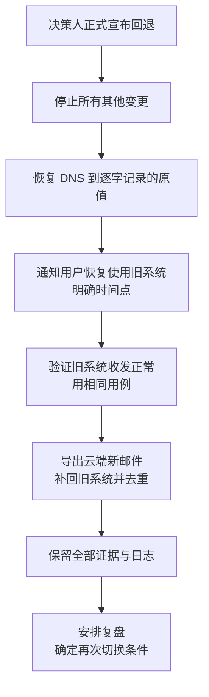

# 第6篇 上线运维与培训 · 第3节 正式切换执行

> **所属：** 第6篇 上线、运维与培训。  
> **本节小节：** 6.23 ～ 6.33。  
> **本节性质：** 执行。**本节是全项目风险最集中的几个小时，纪律比技巧更重要。**  
> **前置条件：** 已完成[第2节](02-上线准备与切换计划.md)，放行清单 R1～R31 已通过，五份文档已分发。  
> **导航：** [返回第6篇目录](README.md)｜上一节：[上线准备与切换计划](02-上线准备与切换计划.md)｜下一节：[上线后验收与交接](04-上线后验收与交接.md)

---

## 6.23 切换当天的三条铁律

在讲具体步骤之前，先明确纪律。这三条在真实项目中被违反的次数最多，代价也最大。

| 铁律 | 说明 | 违反后果 |
|---|---|---|
| **1. 只做计划内的变更** | 计划外的任何配置修改都需切换总指挥批准并记录 | 出问题时无法判断是哪个动作造成的 |
| **2. 所有操作都要记录** | 谁、什么时间、做了什么、结果如何 | 事后无法复盘，回退时不知道改了什么 |
| **3. 回退由决策人宣布** | 执行人不得自行决定回退 | 半回退状态最难处理 |

> **高风险：** 最危险的行为是"**边出问题边改配置**"。多人同时调整不同设置，会迅速让环境进入无人能说清的状态，此时连回退都无法可靠执行。

---

## 6.24 切换当天时间表执行

按第2节 6.17 的时间表执行。每完成一项，由负责人**当场确认**并记录时间。

### 6.24.1 执行记录表（当天填写）

| 时间 | 计划动作 | 实际时间 | 执行人 | 结果 | 备注 |
|---|---|---|---|---|---|
| T-2 天 | 调低 DNS TTL | 待填写 | 待填写 | ☐ | — |
| T-1 天 | 冻结变更 | 待填写 | 待填写 | ☐ | — |
| T-1 天 | 最后一次常规增量 | 待填写 | 待填写 | ☐ | — |
| T-1 天 | 放行清单签字 | 待填写 | 两人 | ☐ | — |
| T | 通知停写 | 待填写 | 待填写 | ☐ | — |
| T+0.5h | 修改 MX / Autodiscover | 待填写 | 待填写 | ☐ | 记录原值与新值 |
| T+1h | 最后一次增量同步 | 待填写 | 待填写 | ☐ | — |
| T+1h | 启用正式安全策略 | 待填写 | 待填写 | ☐ | — |
| T+2h | 完成迁移批次 | 待填写 | 待填写 | ☐ | — |
| T+2h | 执行验证用例 | 待填写 | 待填写 | ☐ | 见 6.28 |
| T+3h | 用户开始使用 | 待填写 | 待填写 | ☐ | — |
| T+4h | 回退决策点 | 待填写 | 决策人 | ☐ | **记录决策结论** |

> **必做：** 即使决定"继续、不回退"，也必须在 T+4h **正式记录这个决策**。没有明确决策点的项目容易在问题积累后错过回退窗口。

---

## 6.25 第一步：冻结变更

### 6.25.1 冻结范围（汇总前面各篇）

| 冻结项 | 原因 |
|---|---|
| 不新建、不删除邮箱和账号 | 保持映射表一致 |
| 不修改邮件地址与别名 | 避免投递错乱 |
| 不修改共享邮箱权限 | 便于对比验证 |
| 不调整条件访问与 MFA 策略 | 避免叠加故障 |
| 不修改邮件流规则与安全策略 | 隔离问题来源 |
| 不做计划外的 DNS 变更 | 只执行计划内变更 |
| 不部署新的客户端版本 | 减少变量 |
| 不调整 Teams 与共享策略 | 同上 |
| 不启用新的设备合规要求 | 同上 |

### 6.25.2 例外处理

- 紧急入职/离职需走特批，并**书面记录**。
- 修复切换问题所需的变更，需切换总指挥批准。
- 所有例外在切换后统一复核。

---

## 6.26 第二步：通知停写并停止旧系统使用

| 动作 | 要点 |
|---|---|
| 发出停写通知 | 明确时间点："从 X 时起请不要再用旧邮箱收发邮件" |
| 内容具体 | 说清此刻该做什么、别做什么，不要只说"系统维护" |
| 重点人群单独确认 | **电话或当面**确认管理层、销售、客服已停止使用 |
| 技术层面限制（如可行） | 在源系统限制新数据写入 |
| 记录停写时间 | 用于后续核对最后增量的覆盖范围 |

> **必做：** 停写是"最后一次增量能覆盖全部数据"的前提（第3篇 3.77）。停写后仍有人在旧系统收发，这部分邮件很可能丢失或需事后手工补迁。

---

## 6.27 第三步：执行 DNS 与迁移切换

### 6.27.1 DNS 变更

按第3篇 3.78 执行，要点：

- [ ] 使用管理中心给出的**实际值**，不凭记忆。
- [ ] 修改 MX、Autodiscover。
- [ ] **确认无旧 MX 记录残留**。
- [ ] 不动网站记录和第三方验证记录。
- [ ] 从**两个不同网络**、多个公共 DNS 查询验证。
- [ ] 截图留档并记录查询时间。

### 6.27.2 最后一次增量与完成批次

- [ ] 触发最后一次增量同步，**等待完成**。
- [ ] 核对差异，重点看停写前最后几小时的邮件。
- [ ] 若方式不支持增量：执行事先设计的人工补迁（第3篇 3.79）。
- [ ] 完成迁移批次，确认目标邮箱已成为主邮箱。
- [ ] 保存最终迁移报告。

### 6.27.3 启用待启用的安全策略

如有计划在切换时启用的策略（例如某些条件访问或安全策略）：

- [ ] 一次只启用一项，逐项验证。
- [ ] 验证紧急访问账号仍可登录（第2篇 2.96）。
- [ ] 验证普通用户可正常登录。
- [ ] 记录启用时间。

> **高风险：** 不要在切换窗口内同时启用多条高影响策略。如果可以，把安全策略的启用安排在切换**之前**已完成、或切换稳定**之后**再做。

---

## 6.28 第四步：验证（必须实测）

### 6.28.1 核心验证用例（切换后 30 分钟内）

| 编号 | 测试内容 | 期望结果 | 状态 |
|---|---|---|---|
| C1 | 内部用户互发邮件 | 正常 | ☐ |
| C2 | **从外部邮箱发到企业地址** | 进入云端邮箱 | ☐ |
| C3 | 从企业地址发到外部邮箱 | 送达且不进垃圾箱 | ☐ |
| C4 | 发到共享邮箱 | 正常收到 | ☐ |
| C5 | 以共享邮箱身份对外发信 | 发件人显示正确 | ☐ |
| C6 | 发到通讯组 | 全部成员收到 | ☐ |
| C7 | 会议室预订 | 按规则处理 | ☐ |
| C8 | 委派访问他人邮箱 | 可访问 | ☐ |
| C9 | 打印机/业务系统发信 | 正常送达 | ☐ |
| C10 | 新建 Outlook 配置文件 | 自动配置成功 | ☐ |
| C11 | 手机端添加账号 | 正常收发 | ☐ |
| C12 | 检查外部收到邮件的邮件头 | 认证与对齐符合预期 | ☐ |
| C13 | 检查隔离区 | 无大量正常邮件被拦 | ☐ |
| C14 | 抽查迁移数据（日历、联系人、大附件） | 完整可用 | ☐ |
| C15 | **确认旧系统不再收到新邮件** | 无新邮件 | ☐ |
| C16 | Teams 登录与会议 | 正常 | ☐ |
| C17 | 文件访问与共同编辑 | 正常 | ☐ |
| C18 | 紧急访问账号登录 | 成功且触发告警 | ☐ |

### 6.28.2 必须 100% 核对的对象

| 对象 | 要求 |
|---|---|
| 大邮箱用户 | **全部** |
| 共享邮箱 | **全部** |
| 有委派关系的用户 | **全部** |
| 管理层与助理 | **全部** |
| 普通用户 | 抽查 10%，不少于 3 人 |

---

## 6.29 第五步：用户开始使用与现场支持

### 6.29.1 支持安排

| 时段 | 安排 |
|---|---|
| T+3h 起 | 服务台加强值守，专人处理切换工单 |
| 首日 | 管理层与财务安排现场或一对一支持 |
| 首日 | 分支机构有当地联系人协助 |
| 首日 | 每 2 小时统计工单类型与数量 |

### 6.29.2 高频工单预判与准备

| 预判工单 | 准备 |
|---|---|
| Outlook 配置不上 | 图文指引 + 清理凭据步骤（第3篇 3.87） |
| 手机收不到邮件 | iOS/Android 图文指引（第3篇 3.89） |
| 共享邮箱看不到 | 手工添加步骤（第3篇 3.88） |
| 发件人显示不对 | 权限核对（第3篇 3.88） |
| 收不到某封邮件 | 邮件追踪流程（第3篇 3.40） |
| 邮箱规则没了 | 个人规则清单（第3篇 3.90） |
| MFA 验证问题 | 处理流程（第2篇 2.115） |
| 找不到文件 | 存放规则说明（第4篇 4.86） |

> **推荐：** 把上面每一项做成**一页纸的处理卡片**，服务台人手一份。切换当天没有时间翻长文档。

---

## 6.30 第六步：监控

### 6.30.1 监控项与频率

| 监控项 | 频率 | 异常信号 |
|---|---|---|
| 是否收到第一封外部邮件 | 切换后立即 | 30 分钟内无外部邮件 |
| 邮件流量趋势 | 每小时 | 明显低于历史同期 |
| 退信数量 | 每小时 | 突增（常为漏建地址） |
| 隔离区新增 | 每 2 小时 | 大量正常邮件被隔离 |
| 旧系统是否仍收到邮件 | 每小时 | 说明 DNS 缓存或残留 |
| 登录失败数量 | 每小时 | 策略问题 |
| 工单数量与类型 | 实时 | 集中出现同类问题 |
| 服务健康状态 | 每小时 | 平台事件 |

### 6.30.2 监控记录表

| 时间 | 外部邮件 | 退信数 | 隔离新增 | 旧系统新邮件 | 登录失败 | 工单数 | 备注 |
|---|---|---|---|---|---|---|---|
| T+1h | 待填写 | — | — | — | — | — | — |
| T+2h | 待填写 | — | — | — | — | — | — |
| T+4h | 待填写 | — | — | — | — | — | — |
| T+8h | 待填写 | — | — | — | — | — | — |

---

## 6.31 问题分级与批次完成确认

### 6.31.1 当天问题分级

| 等级 | 定义 | 当天动作 |
|---|---|---|
| **P1** | 大量用户无法收发邮件或登录 | 立即通知总指挥；评估回退 |
| P2 | 一个部门或关键人员无法工作 | 优先修复；评估是否暂停下一批 |
| P3 | 有替代办法的功能异常 | 记录，限期修复 |
| P4 | 使用不便或咨询 | 纳入知识库 |

### 6.31.2 批次完成确认

本批次完成需满足：

- [ ] 验证用例 C1～C18 全部通过。
- [ ] 100% 核对对象（大邮箱、共享邮箱、委派、管理层）已确认。
- [ ] P1 数量为 0。
- [ ] P2 已修复或有可用替代方案。
- [ ] 未完成客户端配置的用户名单已建立并跟进。
- [ ] 监控指标恢复正常范围。
- [ ] 本批次总结已记录。

> **必做：** 上一批未完成确认，**不开始下一批**。赶进度跳过确认，问题会累积到后面批次一起爆发。

---

## 6.32 回退决策与执行

### 6.32.1 决策判断

| 情况 | 建议 |
|---|---|
| 外部邮件完全无法接收且短时间内无法定位 | 考虑回退 |
| 大量正常邮件被拒收 | 先定位（常为漏建地址），可快速修则不回退 |
| 迁移数据大面积缺失 | 考虑回退并重新规划 |
| 个别用户或个别功能异常 | **不回退**，单独处理 |
| DNS 部分未生效 | **不回退**，等待并监控 |
| 达到预设触发阈值 | 按回退决策文件执行 |

### 6.32.2 若决定回退

> **高风险：** 回退过程本身也要**只做计划内动作、全程记录**。回退时慌乱操作造成的损失，有时比原问题更大。

---

## 6.33 本节完成检查表

- [ ] 三条铁律已向所有参与者明确（只做计划内变更、全程记录、回退由决策人宣布）。
- [ ] 执行记录表已在当天实时填写。
- [ ] 变更冻结已生效；例外均有书面记录。
- [ ] 停写通知已发出；重点人群已电话或当面确认。
- [ ] 停写时间已记录。
- [ ] DNS 变更已按实际值执行，**无旧 MX 残留**，已从两个网络验证并截图。
- [ ] 最后一次增量已完成并核对差异；不支持增量的已执行人工补迁。
- [ ] 迁移批次已完成，报告已保存。
- [ ] 待启用的安全策略逐项启用并验证，含紧急账号登录验证。
- [ ] 验证用例 C1～C18 已全部执行并记录。
- [ ] 大邮箱、共享邮箱、委派用户、管理层**已 100% 核对**。
- [ ] 服务台已加强值守；一页纸处理卡片已发放。
- [ ] 监控记录表已按频率填写。
- [ ] 问题已分级并指派；P1 为 0。
- [ ] 批次完成确认已完成；未完成确认前未开始下一批。
- [ ] **T+4h 回退决策已正式记录**（无论结论）。
- [ ] 若回退：已按流程执行并保留证据，已安排复盘。

> **进入下一节的条件：** 本批次完成确认通过、P1 为 0。下一节进行上线后的观察、验收与项目交接。
