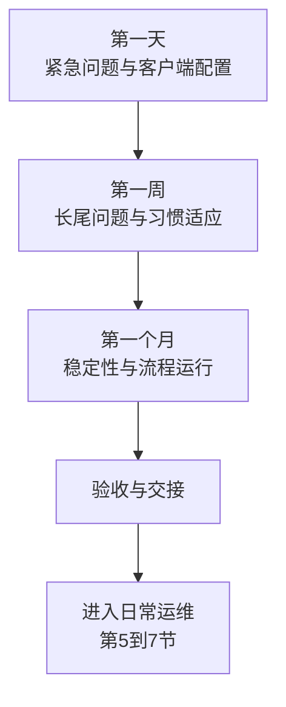

# 第6篇 上线运维与培训 · 第4节 上线后验收与交接

> **所属：** 第6篇 上线、运维与培训。  
> **本节小节：** 6.34 ～ 6.40。  
> **本节性质：** 收尾与移交。**项目在这里从"实施"转为"运维"，交接不清是后续所有问题的根源。**  
> **前置条件：** 已完成[第3节](03-正式切换执行.md)，全部批次完成确认。  
> **导航：** [返回第6篇目录](README.md)｜上一节：[正式切换执行](03-正式切换执行.md)｜下一节：[日常巡检与运维职责](05-日常巡检与运维职责.md)

---

## 6.34 上线后的三个观察阶段

### 6.34.1 第一天检查

| 检查项 | 状态 |
|---|---|
| 内外部邮件收发正常 | ☐ |
| 未完成客户端配置的用户名单已建立 | ☐ |
| 高频问题已识别并有处理指引 | ☐ |
| 旧系统是否仍收到新邮件（需补投） | ☐ |
| 隔离区无大量正常邮件 | ☐ |
| 登录失败无异常增长 | ☐ |
| 当日问题已登记并分级 | ☐ |
| 次日支持安排已确认 | ☐ |

### 6.34.2 第一周检查

| 检查项 | 状态 |
|---|---|
| 客户端配置未完成名单已清零 | ☐ |
| **连续 3 天旧系统无新邮件**（第3篇 3.82） | ☐ |
| 误投旧系统的邮件已全部补投 | ☐ |
| 邮箱规则、签名、自动回复重建情况已跟踪 | ☐ |
| 共享邮箱与委派权限问题已清理 | ☐ |
| 手机端问题已处理 | ☐ |
| 会议质量反馈已收集 | ☐ |
| 文件访问与权限问题已处理 | ☐ |
| 打印机与业务系统发信稳定 | ☐ |
| 工单量呈下降趋势 | ☐ |
| P2 及以上问题已关闭或有方案 | ☐ |

### 6.34.3 第一个月检查

| 检查项 | 状态 |
|---|---|
| 邮件流量恢复正常水平 | ☐ |
| 已完整经历一个业务周期（如月结） | ☐ |
| 财务的宏与开票工具在真实月结中验证通过 | ☐ |
| MFA 注册率已达标并清零 | ☐ |
| 入职、离职流程已实际运行过 | ☐ |
| 巡检已开始执行（第5节） | ☐ |
| 例外清零表有进展 | ☐ |
| 用户满意度已收集 | ☐ |
| 遗留问题已列入改进计划 | ☐ |

> **必做：** **"完整经历一个业务周期"**是验收的硬条件。很多问题只在月结、报税、发薪时暴露（例如某个宏一个月才用一次）。不经历一个周期就宣布验收，风险很大。

---

## 6.35 旧系统下线判断

汇总第3篇 3.92（邮件）与第4篇 4.116（文件）的条件：

### 6.35.1 旧邮件系统

| 编号 | 条件 | 状态 |
|---|---|---|
| D1 | 全部邮箱迁移完成，失败项已处理 | ☐ |
| D2 | 数据完整性已抽查验证 | ☐ |
| D3 | 连续至少 3 天无新邮件进入 | ☐ |
| D4 | 误投邮件已全部补投 | ☐ |
| D5 | 公共文件夹、归档已处理 | ☐ |
| D6 | 无人再使用旧系统 | ☐ |
| D7 | 打印机与业务系统发信已改造完成 | ☐ |
| D8 | 第三方集成已切换并测试 | ☐ |
| D9 | 法务、审计、合规保留要求已确认 | ☐ |
| D10 | 已独立备份并验证可恢复 | ☐ |
| D11 | 已通过一个完整业务周期 | ☐ |
| D12 | 下线已获业务与管理层书面批准 | ☐ |

### 6.35.2 旧文件服务器/共享盘

| 编号 | 条件 | 状态 |
|---|---|---|
| D13 | 全部目标目录迁移完成 | ☐ |
| D14 | 数据完整性验证通过 | ☐ |
| D15 | 连续一段时间无人访问 | ☐ |
| D16 | **依赖旧路径的脚本、系统、映射驱动器已改造** | ☐ |
| D17 | 合规保留要求已确认 | ☐ |
| D18 | 已独立备份并验证可恢复 | ☐ |
| D19 | 下线已获批准 | ☐ |

> **高风险：** D16 是最容易遗漏的一项。共享盘下线后，某个每月自动跑的报表脚本突然失败，而写脚本的人可能已经离职（第4篇 4.116）。

### 6.35.3 本地 Exchange 的特别提醒

若源系统是本地 Exchange（第3篇 3.92.3）：

- Exchange Server 2016/2019 已于 2025-10-14 终止支持；扩展安全更新程序于 **2026 年 10 月**结束。
- 若因管理需要保留本地 Exchange，应评估升级到订阅版，而不是长期运行已终止支持的版本。
- 保留期间必须继续打补丁与做安全防护。

---

## 6.36 项目验收清单（汇总全书）

### 6.36.1 各篇验收状态汇总

| 篇 | 验收清单 | 状态 | 证据位置 |
|---|---|---|---|
| 第1篇 | 规划交付物（15 项） | ☐ | 待填写 |
| 第2篇 | 身份与 MFA 验收（含测试 F1～F14） | ☐ | 待填写 |
| 第3篇 | 邮件迁移验收（含 C1～C16） | ☐ | 待填写 |
| 第4篇 | 终端与协作验收（含 P、M、F 系列） | ☐ | 待填写 |
| 第5篇 | 安全与合规验收（V1～V40） | ☐ | 待填写 |
| 第6篇 | 上线与运维验收（本节） | ☐ | 待填写 |

### 6.36.2 上线与运维验收项

| 编号 | 验收项 | 标准 | 状态 |
|---|---|---|---|
| A1 | 全部批次完成 | 无遗漏用户 | ☐ |
| A2 | 客户端配置 | 未完成数为 0 | ☐ |
| A3 | MFA 注册率 | 达到批准阈值 | ☐ |
| A4 | P1 问题 | 0 | ☐ |
| A5 | P2 问题 | 已关闭或有批准方案 | ☐ |
| A6 | 稳定观察期 | 连续 `___` 个工作日无新增严重故障 | ☐ |
| A7 | 完整业务周期 | 已通过 | ☐ |
| A8 | 巡检 | 已开始执行 | ☐ |
| A9 | 入转离流程 | 已实际运行 | ☐ |
| A10 | 变更管理 | 已开始执行 | ☐ |
| A11 | 安全事件流程 | 已建立并演练 | ☐ |
| A12 | 培训 | 管理员与员工已完成 | ☐ |
| A13 | 知识库 | 已建立并有内容 | ☐ |
| A14 | **迁移账号与临时凭据已回收** | 已回收 | ☐ |
| A15 | **例外清零表** | 有进展与跟踪机制 | ☐ |
| A16 | 文档 | 已移交并可维护 | ☐ |

> **必做：** A14 常被遗忘。迁移期创建的高权限账号、临时排除项、临时允许列表，都要在验收时确认回收（第3篇 3.68）。

---

## 6.37 未完成事项与剩余风险登记

诚实登记比"报告一切完美"更有价值。

| 编号 | 未完成事项 | 原因 | 影响 | 责任人 | 计划完成日期 | 风险接受人 |
|---|---|---|---|---|---|---|
| 待填写 | 待填写 | 待填写 | 待填写 | 待填写 | 待填写 | 待填写 |

### 6.37.1 常见的遗留项

| 遗留项 | 说明 |
|---|---|
| 部分业务系统仍用基本认证发信 | 需持续跟踪至改造完成 |
| 保留的旧版 Office 或 32 位环境 | 需设定淘汰计划 |
| 未升级的 Windows 10 设备 | 与第4篇 4.5 相关 |
| 敏感度标签或 DLP 未实施 | **优先级原因**（E3 已含标签与 DLP，不是许可障碍；第5篇 5.30、5.31） |
| 备份方案待采购 | 需明确决策时间 |
| 某些来宾账号仍在使用 | 项目未结束 |
| 公共文件夹未迁移 | 复杂度原因 |
| 部分用户 MFA 例外 | 需明确整改期限 |

> **必做：** 每一项都要有**风险接受人**（通常是 IT 负责人或业务负责人）。没有人签字接受的遗留项，实际上就是没人负责的隐患。

---

## 6.38 项目文档交接

### 6.38.1 必须交接的文档清单

| 类别 | 文档 | 状态 |
|---|---|---|
| 规划 | 现状调查、目标架构、许可清单 | ☐ |
| 身份 | 管理员清单、紧急账号方案与保管记录、条件访问策略清单 | ☐ |
| 邮件 | 收件对象对照表、映射表、迁移报告、邮件流规则清单 | ☐ |
| DNS | 变更前后记录、验证截图 | ☐ |
| 终端 | 部署配置、依赖清单、兼容性测试结果、宏与加载项方案 | ☐ |
| 协作 | 团队清单、Teams 策略清单、来宾清单 | ☐ |
| 文件 | 站点清单、权限梳理表、共享策略配置 | ☐ |
| 安全 | 基线状态表、**例外清零表**、告警清单、审计说明 | ☐ |
| 合规 | 保留需求表与配置记录 | ☐ |
| 设备 | 设备清单、BYOD 政策、合规策略 | ☐ |
| 恢复 | **备份决策书**、演练记录、**关键配置导出** | ☐ |
| 运维 | 巡检清单、入转离流程、变更流程、事件流程 | ☐ |
| 培训 | 管理员与员工培训材料、快速手册 | ☐ |
| 故障 | 故障排查手册（第10～13节）、知识库 | ☐ |
| 本方案 | 全书六篇文档 | ☐ |

### 6.38.2 交接会议

交接不是"把文件发过去"，应召开交接会议并确认：

- [ ] 接收方（运维团队）已阅读关键文档。
- [ ] 逐项讲解高风险操作和回退方法。
- [ ] 演示关键操作（紧急账号登录、邮件追踪、恢复文件）。
- [ ] 说明所有例外项和遗留风险。
- [ ] 明确后续支持方式与期限（如实施方提供的支持期）。
- [ ] 确认巡检、演练的责任人和排期。
- [ ] 双方签字确认。

> **高风险：** 如果由外部实施方交接，务必确认：**供应商的管理员账号已回收**、企业自己掌握全部管理权限和凭据（第2篇 2.18）。这是项目结束时最重要的安全动作之一。

---

## 6.39 项目总结与复盘

### 6.39.1 总结报告内容

1. 项目范围与实际完成情况。
2. 关键里程碑与实际时间对比。
3. 验收结果（各篇清单）。
4. 遇到的主要问题与解决方式。
5. 未完成事项与剩余风险。
6. 实测数据（迁移速度、工单量、会议质量）。
7. 用户反馈摘要。
8. 成本与预算对比。
9. **经验教训**（做得好的与该改进的）。
10. 后续改进计划。

### 6.39.2 复盘要回答的问题

| 问题 | 目的 |
|---|---|
| 哪些问题在试点时本应发现却没发现？ | 改进试点方法 |
| 哪些估算偏差最大？ | 改进后续项目估算 |
| 用户抱怨最多的是什么？ | 改进培训与沟通 |
| 哪些准备工作回报最高？ | 沉淀最佳实践 |
| 如果重做一次，会改变什么？ | 组织经验积累 |

> **推荐：** 复盘会议要允许**说真话**。如果只能说"项目很成功"，就失去了复盘的意义。建议先让参与者匿名提交意见。

---

## 6.40 本节完成检查表

- [ ] 第一天、第一周、第一个月检查已按清单执行并记录。
- [ ] **已完整经历一个业务周期**（含月结等场景验证）。
- [ ] 客户端配置未完成名单已清零。
- [ ] 连续 3 天旧系统无新邮件，误投邮件已补投。
- [ ] 旧邮件系统下线条件 D1～D12 已确认。
- [ ] 旧文件服务器下线条件 D13～D19 已确认，**含旧路径引用改造**。
- [ ] 若保留本地 Exchange：已评估版本支持与安全防护方案。
- [ ] 各篇验收清单状态已汇总，证据位置已记录。
- [ ] 上线与运维验收项 A1～A16 已确认。
- [ ] **迁移账号、临时凭据、临时例外已回收。**
- [ ] 未完成事项与剩余风险已登记，**每项有风险接受人签字**。
- [ ] 文档交接清单已逐项确认。
- [ ] 交接会议已召开，含关键操作演示与签字确认。
- [ ] **外部实施方的管理员账号已回收**，企业掌握全部管理权限。
- [ ] 巡检、演练的责任人与排期已确认。
- [ ] 项目总结报告已完成，含经验教训与改进计划。
- [ ] 复盘会议已召开，真实意见已收集。

> **进入下一节的条件：** 验收通过、文档已交接。**项目实施部分至此结束，下面进入长期运维。** 下一节建立日常巡检与运维职责。
