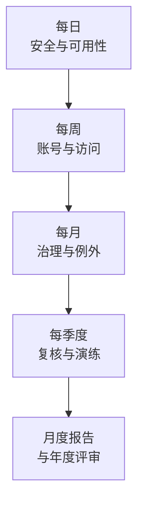
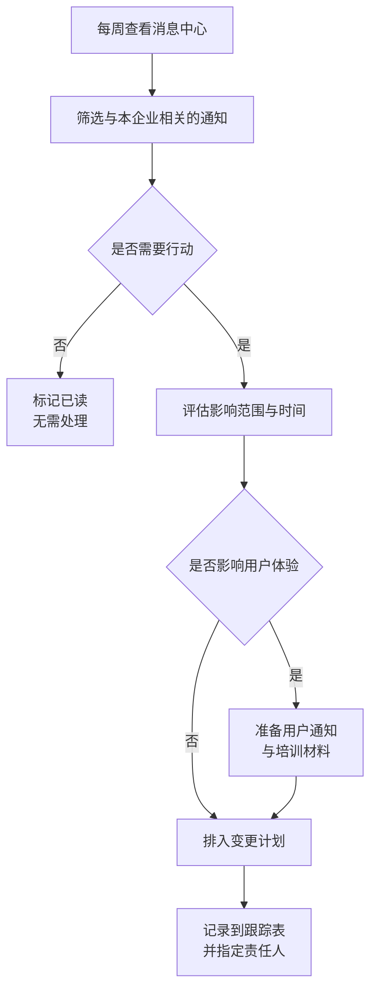

# 第6篇 上线运维与培训 · 第5节 日常巡检与运维职责

> **所属：** 第6篇 上线、运维与培训。  
> **本节小节：** 6.41 ～ 6.54。  
> **本节性质：** 长期运维。**项目结束后，这一节的内容决定环境是持续健康还是逐年劣化。**  
> **前置条件：** 已完成[第4节](04-上线后验收与交接.md)，验收通过、文档已交接。  
> **导航：** [返回第6篇目录](README.md)｜上一节：[上线后验收与交接](04-上线后验收与交接.md)｜下一节：[入职、转岗与离职标准流程](06-入转离标准流程.md)

---

## 6.41 为什么必须有巡检

Microsoft 365 是**持续变化**的环境：微软会更新功能和策略、员工会变动、外部共享会累积、例外会遗留。

| 不做巡检的典型结果（一年后） |
|---|
| 20 个离职员工的账号还能登录 |
| 100 多个匿名共享链接对外开放 |
| 三年前的供应商来宾账号仍可访问文件 |
| 一半的例外项还在生效 |
| 备份任务三个月前就失败了但无人知道 |
| 有人给自己加了全局管理员 |
| 审计功能被关掉了 |
| 恢复演练从来没做过第二次 |

> **必做：** 巡检不需要复杂工具，但**必须有固定的清单、固定的责任人和固定的频率**。没有责任人的巡检等于没有巡检。

---

## 6.42 运维职责划分

### 6.42.1 角色与职责

| 角色 | 职责 | 建议人数 |
|---|---|---|
| **Microsoft 365 主管理员** | 整体协调、跨服务问题、月度报告 | 1（+1 备份） |
| 身份管理员 | 账号、组、MFA、条件访问、同步 | 1～2 |
| 邮件管理员 | 邮箱、邮件流、邮件安全、追踪 | 1～2 |
| 协作管理员 | Teams、SharePoint、OneDrive、来宾 | 1～2 |
| 终端管理员 | Office、设备、补丁、加载项 | 1～2 |
| 安全负责人 | 告警、审计、事件、例外跟踪 | 1 |
| 服务台 | 一线支持、工单分类、用户指引 | 按规模 |
| 业务联系人（各部门） | 业务侧确认、来宾与团队复核 | 每部门 1 |

### 6.42.2 小型企业的现实安排

如果 IT 只有 1～2 人：

| 建议 | 说明 |
|---|---|
| 一人承担多角色 | 但**必须有备份人**（至少能登录并执行紧急操作） |
| 优先保证最高优先级巡检 | 见 6.44 的"最小巡检集" |
| 巡检清单化、简化 | 用检查表而非依赖记忆 |
| 关键操作留文档 | 人员流动时不至于断档 |
| 考虑外部支持 | 但**管理员权限必须企业自己掌握** |

> **高风险：** 单人运维的最大风险是**知识和权限都集中在一个人身上**。必须确保：紧急访问账号凭据由两人分别保管（第2篇 2.15）、关键操作有文档、至少一名备份人能执行基本操作。

---

## 6.43 巡检的四个频率

| 频率 | 关注 | 耗时估计 |
|---|---|---|
| 每日 | 安全告警、服务健康、异常登录 | 10～15 分钟 |
| 每周 | 新账号、未注册 MFA、来宾、不合规设备 | 30 分钟 |
| 每月 | 许可、例外、共享链接、备份任务 | 1～2 小时 |
| 每季度 | 权限复核、演练、策略复核 | 半天 |

---

## 6.44 每日巡检清单

| 编号 | 检查项 | 来源 | 异常时动作 |
|---|---|---|---|
| D1 | **安全告警**是否有新告警 | 第5篇 5.19 | 按响应流程处理 |
| D2 | **紧急访问账号是否有登录** | 第2篇 2.118 | **任何登录都要核实** |
| D3 | 服务健康状态与消息中心 | 第2篇 2.7 | 评估影响并通知 |
| D4 | MFA 相关失败登录是否异常增多 | 第2篇 2.118 | 排查是否攻击 |
| D5 | 是否有"用户拒绝验证请求"的记录 | 第2篇 2.118 | 疑似密码泄露 |
| D6 | 邮件流是否异常（流量骤变、退信突增） | 第3篇 3.41 | 排查 |
| D7 | 隔离区是否有大量正常邮件 | 第3篇 3.33 | 检查策略与根因 |
| D8 | 备份任务（如有）是否成功 | 第5篇 5.60 | **失败必须当天处理** |

### 6.44.1 最小巡检集（人力极其有限时）

如果每天只能做三件事，做这三件：

1. **看安全告警**（D1）。
2. **确认紧急账号无异常登录**（D2）。
3. **确认备份任务成功**（D8，如有备份）。

> **推荐：** 把每日巡检做成一个 10 分钟的固定动作（例如每天上班后第一件事），并用检查表打勾记录。比"想起来才看"有效得多。

---

## 6.45 每周巡检清单

| 编号 | 检查项 | 来源 | 标准 |
|---|---|---|---|
| W1 | 新入职账号是否已完成 MFA 注册 | 第2篇 2.111 | 未注册需跟进 |
| W2 | 未注册 MFA 的用户名单 | 第2篇 2.118 | 目标为 0 |
| W3 | 异常地点/时间的登录尝试 | 第2篇 2.118 | 逐项核实 |
| W4 | 离职人员账号是否已处理 | 第6节 | 与 HR 名单比对 |
| W5 | 不合规设备清单与处理进度 | 第5篇 5.47 | 跟踪至清零 |
| W6 | 长期未同步的设备 | 第5篇 5.47 | 核实是否在用 |
| W7 | 新增的外部来宾 | 第4篇 4.74 | 是否已登记 |
| W8 | 新增的外部自动转发 | 第3篇 3.23 | **逐项核实** |
| W9 | 新建的团队与站点是否符合规范 | 第4篇 4.50 | 命名、所有者 |
| W10 | 工单类型统计 | — | 发现共性问题 |

---

## 6.46 每月巡检清单

| 编号 | 检查项 | 来源 | 标准 |
|---|---|---|---|
| M1 | 许可使用情况与闲置许可 | 第2篇 2.48 | 回收闲置 |
| M2 | 管理员角色清单复核 | 第5篇 5.5 | 无未批准角色 |
| M3 | **例外清零表进展** | 第5篇 5.12 | 到期项已处理 |
| M4 | 匿名（"任何人"）共享链接 | 第4篇 4.100 | 是否仍需要 |
| M5 | 外部共享总体情况 | 第4篇 4.100 | 形成简报给业务 |
| M6 | 仍使用短信/语音验证的用户数 | 第2篇 2.118 | 应持续下降 |
| M7 | 邮件安全策略与允许列表复核 | 第3篇 3.29 | 清理到期项 |
| M8 | 操作系统与 Office 版本是否仍受支持 | 第4篇 4.5 | 制定升级计划 |
| M9 | 设备清单与在职人员比对 | 第5篇 5.47 | 发现未回收设备 |
| M10 | 备份任务与容量趋势 | 第5篇 5.60 | 成本与覆盖 |
| M11 | 审计功能是否仍正常工作 | 第5篇 5.17 | 抽查查询 |
| M12 | 月度巡检报告 | — | 发给 IT 负责人 |

### 6.46.1 月度报告建议内容

1. 本月巡检执行情况（哪些做了、哪些没做）。
2. 发现的问题与处理结果。
3. 关键指标：MFA 覆盖率、不合规设备数、匿名链接数、来宾数、例外项数。
4. 许可使用与成本。
5. 需要管理层决策的事项。
6. 下月重点。

> **推荐：** 报告要有**趋势**（与上月对比）。管理层更容易理解"匿名链接从 120 个降到 40 个"，而不是一堆绝对数字。

---

## 6.47 每季度巡检清单

| 编号 | 检查项 | 来源 | 标准 |
|---|---|---|---|
| Q1 | **紧急访问账号演练** | 第2篇 2.15 | 至少每 90 天一次 |
| Q2 | 管理员权限全面复核 | 第2篇 2.18 | 含供应商账号 |
| Q3 | 条件访问策略整体复核 | 第2篇 2.118 | 去重、清理失效 |
| Q4 | 来宾账号全面复核 | 第4篇 4.74 | 过期与无活动的移除 |
| Q5 | 站点与文件权限复核 | 第4篇 4.100 | 尤其敏感站点 |
| Q6 | 团队清单复核 | 第4篇 4.50 | 所有者、活跃度 |
| Q7 | 加载项与第三方应用复核 | 第4篇 4.40、第5篇 5.9 | 白名单有效性 |
| Q8 | 保留策略与依据复核 | 第5篇 5.35 | 法规是否变化 |
| Q9 | 设备合规与擦除能力抽查 | 第5篇 5.47 | — |
| Q10 | Office 回归测试（关键宏与插件） | 第4篇 4.33 | — |
| Q11 | 冒充防护受保护用户清单更新 | 第3篇 3.32 | 随人事变动 |
| Q12 | 知识库与文档更新 | 第13节 | — |

### 6.47.1 半年或年度动作

| 频率 | 动作 |
|---|---|
| 每半年 | **恢复演练**（含勒索场景，第5篇 5.57） |
| 每半年 | 入转离流程演练 |
| 每年 | 整体安全评审与本方案文档修订 |
| 每年 | 许可续订前的需求重新评估 |
| 每年 | 培训复训（第8、9节） |

> **必做：** Q1（紧急账号演练）和半年度恢复演练是**最容易被跳过、后果最严重**的两项。建议由 IT 负责人在日历中设置提醒，并要求提交演练记录。

> **为什么本方案的季度巡检不能省：** Entra ID P2 的**访问评审**（自动向负责人推送“这些人还需要这个权限吗”并按结果自动回收）在 E3 下不可用，本方案不采购（第1篇 1.26.5）。上表的 **Q2、Q4、Q5、Q7 就是它的人工替代**——如果这几项不做，权限只会越积越多，且没有任何机制会提醒你。这是 E3 方案里**用流程换许可**最典型的一处。

---

## 6.48 巡检记录表模板

| 日期 | 频率 | 执行人 | 检查项完成情况 | 发现问题 | 处理结果 | 备注 |
|---|---|---|---|---|---|---|
| 待填写 | 每日 | 待填写 | D1–D8 | 待填写 | 待填写 | — |
| 待填写 | 每周 | 待填写 | W1–W10 | 待填写 | 待填写 | — |
| 待填写 | 每月 | 待填写 | M1–M12 | 待填写 | 待填写 | — |
| 待填写 | 每季度 | 待填写 | Q1–Q12 | 待填写 | 待填写 | — |

> **推荐：** 巡检记录建议放在 SharePoint 列表中，便于多人协作和统计。放在个人电脑的 Excel 里，人员变动后往往就中断了。

---

## 6.49 服务健康与消息中心的处理

这是**唯一能提前知道微软要改什么**的渠道，但很多企业从不看。

| 内容 | 说明 | 动作 |
|---|---|---|
| 服务健康状态 | 当前是否有服务事件 | 有事件时通知受影响用户，避免误判为本地问题 |
| **消息中心** | 功能变更、弃用通知、强制策略 | **每周查看**，评估影响并排期应对 |
| 计划变更 | 即将推出的变化 | 提前测试与培训 |

### 6.49.1 消息中心的处理流程

### 6.49.2 需要重点关注的通知类型

| 类型 | 举例（本方案已涉及） |
|---|---|
| **弃用与退役** | 短信/语音验证退役、EWS 退役、基本认证移除 |
| 强制策略 | 强制 MFA 范围扩展 |
| 默认值变更 | 安全默认值行为调整 |
| 支持终止 | Office 与 Windows 版本 |
| 定价与计费变更 | 备份服务计费方式 |

> **必做：** 本方案中标注的所有时间线（第2篇 2.79 短信退役、第3篇 3.50 EWS、第4篇 4.5 Office 与 Windows、第5篇备份计费）都需要通过消息中心持续跟踪。**文档会过时，消息中心是权威来源。**

---

## 6.50 例外清零的持续跟踪

第5篇 5.12 建立了例外清零表，本节负责**跟踪到关闭**。

| 动作 | 频率 |
|---|---|
| 检查到期项 | 每月（M3） |
| 催办未完成项 | 每月 |
| 向 IT 负责人报告 | 每月报告中 |
| 全面复核（含长期例外） | 每季度 |
| 无法关闭的例外重新评估并续期 | 到期时 |

### 6.50.1 例外续期的要求

如果例外确实无法按期关闭：

- [ ] 说明原因和阻碍。
- [ ] 评估当前风险。
- [ ] 由**风险接受人**重新签字。
- [ ] 设定新的到期日期。
- [ ] **不允许无限期续期而不评估。**

> **高风险：** 例外的典型生命周期是"上线时 15 个 → 一年后还有 14 个"。持续跟踪是唯一的解药，而这需要月度报告的可见性来推动。

---

## 6.51 许可与成本管理

| 检查项 | 频率 | 动作 |
|---|---|---|
| 已分配 vs 已购买许可数 | 每月 | 回收闲置 |
| **Teams许可与E3用户数是否匹配** | 每月 | 含Teams SKU核对服务计划；no-Teams SKU核对适用Teams产品，避免漏配或重复采购（第1篇 1.30.1） |
| 离职人员许可是否已回收 | 每周 | 与离职流程联动 |
| 长期未登录用户的许可 | 每月 | 核实是否需要 |
| 测试账号许可 | 每月 | 项目结束应清理 |
| 需扩容共享邮箱占用的 E3 席位 | 每季度 | 确认仍有扩容需要（第1篇 1.29.1） |
| 备份服务容量与费用（如有） | 每月 | 成本趋势 |
| 续订前需求评估 | 每年 | 见下方 |

### 6.51.1 每年评估一次：是否该升级 E5

本方案为控制成本选择了 E3，并对 E3 不含的能力全部采用**人工替代做法**（第1篇 1.26.5）。这些替代做法有持续的人力成本，因此每年续订前应回看一次：

| 观察点 | 说明 |
|---|---|
| 季度权限复核（Q2/Q4/Q5）实际花了多少人时 | 对应 Entra ID P2 的访问评审 |
| 有没有发生过“想查一年前的日志但已过期” | 对应 Purview 的高级审计 |
| 钓鱼事件调查是否因缺少威胁资源管理器而耗时过长 | 对应 Defender for Office 365 P2 |
| 是否出现过端点侧数据外带、而 DLP 管不到 | 对应端点 DLP |
| 管理员账号是否发生过权限滥用或被盗 | 对应 PIM |

> **推荐：** 判断标准很简单——**当替代做法的人力成本已经超过附加许可费用，或者已经因为缺少某项能力吃过一次亏，就该升级。** 不要在没有依据的情况下升级，也不要在已经吃过亏之后继续硬扛。

> **推荐：** 许可回收往往是运维中**唯一能直接省钱**的动作，容易获得管理层支持。建议在月度报告中体现节省金额。

---

## 6.52 与服务台的配合

| 项目 | 要求 |
|---|---|
| 工单分类 | 按类型标签（登录、邮件、Office、Teams、文件、设备） |
| 工单统计 | 每周查看类型分布，发现共性问题 |
| 知识库联动 | 高频问题写入知识库（第13节） |
| 升级路径 | 明确什么情况升级给谁 |
| 反馈闭环 | 用户报告的可疑邮件等要有回音（第5篇 5.8） |
| 定期培训 | 服务台需随功能变化更新知识 |
| **远程协助工具** | 本方案的 E3 含 **Intune Remote Help**（第1篇 1.26.4），可用受管的远程协助，避免用未经批准的第三方远控工具 |

### 6.52.1 用工单数据驱动改进

| 现象 | 可能的改进 |
|---|---|
| 大量"找不到文件"工单 | 文件存放规则培训不足（第4篇 4.86） |
| 大量 MFA 工单 | 注册指引或验证方式选择需优化 |
| 大量"邮件没收到"工单 | 可能是安全策略过严或用户不会看垃圾箱 |
| 大量同步失败工单 | 可能存在路径过长或特殊字符（第4篇 4.106） |
| 大量激活工单 | 许可分配或部署配置问题 |

---

## 6.53 常见运维误区

| 误区 | 事实 |
|---|---|
| "上线成功就没事了" | 环境持续变化，不巡检会逐年劣化 |
| "巡检要有专业工具" | 检查表 + 管理中心报告已经够用 |
| "没有告警就是没问题" | 告警可能配错或发到无人查看的邮箱 |
| "微软会通知我们重要变化" | 会通知，但**在消息中心**，需要有人去看 |
| "例外以后再处理" | 以后通常不会来 |
| "备份配了就不用管" | 任务可能失败数月而无人知晓 |
| "演练做过一次就够了" | 环境和人员都会变，需定期重做 |
| "文档写完就行" | 需随变更更新，否则会误导 |

---

## 6.54 本节完成检查表

- [ ] 运维角色与职责已明确，**每个角色有备份人**。
- [ ] 单人运维场景已做风险缓解（凭据分管、关键操作留文档、备份人可操作）。
- [ ] 每日巡检清单 D1～D8 已建立，责任人已指定。
- [ ] 已确定"最小巡检集"（告警、紧急账号、备份任务）。
- [ ] 每周巡检清单 W1～W10 已建立。
- [ ] 每月巡检清单 M1～M12 已建立，含**例外清零表进展**。
- [ ] 每季度巡检清单 Q1～Q12 已建立，含**紧急账号演练**。
- [ ] 半年度恢复演练（含勒索场景）与入转离演练已排期。
- [ ] 年度安全评审与文档修订已排期。
- [ ] 巡检记录表已建立（建议 SharePoint 列表），非个人电脑文件。
- [ ] **消息中心已安排每周查看**，并有影响评估与跟踪流程。
- [ ] 本方案涉及的时间线已纳入消息中心跟踪。
- [ ] 例外清零表跟踪机制已运行，续期需风险接受人重新签字。
- [ ] 许可与成本管理检查项已纳入巡检。
- [ ] 服务台工单分类与统计机制已建立，并用于驱动改进。
- [ ] 可疑邮件上报有回音闭环。
- [ ] 月度报告机制已运行，含关键指标趋势。

> **进入下一节的条件：** 巡检清单与责任人已确定并开始执行。下一节建立**入职、转岗与离职流程**——这是长期运维中最高频、也最容易出安全问题的流程。
