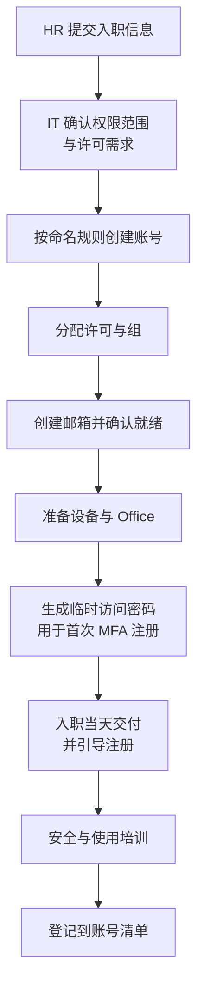
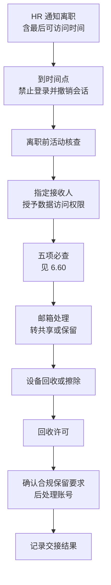

# 第6篇 上线运维与培训 · 第6节 入职、转岗与离职标准流程

> **所属：** 第6篇 上线、运维与培训。  
> **本节小节：** 6.55 ～ 6.66。  
> **本节性质：** 核心流程。**这是长期运维中最高频、也最容易出安全问题的流程。**  
> **前置条件：** 已完成[第5节](05-日常巡检与运维职责.md)。  
> **导航：** [返回第6篇目录](README.md)｜上一节：[日常巡检与运维职责](05-日常巡检与运维职责.md)｜下一节：[变更管理与安全事件处理](07-变更管理与安全事件处理.md)

---

## 6.55 为什么这一节最重要

在所有运维流程中，入转离出问题的概率和后果都最高：

| 常见后果 |
|---|
| 离职员工三个月后还能登录邮箱 |
| 离职员工的 OneDrive 中有部门唯一的文件，账号删除后找不回来 |
| 离职员工离职前批量下载客户资料，无人发现 |
| 离职员工是某个团队的唯一所有者，团队无人能管 |
| 离职员工创建的对外共享链接仍然有效 |
| 转岗员工仍保留原部门的敏感文件权限 |
| 新员工第一天没有账号，无法开始工作 |
| 新员工被随手给了过高权限 |

> **必做：** 这套流程必须**由 HR 触发**，而不是由 IT 猜测。绝大多数入转离问题的根源是"IT 不知道有人来了或走了"。

---

## 6.56 流程的前提：HR 与 IT 的联动

| 事件 | HR 应提供 | 提前时间 |
|---|---|---|
| 入职 | 姓名、部门、职务、主管、入职日期、需要的权限范围 | 建议 3～5 个工作日 |
| 转岗 | 原部门、新部门、生效日期、权限调整需求 | 建议 3 个工作日 |
| 离职 | 姓名、**最后工作日、最后可访问时间**、是否为敏感离职 | 建议尽早，敏感情况立即 |
| 长期休假 | 期间账号处理方式 | 提前 |

### 6.56.1 敏感离职的特别处理

| 情况 | 处理 |
|---|---|
| 非自愿离职、有纠纷 | HR 应**在通知员工之前**告知 IT，以便同步禁用访问 |
| 掌握敏感数据的岗位 | 提前评估数据范围，准备活动核查 |
| 竞业相关 | 与法务确认取证与保留要求 |
| 管理员离职 | **优先处理**，见 6.63 |

> **高风险：** 敏感离职中最危险的时间窗口是"**员工已被告知离职但账号仍可用**"。这段时间是数据带走的高发期。HR 与 IT 必须约定同步动作的时机。

---

## 6.57 入职流程

### 6.57.1 流程步骤

### 6.57.2 入职检查表

| 编号 | 动作 | 引用 | 责任人 | 状态 |
|---|---|---|---|---|
| N1 | 确认权限范围（**最小必要**） | 第2篇 2.17 | — | ☐ |
| N2 | 按命名规则创建账号 | 第2篇 2.44 | — | ☐ |
| N3 | 填写部门、职务、主管、办公地点字段 | 第2篇 2.42 | — | ☐ |
| N4 | 分配许可（按用户画像） | 第2篇 2.48 | — | ☐ |
| N5 | 加入部门组与必要团队 | 第2篇 2.50 | — | ☐ |
| N6 | 确认邮箱已创建并可收发 | 第3篇 3.10 | — | ☐ |
| N7 | 准备设备并部署 Office | 第4篇 4.29 | — | ☐ |
| N8 | 设备注册/加入（按层级） | 第5篇 5.39 | — | ☐ |
| N9 | **生成临时访问密码并安全交付** | 第2篇 2.104 | — | ☐ |
| N10 | 引导完成 MFA 注册（**至少两种方式**） | 第2篇 2.104 | — | ☐ |
| N11 | 发放使用指引与培训材料 | 第9节 | — | ☐ |
| N12 | 完成安全意识培训 | 第9节 | — | ☐ |
| N13 | 若为高风险岗位：加入冒充防护清单 | 第3篇 3.32 | — | ☐ |
| N14 | 登记到用户账号清单 | 第2篇 2.46 | — | ☐ |
| N15 | 一周后回访确认无障碍 | — | — | ☐ |

### 6.57.3 入职的两个纪律

> **必做：**
> 1. **最小必要权限。** 不要"照着同部门某人复制一套权限"，那个人可能积累了很多不该有的权限。
> 2. **首次注册必须核验身份**（第2篇 2.104）。远程入职时尤其重要——攻击者冒充新员工索取凭据是真实存在的手法。

---

## 6.58 转岗流程

转岗容易被当作"小事"，但它是**权限累积**的主要来源。

### 6.58.1 转岗检查表

| 编号 | 动作 | 引用 | 状态 |
|---|---|---|---|
| T1 | 确认新岗位所需权限 | 第2篇 2.17 | ☐ |
| T2 | **先按新岗位授权，再移除旧权限**（避免工作中断） | — | ☐ |
| T3 | 移除原部门组与站点权限 | 第4篇 4.88 | ☐ |
| T4 | 调整邮件组成员 | 第3篇 3.13 | ☐ |
| T5 | 调整团队成员身份 | 第4篇 4.49 | ☐ |
| T6 | **若为原团队唯一所有者：先完成交接** | 第4篇 4.49 | ☐ |
| T7 | 原项目资料是否继续访问（明确结论） | 第4篇 4.117 | ☐ |
| T8 | 个人 OneDrive 中的原部门文件转移到部门站点 | 第4篇 4.117 | ☐ |
| T9 | 调整管理员角色（如涉及） | 第2篇 2.18 | ☐ |
| T10 | 调整许可（如岗位需求变化） | 第2篇 2.48 | ☐ |
| T11 | 更新账号字段（部门、职务、主管） | 第2篇 2.42 | ☐ |
| T12 | 若涉及冒充防护清单：更新 | 第3篇 3.32 | ☐ |
| T13 | 更新设备归属记录（如换设备） | 第5篇 5.47 | ☐ |
| T14 | 登记变更并**验证旧权限确实已失效** | 第2篇 2.18 | ☐ |

> **必做：** T14 的验证不能省。只在清单上打勾而不实际确认，是权限累积的直接原因。建议用该账号（或让本人）确认已无法访问原部门敏感位置。

---

## 6.59 离职流程（最关键）

### 6.59.1 流程步骤

### 6.59.2 离职检查表

| 编号 | 动作 | 引用 | 时点 | 状态 |
|---|---|---|---|---|
| L1 | **禁止登录并撤销所有活动会话** | 第2篇 2.18 | 最后可访问时间 | ☐ |
| L2 | 重置密码（防止已知密码再登录） | — | 同上 | ☐ |
| L3 | 撤销/删除 MFA 注册（视情况） | 第2篇 2.107 | 同上 | ☐ |
| L4 | **离职前活动核查**（异常下载、共享、转发） | 第5篇 5.20 | 尽早 | ☐ |
| L5 | 指定接收人并授予邮箱与 OneDrive 访问 | 第4篇 4.117 | 当天 | ☐ |
| L6 | **五项必查**（见 6.60） | 第4篇 4.117 | 保留期内 | ☐ |
| L7 | 邮箱处理：转共享邮箱 / 设置自动回复 / 转发（需审批） | 第3篇 3.5 | 按需 | ☐ |
| L8 | 移除团队、站点、组成员身份 | 第4篇 4.49 | 当天 | ☐ |
| L9 | 移除管理员角色（如有） | 第2篇 2.18 | **立即** | ☐ |
| L10 | 设备回收；个人设备执行选择性擦除 | 第5篇 5.45 | 按流程 | ☐ |
| L11 | 回收来宾邀请权限、清理其邀请的来宾（如适用） | 第4篇 4.74 | — | ☐ |
| L12 | 确认保留与合规要求后再回收许可 | 第2篇 2.48、第5篇 5.28 | — | ☐ |
| L13 | 账号保留或删除（按既定期限） | 第5篇 5.28 | 按期限 | ☐ |
| L14 | 记录交接结果与责任人 | — | — | ☐ |

> **高风险：** L1 必须**准时执行**。"等他把手上工作交完再关"是常见做法，但也是数据带走的窗口。正确做法是：按 HR 给出的最后可访问时间关闭访问，需要继续处理工作的通过接收人或临时安排解决。

---

## 6.60 离职五项必查（最容易遗漏）

来自第4篇 4.117，这里作为独立步骤强调：

| 编号 | 必查项 | 为什么容易漏 | 检查方法 |
|---|---|---|---|
| **F1** | **个人 OneDrive 中的部门文件** | 只有他自己知道放在哪 | 接收人在保留期内浏览并转移 |
| **F2** | **他创建的对外共享链接** | 离职后链接仍可能有效 | 共享报告 / 审计日志 |
| **F3** | **他是唯一所有者的团队与站点** | 无人能管理该团队 | 团队清单核对 |
| **F4** | **聊天中发送的文件**（存在其 OneDrive） | 别人引用的文件会失效 | 与相关同事确认 |
| **F5** | **他组织的会议录制**（存在其 OneDrive） | 培训或会议记录可能丢失 | 检查录制文件夹 |

### 6.60.1 时间敏感性

> **必做：** F1、F4、F5 都依赖 OneDrive 的保留期。**已删除用户的 OneDrive 默认保留 30 天**（第4篇 4.117），之后进入删除状态。因此：
>
> - 五项必查应在离职后**尽快**完成，不要拖到保留期末。
> - 如果企业默认 30 天不够，应调整保留天数设置（第5篇 5.28）。
> - 接收人要收到明确的截止日期提醒。

---

## 6.61 邮箱的处理方式选择

| 方式 | 适合 | 注意 |
|---|---|---|
| **转为共享邮箱** | 需要继续接收该地址的邮件（如销售、客服） | 基本容量内无需单独许可（第3篇 3.5）；**必须阻止登录** |
| 保留用户邮箱（不回收许可） | 有诉讼或调查需要 | 持续占用许可成本 |
| 设置自动回复 | 告知外部联系人新的联系人 | 建议保留一段时间 |
| 设置转发 | 转给接手人 | **需审批**，避免长期存在 |
| 直接删除 | 无保留需求 | 需先确认合规要求 |

### 6.61.1 建议的组合做法

对多数岗位：

1. 离职当天：禁止登录 + 撤销会话。
2. 转为共享邮箱，授权给接手人。
3. 设置自动回复，告知新的联系方式（保留 1～3 个月）。
4. 按保留期限处理后续。

> **推荐：** 自动回复比转发更透明：外部联系人明确知道该找谁，而不是邮件被静默转给别人。

---

## 6.62 长期休假与临时停用

| 场景 | 处理 |
|---|---|
| 产假、长病假、外派 | 账号保留；评估是否临时禁用；明确期间的邮件处理 |
| 停职调查 | 立即禁止登录并撤销会话；保留数据；按调查要求处理 |
| 返岗 | 恢复访问；**可能需要重新注册 MFA**（如已清除） |
| 长期未登录账号 | 每月巡检发现（第5节 M1），核实是否仍需要 |

> **必做：** 返岗流程要明确"如何恢复"，否则员工返岗第一天无法登录会造成不好的体验。建议返岗前一天由主管提醒 IT。

---

## 6.63 管理员离职（最高优先级）

管理员离职必须**优先且加速**处理。

| 编号 | 动作 | 状态 |
|---|---|---|
| AD1 | **立即移除所有管理员角色** | ☐ |
| AD2 | 禁止登录并撤销会话 | ☐ |
| AD3 | **更换其知晓的所有共享凭据**（服务账号密码、设备管理员密码等） | ☐ |
| AD4 | **重置紧急访问账号凭据**（如其曾知晓或参与保管） | ☐ |
| AD5 | 检查是否留有后门（新增账号、转发规则、应用授权、条件访问例外） | ☐ |
| AD6 | 交接紧急账号保管职责 | ☐ |
| AD7 | 交接管理文档与知识 | ☐ |
| AD8 | 审计其最近的管理操作 | ☐ |
| AD9 | 确认企业仍掌握全部管理权限（无遗漏账号） | ☐ |
| AD10 | 更新管理员清单与联系人 | ☐ |

> **高风险：** AD3 和 AD4 常被忽略。如果离职管理员知晓紧急访问账号的凭据或保管位置，**必须重置并重新分管**。否则企业最后一道防线已经不受控。

---

## 6.64 流程文档与自动化

### 6.64.1 文档要求

- [ ] 每个流程有**一页纸**的操作清单（不是长篇制度）。
- [ ] 明确 HR、IT、主管、接收人各自的动作。
- [ ] 明确时限（例如"离职当天完成 L1～L3"）。
- [ ] 有记录表（谁在什么时间做了什么）。
- [ ] 定期复核并更新。

### 6.64.2 是否需要自动化

| 规模 | 建议 |
|---|---|
| 人数少、变动不频繁 | 检查表 + 人工执行即可 |
| 人数多、变动频繁 | 评估用工作流或脚本减少遗漏 |
| 有 HR 系统 | 评估与 HR 系统的联动 |

> **推荐：** 自动化之前先把**流程本身跑顺**。用自动化去执行一个有漏洞的流程，只会更快地产生问题。

---

## 6.65 流程演练

建议每半年演练一次（与第5节的半年度动作合并）：

| 编号 | 演练场景 | 通过标准 |
|---|---|---|
| E1 | 模拟新员工入职（全流程） | 入职当天可正常工作 |
| E2 | 模拟转岗 | 新权限可用、旧权限已失效（**已验证**） |
| E3 | 模拟普通离职 | 访问已关闭、五项必查完成 |
| E4 | **模拟管理员离职** | AD1～AD10 完成 |
| E5 | 模拟丢手机后恢复 | 用户可恢复访问（第2篇 2.106） |

### 6.65.1 演练要记录

- [ ] 执行耗时（是否满足时限要求）。
- [ ] 遗漏的步骤。
- [ ] 需要澄清的责任分工。
- [ ] 流程文档的修订点。

---

## 6.66 本节完成检查表

- [ ] HR 与 IT 的联动机制已建立，含各事件的提前通知时间。
- [ ] **敏感离职的同步处理时机已与 HR 约定。**
- [ ] 入职检查表 N1～N15 已建立，遵循最小必要权限。
- [ ] 首次 MFA 注册的身份核验要求已明确。
- [ ] 转岗检查表 T1～T14 已建立，含"先授新权再移旧权"和**旧权限失效验证**。
- [ ] 离职检查表 L1～L14 已建立，L1 要求**准时执行**。
- [ ] **离职五项必查 F1～F5 已作为独立步骤强调**，并有截止日期提醒。
- [ ] 已确认 OneDrive 保留天数设置是否满足五项必查所需时间。
- [ ] 邮箱处理方式已确定（推荐转共享邮箱 + 自动回复）。
- [ ] 转共享邮箱后**已阻止登录**。
- [ ] 长期休假、停职、返岗的处理方式已明确。
- [ ] **管理员离职流程 AD1～AD10 已建立**，含更换共享凭据和重置紧急账号凭据。
- [ ] 每个流程有一页纸操作清单和记录表。
- [ ] 责任分工（HR、IT、主管、接收人）已明确。
- [ ] 已评估是否需要自动化（先跑顺流程再自动化）。
- [ ] 流程演练 E1～E5 已排期（建议每半年）。
- [ ] 演练记录要求已明确。

> **进入下一节的条件：** 三套流程已文档化并有责任人。下一节建立**变更管理与安全事件处理**——前者防止自己把系统搞坏，后者应对被攻击。
