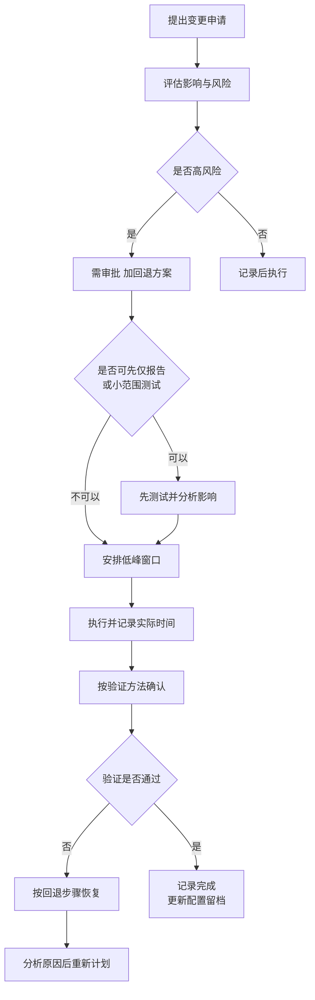
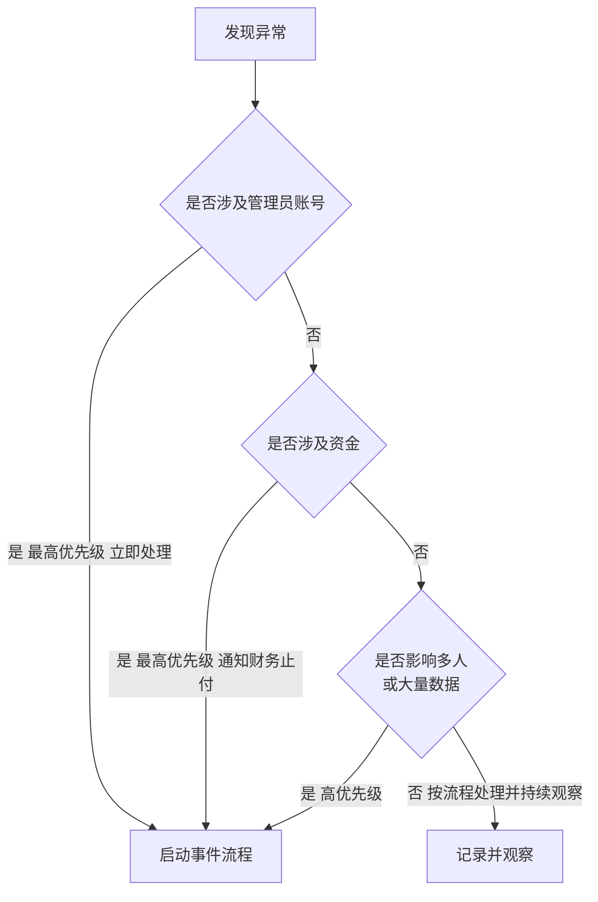

# 第6篇 上线运维与培训 · 第7节 变更管理与安全事件处理

> **所属：** 第6篇 上线、运维与培训。  
> **本节小节：** 6.67 ～ 6.78。  
> **本节性质：** 流程建设。**变更管理防止自己把系统搞坏，事件处理应对被攻击。**  
> **前置条件：** 已完成[第6节](06-入转离标准流程.md)。  
> **导航：** [返回第6篇目录](README.md)｜上一节：[入职、转岗与离职标准流程](06-入转离标准流程.md)｜下一节：[管理员培训](08-管理员培训.md)

---

## 6.67 为什么需要变更管理

统计上，云服务环境的故障中相当大一部分**不是被攻击，而是自己改坏的**：

| 典型场景 |
|---|
| 改了一条条件访问策略，全公司无法登录 |
| 调整了邮件流规则，大量邮件被拒收 |
| 修改了共享设置，外部合作方突然无法访问文件 |
| 收紧了 DLP 规则，财务发不出报表 |
| 调整了保留策略，数据被提前删除 |
| 改了 DNS，邮件停了 |
| 启用了设备合规要求，大批用户被阻止 |

> **必做：** 变更管理的核心不是"增加审批环节让人难受"，而是**确保有人想过影响、有办法回退、出问题时知道改了什么**。

---

## 6.68 哪些操作必须走变更流程

### 6.68.1 高风险变更（必须审批 + 回退方案）

| 类别 | 具体操作 |
|---|---|
| **身份** | 条件访问策略新增/修改/删除、MFA 策略、安全默认值切换、身份同步范围调整 |
| **DNS** | MX、Autodiscover、SPF、DKIM、DMARC 的任何变更 |
| **邮件** | 邮件流规则、连接器、反垃圾/反钓鱼策略、邮箱大小限制 |
| **合规** | 保留策略（**尤其含删除动作**）、DLP 规则、敏感度标签 |
| **共享** | 组织级外部共享设置、默认链接类型 |
| **设备** | 合规策略、要求合规设备的条件访问 |
| **权限** | 管理员角色分配、敏感站点权限 |
| **终端** | Office 更新通道、宏策略、批量部署 |

### 6.68.2 中低风险变更（记录即可）

| 类别 | 具体操作 |
|---|---|
| 常规操作 | 创建单个账号、分配许可、创建团队 |
| 用户支持 | 重置密码、清除验证方式（需核验身份） |
| 内容管理 | 添加邮箱别名、调整单个站点权限 |

> **推荐：** 不要把所有操作都纳入审批，否则流程会被绕过。**只对高风险变更严格要求**，其余记录即可。

---

## 6.69 变更申请表

| 字段 | 要求 |
|---|---|
| 变更编号 | 唯一 |
| 变更内容 | 具体到"改哪个策略的哪个设置" |
| 变更原因 | 为什么要改 |
| **变更前的值** | **逐字记录**（回退依据） |
| 变更后的值 | — |
| 影响范围 | 多少用户、哪些服务 |
| 风险评估 | 可能的负面影响 |
| **验证方法** | 改完怎么确认成功 |
| **回退步骤** | 按顺序写清 |
| 回退触发条件 | 什么情况下回退 |
| 计划时间 | 建议业务低峰 |
| 执行人 / 复核人 | 两人 |
| 审批人 | 按风险级别 |
| 用户通知 | 是否需要、何时发 |
| 实际执行记录 | 事后填写 |

> **必做：** "变更前的值"必须**逐字记录**，不能写"改回原来的设置"。回退失败最常见的原因就是没人记得原值是什么（第3篇 3.78）。

---

## 6.70 变更执行流程

### 6.70.1 五条执行纪律

| 纪律 | 说明 |
|---|---|
| **能测试就先测试** | 条件访问用仅报告模式；DLP 用仅记录；邮件规则用提示模式 |
| **一次只改一件事** | 同时改多项，出问题无法判断原因 |
| 避开高峰 | 不在月结、报税、重要会议前 |
| **有人值守** | 不在下班前或假期前执行 |
| 立即验证 | 改完就验证，不要"过两天再看" |

### 6.70.2 变更后必做

- [ ] 按验证方法确认成功。
- [ ] **用紧急访问账号登录验证**（涉及身份类变更时，第2篇 2.96）。
- [ ] 更新配置留档（第5篇 5.56）。
- [ ] 更新相关文档（本方案、操作手册）。
- [ ] 记录实际执行时间和结果。

> **高风险：** 涉及条件访问、MFA、设备合规的变更，**变更后必须立即用紧急访问账号登录一次**。这是防止"把所有管理员锁在门外"的最后检查。

---

## 6.71 配置留档与漂移

| 问题 | 说明 |
|---|---|
| 配置漂移 | 实际配置与文档记录逐渐不一致 |
| 后果 | 出问题时不知道"正常状态"是什么；人员变动后无人说得清 |
| 对策 | 每次变更后更新留档；定期导出关键配置比对 |

### 6.71.1 需要定期导出留档的配置

- [ ] 条件访问策略。
- [ ] 邮件流规则。
- [ ] 邮件安全策略与允许列表。
- [ ] 外部共享设置。
- [ ] 保留策略。
- [ ] 设备合规与配置策略。
- [ ] 管理员角色分配。
- [ ] Teams 策略。
- [ ] DNS 记录。

> **推荐：** 每季度导出一次并与上次比对。发现"有人改了但没记录"的情况，正是变更管理需要加强的信号。

---

## 6.72 安全事件的类型与判断

| 类型 | 典型迹象 |
|---|---|
| **账号被盗** | 异常地点登录、用户收到未发起的验证请求、邮箱出现陌生转发规则 |
| 钓鱼邮件事件 | 员工报告或点击了钓鱼链接 |
| **BEC 欺诈** | 收到变更收款账号的请求、财务发现可疑付款要求 |
| 勒索软件 | 大量文件被加密、文件扩展名异常 |
| 数据外泄 | 异常大量下载、大量共享链接创建、异常外发 |
| 恶意应用授权 | 出现未知的第三方应用授权 |
| 内部违规 | 离职前批量下载、越权访问 |
| 管理员账号异常 | 未经批准的角色变更、策略被修改 |

### 6.72.1 判断优先级

---

## 6.73 账号被盗的处理步骤

这是最常见的安全事件，必须有标准动作。

| 顺序 | 动作 | 说明 |
|---|---|---|
| 1 | **禁止登录 / 阻止账号** | 立即切断 |
| 2 | **撤销所有活动会话** | 仅改密码不够，令牌仍可能有效 |
| 3 | 重置密码 | — |
| 4 | **重置 MFA 注册**（如怀疑被控） | 攻击者可能已注册自己的设备 |
| 5 | **检查邮箱规则与转发** | 攻击者常设置隐蔽转发（第3篇 3.23） |
| 6 | **检查第三方应用授权** | 可能已授权恶意应用（第5篇 5.9） |
| 7 | 检查邮箱委派与权限变更 | 是否被添加了访问权 |
| 8 | 检查是否有新建账号或角色变更 | 权限提升迹象 |
| 9 | 用审计日志核查活动范围 | 访问了什么、下载了什么、发了什么邮件 |
| 10 | 检查是否已向他人发送钓鱼邮件 | 内部扩散 |
| 11 | 通知受影响的人 | 包括收到该账号可疑邮件的人 |
| 12 | 恢复账号（核验身份后） | 重新注册验证方式 |
| 13 | 保留证据 | 日志导出、截图 |
| 14 | 复盘 | 攻击如何成功、如何防止 |

> **必做：** 第 2 步（撤销会话）和第 5、6 步（检查规则与应用授权）最常被忽略。只改密码而不撤销会话，攻击者可能仍在线；不检查转发规则，攻击者仍在持续收取邮件。

---

## 6.74 BEC 欺诈事件处理

这类事件涉及**真金白银**，时间就是钱。

| 顺序 | 动作 |
|---|---|
| 1 | **立即通知财务停止付款**（若尚未支付） |
| 2 | 若已支付：**立即联系银行**尝试拦截（越快越好） |
| 3 | 通知管理层 |
| 4 | 确认是否有账号被盗（按 6.73 检查） |
| 5 | 检查邮件来源与邮件头（第3篇 3.39） |
| 6 | 检查是否有内部邮箱被用于该欺诈 |
| 7 | 通知可能受影响的其他人（供应商、客户） |
| 8 | 按企业制度决定是否报案 |
| 9 | 保留全部证据 |
| 10 | 复盘并加强流程（电话回拨、双人复核） |

> **高风险：** BEC 的技术检测能力有限（第3篇 3.26）。**最有效的防线是业务流程**：变更收款账号必须电话回拨确认、大额付款双人复核。事件复盘时应重点检查这些流程是否被执行，而不只是加强技术配置。

---

## 6.75 勒索软件事件处理

| 顺序 | 动作 |
|---|---|
| 1 | **断开受感染设备的网络**（阻止继续加密和同步） |
| 2 | **暂停该用户的同步**（防止加密结果继续上云） |
| 3 | 阻止该账号并撤销会话 |
| 4 | 评估影响范围（哪些文件、哪些站点） |
| 5 | 通知管理层与相关部门 |
| 6 | **用版本历史或"还原到时间点"恢复**（第4篇 4.109） |
| 7 | 若有备份：按备份方案恢复（第5篇 5.54） |
| 8 | 清理或重装受感染设备 |
| 9 | 检查是否有其他设备受影响 |
| 10 | 排查感染途径（邮件附件？宏？漏洞？） |
| 11 | 加强对应防线（第4篇宏管控、第3篇附件管控） |
| 12 | 复盘并更新演练场景 |

> **必做：** 第 6 步的能力必须**事先演练过**（第5篇 5.57 的 B4）。勒索发生时才第一次尝试"还原到时间点"，往往会因为不熟悉操作或超出可还原范围而失败。

---

## 6.76 事件记录与复盘

### 6.76.1 事件记录表

| 字段 | 说明 |
|---|---|
| 事件编号 | — |
| 发现时间 / 发现方式 | 告警？用户报告？巡检？ |
| 事件类型 | — |
| 影响范围 | 账号数、数据量、业务影响 |
| 处置动作与时间线 | 逐条记录 |
| 处置人 | — |
| 是否造成损失 | 数据、资金、业务 |
| 根本原因 | — |
| 改进措施 | 具体到动作和责任人 |
| 证据位置 | — |
| 结案时间 | — |

### 6.76.2 复盘要回答的四个问题

1. **怎么进来的？**（钓鱼？弱密码？第三方应用？漏洞？）
2. **为什么没被更早发现？**（告警缺失？没人看？）
3. **处置是否及时有效？**（哪一步慢了？）
4. **如何防止再次发生？**（具体措施与责任人）

> **推荐：** 复盘产出的改进措施要**落到巡检清单或流程文档中**，否则会停留在会议纪要里。例如"以后要检查转发规则"应变成第5节 W8 的固定检查项。

---

## 6.77 联系 Microsoft 支持

### 6.77.1 什么情况联系

| 情况 | 说明 |
|---|---|
| 疑似服务本身故障 | 服务健康状态有异常但影响未说明 |
| 管理员完全无法登录 | 紧急账号也失效（第2篇 2.98） |
| 数据丢失且自助恢复无效 | 超出可自助恢复范围 |
| 迁移或同步出现无法解释的错误 | — |
| 需要后台协助的操作 | — |

### 6.77.2 提交工单需准备的信息

- [ ] 租户 ID 与域名。
- [ ] 问题的准确描述（现象、影响范围、开始时间）。
- [ ] 受影响的用户示例（账号、时间点）。
- [ ] **错误信息原文截图**（不要转述）。
- [ ] 相关日志（登录日志、审计日志、邮件追踪 ID）。
- [ ] 已尝试的排查步骤与结果。
- [ ] 业务影响说明（有助于判断优先级）。
- [ ] 联系人与可用时段。

> **推荐：** 事先记录租户 ID 并放在应急文档中。紧急情况下不要现场翻找这类基础信息（第13节的应急联系表）。

---

## 6.78 本节完成检查表

- [ ] 已明确哪些操作属于高风险变更（必须审批 + 回退方案）。
- [ ] 中低风险变更仅需记录，未过度增加审批负担。
- [ ] 变更申请表已建立，**要求逐字记录变更前的值**。
- [ ] 变更执行五条纪律已明确（先测试、一次一项、避高峰、有值守、立即验证）。
- [ ] **涉及身份类变更后必须用紧急访问账号验证登录**已写入流程。
- [ ] 变更后更新配置留档与文档已纳入流程。
- [ ] 关键配置的定期导出与比对机制已建立（建议每季度）。
- [ ] 安全事件类型与判断优先级已明确。
- [ ] **账号被盗处理步骤（14 步）已文档化**，含撤销会话、检查转发规则和应用授权。
- [ ] **BEC 事件处理步骤已文档化**，含立即止付与联系银行。
- [ ] BEC 复盘要求检查业务流程（电话回拨、双人复核）是否被执行。
- [ ] **勒索软件处理步骤已文档化**，含断网、暂停同步、还原到时间点。
- [ ] 勒索恢复能力已事先演练（第5篇 B4）。
- [ ] 事件记录表已建立。
- [ ] 复盘四个问题已纳入流程，改进措施要求落到巡检清单或流程文档。
- [ ] 联系 Microsoft 支持的判断标准与信息清单已准备。
- [ ] 租户 ID 等基础信息已记入应急文档。

> **进入下一节的条件：** 变更与事件流程已文档化。下面两节是培训部分——**再好的流程，没人会用也没有价值**。
