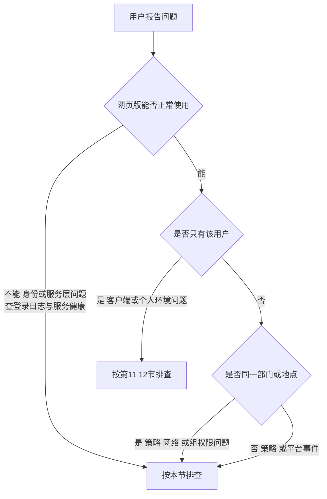
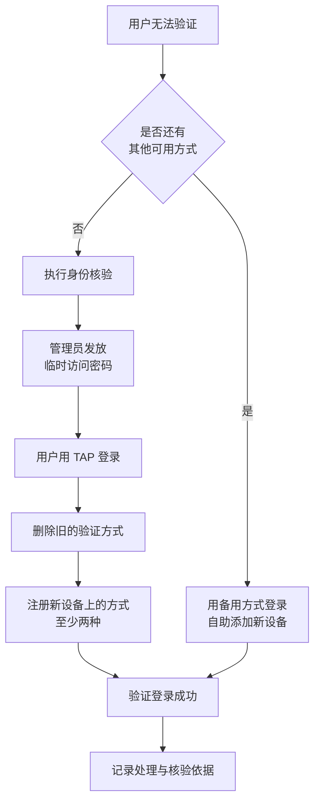
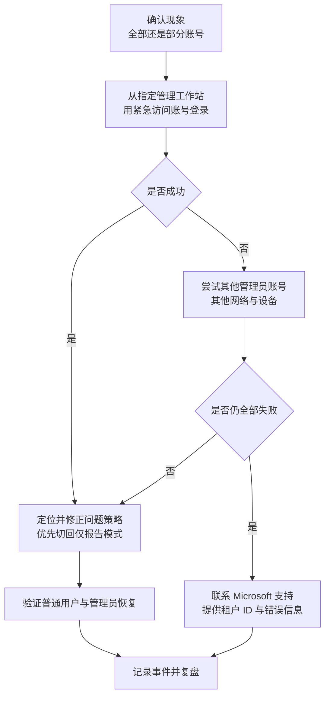

# 第6篇 上线运维与培训 · 第10节 故障排查：登录与 MFA

> **所属：** 第6篇 上线、运维与培训。  
> **本节小节：** 6.106 ～ 6.118。  
> **本节性质：** 排查手册。**本节及后三节供服务台和管理员日常查阅，按症状索引。**  
> **前置条件：** 已完成培训（第8、9节）。  
> **导航：** [返回第6篇目录](README.md)｜上一节：[员工培训与快速手册](09-员工培训与快速手册.md)｜下一节：[故障排查：Office 与邮件](11-故障排查-Office与邮件.md)

---

## 6.106 排查的基本原则

### 6.106.1 五条通用原则

| 原则 | 说明 |
|---|---|
| **先收集信息，再动手** | 缺少时间和错误原文，排查效率会大幅下降 |
| **先看日志，再改配置** | 直接改配置会掩盖根因并可能引入新问题 |
| **先判断范围** | 一个人？一个部门？全公司？范围决定方向 |
| **先排除服务事件** | 查服务健康状态，避免白排查半天 |
| **一次只改一件事** | 否则无法判断是哪个动作起了作用 |

### 6.106.2 必须收集的信息

- [ ] 完整账号（不是"张三"，而是 `zhangsan@contoso.com`）。
- [ ] **准确时间**（含日期，尽量精确到分钟）。
- [ ] 设备与客户端（Windows/Mac/手机、Outlook 版本、浏览器）。
- [ ] 网络环境（公司网络、家里、手机流量、VPN）。
- [ ] **错误提示原文截图**（不要转述）。
- [ ] 是所有操作都有问题，还是只有某一项。
- [ ] 其他人是否同样问题。
- [ ] 之前是否正常、什么时候开始异常。

> **推荐：** 把这份清单做成工单模板的**必填项**。这是提升排查效率最简单有效的措施。

---

## 6.107 三步分流法（先定位层次）

> **必做：** 服务台第一句话应固定为："**你在浏览器里打开公司邮箱/Teams 能正常用吗？**" 这一个问题能快速区分服务端与客户端问题。

---

## 6.108 症状索引（登录与身份）

| 症状 | 跳转 |
|---|---|
| 忘记密码 / 账号被锁 | 6.109 |
| 提示账号被禁用或无法登录 | 6.110 |
| 收不到 MFA 推送通知 | 6.111 |
| 验证码无效 | 6.111 |
| 换手机或丢手机后无法验证 | 6.112 |
| 反复要求 MFA 验证 | 6.113 |
| 被条件访问策略阻止 | 6.114 |
| 提示需要合规设备 | 6.114 |
| 提示需要注册更多信息但页面打不开 | 6.115 |
| 新员工无法首次登录 | 6.115 |
| 管理员无法登录管理中心 | 6.116 |
| **所有管理员都被锁在门外** | 6.117 |
| 用户收到未发起的验证请求 | 6.118 |

---

## 6.109 忘记密码与账号锁定

| 现象 | 原因 | 处理 |
|---|---|---|
| 忘记密码 | — | 若已启用自助重置：引导用户自助；否则由管理员重置 |
| 多次输错被锁 | 锁定策略 | 等待锁定期或由管理员处理 |
| 重置后仍无法登录 | 客户端缓存了旧凭据 | 清理保存的凭据后重试 |
| 同步账号密码重置无效 | 密码由本地 AD 管理 | 在**本地 AD** 重置（第2篇 2.66） |
| 重置后手机端仍报错 | 需重新登录 | 在手机上重新输入 |

> **必做：** 重置密码前**必须核验身份**。这是社工攻击的常见入口（第2篇 2.106）。

---

## 6.110 账号被禁用或无法登录

| 现象 | 可能原因 | 处理 |
|---|---|---|
| 提示账号已禁用 | 离职流程已执行、或误操作 | 与 HR 核实；误操作则恢复 |
| 同步账号被禁用 | 本地 AD 中已禁用 | 在本地 AD 处理 |
| 提示许可问题 | 许可被回收 | 检查许可分配 |
| 提示账号不存在 | 登录名输错、或用了别名 | 别名不能用于登录（第2篇 2.43） |
| 用了个人账号 | 登录页显示个人账号 | 退出后用工作账号 |
| 提示账号被风险策略阻止 | 检测到风险 | 按事件流程核查（第7节 6.73） |

---

## 6.111 收不到推送 / 验证码无效

### 6.111.1 收不到推送通知

| 检查项 | 处理 |
|---|---|
| 手机是否有网络 | 连接网络后重试 |
| 应用通知权限是否开启 | 在系统设置中开启 |
| 应用是否被省电策略清理 | 关闭对该应用的省电限制 |
| 应用是否需要更新 | 更新应用 |
| 是否注册在旧设备上 | 需重新注册（6.112） |
| 临时替代方案 | 改用**验证码方式**登录 |

### 6.111.2 验证码无效

| 检查项 | 处理 |
|---|---|
| **手机时间是否准确** | 开启自动校时（最常见原因） |
| 是否输入了过期验证码 | 重新获取（30 秒刷新） |
| 是否看错了行 | 确认对应的账号 |
| 是否注册在其他账号下 | 确认是公司账号的条目 |

> **推荐：** 引导用户注册 **passkey**（第2篇 2.80），可同时避免"收不到推送"和"验证码过期"两类问题，体验也更好。

---

## 6.112 换手机与丢手机

### 6.112.1 处理流程

### 6.112.2 丢手机的额外动作

| 顺序 | 动作 |
|---|---|
| 1 | **立即删除该用户已注册的相关验证方式** |
| 2 | 评估是否需要重置密码并撤销会话 |
| 3 | 若手机上有公司应用数据：执行选择性擦除（第5篇 5.44） |
| 4 | 核验身份后发放 TAP |
| 5 | 协助注册新方式 |
| 6 | 检查该期间是否有异常登录 |
| 7 | 记录事件 |

> **高风险：** 身份核验标准必须**事先统一约定**（第2篇 2.106），不要让服务台临场判断。建议要求视频确认或直属主管在工单中确认。

---

## 6.113 反复要求验证

| 原因 | 说明 | 处理 |
|---|---|---|
| 使用无痕模式或每次清 Cookie | 无法保留会话标记 | 建议正常模式 |
| 换设备、换浏览器、换网络 | 触发重新评估 | 属正常行为，解释即可 |
| 策略要求较短会话频率 | 配置所致 | 评估业务需要后调整 |
| 不允许持久化浏览器会话 | 配置所致 | 按安全要求权衡 |
| 密码刚更改 | 各客户端需重新登录 | 正常 |
| 设备被判不合规 | 设备状态 | 检查合规状态（第5篇 5.41） |
| 多条策略叠加 | 要求累加 | 梳理策略，去重 |
| 按用户 MFA 与条件访问并存 | 重复要求 | 完成迁移并关闭遗留方式（第2篇 2.90） |

> **推荐：** 面对"太麻烦"的反馈，优先推动**改用 passkey 或 Windows Hello**（更快更安全），而不是第一反应放宽策略（第2篇 2.113）。

---

## 6.114 被策略阻止

### 6.114.1 排查步骤

1. 在**登录日志**中找到该次登录（第2篇 2.114）。
2. 查看"条件访问"结果，确认命中了哪条策略、结果是什么。
3. 判断该策略的范围与要求是否符合设计意图。
4. 若为误伤：按变更流程调整范围或补充例外（**限时并登记**）。
5. 若为预期行为：向用户解释原因。

### 6.114.2 常见情况

| 现象 | 常见原因 | 处理 |
|---|---|---|
| 从家里/国外登录被阻止 | 位置策略 | 确认是否为预期；必要时调整 |
| 提示需要合规设备 | 设备未注册或不合规 | 完成注册；修复合规项（第5篇 5.39） |
| 旧客户端被阻止 | 阻止旧式身份验证 | 升级客户端（第2篇 2.94） |
| 特定应用被阻止 | 应用范围策略 | 核对策略配置 |
| 设备代码流登录失败 | 相关策略阻止 | 评估替代方案（第2篇 2.89） |
| 服务账号被阻止 | 未在例外范围 | 登记限时例外并制定整改计划 |

---

## 6.115 首次注册相关问题

| 现象 | 原因 | 处理 |
|---|---|---|
| 提示需要更多信息但注册页打不开 | 网络限制、浏览器策略 | 换网络或浏览器；必要时用 TAP |
| 新员工无法完成首次注册 | 尚无任何验证方式 | 发放**临时访问密码**（第2篇 2.104） |
| 远程入职无法核验身份 | 流程缺失 | 由主管书面确认或视频核验 |
| 注册后仍提示未注册 | 未完成全部步骤 | 引导重新走一遍并确认完成 |
| 无手机岗位无法注册 | 方案缺失 | 按无手机方案处理（第2篇 2.105） |

---

## 6.116 管理员无法登录管理中心

| 现象 | 原因 | 处理 |
|---|---|---|
| 提示需要 MFA 但未注册 | **平台级强制 MFA 要求**（第2篇 2.13） | 完成 MFA 注册 |
| 提示无权限 | 角色被移除或未生效 | 检查角色分配 |
| 被条件访问阻止 | 管理门户保护策略 | 查日志确认策略；从符合条件的设备/网络登录 |
| 用了错误账号 | 用了日常账号 | 改用管理账号 |
| 角色为"符合条件"未激活 | 需按需激活 | 按流程申请激活（第5篇 5.5） |

---

## 6.117 所有管理员都被锁在门外（最高优先级）

### 6.117.1 处理顺序

### 6.117.2 复盘必须回答

- 为什么在仅报告阶段没发现？
- 为什么紧急账号排除项没生效（如适用）？
- 变更流程哪一步被跳过了？

> **必做：** 改进措施要写进变更流程（第7节 6.70），例如"涉及身份类变更后必须立即用紧急账号验证登录"。

---

## 6.118 用户收到未发起的验证请求（安全事件）

**这不是故障，是安全信号。**

| 顺序 | 动作 |
|---|---|
| 1 | 确认用户**没有批准**该请求 |
| 2 | **立即重置该用户密码并撤销会话** |
| 3 | 检查登录日志中的尝试来源 |
| 4 | 检查邮箱转发规则与应用授权（第7节 6.73） |
| 5 | 若已批准：按**账号被盗**完整流程处理 |
| 6 | 表扬并鼓励用户的报告行为 |
| 7 | 记录事件 |

> **推荐：** 用户报告这类情况时，一定要**给正面反馈**。这类报告是企业最有价值的早期预警，如果报告后没有回音，用户就不会再报（第5篇 5.8）。

### 6.118.1 本节完成检查表

- [ ] 五条通用排查原则已培训到服务台。
- [ ] 信息收集清单已作为工单模板必填项。
- [ ] **三步分流法已培训**，含"网页版能否正常"这个首问。
- [ ] 症状索引已交付服务台，便于快速定位。
- [ ] 密码重置前的身份核验要求已明确。
- [ ] 推送与验证码问题的排查步骤已文档化（含手机时间校准）。
- [ ] 换手机/丢手机流程已文档化，**身份核验标准已统一约定**。
- [ ] 丢手机的额外动作（删除验证方式、擦除、异常核查）已明确。
- [ ] "反复要求验证"的原因清单已准备，优先推动改用 passkey。
- [ ] 被策略阻止的排查步骤已文档化，例外需限时登记。
- [ ] 首次注册问题（含 TAP 发放）已文档化。
- [ ] 管理员登录问题已文档化，含平台强制 MFA 说明。
- [ ] **"所有管理员被锁"的应急流程已文档化并演练。**
- [ ] "用户收到未发起验证请求"已按**安全事件**处理，且要求给用户正面反馈。

> **下一节：** [故障排查：Office 与邮件](11-故障排查-Office与邮件.md)
