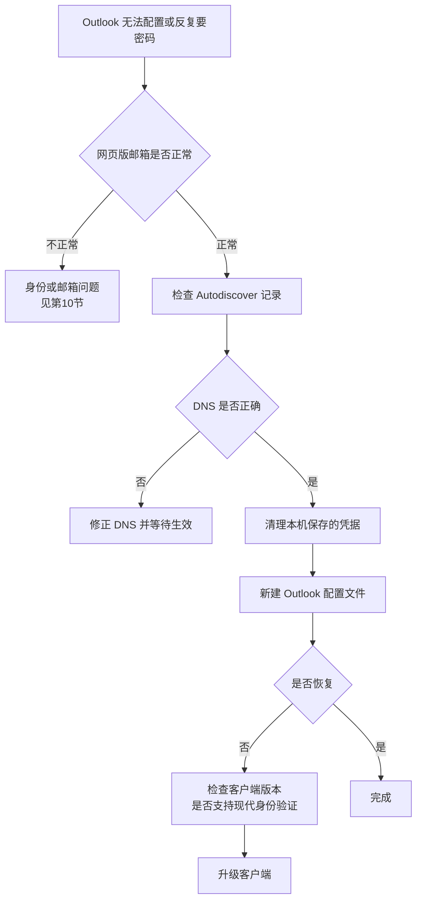

# 第6篇 上线运维与培训 · 第11节 故障排查：Office 与邮件

> **所属：** 第6篇 上线、运维与培训。  
> **本节小节：** 6.119 ～ 6.130。  
> **本节性质：** 排查手册。按症状索引，供服务台和管理员查阅。  
> **导航：** [返回第6篇目录](README.md)｜上一节：[故障排查：登录与 MFA](10-故障排查-登录与MFA.md)｜下一节：[故障排查：Teams 与文件](12-故障排查-Teams与文件.md)

---

## 6.119 症状索引

### Office 应用

| 症状 | 跳转 |
|---|---|
| Office 下载或安装失败 | 6.120 |
| Office 无法登录或未激活 | 6.121 |
| Office 启动慢、崩溃 | 6.122 |
| 宏无法运行或被阻止 | 6.123 |
| 加载项消失或不工作 | 6.123 |
| 业务系统导出 Excel/Word 报错 | 6.123 |
| 字体或排版异常、中文乱码 | 6.122 |

### 邮件

| 症状 | 跳转 |
|---|---|
| Outlook 反复要求输入密码 | 6.124 |
| Outlook 无法自动配置邮箱 | 6.124 |
| Outlook 搜索不到邮件 | 6.125 |
| 收不到某封邮件 | 6.126 |
| 邮件延迟或退信 | 6.127 |
| 邮件被判垃圾或被隔离 | 6.127 |
| 我们发出的邮件进对方垃圾箱 | 6.128 |
| 共享邮箱打不开或发不出 | 6.129 |
| 发件人显示不正确 | 6.129 |
| 会议室无法预订 | 6.129 |
| 邮箱容量满了 | 6.130 |
| 打印机/业务系统发不出邮件 | 6.130 |

---

## 6.120 Office 安装失败

| 现象 | 原因 | 处理 |
|---|---|---|
| 安装中断 | 旧版残留、空间不足、网络中断 | 清理残留；检查空间与网络后重试 |
| 提示已安装其他位数 | 位数冲突 | 完整卸载后安装（第4篇 4.24） |
| 提示需要关闭程序 | Office 进程未结束 | 关闭全部 Office 相关进程 |
| 下载极慢 | 出口带宽或多台并发 | 使用本地安装源或分批 |
| 权限不足 | 非本机管理员 | 由 IT 部署或提权执行 |
| 语言缺失 | 部署配置未含 | 修正部署配置 |

---

## 6.121 Office 激活问题

### 6.121.1 排查顺序

1. **确认登录的是工作账号，不是个人账号**（最常见原因）。
2. 确认该账号有含桌面应用的许可。
3. 确认未超出设备安装数量限制。
4. 确认网络可访问激活服务。
5. 共享电脑场景确认已启用共享电脑激活。
6. 清理保存的凭据后重新登录。

| 现象 | 处理 |
|---|---|
| 显示"产品未激活" | 按上述顺序排查 |
| 显示为个人版订阅 | 退出并用工作账号登录 |
| 提示已达安装上限 | 在账户页面注销不再使用的设备 |
| 共享电脑上频繁要求登录 | 检查共享电脑激活配置（第4篇 4.10） |
| 长期未联网后失效 | 联网并重新登录 |

> **必做：** 服务台先问："**你登录 Office 用的是公司邮箱还是个人邮箱？**" 这一个问题能解决大部分激活工单（第4篇 4.30）。

---

## 6.122 Office 崩溃、变慢与显示异常

### 6.122.1 加载项是首要嫌疑

| 步骤 | 说明 |
|---|---|
| 1 | 在**安全模式**（禁用加载项）下启动 |
| 2 | 若正常 → 加载项问题 |
| 3 | 逐个启用加载项定位 |
| 4 | 联系该加载项供应商或暂时禁用 |

### 6.122.2 其他原因

| 现象 | 原因 | 处理 |
|---|---|---|
| 打开特定文件很慢 | 文件过大、公式过多 | 优化文件 |
| 频繁崩溃 | 加载项、损坏的模板、需更新 | 在线修复；更新版本 |
| 字体或排版异常 | 企业字体未统一分发 | 分发字体（第4篇 4.28） |
| 中文乱码 | 编码或字体问题 | 检查字体与语言设置 |
| 打开文件提示"保护视图" | 文件来自互联网 | 确认来源可信后启用编辑 |
| 提示文件被锁定/只读 | 他人正在编辑、同步冲突 | 见第12节 |

---

## 6.123 宏、加载项与业务系统集成

| 现象 | 原因 | 处理 |
|---|---|---|
| **宏提示内容被阻止** | 文件来自互联网（第4篇 4.37） | 通过**签名或受信任位置**分发，而非让用户解除阻止 |
| 宏报"对象错误"或"找不到引用" | 位数或组件不兼容 | 检查引用；确认 32/64 位（第4篇 4.19） |
| **宏能跑但结果不对** | 函数行为差异或依赖旧特性 | **必须由业务确认并修正逻辑**（高风险） |
| 加载项不出现 | 未安装、被禁用、位数不匹配 | 检查加载项状态 |
| 加载项自动被禁用 | 曾导致崩溃 | 重新启用；联系供应商 |
| 开票/签章工具失效 | 版本或位数问题 | 联系供应商确认支持版本 |
| 业务系统导出报错 | 系统依赖特定版本或组件 | 供应商确认；必要时保留兼容环境 |
| Outlook 加载项失效 | 客户端类型不匹配（经典/新版） | 确认客户端选择（第4篇 4.6） |

> **高风险：** "宏能跑但算错数"是最危险的情况，且不会报错。发现后必须**立即通知业务停止使用该结果**，并由业务人员核对（第4篇 4.18）。

---

## 6.124 Outlook 配置与反复要求密码

### 6.124.1 排查流程

### 6.124.2 常见原因

| 现象 | 原因 | 处理 |
|---|---|---|
| 反复要求密码 | 缓存了旧凭据 | 清理系统中保存的凭据 |
| 无法自动配置 | Autodiscover 未生效 | 检查 DNS（第3篇 3.86） |
| 仍连到旧邮箱 | 使用了旧配置文件 | 新建配置文件（第3篇 3.87） |
| 旧版客户端无法登录 | 不支持现代身份验证 | 升级到受支持版本（第4篇 4.5） |
| 手机自带客户端无法登录 | 客户端限制 | 改用 Outlook 移动版 |
| 提示需要更新 | 版本过旧 | 更新 |

---

## 6.125 Outlook 搜索与同步异常

| 现象 | 原因 | 处理 |
|---|---|---|
| 搜索不到已知邮件 | 索引未完成或损坏 | 等待索引；必要时重建索引 |
| 只能搜到近期邮件 | 缓存时间范围限制 | 调整缓存设置或用网页版搜索 |
| 网页版有、Outlook 没有 | 客户端同步问题 | 检查同步状态；必要时重建配置文件 |
| 文件夹显示不全 | 同步未完成 | 等待完成 |
| 通讯簿信息过时 | 通讯簿缓存 | 等待更新或手动更新 |
| 大邮箱同步很慢 | 数据量大 | 说明预期；调整缓存范围 |

---

## 6.126 收不到某封邮件（最高频工单）

### 6.126.1 标准处理流程

| 步骤 | 动作 |
|---|---|
| 1 | 收集完整信息（发件人、收件人、时间、主题、错误原文） |
| 2 | 判断是单人还是多人 |
| 3 | **执行邮件追踪**（第3篇 3.37） |
| 4 | **无记录** → 邮件未进入 Microsoft 365 → 查 DNS 与对方系统 |
| 5 | **有记录** → 按状态处理（已送达/已隔离/失败/延迟） |
| 6 | 已送达 → 查用户侧原因（见 6.126.2） |
| 7 | 给出结论并告知用户 |
| 8 | 记录到知识库 |

### 6.126.2 显示"已送达"但用户找不到

| 原因 | 表现 |
|---|---|
| **收件箱规则把邮件移走了** | 在某个子文件夹里 |
| 用户自己删除或存档 | 在已删除项目中 |
| 进了垃圾邮件文件夹 | 需检查垃圾箱 |
| 焦点收件箱/其他分类 | 在"其他"标签下 |
| 客户端同步或缓存问题 | 网页版能看到 |
| 用户看的是错误的账号 | 多账号混用 |
| 被用户加入了阻止发件人列表 | 用户自己曾拉黑 |

> **推荐：** 服务台先问："**在浏览器打开的邮箱里能看到吗？**" 能看到 = 客户端问题；看不到 = 服务端问题（第3篇 3.40）。

---

## 6.127 延迟、退信、隔离

| 现象 | 常见原因 | 处理 |
|---|---|---|
| 退信"收件人不存在" | 地址未创建（常为别名） | 补建别名；请对方重发（第3篇 3.82） |
| 退信"邮箱已满" | 容量满 | 见 6.130 |
| 退信"邮件过大" | 超过大小限制 | 改用文件链接共享 |
| 邮件延迟 | 传输重试或规则处理 | 用追踪确认状态，多数会自行送达 |
| 邮件被隔离 | 安全策略判定 | 查隔离原因；确认为正常则放行并**分析根因**（第3篇 3.33） |
| 进了垃圾邮件 | 反垃圾判定 | 同上 |
| 部分人收到、部分人没收到 | 通讯组成员或规则 | 查追踪的"已展开"记录 |
| 切换期间邮件进旧系统 | DNS 缓存或旧 MX 残留 | 确认无旧 MX；补投误投邮件（第3篇 3.82） |

> **必做：** 处理误判时优先**修根因**（让对方修好 SPF/DKIM），而不是整域加白名单（第3篇 3.29.3）。

---

## 6.128 我们发出的邮件进对方垃圾箱

### 6.128.1 排查步骤

1. 请对方提供**邮件头**。
2. 检查 `Authentication-Results` 中的 `spf=`、`dkim=`、`dmarc=`（第3篇 3.39）。
3. 按结果处理：

| 结果 | 原因 | 处理 |
|---|---|---|
| `spf=fail` | 发信来源未登记 | 补进 SPF（第2篇 2.34） |
| `dkim=none` | 未配置 DKIM | 配置 DKIM |
| `dmarc=fail` 但 SPF/DKIM 都 pass | **域对齐问题** | 按第2篇 2.37 处理 |
| 全部 pass 仍进垃圾箱 | 对方策略或域信誉 | 检查是否被列入信誉列表；检查内容 |

> **高风险：** 如果企业域名因大量垃圾邮件被外部拉黑，恢复过程漫长。应检查是否有账号被盗用于群发（第7节 6.73），并确认出站反垃圾策略已配置（第3篇 3.29.2）。

---

## 6.129 共享邮箱、权限与会议室

| 现象 | 原因 | 处理 |
|---|---|---|
| 共享邮箱看不到 | 权限未生效或客户端未刷新 | 检查权限；手工添加（第3篇 3.88） |
| 无法从共享邮箱发信 | 缺少"发送方式"权限 | 授予相应权限 |
| **发件人显示不正确** | 权限类型选错（发送方式 vs 代表发送） | 按业务需要调整（第3篇 3.12） |
| 已发送邮件不在共享邮箱 | 未配置保存位置 | 配置"已发送同时保存到共享邮箱" |
| 无法访问他人邮箱 | 委派权限缺失 | 还原委派（第3篇 3.57） |
| 刚配好权限就报错 | 权限信息同步中 | 等待后重试 |
| 会议室无法预订 | 预订规则限制、需审批 | 检查规则（第3篇 3.15） |
| 会议室被长期占用 | 未设最长预订时长 | 调整规则 |
| 会议室不在列表中 | 未正确创建或隐藏 | 检查资源邮箱配置 |

---

## 6.130 容量与非人账号发信

### 6.130.1 邮箱容量满

| 处理 | 说明 |
|---|---|
| 检查当前容量与上限 | 确认是否真的满了 |
| 引导用户清理大附件 | 优先删除大文件 |
| 清空已删除项目 | 释放空间 |
| 启用在线存档 | 历史邮件移入存档（注意扩容需时间，第3篇 3.10） |
| 评估升级许可 | 长期方案 |
| 培养文件链接习惯 | 减少附件（第4篇 4.86） |

### 6.130.2 打印机/业务系统发不出邮件

| 现象 | 原因 | 处理 |
|---|---|---|
| 突然发不出 | 基本认证被禁用 | 按改造方案处理（第2篇 2.109） |
| 认证失败 | 密码变更或账号被禁 | 检查所用账号状态 |
| 提示需要 MFA | 该账号被策略覆盖 | 确认发信方式；改用受支持方案 |
| 只能发内部、发不出外部 | 发信方式限制 | 确认所用提交方式 |
| 偶发失败 | 速率限制或网络 | 检查发送量与网络 |

> **必做：** 遇到此类问题时，不要用"临时恢复基本认证"作为长期解法。SMTP AUTH 有明确的弃用时间线（第3篇 3.50 参考资料），必须完成改造。

### 6.130.3 本节完成检查表

- [ ] 症状索引已交付服务台。
- [ ] Office 安装与激活排查流程已文档化，含"工作账号 vs 个人账号"首问。
- [ ] 加载项优先排查（安全模式）方法已培训。
- [ ] **"宏能跑但结果不对"的高风险场景已明确处理要求**（通知业务停用并核对）。
- [ ] 宏被阻止的正确解法（签名/受信任位置）已明确，不引导用户自行解除阻止。
- [ ] Outlook 配置与反复要密码的排查流程已文档化。
- [ ] "收不到邮件"标准流程已文档化，含"网页版能否看到"首问。
- [ ] "已送达但找不到"的用户侧原因清单已准备（含收件箱规则）。
- [ ] 退信、延迟、隔离的处理已文档化；误判优先修根因。
- [ ] 对外投递问题的邮件头判读方法已培训。
- [ ] 共享邮箱三种权限与发件人显示问题已文档化。
- [ ] 邮箱容量处理方案已准备。
- [ ] 非人账号发信问题已文档化，且**不以恢复基本认证作为长期解法**。

> **下一节：** [故障排查：Teams 与文件](12-故障排查-Teams与文件.md)
