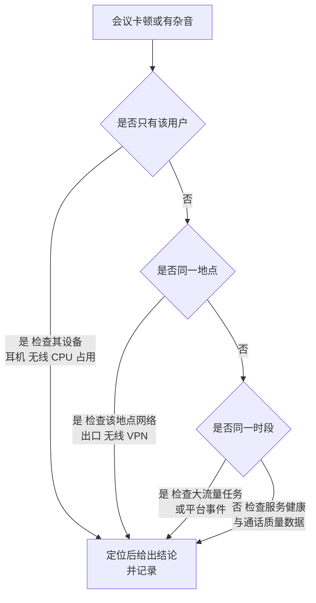
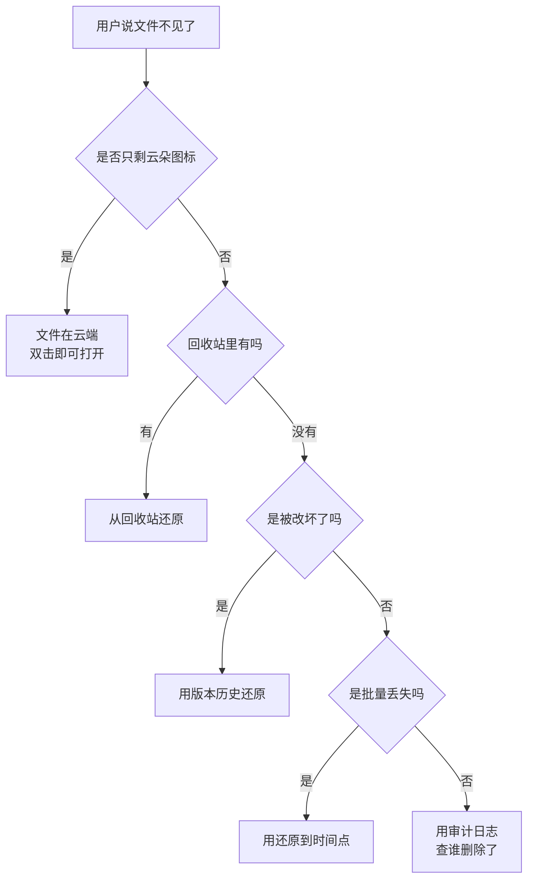

# 第6篇 上线运维与培训 · 第12节 故障排查：Teams 与文件

> **所属：** 第6篇 上线、运维与培训。  
> **本节小节：** 6.131 ～ 6.143。  
> **本节性质：** 排查手册。按症状索引，供服务台和管理员查阅。  
> **导航：** [返回第6篇目录](README.md)｜上一节：[故障排查：Office 与邮件](11-故障排查-Office与邮件.md)｜下一节：[升级、支持与知识库](13-升级支持与知识库.md)

---

## 6.131 症状索引

### Teams

| 症状 | 跳转 |
|---|---|
| Teams 无法登录 | 6.132 |
| 看不到团队或频道 | 6.132 |
| 收不到通知 | 6.133 |
| 看不到会议、日历为空 | 6.133 |
| 摄像头/麦克风/扬声器不可用 | 6.134 |
| 会议卡顿、掉线、无声音、有回声 | 6.135 |
| 无法录制或找不到录制文件 | 6.136 |
| 外部人员无法加入会议或聊天 | 6.137 |
| 来宾无法访问团队或文件 | 6.137 |
| 无法在 Outlook 中创建 Teams 会议 | 6.133 |

### 文件

| 症状 | 跳转 |
|---|---|
| OneDrive 无法登录或不同步 | 6.138 |
| 出现红色叉号、同步失败 | 6.138 |
| 提示路径过长或文件名无效 | 6.139 |
| 出现"副本"文件、同步冲突 | 6.140 |
| 文件显示只读或被锁定 | 6.140 |
| 文件不见了、只剩云朵图标 | 6.141 |
| 文件误删、误改需要恢复 | 6.141 |
| 无权限访问站点或文件 | 6.142 |
| 外部人员无法打开共享链接 | 6.142 |
| 大量文件被加密（疑似勒索） | 6.143 |

---

## 6.132 Teams 登录与可见性

| 现象 | 原因 | 处理 |
|---|---|---|
| 无法登录 | 身份问题、MFA、条件访问 | 查登录日志（第10节） |
| 登录后看不到任何团队 | 尚未被加入 | 确认成员身份 |
| 看不到某个团队 | 未被加入或已被移除 | 检查团队成员 |
| 看不到私有频道 | 未被加入该频道 | 私有频道成员独立（第4篇 4.46） |
| 看不到共享频道 | 未被加入或外部连接未建立 | 检查共享频道配置 |
| 显示旧的组织信息 | 缓存 | 退出重新登录 |
| 多租户混淆 | 同时属于多个组织 | 确认当前所在组织 |

> **推荐：** 判断"是否被加入"最快的方法是在管理中心查看该团队的成员列表，而不是让用户反复重启客户端。

---

## 6.133 通知、日历与 Outlook 集成

| 现象 | 原因 | 处理 |
|---|---|---|
| 收不到通知 | 客户端未启动、系统通知权限、通知设置 | 检查三处：客户端、系统权限、Teams 内设置 |
| 手机收不到通知 | 省电策略、后台限制 | 关闭对该应用的限制 |
| 通知太多用户关掉了 | 未培训通知设置 | 培训按频道/团队设置通知 |
| **日历为空或看不到会议** | Exchange 集成问题 | 确认邮箱状态（第3篇）；根因常在邮件侧 |
| 无法在 Outlook 中创建 Teams 会议 | Outlook 加载项未加载 | 检查加载项；确认客户端类型 |
| 会议邀请收不到 | 邮件问题 | 按第11节排查 |

> **必做：** Teams 的日历问题**根因通常在 Exchange**（第4篇 4.45）。不要在 Teams 里反复排查，先确认邮箱是否正常。

---

## 6.134 音视频设备不可用

| 现象 | 处理 |
|---|---|
| 找不到麦克风或摄像头 | 检查物理连接；检查系统隐私权限是否允许应用访问 |
| 设备被其他程序占用 | 关闭其他会议或录音软件 |
| 选错了设备 | 在 Teams 设置中选择正确设备 |
| 蓝牙耳机不稳定 | 改用有线耳机测试 |
| 虚拟桌面中设备异常 | 需专门优化方案（第4篇 4.76） |
| 会议室设备异常 | 检查设备状态与更新；纳入巡检 |

---

## 6.135 会议质量问题

### 6.135.1 分层排查

### 6.135.2 常见原因与快速处理

| 现象 | 原因 | 处理 |
|---|---|---|
| 声音断续 | 丢包、无线信号弱 | 改有线；靠近路由器 |
| **有回声** | 同一房间多设备开麦、未用耳机 | **用耳机**；只保留一台设备音频 |
| 有噪音 | 用了笔记本内置麦克风 | 用耳机 |
| 视频模糊 | 带宽不足、自动降质 | 关闭不必要的视频 |
| 屏幕共享卡顿 | 带宽或 CPU 不足 | 关闭视频；关闭其他程序 |
| 频繁掉线 | 网络不稳定、VPN 断连 | 检查链路；评估分流（第4篇 4.78） |
| 特定地点普遍卡顿 | 该地点网络瓶颈 | 按分地点评估处理（第4篇 4.79） |

> **推荐：** 面对会议质量抱怨，先问三个问题：**用耳机了吗？有线还是无线？其他人也这样吗？** 这三个问题能定位大部分个体问题（第4篇 4.77）。

---

## 6.136 录制问题

| 现象 | 原因 | 处理 |
|---|---|---|
| 无法录制 | 策略未授权 | 检查会议策略（第4篇 4.59） |
| 录制按钮灰色 | 同上，或非组织者/演示者 | 确认角色与策略 |
| **找不到录制文件** | 不知道存放位置 | 普通会议在**组织者的 OneDrive**；频道会议在该**频道站点**（第4篇 4.55） |
| 录制文件不见了 | **已过期**（默认 120 天） | 检查回收站；确认过期策略 |
| 外部人员无法观看 | 权限未授予 | 共享给对应人员 |
| 组织者离职后录制找不到 | 随其 OneDrive 处理 | 按离职交接取回（第6节 6.60） |

> **高风险：** 重要培训或会议的录制留在个人 OneDrive 中会**默认 120 天后过期**。应培训用户把重要录制**转存到指定站点**（第4篇 4.55）。

---

## 6.137 外部协作问题

| 现象 | 原因 | 处理 |
|---|---|---|
| 外部人员无法加入会议 | 匿名加入被禁用 | 检查会议策略（第4篇 4.72） |
| 外部人员一直在大厅 | 大厅设置 | 内部人员放行；确认策略是否符合设计 |
| 无法与外部组织聊天 | 外部访问未开放或对方未开放 | 检查白名单；确认双方设置（第4篇 4.69） |
| 来宾收不到邀请 | 邮件被拦或邀请未发出 | 检查邮件；重新邀请 |
| 来宾登录后看不到团队 | 尚未生效或未接受邀请 | 等待生效；确认已接受 |
| **来宾无法加入共享频道** | **来宾账号不能加入共享频道** | 改用 B2B 直接连接（第4篇 4.68） |
| 来宾能进团队但看不到文件 | SharePoint 侧共享策略过严 | 协同两侧策略（第4篇 4.73） |
| 外部人员打不开文件链接 | 链接类型或已过期 | 重新用合适类型分享（第4篇 4.96） |

> **必做：** 外部协作问题**必须同时检查 Teams 侧和 SharePoint 侧**。只查一侧是这类工单反复出现的原因。

---

## 6.138 OneDrive 同步问题

### 6.138.1 排查顺序

1. 确认已用**工作账号**登录同步客户端。
2. 查看同步状态图标与错误提示。
3. 按错误提示定位（路径过长？文件名？空间？）。
4. 检查本地磁盘空间。
5. 检查网络（代理、防火墙）。
6. 必要时退出并重新链接账号。

| 现象 | 原因 | 处理 |
|---|---|---|
| 无法登录同步客户端 | 身份问题 | 见第10节 |
| 一直"正在处理更改" | 文件数量多、首次同步 | 等待；检查是否有超大目录 |
| 红色叉号 | 特殊字符、路径过长、空间不足、文件被占用 | 按提示逐项处理 |
| 部分文件不同步 | 文件类型或名称限制 | 检查文件名与类型 |
| 图标一直转圈 | 客户端异常 | 重启客户端；必要时重新链接 |
| 换电脑后文件没了 | 未登录同步客户端或未启用已知文件夹备份 | 登录并同步 |

---

## 6.139 路径过长与文件名问题

| 现象 | 处理 |
|---|---|
| 提示路径过长 | 缩短上层文件夹名；减少层级；或改用网页版访问（第4篇 4.106） |
| 提示文件名包含无效字符 | 重命名，去除受限字符 |
| 提示名称为系统保留名 | 重命名 |
| 迁移后大量同步错误 | 迁移前的清理不彻底（第4篇 4.113） |

> **推荐：** 与用户沟通时给出**具体建议**："把 `2026年度\第一季度\销售部\华东区\客户资料\...` 这样的深层结构改成两三层"，比只说"路径太长"有用。

---

## 6.140 同步冲突与文件锁定

| 现象 | 原因 | 处理 |
|---|---|---|
| 出现"副本"文件 | 多人同时编辑非 Office 文件，或离线修改后同步 | 保留正确版本；培训**共同编辑**（第4篇 4.107） |
| Office 文件保存失败 | 冲突或权限 | 另存后处理冲突 |
| 文件显示只读 | 他人正在编辑、检出状态、权限不足 | 确认编辑状态与权限 |
| 文件被锁定 | 程序占用或未正常关闭 | 关闭占用程序；等待锁定释放 |
| 数据库文件损坏 | 放在了同步目录 | **不要把数据库文件放同步目录**（第4篇 4.106） |

---

## 6.141 文件"不见了"与恢复

### 6.141.1 先判断是哪种情况

### 6.141.2 三种恢复手段的选择

| 场景 | 手段 | 谁执行 |
|---|---|---|
| 误删单个或少量文件 | **回收站** | 用户自助 |
| 文件被覆盖或改坏 | **版本历史** | 用户自助 |
| 批量误删、批量覆盖 | **还原到时间点** | 管理员（或用户对自己的 OneDrive） |
| 超过回收站期限 | 备份方案（如有） | 管理员（第5篇 5.54） |
| 需要查明是谁删的 | **审计日志** | 管理员（第5篇 5.18） |

> **必做：** 服务台应先引导用户**自助查回收站和版本历史**。这两项能解决大部分文件恢复需求，且用户自己做最快（第4篇 4.109）。

---

## 6.142 权限与共享问题

| 现象 | 原因 | 处理 |
|---|---|---|
| 无权限访问站点 | 未加入对应组 | 按组授权原则处理（第4篇 4.88） |
| 能进站点但打不开某文件夹 | 该位置有特殊权限 | 检查是否断开了继承 |
| 权限给了但不生效 | 同步延迟 | 等待；确认授权对象正确 |
| 外部人员打不开链接 | 链接类型、已过期、策略限制 | 用合适的链接类型重新分享 |
| 用户能看到不该看的内容 | 权限设计问题 | **按事件处理并复核权限** |
| 离职员工创建的链接仍有效 | 未在离职时清理 | 清理并补充到离职流程（第6节 6.60） |

> **高风险：** "用户能看到不该看的内容"属于**数据泄露迹象**，应按安全事件流程处理（第7节），并复核该位置的权限设计，而不是只解决这一个用户。

---

## 6.143 疑似勒索软件（最高优先级）

### 6.143.1 识别迹象

| 迹象 |
|---|
| 大量文件同时被修改 |
| 文件扩展名变成陌生后缀 |
| 出现勒索说明文件 |
| 文件无法正常打开 |
| 同步客户端显示大量变更 |

### 6.143.2 立即动作

| 顺序 | 动作 |
|---|---|
| 1 | **断开受影响设备的网络** |
| 2 | **暂停该用户的同步**（防止继续上传加密文件） |
| 3 | 阻止该账号并撤销会话 |
| 4 | 通知安全负责人与管理层 |
| 5 | 评估影响范围 |
| 6 | 用**版本历史或还原到时间点**恢复（第4篇 4.109） |
| 7 | 若有备份：按方案恢复（第5篇 5.54） |
| 8 | 清理或重装受感染设备 |
| 9 | 排查感染途径并加强防线 |
| 10 | 按事件流程记录与复盘（第7节 6.75） |

> **必做：** 第 1、2 步要**立刻做**，每分钟都在增加被加密的文件数量。服务台应有权直接执行前两步，无需等待审批。

### 6.143.3 本节完成检查表

- [ ] 症状索引已交付服务台。
- [ ] Teams 登录与可见性问题排查已文档化。
- [ ] **已明确"Teams 日历问题根因通常在 Exchange"。**
- [ ] 通知问题的三处检查（客户端、系统权限、Teams 设置）已培训。
- [ ] 音视频设备问题排查已文档化。
- [ ] 会议质量分层排查流程已培训，含"耳机/有线/他人是否同样"三问。
- [ ] 录制文件位置与**默认 120 天过期**已培训。
- [ ] 已培训用户把重要录制转存到指定站点。
- [ ] 外部协作问题要求**同时检查 Teams 与 SharePoint 两侧**。
- [ ] **"来宾不能加入共享频道"**已明确。
- [ ] OneDrive 同步排查顺序已文档化。
- [ ] 路径过长与文件名问题的具体建议已准备。
- [ ] 同步冲突处理与共同编辑培训已完成。
- [ ] **三种恢复手段的选择流程已培训**，优先引导用户自助。
- [ ] 权限问题排查已文档化；"看到不该看的内容"按安全事件处理。
- [ ] **疑似勒索的立即动作（断网、暂停同步）已授权服务台直接执行。**

> **下一节：** [升级、支持与知识库](13-升级支持与知识库.md)
