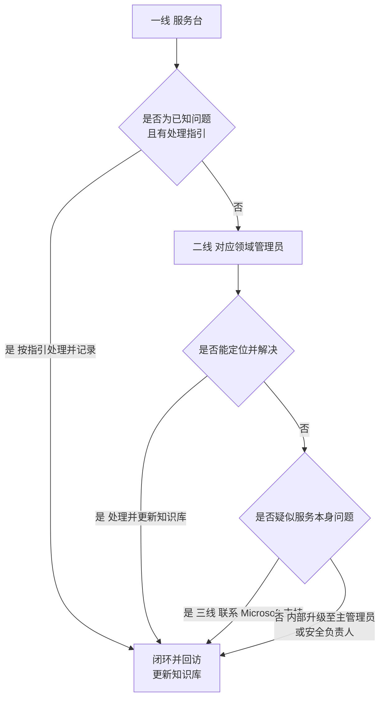

# 第6篇 上线运维与培训 · 第13节 升级、支持与知识库

> **所属：** 第6篇 上线、运维与培训。  
> **本节小节：** 6.144 ～ 6.150。  
> **本节性质：** 支撑机制。**决定问题能否被有效升级，以及经验能否被积累下来。**  
> **导航：** [返回第6篇目录](README.md)｜上一节：[故障排查：Teams 与文件](12-故障排查-Teams与文件.md)｜下一节：[本篇小结与参考资料](14-本篇小结与参考资料.md)

---

## 6.144 升级路径（什么时候找谁）

### 6.144.1 三级升级模型

### 6.144.2 各级的处理范围

| 级别 | 处理范围 | 时限建议 |
|---|---|---|
| **一线（服务台）** | 密码重置、MFA 注册引导、客户端配置、文件自助恢复、已知问题 | 当天 |
| **二线（领域管理员）** | 邮件追踪、策略排查、权限问题、审计查询、恢复操作 | 1～2 个工作日 |
| **三线（Microsoft 支持）** | 服务故障、无法解释的错误、需后台协助 | 按支持计划 |
| **安全升级（并行）** | 疑似账号被盗、勒索、数据泄露、BEC | **立即** |

> **必做：** 安全类问题**不走常规排队**。服务台一旦识别出疑似安全事件（第7节 6.72），应立即通知安全负责人，而不是按普通工单排队。

---

## 6.145 必须立即升级的情况

| 情况 | 升级对象 | 原因 |
|---|---|---|
| **所有管理员无法登录** | 主管理员 + Microsoft 支持 | 管理能力丧失（第10节 6.117） |
| **疑似账号被盗** | 安全负责人 | 需立即切断 |
| **疑似勒索软件** | 安全负责人 | 每分钟都在扩大损失 |
| **BEC 涉及资金** | 财务 + 管理层 | 需止付 |
| 全公司邮件中断 | 主管理员 | 业务影响最大 |
| 大量用户无法登录 | 主管理员 | 可能是策略问题 |
| 数据大范围丢失 | 主管理员 | 需评估恢复方案 |
| 用户能看到不该看的内容 | 安全负责人 | 数据泄露迹象 |
| 紧急访问账号有异常登录 | 安全负责人 | 最后防线被触动 |

> **推荐：** 把这张表打印出来贴在服务台。判断"要不要立即升级"时不需要思考，照表执行。

---

## 6.146 联系 Microsoft 支持

### 6.146.1 提交前准备的信息

- [ ] **租户 ID** 与主域名。
- [ ] 问题描述：现象、影响范围、开始时间。
- [ ] 受影响用户示例（账号 + 具体时间点）。
- [ ] **错误信息原文截图**（不要转述、不要翻译）。
- [ ] 相关标识：邮件追踪 ID、关联 ID、请求 ID。
- [ ] 已尝试的排查步骤和结果。
- [ ] 业务影响说明（有助于判断优先级）。
- [ ] 联系人、时区与可用时段。

### 6.146.2 提交时的建议

| 建议 | 原因 |
|---|---|
| 描述要具体 | "邮件有问题"无法处理；"某账号在某时刻发往某域名的邮件退回并提示 X"可以 |
| 说明业务影响 | 影响多少人、是否阻塞关键业务 |
| 附上已做的排查 | 避免重复步骤 |
| 保留工单编号 | 便于后续跟踪与内部记录 |
| 指定联系人 | 避免支持方联系不到人 |
| 记录沟通过程 | 便于交接与复盘 |

> **必做：** **租户 ID 等基础信息应事先记录在应急文档中**（见 6.148）。紧急情况下不要现场翻找。

---

## 6.147 知识库建设

### 6.147.1 为什么需要

| 没有知识库 | 有知识库 |
|---|---|
| 同一问题反复从头排查 | 直接按记录处理 |
| 经验随人员流动流失 | 沉淀在组织 |
| 新人上手慢 | 有可查资料 |
| 用户得到不一致的答复 | 处理方式统一 |

### 6.147.2 知识库条目模板

| 字段 | 内容 |
|---|---|
| 编号 | — |
| 标题 | **用用户的说法**，例如"Outlook 一直要求输入密码" |
| 症状 | 用户看到什么 |
| 适用范围 | 哪些客户端、哪些用户 |
| 原因 | 根本原因 |
| **处理步骤** | 逐步、可照做 |
| 验证方法 | 如何确认已解决 |
| 需要的权限 | 一线可做还是需二线 |
| 相关章节 | 链接到本方案对应小节 |
| 创建/更新日期 | — |
| 维护人 | — |

### 6.147.3 首批应建立的条目

建议从**工单量最大的 15 个问题**开始：

| 编号 | 标题（用用户的说法） | 参考章节 |
|---|---|---|
| KB1 | 我登不上去了 | 6.108 |
| KB2 | 手机收不到验证请求 | 6.111 |
| KB3 | 我换手机了怎么办 | 6.112 |
| KB4 | 手机丢了怎么办 | 6.112 |
| KB5 | 为什么老是让我验证 | 6.113 |
| KB6 | Outlook 一直要输入密码 | 6.124 |
| KB7 | Outlook 配不上邮箱 | 6.124 |
| KB8 | 客户说给我发的邮件我没收到 | 6.126 |
| KB9 | 我发的邮件进了对方垃圾箱 | 6.128 |
| KB10 | 共享邮箱打不开 / 发件人不对 | 6.129 |
| KB11 | Office 提示未激活 | 6.121 |
| KB12 | 我的宏跑不了了 | 6.123 |
| KB13 | 文件不见了 / 只剩云朵 | 6.141 |
| KB14 | 会议卡顿有回声 | 6.135 |
| KB15 | 录制文件找不到 | 6.136 |

> **推荐：** 标题一定要用**用户的原话**，而不是技术术语。服务台搜索时输入的是用户说的话，不是"Autodiscover 解析异常"。

### 6.147.4 知识库维护机制

| 动作 | 频率 |
|---|---|
| 新增条目（遇到新问题时） | 随时 |
| 更新条目（处理方式变化时） | 随时 |
| 复核准确性 | 每季度 |
| 清理过时条目 | 每季度 |
| 根据工单统计补充热点条目 | 每月 |
| 功能变化后同步更新 | 随消息中心通知 |

---

## 6.148 应急速查文档

建议单独维护一份**应急速查页**（一页纸），内容：

### 6.148.1 基础信息

| 项目 | 内容 |
|---|---|
| 租户 ID | 待填写 |
| 主域名 | 待填写 |
| 初始域名（`*.onmicrosoft.com`） | 待填写 |
| 订阅与许可概况 | 待填写 |
| 服务版本（全球版/世纪互联版） | 待填写 |

### 6.148.2 应急联系人

| 角色 | 姓名 | 电话 | 备份人 |
|---|---|---|---|
| 主管理员 | 待填写 | 待填写 | 待填写 |
| 安全负责人 | 待填写 | 待填写 | 待填写 |
| 网络/DNS 负责人 | 待填写 | 待填写 | 待填写 |
| 业务决策人 | 待填写 | 待填写 | 待填写 |
| 财务负责人（BEC 场景） | 待填写 | 待填写 | 待填写 |
| DNS 服务商支持 | — | 待填写 | — |
| 域名注册商支持 | — | 待填写 | — |
| 实施方/供应商支持 | — | 待填写 | — |

### 6.148.3 关键位置

| 项目 | 位置 |
|---|---|
| 紧急访问账号凭据保管位置 | 待填写（**不写具体凭据**） |
| 紧急账号保管人 | 待填写（两人） |
| DNS 变更前的原值记录 | 待填写 |
| 关键配置导出留档位置 | 待填写 |
| 备份方案与恢复操作文档 | 待填写 |
| 本方案文档位置 | 待填写 |
| 知识库位置 | 待填写 |

### 6.148.4 五个最紧急场景的第一动作

| 场景 | 第一动作 |
|---|---|
| 所有管理员登不上 | 用紧急访问账号从指定工作站登录（第10节 6.117） |
| 疑似账号被盗 | 阻止账号 + **撤销会话**（第7节 6.73） |
| 疑似勒索 | **断网 + 暂停同步**（第12节 6.143） |
| BEC 涉及付款 | **通知财务止付 + 联系银行**（第7节 6.74） |
| 全公司邮件中断 | 查服务健康 + 查 DNS + 邮件追踪（第11节 6.126） |

> **高风险：** 应急速查文档**不要存放在只能通过 Microsoft 365 登录才能访问的位置**。如果发生"所有管理员都登不上"的情况，存在云端的应急文档也打不开。建议同时保留一份离线副本（打印或加密存储在其他位置）。

---

## 6.149 持续改进机制

| 输入 | 动作 | 频率 |
|---|---|---|
| 工单统计 | 识别热点问题 → 补充知识库或培训 | 每月 |
| 事件复盘 | 改进措施 → 巡检清单或流程 | 每次事件后 |
| 演练结果 | 差距 → 改进计划 | 每次演练后 |
| 消息中心通知 | 影响评估 → 变更计划与培训更新 | 每周 |
| 用户反馈 | 改进培训与指引 | 持续 |
| 巡检发现 | 治理动作 | 按巡检频率 |
| 年度评审 | 整体优化与文档修订 | 每年 |

### 6.149.1 改进闭环的关键

> **必做：** 改进措施必须落到**具体载体**上，否则会停留在会议纪要里：
>
> | 改进类型 | 应落到哪里 |
> |---|---|
> | 需要定期检查的 | 巡检清单（第5节） |
> | 需要按步骤执行的 | 流程文档（第6、7节） |
> | 需要用户知道的 | 培训材料与快速手册（第9节） |
> | 需要服务台知道的 | 知识库（本节） |
> | 需要配置变更的 | 变更申请（第7节） |

---

## 6.150 本节完成检查表

- [ ] 三级升级模型已建立，各级处理范围与时限已明确。
- [ ] **安全类问题不走常规排队**已明确并培训。
- [ ] "必须立即升级"的情况清单已打印并交付服务台。
- [ ] 联系 Microsoft 支持的信息准备清单已备好。
- [ ] **租户 ID 等基础信息已事先记录**。
- [ ] 知识库已建立，条目使用统一模板。
- [ ] 首批 15 个高频条目 KB1～KB15 已创建。
- [ ] 知识库标题使用**用户的原话**而非技术术语。
- [ ] 知识库维护机制已建立（新增、更新、季度复核）。
- [ ] **应急速查文档已完成**（基础信息、联系人、关键位置、五个第一动作）。
- [ ] 应急速查文档**有离线副本**，不依赖 Microsoft 365 登录才能访问。
- [ ] 紧急账号凭据保管位置已记录（但文档中不含具体凭据）。
- [ ] 持续改进机制已建立，改进措施有明确载体。
- [ ] 年度评审与文档修订已排期。

> **下一节：** [本篇小结与参考资料](14-本篇小结与参考资料.md)
