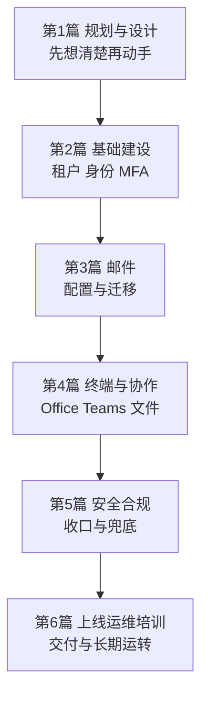

# 第6篇 上线运维与培训 · 本篇小结与参考资料

> **所属：** 第6篇 上线、运维与培训。  
> **本节内容：** 本篇小结、交付物清单、**全书总结**、官方参考资料。  
> **复核日期：** 2026-08-28。  
> **导航：** [返回第6篇目录](README.md)｜上一节：[升级、支持与知识库](13-升级支持与知识库.md)

---

## 本篇小结

第6篇把前五篇建好的系统**平稳交付给用户，并建立长期运转的机制**。

**上线部分（第 1～4 节）**

- 试点是最后也是成本最低的一道防线；**财务用户必须参与**，非人账号（打印机、业务系统）必须专门测试。
- 上线前产出五份文档：批次表、时间表、排班表、通知培训计划、回退决策文件，并**分发到每个参与者手里**。
- 切换当天三条铁律：**只做计划内变更、全程记录、回退由决策人宣布**。
- 放行清单 R1～R31 汇总了前五篇的全部前置条件。
- 验收必须**经历一个完整业务周期**，并回收迁移账号与临时凭据。
- 交接不是发文件，要开会、演示关键操作、说明例外与遗留风险，并确认**外部实施方账号已回收**。

**运维部分（第 5～7 节）**

- 巡检分四个频率；人力有限时至少做**最小巡检集**（告警、紧急账号、备份任务）。
- **消息中心是唯一能提前知道微软要改什么的渠道**，必须每周查看。
- 例外清零表要跟踪到关闭，续期需风险接受人重新签字。
- 入转离是最高频也最易出安全问题的流程；**离职五项必查**和**管理员离职处理**是重点。
- 变更管理防止自己改坏系统；**身份类变更后必须用紧急账号验证登录**。
- 事件处理覆盖账号被盗、BEC、勒索三类；BEC 最有效的防线是**业务流程**而非技术。

**培训部分（第 8～9 节）**

- 管理员培训以**实操验收**为准，K1～K10 能力必须亲手做过。
- **服务台培训优先级不低于管理员**，他们处理 80% 的工单。
- 员工培训"少而精"，安全意识（拒绝未发起的验证请求、识别 BEC）比操作技巧更重要。
- 一页纸快速手册比十页文档有效。

**故障排查手册（第 10～13 节）**

- 按症状索引，首问固定为"**网页版能否正常使用**"。
- 三步分流：网页版是否正常 → 是否只有该用户 → 是否同地点/同时段。
- 疑似勒索的**断网与暂停同步应授权服务台直接执行**。
- 知识库标题用**用户的原话**；应急速查文档要有**离线副本**。

### 本篇最重要的七条纪律

1. **试点必须包含财务用户和非人账号测试。**
2. **切换当天只做计划内变更，全程记录。**
3. **验收必须经历一个完整业务周期。**
4. **消息中心每周查看**——文档会过时，它是权威来源。
5. **离职五项必查**，且管理员离职要重置共享凭据与紧急账号凭据。
6. **身份类变更后立即用紧急访问账号验证登录。**
7. **应急速查文档要有离线副本**，不能只存在云端。

---

## 本篇交付物清单

| 编号 | 交付物 | 对应小节 | 状态 |
|---|---|---|---|
| 1 | 试点名单与知情同意 | 6.3 | 待完成 |
| 2 | 试点验证记录 P1～P47 | 6.5–6.10 | 待完成 |
| 3 | 试点问题登记表 | 6.11 | 待完成 |
| 4 | **试点报告（含负面反馈与上线建议）** | 6.13 | 待完成 |
| 5 | 上线批次表 | 6.16 | 待完成 |
| 6 | 切换时间表（细化到小时） | 6.17 | 待完成 |
| 7 | 排班表（含备份联系人与升级路径） | 6.18 | 待完成 |
| 8 | **放行清单 R1～R31** | 6.19 | 待完成 |
| 9 | 用户通知与培训计划 | 6.20 | 待完成 |
| 10 | **回退决策文件** | 6.21 | 待完成 |
| 11 | 切换执行记录表 | 6.24 | 待完成 |
| 12 | 切换验证记录 C1～C18 | 6.28 | 待完成 |
| 13 | 监控记录表 | 6.30 | 待完成 |
| 14 | **回退决策记录**（无论结论） | 6.32 | 待完成 |
| 15 | 第一天/第一周/第一个月检查记录 | 6.34 | 待完成 |
| 16 | 旧系统下线条件确认 D1～D19 | 6.35 | 待完成 |
| 17 | 项目验收清单（汇总各篇） | 6.36 | 待完成 |
| 18 | **未完成事项与剩余风险登记（含风险接受人签字）** | 6.37 | 待完成 |
| 19 | 文档交接清单与交接会议记录 | 6.38 | 待完成 |
| 20 | 项目总结报告与复盘记录 | 6.39 | 待完成 |
| 21 | **巡检清单（日/周/月/季）与责任人** | 6.44–6.47 | 待完成 |
| 22 | 巡检记录表（建议 SharePoint 列表） | 6.48 | 待完成 |
| 23 | 消息中心处理与跟踪表 | 6.49 | 待完成 |
| 24 | 月度运维报告机制 | 6.46 | 待完成 |
| 25 | **入职检查表 N1～N15** | 6.57 | 待完成 |
| 26 | **转岗检查表 T1～T14** | 6.58 | 待完成 |
| 27 | **离职检查表 L1～L14 与五项必查 F1～F5** | 6.59、6.60 | 待完成 |
| 28 | **管理员离职流程 AD1～AD10** | 6.63 | 待完成 |
| 29 | 流程演练记录 E1～E5 | 6.65 | 待完成 |
| 30 | 变更申请表模板与流程 | 6.69、6.70 | 待完成 |
| 31 | 关键配置定期导出比对机制 | 6.71 | 待完成 |
| 32 | **安全事件处理流程**（账号被盗、BEC、勒索） | 6.73–6.75 | 待完成 |
| 33 | 事件记录表与复盘机制 | 6.76 | 待完成 |
| 34 | 管理员培训材料与**实操考核记录** | 6.81–6.90 | 待完成 |
| 35 | 员工培训材料清单 | 6.103 | 待完成 |
| 36 | **员工快速手册（一页纸）** | 6.102 | 待完成 |
| 37 | 培训效果确认记录 | 6.104 | 待完成 |
| 38 | 故障排查手册（第 10～13 节） | — | 已完成 |
| 39 | **知识库首批条目 KB1～KB15** | 6.147 | 待完成 |
| 40 | **应急速查文档（含离线副本）** | 6.148 | 待完成 |
| 41 | 持续改进机制 | 6.149 | 待完成 |

---

## 全书总结

至此，六篇全部完成。整个方案的逻辑是：

### 全书最重要的十条

1. **租户创建国家或地区不可回退**，创建前必须核对合规要求（第1、2篇）。
2. **先建齐所有收件对象，再切 MX**，顺序不能颠倒（第3篇）。
3. **所有阻断型策略必须排除紧急访问账号**，且变更后立即验证登录（第2篇）。
4. **短信验证不作为长期方案**——2026-09-01 passkey 默认化、2027-02-01 微软提供的短信/语音退役（第2篇）。
5. **试迁移不通过，绝不进入批量迁移**；有委派关系的用户必须同批（第3篇）。
6. **高风险 Office 依赖必须由业务用户本人确认结果正确**，不只是"没报错"（第4篇）。
7. **共享链接默认值设为"特定人员 + 查看"**——成本最低、收益最高的单项配置（第4篇）。
8. **同步不是备份**；恢复能力必须演练，含勒索场景（第4、5篇）。
9. **例外必须清零**，每项有负责人和到期日期（第5篇）。
10. **消息中心每周查看**——本文档会过时，它是权威来源（第6篇）。

### 需要长期跟踪的时间线

| 事项 | 状态 | 所在篇 |
|---|---|---|
| **passkey 默认化** | 2026-09-01 起自动启用并引导注册 | 第2篇 2.79 |
| **微软提供的短信/语音退役** | 2027-02-01 完全退役 | 第2篇 2.79 |
| **EWS 阻止非微软应用** | 2026-10-01 起（影响第三方迁移工具） | 第3篇 3.50 |
| **Exchange 2016/2019 ESU 结束** | 2026 年 10 月 | 第3篇 3.48 |
| **Office LTSC 2021 连接支持结束** | 2026-10-13 | 第4篇 4.5 |
| Windows 10 上 Microsoft 365 Apps 安全更新 | 至 2028-10-10 | 第4篇 4.5 |
| SMTP AUTH 基本认证 | 2026 年 12 月底后默认关闭 | 第1、3篇 |
| Microsoft 365 Backup 计费方式 | 2026-04-01 后新客户使用新入口 | 第5篇 5.54 |

> **必做：** 上表中多个时间点就在**未来数月内**。请把它们加入日历提醒，并通过消息中心跟踪最新状态。

### 全书文档结构

| 篇 | 小节数 | 编号范围 | 主要交付物数 |
|---|---:|---|---:|
| 第1篇 规划与设计 | 9 | 1.1–1.35 | 15 |
| 第2篇 基础建设 | 11 | 2.1–2.119 | 28 |
| 第3篇 邮件 | 11 | 3.1–3.94 | 32 |
| 第4篇 终端与协作 | 14 | 4.1–4.118 | 34 |
| 第5篇 安全合规与设备 | 6 | 5.1–5.60 | 35 |
| 第6篇 上线运维与培训 | 14 | 6.1–6.150 | 41 |

---

## 本篇参考资料

以下资料均为 Microsoft 官方文档。功能与流程可能随时间变化，正式实施前应再次核对：

**上线与迁移**

1. [Microsoft 365 deployment guidance](https://learn.microsoft.com/en-us/microsoft-365/enterprise/microsoft-365-overview)
2. [Ways to migrate multiple email accounts to Microsoft 365](https://learn.microsoft.com/en-us/exchange/mailbox-migration/mailbox-migration)
3. [Add a custom domain to Microsoft 365](https://learn.microsoft.com/en-us/microsoft-365/admin/setup/add-domain?view=o365-worldwide)

**运维与监控**

4. [How to check Microsoft 365 service health](https://learn.microsoft.com/en-us/microsoft-365/enterprise/view-service-health)
5. [Message center in the Microsoft 365 admin center](https://learn.microsoft.com/en-us/microsoft-365/admin/manage/message-center)
6. [Microsoft 365 admin center activity reports](https://learn.microsoft.com/en-us/microsoft-365/admin/activity-reports/activity-reports)
7. [Microsoft Entra ID sign-in logs](https://learn.microsoft.com/en-us/entra/identity/monitoring-health/concept-sign-ins)
8. [Search the audit log](https://learn.microsoft.com/en-us/purview/audit-search)

**账号生命周期**

9. [Add users and assign licenses at the same time](https://learn.microsoft.com/en-us/microsoft-365/admin/add-users/add-users)
10. [Remove a former employee](https://learn.microsoft.com/en-us/microsoft-365/admin/add-users/remove-former-employee)
11. [Convert a user mailbox to a shared mailbox](https://learn.microsoft.com/en-us/microsoft-365/admin/email/convert-user-mailbox-to-shared-mailbox)
12. [OneDrive retention and deletion](https://learn.microsoft.com/en-us/sharepoint/retention-and-deletion)
13. [Remove a former employee: block sign-in and revoke access](https://learn.microsoft.com/en-us/microsoft-365/admin/add-users/remove-former-employee-step-4)

**安全事件处理**

14. [Responding to a compromised email account](https://learn.microsoft.com/en-us/defender-office-365/responding-to-a-compromised-email-account)
15. [Detect and remediate Outlook rules and custom forms injections attacks](https://learn.microsoft.com/en-us/defender-office-365/detect-and-remediate-outlook-rules-forms-attack)
16. [Detect and remediate illicit consent grants](https://learn.microsoft.com/en-us/defender-office-365/detect-and-remediate-illicit-consent-grants)
17. [Malware and ransomware protection in Microsoft 365](https://learn.microsoft.com/en-us/compliance/assurance/assurance-malware-and-ransomware-protection)
18. [Restore your OneDrive](https://support.microsoft.com/en-us/office/restore-your-onedrive-fa231298-759d-41cf-bcd0-25ac53eb8a15)

**故障排查**

19. [Troubleshoot email authentication in Microsoft 365](https://learn.microsoft.com/en-us/defender-office-365/email-authentication-troubleshoot)
20. [Message trace in the Microsoft Defender portal](https://learn.microsoft.com/en-us/defender-office-365/message-trace-defender-portal)
21. [Troubleshoot Microsoft Teams](https://learn.microsoft.com/en-us/microsoftteams/troubleshoot/teams-welcome)
22. [Fix OneDrive sync problems](https://support.microsoft.com/en-us/office/fix-onedrive-sync-problems-0899b115-05f7-45ec-95b2-e4cc8c4670b2)
23. [Overview of licensing and activation in Microsoft 365 Apps](https://learn.microsoft.com/en-us/microsoft-365-apps/licensing-activation/overview-licensing-activation-microsoft-365-apps)

**支持**

24. [Get support for Microsoft 365 for business](https://learn.microsoft.com/en-us/microsoft-365/admin/get-help-support)
25. [Microsoft 365 for business training and resources](https://learn.microsoft.com/en-us/microsoft-365/business-video/)

### 需要重点复核的时效性内容

| 内容 | 说明 |
|---|---|
| 全书涉及的所有产品时间线 | 见"需要长期跟踪的时间线"表，通过**消息中心**跟踪 |
| 管理中心的界面与导航路径 | 会持续调整；本方案优先记录目的与验证方法 |
| 各项能力的许可归属 | 产品打包会调整，采购前必须书面核对 |

> Content was rephrased for compliance with licensing restrictions. 本篇对官方资料进行了中文归纳，没有替代微软产品条款、服务说明、合同或企业自身的法律与合规评审。本文档中的账号、域名、路径和人员信息均为虚构示例。

---

## 致读者

这套方案的目标不是"照着做就一定成功"，而是**让你知道每一步该问什么问题、该验证什么、出问题时该怎么退回去**。

如果只能记住三句话：

1. **先想清楚再动手**——第1篇的调查和决策，决定了后面五篇的成败。
2. **每个高风险操作都要有验证和回退**——不是为了流程好看，而是为了出问题时还有路。
3. **文档会过时，机制不会**——巡检、演练、消息中心跟踪和知识库，才是长期可靠的保障。

祝项目顺利。
