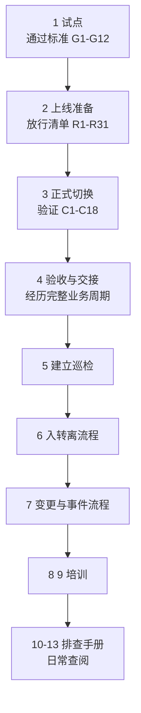

# 第6篇 上线、运维与培训

> **本篇作用：** 把前五篇建好的系统**平稳交付给用户**，并建立**长期运转的机制**——巡检、入转离、变更、事件处理、培训和故障排查手册。  
> **本篇特点：** 前五篇是"建系统"，本篇是"让系统长期健康运转"。项目结束后，日常真正会被翻开的就是本篇。  
> **文档状态：** 本篇正文已完成（14 个小节文件）。表格中的“待填写”是企业实际数据占位。  
> **版本与复核日期：** v1.0，2026-08-28。  
> **对应原章节：** 第11、12、13、14章。  
> **导航：** [返回方案总目录](../README.md)｜上一篇：[第5篇 安全合规与设备管理](../05-安全合规与设备管理/README.md)

---

## 一、本篇小节文件

### 上线部分

| 顺序 | 文件 | 覆盖小节 | 主要内容 |
|---:|---|---|---|
| 1 | [试点实施](01-试点实施.md) | 6.1–6.14 | 试点选人、验证项 P1–P47、问题分级、**通过标准 G1–G12** |
| 2 | [上线准备与切换计划](02-上线准备与切换计划.md) | 6.15–6.22 | 批次表、时间表、排班、**放行清单 R1–R31**、回退决策文件 |
| 3 | [正式切换执行](03-正式切换执行.md) | 6.23–6.33 | **三条铁律**、执行记录、验证 C1–C18、监控、回退决策 |
| 4 | [上线后验收与交接](04-上线后验收与交接.md) | 6.34–6.40 | 三阶段检查、下线条件 D1–D19、验收 A1–A16、文档交接、复盘 |

### 运维部分

| 顺序 | 文件 | 覆盖小节 | 主要内容 |
|---:|---|---|---|
| 5 | [日常巡检与运维职责](05-日常巡检与运维职责.md) | 6.41–6.54 | 职责分工、**日/周/月/季巡检清单**、消息中心、例外跟踪 |
| 6 | [入职、转岗与离职标准流程](06-入转离标准流程.md) | 6.55–6.66 | N1–N15、T1–T14、L1–L14、**离职五项必查**、**管理员离职 AD1–AD10** |
| 7 | [变更管理与安全事件处理](07-变更管理与安全事件处理.md) | 6.67–6.78 | 变更流程、配置留档、**账号被盗/BEC/勒索处理**、联系支持 |

### 培训部分

| 顺序 | 文件 | 覆盖小节 | 主要内容 |
|---:|---|---|---|
| 8 | [管理员培训](08-管理员培训.md) | 6.79–6.91 | 九个模块、实操练习、**能力清单 K1–K10**、考核场景 S1–S10 |
| 9 | [员工培训与快速手册](09-员工培训与快速手册.md) | 6.92–6.105 | 少而精原则、安全意识、分岗位培训、**一页纸快速手册** |

### 故障排查手册

| 顺序 | 文件 | 覆盖小节 | 主要内容 |
|---:|---|---|---|
| 10 | [故障排查：登录与 MFA](10-故障排查-登录与MFA.md) | 6.106–6.118 | **三步分流法**、症状索引、丢手机、被策略阻止、管理员被锁 |
| 11 | [故障排查：Office 与邮件](11-故障排查-Office与邮件.md) | 6.119–6.130 | 激活、宏与加载项、Outlook 配置、收不到邮件、退信与隔离 |
| 12 | [故障排查：Teams 与文件](12-故障排查-Teams与文件.md) | 6.131–6.143 | Teams 登录、会议质量、录制、同步、文件恢复、**疑似勒索** |
| 13 | [升级、支持与知识库](13-升级支持与知识库.md) | 6.144–6.150 | 三级升级、立即升级清单、**知识库 KB1–KB15**、**应急速查文档** |
| 14 | [本篇小结与参考资料](14-本篇小结与参考资料.md) | — | 小结、41 项交付物、**全书总结**、25 项官方参考资料 |

---

## 二、实施顺序

---

## 三、本篇七条硬性纪律

1. **试点必须包含财务用户和非人账号（打印机、业务系统）测试。**
2. **切换当天只做计划内变更，全程记录，回退由决策人宣布。**
3. **验收必须经历一个完整业务周期**（如月结）。
4. **消息中心每周查看**——文档会过时，它是权威来源。
5. **离职五项必查**；管理员离职要重置共享凭据与紧急账号凭据。
6. **身份类变更后立即用紧急访问账号验证登录。**
7. **应急速查文档要有离线副本**，不能只存在云端。

---

## 四、项目结束后最常被翻开的三份东西

| 排序 | 内容 | 位置 |
|---:|---|---|
| 1 | **故障排查手册** | 第 10～13 节 |
| 2 | **巡检清单** | 第 5 节 |
| 3 | **入转离流程** | 第 6 节 |

> **推荐：** 把这三部分单独打印或做成内部页面，比让运维人员每次翻整本方案更实用。

---

## 五、本篇必须产出的结论

- [ ] 试点报告（含负面反馈与明确的上线建议）。
- [ ] 上线五份文档（批次、时间表、排班、通知培训、回退决策）。
- [ ] 放行清单 R1～R31 确认记录。
- [ ] 切换执行与验证记录、**回退决策记录**（无论结论）。
- [ ] 旧系统下线条件确认。
- [ ] **未完成事项与剩余风险登记（含风险接受人签字）**。
- [ ] 文档交接记录与项目总结复盘。
- [ ] **巡检清单与责任人**（日/周/月/季）。
- [ ] **入职、转岗、离职三套检查表**（含五项必查与管理员离职流程）。
- [ ] 变更申请表模板与安全事件处理流程。
- [ ] 管理员实操考核记录与员工快速手册。
- [ ] **知识库首批条目与应急速查文档（含离线副本）**。

完整交付物清单（41 项）见[本篇小结与参考资料](14-本篇小结与参考资料.md)。

---

## 六、阅读提示

- 提示标记 **必做 / 推荐 / 按需 / 高风险 / 验证点 / 回退点 / 许可证要求** 的含义见[方案总目录](../README.md)。
- 第 10～13 节是**按症状索引的排查手册**，建议服务台直接从症状索引进入。
- 全书涉及的产品时间线汇总在[第14节](14-本篇小结与参考资料.md)，请通过消息中心持续跟踪。
- 所有示例账号、域名、路径和人员信息均为虚构数据。
