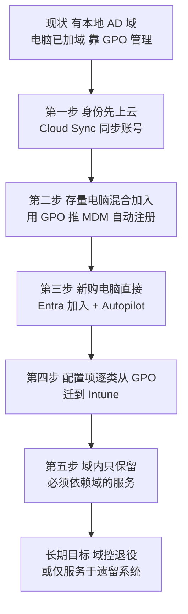

# 第7篇 终端统一管理 · 第1节 Intune 是什么与本篇定位

> **所属：** 第7篇（专题）终端统一管理：Intune 与组策略。  
> **本节小节：** 7.1 ～ 7.10。  
> **本节性质：** 概念与总体决策。**这一节不做任何配置**，目的是让你先分清 Intune、组策略、SCCM 各管什么，再决定本企业走哪条路。  
> **前置条件：** 已完成第1篇（许可与架构）、第2篇（身份与 MFA）。建议在第4篇（Office 与 Teams 部署）之后阅读。  
> **导航：** [返回第7篇目录](README.md)｜下一节：[设备身份与加入方式](02-设备身份与加入方式.md)

---

## 7.1 本篇在整个项目中的位置

第5篇第4节（5.36–5.49）回答的是**“要不要管设备、管到哪个层级”**——那是安全合规视角的**决策**。本篇回答的是**“选定层级之后，具体怎么落地”**——这是实施视角的**操作**。

| 问题 | 在哪一篇 |
|---|---|
| 只做账号保护够不够？要不要管设备？ | 第5篇 5.37 |
| 管到哪个层级（仅注册 / 应用保护 / 完整管理）？ | 第5篇 5.38 |
| 个人电脑怎么处理？BYOD 的隐私边界在哪？ | 第5篇 5.42 |
| 设备丢了怎么擦除？离职怎么衔接？ | 第5篇 5.44、5.45 |
| **Intune 具体怎么配？设备怎么注册进来？** | **本篇第 2～7 节** |
| **组策略怎么用？和 Intune 冲突怎么办？** | **本篇第 8～9 节** |

> **说明：** 本篇是**专题篇**，不属于项目阶段序列（第1→6篇是按项目阶段排的）。建议的阅读时机是：**第4篇的 Office 部署做完、第5篇的层级决策定下来之后**。如果你已经决定“本期只做账号保护、不管设备”，本篇可以整篇跳过，但第 8 节（组策略详解）仍然值得读——因为它和 Office 配置管理直接相关（第4篇 4.22.5）。

---

## 7.2 本节目标

完成本节后应当能够：

1. 用一句话向管理层解释 Intune 是干什么的。
2. 说清 Intune、组策略、SCCM 三者的分工，不再混为一谈。
3. 知道本方案的 E3 许可下 Intune 能做什么、不能做什么。
4. 确定本企业的总体路线（本方案：**有本地 AD，逐步走纯云**）。

---

## 7.3 Intune 是什么

**一句话：Intune 是云端的设备与应用管理平台——让 IT 能对不在公司网络里的电脑和手机下发配置、装软件、判断是否合规，并在丢失时远程擦除。**

它解决的是一个很具体的变化：

| 过去 | 现在 |
|---|---|
| 电脑都在公司局域网内，开机就能连到域控 | 员工在家、在客户现场、在机场用同一台电脑办公 |
| 靠组策略下发配置，靠域控做身份验证 | 设备可能几周不回公司网络，组策略下不去 |
| 手机基本不管 | 手机上有邮件、Teams 和公司文件 |

Intune 的做法是**把管理通道从“局域网 + 域控”换成“互联网 + 云服务”**：设备只要能上网，就能收到策略、报告状态、被远程处置。

### 7.3.1 三个最容易被误解的点

| 误解 | 事实 |
|---|---|
| “Intune 是杀毒软件” | 不是。Intune 是**管理平台**，它可以配置和启用 Defender，但杀毒能力来自 Defender 本身 |
| “装了 Intune 就等于设备安全了” | 不是。Intune 只是下发和检查的手段，**安全效果取决于你配了什么策略** |
| “Intune 要在服务器上装” | 不需要。它是云服务，没有服务器要维护；只有混合场景需要装一个连接器（见 7.15） |

---

## 7.4 Intune 与组策略、SCCM 的关系

三者经常被放在一起比较，实际分工如下：

| 维度 | 组策略（GPO） | Intune | Configuration Manager（SCCM） |
|---|---|---|---|
| 管理通道 | 本地域控，需要网络可达 | 互联网，设备能上网即可 | 本地服务器 + 客户端 |
| 管什么设备 | **只管加入本地域的 Windows** | Windows、iOS、Android、macOS | 主要是 Windows 与服务器 |
| 生效时机 | 开机／登录／约 90 分钟刷新 | 设备签入时（周期不固定，可手动同步） | 按客户端策略周期 |
| 配置颗粒度 | 极细（数千项，含很多老设置） | 覆盖主流设置，持续增加 | 极细 |
| 软件分发 | 弱（只支持 MSI，见第4篇 4.22.4） | 强（含 Win32、Store、M365 Apps） | 强 |
| 报表 | 弱（要靠 `gpresult` 逐台看） | 有集中报表 | 强 |
| 是否需要服务器 | 需要域控 | **不需要** | 需要 |
| 本方案 | **过渡期继续使用，逐步收缩**（第 8、9 节） | **目标平台** | **不引入**（无现有基础设施，新建成本高） |

> **推荐：** 不要把这三者理解成“新的取代旧的”。更准确的理解是——**组策略管的是“在公司网络里的域内电脑”，Intune 管的是“任何地方的任何设备”**。在过渡期内两者会长期共存，这不是临时状态，而是要主动设计的常态（第 9 节）。

---

## 7.5 E3 下的 Intune 能力边界

本方案许可基线为 **Microsoft 365 E3**（第1篇 1.26）。Intune 相关能力如下：

| 能力 | E3 是否包含 | 说明 |
|---|---|---|
| **Intune Plan 1**（核心设备与应用管理） | ✅ | 合规策略、配置配置文件、应用部署、条件访问联动 |
| **Intune Plan 2** | ✅ **已含**（2026 夏季打包更新，第1篇 1.26.4） | 含 Microsoft Tunnel、专用设备管理等 |
| **Intune Remote Help** | ✅ **已含** | 受管的远程协助，服务台可用（第 10 节） |
| **Intune Advanced Analytics** | ✅ **已含** | 设备与应用的深度分析报表 |
| **Windows Autopatch** | ✅ **已含**（E3 含 Windows Enterprise E3） | 自动化的 Windows 与 Office 更新管理，**无额外费用**（第 7 节） |
| Windows 11 Enterprise 升级权利 | ✅ | 第1篇 1.26.2 |
| Defender for Endpoint **P1** | ✅ | 下一代防病毒、攻击面减少、设备控制、Web 保护 |
| Defender for Endpoint **P2**（EDR、高级搜寻） | ❌ | 影响“设备风险等级”类合规条件，见 7.5.1 |
| 端点特权管理（EPM） | ❌ | 本方案不采购 |
| Cloud PKI、企业应用管理 | ❌ | 本方案不采购 |
| 端点 DLP | ❌ | DLP 覆盖范围见第5篇 5.31 |

> **验证点：** Plan 2、Remote Help、Advanced Analytics 是 2026 年夏季**新并入 E3** 的，按租户分批推送。**动手之前先在管理中心确认本租户已实际获得对应服务计划**，不要因为公告说含了就假设界面里一定有。

### 7.5.1 缺少 Defender for Endpoint P2 的具体影响

这是 E3 下唯一会**直接改变配置方案**的缺口：

| 想做的事 | E3 下的结论 |
|---|---|
| 合规策略里判断“设备风险等级低于某档” | ❌ **不可用**（需要 EDR 提供风险评分）。本方案**不启用该条件**（第5篇 5.41） |
| 合规策略里判断防病毒已启用、系统版本、加密状态、密码强度 | ✅ 可用，这些是本方案合规策略的主体（第 4 节） |
| 端点上的病毒防护与攻击面减少 | ✅ 可用（P1） |
| 攻击事件的自动调查与高级搜寻 | ❌ 不可用 |

> **说明：** 换句话说，**E3 的合规判断是“配置是否达标”，不是“这台机器现在有没有被攻击”**。前者靠策略检查，后者需要 EDR。这个差别要在设计合规策略时说清楚，避免管理层以为“设备合规”等于“设备没被入侵”。

---

## 7.6 管理中心与术语对照

Intune 的管理入口是 **Microsoft Intune 管理中心**（`intune.microsoft.com`）。常用位置：

| 你要做的事 | 在哪里 |
|---|---|
| 看设备清单与合规状态 | 设备 |
| 配置合规策略 | 设备 → 合规性 |
| 配置设备设置（如 BitLocker、防火墙） | 设备 → 配置 |
| 部署应用 | 应用 |
| 配置注册方式与限制 | 设备 → 注册 |
| Autopilot 设备与配置文件 | 设备 → 注册 → Windows Autopilot |
| 更新环与功能更新 | 设备 → Windows 更新 |
| 组策略迁移分析 | 设备 → 组策略分析 |
| 远程协助 | 设备 → 选中设备 → 新建远程协助会话 |

### 7.6.1 术语对照（组策略 ↔ Intune）

熟悉域环境的人容易被术语绊住，对照如下：

| 组策略里的概念 | Intune 里的对应概念 |
|---|---|
| GPO（组策略对象） | **配置配置文件**（Configuration profile） |
| 链接 GPO 到 OU | **把配置文件分配给组**（Assignment） |
| 安全筛选 | 分配时选择包含／排除的组 |
| WMI 筛选 | **筛选器**（Filter，按设备属性筛选） |
| `gpupdate /force` | 设备上的“同步”按钮，或管理中心的“同步设备操作” |
| `gpresult /h` | 设备 → 选中设备 → **设备配置**（看每条策略的成功/失败） |
| 中央存储的 ADMX | **导入的管理模板** / 设置目录 |
| 域控 | 无（云服务） |

> **推荐：** 最重要的一个思维转换是：**组策略是“推”（域控在你回到网络时推给你），Intune 是“拉”（设备定期主动签入来取）**。所以 Intune 的策略生效不是即时的，排查“策略没生效”时第一件事是确认**设备最近一次签入时间**（第 11 节 7.120）。

---

## 7.7 本方案的总体路线：有本地 AD，逐步走纯云

本企业**现有本地 AD 域**，目标是**逐步走向纯云**。据此确定的路线：

| 阶段 | 做什么 | 本篇对应 |
|---|---|---|
| 第一步 | 账号同步上云（已在第2篇完成） | 第2篇 2.57–2.68 |
| 第二步 | **存量已加域电脑**混合加入并注册进 Intune | 第 2 节 7.17、第 3 节 7.25 |
| 第三步 | **新购电脑**不再加域，直接 Entra 加入 + Autopilot | 第 2 节 7.18、第 3 节 7.27 |
| 第四步 | 配置项**按类别**从 GPO 迁到 Intune | 第 9 节 |
| 第五步 | 域内只留必须依赖域的东西（文件服务器、老业务系统、打印服务） | 第 9 节 7.106 |

> **必做：** **不要试图一步到纯云。** 现实的顺序是“新机器走新路、老机器走过渡路、配置项分批迁”。同时维护两套管理方式在过渡期是**正常的、必要的**，不是做错了。

> **高风险：** 过渡期最大的风险是**同一个设置在 GPO 和 Intune 里都配了，且值不一样**。这会产生“看起来配了但实际是另一个值”的现象，排查极其困难。第 9 节 7.99 给出了处理规则，**在开始迁移之前必须先读**。

---

## 7.8 实施顺序与里程碑

| 顺序 | 里程碑 | 本篇章节 | 验收标准 |
|---:|---|---|---|
| 1 | 确定设备身份策略（谁混合加入、谁纯云） | 第 2 节 | 有书面决策与人群划分 |
| 2 | 存量设备注册进 Intune | 第 3 节 | 目标设备在管理中心可见 |
| 3 | 合规策略上线并与条件访问联动 | 第 4 节 | 不合规设备被正确拦截 |
| 4 | 基础配置配置文件下发 | 第 5 节 | 加密、防火墙、防病毒达标 |
| 5 | 应用部署跑通 | 第 6 节 | 至少一个 Win32 应用成功下发 |
| 6 | 更新管理接管 | 第 7 节 | 更新环生效，报表可见 |
| 7 | 组策略侧收缩与迁移 | 第 8、9 节 | 已迁项目在 GPO 侧关闭 |
| 8 | 远程协助与巡检纳入运维 | 第 10 节 | 纳入第6篇巡检清单 |

> **必做：** 顺序不能乱。特别是**第 3 步（合规策略 + 条件访问）必须在设备注册完成之后**——如果先启用“要求合规设备”的条件访问策略，而设备还没注册进来，会造成**大面积无法登录**。这是本篇最高风险的动作，第 4 节 7.44 有专门的防护步骤。

---

## 7.9 常见误区

| 误区 | 纠正 |
|---|---|
| “先把条件访问的合规设备要求打开，逼大家去注册” | **极其危险**。会直接锁死未注册用户。正确顺序见 7.8 |
| “Intune 配了策略马上就生效” | 是“拉”模式，取决于设备签入。排查先看签入时间 |
| “混合加入是过渡，所以随便配” | 混合加入依赖域控可达和 Connect 同步，配错会导致设备两边都不对（7.15） |
| “所有 GPO 设置都要迁到 Intune” | 部分设置**应该留在 GPO**（登录脚本、驱动器映射、打印机），见 7.106 |
| “设备合规就等于设备安全” | E3 的合规是“配置达标”，不含 EDR 的入侵检测（7.5.1） |
| “个人手机装了 Intune 公司就能看我照片” | 应用保护策略只管公司应用内的数据，边界要向员工讲清（第5篇 5.40） |
| “有了 Intune 就不需要组策略了” | 过渡期长期共存，且部分场景 GPO 仍是最优解 |

---

## 7.10 本节完成检查表

- [ ] 已能用一句话说清 Intune 的作用，并向管理层解释过。
- [ ] 已分清 Intune、组策略、SCCM 的分工，并确认**本方案不引入 SCCM**。
- [ ] 已确认本租户**实际获得** Intune 服务计划（含 Plan 2、Remote Help、Advanced Analytics）。
- [ ] 已知悉 **Windows Autopatch 在 E3 中已含且无额外费用**，并纳入第 7 节规划。
- [ ] 已知悉 **Defender for Endpoint P2 不含**，因此**不启用“设备风险等级”类合规条件**。
- [ ] 已确定总体路线：**存量设备混合加入过渡、新设备直接 Entra 加入、配置项分批迁移**。
- [ ] 已理解“组策略是推、Intune 是拉”的差别，并知道排查时先看设备签入时间。
- [ ] 已知悉过渡期**同一设置两边都配**是最大风险，并计划在迁移前先读 7.99。
- [ ] 实施顺序已确认，特别是**条件访问的合规设备要求必须在设备注册完成之后才启用**。

> **进入下一节的条件：** 总体路线已获 IT 负责人确认。下一节处理**设备身份**——这是整个终端管理的地基，选错了后面全部要返工。

