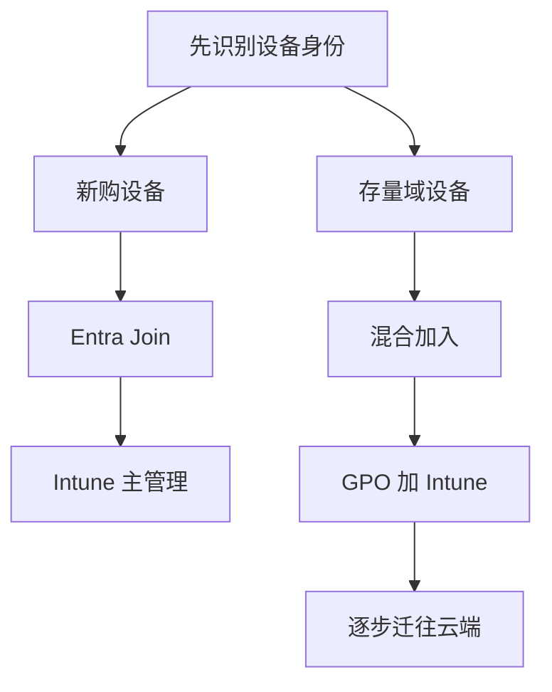

# 第7篇 Microsoft 365 E3 终端安装与管理 · 第1节 三种技术的关系与本篇结论

> **本节小节：** 7.1 ～ 7.8。
> **导航：** [返回第7篇目录](README.md)｜下一节：[Intune Plan 1 与 Plan 2 技术边界](02-Intune-Plan1与Plan2技术边界.md)

---

## 7.1 本节目标

本节先给出本企业结论，再分别定义 Intune、本地组策略和域组策略。读完后，应能够回答“哪类设备由谁管理、软件由谁安装、长期配置归谁负责”。

**本企业结论如下：**

1. **新设备走纯云。** 新购 Windows 设备优先采用 Microsoft Entra Join + Windows Autopilot + Intune，不再为了“能管理”而先加入本地 AD 域。
2. **存量域设备走过渡路线。** 已加入本地 AD 域的 Windows 先配置混合 Microsoft Entra Join，再由域 GPO 触发自动注册 Intune；域 GPO 暂时保留遗留依赖，现代应用、合规和更新逐步迁往 Intune。
3. **Intune 是目标管理平台。** M365 Apps、Win32、MSI、Microsoft Store 应用、脚本、配置、合规、设备动作和更新管理等主体能力属于 Intune Plan 1。Plan 2 是附加在 Plan 1 上的高级层，不是普通 Windows 软件推送的前提。
4. **本地组策略只作单机工具。** `gpedit.msc` 仅配置当前电脑，适合验证、排障或长期离线例外，不能承担企业集中推送。
5. **域组策略是过渡和遗留平台。** AD、GPMC 与 SYSVOL 支撑集中策略，适合域内设备、登录脚本、映射驱动器、打印机及遗留应用，但不作为新设备的默认终局。
6. **同一设置只有一个所有者。** Intune、本地组策略和域 GPO 不应长期同时控制同一设置。所有迁移必须记录“当前所有者、目标所有者、试点批次、回退方法”。

## 7.2 Intune：云端统一终端管理平台

Microsoft Intune 是 Microsoft 的云端终端管理服务。管理员在 Intune 管理中心创建策略并分配给 Microsoft Entra 用户组或设备组；设备注册到 Intune、联网并完成签入后，接收适用策略、执行操作并回报状态。

### 7.2.1 控制对象

Intune 主要管理以下对象：

- 已注册到 Intune 的 Windows、macOS、iOS/iPadOS 和 Android 设备；具体能力因平台而异。
- 面向用户或设备分配的应用、脚本、配置文件、合规策略和更新策略。
- 设备级动作，例如同步、重启、退役、擦除、Autopilot Reset；各平台支持范围不同。
- 已获许可用户及其关联设备。仅在 Entra 中创建用户或设备对象，不等于设备已经由 Intune 管理。

### 7.2.2 连接条件

Intune 不要求设备持续连接公司局域网或域控制器，但至少需要：

1. 设备已完成受支持的 Intune 注册流程；
2. 用户和设备满足对应许可及注册限制；
3. 设备能够访问 Microsoft 云端终结点；
4. 时间、证书和代理配置正常；
5. 设备在策略有效期内完成签入。

> **重要：** 管理员在云端“保存并分配”策略，不等于设备立刻执行。Intune 是基于设备签入、通知和客户端代理处理的异步管理系统，不是持续在线的远程控制台。

### 7.2.3 安装和长期管理作用

- **安装：** 部署 M365 Apps、Win32 `.intunewin`、MSI、Microsoft Store 应用和脚本；可定义要求、检测规则、依赖、取代、安装上下文和卸载命令。
- **长期管理：** 管理设置目录、安全基线、合规、Windows 更新、Defender、BitLocker、应用版本、库存、远程动作和报表。
- **边界：** Intune 不是任意软件的“万能安装器”，也不会绕过应用自身安装包质量、许可条款、网络条件或 Windows 权限模型。

## 7.3 本地组策略：`gpedit.msc` 单机配置工具

本地组策略编辑器通过 `gpedit.msc` 打开，策略存储在当前 Windows 设备本地。它将“计算机配置”或“用户配置”应用到这台电脑及其本地/登录用户，不依赖 Active Directory、GPMC 或 Intune。

### 7.3.1 控制对象与连接条件

- **控制对象：** 当前这一台 Windows 的本地计算机设置和用户设置。
- **连接条件：** 不需要互联网、域控制器或云服务；必须有本机相应管理权限。
- **可见性：** 没有企业级集中清单、统一版本控制、批量状态报表和审批流程。

### 7.3.2 安装和长期管理作用

本地组策略可以设置 Windows 或管理模板策略，也可配合本地脚本、计划任务做有限操作，但它不是企业软件分发平台。管理员逐台修改会造成配置漂移，无法可靠回答“哪些电脑已成功、哪些失败、谁改过、如何统一回退”。

本企业只在以下场景使用：

- 先在隔离测试机验证某项策略行为；
- 排查域 GPO 或 Intune 冲突时进行本机对照；
- 极少数永久离线且有单独变更记录的设备；
- 应急修复后，尽快把有效设置固化到正式管理平台。

> **禁止做法：** 不得把“在每台电脑运行相同命令”当作集中管理，也不得以本地策略替代 Intune 或域 GPO 的审计和状态闭环。

## 7.4 域组策略：AD、GPMC 与 SYSVOL 的集中策略

域组策略以本地 Active Directory Domain Services 为身份和设备基础。管理员使用组策略管理控制台 GPMC 创建、链接和管理 GPO；GPO 的目录属性保存在 AD，策略模板和脚本等文件位于域控制器的 SYSVOL，并通过 AD 与 SYSVOL 复制在域控制器之间同步。

### 7.4.1 控制对象

域 GPO 主要控制：

- 加入本地 AD 域的 Windows 计算机对象；
- 本地 AD 用户对象；
- 通过站点、域和 OU 链接范围命中的对象；
- 经安全筛选、WMI 筛选、继承和优先级计算后最终适用的设置。

GPO 不是“从管理员电脑直推到员工电脑”。域设备在启动、用户登录、后台刷新或管理员触发刷新时，从可达的域控制器读取和处理策略。

### 7.4.2 连接条件

域设备通常需要能解析 AD DNS、联系域控制器并访问 SYSVOL。远程办公设备若长期不连公司网络或 VPN，将影响策略刷新、脚本和基于内部共享的安装。即使已经缓存了登录凭据，也不代表最新 GPO 已成功应用。

### 7.4.3 安装和长期管理作用

- **安装：** 可用软件安装策略部署适合的 MSI，或使用启动脚本、计划任务配合 ODT 等工具；必须处理网络路径、计算机账户权限、幂等、超时、检测和回退。
- **长期管理：** 适合域安全设置、传统管理模板、映射驱动器、域打印机、登录/启动脚本及遗留应用依赖。
- **边界：** 跨互联网管理、移动平台支持、详细安装报表和云端设备动作不如 Intune；新设备不应为了继续使用 GPO 而人为增加本地域依赖。

## 7.5 三种技术的控制范围与连接条件

| 比较项 | Intune | 本地组策略 | 域组策略 |
|---|---|---|---|
| 管理位置 | Microsoft 云端 | 当前设备本地 | 本地 AD 域集中管理 |
| 主要控制对象 | 已注册设备、用户/设备分配 | 当前电脑及其用户 | 域用户、域计算机 |
| 身份基础 | Microsoft Entra ID | 本机账户/本机状态 | Active Directory DS |
| 核心连接条件 | 互联网与 Intune 签入 | 本机管理员权限 | AD DNS、域控制器、SYSVOL |
| 离开公司网络 | 通常仍可管理 | 只能在本机操作 | 需回连域网络或 VPN 刷新 |
| 应用分发报表 | 有集中状态 | 无集中状态 | 需额外脚本或系统补足 |
| 跨平台能力 | 支持多平台，能力各异 | Windows 单机 | 以域 Windows 为主 |
| 推荐定位 | 目标主平台 | 测试和例外 | 存量过渡及遗留依赖 |

### 7.5.1 两个容易混淆的动作

**加入身份目录**与**注册终端管理**不是同一个动作：

- Microsoft Entra Join / 混合 Microsoft Entra Join / Microsoft Entra Register 描述设备与 Entra 身份目录的关系。
- 注册到 Intune 描述设备是否建立移动设备管理关系、能否接收 Intune 策略。
- 一台设备可能已出现在 Entra 设备列表中，却尚未注册 Intune；也可能因许可、MDM 用户范围、注册限制或网络问题而注册失败。

具体身份路径见下一节 [7.13～7.15](02-Intune-Plan1与Plan2技术边界.md#713-设备身份的三种状态)。

## 7.6 三种技术对软件安装的作用

### 7.6.1 推荐优先级

1. 能由 Intune 标准化部署的现代应用，优先 Intune。
2. 存量域设备暂不能使用 Intune 时，才评估域 GPO、启动脚本或其他受控软件分发方法。
3. 本地策略或人工安装只作为受控例外，必须登记设备、原因、版本和补救期限。

### 7.6.2 选型判断表

| 安装需求 | 首选方式 | 原因 | 不建议方式 |
|---|---|---|---|
| 新机部署 M365 Apps | Intune | 可分组、检测、报告和卸载 | 逐台手工安装 |
| 通用 EXE 应用 | Intune Win32 | 支持检测、依赖、取代 | GPO 软件安装直接投 EXE |
| 简单企业 MSI | Intune MSI 或 Win32 | 取决于生命周期复杂度 | 本地策略逐台配置 |
| Microsoft Store 应用 | Intune Store 应用类型 | 可集中分配和更新 | 使用旧离线商店流程 |
| 域登录依赖脚本 | 域 GPO 过渡 | 与域身份和内网资源相连 | 强行迁移但不改依赖 |
| 单台隔离测试机 | 本地执行或本地策略 | 便于验证 | 直接分配全公司 |

> **实施原则：** 安装工具的选择不能只看“能不能装”，还要看能否检测、重试、报告、卸载、升级和回退。完整 Intune 应用生命周期见 [第3节](03-Intune推送安装.md)。

## 7.7 三种技术对长期管理的作用

长期管理比首次安装更重要。企业必须持续回答：当前配置是什么、由谁下发、是否合规、更新到哪一版、失败设备有哪些、离职或丢失设备如何处置。

### 7.7.1 配置所有权矩阵

建立配置所有权矩阵，至少包含以下列：

| 配置域 | 当前所有者 | 目标所有者 | 迁移批次 | 验证方法 | 回退方法 |
|---|---|---|---|---|---|
| Windows 更新 | `<域GPO-更新>` | `<Intune-更新环>` | `<试点-01>` | 更新报表与版本抽查 | 撤销分配并恢复原 GPO |
| BitLocker | `<域GPO-加密>` | `<Intune-加密>` | `<试点-02>` | 恢复密钥托管与加密状态 | 暂停新策略，保留既有加密 |
| Office 设置 | `<域GPO-Office>` | `<Intune-设置目录>` | `<试点-03>` | 策略报表与客户端核验 | 恢复旧 GPO 链接 |

占位符必须替换为本企业真实的策略名称，但不得在文档中记录密码、恢复密钥或个人信息。

### 7.7.2 冲突治理规则

- 禁止 Intune 和域 GPO 长期配置同一设置；短期迁移重叠必须有开始与结束日期。
- 不依赖“某个平台一定获胜”的经验判断。不同 CSP、策略类型和 Windows 版本的优先行为可能不同。
- 先在测试设备导出有效策略和基线，再迁移一个配置域；验证成功后才停用旧策略。
- 遇到冲突，先确认设置来源、分配范围和处理状态，不要同时在两边反复改值。

## 7.8 本企业落地路线与本节验收

### 7.8.1 分阶段路线

**阶段一：清点。** 输出设备身份、操作系统、域状态、Intune 注册状态、主要应用、网络位置和现有 GPO 清单。

**阶段二：双轨试点。**

- 新设备：`Entra Join + Autopilot + Intune`；
- 存量域设备：`AD 域加入 + 混合 Entra Join + 域 GPO 自动注册 Intune`；
- 每种路线选择少量 IT 和业务试点设备，不直接覆盖全员。

**阶段三：迁移所有权。** 按“应用、更新、配置、安全”拆分批次，将适合云管理的对象转交 Intune；打印、文件共享、旧登录脚本等遗留依赖暂由域 GPO 负责。

**阶段四：收敛。** 当设备和业务不再依赖本地域时，移除对应 GPO 和脚本，减少 VPN、域控制器与内部共享路径依赖。

### 7.8.2 高风险变更的准备、验证和回退

| 阶段 | 必做事项 | 证据 |
|---|---|---|
| 准备 | 备份 GPO、记录原值、限定试点组、确认紧急账号与支持窗口 | 变更单、导出文件、试点名单 |
| 验证 | 检查策略来源、设备签入、应用状态、更新状态和业务功能 | Intune 报表、`gpresult`、用户确认 |
| 回退 | 撤销新分配、恢复原 GPO/应用版本、同步设备并复测 | 回退记录、恢复截图、事件时间线 |

### 7.8.3 完成检查表

- [ ] 已批准“Intune 为目标主平台、域 GPO 为存量过渡、本地策略为例外”的原则。
- [ ] 已区分加入 Entra 与注册 Intune 两个动作。
- [ ] 已建立新设备和存量设备两条身份与管理路径。
- [ ] 已为每个配置项指定唯一所有者。
- [ ] 已规定所有高风险操作必须包含准备、验证和回退。
- [ ] 已确定先试点、后分批、再全量的变更方式。

> **下一节：** [Intune Plan 1 与 Plan 2 技术边界](02-Intune-Plan1与Plan2技术边界.md)，先核对租户服务计划，再设计设备身份和注册路径。
