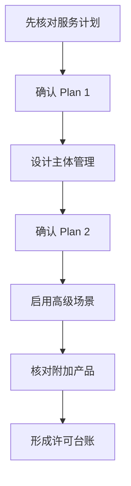

# 第7篇 Microsoft 365 E3 终端安装与管理 · 第2节 Intune Plan 1 与 Plan 2 技术边界

> **本节小节：** 7.9 ～ 7.18。
> **导航：** [返回第7篇目录](README.md)｜上一节：[三种技术的关系与本篇结论](01-三种技术的关系与本篇结论.md)｜下一节：[Intune 推送安装](03-Intune推送安装.md)

---

## 7.9 本节目标

本节建立 Intune 的架构、许可和设备身份基线，避免把 Plan 1 主体能力误写成 Plan 2 专属能力。完成后应形成三项交付物：

1. 本租户实际启用的服务计划核对表；
2. 新设备和存量设备的身份与注册路线图；
3. 已包含能力、未包含能力和需要另购能力的边界表。

> **本书时间基线：** 2026-08-28。就本篇终端管理范围而言，Microsoft 365 E3 自 2026 年夏季起加入 Intune Plan 2 高级能力；当前 Intune 许可定义把 Remote Help、Advanced Analytics，以及 Tunnel for MAM、受支持 Android FOTA、特色设备管理等纳入 Plan 2 范围。2026 包装页和租户后台可能把 Plan 2、Remote Help、Advanced Analytics 分列为服务计划，因此必须逐项核对实际开通状态，不能只凭产品名称推断。

## 7.10 Intune 的架构与关键术语

Intune 由云端管理平面、Microsoft Entra 身份与组、设备端管理组件和报表组成。管理员配置策略后，服务根据分配对象、适用性和筛选条件计算目标；设备签入后处理策略并回传结果。

### 7.10.1 管理链路

1. **身份与许可：** 管理员和最终用户位于 Microsoft Entra ID，并被分配适当许可证。
2. **设备建立身份：** 设备采用 Entra Join、混合 Entra Join 或 Entra Register。
3. **设备注册管理：** 设备完成 Intune MDM 注册，或在特定场景使用应用保护管理。
4. **策略分配：** 应用、配置、合规和更新策略分配给用户组或设备组。
5. **设备签入：** 设备联网后按各自周期及通知触发处理，不保证保存策略后立即完成。
6. **状态回传：** 管理员查看成功、挂起、失败、不适用、冲突等状态，并结合设备日志排查。

### 7.10.2 四组术语不可混用

| 术语 | 表示什么 | 不表示什么 |
|---|---|---|
| Entra Join | 设备以组织 Entra ID 为主要工作身份 | 不自动证明已注册 Intune |
| 混合 Entra Join | 设备加入本地 AD，同时在 Entra 中建立混合身份 | 不自动证明策略已成功下发 |
| Entra Register | 通常是个人/自带设备登记工作账户 | 不等于组织完整拥有设备 |
| Intune 注册 | 设备建立 MDM 管理关系 | 不等于设备一定加入本地 AD |
| 应用保护策略 | 保护受支持应用内的组织数据 | 不等于整台设备已经 MDM 注册 |

## 7.11 Intune Plan 1：企业终端管理主体能力

Intune Plan 1 是本篇应用部署和长期管理的基础层。普通 Windows 与 M365 软件推送不需要 Plan 2。

### 7.11.1 应用和脚本

Plan 1 的主体能力包括：

- 使用内置 **Microsoft 365 Apps for Windows** 应用类型配置和部署 Office；
- 部署 Win32 `.intunewin` 应用，配置安装/卸载命令、要求、检测、依赖和取代；
- 部署适用的 MSI 应用；
- 通过 Microsoft Store 应用类型分配受支持的商店应用；
- 部署 PowerShell 脚本和平台脚本，在适合一次性或轻量任务的边界内执行；
- 对应用使用 `Required`、`Available for enrolled devices` 和 `Uninstall` 等分配意图；
- 使用报表查看设备和用户安装状态。

### 7.11.2 配置、保护和运维

Plan 1 还承担：

- 配置文件、设置目录、管理模板和安全基线；
- 合规策略及与 Microsoft Entra 条件访问的联动；
- Windows 更新环、功能更新和驱动程序更新策略；
- Defender、BitLocker、Windows 防火墙等受支持的终结点安全策略；
- 同步、重启、退役、擦除、Autopilot Reset 等受支持设备动作；
- Windows Autopilot 注册和部署配置；
- 设备、应用、配置和合规库存及状态报表。

> **准确口径：** “Plan 1 是主体能力”不代表所有功能都对所有平台、版本和设备型号完全相同。实施前还要核对 Windows 版本、设备所有权、注册方式和具体策略支持条件。

## 7.12 Intune Plan 2：叠加在 Plan 1 上的高级层

Intune Plan 2 不能单独替代 Plan 1。它面向特定高级场景，不是普通应用安装、配置、合规或 Windows 更新的前提。当前许可结构中，Plan 2 叠加于 Plan 1；**Intune Suite 同样叠加于 Plan 1，并包含 Plan 2**。但本书E3基线并不因此获得Suite内所有其他附加产品。

### 7.12.1 本篇重点能力

| Plan 2 高级场景 | 用途 | 实施前检查 |
|---|---|---|
| Remote Help | 为帮助台提供基于组织身份、角色和审计的远程协助 | 服务计划、双方许可、平台、客户端、RBAC、用户同意和日志 |
| Advanced Analytics | 提供更深入的终结点体验、性能与异常分析 | 支持平台、数据前提、采集范围、隐私和报表角色 |
| Microsoft Tunnel for MAM | 让受支持、未注册设备上的受管理应用按应用访问内部资源 | 平台、应用、Tunnel 网关和网络拓扑支持 |
| Android FOTA | 对受支持的 Android 企业设备执行固件无线更新管理 | OEM、型号、地区和注册模式支持 |
| 特色/特定共享设备管理 | 管理支持列表内的沉浸式、会议、专用或特定共享设备 | 设备类别、共享模式和微软支持列表 |

Remote Help 和 Advanced Analytics 即使在租户中显示为单独服务计划，按当前 Intune 许可页仍属于 Plan 2 高级能力范围；“分列显示”不等于产品能力边界互斥。“特色设备”或“共享设备”也不是对所有硬件的泛称。上表是与本项目有关的示例而非穷举，任何高级场景都必须按当前支持矩阵验证。

### 7.12.2 不属于 Plan 2 专属的常见能力

以下做法错误：

- “要推送 Microsoft 365 Apps，必须购买 Plan 2”；
- “Win32、MSI 或 Store 应用分发属于 Plan 2”；
- “配置文件、合规、远程擦除和 Windows 更新只有 Plan 2 才能做”；
- “有 Plan 2 就自动拥有 Intune Suite 中的所有附加产品”。

正确做法是先用 Plan 1 设计常规管理，再针对 Remote Help、Advanced Analytics、Tunnel for MAM、Android FOTA、特色设备等已确认需求启用相应 Plan 2 高级能力。EPM、Cloud PKI 和 Enterprise App Management 仍属于 E5、Intune Suite 或相应附加许可范围，不能因拥有 Plan 2 自动推断可用。

## 7.13 设备身份的三种状态

### 7.13.1 Microsoft Entra Join

Entra Join 适用于组织拥有、以云身份为主的 Windows 设备。用户使用组织 Entra 账号登录 Windows，设备不必加入本地 AD 域。

**本企业建议：** 新购设备通过 Windows Autopilot 预注册，由用户开箱联网后完成 Entra Join、Intune 自动注册、应用安装和策略配置。

适合场景：

- 新电脑和重新标准化部署的电脑；
- 员工可通过互联网访问 SaaS 与企业资源；
- 遗留 Kerberos、计算机账户或启动脚本依赖已消除或已有现代替代方案。

### 7.13.2 混合 Microsoft Entra Join

混合 Entra Join 适用于设备仍加入本地 AD 域、同时需要在 Entra 中建立设备身份的过渡环境。生产基线使用 **Microsoft Entra Connect Sync** 同步混合设备对象，并配合服务连接点、域网络可达性和 Intune 自动注册。用户、组和联系人可按需求选择 Cloud Sync；Cloud Sync Device Sync 当前为预览，只有在租户已开放、微软仍支持且专项试点获批时才能评估，不能替代本方案的生产设备同步基线。

**本企业建议：** 存量域设备先保持原有域关系，完成混合加入，再通过域 GPO 启动 MDM 自动注册。不要为了“看见一个设备对象”就认定注册成功，应分别检查 Entra 设备状态和 Intune 受管状态。

### 7.13.3 Microsoft Entra Register

Entra Register 常见于个人拥有或 BYOD 设备：用户向 Windows、iOS/iPadOS、Android 或 macOS 添加工作/学校账户，从而在 Entra 中登记设备。

它通常不等于组织取得完整设备所有权。应根据隐私、平台和业务需求决定是否进一步注册 Intune，或仅对受支持应用使用应用保护策略。

| 身份状态 | 典型所有权 | Windows 登录身份 | 本企业主要用途 |
|---|---|---|---|
| Entra Join | 组织所有 | Entra 组织账号 | 新设备目标路线 |
| 混合 Entra Join | 组织所有 | 本地 AD 域账号 | 存量域设备过渡 |
| Entra Register | 个人或轻管理 | 本地/个人账号为主 | BYOD 与有限访问 |

## 7.14 注册 Intune 与加入身份目录是两个动作

### 7.14.1 如何分别验证

管理员必须在两个管理面检查：

1. **Entra 管理中心：** 设备是否存在、加入类型是什么、所有者和活动时间是否合理；
2. **Intune 管理中心：** 设备是否显示为受管理、管理机构是否正确、主用户、合规、最后签入和策略状态是否正常。

Windows 客户端还可在“访问工作或学校”以及 `dsregcmd /status` 中辅助检查身份，但最终要结合云端对象和 Intune 状态判断。

### 7.14.2 常见“已加入但未受管”原因

- 用户未分配包含 Intune Plan 1 的有效许可证；
- MDM 用户范围未包含该用户；
- 设备平台限制、设备数量限制或个人设备限制阻止注册；
- 自动注册 GPO 未命中设备，或设备无法访问所需云端终结点；
- 设备存在旧的注册记录、重复对象或时间/证书问题；
- 用户只完成 Entra Register，没有发起完整 MDM 注册。

> **排障顺序：** 先身份、再许可、再 MDM 范围与注册限制、再网络、最后看客户端日志。不要先删除设备对象；删除可能使现有管理关系和后续排障证据更混乱。

## 7.15 新设备与存量设备的注册路线

### 7.15.1 新设备：Entra Join + Autopilot

1. 从 OEM/CSP 或受控方式导入 Windows Autopilot 设备标识；
2. 创建 Autopilot 设备组和部署配置文件；
3. 配置注册状态页、命名规则、区域设置和必要应用，并先决定 Microsoft 365 Apps 是否阻塞 ESP；
4. 若 Office 不需要阻塞用户进入桌面，可保留内置 **Microsoft 365 Apps for Windows** 应用类型并在 ESP 后继续安装；
5. 若 Office 必须作为 ESP 跟踪/阻塞应用，则用 ODT/XML 封装为 **Win32 应用**，配置可靠检测、返回码、超时和回退，再把该 Win32 应用加入 ESP 所选阻塞应用；不要把内置 M365 Apps 应用类型直接当作 ESP 阻塞应用，因为它不由 Intune Management Extension 管理，并可能与 ESP 中的 Win32 应用并发安装而失败；
6. 把少量测试设备分配到试点配置；
7. 重置测试设备，从开箱体验完成 Entra Join 与 Intune 注册；
8. 验证必要应用、配置、合规、BitLocker 密钥托管和更新状态；
9. 试点稳定后按采购批次扩大范围。

### 7.15.2 存量设备：混合加入 + GPO 自动注册

前置条件包括：

- 本地 AD 对象同步和混合加入配置正常；
- 设备能联系域控制器并访问 Microsoft 云端注册终结点；
- 用户拥有有效 Intune 许可且位于 MDM 用户范围；
- 已规划重复对象、旧 MDM、共享设备和多用户设备处理方式。

实施步骤：

1. 选择 `<HYJ-IT-试点设备组>` 对应的测试 OU，不直接链接生产根域；
2. 启用“使用默认 Microsoft Entra 凭据启用自动 MDM 注册”的域策略；标准的已许可用户登录场景把 `Credential Type` 设为 **User Credential**；
3. 只有 Configuration Manager 共管或受支持的 Azure Virtual Desktop 多会话等微软明确支持场景才评估 **Device Credential**，不得作为普通域用户设备的默认值；
4. 让测试设备刷新 GPO、重启或重新登录，并保持域与互联网可达；
5. 分别验证混合加入状态、GPO 实际值和 Intune 注册状态；
6. 观察至少一个完整业务周期，再逐 OU 扩大范围。

### 7.15.3 高风险变更闭环

| 阶段 | 必做操作 | 判定标准 |
|---|---|---|
| 准备 | 导出相关 GPO、建立试点 OU/组、记录原注册状态 | 可定位每台试点设备和原配置 |
| 验证 | 核对 Entra 加入类型、Intune 管理状态、最后签入和策略结果 | 无重复受管记录，核心业务正常 |
| 回退 | 停止扩大 GPO 链接，撤销试点分配，按批准流程解除异常注册 | 原域登录与业务不受影响，证据保留 |

## 7.16 2026 年 Microsoft 365 E3 许可基线

以本书 2026-08-28 时间点为基线，Microsoft 365 E3 的终端管理设计应按下表理解，并以租户实际服务计划为最终依据。

| 能力/产品 | 本书 E3 基线 | 说明 |
|---|---|---|
| Intune Plan 1 | 包含 | 应用、配置、合规、设备、更新等主体管理 |
| Intune Plan 2 | 2026 夏季起新增 | 叠加于 Plan 1 的高级层；当前范围包括 Remote Help、Advanced Analytics、Tunnel for MAM、受支持 Android FOTA、特色设备等 |
| Remote Help | Plan 2 高级能力；租户中可能分列服务计划 | 远程协助；仍需配置角色、范围和客户端 |
| Advanced Analytics | Plan 2 高级能力；租户中可能分列服务计划 | 高级终结点分析；需满足数据和设备前提 |
| Windows Autopatch | 可用 | E3 含 Windows Enterprise E3 订阅权益；设备仍需合格基础 Windows 许可，并满足 Autopatch 注册和服务先决条件 |
| Endpoint Privilege Management | **不包含** | 需要单独许可或适用套件 |
| Cloud PKI | **不包含** | 需要单独许可或适用套件 |
| Enterprise App Management | **不包含** | 需要单独许可或适用套件 |

> **禁止推断：** 租户有 Intune Plan 2，不代表自动拥有 Endpoint Privilege Management、Cloud PKI、Enterprise App Management 或全部 Intune Suite 能力。

## 7.17 实施前核对租户服务计划

### 7.17.1 核对位置与方法

在 Microsoft 365 管理中心或 Microsoft Entra 管理中心检查：

1. 订阅产品的准确 SKU、购买渠道和有效期；
2. Microsoft 365 E3 下用户可分配的服务计划；
3. 试点用户是否实际启用 Intune Plan 1、Plan 2、Remote Help、Advanced Analytics 和 Windows Enterprise E3；
4. 服务健康状况、消息中心公告及区域可用性；
5. 附加产品是否另有订阅、试用或过期许可。

建议建立许可台账：

| 字段 | 示例占位 | 负责人 |
|---|---|---|
| 订阅 SKU | `<M365-E3-SKU>` | `<许可管理员>` |
| 服务计划 | `<INTUNE-P1>` | `<终端管理员>` |
| 启用用户组 | `<LIC-M365E3-Users>` | `<身份管理员>` |
| 核对日期 | `<YYYY-MM-DD>` | `<复核人>` |
| 证据位置 | `<变更单或截图路径>` | `<审计负责人>` |

### 7.17.2 发现能力缺失时

- 不要先按文档承诺上线日期；先确认是服务计划未启用、许可分配错误、区域尚未开放，还是产品确实未购买。
- 普通应用、配置和合规优先按 Plan 1 继续实施，不因 Plan 2 尚未开通而阻塞主体项目。
- 需要 EPM、Cloud PKI 或 Enterprise App Management 时，单独提交需求、风险、成本、试点与采购审批。

## 7.18 架构决策与本节验收

### 7.18.1 必须批准的架构决策

1. 新设备默认 `Entra Join + Autopilot + Intune`；
2. 存量域设备默认 `混合 Entra Join + 域 GPO 自动注册 Intune`；
3. BYOD 默认不获得与组织设备相同的管理权限，按 Entra Register、应用保护和合规要求单独设计；
4. Plan 1 承担普通应用、配置、合规、设备动作和更新；
5. Plan 2 作为高级叠加层，当前范围包括 Remote Help、Advanced Analytics、Tunnel for MAM、受支持 Android FOTA、特色设备管理等，具体能力分别配置和验证；
6. 租户将 Plan 2、Remote Help、Advanced Analytics 分列显示时，仍按服务计划逐项核对，不据此把后二者排除在 Plan 2 产品能力边界之外；
7. EPM、Cloud PKI 和 Enterprise App Management 在本项目中标记为“未包含，未采购不得启用”。

### 7.18.2 完成检查表

- [ ] 已导出租户订阅与服务计划证据，并记录核对日期。
- [ ] 已确认试点用户具有 Intune Plan 1。
- [ ] 已确认 Plan 2、Remote Help 和 Advanced Analytics 在本租户的实际可用状态。
- [ ] 已单独记录 EPM、Cloud PKI、Enterprise App Management 的未包含边界。
- [ ] 已分别定义 Entra Join、混合 Entra Join、Entra Register 和 Intune 注册。
- [ ] 已完成新设备 Autopilot 路线和存量设备 GPO 自动注册路线。
- [ ] 已确认普通用户自动 MDM 注册使用 User Credential，并把 Device Credential 限于微软明确支持的特殊场景。
- [ ] 已为自动注册变更准备验证与回退方案。

> **下一节：** [Intune 推送安装](03-Intune推送安装.md)，将许可和身份基线转换为可检测、可报告、可卸载的应用生命周期。
