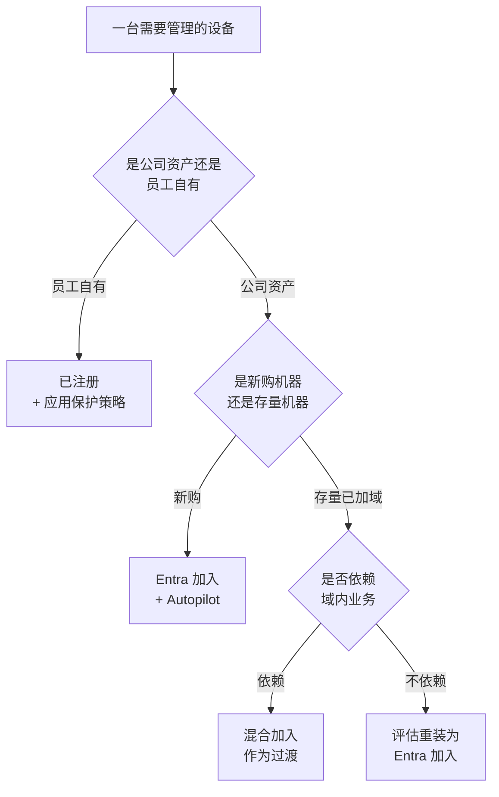

# 第7篇 终端统一管理 · 第2节 设备身份与加入方式

> **所属：** 第7篇（专题）终端统一管理：Intune 与组策略。  
> **本节小节：** 7.11 ～ 7.22。  
> **本节性质：** **地基决策。选错了后面全部要返工**，而且返工意味着重装系统。请务必在动手注册设备之前读完本节。  
> **前置条件：** 已完成[第1节](01-Intune是什么与本篇定位.md)；第2篇的身份同步已就绪。  
> **导航：** [返回第7篇目录](README.md)｜上一节：[Intune 是什么与本篇定位](01-Intune是什么与本篇定位.md)｜下一节：[设备注册的具体做法](03-设备注册的具体做法.md)

---

## 7.11 本节目标

完成本节后应当能够：

1. 分清 **Entra 加入、混合加入、已注册**三种设备状态，以及各自的适用场景。
2. 针对本企业（有本地 AD、逐步走纯云）做出**书面的设备身份决策**，并落到具体人群和机器。
3. 知道混合加入的**前提条件与长期代价**，不把它当成“无成本的过渡”。
4. 知道存量已加域电脑的两条处置路线，并选定其中一条。

---

## 7.12 三种设备状态

Windows 设备与云端的关系只有三种，**不存在第四种**。先把名字和含义对上：

| 状态 | 官方名称 | 通俗理解 |
|---|---|---|
| **Entra 加入** | Microsoft Entra joined | 这台电脑**只属于云**，用工作账号登录 Windows，不加入本地域 |
| **混合加入** | Microsoft Entra hybrid joined | 这台电脑**同时属于本地域和云**，仍用域账号登录，云端也认识它 |
| **已注册** | Microsoft Entra registered | 这台电脑**属于个人**，只是在里面添加了一个工作账号 |

### 7.12.1 一句话判断标准

| 问题 | 答案指向 |
|---|---|
| 员工用**域账号**登录 Windows，且电脑在域里？ | 混合加入 |
| 员工用**工作邮箱账号**登录 Windows，电脑不在域里？ | Entra 加入 |
| 电脑是员工**自己买的**，只是登了公司账号收邮件？ | 已注册 |

> **说明：** 第5篇 5.39 从安全合规视角讲过“加入”与“注册”的区别，本节从实施视角补充**具体怎么选、怎么落地**。两处结论一致，不冲突。

---

## 7.13 三者详细对照

| 维度 | Entra 加入 | 混合加入 | 已注册 |
|---|---|---|---|
| 设备归属 | 公司 | 公司 | **个人** |
| 登录 Windows 用什么账号 | 工作账号 | 域账号 | 个人账号（另加工作账号） |
| 是否需要本地 AD | ❌ 不需要 | ✅ **必需** | ❌ 不需要 |
| 是否需要能连到域控 | ❌ 不需要 | ✅ **需要周期性可达** | ❌ 不需要 |
| 组策略是否生效 | ❌ **不生效** | ✅ 生效 | ❌ 不生效 |
| Intune 能否完整管理 | ✅ 能 | ✅ 能 | ⚠️ 有限（建议只做应用保护） |
| 能否要求“合规设备”条件访问 | ✅ 能 | ✅ 能 | ⚠️ 不建议依赖 |
| 访问本地文件服务器/打印机 | ⚠️ **需额外配置且体验不如域内**，必须实测 | ✅ 无缝 | ⚠️ 同 Entra 加入 |
| 远程擦除范围 | 整机 | 整机 | **仅公司数据** |
| 适合谁 | **新购公司电脑** | **存量已加域电脑（过渡）** | 员工自有设备 |
| 本方案定位 | **目标状态** | **过渡状态** | BYOD（第5篇 5.40） |

> **高风险：** 表中“访问本地文件服务器/打印机”这一行是本企业最需要提前实测的项目。**Entra 加入的设备不在域里**，访问本地共享和域打印机的体验与域内设备不同（可能需要额外配置，或出现反复要求输入凭据）。如果公司还有大量依赖域内文件服务器和打印服务的业务，**必须在试点阶段用真实业务场景实测**，不要等全员推广后才发现。处置方式见 7.18.2。

---

## 7.14 本方案的决策

本企业**有本地 AD 域，目标逐步走纯云**。据此的决策是：

| 人群 / 设备 | 身份状态 | 理由 |
|---|---|---|
| **存量已加域电脑** | **混合加入** | 不需要重装，改动最小；域内业务不中断 |
| **新购公司电脑** | **Entra 加入** | 微软推荐的目标状态（见 7.16）；不再增加域内资产 |
| 车间／门店共享电脑 | 视是否依赖域内资源决定；优先 Entra 加入 | 见第5篇 5.43 |
| **完全无外网的机器** | **不注册**，继续留在域内 | 本身不能用订阅版 Office（第4篇 4.10.4） |
| 员工自有电脑与手机 | **已注册 + 应用保护策略** | 隐私边界清晰（第5篇 5.40、5.42） |
| Mac | Intune 注册 | 见第 3 节 7.33 |

> **必做：** 这张表要落到**具体机器台数和部门**，并写进设备清单（第5篇 5.47）。“存量电脑走混合、新机走纯云”只有落到台账上才可执行，否则半年后你会分不清哪台是哪种状态。

### 7.14.1 决策流程图

---

## 7.15 混合加入的前提与代价

混合加入常被当成“顺手就能开的过渡方案”，实际有明确前提和长期代价。

### 7.15.1 前提条件

- [ ] 本地 AD 与 Entra ID 已建立同步（第2篇第6节）。
- [ ] 已配置**服务连接点（SCP）**，让域内设备知道该向哪个租户注册。
- [ ] 设备的计算机对象所在 **OU 已在同步范围内**。
- [ ] 设备能**周期性连到本地域控**（VPN 或在公司网络内）。
- [ ] 用户已分配 Intune 许可（本方案即 E3）。

### 7.15.2 长期代价

| 代价 | 说明 |
|---|---|
| **必须保留域控** | 混合加入设备需要**周期性能连到本地域控**，否则会出现设备状态异常；这意味着域控不能退役 |
| 远程办公体验受限 | 长期不回公司网络、也不连 VPN 的电脑，域相关功能会逐渐出问题 |
| 依赖同步链路 | 同步中断会影响设备状态，多一个故障点 |
| 两套配置并存 | GPO 与 Intune 都会对它生效，冲突风险最高（第 9 节 7.99） |
| 注册链路更长 | 故障点比纯云多：域 → 同步 → 云 → Intune |

> **高风险：** **混合加入不是“纯云的简化版”，而是“两套体系的叠加”。** 它的故障排查难度明显高于纯云。因此本方案只把它用在**存量设备的过渡**，不用于新设备。

---

## 7.16 为什么新设备不用混合加入

这一点值得单独说明，因为它与很多人的直觉相反。

**微软官方明确建议：新设备应部署为云原生的 Entra 加入设备；不推荐把新设备部署为混合加入设备，包括通过 Autopilot 混合加入。** 官方同时说明：混合加入设备需要周期性与本地域控保持网络可达，否则设备会不可用。

| 常见理由 | 为什么不成立 |
|---|---|
| “我们有域，新机器当然也加域” | 加域会让新机器**继承所有域内包袱**，把纯云目标推得更远 |
| “混合加入以后再迁纯云不就行了” | 从混合加入迁到 Entra 加入**需要重装系统**，等于把成本推到将来且更贵 |
| “不加域就没法用组策略” | 配置改由 Intune 下发（第 5 节）；确实必须靠域的场景见 7.106 |
| “不加域就访问不了文件服务器” | 需要实测与配置，但这是**必须面对的一次性问题**，越晚做越贵（7.18.2） |

官方说明见 [混合加入设备是什么](https://learn.microsoft.com/en-us/entra/identity/devices/concept-hybrid-join) 与 [Autopilot 混合加入部署说明](https://learn.microsoft.com/en-us/autopilot/tutorial/pre-provisioning/hybrid-azure-ad-join-workflow)。

> **必做：** 请把这条决策**写进采购与装机规范**：从项目上线之日起，**新到货的电脑不再加入本地域**。否则装机人员会按老习惯继续加域，一年后你会发现域内又多了几十台新机器。

---

## 7.17 存量已加域电脑怎么办

两条路，**必须选一条并写进方案**：

| 路线 | 做法 | 优点 | 缺点 | 适合 |
|---|---|---|---|---|
| **路线 A：混合加入（本方案默认）** | 配置 SCP，设备自动注册；再用 GPO 推 MDM 自动注册进 Intune（第 3 节 7.25） | **不重装、不影响用户**、见效快 | 保留域依赖；两套配置并存 | **绝大多数存量机器** |
| 路线 B：重装为 Entra 加入 | 备份数据 → 重装 → Autopilot → Entra 加入 | 一步到位、彻底纯云 | **要重装，用户中断**；数据迁移有风险 | 到了更换周期的机器、不依赖域内业务的部门 |

### 7.17.1 如果选路线 B，重装前必须完成

> **高风险：** 重装意味着**本地数据全部丢失**。以下几项必须在重装前逐项确认，与第4篇 4.24.1 的卸载前备份清单是同一类风险：
>
> | 项目 | 状态 |
> |---|---|
> | 桌面、文档、图片已通过 OneDrive 备份并**确认同步完成**（第4篇第12节） | ☐ |
> | Outlook 的 PST 本地存档文件已找到并备份 | ☐ |
> | 邮件签名、模板、自定义词典已备份 | ☐ |
> | 本地宏文件（个人宏工作簿）已备份 | ☐ |
> | 浏览器书签与保存的密码已处理 | ☐ |
> | 本地安装的业务系统客户端与授权已确认可重装 | ☐ |
> | 映射的网络驱动器与打印机清单已记录 | ☐ |
> | 已与用户约定时间，并准备好备用机 | ☐ |

> **推荐：** 不要为了“早点纯云”而批量重装在用机器。更划算的做法是**跟着硬件更换周期走**——机器到了该换的时候，新机器自然就是 Entra 加入。这样迁移成本几乎为零，代价只是周期长一些（通常 3～4 年完成）。

---

## 7.18 新购电脑走哪条路

**结论：Entra 加入 + Autopilot**，具体步骤见第 3 节 7.27。

### 7.18.1 装机规范要改哪几条

| 原有做法 | 改为 |
|---|---|
| 装机时加入本地域 | **不加域** |
| 用本地管理员账号初始设置 | 用**用户自己的工作账号**完成开箱设置（Autopilot） |
| 手工装 Office 与常用软件 | 由 Intune 下发（第 6 节） |
| 手工配置打印机与网络驱动器 | 见 7.18.2 |
| IT 装好后交给用户 | 可直接寄给用户，由用户开箱自助完成 |

### 7.18.2 本地资源访问：必须提前实测的三件事

Entra 加入设备不在域内，以下三项要在**试点阶段**用真实场景实测，并把结论写进方案：

| 项目 | 要实测什么 | 常见处置方式 |
|---|---|---|
| **本地文件服务器共享** | 能否访问、是否反复要求输入凭据 | 长期看应把文件迁到 SharePoint/OneDrive（第4篇第13节）；过渡期评估凭据管理或访问方式调整 |
| **域内打印机** | 能否发现与打印 | 改用打印服务器的直连方式、IP 打印，或云打印方案 |
| **依赖域身份的老业务系统** | 能否登录（尤其集成 Windows 身份验证的系统） | 登记到第4篇 4.15 的依赖清单；必要时该机器暂留域内 |

> **必做：** 这三项是“纯云路线”能否推进的**真正瓶颈**，不是技术不可行，而是需要逐项处置。**试点必须包含一个真实依赖本地资源的用户**（例如财务或车间管理员），不能只拿 IT 自己的电脑试。

---

## 7.19 个人设备（BYOD）

本方案对员工自有设备的处置与第5篇一致，此处只补充身份层面的要点：

| 要点 | 说明 |
|---|---|
| 身份状态 | **已注册**，不做 Entra 加入 |
| 管理方式 | **应用保护策略**为主，不做完整设备管理（第5篇 5.40） |
| 为什么不做完整管理 | 完整管理意味着公司能擦除整机、能看到设备清单，**员工通常不接受**，且带来隐私争议 |
| 擦除范围 | 只擦除公司应用内的数据，个人照片和文件不受影响 |
| 必须向员工说明 | 公司能看到什么、不能看到什么——这一条要写进员工手册（第6篇 6.94） |

> **高风险：** 不要在员工自有电脑上启用完整设备管理。一旦发生“公司远程擦除了员工个人照片”这类事件，后续所有终端管理工作都会遭到抵制，且可能涉及法律责任。**边界必须事先书面说明并留存告知记录。**

---

## 7.20 设备身份与条件访问的关系

设备身份的价值，最终要通过条件访问兑现：

| 条件访问要求 | 需要什么设备状态 | E3 是否可用 |
|---|---|---|
| 要求**已加入**设备（混合加入或 Entra 加入） | 两者皆可 | ✅ 可用 |
| 要求**合规**设备 | 需已注册进 Intune 并通过合规策略 | ✅ 可用（第 4 节） |
| 要求应用保护策略（BYOD 场景） | 已注册 + 应用保护 | ✅ 可用 |
| 按**设备风险等级**判断 | 需 EDR 风险评分 | ❌ **E3 不含**（7.5.1） |

> **必做：** 顺序绝对不能反：**先把设备注册进来并确认合规状态正常，再启用“要求合规设备”的条件访问策略。** 反过来做会导致大面积无法登录。防护步骤见第 4 节 7.44，紧急账号排除见第2篇 2.96。

---

## 7.21 迁移路线图与人群划分表

本节的最终交付物是这张表，**必须填完才能进入第 3 节**：

| 分组 | 设备类型 | 台数 | 身份状态 | 何时执行 | 负责人 |
|---|---|---:|---|---|---|
| G1 | IT 自用电脑（试点） | 待填写 | 混合加入 | 第 1 周 | 待填写 |
| G2 | 新购电脑 | 待填写 | **Entra 加入** | 到货即执行 | 待填写 |
| G3 | 存量办公电脑 | 待填写 | 混合加入 | 分批 | 待填写 |
| G4 | 依赖本地资源的电脑（财务、车间） | 待填写 | 混合加入，**暂不重装** | 分批 | 待填写 |
| G5 | 共享／一线电脑 | 待填写 | 待定（见第5篇 5.43） | 待填写 | 待填写 |
| G6 | 完全无外网机器 | 待填写 | **不注册** | — | 待填写 |
| G7 | 员工自有电脑与手机 | 待填写 | 已注册 + 应用保护 | 自愿登记 | 待填写 |
| G8 | Mac | 待填写 | Intune 注册 | 分批 | 待填写 |

> **验证点：** 表中台数之和应等于第5篇 5.47 设备清单的总台数（减去不纳入管理的设备）。两个数字对不上，说明有设备没被盘到。

---

## 7.22 本节完成检查表

- [ ] 已分清 Entra 加入、混合加入、已注册三种状态，并能对每台设备作出判断。
- [ ] 已完成 7.21 的人群划分表，台数与第5篇 5.47 设备清单可对上。
- [ ] 已确认**新购电脑不再加入本地域**，并把这条写进**采购与装机规范**。
- [ ] 混合加入的前提已逐项确认（同步、SCP、OU 在同步范围、域控可达、许可）。
- [ ] 已向管理层说明混合加入的长期代价：**域控不能退役**。
- [ ] 存量电脑的处置路线已选定（A 混合加入 / B 重装），并写明理由。
- [ ] 若选路线 B：重装前备份清单（7.17.1）已逐项落实，并准备了备用机。
- [ ] **本地文件服务器、域打印机、依赖域身份的业务系统**三项已列入试点实测项目。
- [ ] 试点用户中**包含至少一名真实依赖本地资源的业务用户**，不只有 IT 自己。
- [ ] 已确认 BYOD 只做应用保护，**不在员工自有电脑上启用完整设备管理**，边界已书面告知。
- [ ] 已确认条件访问的“要求合规设备”**必须在设备注册完成之后**才启用。

> **进入下一节的条件：** 7.21 的人群划分表已填完并获确认。下一节讲**具体怎么把设备注册进 Intune**——包括用组策略推自动注册（存量设备主力路径）和 Autopilot（新设备路径）。

