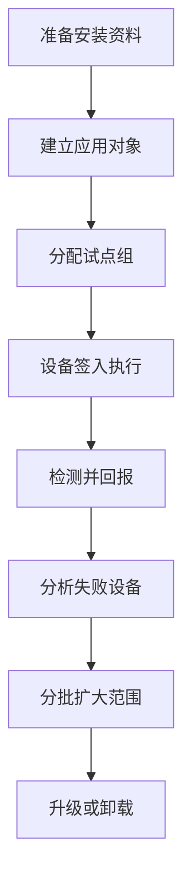

# 第7篇 Microsoft 365 E3 终端安装与管理 · 第3节 Intune 推送安装

> **本节小节：** 7.19 ～ 7.31。
> **导航：** [返回第7篇目录](README.md)｜上一节：[Intune Plan 1 与 Plan 2 技术边界](02-Intune-Plan1与Plan2技术边界.md)｜下一节：[Intune 长期管理](04-Intune长期管理.md)

---

## 7.19 本节目标

本节把“上传一个安装包”扩展为完整应用生命周期：准备、试点、分配、检测、报告、失败重试、升级、卸载和回退。所有普通应用部署能力均按 **Intune Plan 1** 设计，不把 M365 Apps、Win32、MSI、Microsoft Store 或脚本部署误写成 Plan 2。

完成本节后，每个生产应用都必须有一条应用台账记录，并能回答：

- 安装给谁、在什么条件下安装；
- 以用户还是系统权限执行；
- Intune 如何判断成功；
- 返回码和重启如何处理；
- 失败设备在哪里查看、何时重试；
- 新版本如何取代旧版本；
- 如何卸载或恢复到上一个已批准版本。

> **关键认识：** 云端策略分配不是实时远控推送。管理员保存分配后，服务计算目标，设备在联网、收到通知或按计划签入时处理。设备关机、长期离线、代理阻断、处于维护窗口或 Intune Management Extension 异常时，完成时间都会延后。



## 7.20 应用生命周期与上线准备

### 7.20.1 建立应用台账

部署前由应用负责人提交并由终端团队审核以下内容：

| 字段 | 示例占位 | 必须说明 |
|---|---|---|
| 应用名称 | `<财务客户端>` | 使用业务可识别名称 |
| 发布者与版本 | `<Vendor>` / `<1.2.3>` | 版本必须可检测 |
| 来源 | `<厂商下载页>` | 禁止未知网盘与个人分享 |
| 文件哈希 | `<SHA256>` | 验证包未被替换 |
| 安装方式 | `<Win32>` | M365 Apps、Win32、MSI、Store 或脚本 |
| 安装命令 | `<静默安装参数>` | 不得弹窗等待用户输入 |
| 卸载命令 | `<静默卸载参数>` | 生产前实测 |
| 安装上下文 | `<System>` | System 或 User |
| 检测规则 | `<文件版本+产品码>` | 应检测最终业务状态 |
| 依赖/取代 | `<运行库>/<旧版本>` | 明确顺序和升级关系 |
| 重启行为 | `<允许软重启>` | 明确业务窗口 |
| 回退包 | `<上一批准版>` | 保留包、命令和验证方法 |
| 负责人 | `<APP-OWNER-01>` | 业务与技术负责人 |

### 7.20.2 准备实验室测试

在上传 Intune 前，先在与生产一致的干净虚拟机或测试机上验证：

1. 静默安装在无管理员交互情况下完成；
2. 安装命令重复执行不会破坏现有状态；
3. 检测规则能区分“未安装、正确版本、旧版本、安装损坏”；
4. 卸载命令可执行，且不会误删用户数据；
5. 返回码、日志目录、磁盘占用和重启行为已记录；
6. 与 Defender、BitLocker、VPN、代理及现有软件无冲突；
7. 安装包与卸载包均来自受控存储，并保留哈希。

> **放行条件：** 没有静默安装、可靠检测或可接受回退方法的应用，不得直接设为全员 `Required`。

## 7.21 分配意图、用户组与设备组

### 7.21.1 三种主要分配意图

| 分配意图 | 用户体验 | 适合场景 | 注意事项 |
|---|---|---|---|
| Required | 满足条件后自动安装 | 安全代理、标准办公应用、必要插件 | 先试点，失败可能持续重试 |
| Available for enrolled devices | 用户在公司门户主动安装 | 可选工具、部门应用 | 通常面向用户组；按应用类型核对支持范围 |
| Uninstall | 对目标卸载应用 | 下线、撤回或迁移旧版本 | 先验证数据保留与卸载检测 |

同一应用若对重叠对象同时存在 Required、Available 或 Uninstall，结果会受分配优先行为、包含/排除和应用类型影响。不要依靠复杂重叠制造业务逻辑，应改为互斥组并书面记录。

### 7.21.2 选择用户组还是设备组

**用户组适合：**

- 应用随人员角色变化，例如财务、设计、销售；
- 用户可能更换设备，但仍应获得应用；
- 公司门户中的可选应用；
- 用户上下文安装或用户级许可。

**设备组适合：**

- 共享设备、自助终端、会议室或实验室；
- Autopilot 期间必须在用户进入桌面前完成的设备级应用；
- 与硬件型号、地点或设备用途绑定的应用；
- 以 System 上下文安装的基础组件。

### 7.21.3 组设计规则

- 使用稳定、可审计的组，例如 `<APP-Finance-Required-Users>`、`<APP-VPN-Pilot-Devices>`。
- 试点组与生产组分开，IT 管理员不要成为所有生产应用的隐式测试对象。
- 动态组规则需预留成员计算时间；紧急变更不能假设动态成员立即更新。
- 谨慎使用“所有用户”和“所有设备”；全局分配必须有变更审批和明确排除。
- 分配筛选器适合在既有组内按设备属性快速细分，但不能替代清晰的业务组治理。

## 7.22 要求规则、适用性与安装上下文

### 7.22.1 要求规则

Win32 应用可按以下条件判断设备是否有资格安装：

- 操作系统体系结构，例如 x64 或 ARM64；
- 最低/最高 Windows 版本；
- 最低可用磁盘空间、内存、处理器数量或速度；
- 自定义要求脚本，用退出码和标准输出表达适用结果。

要求规则回答“**这台设备是否应该尝试安装**”，检测规则回答“**安装结果是否已经存在**”，两者不能互相替代。

自定义要求脚本必须快速、只读、输出稳定，不应在判断条件时顺便修改设备。脚本执行超时或输出格式错误会导致应用不适用或评估失败。

### 7.22.2 安装上下文

| 上下文 | 权限与位置 | 适合场景 | 风险 |
|---|---|---|---|
| System | 本地系统权限，不依赖用户登录 | 设备级软件、驱动外组件、全机应用 | 不能假设有用户配置文件或映射盘 |
| User | 当前登录用户权限与配置文件 | 用户级插件、每用户应用 | 用户需登录，权限可能不足 |

System 上下文不要引用 `H:` 映射盘、用户桌面或仅当前用户可访问的代理凭据；User 上下文不要假设拥有本地管理员权限。安装包需要提权时，应选择经过安全评审的 System 部署，不得把管理员密码写入脚本。

### 7.22.3 适用性和分配筛选

先用 Entra 组表达业务对象，再在必要时用 Intune 分配筛选器限定设备属性，例如仅对 `<Corporate>` 所有权或特定操作系统版本生效。筛选器变化也属于生产变更，必须在试点分配中验证命中结果。

## 7.23 检测规则：决定成功、重试和卸载状态

Intune 不只看安装进程是否返回 0。对 Win32 应用，检测规则决定设备是否被视为已安装；规则错误会造成“实际已装却反复安装”或“实际未装却显示成功”。

### 7.23.1 常见检测方式

| 方式 | 适合场景 | 示例占位 | 注意事项 |
|---|---|---|---|
| MSI 产品代码 | 稳定 MSI 产品 | `<PRODUCT-CODE-GUID>` | 版本升级可能更换产品码 |
| 文件/文件夹 | 有稳定安装路径 | `<ProgramFiles>\Vendor\App.exe` | 应同时核对文件版本 |
| 注册表 | 有稳定产品键值 | `<HKLM\Software\Vendor>` | 注意 32/64 位视图 |
| 自定义脚本 | 需组合多个条件 | `<Detect-App.ps1>` | 退出码与输出必须符合规则 |

### 7.23.2 设计原则

- 检测最终可用状态，不检测临时安装文件或下载缓存。
- 版本要求明确：若目标是“至少 1.2.3”，不要只判断文件存在。
- 不把易变化的用户数据、最近使用时间或网络服务瞬时状态作为唯一检测依据。
- 自定义检测脚本必须幂等、快速、无敏感输出；本地测试 System 与 User 上下文差异。
- 升级和卸载后再次测试检测规则，确认旧版本不会误判为新版本。

### 7.23.3 检测故障示例

若 `<App.exe>` 已安装但路径因 32/64 位变化而不同，Intune 可能每次都判断未安装。处理顺序是：确认实际路径与上下文、查看 Intune Management Extension 日志、在相同账户上下文执行检测、修正规则后先分配试点，不要直接让安装命令反复覆盖。

## 7.24 依赖关系与取代关系

### 7.24.1 依赖关系

依赖表示主应用安装前需要另一个 Win32 应用，例如 `<财务客户端>` 依赖 `<VC++运行库>`。每个依赖都应有独立应用对象、可靠检测和明确版本。

- 依赖链保持短而清晰，避免多层循环或难以解释的共享依赖。
- 先验证依赖单独可装，再验证主应用自动安装依赖。
- 不要把“所有电脑都应有的基础软件”全部藏在某个业务应用的深层依赖里。
- 卸载主应用不一定自动卸载依赖；共享运行库通常应保留并单独治理。

### 7.24.2 取代关系

取代用于表达新 Win32 应用替换旧应用，可选择升级旧版本或先卸载旧应用。适合版本升级、安装技术变化或产品更名。

建立取代前验证：

1. 新旧检测规则不会同时误判；
2. 是否需要卸载旧版及其退出码；
3. 用户数据、配置、插件和许可证是否保留；
4. 安装顺序及重启是否会打断业务；
5. 回退时旧版是否仍可安全重装。

> **高风险：** “取代并卸载旧版”可能影响所有命中设备。必须先用 `<APP-Upgrade-Pilot>` 小组，至少完成准备、验证、回退三个阶段。

## 7.25 安装命令、返回码、重启与交付优化

### 7.25.1 安装和卸载命令

命令必须：

- 使用厂商支持的静默参数；
- 使用相对内容路径或本机可访问路径，不依赖管理员个人共享；
- 对含空格路径正确加引号；
- 在指定 System/User 上下文实测；
- 写入可审计日志，但不记录口令、令牌或个人数据；
- 允许重复执行，已安装时安全退出。

示例仅用占位符：

```text
<setup.exe> /quiet /norestart /log "<本地日志路径>"
<uninstall.exe> /quiet /norestart
```

### 7.25.2 返回码和重启

Win32 应用应把厂商返回码映射为成功、失败、软重启、硬重启或重试。常见 Windows 安装码必须结合厂商文档验证，不能把所有非零码都改为成功。

| 处理结果 | 含义 | 管理动作 |
|---|---|---|
| Success | 安装进程成功完成 | 再由检测规则确认 |
| Soft reboot | 需要重启才能完全生效 | 通知用户并按维护窗口处理 |
| Hard reboot | 必须立即或强制重启 | 高风险，生产前审批 |
| Retry | 临时条件不满足 | 记录原因，允许后续重试 |
| Failed | 明确失败 | 查看日志并修复根因 |

禁止安装包自行无提示强制重启生产电脑。对可能重启的部署，应在变更通知中写明时间、保存工作提示、延后规则和支持渠道。

### 7.25.3 交付优化与网络

大规模应用分发前，应评估 Windows 交付优化、代理、VPN 拆分隧道、分支带宽和 Microsoft 内容终结点：

- 先在一个地点测量包大小、下载时长和高峰带宽；
- 通过适当的交付优化策略减少同一站点重复公网下载；
- 不把 Microsoft 内容强制回传到容量不足的总部 VPN；
- 对大型包分批分配，避开月末、会议和业务高峰；
- 检查代理是否支持设备 System 上下文访问，而非只支持登录用户浏览器。

## 7.26 Microsoft 365 Apps：内置应用类型与 ODT/XML

### 7.26.1 不阻塞 ESP 时优先使用内置应用类型

对标准化 Microsoft 365 Apps 部署，且**不要求 Office 安装完成后才允许用户离开 Autopilot Enrollment Status Page（ESP）**时，优先使用 Intune 中内置的 **Microsoft 365 Apps for Windows** 应用类型。管理员可配置：

- 套件和单独应用选择；
- 32 位或 64 位体系结构；
- 更新通道；
- 版本和语言；
- 共享计算机激活等适用属性；
- Required 分配和安装状态。

它适合配置相对标准、希望降低封装维护量的环境。本企业应先统一更新通道、体系结构和 Visio/Project 许可规划，避免不同部门自行创建多个互相冲突的 Office 部署对象。

### 7.26.2 何时使用 ODT/XML

Office Deployment Tool（ODT）与 XML 更适合：

- 需要内置配置界面未覆盖的精细 Office 安装选项；
- 需要从旧 MSI Office 迁移并显式移除冲突产品；
- 需要严格控制语言、排除应用、源路径或其他 ODT 属性；
- 需要将复杂 Office 安装作为 Win32 应用，使用自定义检测、依赖和取代流程；
- **要求 Microsoft 365 Apps 作为 Autopilot ESP 跟踪/阻塞应用**，必须由 Intune Management Extension 按 Win32 生命周期处理。

### 7.26.3 Autopilot ESP 的两种明确选择

| Office 是否阻塞 ESP | 正确做法 | 原因 |
|---|---|---|
| 否 | 使用内置 Microsoft 365 Apps 类型，让设备完成 ESP、进入桌面后继续安装 | 配置简单，降低封装维护；Office完成时间不作为放行门槛 |
| 是 | 用 ODT/XML 封装为 Win32，配置检测、返回码、超时与回退，并在 ESP 中选择该 Win32 应用 | 内置 M365 Apps 类型不由 Intune Management Extension 管理；与 ESP 中 Win32 应用并发时可能引发安装失败 |

不要把“Required 分配”等同于“ESP 阻塞”。必须在部署设计中写清 Office 是否为 ESP 所选跟踪应用，并在 OOBE 试点中验证网络、安装时长、超时、重启和恢复路径。

取舍原则：

| 维度 | 内置 M365 Apps 类型 | ODT/XML 封装为 Win32 |
|---|---|---|
| 管理复杂度 | 较低 | 较高，需维护 XML 与封装 |
| 灵活性 | 满足标准场景 | 支持更多 ODT 细节 |
| 检测与依赖 | 使用应用类型能力 | 可用 Win32 检测、依赖、取代 |
| Autopilot ESP | 不作为所选阻塞应用；进入桌面后继续安装 | 可由 IME 处理并设为 ESP 所选阻塞应用 |
| 适用建议 | 标准、非阻塞 ESP 的新部署 | 复杂迁移、特殊参数或 Office 必须阻塞 ESP |

> **禁止并行：** 不要对同一设备同时分配两套负责安装 Microsoft 365 Apps 的对象，例如一套内置应用和一套 ODT Win32。先确定唯一安装所有者，再设计升级与回退。

## 7.27 Win32 应用与 `.intunewin` 封装

Win32 应用类型适合 EXE、复杂 MSI、包含多个文件的安装器，以及需要检测、依赖、取代和返回码管理的桌面应用。设备端通常由 Intune Management Extension 处理。

### 7.27.1 简化封装流程

1. 建立干净源目录，例如 `<C:\PkgSource\AppName>`，只放本应用所需文件；
2. 从可信来源取得 Microsoft Win32 Content Prep Tool；
3. 指定源目录、主安装文件和输出目录生成 `.intunewin`；
4. 在 Intune 新建 Windows Win32 应用并上传；
5. 填写应用信息、命令、要求、检测、依赖、取代和分配；
6. 先发布到 `<APP-Win32-Pilot-Devices>`，验证后再扩大。

示意命令只展示最低必要参数：

```text
IntuneWinAppUtil.exe -c <源目录> -s <安装文件> -o <输出目录>
```

不要把密码、许可证密钥、通用管理员账户或不相关工具封装进包。`.intunewin` 是内容容器，不会自动让不支持静默安装的程序变得可靠。

### 7.27.2 日志与排障

排障至少查看：

- Intune 管理中心的设备安装状态与错误码；
- 设备上的 Intune Management Extension 相关日志；
- 安装器自身日志和 Windows 事件日志；
- 检测脚本在实际执行上下文中的输出；
- 下载缓存、磁盘空间、代理和 Defender 拦截情况。

## 7.28 MSI 与 Microsoft Store 应用的边界

### 7.28.1 MSI

简单、标准、无需复杂依赖的 MSI 可使用 Windows 业务线应用类型。若需要复杂命令、依赖、取代、自定义检测、预处理/后处理，通常应封装为 Win32 应用。

注意事项：

- 记录 MSI 产品代码、版本、安装范围和卸载行为；
- MST、补丁、额外文件或复杂先决条件通常更适合 Win32 封装；
- Autopilot 阶段不要无规划地混合业务线 MSI 与 Win32 安装，Windows Installer 并发可能造成冲突；
- MSI 成功返回不代表业务插件已加载，仍需验证最终状态。

### 7.28.2 Microsoft Store 应用

使用 Intune 当前的 Microsoft Store 应用类型搜索并分配受支持应用，适用于商店 UWP 或 Win32 应用。不要继续设计已淘汰的旧 Microsoft Store for Business 离线采购流程。

- 应用的安装、更新和卸载支持取决于商店包类型及发布者实现；
- 核对 System/User 上下文、Required/Available/Uninstall 支持情况；
- 商店自动更新行为与企业版本锁定要求冲突时，应选择厂商企业安装包；
- 应用从商店撤下或发布者更改标识时，要准备替代部署方式。

## 7.29 PowerShell 脚本的正确边界

脚本适合轻量、一次性或难以用设置目录表达的动作，例如创建受控注册表值、收集有限诊断信息或完成应用安装前的小型准备。脚本不是完整应用管理的替代品。

### 7.29.1 可用脚本的条件

- 执行结果幂等，多次运行不会重复破坏；
- 有清晰退出码、日志和超时处理；
- 明确 32/64 位 PowerShell 与 System/User 上下文；
- 不嵌入密码、密钥、访问令牌或个人信息；
- 不从未知网址动态下载并执行内容；
- 有对应撤销脚本或手工回退步骤。

### 7.29.2 不应使用脚本的场景

- 有稳定 Win32、MSI、Store 或配置策略类型可用；
- 需要持续检测、版本升级、依赖和标准卸载；
- 需要每几分钟执行一次或充当实时代理；
- 需要绕过安全控制、修改审计日志或长期保存凭据；
- 脚本失败会使设备无法启动、断网或丢失数据。

PowerShell 脚本的执行和重试行为受分配、脚本变更、客户端签入与平台实现影响。若必须持续检查并修复状态，应评估合适的配置策略或受支持修复能力，而不是假设普通脚本每次签入都会重跑。

## 7.30 状态报表、失败重试与异步交付

### 7.30.1 读取状态

应用报表常见状态包括已安装、失败、等待安装、不适用、未安装和未知。管理员应从三个层次查看：

1. 应用总览：成功率和主要错误；
2. 设备安装状态：失败设备、最后签入和错误码；
3. 受管应用/设备详情：与其他应用、策略和设备健康信息交叉验证。

“未知”不等于失败，可能是设备尚未签入、刚加入组、动态组尚未计算、报表延迟或设备已离线。“成功”也应抽查实际版本和业务启动，而不能只看绿色数字。

### 7.30.2 失败分类与处理

| 失败类别 | 先检查 | 典型处理 |
|---|---|---|
| 目标未命中 | 组成员、排除、筛选器、许可 | 修正分配后等待重新评估 |
| 不适用 | OS、架构、磁盘、要求脚本 | 调整要求或修复设备前提 |
| 下载失败 | 网络、代理、缓存、磁盘空间 | 恢复连接并重新同步 |
| 安装失败 | 返回码、安装器日志、权限 | 修正命令或包后发布新版本 |
| 检测失败 | 路径、版本、注册表、上下文 | 修正规则并在试点复测 |
| 等待重启 | 返回码与重启策略 | 通知用户在窗口内重启 |

### 7.30.3 重试和同步

- Intune 和 Intune Management Extension 会按各自机制重新评估或重试，但不要依赖无限重试掩盖错误包。
- 可对测试设备从管理中心发起“同步”，或在公司门户/设备设置发起同步；这只是请求设备尽快签入，不保证安装立即完成。
- 修复安装命令、检测规则或内容后，记录新版本和变更时间；不要在没有版本记录的情况下反复覆盖生产包。
- 对长期离线设备设定阈值，例如 `<30天>`，转入资产和安全例外流程，而不是一直留在“等待安装”。

### 7.30.4 上线判定

建议分批门槛：

- IT 试点 `<10台>`：核心功能全部通过；
- 业务试点 `<5%>`：成功率达到批准阈值，且无严重业务事件；
- 分批生产 `<20%/批>`：观察一个完整工作周期；
- 全量：保留排除组、支持人员和回退包。

数字均为示例占位，必须按企业规模和风险审批。

## 7.31 卸载、回退与应用验收

### 7.31.1 卸载不等于删除应用对象

- **Uninstall 分配：** 请求命中设备执行卸载命令，并根据检测规则回报状态。
- **移除 Required 分配：** 通常只是不再要求安装，不会自动卸载已安装应用。
- **删除 Intune 应用对象：** 会失去分配和集中状态，不等于客户端已经卸载。
- **退役设备：** 是设备管理动作，不是某个应用的标准卸载流程。

### 7.31.2 三类回退

1. **停止扩大：** 暂停后续批次，保留当前试点证据；
2. **卸载新版本：** 使用已验证卸载命令，确认用户数据保留；
3. **恢复旧版本：** 重新分配上一批准版本，恢复配置并验证业务。

若应用升级包含不可逆数据转换，应先由业务系统负责人确认数据库或配置备份，不能只靠客户端卸载回退。

### 7.31.3 高风险部署闭环

| 阶段 | 必做事项 | 验证证据 |
|---|---|---|
| 准备 | 备份配置/数据、保留旧包、建立试点和排除组、通知支持团队 | 台账、哈希、试点名单、变更单 |
| 验证 | 核对安装状态、版本、启动、插件、业务流程、重启和网络影响 | Intune 报表、日志、业务签字 |
| 回退 | 停止扩大、卸载新版、恢复旧版、重新检测并复盘 | 回退报表、旧版验证、事件记录 |

### 7.31.4 完成检查表

- [ ] 每个应用都有来源、哈希、安装/卸载命令、上下文和负责人。
- [ ] Required、Available、Uninstall 及用户/设备组选择有书面依据。
- [ ] 要求规则和检测规则已经在实际执行上下文中验证。
- [ ] 依赖、取代、返回码、重启和交付优化已评审。
- [ ] M365 Apps 已按“是否阻塞 ESP”在内置类型与 ODT/XML Win32 封装之间选择唯一安装所有者，并完成 OOBE 试点。
- [ ] Win32、MSI、Store 和脚本均按各自边界使用。
- [ ] 已记录失败重试、长期离线设备和报表延迟的处理方式。
- [ ] 卸载与回退已在试点设备完整演练。

> **下一节：** [Intune 长期管理](04-Intune长期管理.md)，把应用交付延伸到配置、合规、更新、安全、远程动作与持续运维。
