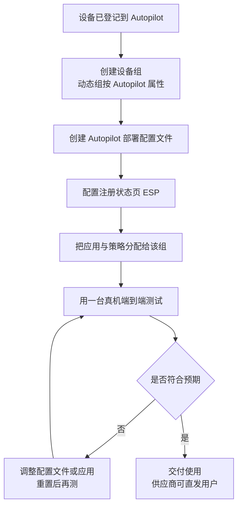

# 第7篇 终端统一管理 · 第3节 设备注册的具体做法

> **所属：** 第7篇（专题）终端统一管理：Intune 与组策略。  
> **本节小节：** 7.23 ～ 7.35。  
> **本节性质：** 实操。本节是第一次真正动手的地方，但**仍不要启用任何阻断型策略**——注册完成之前启用“要求合规设备”会锁死用户。  
> **前置条件：** 已完成[第2节](02-设备身份与加入方式.md)，7.21 的人群划分表已填完。  
> **导航：** [返回第7篇目录](README.md)｜上一节：[设备身份与加入方式](02-设备身份与加入方式.md)｜下一节：[合规策略](04-合规策略.md)

---

## 7.23 本节目标

完成本节后应当达到：

1. 存量已加域电脑能**自动**注册进 Intune，不需要逐台手工操作。
2. 新购电脑能通过 Autopilot 开箱即用，由用户自助完成设置。
3. 手机（iOS / Android）的注册方式已确定并试通。
4. 注册限制与设备清理规则已配置，避免设备清单越用越乱。

---

## 7.24 注册方式总览

| 设备 | 注册方式 | 本方案用于 | 小节 |
|---|---|---|---|
| 存量已加域 Windows | **组策略推 MDM 自动注册** | G1、G3、G4 | 7.25 |
| 新购 Windows | **Autopilot（用户驱动 + Entra 加入）** | G2 | 7.27–7.30 |
| 员工自有 Windows | 用户手动添加工作账号 | G7 | 7.19 |
| iOS / iPadOS | 公司门户（自有）／ Apple 自动设备注册（公司资产） | G7 | 7.32 |
| Android | 工作资料（自有）／完全托管（公司资产） | G7 | 7.32 |
| Mac | 公司门户或自动设备注册 | G8 | 7.33 |

> **推荐：** 先把 **7.25（存量设备自动注册）** 跑通再做 Autopilot。原因很简单：存量设备是绝大多数，且不需要重装，见效最快；Autopilot 要等新机器到货才能验证。

---

## 7.25 用组策略推 MDM 自动注册（存量设备主力路径）

这是有域环境下最省事的做法：**一条组策略，让所有已混合加入的电脑自动注册进 Intune**，不需要逐台操作，也不需要打扰用户。

### 7.25.1 前提条件

- [ ] 设备已**混合加入**（第2节 7.15 的前提已全部满足）。
- [ ] 用户已分配 **Intune 许可**（本方案即 E3）。
- [ ] 设备为 Windows 10 1709 及以上（本方案目标环境为 Windows 11）。
- [ ] 已在 Intune 中把 **Windows 自动注册（MDM 用户范围）** 打开，并限定到目标用户组。

> **必做：** Intune 侧的“MDM 用户范围”**先设为一个测试组，不要一上来就设为“全部”**。这个开关决定了哪些用户的设备可以自动注册；范围开太大，会在同一天涌入大量设备，问题集中爆发时难以定位。

### 7.25.2 组策略配置

配置路径：

```text
计算机配置 → 策略 → 管理模板 → Windows 组件 → MDM
  → 启用使用默认 Azure AD 凭据的自动 MDM 注册
     （Enable automatic MDM enrollment using default Azure AD credentials）
```

| 设置项 | 取值 | 说明 |
|---|---|---|
| 策略状态 | **已启用** | — |
| 凭据类型（Select Credential Type to Use） | **用户凭据**（User Credential） | 本方案取值；设备凭据用于无用户登录的场景 |
| 链接到哪里 | 存放**目标计算机对象**的 OU | 不要直接链在域根上 |

配置完成后，设备会创建一个计划任务，在用户登录后尝试自动注册。注册通常在**用户登录后几分钟内**发生，不是即时的。

### 7.25.3 分批推广的做法

> **必做：** 用**安全筛选**控制生效范围，分批放开，而不是一次链给所有电脑：
>
> | 批次 | 范围 | 观察什么 |
> |---|---|---|
> | 第 1 批 | IT 自己的 3～5 台 | 是否注册成功、耗时、有无报错 |
> | 第 2 批 | 一个部门（约 10～20 台） | 是否有机型或镜像相关的差异 |
> | 第 3 批起 | 按部门分批 | 注册成功率、服务台工单量 |
>
> 每批之间至少间隔几天，并在 Intune 管理中心核对**实际注册台数与计划台数**是否一致。

### 7.25.4 验证注册成功

在设备上执行：

```text
dsregcmd /status
```

关注三项输出：

| 输出项 | 期望值 | 含义 |
|---|---|---|
| `AzureAdJoined` | **YES** | 已加入云端（混合加入成功） |
| `DomainJoined` | **YES** | 仍在本地域内（混合加入的特征） |
| MDM 相关的 URL 字段 | **有值** | 已被 Intune 接管 |

同时在 Intune 管理中心的**设备**列表中确认该设备出现，且“**上次签入时间**”在近期。

> **验证点：** 三项都对、且管理中心能看到设备，才算注册成功。**只看 `dsregcmd` 不看管理中心是常见疏漏**——设备可能已混合加入，但没有注册进 Intune，这两件事是分开的。

---

## 7.26 自动注册的排查

自动注册失败时，按以下顺序查，**不要跳步**：

| 顺序 | 检查 | 怎么查 |
|---|---|---|
| 1 | 设备是否真的混合加入 | `dsregcmd /status` 看 `AzureAdJoined` |
| 2 | 用户是否有 Intune 许可 | 管理中心看该用户的许可分配 |
| 3 | 该用户是否在 Intune 的 MDM 用户范围内 | 检查 7.25.1 的范围设置 |
| 4 | 组策略是否真的应用到这台机器 | `gpresult /h report.html` 后查看该策略（第 8 节 7.94） |
| 5 | 注册是否已达设备数量上限 | 见 7.31 |
| 6 | 具体报错 | 事件查看器：应用程序和服务日志 → Microsoft → Windows → **DeviceManagement-Enterprise-Diagnostics-Provider** → Admin |

### 7.26.1 高频原因

| 现象 | 常见原因 |
|---|---|
| 完全没有注册动作 | 组策略没生效（OU 链接或安全筛选错了）；或设备未混合加入 |
| 报许可相关错误 | 用户没有 Intune 许可，或许可刚分配还未生效 |
| 只有部分设备成功 | 失败设备不在同步的 OU 范围内；或长期未连到域控 |
| 注册后管理中心看不到 | 等待签入；确认没有被注册限制拦下（7.31） |
| 设备重复出现两条记录 | 设备曾以另一种方式注册过，需清理旧记录（7.31.2） |

> **高风险：** 排查时**不要反复手工强制注册同一台机器**。这容易在管理中心留下多条重复设备记录，后面做合规判断和条件访问时会出现“同一台机器一条合规、一条不合规”的混乱。先查清原因再重试。

---

## 7.27 Autopilot 是什么

**一句话：Autopilot 让新电脑不需要 IT 装机——开箱、联网、用户输入自己的工作账号，机器自动变成一台配置齐全的公司电脑。**

它改变的是装机流程：

| 传统装机 | Autopilot |
|---|---|
| IT 收货 → 装系统 → 加域 → 装软件 → 配打印机 → 交付用户 | 供应商直接寄给用户 |
| 每台耗时 1～3 小时 | IT 侧几乎零工时 |
| 配置靠人，容易不一致 | 配置来自策略，必然一致 |
| 用户在公司领机器 | 用户在家／在外地也能自助完成 |

> **说明：** Autopilot **不是重装工具**，它作用于“全新或已重置的机器”。已经在用的机器要走 Autopilot，必须先重置（第2节 7.17.1 的备份清单适用）。

---

## 7.28 Autopilot 的几种模式

| 模式 | 做什么 | 本方案是否采用 |
|---|---|---|
| **用户驱动 + Entra 加入** | 用户开箱自己登录，设备成为 Entra 加入设备 | ✅ **采用**（G2 新购电脑） |
| 用户驱动 + 混合加入 | 同上但同时加入本地域 | ❌ **不采用**（微软不推荐，第2节 7.16） |
| 预配置部署 | IT 或供应商先完成大部分配置，用户拿到后只需登录 | 按需（大批量到货时可评估） |
| 自部署 | 无用户交互，设备自己完成，适合共享终端／展示机 | 按需（需硬件条件） |
| Autopilot 重置 | 保留注册状态的前提下把机器恢复到干净状态 | ✅ 采用（转岗、返修后复用） |

> **必做：** 明确记录“**本方案不使用混合加入的 Autopilot**”。这一条要写进装机规范，否则实施人员可能按旧习惯选择混合加入的配置文件。

---

## 7.29 设备如何登记到 Autopilot

Autopilot 需要先知道“这台机器是我们公司的”，靠设备的**硬件标识**登记。三条途径：

| 途径 | 做法 | 适合 |
|---|---|---|
| **供应商代为登记**（推荐） | 采购时要求供应商／OEM 直接把设备登记到本企业租户 | **本方案首选**，IT 零工作量 |
| 自行采集硬件标识 | 在机器上运行采集脚本导出文件，再上传到 Intune | 已到货但未登记的机器 |
| 从现有已注册设备转换 | 已被 Intune 管理的设备可登记为 Autopilot 设备 | 存量设备将来重置复用 |

> **必做：** **把“设备须预先登记到我方 Autopilot”写进采购合同或订单要求。** 这是 Autopilot 能否真正省力的关键——如果每台机器都要 IT 先开箱采集硬件标识，就失去了大半意义。

### 7.29.1 自行采集时的注意事项

- 采集需要在**开箱设置完成之前**进行（或在恢复环境中进行），否则可能需要重置。
- 采集脚本需要联网从 PowerShell 库获取，**内网隔离环境要提前准备**。
- 采集后上传到 Intune，需等待同步完成才能在 Autopilot 设备列表看到。

---

## 7.30 Autopilot 配置步骤



### 7.30.1 部署配置文件的关键取值

| 设置 | 本方案取值 | 说明 |
|---|---|---|
| 部署模式 | **用户驱动** | — |
| 加入类型 | **Microsoft Entra 加入** | 不选混合加入 |
| 跳过隐私设置、EULA 等 | 按企业策略 | 减少用户困惑 |
| 用户账户类型 | **标准用户** | **不要给普通员工本机管理员权限** |
| 设备名称模板 | 按企业命名规则 | 与第5篇 5.47 设备清单口径一致 |

> **高风险：** “用户账户类型”若设为管理员，员工将拥有本机管理员权限，可自行安装软件、关闭防护、绕过部分配置。**本方案统一设为标准用户**，确有需要的岗位单独登记例外（第5篇 5.12）。

### 7.30.2 注册状态页（ESP）

ESP 决定“用户在开箱时要等多久、等待期间能不能用电脑”。

| 取值 | 影响 |
|---|---|
| 阻止使用直到配置完成 | 体验一致，但用户要等待 |
| 允许配置失败后继续使用 | 体验好，但可能拿到未配置完的机器 |
| 指定必须先装好的应用 | **只放真正必需的**（如 Office、防护、VPN 客户端） |

> **必做：** ESP 里**只指定少量必需应用**。把十几个应用都设为“必须装完才能用”，会让开箱等待时间长达一小时以上，用户第一印象极差，而且任何一个应用失败都会卡住整个流程。

---

## 7.31 注册限制与设备清理

### 7.31.1 注册限制

| 限制类型 | 作用 | 本方案建议 |
|---|---|---|
| 平台限制 | 允许／阻止某类操作系统注册 | 明确允许的平台，阻止不打算管理的平台 |
| 版本限制 | 限制最低操作系统版本 | 按企业基线设定 |
| 个人设备限制 | 是否允许个人拥有的设备注册 | 按第2节 7.19 的 BYOD 决策设定 |
| 设备数量上限 | 单个用户最多可注册多少台 | 按实际需要调整，**不要留默认值不管** |

> **验证点：** 多设备用户（如同时有台式机、笔记本、手机、平板的管理层）容易撞到数量上限。**推广前先核对这类用户**，避免上线当天报“无法注册”。

### 7.31.2 设备清理

设备清单不清理，一年后会混入大量已报废、已重装、重复注册的记录，导致合规报表失真。

| 措施 | 说明 |
|---|---|
| 配置自动清理规则 | 设定“连续未签入若干天后自动移除”（天数以界面可选值为准） |
| 报废设备手工移除 | 与资产报废流程联动 |
| 重复记录及时清理 | 见 7.26.1 |
| 纳入巡检 | 写入第6篇 6.46（每月）与 6.47（每季度） |

> **推荐：** 清理规则的天数不要设得太短。设置成 30 天左右时，**长假、长期出差、长病假的员工设备会被误清理**，回来后需要重新注册。建议结合本企业实际休假情况设定，并在设备清单里保留移除记录。

---

## 7.32 iOS 与 Android 注册

### 7.32.1 iOS / iPadOS

| 场景 | 注册方式 | 前提 |
|---|---|---|
| 员工自有手机 | 用户装**公司门户**应用自助注册 | 需要**Apple 推送通知证书（APNs）** |
| 公司采购设备 | Apple 自动设备注册 | 需要 Apple 的设备管理账户与设备采购登记 |

> **必做：** **APNs 证书是 iOS 管理的硬前提，且需要每年续期。** 证书过期会导致所有 iOS 设备失去管理连接。请把续期日期写进第6篇 6.47 的季度巡检和年度提醒中，并记录申请该证书所用的 Apple ID——**这个账号不能是离职风险高的个人账号**。

### 7.32.2 Android

| 场景 | 注册方式 |
|---|---|
| 员工自有手机 | **工作资料**（个人与工作数据分区，隐私边界清晰） |
| 公司采购设备 | 完全托管 |
| 车间／门店共用设备 | 专用设备 |

> **高风险：** **Android 的主流管理方式依赖 Google 移动服务（GMS）。** 如果本企业的设备处于**无法正常使用 Google 服务的网络环境**，或采购的机型不带 GMS，则上述注册方式可能无法使用，需要评估 Intune 对无 GMS 设备的支持方式。
>
> **这一项必须在试点阶段用本企业实际采购的机型实测**，不能假设“Android 都一样”。若实测不通，替代方案是：手机侧只做**应用保护策略**（不注册设备，仅保护公司应用内的数据，第5篇 5.40），这在 E3 下可用，且不依赖 GMS 做设备注册。

> **推荐：** 对多数企业来说，**手机侧只做应用保护策略就够了**。理由：手机上真正需要保护的是邮件、Teams 和文件这些公司应用里的数据，而不是手机本身。这条路阻力最小、隐私争议最少，也绕开了上面的 GMS 问题。

---

## 7.33 Mac 注册

| 项目 | 说明 |
|---|---|
| 注册方式 | 用户通过公司门户自助注册；公司采购设备可用自动设备注册 |
| 可管理范围 | 合规判断、配置下发、应用部署（能力范围与 Windows 不同） |
| 注意 | Mac 上的 Office 与加载项差异见第4篇 4.4；**不要假设 Windows 的策略在 Mac 上有等效项** |

> **说明：** 如果企业 Mac 数量很少（个别设计或研发人员），可以只做**合规判断 + 磁盘加密要求**，不追求与 Windows 同等的管理深度。为几台 Mac 建设完整策略集的投入产出比很低。

---

## 7.34 注册阶段的用户沟通

注册是用户**第一次感知到“公司在管我的设备”**的时刻，沟通不到位会直接引发抵触。

| 对象 | 必须说清 |
|---|---|
| 全体员工 | 为什么要做、公司能看到什么、**不能看到什么** |
| 自有设备用户 | 公司**看不到**个人照片、短信、通话记录、浏览记录；擦除只针对公司数据 |
| 公司设备用户 | 设备属于公司资产，丢失时会远程擦除整机 |
| 管理层 | 注册率与合规率会作为指标上报（第 10 节） |

> **必做：** 通知里要包含**一句最关键的话**：“**公司无法查看您的个人照片、个人文件和个人应用。**”这句话能消解绝大部分抵触情绪。同时要给出**具体的联系人**，让员工有疑问时能找到人，而不是在群里互相猜测。

> **推荐：** 自有设备的注册**不要设为强制**。把它和“能不能在手机上用公司邮件和 Teams”绑定——想用就注册（或至少接受应用保护策略），不想用就只在电脑上办公。这比行政命令有效得多，也避免了隐私争议。

---

## 7.35 本节完成检查表

- [ ] Intune 侧的 **Windows 自动注册（MDM 用户范围）** 已配置，且**先限定为测试组**。
- [ ] 组策略“启用使用默认 Azure AD 凭据的自动 MDM 注册”已启用，凭据类型为**用户凭据**。
- [ ] 该组策略链接在**存放目标计算机对象的 OU** 上，未直接链在域根。
- [ ] 已按批次推广，每批都核对过**实际注册台数与计划台数一致**。
- [ ] 已用 `dsregcmd /status` 验证 `AzureAdJoined` 与 `DomainJoined` 均为 YES。
- [ ] 已在管理中心确认设备出现且**上次签入时间为近期**（不只看设备端命令输出）。
- [ ] 注册失败的排查顺序已掌握，知道去 **DeviceManagement-Enterprise-Diagnostics-Provider** 日志看报错。
- [ ] 已避免反复手工强制注册，管理中心**无重复设备记录**。
- [ ] Autopilot：已要求**供应商预先登记设备**，并写进采购要求。
- [ ] Autopilot 部署配置文件：加入类型为 **Entra 加入**，用户账户类型为**标准用户**。
- [ ] ESP 中**只指定少量必需应用**，已实测开箱等待时间可接受。
- [ ] 已用一台真机完成 Autopilot **端到端测试**，而非只在管理中心配置完就交付。
- [ ] 注册限制已配置；**多设备用户已提前核对**设备数量上限。
- [ ] 设备自动清理规则已配置，天数已考虑长假与长期出差情况。
- [ ] iOS：**APNs 证书已申请，续期日期已写入年度提醒**，所用 Apple ID 已记录且非个人风险账号。
- [ ] Android：已用**本企业实际采购机型**实测注册方式；若不可行，已改为仅应用保护策略。
- [ ] 用户通知已发出，明确写了“公司无法查看个人照片、个人文件和个人应用”。
- [ ] 自有设备注册**未设为强制**，与“能否在手机上用公司邮件和 Teams”绑定。

> **进入下一节的条件：** 目标设备已注册进 Intune 并能正常签入。下一节配置**合规策略**并与条件访问联动——**这是本篇风险最高的一节**，启用顺序错误会导致大面积无法登录。

