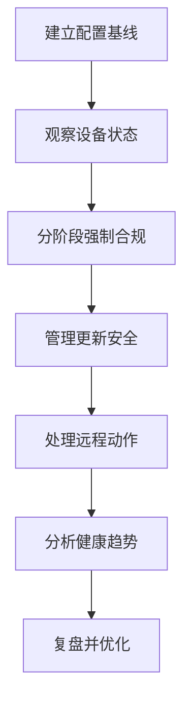

# 第7篇 Microsoft 365 E3 终端安装与管理 · 第4节 Intune 长期管理

> **本节小节：** 7.32 ～ 7.44。
> **导航：** [返回第7篇目录](README.md)｜上一节：[Intune 推送安装](03-Intune推送安装.md)｜下一节：[本地组策略](05-本地组策略.md)

---

## 7.32 本节目标

应用安装完成不是项目终点。Intune 长期管理需要持续处理配置、合规、更新、安全、远程动作、远程协助、终结点分析、库存、冲突和隐私。

完成本节后，应建立：

- 配置文件、安全基线与设置所有权台账；
- 合规策略和条件访问分阶段上线方案；
- Windows 更新环、功能更新、驱动更新及 Autopatch 决策；
- Defender 与 BitLocker 的配置和恢复流程；
- 设备动作审批矩阵；
- Remote Help、Advanced Analytics、库存与隐私边界；
- 每日、每周、每月和季度运维节奏。



## 7.33 配置文件、设置目录与安全基线

### 7.33.1 三类配置入口

| 配置方式 | 适合场景 | 优点 | 注意事项 |
|---|---|---|---|
| 配置文件模板 | VPN、Wi-Fi、证书、设备限制等有明确模板的场景 | 向导化、用途清晰 | 模板支持范围随平台变化 |
| 设置目录 | Windows 等平台的大量单项设置 | 可搜索、可细分、便于现代策略管理 | 避免多个配置文件重复设置同一项 |
| 安全基线 | Microsoft 推荐安全设置的版本化集合 | 快速建立安全起点 | 不是无条件适用于所有业务，应先评估差异 |

原则是“一个配置域一个所有者”。例如防火墙设置由终结点安全策略负责后，不再由另一个设置目录配置文件和域 GPO 重复下发相同值。

### 7.33.2 建立命名和分层

建议命名：

```text
<平台>-<配置域>-<用途>-<范围>-<版本>
WIN-SEC-BitLocker-Pilot-v01
WIN-CFG-Browser-Production-v03
```

按以下层次设计：

1. **企业基础层：** 所有公司设备必须具备的最低配置；
2. **平台层：** Windows、macOS、iOS/iPadOS、Android 各自设置；
3. **角色层：** 开发、财务、共享设备等业务差异；
4. **例外层：** 有期限、有负责人、有补救措施的排除。

### 7.33.3 安全基线上线方法

安全基线不是“一键全开”。上线应执行：

1. 导出并记录当前设置、域 GPO 和安全产品状态；
2. 阅读基线版本说明，标记可能影响身份、浏览器、宏、网络和旧应用的设置；
3. 复制到 `<WIN-Baseline-Pilot>`，只分配 IT 测试设备；
4. 检查逐设置状态、冲突和业务功能；
5. 对差异形成批准记录，不直接把所有异常改成“未配置”；
6. 分批扩大，并在微软发布新基线版本时作为新变更重新测试。

### 7.33.4 配置结果和冲突

配置文件的“成功”是设备已处理该策略，不必然证明所有业务流程正常；“冲突”表示多个来源提供不兼容值。排查顺序：

- 查看设备的逐设置状态和来源；
- 搜索 Intune 中所有配置文件、终结点安全策略和基线；
- 检查域 GPO、本地策略和第三方安全代理；
- 选定唯一所有者，先在试点撤销重复来源；
- 同步并验证最终有效值和业务结果。

## 7.34 合规策略与条件访问

合规策略评估设备是否满足组织要求，例如最低操作系统版本、密码、加密、简单密码风险、设备威胁级别等。条件访问再使用“设备是否合规”等信号决定是否允许访问云资源。两者是联动关系，但不是同一产品中的同一个动作。

### 7.34.1 先仅报告，再强制

推荐四阶段：

1. **建立合规策略：** 先分配试点，设置合理宽限期；
2. **观察结果：** 至少覆盖正常办公、出差、休假、长期离线和新设备注册场景；
3. **条件访问仅报告：** 在 Microsoft Entra 条件访问中用仅报告模式评估影响；
4. **分批启用：** 先低风险应用或小范围，再扩展到生产资源。

条件访问策略启用前必须使用模拟/登录日志验证，并确认非受管服务账号、旧客户端和自动化流程不会被误伤。

### 7.34.2 紧急访问账号必须排除

至少准备两个云端紧急访问账号，例如 `<Emergency-Cloud-01>` 和 `<Emergency-Cloud-02>`：

- 排除在会导致租户锁定的条件访问策略之外；
- 使用强认证、独立保管和严格告警；
- 不用于日常管理，不与个人设备绑定；
- 定期测试可用性并记录；
- 每次使用后复盘、轮换凭据并检查审计日志。

> **高风险：** 条件访问从仅报告切换到“开”可能阻断全员登录。必须有准备、验证和回退。

| 阶段 | 必做事项 | 通过条件 |
|---|---|---|
| 准备 | 紧急账号排除、仅报告数据、受影响用户清单、支持窗口 | 能预测策略影响并可紧急登录 |
| 验证 | 小组启用、查看登录日志、测试浏览器/客户端/移动端 | 正常用户可访问，异常设备按预期阻止 |
| 回退 | 使用紧急账号禁用新策略或恢复仅报告 | 登录恢复，事件与误判有记录 |

### 7.34.3 合规不是实时状态

设备离线、宽限期、评估周期和合作安全服务同步都会影响状态更新时间。不要承诺配置修改后立刻变为合规；也不要通过反复删除设备对象来“刷新”合规。

## 7.35 Windows 更新环

Windows 更新环主要控制质量更新和用户体验，例如延迟、截止期限、宽限期、自动重启和活动时间。它不等于指定长期停留的功能版本；功能版本应使用功能更新策略。

### 7.35.1 建议环设计

| 更新环 | 示例范围 | 目标 | 建议观察期 |
|---|---|---|---|
| 预览验证环 | `<IT-Update-Ring-0>` | 最早发现兼容性问题 | `<3～7天>` |
| 业务试点环 | `<Pilot-Update-Ring-1>` | 验证核心业务 | `<7天>` |
| 广泛生产环 | `<Broad-Update-Ring-2>` | 分批覆盖大多数设备 | 按风险批准 |
| 关键设备环 | `<Critical-Update-Ring-3>` | 维护窗口内受控更新 | 单独审批 |

时间均为占位，应结合安全风险、业务窗口和微软支持周期确定。

### 7.35.2 必须明确的参数

- 质量更新延迟；
- 自动更新行为；
- 活动时间与用户通知；
- 截止期限和宽限期；
- 截止后自动重启行为；
- 暂停更新的权限、最长时长和恢复流程；
- 加速安全质量更新的应急流程。

不要同时让域 WSUS/GPO、Intune 更新环和第三方补丁平台争夺同一设备。迁移期间按设备批次指定唯一更新所有者，并验证 Windows Update for Business 的实际扫描来源。

### 7.35.3 更新失败排查

先核对策略命中和有效设置，再检查 Windows Update 状态、磁盘空间、代理、防火墙、暂停状态、保障暂停/兼容性保留以及重启等待。更新报表有数据延迟，需结合设备日志和操作系统版本判断。

## 7.36 功能更新与驱动程序更新

### 7.36.1 功能更新策略

功能更新策略用于把目标设备保持在批准的 Windows 功能版本，或按计划升级到指定版本。设计步骤：

1. 清点设备当前版本、硬件支持、关键驱动和业务应用；
2. 选择微软仍支持且硬件可用的目标版本；
3. 创建功能更新试点策略并分配 `<WIN-Feature-Pilot>`；
4. 查看兼容性保留和失败设备，处理后再扩大；
5. 在目标版本临近服务终止前提前规划下一次升级。

不要用无限延迟质量更新来“锁版本”，那会同时推迟安全修复。

### 7.36.2 驱动程序更新策略

驱动更新可按自动批准或管理员审核方式管理，具体可用能力以租户和设备支持为准。

- 常规设备可采用分环、自动批准并设置延迟；
- 关键硬件、专业外设和旧型号建议管理员先审核；
- 记录驱动名称、版本、发布日期、批准人和受影响设备；
- 验证 BitLocker、网络、显示、音频、扩展坞和业务外设；
- 设备厂商专用工具与 Intune 驱动策略不能无规划地同时控制更新。

### 7.36.3 高风险驱动回退

准备：保存当前驱动版本、恢复密钥、网络替代方案和试点设备。
验证：重启后检查设备管理器、网络、BitLocker、睡眠唤醒及业务外设。
回退：暂停批准、回滚驱动或使用厂商批准版本；若设备失联，按现场恢复流程处理。

## 7.37 Windows Autopatch

Windows Autopatch 是微软托管的更新编排服务。本书基线下 Microsoft 365 E3 包含 Windows Enterprise E3 订阅权益，因此许可层面可使用 Autopatch；但设备必须先具有符合 Product Terms 的合格基础 Windows 许可（新机通常为已激活 OEM Windows Pro），并满足 Autopatch 的版本、注册、管理和服务先决条件。Windows Enterprise E3 不能替代裸机或 Home 版的基础许可。

### 7.37.1 使用前提

实施前检查：

- 租户和管理员满足 Autopatch 注册要求；
- 设备具有受支持的 Windows 版本、Intune 注册和 Entra 身份；
- 设备网络可访问所需服务；
- 现有 WSUS、域 GPO、Intune 更新环或第三方补丁策略已梳理；
- 设备满足服务健康和注册就绪检查。

### 7.37.2 Autopatch 与自建更新环取舍

| 方案 | 优点 | 适合场景 | 管理责任 |
|---|---|---|---|
| 自建 Intune 更新环 | 控制细、适配自定义维护窗口 | 特殊设备多、已有成熟团队 | 企业设计环、监控和调整 |
| Windows Autopatch | 托管式分环与更新编排 | 标准化企业设备 | 微软编排，企业仍负责就绪与例外 |

Autopatch 不替代应用兼容性测试、业务沟通、设备修复和例外审批。迁入 Autopatch 前要先消除冲突更新策略，并用小批设备验证。

### 7.37.3 迁入闭环

准备：导出现有更新策略、建立设备清单、选择试点、确认退出路径。
验证：检查设备就绪、注册状态、更新环归属、质量/功能更新和重启体验。
回退：停止扩大，按服务流程取消设备注册，恢复已批准的企业更新环并验证扫描来源。

## 7.38 Defender 与 BitLocker

### 7.38.1 Defender 管理

使用 Intune 终结点安全策略管理受支持的 Microsoft Defender 防病毒、防火墙、攻击面减少等设置，并按本企业实际许可配置 Microsoft Defender for Endpoint 集成。

实施原则：

- 先确认是否存在第三方防病毒或 EDR，避免双重实时保护冲突；
- 攻击面减少规则先用审计模式观察，再逐条转为警告或阻止；
- 为业务误报建立临时、有期限、最小范围的排除；
- Defender 排除项是高风险配置，不得为“解决告警”而排除整个磁盘、用户目录或通用进程；
- 策略状态、设备风险和安全告警分别查看，不能只看 Intune 配置成功。

### 7.38.2 BitLocker 管理

BitLocker 策略至少规划：

- 操作系统盘和固定数据盘的加密要求；
- 静默启用条件及是否需要用户交互；
- 加密算法按企业安全基线确定；
- 恢复密钥托管到 Microsoft Entra ID；
- 标准用户能否查看恢复密钥；
- 密钥使用后的轮换、审计和帮助台核验流程。

### 7.38.3 加密高风险操作

| 阶段 | 必做事项 | 禁止事项 |
|---|---|---|
| 准备 | 验证 TPM、固件、恢复密钥托管和应急访问 | 未确认密钥即强制重启或改固件 |
| 验证 | 抽查加密状态、算法、密钥可恢复和重启 | 在工单中明文粘贴恢复密钥 |
| 回退 | 暂停新策略、保留既有加密、按审批解密 | 为排障批量关闭全公司加密 |

配置策略撤销通常不会自动解密现有磁盘。解密是独立高风险决定，应经过安全审批。

## 7.39 设备远程动作及其区别

管理员必须先理解动作后再执行。动作名称和平台支持可能不同，以下以受管 Windows 的主要概念为准。

| 动作 | 主要结果 | 数据影响 | 典型用途 |
|---|---|---|---|
| 同步 Sync | 请求设备尽快签入并获取策略 | 不删除数据 | 测试分配、排障 |
| 重启 Restart | 请求设备重新启动 | 未保存工作可能丢失 | 更新或修复后重启 |
| 擦除 Wipe | 重置设备并移除数据/设置，选项因平台而异 | **高**，可能删除全部数据 | 丢失、被盗、设备重置 |
| Autopilot Reset | 恢复企业就绪状态并保留 Entra/Intune 关系 | 删除用户文件、应用和设置 | 组织设备转交下一用户 |
| 退役 Retire | 移除管理和组织数据，尽量保留个人数据 | 中，依平台而异 | BYOD 退出或温和解除管理 |
| 删除 Delete | 清理 Intune 设备记录；行为依平台和状态而异 | 不能当作可靠擦除 | 清理已完成处置的陈旧记录 |

### 7.39.1 重要区别

- **同步不是实时遥控。** 设备离线时只能等待下次上线。
- **重启会中断业务。** 必须通知用户并确认维护窗口。
- **擦除用于数据风险处置。** 执行后通常难以撤销，必须核对序列号、所有者和事件编号。
- **Autopilot Reset 不是普通重启。** 它用于重新准备组织设备，会移除当前用户状态。
- **退役比擦除温和。** 适用于尽量保留个人内容的场景，但实际清理范围取决于平台和管理方式。
- **删除不是擦除。** 不能先删管理记录再期望远程清除；某些平台的删除还可能触发解除管理行为，应按当时官方行为验证。

### 7.39.2 擦除/重置的准备、验证和回退

| 阶段 | 必做事项 | 说明 |
|---|---|---|
| 准备 | 双人核对设备、所有者、序列号、备份、恢复密钥和动作类型 | 工单使用虚构或脱敏标识，不暴露个人数据 |
| 验证 | 查看动作状态、设备最后签入、Entra/Intune/Autopilot 对象状态 | 失联设备要升级为安全事件跟踪 |
| 回退/恢复 | 擦除本身通常不可撤销；用 Autopilot 或受控镜像重新配置 | “回退”是恢复业务，不是找回未备份数据 |

## 7.40 Remote Help

本书基线下，Remote Help 属于当前 Intune Plan 2 高级能力范围，并自 2026 年夏季随相关 E3 包装加入；租户后台可能把它显示为单独服务计划。实施前必须检查服务计划、用户许可、客户端和平台支持。它为帮助台提供基于组织身份和权限的远程协助，不等于管理员可以无审计地查看任何员工屏幕。

### 7.40.1 上线步骤

1. 在租户确认 Remote Help 服务计划对帮助台和受助用户可用；
2. 按支持矩阵部署/更新 Remote Help 客户端或启用相应平台能力；
3. 创建最小权限角色，区分仅查看、完全控制和提权相关权限；
4. 使用 Intune RBAC 的范围组和范围标记限制帮助台可管理对象；
5. 建立用户同意、会话通知、身份核对和敏感窗口关闭流程；
6. 在 `<HELPDESK-RemoteHelp-Pilot>` 试点，验证外网、代理、日志和会话结束；
7. 定期审计谁在何时帮助了哪台设备及会话结果。

### 7.40.2 安全与隐私边界

- 帮助台不得要求用户口述密码、MFA 验证码或 BitLocker 恢复密钥；
- 涉及财务、人事、医疗或法律敏感信息时，先关闭无关窗口；
- 不得将 Remote Help 用作员工持续监控工具；
- 高权限操作必须关联工单并取得明确授权；
- 会话录制、日志保留和跨境访问按本企业法律、隐私及数据驻留要求决定。

## 7.41 Advanced Analytics

Advanced Analytics 属于当前 Intune Plan 2 高级能力范围，并在本书基线下自 2026 年夏季随相关 E3 包装加入；即使租户后台单独显示服务计划，产品能力归类也不因此改变。实际显示和数据范围仍以租户服务计划及设备资格为准。它在常规终结点分析之上提供更深入的设备性能、可靠性、应用体验或异常趋势洞察。

### 7.41.1 正确使用方式

- 用启动性能、应用可靠性、设备健康和异常趋势确定改善优先级；
- 先看群体趋势，再定位设备，不把单一评分直接等同于员工表现；
- 将发现转化为可验证变更，例如清理高故障应用、升级硬件或调整启动项；
- 变更前保存基线，变更后比较相同设备群和时间窗口；
- 对数据缺失先检查遥测、许可、注册、平台支持和设备活跃度。

### 7.41.2 不应做的推断

- 分数低不等于用户工作效率低；
- 应用崩溃不一定由设备硬件导致；
- 数据样本不足时不能据此批量更换设备；
- 分析报表不能替代业务验证、事件日志和用户访谈。

建议建立改进记录：

| 字段 | 示例占位 | 用途 |
|---|---|---|
| 发现 | `<应用崩溃率升高>` | 描述趋势，不记录个人评价 |
| 范围 | `<WIN-Finance-Pilot>` | 限定设备群 |
| 假设 | `<旧插件不兼容>` | 待验证原因 |
| 变更 | `<升级插件到vX>` | 对应变更单 |
| 结果 | `<观察14天>` | 相同口径复测 |

## 7.42 库存、报表与隐私边界

### 7.42.1 库存与报表

Intune 可提供设备硬件/操作系统、所有权、主用户、合规、配置、应用状态、发现的应用等信息。应明确数据的采集时间和局限：

- 最后签入较旧的设备，其库存可能过时；
- “发现的应用”不等于完整软件资产或许可证合规审计；
- 用户与设备关联在共享设备中可能不准确；
- 不同平台和应用类型返回的字段不同；
- 报表状态有处理延迟，不能作为秒级监控。

建议至少维护以下报表：

| 报表 | 周期 | 负责人 | 处理动作 |
|---|---|---|---|
| 长期未签入设备 | 每周 | `<终端运维>` | 联系用户、核对资产或退役 |
| 不合规设备 | 每日 | `<安全运维>` | 区分宽限、失联与真实风险 |
| 应用安装失败 | 每日/发布期 | `<应用管理员>` | 按错误类别修复和重试 |
| 更新落后设备 | 每周 | `<补丁管理员>` | 处理兼容性和连接问题 |
| 加密/安全异常 | 每日 | `<安全管理员>` | 升级高风险事件 |
| 陈旧记录与重复对象 | 每月 | `<身份与终端团队>` | 先确认资产状态再清理 |

### 7.42.2 隐私边界

- 只采集管理、安全和资产所必需的信息；
- 使用最小权限 RBAC、范围标签和定期访问审查限制报表；
- 导出文件必须存放在受控位置，并设定保留和删除期限；
- 不因技术上可查看设备/应用信息，就将其用于员工行为监控；
- 不在设备名称、组名称或备注中写身份证号、手机号、健康信息等敏感个人数据；
- 跨境、工会、员工告知和日志留存要求由法律、隐私、人力资源和安全团队共同确认。

## 7.43 运维节奏与冲突治理

### 7.43.1 建议运维节奏

| 周期 | 核心工作 | 输出 |
|---|---|---|
| 每日 | 服务健康、高风险告警、不合规、应用失败、擦除/帮助请求 | 事件与工单 |
| 每周 | 更新落后、长期未签入、部署成功率、Remote Help 审计 | 周报和失败清单 |
| 每月 | 策略例外、重复对象、管理员权限、许可使用、库存质量 | 月度治理报告 |
| 每季度 | 安全基线版本、配置所有权、Autopatch、隐私与保留复核 | 季度评审纪要 |
| 每年 | 终端标准、设备生命周期、供应商与恢复演练 | 年度路线图 |

### 7.43.2 冲突治理流程

1. **记录症状：** 设备、用户、设置、时间和业务影响；
2. **确认目标：** 组成员、筛选器、包含/排除和许可；
3. **定位来源：** Intune 配置、终结点安全、安全基线、域 GPO、本地策略、脚本或第三方工具；
4. **确定所有者：** 在配置所有权矩阵中指定唯一平台和负责人；
5. **试点消冲突：** 从最小范围撤销重复来源，等待签入并验证；
6. **分批修复：** 扩大范围，监控报表和业务；
7. **清理旧对象：** 归档而非无记录删除，更新设计文档。

### 7.43.3 变更命名与版本

- 配置名称包含平台、用途、范围和版本；
- 描述字段写明负责人、变更单、创建日期和替代对象；
- 重大策略不要直接在生产对象上试错，应复制为新版本并先试点；
- 废弃策略先撤销分配并观察，再归档/删除；
- 每次变更保留原值、目标值、验证方法和回退条件。

## 7.44 长期管理上线、回退与本节验收

### 7.44.1 推荐上线顺序

1. 建立 RBAC、范围标签、命名、试点组和紧急访问账号；
2. 先部署低风险配置和库存，不立即阻断访问；
3. 部署 Defender/BitLocker 试点并验证恢复；
4. 建立更新环或 Autopatch 试点，消除 WSUS/GPO 冲突；
5. 让合规策略运行并观察，再把条件访问从仅报告转为小范围启用；
6. 启用 Remote Help 和 Advanced Analytics，落实隐私、权限与审计；
7. 建立周期报表、例外到期和季度基线复核。

### 7.44.2 通用高风险变更模板

| 阶段 | 问题 | 必须交付 |
|---|---|---|
| 准备 | 影响谁、现值是什么、如何紧急访问、数据是否备份 | 试点名单、原值、工单、回退命令/策略 |
| 验证 | 策略是否命中、设备是否签入、安全与业务是否正常 | 报表、客户端证据、业务确认 |
| 回退 | 何时触发、谁批准、如何恢复、不可逆影响是什么 | 撤销分配、恢复旧策略、事件记录 |

对擦除、Autopilot Reset、BitLocker 变更和条件访问强制等不可逆或高影响动作，“回退”可能只能恢复设备和业务，无法恢复未备份数据。审批时必须明确这一点。

### 7.44.3 完成检查表

- [ ] 配置文件、设置目录、安全基线各自用途和唯一所有者已确定。
- [ ] 合规策略已观察，条件访问先用仅报告，紧急账号已排除并测试。
- [ ] Windows 更新环、功能更新、驱动更新与 Autopatch 的边界已确定。
- [ ] Defender 与 BitLocker 已按试点、验证、恢复流程上线。
- [ ] 同步、重启、擦除、Autopilot Reset、退役、删除的差异已写入审批矩阵。
- [ ] Remote Help 已实施最小权限、用户同意和会话审计。
- [ ] Advanced Analytics 不用于评价员工，分析结果有样本和复测。
- [ ] 库存报表的延迟、完整性和许可证审计边界已记录。
- [ ] 已落实每日到年度的运维节奏和配置冲突治理流程。
- [ ] 所有高风险操作均有准备、验证和恢复/回退证据。

> **下一节：** [本地组策略](05-本地组策略.md)，进一步明确 `gpedit.msc` 的单机能力、适用例外和不能替代集中管理的原因。
