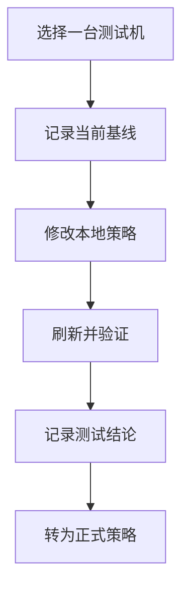
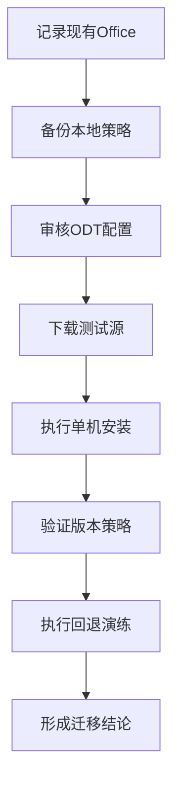
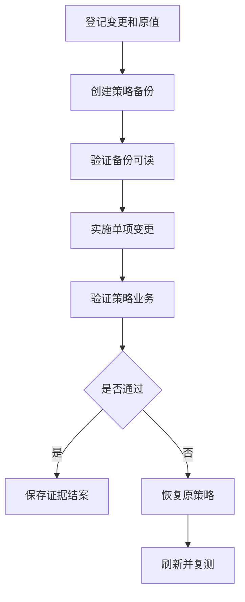

# 第7篇 Microsoft 365 E3 终端安装与管理 · 第5节 本地组策略

> **本节小节：** 7.45 ～ 7.53。
> **导航：** [返回第7篇目录](README.md)｜上一节：[Intune 长期管理](04-Intune长期管理.md)｜下一节：[域组策略架构与生效机制](06-域组策略架构与生效机制.md)

---

## 7.45 本节目标

本地组策略是 Windows 在**当前这一台电脑上**提供的配置机制，常用入口是 `gpedit.msc`。它适合管理员在测试机上验证设置、隔离故障，或管理极少数永久离线设备；它不是从管理员电脑向多台电脑集中推送策略的平台。

完成本节后，应能回答以下问题：

- `gpedit.msc` 编辑什么，策略定义、策略存储和最终生效结果有什么区别；
- “计算机配置”和“用户配置”分别作用于谁，何时刷新，和域 GPO 共存时按什么顺序处理；
- 本地策略能否安装软件，以及为什么 M365 Apps 不能按传统 MSI“软件安装”策略原生部署；
- 如何用一台隔离测试机配合 Office Deployment Tool（ODT）验证 M365 Apps；
- 如何使用 `gpupdate`、`gpresult`、`rsop.msc` 和事件日志排查问题；
- 如何备份、变更、验证、回退并形成单机验收记录。

本企业对本地组策略的定位只有三类：**测试、故障隔离、极少数永久离线设备**。全公司 M365 E3 的应用安装、配置、合规、更新和状态统计，应以 Intune 为目标主平台；过渡期内的域设备可按后续章节使用域 GPO。

> **必须牢记：** 本地组策略只管理当前一台 Windows。即使管理员在十台电脑上重复相同操作，也只是十次单机变更，不是集中推送；它没有企业级状态报表、统一版本控制、审批流和批量回退能力。



图中的“转为正式策略”是指把验证通过的设置重新设计到 Intune 或域 GPO，而不是复制本地策略文件后宣称已经完成企业部署。

## 7.46 `gpedit.msc` 架构与策略存储

### 7.46.1 编辑器、模板、存储和结果不是同一层

第一次接触时，最容易把界面中看到的设置、磁盘上的文件和注册表里的结果混为一谈。可按四层理解：

| 层次 | 作用 | 典型位置或工具 | 关键边界 |
|---|---|---|---|
| 编辑界面 | 供管理员查看和配置本机策略 | `gpedit.msc` | 只是 MMC 管理界面，不是集中控制台 |
| 策略定义 | 告诉编辑器有哪些设置、说明和可选值 | `%SystemRoot%\PolicyDefinitions` 中的 ADMX/ADML | 模板本身不等于策略已启用 |
| 本地策略存储 | 保存当前电脑的本地 GPO 数据 | `%SystemRoot%\System32\GroupPolicy`；MLGPO 还会使用 `GroupPolicyUsers` | 仅属于当前电脑，不会自动复制到别的电脑 |
| 生效结果 | Windows 或应用读取策略后形成的有效配置 | 注册表策略区域、安全数据库、脚本配置等 | 位置随策略扩展而异，不能只查一个注册表项下结论 |

“管理模板”类设置通常会写入本地 GPO 的 `Registry.pol`，刷新策略后再体现到相应的注册表策略路径，例如 `HKLM\Software\Policies` 或 `HKCU\Software\Policies`。但这只是常见模式，不代表所有本地策略都存储在 `Registry.pol`：安全设置、审核、脚本等可由不同客户端扩展处理并保存在不同位置。

> **不要直接编辑 `Registry.pol`。** 它不是面向人工维护的文本文件。直接修改可能造成格式损坏、界面与结果不一致，也没有审批和回退记录。应使用 `gpedit.msc`、受支持的命令或经过验证的 LGPO 工具流程，并在变更前创建备份。

### 7.46.2 本机本地组策略与多本地组策略

最常见的是“本地计算机策略”，它包含计算机配置和用户配置。Windows 还支持多本地组策略（Multiple Local Group Policy Objects，MLGPO），可进一步为以下对象提供用户配置层：

1. 管理员组成员；
2. 非管理员组成员；
3. 某个特定本地用户。

MLGPO 的用户侧处理通常按“本地计算机策略 → 管理员或非管理员层 → 特定用户层”的顺序进行，后处理且发生冲突的设置可能覆盖前面的设置。它仍然只是当前电脑上的细分控制，不会因为创建了多个本地 GPO 就变成企业集中管理。

对首次实施者，建议默认只使用本地计算机策略。确有共享离线电脑、多个本地角色等需求时，才在测试和备份后使用 MLGPO，并记录“设置位于哪一层、作用于哪个本地用户”。

### 7.46.3 打开前先确认环境

1. 确认设备是获支持的 Windows 专业版、企业版或教育版；部分版本没有本地组策略编辑器。
2. 使用已批准的本机管理员账号打开 `gpedit.msc`，不要使用日常高权限账号无记录试改。
3. 记录设备名、Windows 版本、加入状态、Intune 注册状态、域状态和当前策略来源。
4. 若安装 Office ADMX/ADML，仅表示编辑器能够显示对应设置；必须匹配模板版本和语言文件，并先在隔离机验证。
5. 若设备同时受 Intune 或域 GPO 管理，先确定该设置的唯一所有者，避免多头配置。

## 7.47 计算机配置、用户配置与生效顺序

### 7.47.1 两个配置分支

| 分支 | 主要作用对象 | 常见处理时机 | 示例 |
|---|---|---|---|
| 计算机配置 | 当前 Windows 设备，不因登录用户变化而改变 | 启动、后台刷新、手动刷新 | 设备安全、系统组件、计算机启动脚本 |
| 用户配置 | 登录到当前设备且命中相应策略层的用户 | 登录、后台刷新、手动刷新 | 用户界面、用户侧 Office 管理模板设置 |

选择分支时先问“设置应该跟着设备，还是跟着用户”。例如，一台永久离线的展厅电脑必须始终保持某项设备限制，通常考虑计算机配置；某个本地测试用户的 Office 界面行为，才考虑用户配置。

不要因为两个分支中存在同名或相似设置就同时配置。若产品文档没有说明优先级，同时设置只会增加排障难度。

### 7.47.2 刷新不是“点击确定就全部完成”

本地策略可在系统启动、用户登录和周期性后台刷新时处理。管理员也可以运行：

```powershell
gpupdate /target:computer /force
gpupdate /target:user /force
```

命令完成只表示已触发策略处理，不等于每项设置都立即生效。部分设置需要注销、重新登录或重启；脚本还可能受执行上下文、路径、权限和超时影响。验证必须同时查看结果策略、事件日志和实际业务行为。

### 7.47.3 与域 GPO、Intune 共存时的边界

对已加入 AD 域的电脑，传统组策略一般按 Local、Site、Domain、OU（LSDOU）顺序处理，后处理且发生冲突的域策略通常可覆盖本地设置；继承阻止、强制、安全筛选、WMI 筛选和回环处理等会影响最终结果，详见后续域 GPO 章节。

MLGPO 的各本地层会在域 GPO 之前处理。因此，在域电脑上用 `gpedit.msc` 改值后又被域策略改回，通常不是编辑器故障，而是本地设置不是最终获胜来源。

Intune 不属于 LSDOU。不同 CSP、管理模板、组策略和应用自身配置之间没有一个适用于所有设置的“永远谁赢”规则。正确做法不是猜优先级，而是为每个设置指定唯一配置所有者，并从其他平台撤销重复配置。

> **再次强调：** `gpupdate` 只刷新当前电脑可获得的组策略，不会把这台管理员电脑的本地策略发送到其他设备。本地策略没有企业级命中报表、统一版本控制、审批和批量回退。

## 7.48 软件安装能力与准确边界

### 7.48.1 本地策略能做什么、不能做什么

| 需求或方式 | 本地组策略本身是否适合 | 可行做法 | 必须说明的边界 |
|---|---|---|---|
| 配置 Windows 或 Office 管理模板设置 | 适合单机验证 | 在测试机用 `gpedit.msc` 配置并刷新 | 仅当前电脑，无集中状态和版本治理 |
| 运行本机启动/登录脚本 | 有限可用 | 将已审核脚本配置到相应脚本策略，使用本机受控路径 | 需自行处理权限、幂等、日志、失败和回退 |
| 结合本机计划任务执行安装 | 不是本地策略的现代分发能力 | 另行创建受控计划任务调用本机脚本或 ODT | 本地策略不提供企业级检测、重试、依赖和报表 |
| 用传统“软件安装”策略部署 MSI | 不应作为本企业单机方案主线 | 单机 MSI 用安装程序或受控命令验证 | 不要把域 GPO 软件分发能力套用到本地策略 |
| 安装 M365 Apps | 不能按 MSI 软件安装方式原生部署 | 在本机直接运行 ODT 的 `/download` 与 `/configure` | M365 Apps 是 Click-to-Run，不是可按传统 MSI 策略原生部署的产品 |
| 向多台设备分发应用 | 不适合 | 使用 Intune；域内遗留场景按后续域 GPO 方案评估 | 逐台运行相同命令仍不是集中推送 |
| 查看全公司安装成功率 | 不能 | 使用 Intune 报表或正式运维平台 | 本地事件或日志只代表当前电脑 |
| 批量卸载或回退版本 | 不能集中完成 | 在正式平台设计卸载、版本和回退策略 | 本地策略没有批量回退编排能力 |

本地组策略可以**配合**本机脚本、任务计划程序和 ODT 完成单机实验，但这种组合的安装动作来自脚本、计划任务或 ODT，不是 `gpedit.msc` 变成了 Intune，也不是当前电脑变成了域控制器。

### 7.48.2 为什么不能把 M365 Apps 当 MSI 部署

Microsoft 365 Apps 使用 Click-to-Run 安装与更新技术。ODT 的 `setup.exe` 读取 XML，负责下载、配置和安装 Click-to-Run 产品。不能声称在本地组策略的“软件安装”节点中选择一个 MSI，就能像传统 MSI 应用一样原生部署 M365 Apps。

正确区分如下：

- **安装引擎：** ODT/Click-to-Run 负责下载和安装 M365 Apps；
- **策略验证：** 本地组策略可在当前测试机上验证受支持的 Office 管理模板设置；
- **企业分发：** Intune 负责目标设备、执行状态、检测和集中报表；域内过渡方案可按后续章节用启动脚本或计划任务调用 ODT；
- **长期治理：** 更新通道、版本、宏和安全设置必须有唯一配置所有者，不能让 ODT XML、Intune、域 GPO 和本地策略长期互相覆盖。

### 7.48.3 脚本和计划任务的高风险控制

以 `SYSTEM` 或管理员权限运行安装脚本、修改安全设置、改变更新通道都属于高影响操作，必须按下表执行：

| 阶段 | 必做事项 | 证据 |
|---|---|---|
| 准备 | 审核脚本来源与哈希；使用虚构测试路径；备份本地策略；记录当前 Office 产品、版本、通道；准备卸载或恢复方案 | 工单号、脚本哈希、基线截图或导出、备份路径 |
| 验证 | 先在隔离测试机以目标执行上下文运行；确认退出码、日志、Office 启动、激活、更新和业务插件 | ODT 日志、事件日志、版本信息、业务测试记录 |
| 回退 | 停用任务或脚本；恢复策略备份；按已批准 XML 恢复原通道/产品配置；失败时重装测试机而非带病扩散 | 回退时间、执行人、恢复后版本和功能结果 |

## 7.49 用本地策略进行 M365 Apps 与 ODT 单机验证

### 7.49.1 验证目的和目录

单机验证的目的不是模拟“全公司推送”，而是在不影响生产设备的前提下回答：

- ODT XML 能否下载并安装正确的产品、位数、语言和更新通道；
- 现有 Office、Visio、Project、插件和宏是否兼容；
- 准备采用的 Office 管理模板设置是否生效；
- 出错时日志在哪里，回退是否可执行；
- 验证通过后，哪些配置应转换为 Intune 或域 GPO 的正式对象。

示例使用虚构测试机 `<M365-LAB-01>`，本地目录为 `C:\M365-Test`。不要在 XML、脚本或文档中保存真实管理员密码、许可证密钥或生产共享凭据。

### 7.49.2 示例 ODT 配置

将经过来源验证的 ODT `setup.exe` 与下列 `configuration-test.xml` 放在 `C:\M365-Test`。这是实验示例，实施前必须根据企业已购买产品、现有架构、语言和通道审批结果调整：

```xml
<Configuration>
  <Add OfficeClientEdition="64" Channel="MonthlyEnterprise"
       SourcePath="C:\M365-Test\Source">
    <Product ID="O365ProPlusRetail">
      <Language ID="zh-cn" />
    </Product>
  </Add>
  <Updates Enabled="TRUE" Channel="MonthlyEnterprise" />
  <Display Level="Full" AcceptEULA="FALSE" />
</Configuration>
```

示例故意使用可见界面并不自动接受许可条款，便于首次验证者观察过程。无人值守生产部署必须另行完成许可、隐私、交互和重启评估，不能直接复制实验 XML。

### 7.49.3 单机 ODT 验证流程



**步骤一：准备。**

1. 对 `<M365-LAB-01>` 做快照或可恢复的系统备份，确认不含唯一生产数据。
2. 记录已安装产品、位数、版本、更新通道、插件、宏和激活状态。
3. 备份本地策略，记录 Intune、域 GPO 和安全软件状态，避免把其他来源的结果误判为本地策略效果。
4. 校验 ODT 来源、数字签名和文件哈希；审核 XML，确保产品 ID、位数、语言和通道符合测试目的。
5. 明确回退触发条件，例如 Office 无法启动、关键插件失败、更新通道不符或业务文档异常。

**步骤二：下载。** 在提升权限的终端中运行：

```powershell
Set-Location 'C:\M365-Test'
.\setup.exe /download .\configuration-test.xml
```

验证 `C:\M365-Test\Source` 已产生预期下载内容，并检查磁盘空间和 ODT 日志。下载完成不代表安装完成。

**步骤三：配置。** 确认没有未保存的 Office 文档后运行：

```powershell
Set-Location 'C:\M365-Test'
.\setup.exe /configure .\configuration-test.xml
```

**步骤四：验证安装结果。** 至少检查：

- Word、Excel、PowerPoint 和 Outlook 能否启动；
- “账户”页面显示的产品、版本、位数和更新通道是否符合预期；
- 业务插件、宏、模板、打印和文档打开是否正常；
- Click-to-Run 配置与版本证据，例如只读查询：

```powershell
Get-ItemProperty 'HKLM:\SOFTWARE\Microsoft\Office\ClickToRun\Configuration' |
    Select-Object ProductReleaseIds, VersionToReport, UpdateChannel
```

该注册表查询用于采集当前电脑证据，不应直接编辑这些值来代替 ODT 或正式策略。

**步骤五：验证 Office 本地策略。** 在已安装匹配版本 Office ADMX/ADML 的测试机上，只选择一项低风险、易观察的设置：记录原值，在 `gpedit.msc` 中配置，运行用户或计算机策略刷新，再用结果策略、注册表只读查询和 Office 实际行为交叉确认。验证完成后恢复“未配置”或恢复备份。

**步骤六：回退演练。** 按准备阶段批准的 XML 或卸载/重装方案恢复原产品与通道，恢复本地策略备份，重启或重新登录，再复测 Office 和插件。若快照回退会丢失测试期间的数据，执行前再次确认并记录。

**步骤七：形成结论。** 记录成功条件、失败日志、耗时、网络流量、磁盘需求、重启要求和回退结果；再把设置转换为 Intune 配置或域 GPO 设计。不得把 `C:\M365-Test` 复制到多台电脑后称为企业级应用分发。

## 7.50 本地策略可承担的长期管理

### 7.50.1 可管理的内容

在单机范围内，本地策略可以长期保持部分 Windows、浏览器或 Office 管理模板设置，也可配置本机启动/登录脚本。对极少数永久离线设备，可将它作为受控例外，但必须建立独立设备台账。

| 管理内容 | 单机可行性 | 长期要求 |
|---|---|---|
| Windows 管理模板 | 可行 | 记录模板版本、设置路径、原值和负责人 |
| Office 管理模板 | 可行，但依赖匹配的 ADMX/ADML 和产品支持 | 记录 Office 版本、策略作用域和实际验证结果 |
| 本地安全设置 | 部分可行 | 先评估锁定风险，保留紧急本地管理路径 |
| 启动/登录脚本 | 有限可行 | 使用受控本机路径，落实签名、权限、幂等、日志和回退 |
| 更新通道相关策略 | 可测试，长期仅限批准的离线例外 | 避免与 ODT、Intune、域 GPO 或应用设置冲突 |
| 本机例外设置 | 可行 | 设置到期日，定期复核是否仍需例外 |
| 企业应用库存和成功率 | 不可行 | 改用 Intune 或正式资产/运维平台 |
| 跨设备审批、版本和批量回退 | 不可行 | 改用集中管理与变更系统 |

### 7.50.2 离线设备也需要治理

“永久离线”不等于“无需管理”。每台离线例外设备至少记录：

- 资产编号、设备名、物理位置、业务负责人和技术负责人；
- Windows 与 M365 Apps 版本、许可证状态和允许的联网方式；
- 本地策略备份编号、配置清单、模板版本和最近复核日期；
- 补丁、恶意软件定义、证书和 Office 更新的离线导入流程；
- 本地管理员账号保管和紧急访问流程；
- 数据导入导出、可移动介质、日志收集和报废擦除要求；
- 例外原因、批准人、到期日和迁回集中管理平台的条件。

即便有完整台账，本地策略仍只管理这一台 Windows。台账可以补足人工审计，却不会自动产生企业级状态报表、统一版本控制、审批或批量回退。

### 7.50.3 配置所有权

对每项长期设置建立最小所有权记录：

| 字段 | 示例占位 | 说明 |
|---|---|---|
| 设置名称 | `<Office宏通知策略>` | 使用可读名称，不只记注册表路径 |
| 当前所有者 | `<本地策略-离线例外>` | 只能有一个有效配置来源 |
| 作用设备 | `<M365-OFFLINE-01>` | 本地策略只能列当前单机 |
| 原值/目标值 | `<原值>` / `<目标值>` | 用于验证和回退 |
| 批准记录 | `<CHG-2026-0001>` | 对应工单或审批编号 |
| 备份编号 | `<LGPO-BACKUP-0001>` | 能定位变更前备份 |
| 到期日期 | `<YYYY-MM-DD>` | 到期必须复核或撤销 |

## 7.51 优点、缺点与治理代价

### 7.51.1 本地组策略优缺点

| 维度 | 优点 | 缺点或代价 |
|---|---|---|
| 上手与依赖 | 单机可直接打开，无需搭建 AD、GPMC 或 Intune | 需要逐台操作，规模增长后工作量和错误率迅速上升 |
| 离线能力 | 不依赖互联网或域控制器即可处理本机策略 | 无法远程了解离线设备是否仍保持目标状态 |
| 测试隔离 | 适合快速验证一个设置或排除集中策略影响 | 测试结果必须重新转换为正式平台配置，不能直接视为已推广 |
| 配置范围 | 可覆盖大量 Windows 和管理模板设置 | 不提供现代应用分发的检测、依赖、重试、取代和卸载编排 |
| 可见性 | 可在本机查看结果和事件 | 没有企业级状态报表和全局失败清单 |
| 变更治理 | 小范围实验时步骤直观 | 没有内置统一版本控制、审批流、职责分离和变更历史 |
| 回退 | 单机可恢复备份或改回原值 | 没有批量回退；逐台恢复容易遗漏和产生配置漂移 |
| 安全 | 可用于隔离机验证安全设置 | 错误配置可能锁死本机，且缺少集中紧急修复通道 |

### 7.51.2 为什么“免费可用”不等于成本低

本地组策略不需要额外建立服务器，但企业成本还包括：

- 管理员逐台访问、验证和记录的工时；
- 不同设备配置漂移带来的排障成本；
- 无法快速统计失败设备造成的风险暴露时间；
- 无统一审批和版本历史导致的审计成本；
- 发生错误后逐台恢复的停机成本。

因此，本地组策略在一台测试机上很高效，在数十或数百台生产电脑上通常并不经济。把脚本复制到共享目录、远程连接每台电脑或让用户自行运行，都不能补齐企业级状态报表、版本控制、审批和批量回退。

## 7.52 适用场景与禁止场景

### 7.52.1 本企业允许使用的场景

1. **策略测试：** 在隔离测试机上验证 Windows 或 Office 设置，形成迁移到 Intune/域 GPO 的依据。
2. **故障隔离：** 临时排除 Intune、域 GPO 或应用配置影响，比较本地基线和集中策略结果。
3. **ODT 单机验证：** 验证 M365 Apps 产品、位数、语言、通道、插件和回退，不把结果包装为批量部署。
4. **极少数永久离线设备：** 在业务和安全批准后，按设备建立备份、变更、复核和到期台账。
5. **短期应急处置：** 仅在集中平台暂时不可用且风险获批时使用，恢复后尽快迁回正式平台。

### 7.52.2 禁止或不推荐的场景

- 禁止把本地组策略作为全公司 M365 E3 安装和管理主平台；
- 禁止宣称可从管理员电脑通过 `gpedit.msc` 向多台电脑集中推送；
- 禁止把逐台远程登录、复制脚本或手工导入策略称为“集中管理”；
- 禁止声称 M365 Apps 可通过传统“软件安装”策略像 MSI 一样原生部署；
- 禁止长期让本地策略、Intune 和域 GPO 同时控制同一设置；
- 禁止直接编辑 `Registry.pol` 或用未经审核的注册表脚本代替受控策略变更；
- 禁止在无备份、无紧急管理员路径、无验证和无回退方案时修改登录、安全、网络、防火墙、BitLocker、更新或宏策略；
- 禁止把测试机的单机成功作为全公司兼容性、安装成功率或合规证明；
- 禁止用本地策略管理普通移动办公电脑，因为设备离开现场后无法形成集中状态和修复闭环；
- 禁止用人工表格声称已获得平台自动报表、统一版本控制、审批流或批量回退能力。

### 7.52.3 场景决策表

| 场景 | 推荐平台 | 本地策略角色 | 结论 |
|---|---|---|---|
| 新购 Entra Join 电脑 | Intune | 仅实验室验证 | 不使用本地策略做生产主控 |
| 已加入 AD 域的存量电脑 | 域 GPO + Intune 过渡 | 故障对照 | 按唯一所有者逐步迁往 Intune |
| 单台隔离测试机 | 本地策略 + ODT | 主测试工具 | 验证后转换为正式平台配置 |
| 极少数永久离线电脑 | 本地策略受控例外 | 单机长期配置 | 必须有资产、备份、复核和到期台账 |
| 多台互联网办公电脑 | Intune | 不承担批量管理 | 使用应用、配置、合规和报表闭环 |
| 多台域内遗留电脑 | 域 GPO 或软件管理平台 | 不承担集中推送 | 需要范围、状态、版本和回退设计 |

## 7.53 操作、排障、恢复与验收

### 7.53.1 标准单机操作流程

每次变更都应关联虚构格式的变更号，例如 `<CHG-YYYY-NNNN>`，并只在批准设备 `<TEST-PC-01>` 上执行。

| 阶段 | 操作 | 验证 | 回退准备 |
|---|---|---|---|
| 1. 清点 | 记录设备、系统、用户、域/Intune 状态和当前策略 | 信息与资产台账一致 | 明确紧急本机管理员账号 |
| 2. 备份 | 使用批准工具备份本地策略，并保存原值证据 | 备份目录可读且有时间、设备和变更号 | 在隔离机验证可恢复性 |
| 3. 变更 | 只修改工单列出的一个设置域 | 截图或导出设置路径、原值和目标值 | 不删除旧备份，不同时改多个来源 |
| 4. 刷新 | 按作用域运行 `gpupdate`，按提示注销或重启 | 命令退出正常，事件日志无相关错误 | 预留维护窗口和重启恢复时间 |
| 5. 验证 | 查结果策略、事件、注册表只读结果和业务行为 | 四类证据一致 | 任一关键验证失败即停止扩大 |
| 6. 记录 | 更新结果、日志、偏差、负责人和到期日 | 另一名管理员可按记录复现 | 记录回退触发条件与批准人 |
| 7. 转换 | 将成功设置重建到 Intune 或域 GPO | 试点设备由正式平台命中 | 撤销测试机本地重复设置 |

### 7.53.2 四类排障工具

**1. `gpupdate`：触发当前电脑刷新。**

```powershell
gpupdate /target:computer /force
gpupdate /target:user /force
```

若命令要求注销或重启，先保存工作并按变更窗口执行。它不会把当前电脑的本地策略推送到任何其他设备。

**2. `gpresult`：查看当前结果和来源。**

```powershell
New-Item -ItemType Directory -Path 'C:\M365-Test\Evidence' -Force
gpresult /h 'C:\M365-Test\Evidence\gpresult.html'
gpresult /scope computer /v
gpresult /scope user /v
```

采集计算机范围结果时使用提升权限终端。HTML 中可能包含设备名、用户名、组成员关系和策略信息，应按内部敏感数据规则保存和传递。

**3. `rsop.msc`：辅助查看结果策略。**

运行 `rsop.msc` 查看 Resultant Set of Policy（结果策略）。它适合辅助理解传统组策略结果，但不是所有现代管理设置或每个客户端扩展都能完整显示；因此不能只凭一个界面判定成功。

**4. 事件日志：定位处理阶段和错误。**

打开事件查看器，重点检查：

```text
应用程序和服务日志
└─ Microsoft
   └─ Windows
      └─ GroupPolicy
         └─ Operational
```

按变更时间、活动 ID、计算机/用户作用域和错误码关联事件。脚本、Office Click-to-Run、任务计划程序和应用安装还应查看各自日志，不能把所有失败都归因于组策略。

推荐排障顺序：

1. 确认改的是计算机配置还是用户配置，当前登录用户是否正确；
2. 确认设置不是“未配置”，模板与 Windows/Office 版本匹配；
3. 运行对应作用域的 `gpupdate`，处理注销或重启要求；
4. 用 `gpresult` 判断有效来源，检查是否被域 GPO 覆盖；
5. 用 `rsop.msc` 辅助查看传统策略结果；
6. 检查 GroupPolicy/Operational 和对应组件日志；
7. 检查 Intune、域 GPO、ODT XML、Office 云策略或应用自身设置是否重复控制；
8. 只读检查预期注册表或应用状态，不直接编辑 `Registry.pol`；
9. 无法确认时恢复备份，再以单一变量复测。

### 7.53.3 备份与回退流程

`gpedit.msc` 没有面向企业的完整版本库。建议使用组织批准并经过验证的 Microsoft Security Compliance Toolkit 中 LGPO 工具备份本地策略；工具版本和命令参数应先按随附文档复核。示意命令如下：

```powershell
LGPO.exe /b 'C:\M365-Test\LGPO-Backup' /n 'Before-CHG-YYYY-NNNN'
```

不要把 `secedit /export` 当成完整本地 GPO 备份；它主要覆盖安全配置的一部分，也不会替代管理模板、脚本和所有扩展数据的备份。也不要把手工复制 `Registry.pol` 当成标准版本控制方案。

备份与回退必须完整执行：



Mermaid 中出现了一个判断节点，但每层分支不超过两个；它表达的是单机操作，不表示批量编排。

**准备：**

- 确认备份属于正确设备和正确变更号，保存工具版本、备份时间和哈希；
- 记录变更前 `gpresult`、关键设置原值、相关事件和业务测试结果；
- 对安全、登录、网络、防火墙、BitLocker、宏、更新通道、脚本和计划任务等高风险变更，确认紧急管理员账号、维护窗口、数据备份和离线恢复介质；
- 在另一台隔离机或可回滚快照中验证恢复步骤，不在唯一生产设备上首次试验。

**验证：**

- 备份目录存在且权限受控，恢复工具能够识别备份；
- 变更后 `gpresult`、事件日志、预期只读状态和实际业务行为一致；
- 重启或重新登录后结果仍然有效；
- 若受域 GPO 或 Intune 管理，确认结果不会在下次刷新时被其他所有者改写。

**回退：**

1. 停止相关本机脚本或计划任务，避免恢复过程中再次写入；
2. 使用经验证的 LGPO 恢复命令导入对应备份目录，例如：

```powershell
LGPO.exe /g 'C:\M365-Test\LGPO-Backup'
gpupdate /force
```

3. 按设置要求注销或重启；
4. 重新采集 `gpresult`、事件日志和业务测试结果，确认恢复到原值；
5. 若恢复失败，使用系统快照、系统备份或已批准的重装方案恢复；不得在故障设备上反复无记录试改；
6. 记录失败原因和遗留风险。由于本地策略没有批量回退，其他设备若做过相似变更，必须逐台核对和恢复。

> **重要：** LGPO 导入可能覆盖目标范围内的现有本地策略。不能在未核对来源、范围和备份内容时把一台电脑的备份导入另一台电脑。恢复前要准备、恢复后要验证，失败时要有系统级回退。

### 7.53.4 验收标准

- [ ] 文件只定义 7.45～7.53，编号连续，且能清楚说明本地组策略只管理当前一台 Windows。
- [ ] 已说明 `gpedit.msc`、ADMX/ADML、本地策略存储和生效结果的区别。
- [ ] 未直接编辑 `Registry.pol`，也未把单个注册表值当成全部策略真相。
- [ ] 已区分计算机配置、用户配置、MLGPO、域 GPO 顺序和 Intune 非 LSDOU 的边界。
- [ ] 已明确 M365 Apps 是 Click-to-Run，不能声称通过传统 MSI“软件安装”策略原生部署。
- [ ] ODT 已在隔离单机完成准备、下载、配置、验证和回退演练。
- [ ] `gpupdate`、`gpresult`、`rsop.msc` 和 GroupPolicy/Operational 事件日志均已留存证据。
- [ ] 高风险操作都有准备、验证、回退和紧急访问路径。
- [ ] 极少数永久离线设备已有资产、策略备份、配置、复核、例外和到期台账。
- [ ] 测试通过的设置已转换到 Intune 或域 GPO，并撤销重复的本地配置。
- [ ] 未把逐台操作描述为集中推送，未把本地策略当成现代应用分发平台。
- [ ] 已向项目负责人说明：本地策略没有企业级状态报表、统一版本控制、审批流和批量回退。

本企业最终结论是：本地组策略是有价值的**单机测试与例外工具**，但不作为全公司 M365 E3 安装与长期管理主平台。只要管理对象从“一台实验机”扩大到“一批生产电脑”，就应回到 Intune 或经批准的域 GPO/企业管理平台，建立范围、状态、版本、审批和回退闭环。

> **下一节：** [域组策略架构与生效机制](06-域组策略架构与生效机制.md)，说明域 GPO 如何通过 AD、GPMC、SYSVOL、链接范围和处理顺序实现域内集中策略管理。
