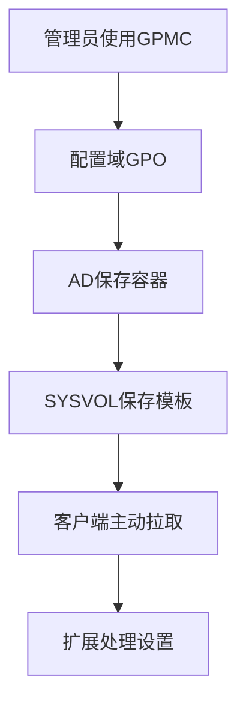
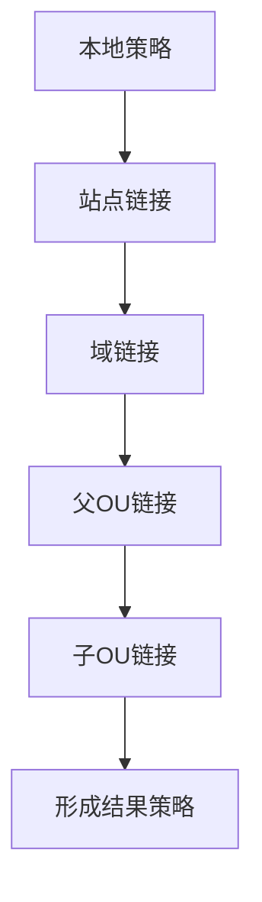

# 第7篇 Microsoft 365 E3 终端安装与管理 · 第6节 域组策略架构与生效机制

> **本节小节：** 7.54 ～ 7.65。
> **导航：** [返回第7篇目录](README.md)｜上一节：[本地组策略](05-本地组策略.md)｜下一节：[域组策略推送安装](07-域组策略推送安装.md)

---

## 7.54 本节目标

日常所说的“**域策略**”，通常指由 Active Directory 域服务（AD DS）集中存储、链接和处理的**域组策略（域 GPO）**。它不是管理员在域控制器上修改一个开关后，服务器实时遥控所有电脑；客户端会在**计算机启动、用户登录、后台刷新或管理员手工触发**时，从域中发现适用 GPO，拉取内容并由本机客户端扩展处理。

完成本节后，应能：

- 说清 AD DS、DNS、域控制器、GPMC、GPO、AD 与 SYSVOL 各自的职责；
- 设计站点、域、OU 链接，按 LSDOU、链接顺序、继承、阻止继承和强制判断结果；
- 正确使用安全筛选的“读取”与“应用组策略”权限，谨慎使用 WMI 筛选；
- 区分计算机配置、用户配置、回环 Merge/Replace 和客户端扩展；
- 理解前台/后台处理、慢速链接、AD/SYSVOL 复制和 ADMX 中央存储；
- 用角色组、资源组和稳定 OU 设计控制范围，不把普通终端设置堆进默认策略。

本企业定位是：域 GPO 对域内 Windows 配置成熟、能力强，普通策略不要求每台电脑依赖云签入；但它主要面向已加入域的 Windows，远程设备依赖 VPN、DNS 和域控可达，应用部署报表及跨平台能力弱，并需要持续维护 AD、DNS、域控和 SYSVOL。它是**存量域机的过渡平台**，不是新设备的目标终局。



## 7.55 域 GPO 的组成与依赖

### 7.55.1 必须同时健康的组件

| 组件 | 主要职责 | 失败时的典型表现 | 新手检查点 |
|---|---|---|---|
| AD DS | 保存对象、OU、链接、版本及 GPO 容器 | 找不到对象、链接或版本不一致 | `dcdiag`、AD 复制、对象所在 OU |
| DNS | 让客户端定位域和域控服务 | 登录慢、找不到域控、策略刷新失败 | 客户端只使用获批准的 AD DNS |
| 域控制器 | 提供目录、认证、策略访问 | 某地点或某台域控相关设备失败 | 站点映射、服务状态、时间同步 |
| GPMC | 创建、编辑、链接、备份和查看结果 | 管理操作不可用或易误改 | 使用受控管理工作站和最小权限 |
| GPC | AD 中的 Group Policy Container | 链接、权限、版本信息异常 | 不用 ADSI Edit 直接修补 |
| GPT | SYSVOL 中的 Group Policy Template | 脚本、模板数据或文件不可读 | 检查 DFSR、SYSVOL 与文件权限 |
| 客户端扩展 | 在 Windows 本机处理对应策略类别 | GPO 命中但特定设置未执行 | 查对应扩展和组件日志 |

一个 GPO 有两部分：

1. **Group Policy Container（GPC）**位于 AD，保存 GPO 标识、版本、状态、权限等目录信息；
2. **Group Policy Template（GPT）**位于域控的 SYSVOL，保存 `Registry.pol`、脚本及扩展所需文件。

两部分必须通过复制在域控间趋于一致。不要只看到 GPMC 中存在 GPO 就认定内容完整，也不要直接进入 SYSVOL 手工修改文件。受支持的入口是 GPMC、相应策略编辑器和经过批准的自动化接口。

### 7.55.2 客户端不是被实时遥控

客户端通常先通过 DNS 定位域控，读取 AD 中的链接、筛选和版本，再按需从 SYSVOL 读取模板或脚本。后台刷新存在时间差；新链接、权限变更和脚本文件还可能等待 AD 与 SYSVOL 分别复制。因此“保存策略”不等于“所有设备立刻完成”。

首次实施应记录：客户端使用的域控、GPO GUID 与显示名、计算机/用户版本、最近刷新时间及复制状态。不要通过不断删除、重建 GPO 或计算机对象来掩盖基础设施故障。

## 7.56 链接范围：站点、域与 OU

GPO 对象与链接是两件事。创建 GPO 只产生策略对象；把它链接到站点、域或 OU，才定义候选范围。

| 链接位置 | 适合场景 | 设计提醒 |
|---|---|---|
| 站点 | 与 AD 站点、网络位置相关的少量设置 | 站点归属由子网映射决定，不等于办公地点名称 |
| 域 | 确实需要覆盖整个域的少量基线 | 范围大、风险高；不得因方便而堆所有设置 |
| OU | 按设备或用户管理边界分层 | 最常用；OU 应按管理需求而非公司通讯录复制 |

GPO 不能直接链接到普通安全组。安全组可参与安全筛选，但链接仍属于站点、域或 OU。计算机对象移动到新 OU 后，下一次处理才会按新位置计算；移动前必须评估新旧策略差异。

建议的终端 OU 示例：

```text
OU=Workstations,DC=contoso,DC=example
├─ OU=Pilot
├─ OU=Production
│  ├─ OU=Office
│  └─ OU=Remote
└─ OU=Exceptions
```

不要为了每个策略都新建一层 OU。OU 主要表达稳定的管理边界、委派边界和处理范围；动态的人员身份、应用许可或临时分批更适合使用组和筛选。

## 7.57 LSDOU 与同容器链接顺序

### 7.57.1 基本处理顺序

传统组策略按 **LSDOU** 处理：Local（本地）→ Site（站点）→ Domain（域）→ OU（从父 OU 到子 OU）。在相同设置发生冲突且没有更特殊规则时，**后处理的有效设置通常覆盖先处理的设置**。



LSDOU 不是“所有设置都简单最后写入”。安全设置、脚本、软件安装、文件夹重定向等由不同客户端扩展处理，可能具有累加、替换、同步前台或一次性行为。最终必须用结果策略与业务行为验证。

### 7.57.2 同一容器中的链接顺序

同一站点、域或 OU 上有多个 GPO 链接时，GPMC 显示的**链接顺序 1 优先级最高，最后处理**。不要把“列表第一项”误解为最先处理。实施时应：

1. 给 GPO 使用可读名称并写明目的；
2. 减少同一容器中控制同一设置的 GPO 数；
3. 在变更记录中保存调整前后的链接顺序；
4. 用 `gpresult /h` 验证最终来源，而不是只看链接列表。

## 7.58 继承、阻止继承与强制

OU 默认继承上级站点、域和父 OU 的适用链接。三个概念必须分开：

| 控制项 | 设置位置 | 效果 | 使用边界 |
|---|---|---|---|
| 继承 | 默认机制 | 下级容器接收上级适用 GPO | 优先保持默认，便于理解 |
| 阻止继承 | 域或 OU | 阻止未强制的上级链接向下继承 | 会同时挡住多项上级策略，需评估基线缺口 |
| 强制 | 某个 GPO 链接 | 该链接不被下级阻止，且其冲突设置保持优先 | 只用于极少数不可覆盖要求，不作日常修补 |

“强制”作用于**链接**，不是给 GPO 对象贴一个全局标签。同一 GPO 的某个链接可强制，其他链接可不强制。若上级强制链接与下级设置冲突，强制链接保持优先。

高风险变更流程：

- **准备：** 导出继承关系、备份相关 GPO、列出受影响 OU/设备、确认紧急访问和维护窗口；
- **验证：** 在试点 OU 复现继承路径，采集 `gpresult`，验证重启和登录后的业务；
- **回退：** 恢复原链接状态和顺序，刷新试点并确认结果，再处理生产范围。

不要用“阻止继承 + 大量强制”搭建常态架构；这种设计会让新手无法预测结果。优先消除冲突、拆清所有权和范围。

## 7.59 安全筛选与委派权限

### 7.59.1 生效需要读取和应用

安全筛选本质上依赖 GPO 权限。目标计算机或用户要应用 GPO，通常必须同时具有：

- **读取（Read）**；
- **应用组策略（Apply Group Policy）**。

只授予“应用组策略”而没有读取不会成功；显式拒绝还可能覆盖允许。计算机配置应检查**计算机账户**或其安全组，不要只把登录用户加入组。组成员关系令牌可能需要计算机重启或用户重新登录后更新。

推荐步骤：

1. 新建用途明确的全局安全组，如 `GG-GPO-M365-Pilot-Computers`；
2. 把试点计算机账户加入组；
3. 在 GPO 委派/高级权限中确认目标具有读取和应用权限；
4. 若移除 `Authenticated Users` 的应用权限，仍要保证策略处理所需对象具有读取权限；
5. 重启试点机更新计算机令牌，运行结果策略验证；
6. 扩大前导出权限清单并由第二名管理员复核。

不要对 `Domain Computers`、`Authenticated Users` 使用“拒绝应用”来做普通排除；拒绝难以排查。优先用允许列表、独立 OU 或明确的例外 GPO。

### 7.59.2 范围与管理委派不同

“谁能应用 GPO”和“谁能编辑、删除或链接 GPO”是两套权限。GPMC 委派应遵循最小权限：策略作者可编辑批准范围，链接管理员只管理指定 OU，备份和恢复由受控角色完成。不要让普通桌面支持组拥有整个域的 GPO 删除或链接权限。

## 7.60 WMI 筛选：用途与性能风险

WMI 筛选会在客户端计算条件，只有结果为真时才应用关联 GPO。适合无法用 OU、组或原生项目级目标定位表达的少量稳定条件，例如特定 Windows 产品类型或版本范围。

示意查询仅用于说明，实施前需在目标 Windows 版本测试：

```sql
SELECT * FROM Win32_OperatingSystem
WHERE ProductType = 1
```

风险与规则：

- WMI 查询会增加策略处理时间，查询复杂、命名空间故障或硬件性能差时更明显；
- 不要用宽泛查询扫描大型类，也不要给大量 GPO 各挂一个重复筛选器；
- 版本字符串比较可能产生意外排序，不能未经测试直接用于生产；
- WMI 筛选器只能决定整个 GPO 是否命中，不能替代良好的 OU 和安全组设计；
- 必须记录查询目的、预期样本、执行时间、失败行为和移除条件。

优先顺序建议是：**OU/链接范围 → 安全筛选 → 组策略首选项的项目级目标定位 → 最后才考虑 WMI 筛选**。若登录或启动明显变慢，先在试点移除 WMI 关联并比较 GroupPolicy/Operational 中的处理耗时。

## 7.61 计算机配置与用户配置

| 分支 | 作用对象 | 常见处理时机 | 典型内容 |
|---|---|---|---|
| 计算机配置 | 计算机账户及设备 | 启动、后台、手工刷新 | 设备基线、启动脚本、系统级 Office 设置 |
| 用户配置 | 用户账户及会话 | 登录、后台、手工刷新 | 用户界面、用户侧 Office 设置、登录脚本 |

链接到“电脑 OU”的 GPO，其用户配置通常不会因为用户登录这台电脑就自动应用；用户侧默认按**用户对象所在位置**计算。反之，链接到“用户 OU”的计算机配置也不会作用于用户使用的电脑。

设计时先问：设置应随设备还是随用户？公共终端的统一界面应随设备场景控制，普通用户的个性化应随用户。一个 GPO 虽可同时包含两分支，但建议按责任拆分，并在不使用的一侧设置“禁用计算机配置”或“禁用用户配置”，减少处理和误解。

## 7.62 回环处理 Merge 与 Replace

回环处理用于“用户体验主要由所登录的电脑决定”的场景，例如培训室、前台、共享终端或受控跳板机。它在**计算机配置**中启用，并根据计算机所在位置重新处理用户配置。

| 模式 | 处理逻辑 | 适合场景 | 风险 |
|---|---|---|---|
| Merge | 先处理用户通常应得的用户策略，再处理计算机范围带来的用户策略；后者冲突时通常优先 | 保留个人策略，同时增加场所限制 | 来源增加，结果更复杂 |
| Replace | 忽略用户通常应得的用户策略，只处理计算机范围带来的用户策略 | 高度固定的共享终端 | 用户原有必要设置可能消失 |

实施步骤：

1. 只在专用计算机 OU 的 GPO 中启用回环；
2. 先用 Merge 试点，明确需要覆盖的用户设置；
3. 若必须 Replace，逐项确认登录、证书、代理、Office 和用户数据路径不受损；
4. 用普通用户和管理员分别登录测试；
5. 采集用户与计算机 `gpresult`，重启、换用户复测；
6. 回退时先恢复原回环模式，再刷新、注销并验证。

不要把回环处理链接到域根来解决单台共享电脑问题。

## 7.63 客户端扩展与处理时机

组策略客户端服务负责协调，具体类别由客户端扩展（Client-Side Extensions，CSE）处理。常见扩展包括管理模板注册表策略、安全设置、脚本、软件安装、文件夹重定向、驱动器映射和组策略首选项。

### 7.63.1 前台、后台和手工处理

- **前台处理：** 计算机启动和用户登录时执行；部分扩展要求同步前台处理、重启或再次登录；
- **后台刷新：** 客户端周期性重新计算和处理，存在随机偏移，不是实时推送；
- **手工触发：** `gpupdate` 可请求刷新，但不能保证把必须重启、登录或同步前台的所有行为立刻完成；
- **首次/特殊处理：** 软件安装、文件夹重定向等扩展可能只在特定前台阶段处理。

不要承诺一个固定分钟数内所有电脑完成。验收应按“已命中 GPO、扩展成功处理、目标状态正确、重启后保持”四层取证。

### 7.63.2 慢速链接

Windows 可根据连接速度判定慢速链接；不同扩展在慢速链接下可能跳过或采用不同处理方式。阈值和扩展行为会受策略及系统版本影响。远程办公场景不能只说“VPN 已连接”：还应确认登录/启动时 VPN 是否已建立、AD DNS 是否可用、域控与 SYSVOL 端口是否可达，以及连接是否被判为慢速。

如需调整慢速链接阈值或强制特定扩展在慢速链接处理，必须：

- 在受限带宽测试环境测量登录和下载影响；
- 明确大文件、脚本和安装源的流量上限；
- 设置停止条件和回退值；
- 不把策略刷新当作广域网大文件分发系统。

## 7.64 AD/SYSVOL 复制与 ADMX 中央存储

### 7.64.1 两条复制链必须分别检查

GPC 依赖 AD 复制，GPT/SYSVOL 通常依赖 DFS Replication（DFSR）。可能出现“链接已复制但模板未复制”或相反的短暂/故障状态。症状包括不同客户端使用不同域控时结果不同、版本不匹配、找不到脚本文件。

检查顺序：

1. 用 `echo %LOGONSERVER%` 或事件信息确认客户端使用的域控；
2. 用 `repadmin /replsummary`、`repadmin /showrepl` 检查 AD 复制；
3. 用 `dcdiag` 检查域控、DNS、广告和 SYSVOL 相关状态；
4. 检查 `SYSVOL`、`NETLOGON` 共享及 DFSR 事件；
5. 对比 GPO 在 AD 与 SYSVOL 的版本，不直接手工改版本号；
6. 修复基础复制后再刷新试点，不反复删除 GPO。

具体命令及排障流程见第8节。

### 7.64.2 ADMX 中央存储

中央存储通常位于：

```text
\\contoso.example\SYSVOL\contoso.example\Policies\PolicyDefinitions
```

存在中央存储后，组策略编辑器优先使用其中 ADMX/ADML，而不是管理工作站本地模板。Office 管理模板应把 `.admx` 放入 `PolicyDefinitions`，把对应语言 `.adml` 放入如 `zh-CN`、`en-US` 子目录。

更新模板的安全流程：

- **准备：** 备份当前中央存储，记录模板来源、版本、哈希、语言和兼容范围，在隔离目录比对；
- **验证：** 从受控管理工作站打开测试 GPO，确认无缺失资源或重复定义，并在试点 Office 版本验证设置；
- **回退：** 恢复整套匹配版本的 ADMX/ADML，重新打开编辑器并检查既有策略显示和客户端结果。

不要只复制 ADMX 而遗漏 ADML；不要把不同版本零散覆盖后不留清单。模板定义设置界面，不会仅因复制模板就改变客户端。

## 7.65 设计准则、实施检查与验收

### 7.65.1 组与 OU 设计

采用“稳定 OU + 用途组”的组合：

- OU 表达设备/用户管理边界、委派边界和少量稳定阶段，如 Pilot、Production、Exceptions；
- 安全组表达试点、应用授权或例外，名称包含范围和对象类型；
- 计算机策略组只加入计算机账户，用户策略组只加入用户账户；
- 嵌套组必须有所有者、用途、复核周期和到期条件；
- 每项设置在域 GPO、Intune、Office 云策略等来源中只能有一个配置所有者。

不要在 **Default Domain Policy** 中堆普通终端设置；它应保持精简，通常只承载确实需要域级处理的账户策略等基础内容。不要在 **Default Domain Controllers Policy** 中堆普通终端设置；它面向域控制器，误改可能影响核心身份基础设施。普通工作站策略应创建独立命名 GPO 并链接到受控 OU。

推荐名称示例：

```text
GPO-C-Workstations-M365-Baseline-v1
GPO-C-Workstations-M365-Pilot-v1
GPO-U-SharedPC-Office-Restrictions-v1
```

### 7.65.2 目标架构与过渡结论

微软不建议把新设备继续采用混合加入或混合 Autopilot 作为目标终局。本企业采用：

- **存量域机：** 在 AD/DNS/SYSVOL 健康前提下继续用域 GPO 过渡，逐项迁移配置所有权；
- **新设备：** Microsoft Entra Join + Windows Autopilot + Intune；
- **迁移规则：** 先在 Intune 试点并验证，再从域 GPO 撤销同一设置，保留回退期限；
- **遗留例外：** 必须记录业务依赖、负责人、风险、复核日和退役条件。

### 7.65.3 验收清单

- [ ] 7.54～7.65 编号连续，无重复、无越界。
- [ ] 已说明“域策略”通常指域组策略，且客户端是按触发时机主动拉取和处理。
- [ ] 已验证 AD DS、DNS、域控、GPMC、GPC、GPT/SYSVOL 和客户端扩展职责。
- [ ] 站点、域、OU、LSDOU、同容器链接顺序、继承、阻止继承和强制均有试点证据。
- [ ] 安全筛选同时核对读取与应用权限，WMI 筛选已有性能测试。
- [ ] 计算机/用户配置及回环 Merge/Replace 的作用对象明确。
- [ ] 前台、后台、慢速链接和复制延迟未被描述成实时推送。
- [ ] ADMX 中央存储已备份、验证并具备回退版本。
- [ ] 未在两个默认策略中堆普通终端设置。
- [ ] 存量域机与新机的过渡终局、配置所有权和退役条件已获批准。

> **下一节：** [域组策略推送安装](07-域组策略推送安装.md)，在上述范围和处理机制上实施 MSI 与 M365 Apps Click-to-Run 的受控部署。
