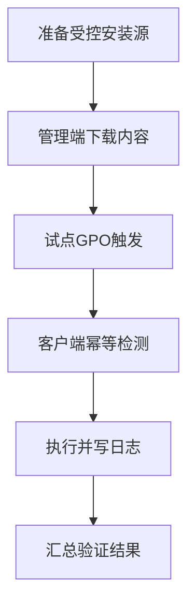
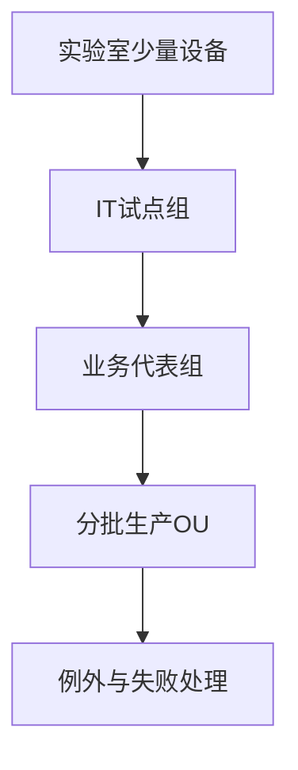

# 第7篇 Microsoft 365 E3 终端安装与管理 · 第7节 域组策略推送安装

> **本节小节：** 7.66 ～ 7.78。
> **导航：** [返回第7篇目录](README.md)｜上一节：[域组策略架构与生效机制](06-域组策略架构与生效机制.md)｜下一节：[域组策略长期管理与排查](08-域组策略长期管理与排查.md)

---

## 7.66 本节目标

本节把域 GPO 的范围控制用于应用安装，但先划清边界：GPO 的原生“**软件安装**”扩展主要适合 Windows Installer 的 **MSI** 包，不能把任意 EXE 声称为原生支持，也不能把 Microsoft 365 Apps 的 Click-to-Run（C2R）安装包伪装成 MSI。

Microsoft 365 Apps 应使用 Microsoft Office Deployment Tool（ODT）的 `setup.exe /download` 和 `setup.exe /configure`，再由**计算机启动脚本**或**组策略首选项计划任务**以受控方式启动。域 GPO 提供范围和触发机制，不会自动提供现代应用平台那样的检测规则、重试编排和集中成功率报表。

完成本节后，应能：

- 建立只读 UNC 安装源并正确配置共享和 NTFS 权限；
- 在管理端预下载离线源，在客户端以 SYSTEM 上下文幂等安装；
- 实现互斥锁、日志、退出码、超时、重启与失败重试边界；
- 用试点 OU/安全组分批，不使用映射盘或嵌入凭据；
- 为失败清单、卸载、版本升级和回退建立可审计闭环。



## 7.67 选择正确的安装机制

| 安装对象 | 推荐机制 | 不应声称的能力 | 主要限制 |
|---|---|---|---|
| 标准 MSI | GPO 软件安装，或受控脚本/任务 | 不代表所有 MSI 都能无参数可靠部署 | 通常需启动前台处理，报表有限 |
| EXE 安装包 | 厂商支持的静默命令配合脚本/任务 | GPO 软件安装不原生支持任意 EXE | 必须自建检测、日志、退出码处理 |
| M365 Apps C2R | ODT 配置 XML 配合脚本/任务 | 不是 MSI，不能用软件安装策略原生部署 | 需管理源、网络、检测、版本和日志 |
| 复杂企业应用 | 优先 Intune 或其他软件分发平台 | GPO 不等于完整应用生命周期平台 | 依赖、需求规则、状态汇总能力弱 |

选择流程：

1. 从软件供应商确认安装技术、企业静默参数、SYSTEM 支持和卸载方式；
2. 先在隔离测试机以同一上下文执行；
3. 定义检测规则、成功/需重启/失败退出码、最长时限和日志位置；
4. 只有标准 MSI 且行为简单稳定时，才优先评估 GPO 软件安装；
5. M365 Apps 固定走 ODT，不寻找所谓“Office MSI 转换包”。

> **目标架构：** 域 GPO 仅为本企业存量域机提供过渡安装能力。新设备采用 Microsoft Entra Join + Windows Autopilot + Intune。微软不建议把新设备继续采用混合加入或混合 Autopilot 作为目标终局。

## 7.68 原生 GPO“软件安装”的 MSI 边界

### 7.68.1 分配 MSI 的基本步骤

GPMC 路径通常为“计算机配置 → 策略 → 软件设置 → 软件安装”。对设备安装建议使用计算机分配，并引用 UNC 包路径：

```text
\\files.contoso.example\Packages$\<Vendor>\<Application>\<Version>\application.msi
```

实施步骤：

1. 确认 MSI 由供应商支持在 SYSTEM、无交互条件下安装；
2. 在受控共享中保存原始 MSI、哈希、版本、许可证明和静默行为说明；
3. 用 UNC 路径添加“已分配”包，不浏览或填写 `Z:` 等映射盘；
4. 仅链接到试点计算机 OU，并用计算机安全组进一步筛选；
5. 重启试点机，允许必要的同步前台策略处理；
6. 验证结果策略、应用事件、MSI 日志、产品版本及第二次重启行为；
7. 分批扩大，保留原包直到所有分配、升级和卸载关系解除。

不要在包已经分配后随意替换原路径上的 MSI 文件。相同路径内容变化会破坏审计和修复。新版本应使用新目录、新包和明确的升级/替换关系，并先备份 GPO。

### 7.68.2 原生扩展的限制

- 安装常发生在启动阶段，用户会感受到启动时间增加；
- 远程设备在开机时通常尚未建立用户 VPN，可能无法访问源；
- 复杂前置条件、依赖链、磁盘空间和版本检测难以表达；
- GPMC 不提供可信的全公司安装成功率报表；
- EXE、C2R 和需用户交互的安装不应硬塞入此机制；
- 删除软件安装项、选择“立即卸载”会造成大范围高风险动作，必须走变更和回退流程。

## 7.69 共享路径与权限设计

### 7.69.1 建议目录

```text
\\files.contoso.example\M365Apps$
├─ ODT\<ApprovedVersion>\setup.exe
├─ Config\Pilot-Install.xml
├─ Config\Production-Install.xml
├─ Config\Uninstall-M365Apps.xml
├─ Scripts\Invoke-M365AppsDeploy.ps1
└─ Source\MonthlyEnterprise\<ApprovedBuild>\
```

以上域名和路径均为虚构占位。脚本可由 SYSVOL 的 GPO 启动脚本位置引用，但体积较大的 Office 安装源不要放进 SYSVOL，以免放大域控复制压力。

### 7.69.2 共享与 NTFS 权限

计算机启动脚本在 Local System 下运行，访问网络时通常以 `CONTOSO\<计算机名>$` 机器账户认证。至少应保证 **Domain Computers 读取**：

| 权限层 | 主体 | 建议权限 | 说明 |
|---|---|---|---|
| 共享权限 | `CONTOSO\Domain Computers` | Read | 允许域计算机读取源 |
| NTFS 权限 | `CONTOSO\Domain Computers` | Read & Execute、List、Read | 两层权限缺一不可 |
| 共享与 NTFS | 部署管理员组 | 按职责 Modify | 仅批准人员更新内容 |
| 共享与 NTFS | 普通用户 | 默认不授写入 | 防止包或脚本被替换 |

还应：

- 用 SMB UNC，不用映射盘；SYSTEM 会话通常看不到用户的映射盘；
- 不在脚本、XML、计划任务或 GPO 中嵌入账号、密码、访问令牌；
- 为 `setup.exe`、XML、脚本和下载内容记录来源、版本与 SHA-256；
- 管理端使用签名脚本，写权限与审批角色分离；
- 客户端日志写本地受控目录，若集中上传则用单独的只写接收机制，不让计算机修改安装源。

### 7.69.3 上线前验证

使用一台加入域的试点机，在 SYSTEM 上下文测试读取。可用组织批准的运维工具创建 SYSTEM 测试进程；不要临时在共享上开放 Everyone 写权限。验证 `Test-Path`、文件哈希和读取速度，并在完成后关闭临时测试任务。

## 7.70 ODT 的 `/download` 与 `/configure`

ODT 的职责分为两个阶段：

- `setup.exe /download <XML>`：在**管理端/内容准备端**按 XML 下载 Office C2R 文件；
- `setup.exe /configure <XML>`：在**目标客户端**按 XML 安装、修改或删除产品。

不要让几百台客户端同时执行 `/download` 建共享源。应由内容管理员下载一次、验证后发布只读源，客户端仅执行 `/configure`。

### 7.70.1 离线源下载 XML

以下仅为虚构示例。产品、频道、体系结构和语言必须按本企业批准基线复核：

```xml
<Configuration>
  <Add OfficeClientEdition="64"
       Channel="MonthlyEnterprise"
       SourcePath="\\files.contoso.example\M365Apps$\Source\MonthlyEnterprise\&lt;ApprovedBuild&gt;"
       AllowCdnFallback="FALSE">
    <Product ID="O365ProPlusRetail">
      <Language ID="MatchOS" Fallback="en-us" />
      <ExcludeApp ID="Groove" />
    </Product>
  </Add>
</Configuration>
```

在批准的内容准备服务器执行：

```powershell
$OdtRoot = '\\files.contoso.example\M365Apps$\ODT\<ApprovedVersion>'
$Config  = '\\files.contoso.example\M365Apps$\Config\Download-MonthlyEnterprise.xml'

# 先确认文件存在；脚本中不保存任何凭据。
if (-not (Test-Path "$OdtRoot\setup.exe")) { throw '未找到已批准的 ODT setup.exe。' }
if (-not (Test-Path $Config)) { throw '未找到下载配置 XML。' }

$process = Start-Process -FilePath "$OdtRoot\setup.exe" `
    -ArgumentList @('/download', "`"$Config`"") `
    -Wait -PassThru
if ($process.ExitCode -ne 0) {
    throw "ODT 下载失败，退出码：$($process.ExitCode)"
}
```

完成后检查目录大小、文件时间、哈希/来源、ODT 日志和隔离机安装。不要仅以 `setup.exe` 退出码为唯一验收证据。

### 7.70.2 客户端安装 XML

```xml
<Configuration>
  <Add OfficeClientEdition="64"
       Channel="MonthlyEnterprise"
       SourcePath="\\files.contoso.example\M365Apps$\Source\MonthlyEnterprise\&lt;ApprovedBuild&gt;"
       AllowCdnFallback="FALSE">
    <Product ID="O365ProPlusRetail">
      <Language ID="MatchOS" Fallback="en-us" />
      <ExcludeApp ID="Groove" />
    </Product>
  </Add>
  <RemoveMSI />
  <Display Level="None" AcceptEULA="TRUE" />
  <Updates Enabled="TRUE" Channel="MonthlyEnterprise" />
  <Logging Level="Standard" Path="C:\ProgramData\Contoso\M365Deploy\OdtLogs" />
  <Property Name="FORCEAPPSHUTDOWN" Value="FALSE" />
</Configuration>
```

`RemoveMSI` 可能移除旧 MSI 版 Office 产品，属于高风险变更。使用前必须清点 Visio、Project、Access Database Engine、宏、插件和业务依赖，并在试点验证共存/迁移。`FORCEAPPSHUTDOWN=FALSE` 避免无提示强关应用，但也可能让安装等待；应在维护窗口和用户沟通中处理。

### 7.70.3 `AllowCdnFallback="FALSE"` 的边界

设置为 `FALSE` 表示指定本地源缺少文件或不可达时，不允许退回互联网 CDN。这有利于版本可控、节省外网带宽，但会让不完整源、远程不可达和权限错误直接导致失败。

只有在以下条件满足时使用：

- 本地源包含批准产品、语言、体系结构和版本的完整内容；
- 客户端在安装窗口可稳定访问 UNC；
- 有源完整性检查、容量监控和补齐流程；
- 远程设备另有 Intune/CDN 或预缓存方案。

如果业务批准 CDN 回退，应在单独 XML 中显式启用并评估代理、出口、内容版本和带宽；不能偷偷删除该属性改变部署边界。

## 7.71 计算机启动脚本与 SYSTEM 上下文

启动脚本位于计算机配置，通常以 Local System 运行，适合在用户登录前处理设备级安装。它的优势是机器权限稳定；限制是启动时网络可能未就绪、长安装会拖慢开机、远程用户 VPN 尚未连接。

实施前确认：

1. GPO 命中计算机账户，而不是仅命中用户；
2. 机器账户可读取 UNC 的共享和 NTFS 权限；
3. 脚本签名与执行策略符合组织安全基线；
4. 启动网络等待、脚本最大等待和重启策略经过测试；
5. 日志目录位于本地，不把可写日志混进只读安装源；
6. 安装包明确支持 SYSTEM 和无交互执行。

启动脚本不是无限等待的作业调度器。预计安装较长、网络常在登录后才可用或需要精细重试时，优先使用受控计划任务或 Intune。

## 7.72 幂等安装脚本示例

以下 PowerShell 示例只使用虚构 `contoso.example` 和占位版本。它展示**检测、互斥锁、日志、超时、退出码和完成标记**，不含凭据。上线前必须代码审查、签名并在隔离机验证。

```powershell
#requires -version 5.1
<#
用途：以计算机启动脚本或 SYSTEM 计划任务安装 M365 Apps。
边界：示例不负责集中报表；退出码分类需按当期 ODT 文档和企业基线确认。
安全：不嵌入凭据，不从可写临时目录执行，不修改系统执行策略。
#>

Set-StrictMode -Version Latest
$ErrorActionPreference = 'Stop'

# 每次发布新 XML/源时更新包标识，用于幂等判断。
$PackageId  = '<M365-ME-ApprovedBuild-001>'
$ShareRoot  = '\\files.contoso.example\M365Apps$'
$SetupPath  = Join-Path $ShareRoot 'ODT\<ApprovedVersion>\setup.exe'
$ConfigPath = Join-Path $ShareRoot 'Config\Production-Install.xml'
$WorkRoot   = 'C:\ProgramData\Contoso\M365Deploy'
$LogRoot    = Join-Path $WorkRoot 'ScriptLogs'
$MarkerPath = Join-Path $WorkRoot 'InstalledPackage.txt'
$TimeoutSec = 5400  # 示例为90分钟；生产值必须经试点测量。

New-Item -ItemType Directory -Path $LogRoot -Force | Out-Null
$LogPath = Join-Path $LogRoot ("Deploy-{0:yyyyMMdd-HHmmss}.log" -f (Get-Date))

function Write-DeployLog {
    param([Parameter(Mandatory)][string]$Message)
    $line = '{0:yyyy-MM-dd HH:mm:ss} [{1}] {2}' -f `
        (Get-Date), $env:COMPUTERNAME, $Message
    Add-Content -LiteralPath $LogPath -Value $line -Encoding UTF8
}

$mutex = $null
try {
    # 全局互斥锁防止启动脚本与计划任务同时执行。
    $createdNew = $false
    $mutex = New-Object System.Threading.Mutex($true, `
        'Global\Contoso.M365Apps.Deploy', [ref]$createdNew)
    if (-not $createdNew) {
        Write-DeployLog '已有部署进程持有锁，本次安全退出。'
        exit 1618
    }

    Write-DeployLog "开始处理包：$PackageId"

    # 确认当前确为 SYSTEM；若不是，拒绝以未知用户上下文安装。
    $identity = [Security.Principal.WindowsIdentity]::GetCurrent().Name
    if ($identity -ne 'NT AUTHORITY\SYSTEM') {
        Write-DeployLog "上下文不是 SYSTEM：$identity"
        exit 5
    }

    # 读取 Click-to-Run 配置，并结合本地完成标记做幂等检测。
    $c2rPath = 'HKLM:\SOFTWARE\Microsoft\Office\ClickToRun\Configuration'
    $productInstalled = $false
    if (Test-Path $c2rPath) {
        $ids = (Get-ItemProperty -Path $c2rPath `
            -Name 'ProductReleaseIds' -ErrorAction SilentlyContinue).ProductReleaseIds
        $productInstalled = ($ids -split ',' -contains 'O365ProPlusRetail')
    }
    $markerMatches = (Test-Path $MarkerPath) -and `
        ((Get-Content -LiteralPath $MarkerPath -Raw).Trim() -eq $PackageId)
    if ($productInstalled -and $markerMatches) {
        Write-DeployLog '产品和包标记均匹配，无需重复安装。'
        exit 0
    }

    foreach ($required in @($SetupPath, $ConfigPath)) {
        if (-not (Test-Path -LiteralPath $required -PathType Leaf)) {
            Write-DeployLog "必需文件不可读：$required"
            exit 2
        }
    }

    # 只从批准的 UNC 启动 ODT；XML 参数用引号保护。
    $process = Start-Process -FilePath $SetupPath `
        -ArgumentList @('/configure', "`"$ConfigPath`"") `
        -PassThru -WindowStyle Hidden
    Write-DeployLog "ODT 进程已启动，PID=$($process.Id)"

    if (-not $process.WaitForExit($TimeoutSec * 1000)) {
        Write-DeployLog "超过 $TimeoutSec 秒。停止当前 setup 进程并标记超时。"
        # 只停止本脚本启动的 setup.exe；不批量终止 Office 或 C2R 服务。
        Stop-Process -Id $process.Id -Force -ErrorAction SilentlyContinue
        exit 1460
    }

    $exitCode = $process.ExitCode
    Write-DeployLog "ODT 退出码：$exitCode"
    if ($exitCode -ne 0) {
        # 不把未知非零码误判成成功；由运维按批准映射分类。
        exit $exitCode
    }

    # 安装后再次检测，防止“进程成功但目标产品不存在”。
    $idsAfter = $null
    if (Test-Path $c2rPath) {
        $idsAfter = (Get-ItemProperty -Path $c2rPath `
            -Name 'ProductReleaseIds' -ErrorAction SilentlyContinue).ProductReleaseIds
    }
    if (-not ($idsAfter -split ',' -contains 'O365ProPlusRetail')) {
        Write-DeployLog 'ODT 返回成功，但未检测到目标产品。'
        exit 1603
    }

    Set-Content -LiteralPath $MarkerPath -Value $PackageId -Encoding ASCII
    Write-DeployLog '安装、检测与完成标记均成功。'
    exit 0
}
catch {
    Write-DeployLog ("未处理异常：{0}" -f $_.Exception.Message)
    exit 1
}
finally {
    if ($null -ne $mutex) {
        try { $mutex.ReleaseMutex() } catch { }
        $mutex.Dispose()
    }
}
```

注意：示例中的 `1618`、`1460`、`1603` 作为本脚本的分类输出，便于排障，不表示 ODT 官方只会返回这些码。生产环境必须保存 ODT 原始退出码和日志，并按当前官方文档建立映射。

若必须由批处理包装 PowerShell，使用签名脚本及批准执行策略，不要用下载后直接 `Bypass`：

```bat
@echo off
set "SCRIPT=\\files.contoso.example\M365Apps$\Scripts\Invoke-M365AppsDeploy.ps1"
%SystemRoot%\System32\WindowsPowerShell\v1.0\powershell.exe -NoProfile -NonInteractive -ExecutionPolicy AllSigned -File "%SCRIPT%"
exit /b %ERRORLEVEL%
```

## 7.73 日志、退出码、超时与重启

### 7.73.1 四层证据

| 层次 | 证据 | 成功判定 |
|---|---|---|
| 策略层 | `gpresult /h`、GroupPolicy/Operational | 目标计算机命中正确 GPO，脚本/任务已处理 |
| 执行层 | 本地脚本日志、任务历史、退出码 | 执行时间、包标识、原始退出码完整 |
| ODT/C2R 层 | ODT 日志、Click-to-Run 状态 | 安装流程无未处理错误 |
| 业务层 | 产品、版本、频道、启动和激活测试 | 目标应用可用，重启后仍符合基线 |

不要只检查“程序和功能”中的名称，也不要只见退出码 0 就宣告全部成功。

### 7.73.2 超时和重试

- 超时必须基于最慢试点测量并留余量，不能无限等待；
- 超时后只停止本任务启动且可确认的进程，不用 `taskkill /F /IM setup.exe` 误杀其他安装；
- 下次启动/任务可依幂等检测重试；连续失败超过阈值后停止自动重试并创建工单；
- 锁必须覆盖整次安装，异常退出后由操作系统释放命名互斥体；
- 日志应轮转并限制 ACL，避免占满系统盘或泄露设备/用户信息。

### 7.73.3 重启策略

不要让脚本未经批准直接强制重启办公电脑。把“安装成功但需重启”作为独立状态：提前通知用户、安排维护窗口、保存工作，并通过组织批准机制重启。重启后重新验证版本、应用启动、插件和策略。

## 7.74 组策略首选项计划任务

计划任务适合以下情况：

- 安装耗时，不希望阻塞每次启动；
- 需要启动后延迟、周期重试或在网络可用后执行；
- 远程设备可能在用户登录并连接 VPN 后才访问域资源；
- 希望通过任务结果和本地日志获得比启动脚本更清晰的单机证据。

推荐配置：

| 项目 | 建议值 | 原因 |
|---|---|---|
| 账户 | `SYSTEM` | 使用机器权限，避免保存用户凭据 |
| 权限 | 使用最高权限 | 安装设备级应用需要提升权限 |
| 触发器 | 启动后延迟，或批准的周期触发 | 避开启动峰值并支持有限重试 |
| 条件 | 网络可用；便携机按业务决定电源条件 | 降低不可达和中断 |
| 多实例 | 不启动新实例 | 与脚本互斥锁双重防重入 |
| 操作 | 调用已签名 PowerShell 脚本 | 统一检测、日志和退出码 |
| 结束条件 | 采用经试点的最长时限 | 防止任务永久运行 |

组策略首选项任务本身也要先通过 GPO 刷新到设备；未连域/VPN 的电脑不会凭空得到新任务。创建或更新任务后，检查 Task Scheduler Operational 日志和本地脚本日志。

不建议把域管理员账号及密码保存进任务。若 SYSTEM 无权访问某资源，应修正机器账户读取权限或改用更合适的平台，而不是嵌入高权限凭据。

## 7.75 分批 OU、安全组与推广闸门

建议分四批：



范围控制可组合：

- 链接到 `OU=Pilot`，安全筛选为 `GG-GPO-M365-Pilot-Computers`；
- 计算机账户加入组后重启，以更新机器令牌；
- 每批设置开始时间、最大设备数、观察期、成功标准和停止条件；
- 不通过在生产 OU 中频繁移动对象来代替清晰的分组台账；
- 分批完成后，把临时组成员和过期筛选清理并留审计记录。

每批推广闸门：

1. 安装源、权限、容量和哈希验证通过；
2. 关键业务插件、宏、Visio/Project、打印和文件关联通过；
3. 成功设备具有四层证据，失败设备有明确原因；
4. 不可恢复失败率超过批准阈值即暂停；
5. 回退演练已在同批次代表设备成功；
6. 负责人批准后才进入下一批。

## 7.76 失败报表的真实边界与补充闭环

**不存在可在 GPMC 中直接查看的“GPO 集中安装成功率报表”。** GPO 能显示链接、设置、建模或结果信息，但不能替代应用分发平台按设备汇总安装状态。

要形成闭环，至少补充：

| 补充方式 | 可提供信息 | 注意事项 |
|---|---|---|
| 本地结构化日志 | 包标识、时间、退出码、检测结果 | 需安全收集、轮转和防篡改 |
| Windows 事件收集 | 脚本/任务自定义事件及系统事件 | 需设计订阅、容量和访问控制 |
| 运维脚本盘点 | 远程查询产品、版本和日志 | 仅对在线可达设备有效，须最小权限 |
| Intune | 受管设备应用状态和检测 | 应迁移应用所有权，避免双平台重复安装 |
| 其他软件分发平台 | 应用需求、重试、状态与报表 | 明确与 GPO 的边界和唯一所有者 |

集中日志记录中使用设备标识，不收集无关用户数据；失败列表应包含最后在线时间，区分“未收到策略、未执行、执行失败、安装成功未上报、设备长期离线”。分母必须定义为本批应部署设备，不把长期退役资产算作失败，也不能把无日志设备算作成功。

## 7.77 卸载、版本升级与回退

### 7.77.1 卸载 M365 Apps

ODT 删除 XML 示例：

```xml
<Configuration>
  <Remove>
    <Product ID="O365ProPlusRetail" />
  </Remove>
  <Display Level="None" AcceptEULA="TRUE" />
  <Logging Level="Standard" Path="C:\ProgramData\Contoso\M365Deploy\OdtLogs" />
  <Property Name="FORCEAPPSHUTDOWN" Value="FALSE" />
</Configuration>
```

卸载会影响用户办公，不能仅因从 GPO 删除安装任务就假定软件会自动卸载。应创建独立、限范围、限时的卸载脚本/任务，并经过：

- **准备：** 备份用户数据，确认 OneDrive/本地文件状态，盘点 Visio、Project、语言包、插件和业务依赖，通知用户；
- **验证：** 在试点确认目标产品被正确移除、未误删需保留产品，检查日志和重启后状态；
- **回退：** 保留已验证的重装 XML、安装源、许可和恢复步骤，必要时恢复批准版本。

### 7.77.2 升级和频道变更

版本升级不是替换共享目录中的文件：

1. 建立新 `<ApprovedBuild>` 目录并下载完整内容；
2. 更新新 XML 和 `$PackageId`，保留旧源只读；
3. 验证插件、宏、业务系统和更新频道；
4. 仅对试点组发布；
5. 观察通过后分批扩大；
6. 达到保留期且无回退需求后，审批清理旧源。

若 Office 已由更新策略管理，不应同时周期性用安装 XML强制不同版本。明确“安装基线”和“持续更新”各自的所有者。

### 7.77.3 版本回退

回退到旧版本必须确保该构建仍获组织批准且安装源/CDN可用，并评估安全修复缺失。流程为：暂停新批次 → 保存失败证据 → 恢复旧 XML/目标版本和旧包标识 → 在少量受影响设备验证 → 批量回退 → 修复原因。不要长期固定到不受支持或有已知漏洞的版本。

对原生 MSI 包，回退可能是卸载新包并重新分配旧包；必须依据供应商支持的升级代码和卸载参数，不能假设所有 MSI 都可无损降级。

## 7.78 实施清单与验收

### 7.78.1 上线检查

- [ ] 已确认 MSI、EXE 和 C2R 类型，未声称 GPO 软件安装原生支持 EXE/C2R。
- [ ] UNC 共享与 NTFS 均给目标 `Domain Computers` 读取/执行，写权限最小化。
- [ ] 脚本和 XML 不含凭据，不使用映射盘，不从普通用户可写路径执行。
- [ ] `/download` 只由内容准备端执行，客户端使用 `/configure`。
- [ ] 离线源完整；`AllowCdnFallback="FALSE"` 的远程与缺文件风险已验证。
- [ ] 启动脚本以 SYSTEM 执行，幂等检测、互斥锁、日志、退出码、超时均有效。
- [ ] 重启、应用关闭、超时和连续失败有明确处理，不强制打断用户。
- [ ] 计划任务使用 SYSTEM 且不保存高权限密码，多实例设置正确。
- [ ] 试点 OU/安全组、分批闸门、暂停阈值和回退演练已批准。
- [ ] 未伪造 GPO 成功率；已用日志、事件收集、Intune 或其他平台补足。
- [ ] 卸载、升级、频道变更、旧源保留和版本回退均已测试。

### 7.78.2 最终验收记录

每台抽样设备至少记录：计算机占位标识、批次、GPO 名称、源路径版本、XML/脚本哈希、开始/结束时间、退出码、检测结果、Office 产品/版本/频道、重启结果、业务测试和工单号。生产汇总必须列出失败与未上报设备，不能只报告成功样本。

域 GPO 的优点是域内 Windows 配置成熟、无需每个普通策略依赖云签入；缺点是远程设备依赖 VPN/域控，应用部署报表弱，跨平台弱，还要维护 AD、DNS、域控和 SYSVOL。因此，本节方案只服务存量域机过渡；新机继续采用 Entra Join + Autopilot + Intune。

> **下一节：** [域组策略长期管理与排查](08-域组策略长期管理与排查.md)，建立配置所有权、变更治理、策略刷新、复制健康和故障定位流程。
