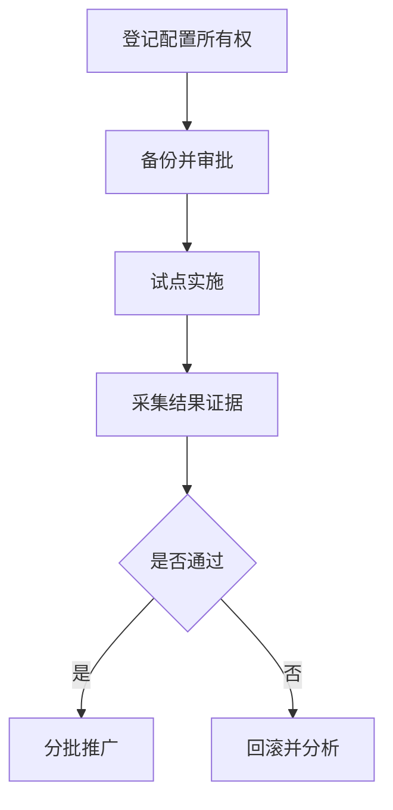
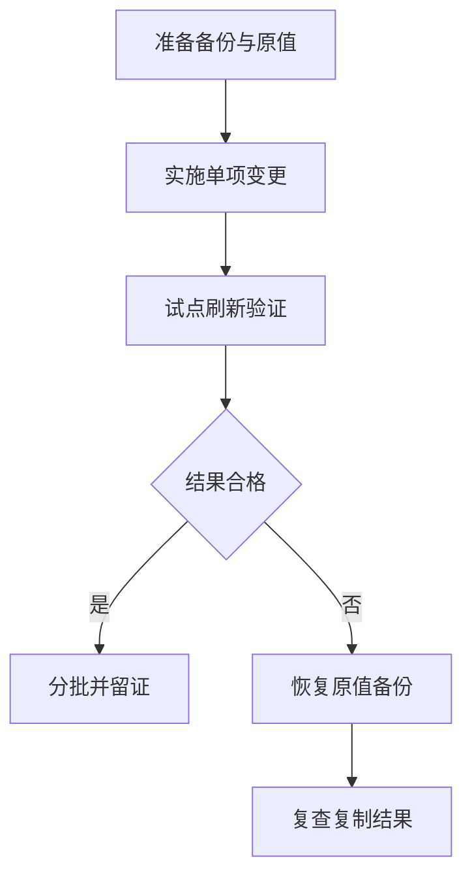
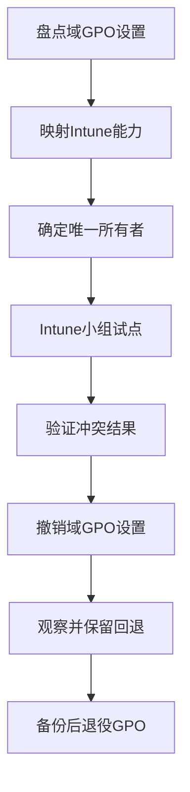

# 第7篇 Microsoft 365 E3 终端安装与管理 · 第8节 域组策略长期管理与排查

> **本节小节：** 7.79 ～ 7.90。
> **导航：** [返回第7篇目录](README.md)｜上一节：[域组策略推送安装](07-域组策略推送安装.md)｜下一节：[三种技术逐项对比](09-三种技术逐项对比.md)

---

## 7.79 本节目标

域 GPO 上线后仍依赖 AD DS、DNS、域控、GPMC、AD 中的 Group Policy Container（GPC）、SYSVOL 中的 Group Policy Template（GPT）/脚本和客户端扩展持续健康。客户端不是被服务器实时遥控，而是在启动、登录、后台刷新或手工触发时拉取并处理，所以长期管理必须同时治理**配置、范围、基础设施、客户端结果和退役迁移**。

完成本节后，应能：

- 为每个设置指定唯一配置所有者，维护 Office ADMX 中央存储；
- 执行 GPO 命名、备份、审批、试点、验证、回滚和定期复核；
- 正确理解后台刷新、`gpupdate`、远程办公与 VPN 的限制；
- 使用 `gpresult /h`、`rsop.msc`、GroupPolicy/Operational 和组件日志取证；
- 使用 `dcdiag`、`repadmin`、SYSVOL/DFSR、DNS、时间和网络检查定位根因；
- 按“存量域机过渡、新机 Entra Join + Autopilot + Intune”逐步退役域策略。



## 7.80 配置所有权与策略资产台账

同一设置若同时由域 GPO、Intune、Office 云策略、应用自身或脚本控制，会出现反复改写和难以解释的优先级。迁移期必须建立“**一项设置，一个配置所有者**”矩阵。

| 台账字段 | 示例占位 | 管理要求 |
|---|---|---|
| 设置/策略路径 | `<Office 设置路径>` | 写到可复核的完整路径 |
| 当前所有者 | `Domain GPO` | 只能有一个主写入来源 |
| GPO 名称/GUID | `<GPO-Name>` / `<GUID>` | 显示名和 GUID 同时记录 |
| 作用范围 | `<Pilot OU/Group>` | 记录链接、筛选、排除和回环 |
| 技术负责人 | `<Role-Owner>` | 使用角色占位，不在示例写真实 PII |
| 业务负责人 | `<Business-Role>` | 批准用户影响和停机窗口 |
| 验证方式 | `<gpresult + behavior>` | 至少含结果策略和业务行为 |
| 回退方法 | `<Backup-ID/Old value>` | 在变更前可执行且已演练 |
| 复核/退役日 | `<YYYY-MM-DD>` | 过渡策略不能无限延期 |

资产台账还应覆盖：GPO 状态、计算机/用户分支、链接顺序、是否强制、是否阻止继承、安全筛选、委派、WMI 筛选、脚本和外部共享依赖、中央存储模板版本、备份位置、最后变更号和失败设备清单。

每季度至少找出：未链接 GPO、全禁用 GPO、长期无负责人 GPO、重复设置、过期 WMI 筛选、指向不存在脚本/共享的项目和仍控制已退役 Office 版本的模板项。先分析和备份，不要见到“疑似无用”就直接删除。

## 7.81 Office ADMX 中央存储治理

Office 管理模板让 GPMC 显示并配置 Office 策略，但**复制 ADMX/ADML 本身不会让客户端设置生效**。中央存储通常位于：

```text
\\contoso.example\SYSVOL\contoso.example\Policies\PolicyDefinitions
```

### 7.81.1 版本和语言管理

| 对象 | 保存位置 | 版本要求 | 常见故障 |
|---|---|---|---|
| Office `.admx` | `PolicyDefinitions` 根目录 | 来自同一批准模板包 | 重复定义、缺少新设置 |
| 对应 `.adml` | `zh-CN`、`en-US` 等语言子目录 | 与 ADMX 版本匹配 | 编辑器提示找不到资源 |
| 模板清单 | 受控文档库 | 记录来源、日期、哈希、语言 | 无法判断谁覆盖了文件 |
| 备份副本 | 非 SYSVOL 的受控备份区 | 每次更新前生成 | SYSVOL 故障时无可用回退 |

更新流程：

1. 从批准来源取得 Office 管理模板，校验签名/哈希并记录版本；
2. 在隔离目录解包，比较新增、删除和同名文件；
3. 备份整个中央存储，而不是只复制将更新的几个文件；
4. 在维护窗口一次性部署匹配的 ADMX 与所需 ADML；
5. 从两台受控管理工作站打开测试 GPO，检查解析错误；
6. 在试点 Office 版本验证策略、注册表只读结果和业务行为；
7. 若失败，恢复整套备份并再次验证编辑器和客户端。

不要从不同管理员电脑零散复制模板，不要手工编辑供应商 ADMX，不要为消除界面报错直接删除未知模板。中央存储位于 SYSVOL，会依赖 DFSR 复制；大批模板变更也需要等待复制健康。

## 7.82 GPO 命名、备份与版本记录

### 7.82.1 命名和说明

推荐格式：

```text
GPO-<C或U>-<对象>-<用途>-<阶段>-v<主版本>
```

虚构示例：

```text
GPO-C-Workstations-M365-Baseline-Prod-v1
GPO-C-Workstations-M365-Install-Pilot-v2
GPO-U-SharedPC-Office-Restrictions-Prod-v1
```

名称中的 C/U 表示主要分支，不代表技术强制。GPO 注释/说明应写：目的、所有者角色、工单、作用范围、创建日期、依赖、验证和退役条件。不要把个人姓名、手机号或真实邮箱写进示例和名称。

### 7.82.2 备份和报告

在安装 GPMC PowerShell 模块的受控管理工作站，可按变更号创建目录并备份：

```powershell
$Domain     = 'contoso.example'
$GpoName    = 'GPO-C-Workstations-M365-Baseline-Prod-v1'
$ChangeId   = '<CHG-YYYY-NNNN>'
$BackupRoot = "D:\GPO-Backup\$ChangeId"

New-Item -ItemType Directory -Path $BackupRoot -Force | Out-Null
Backup-GPO -Name $GpoName -Domain $Domain -Path $BackupRoot `
    -Comment "变更前备份 $ChangeId"
Get-GPOReport -Name $GpoName -Domain $Domain -ReportType Html `
    -Path (Join-Path $BackupRoot 'GPO-Before.html')
```

备份完成后检查备份元数据、文件数量、ACL、离线副本和恢复演练。GPO 备份不能替代完整环境记录：**链接位置与顺序、阻止继承、站点/域/OU 状态、WMI 筛选器对象、外部脚本/安装源和部分外围委派关系**仍应单独导出或截图/报告记录。

备份仓库应只允许备份服务和获批管理员写入，设置保留期并定期做恢复测试。不要把唯一备份放在同一个 SYSVOL 或同一故障域中。

## 7.83 标准变更、验证与回滚

### 7.83.1 变更七步法

| 阶段 | 必做操作 | 通过条件 | 失败处理 |
|---|---|---|---|
| 1. 申请 | 写明设置、范围、风险、窗口和所有者 | 技术与业务批准 | 信息不足则退回 |
| 2. 准备 | 备份 GPO、链接/权限、脚本和原值 | 备份可读且能定位 | 不实施 |
| 3. 测试 | 在隔离 OU/测试 GPO 单项变更 | 无解析和基础错误 | 修正文档或方案 |
| 4. 试点 | 小组/OU 分批命中 | 结果策略与业务通过 | 停止扩大并回滚 |
| 5. 推广 | 按批次和观察期扩大 | 每批达到批准标准 | 冻结后续批次 |
| 6. 复核 | 重启、登录、后台、远程场景复测 | 持续生效且无冲突 | 分析时机和来源 |
| 7. 结案 | 更新台账、证据、例外和退役日 | 第二人可复现 | 工单保持打开 |

高风险项包括账户/登录、Kerberos、DNS、网络、防火墙、证书、BitLocker、Windows Update、Office 更新频道、宏、脚本、计划任务、软件卸载、阻止继承和强制链接。必须准备紧急管理访问、维护窗口、业务通知和已演练回退。

### 7.83.2 回滚方法

若只是单个设置变更，优先按记录恢复原值/未配置状态；若 GPO 多项受损，才考虑从已验证备份恢复。示意命令：

```powershell
$Domain     = 'contoso.example'
$BackupRoot = 'D:\GPO-Backup\<CHG-YYYY-NNNN>'
$BackupId   = '<Backup-GUID>'

# 高风险：仅在确认目标 GPO、备份 ID、域和影响范围后执行。
Restore-GPO -BackupId $BackupId -Path $BackupRoot -Domain $Domain
```

恢复后还要恢复/确认链接顺序、筛选、WMI、外部脚本与共享版本，然后等待 AD/SYSVOL 复制并在试点客户端刷新验证。不得用新建同名 GPO、复制 GUID 目录或直接改 SYSVOL/AD 属性作为快捷回退。



## 7.84 策略刷新与远程办公边界

### 7.84.1 何时刷新

计算机策略可在启动和后台刷新处理，用户策略可在登录和后台刷新处理；后台周期含随机偏移，并非管理员保存后实时推送。部分客户端扩展要求前台同步处理、注销或重启。

`gpupdate` 是让**当前客户端**请求重新处理，不是服务器向所有电脑下命令：

```bat
gpupdate /target:computer /force
gpupdate /target:user /force
gpupdate /force
```

`/force` 会重新应用所有策略，排障时不应无意义连续运行。若命令提示注销或重启，先保存用户工作并按维护窗口执行；不要为了“快”而在办公时段使用自动重启参数。

验证刷新时记录开始/结束时间、作用域、退出信息、使用域控、事件活动 ID、是否要求前台处理和重启/登录后结果。后台刷新成功也不等于软件安装或脚本业务结果成功。

### 7.84.2 远程办公与 VPN

远程域设备需要至少满足：

- 使用能解析 `contoso.example` AD 记录的企业 DNS，而不是仅公共 DNS；
- VPN 路由和防火墙允许访问域控、SYSVOL、认证及所需安装源；
- 设备时间与域时间体系同步；
- VPN 建立时机满足策略阶段：用户登录后 VPN 无法帮助开机前的计算机启动处理；
- 带宽和慢速链接行为经过验证，大型 Office 源不在窄带下反复下载。

对于长期不回内网、只有登录后 VPN 或跨平台设备，域 GPO 可达性和报表都不足。应把应用与配置迁到 Intune；不能把“偶尔 `gpupdate` 成功”视为可持续管理方案。

## 7.85 结果策略工具：`gpresult` 与 `rsop.msc`

### 7.85.1 `gpresult` 是首要客户端证据

使用提升权限终端创建本地证据目录：

```bat
mkdir C:\ProgramData\Contoso\GpoEvidence 2>nul
gpresult /h C:\ProgramData\Contoso\GpoEvidence\gpresult.html /f
gpresult /scope computer /v
gpresult /scope user /v
```

重点查看：

- 计算机和用户分别位于哪个 OU；
- 应用与拒绝的 GPO，以及拒绝原因；
- 安全组、WMI 筛选、回环模式和慢速链接信息；
- 最后应用时间、使用的域控和客户端扩展结果；
- 最终设置来自哪个 GPO，而非只看 GPO 是否在列表中。

HTML 可能包含设备名、用户名、组成员关系和安全配置，应存入受控工单或证据库，按内部数据保留政策清理。本文示例不放真实 PII。

### 7.85.2 `rsop.msc` 的作用和边界

运行 `rsop.msc` 可图形化查看 Resultant Set of Policy，适合理解传统管理模板和安全设置结果。但它不能完整表示所有组策略首选项、脚本业务结果、现代 MDM 策略和每个客户端扩展状态。

正确做法是：`gpresult` 判断范围和来源，`rsop.msc` 辅助阅读，再用事件日志、组件日志和实际业务状态验证。不要只因 `rsop.msc` 未显示某项就删除 GPO 或重建计算机对象。

## 7.86 事件日志与 GPSvc 高级诊断边界

### 7.86.1 GroupPolicy/Operational

主要路径：

```text
事件查看器
└─ 应用程序和服务日志
   └─ Microsoft
      └─ Windows
         └─ GroupPolicy
            └─ Operational
```

按故障发生时间和活动 ID 串联事件，区分计算机/用户处理、域控发现、下载、筛选、扩展开始/结束、耗时和错误码。还应检查对应组件：

| 故障类型 | 补充日志 | 关注内容 |
|---|---|---|
| 启动/登录脚本 | 脚本自有日志、PowerShell Operational | 上下文、路径、退出码、签名 |
| 计划任务 | TaskScheduler/Operational | 触发、账户、返回码、超时 |
| MSI | Application/MsiInstaller、MSI 详细日志 | 产品码、事务、返回码 |
| M365 Apps | ODT/C2R 日志 | XML、源、产品、版本、退出码 |
| 复制 | DFS Replication、Directory Service | SYSVOL 与 AD 复制异常 |
| DNS/认证 | DNS Client、System、安全日志 | 域控定位、时间、凭据和通道 |

事件“策略处理完成”不代表脚本内的应用安装一定成功；必须串联组件日志。

### 7.86.2 GPSvc 日志只作高级手段

GPSvc 调试日志可能产生大量内容、包含环境细节并影响磁盘和性能，不是第一线常规步骤。只有在 `gpresult`、Operational 日志、网络/复制检查仍无法定位，并经高级支持人员批准后，才依据**当前受支持文档或 Microsoft 支持指导**临时启用。

启用前记录原配置、磁盘空间、采集窗口和数据访问权限；复现一次后立即停用并恢复原配置，安全保存日志。不要长期在全公司启用，也不要照搬旧版本注册表方法到新系统。

## 7.87 AD、DNS、SYSVOL 与 DFSR 健康检查

基础设施排障应由具备域控权限和变更授权的管理员在维护窗口执行。以下命令主要是只读诊断，但输出可能包含内部拓扑，应保存到受控路径。

### 7.87.1 域控与 AD 复制

```bat
mkdir C:\Temp\GpoHealth 2>nul
dcdiag /e /c /v /f:C:\Temp\GpoHealth\dcdiag.txt
repadmin /replsummary > C:\Temp\GpoHealth\replsummary.txt
repadmin /showrepl * /csv > C:\Temp\GpoHealth\showrepl.csv
```

重点看：域控是否正常广告、DNS 测试、复制失败数量/持续时间、失败伙伴和命名上下文。不要只看到某次瞬时错误就运行破坏性修复；先关联网络、DNS、时间和事件。

### 7.87.2 SYSVOL 与 DFSR

在每台域控检查共享：

```bat
net share
dcdiag /test:advertising /test:sysvolcheck
```

并查看 DFS Replication 事件日志、SYSVOL/NETLOGON 共享、`Policies\{GPO-GUID}` 是否存在以及 GPC/GPT 版本是否一致。若组织批准且已安装 DFSR 管理工具，可用只读诊断查看复制状态；命令和参数应按当前服务器版本文档复核。

**严禁**为追求“版本一致”而直接改 `gPCVersionNumber`、`GPT.INI`、GUID 目录或从健康域控手工覆盖 SYSVOL。DFSR 数据库恢复、权威/非权威同步和对象清理属于高风险目录恢复操作，必须先备份、确认拓扑、按当前官方恢复流程执行并验证所有域控。

### 7.87.3 客户端 DNS、域控、时间与网络

```bat
ipconfig /all
nltest /dsgetdc:contoso.example
w32tm /query /status
set LOGONSERVER
```

再验证 `\\contoso.example\SYSVOL` 和所需安装 UNC 是否可读。不要用 IP 地址代替域名访问 SYSVOL，也不要在域客户端混用无法解析 AD 记录的公共 DNS。

## 7.88 常见故障矩阵与排查顺序

| 症状 | 常见根因 | 首要证据 | 安全处理方向 |
|---|---|---|---|
| GPO 未列为适用 | 对象在错误 OU、链接禁用、范围错误 | `gpresult`、GPMC 链接 | 修正范围，勿删对象重建 |
| 显示安全筛选拒绝 | 缺读取/应用权限、组令牌未更新 | GPO ACL、组成员、结果原因 | 修正允许权限并重启/登录 |
| WMI 筛选为假/慢 | 查询条件不符、WMI 故障、查询昂贵 | `gpresult`、处理耗时 | 简化或移除筛选后试点 |
| 不同设备结果不同 | AD/SYSVOL 未复制、使用不同域控 | 域控名、版本、`repadmin` | 先修复制，再刷新客户端 |
| 找不到域或 SYSVOL | DNS、路由、VPN、SMB/防火墙异常 | `nltest`、DNS、UNC 测试 | 恢复企业 DNS 与网络路径 |
| 认证异常 | 时间偏差、安全通道或域控问题 | `w32tm`、系统/安全事件 | 校正时间体系，按授权修复 |
| 脚本访问拒绝 | SYSTEM 使用机器账户，权限只给用户 | 脚本日志、共享/NTFS ACL | 给目标计算机组最小读取 |
| 脚本手工成功、GPO 失败 | 上下文、工作目录、映射盘、交互依赖 | SYSTEM 复测、退出码 | 改用 UNC 和无交互参数 |
| 设置短暂生效又变化 | Intune/其他 GPO/云策略重复控制 | 所有权矩阵、结果和 MDM 诊断 | 只保留一个配置所有者 |
| 启动/登录变慢 | WMI、同步前台、大脚本、慢速网络 | Operational 耗时、网络测量 | 分离大任务，优化范围/查询 |

推荐排查顺序：

1. 定义一个具体对象、一个设置和一个失败时间，不从“全域都坏了”猜测；
2. 核对计算机还是用户配置、对象 OU、回环及当前登录身份；
3. 用 `gpresult /h` 查应用/拒绝原因、来源和域控；
4. 查 GroupPolicy/Operational，再查对应脚本、任务、ODT/MSI 日志；
5. 查 GPO 链接、顺序、继承、强制、安全筛选的读取+应用权限和 WMI；
6. 查 DNS、时间、VPN、网络、SYSVOL/安装源和 SYSTEM 上下文；
7. 若结果依域控不同，查 `dcdiag`、`repadmin`、DFSR 和 GPC/GPT 版本；
8. 只改一个变量，在试点刷新并复测；
9. 形成根因、修复、验证和预防记录。

> **不要把反复删除对象当排障。** 删除/重建计算机对象、用户对象、GPO、GUID 目录或计划任务会丢失 ACL、组关系、历史和根因证据，还可能扩大复制问题。除非经分析确认对象必须重建，并已准备依赖清单、备份、验证和回退，否则不得使用。

## 7.89 日常巡检、容量与安全运营

### 7.89.1 巡检频率

| 频率 | 检查内容 | 证据/输出 | 触发动作 |
|---|---|---|---|
| 每日/告警 | 域控、DNS、AD/DFSR 复制关键错误 | 监控告警、事件、复制摘要 | 达阈值立即分派 |
| 每周 | GPO 变更、失败客户端、脚本/共享可用性 | 变更清单、失败队列、源检查 | 纠正未授权变更 |
| 每月 | 备份成功、恢复抽测、中央存储版本、权限 | 备份报告、ACL 导出、模板清单 | 修复备份/权限偏差 |
| 每季度 | 所有权、未链接/重复 GPO、WMI 性能、例外 | 资产台账、清理候选清单 | 审批合并或退役 |
| 每半年 | 灾难恢复演练、迁移进度、旧源/日志容量 | 演练报告、Intune 迁移看板 | 更新路线和预算 |

巡检不只看“服务运行”。应设置并验证：AD 与 DFSR 复制失败持续时间、SYSVOL 可用性、DNS 错误、GPO 备份失败、共享容量、客户端长期无刷新、脚本连续失败、日志磁盘占用和证书/签名到期。

### 7.89.2 安全和权限复核

- GPO 创建、编辑、链接、备份、恢复职责分离；
- Domain Admins 不作为日常编辑身份，使用最小权限管理角色；
- 脚本与安装源写权限严格限制，文件有签名/哈希和审批链；
- GPO 权限中的显式拒绝、未知 SID 和过度委派逐项调查；
- 日志、`gpresult` 和复制报告按敏感运维数据保护；
- Default Domain Policy 与 Default Domain Controllers Policy 保持精简，不堆普通终端设置；
- 每次高风险变更都有准备、验证、回退和紧急访问路径。

## 7.90 退役域 GPO、迁移到 Intune 与验收

域 GPO 的优势是技术成熟、域内 Windows 配置能力强，普通策略无需每台电脑依赖云签入；缺点是主要面向域 Windows、远程设备依赖 VPN/域控、应用部署报表弱、跨平台弱，并要承担 AD、DNS、域控和 SYSVOL 的维护成本。

微软不建议把新设备继续采用混合加入或混合 Autopilot 作为目标终局。本企业原则是：**存量域机用 GPO 过渡，新机使用 Microsoft Entra Join + Windows Autopilot + Intune**。

### 7.90.1 逐项迁移流程



1. 导出 GPO 报告，拆成可验证的单项设置、脚本、任务和应用；
2. 判断 Intune Settings Catalog、Administrative Templates、OMA-URI、应用或脚本是否有受支持等价能力；没有等价能力的保留为有期限例外，不强行迁移；
3. 建立迁移波次和所有权矩阵，禁止两个平台长期同时写同一设置；
4. 在 Entra/Intune 试点组配置并验证设备在线、离线、重启、登录和远程场景；
5. 先停止扩大域 GPO，再把对应设置恢复为“未配置”或移除目标范围；
6. 观察一个批准周期，确认 Intune 报告、设备实际状态和业务行为；
7. 若失败，按记录恢复原 GPO 链接/设置，并撤销冲突的 Intune 试点项；
8. 全部依赖解除后，备份 GPO、报告、链接、权限、脚本和审批证据；先取消链接并观察，再审批删除；
9. 更新 AD/DNS/SYSVOL 容量、委派和灾备范围，但不要因终端 GPO 减少就仓促下线仍被身份服务依赖的 AD。

### 7.90.2 最终验收

- [ ] 7.79～7.90 编号连续，无重复、无越界。
- [ ] 每项配置有唯一所有者、负责人角色、验证和退役日期。
- [ ] Office ADMX/ADML 中央存储版本匹配，已备份并做恢复测试。
- [ ] GPO 命名、注释、链接、筛选、WMI、外部依赖和备份可追溯。
- [ ] 高风险变更按准备、试点、验证、回滚和结案执行。
- [ ] 已说明后台刷新不是实时推送，远程设备的 VPN/DNS/域控边界明确。
- [ ] `gpupdate`、`gpresult /h`、`rsop.msc` 和 GroupPolicy/Operational 已形成证据链。
- [ ] GPSvc 调试仅作为临时高级手段，未在全域长期启用。
- [ ] `dcdiag`、`repadmin`、SYSVOL、DFSR、DNS、时间和网络均纳入巡检。
- [ ] 权限、筛选、OU、复制、DNS、时间、网络和脚本上下文故障均有排查路径。
- [ ] 未通过反复删除对象掩盖故障，未直接修改 AD/SYSVOL 内部版本和 GUID 文件。
- [ ] 没有伪造 GPO 应用安装成功率；需要时由日志/事件收集/Intune/其他平台补足。
- [ ] 存量域机过渡和新机 Entra Join + Autopilot + Intune 的终局已进入实施路线图。

> **下一节：** [三种技术逐项对比](09-三种技术逐项对比.md)，从安装、管理、网络、设备范围、报表、回退和成本等维度比较 Intune、本地组策略与域组策略。
