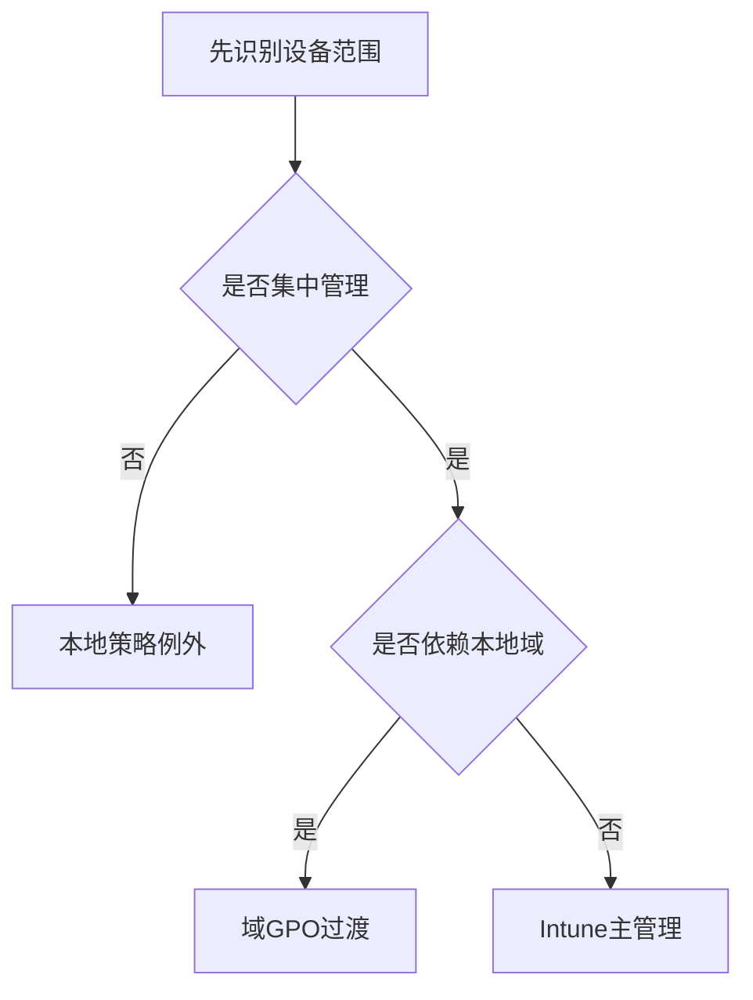

# 第7篇 Microsoft 365 E3 终端安装与管理 · 第9节 三种技术逐项对比

> **本节小节：** 7.91 ～ 7.100。
> **导航：** [返回第7篇目录](README.md)｜上一节：[域组策略长期管理与排查](08-域组策略长期管理与排查.md)｜下一节：[适合当前环境的组合方案](10-适合当前环境的组合方案.md)

---

## 7.91 本节目标

本节把 Intune、本地组策略和域组策略放到同一套标准中比较。目标不是找出一个“所有场景都最好”的工具，而是让实施人员能回答：**谁管理哪类设备、谁安装什么应用、谁拥有哪项配置、失败后如何发现和回退**。

先记住三种处理方式都不是实时遥控：

- **Intune 是云端异步签入。** 管理员保存并分配策略后，已注册设备需要联网、完成签入、取得适用策略、在客户端处理并回传状态；不同工作负载的处理时间不同。
- **域 GPO 是域客户端拉取。** 管理员编辑 GPO 后，域客户端在启动、登录、后台刷新或人工触发时，从 AD 与 SYSVOL 取得并处理策略；部分设置需要前台同步、注销或重启。
- **本地组策略是单机处理。** 管理员在当前电脑编辑本地策略，再由当前电脑处理；它没有企业级云端或域端分配、集中报表和集中重试队列。

完成本节后，应形成三项输出：三种技术总对比表、场景决策表、需要带入第10节的配置所有权候选清单。

## 7.92 大型总对比表：架构、能力与运维边界

下表把本节所有决策维度放在同一张总表中。后续7.93～7.99再解释容易误判的细节。

| 比较项 | Intune | 本地组策略 | 域组策略 |
|---|---|---|---|
| 技术架构 | Microsoft云服务、Entra身份、Intune管理中心与设备端组件 | 当前Windows的本地策略存储与客户端扩展 | AD DS、GPMC、GPC、SYSVOL/GPT与客户端扩展 |
| 目标对象 | 已注册Intune的受支持设备；按用户/设备组和筛选器等分配 | 当前一台Windows及其本地/登录用户 | AD站点、域、OU中的域用户和域计算机，经链接、继承、筛选决定范围 |
| 身份基础 | Microsoft Entra ID；身份加入与Intune注册是两个动作 | 本机状态与本机/登录用户 | 本地Active Directory DS |
| 连接依赖 | 互联网、云端终结点、证书、代理与设备签入 | 不需云或域连接，但必须能在本机管理 | AD DNS、域控、LDAP/Kerberos、SYSVOL/SMB；远程通常需VPN |
| 处理模式 | 云端分配，设备异步签入、处理并回报 | 单机保存，当前设备处理 | 管理员集中编辑，域客户端在刷新时拉取处理 |
| 实时性 | 不是实时遥控，不承诺保存后立即完成 | 不是远程控制，只影响当前电脑 | 不是域控实时推送，要等待启动、登录、后台或人工刷新 |
| M365 Apps | 内置应用类型，适合集中配置、分配和查看状态 | 无集中应用类型；可单机运行ODT | 通常以ODT配合启动脚本/任务过渡，不是原生Click-to-Run生命周期 |
| Win32 EXE | `.intunewin`支持安装/卸载、要求和检测 | 可本机人工/脚本执行 | GPSI不能直接部署任意EXE；脚本/计划任务需自建闭环 |
| MSI | 支持适用MSI；复杂场景常封装为Win32 | 可在本机执行Windows Installer | GPSI可指派合适MSI，依赖共享、权限和前台处理 |
| Store应用 | 有受支持的Microsoft Store应用类型 | 仅单机安装 | 无等价现代Store集中闭环 |
| 脚本 | 可集中分配并查看处理状态，仍须幂等和日志 | 只在本机执行/挂接 | 可集中分配启动/登录等脚本，需治理共享、上下文、签名和幂等 |
| 检测 | Win32支持文件、注册表、MSI和脚本检测 | 无集中检测，需人工/本机脚本 | GPSI覆盖其管理的MSI；其他脚本安装需自建检测 |
| 依赖/取代 | Win32有依赖和取代模型 | 人工排序和版本处理 | GPSI有有限升级关系；复杂依赖/替换通常靠脚本设计 |
| 卸载 | 可配置卸载命令和Uninstall分配 | 逐机执行 | GPSI移除适用于其管理的软件；脚本安装需自建卸载 |
| 失败重试 | 按工作负载在后续签入/评估中重试，有集中状态 | 人工、本机重启或计划任务 | 随策略刷新/启动/任务再处理；默认无统一应用失败看板 |
| Windows更新 | 更新环、功能/质量/驱动策略，可结合Autopatch | 只配置当前设备 | 可集中配Windows Update/WSUS策略，但需自管基础设施和报表 |
| 配置 | 设置目录、管理模板、安全基线、OMA-URI等 | 配置当前电脑 | 域Windows配置成熟，继承/筛选和客户端扩展丰富 |
| 合规 | 集中合规状态，可与条件访问联动 | 无企业合规引擎 | 可强制设置，但无等价云合规与条件访问闭环 |
| 跨平台 | Windows、macOS、iOS/iPadOS、Android，能力各异 | Windows单机 | 以域Windows为主 |
| 远程办公 | 互联网可达并签入时可持续管理 | 要接触或远程操作该单机 | 依赖VPN、AD DNS、域控和内部源；登录后VPN不能满足开机前处理 |
| 集中报表 | 设备、应用、配置、合规、更新等集中视图 | 无 | GPO报告偏配置；客户端结果和应用闭环需日志/额外系统补足 |
| 回退 | 撤销分配、恢复策略/旧包，但要等待签入且部分设置需专项清理 | 恢复本机原值/备份 | 恢复原值、链接、范围或备份，但要等待客户端刷新 |
| 权限审计 | Intune RBAC、范围标签、Entra角色和审计 | 以本机管理员和本机记录为主 | GPO创建/编辑/链接/备份可委派，结合AD审计和客户端证据 |
| 人工维护成本 | 初建需要身份、注册、封装和策略治理；标准化后适合规模化 | 单台低，设备增加后逐台成本快速上升 | 域内集中但需维护AD、DNS、SYSVOL、VPN、共享、备份和排障 |
| 可扩展性 | 云分配、组和筛选适合多地点与远程设备 | 不适合企业规模 | 适合域内Windows规模化，复杂OU/继承和多站点增加技术债 |
| 离线能力 | 只能保留已取得策略，离线时不能获得新变化 | 可完全单机配置，但没有集中确认 | 离域时保留旧结果，无法可靠取得新GPO |
| 与M365 E3结合 | Plan 1承担主体；2026新增能力按实际服务计划复核 | 不因Plan 2而增强 | 不因Plan 2而增强，仍需Windows/服务器/访问许可核对 |
| 推荐定位 | 目标主平台 | 实验、故障隔离、极少数永久离线例外 | 存量域机和遗留依赖的过渡平台 |

> **边界：** Entra中“看见设备对象”不等于设备已注册Intune；域设备“能登录”也不等于已经取得最新GPO。验收必须分别检查身份、管理关系、处理结果和业务行为。

## 7.93 应用、脚本与安装能力逐项对比

| 安装对象 | Intune | 本地组策略 | 域组策略 | 推荐结论 |
|---|---|---|---|---|
| Microsoft 365 Apps | 有内置应用类型，可配置体系结构、应用、更新频道等；若 Office 必须作为 Autopilot ESP 阻塞应用，则用 ODT/XML 封装为 Win32 并由 IME 跟踪 | 无企业级 M365 Apps 分发类型；可在单机运行 ODT，但需人工维护结果 | 通常通过 ODT 配置文件配合启动脚本、计划任务或受控部署源，不是 GPO 软件安装原生 Click-to-Run 生命周期 | 新部署以 Intune 为主；不阻塞 ESP 用内置类型，阻塞 ESP 用 ODT Win32；域方案仅作存量过渡 |
| Win32 EXE | 转换为 `.intunewin`，支持安装/卸载命令、要求和检测 | 可在本机人工或脚本执行，但无集中分配和状态 | GPO 软件安装不能直接把任意 EXE 当 MSI 发布；可用启动脚本或计划任务，但检测、重试和报表需自建 | Intune Win32 优先 |
| MSI | 可使用适用的 MSI 应用类型；复杂生命周期通常封装为 Win32 | Windows Installer 可本机执行，无集中生命周期 | Group Policy Software Installation 可对合适 MSI 指派；安装源、权限、前台处理和重启需验证 | 简单域内 MSI 可过渡；复杂应用用 Intune Win32 |
| Microsoft Store 应用 | 使用受支持的 Microsoft Store 应用类型集中分配和查看状态 | 可在单机安装，无企业集中状态 | 无等价的现代 Store 应用管理闭环 | Intune |
| PowerShell/平台脚本 | 可集中分配、按客户端机制执行并查看脚本状态；不应代替完整应用检测 | 可本机执行或挂入本地启动/登录脚本 | 可通过启动、关机、登录、注销脚本或计划任务运行；需治理上下文、签名、共享与幂等 | 轻量任务可用脚本；软件生命周期优先应用类型 |
| 用户自助安装 | 可把应用设为对已注册设备“可用”，通过公司门户提供 | 无集中企业应用目录 | GPO 软件安装“发布”能力受用户/包类型和现代系统实际支持边界限制，不应作为新自助门户 | Intune 公司门户 |
| 大文件源 | 可由云端/CDN或内容机制下载，仍需评估网络与交付优化 | 依赖本机介质或人工复制 | 常依赖 UNC 共享、站点带宽、SMB权限和开机前网络 | 远程与多站点优先 Intune |

所有平台都不能修复一个本身错误的安装包。正式分发前都要在干净测试机验证静默参数、退出码、磁盘空间、重启行为、32/64位条件、代理、签名和业务功能。

## 7.94 检测、依赖、取代、卸载与失败重试

| 生命周期能力 | Intune | 本地组策略 | 域组策略 |
|---|---|---|---|
| 安装前要求 | 可配置操作系统、体系结构、磁盘、文件/注册表/脚本等要求 | 由操作者或自编脚本判断 | 通过安全/WMI筛选、脚本条件或包范围间接控制；复杂判断需自建 |
| 安装检测 | Win32 支持文件、注册表、MSI、脚本检测；结果影响状态与再次评估 | 无集中检测；可写本机脚本或人工检查 | GPSI能处理其管理的MSI状态；脚本/ODT需另写幂等检测和日志 |
| 应用依赖 | Win32 应用可建依赖关系 | 需人工排序 | 可用脚本顺序、多个GPO/包顺序等设计，但缺少同等应用依赖视图 |
| 取代升级 | Win32 可配置取代，明确替换/卸载旧应用 | 需逐机执行 | GPSI有升级关系；脚本方案需自行设计版本迁移 |
| 卸载 | 可配置 Uninstall 分配与命令；仍须测试用户数据和重启影响 | 本机人工/脚本卸载 | GPSI移除选项适用于受其管理的软件；脚本安装的软件必须有自建卸载路径 |
| 失败状态 | 管理中心可见失败、等待、不适用等状态；需结合设备日志判断 | 无集中失败队列 | GPO处理和应用事件可在客户端取证；默认没有Intune式统一应用状态看板 |
| 重试机制 | 设备再次签入和管理扩展评估时按工作负载规则重试；不是任意频率实时重试 | 依赖人工、重启或本机计划任务 | 后台/前台策略重新处理、启动脚本或计划任务可再执行；必须幂等，不能无限重复破坏性操作 |
| 回退前提 | 预先测试卸载、旧版本包、撤销分配和数据保护 | 保存原值、脚本和本机备份 | 保存GPO备份、链接/筛选、旧包、共享源与脚本版本 |

> **高风险应用准备/验证/回退：** 准备阶段确认维护窗口、数据备份、静默卸载和旧版本包；验证阶段同时检查平台状态、客户端检测、事件/安装日志和业务启动；回退阶段先停止扩大范围，再撤销新分配或恢复旧包，最后复测数据与业务。不要把“删除应用对象”当成卸载，也不要把“移除 GPO 链接”当成自动恢复所有设置。

## 7.95 更新、配置与合规能力

| 管理域 | Intune | 本地组策略 | 域组策略 |
|---|---|---|---|
| Windows 更新 | 更新环、功能更新、质量更新与受支持驱动策略；可结合报表和 Windows Autopatch | 可配置当前设备相关策略，无集中分环和报表 | 可集中设置 Windows Update 策略；若结合 WSUS 还要维护服务器、同步、批准和客户端目标 |
| M365 Apps 更新 | 可通过应用配置、配置策略等管理受支持设置并观察设备 | 通过本机策略或 ODT 配置单机 | 可通过 Office ADMX/ODT 配置更新频道和策略，适合域机过渡 |
| Windows/Office配置 | 设置目录、管理模板、安全基线、OMA-URI等；应逐项核对支持 | 可配置本机可用管理模板 | 管理模板、首选项、安全设置和客户端扩展丰富，适合域 Windows |
| 合规评估 | 有合规策略、设备状态和与条件访问联动的能力 | 无企业集中合规引擎 | 可强制设置，但没有等价的云合规状态与条件访问闭环 |
| 配置冲突 | 可报告部分冲突；仍需查设置来源与适用性 | 本地设置可能与域GPO/MDM冲突 | 有LSDOU、继承、强制、筛选等处理逻辑；与MDM冲突时不能笼统声称某一方总获胜 |
| 基线与版本 | 策略可按命名、分配、版本记录和导出流程治理 | 需逐台记录或使用镜像/脚本补足 | GPO可备份、报告和委派；ADMX中央存储需版本治理 |
| 配置回退 | 恢复原策略、撤销分配或设为未配置；某些“纹身”设置需专项清理 | 恢复原值/未配置或还原本机备份 | 恢复原值、未配置、链接/筛选或已验证备份；首选项删除行为需预先测试 |

**唯一所有者规则：** 不按“Intune负责云端、GPO负责本地”这种模糊口号分工，而要细到每一个配置域或设置。例如“Windows更新环”由 Intune 拥有后，域 GPO 对应设置必须按迁移计划退出；没有 Intune 等价能力的遗留项才保留域 GPO，并设置负责人和复核日期。

## 7.96 跨平台、远程办公与离线能力

| 场景 | Intune | 本地组策略 | 域组策略 |
|---|---|---|---|
| Windows | 能力最完整的主要平台之一，仍受版本/版本号和注册方式约束 | Windows单机 | 以加入AD域的Windows为主 |
| macOS | 支持受范围约束的应用、配置、合规等 | 不适用 | 无原生等价管理 |
| iOS/iPadOS、Android | 支持相应注册、应用和保护场景，能力按平台不同 | 不适用 | 不适用 |
| 互联网远程办公 | 设备能访问所需云端终结点并签入时可持续管理 | 必须接触或远程操作该单机 | 通常需VPN、AD DNS、域控、SYSVOL和内部源；只有登录后VPN时无法满足开机前处理 |
| 永久离线 | 云策略无法取得最新变更；只能保留设备已有策略，需例外流程 | 可独立使用，但逐台维护 | 完全离线于域后只能保留旧策略，无法可靠取得新GPO |
| 偶发断网 | 恢复联网并签入后处理积压策略；不能保证断网期间更新 | 本机策略仍可处理 | 恢复域连接后再刷新；部分设置要重启/登录 |
| 多地点扩展 | 主要评估互联网出口、代理、交付优化和云服务可达性 | 每增加一台都增加人工 | 要规划站点、域控/DNS、SYSVOL与软件共享带宽 |

因此，“离线能力强”不等于“管理能力强”。本地策略在无网络时可编辑，但企业无法集中确认是否一致；域 GPO 在设备离域期间也不会神奇获得新策略。永久离线设备必须成为审批例外，定义补丁介质、恶意软件防护、日志回收、人工复核和退役日期。

## 7.97 报表、审计、权限与人工维护成本

| 运维维度 | Intune | 本地组策略 | 域组策略 |
|---|---|---|---|
| 集中报表 | 设备、应用、配置、合规、更新等有集中视图；深度与时效因工作负载而异 | 无 | GPO报告说明“配置了什么”，客户端结果需 `gpresult`、事件日志或额外收集系统 |
| 审计线索 | 管理审计、分配、设备状态和角色记录；应接入企业留存流程 | 主要依赖本机事件、文件和人工记录 | AD/GPMC变更、委派、备份和客户端事件；应启用适当审计并集中留存 |
| 权限模型 | Intune RBAC、范围标签、Entra角色与最小权限分工 | 本机管理员通常可改本机策略，职责分离弱 | GPO创建、编辑、链接、委派、备份/恢复可分工；Domain Admins不应作为日常账号 |
| 失败发现 | 可按状态筛选失败和停滞设备，再做客户端取证 | 往往靠用户报告或逐台检查 | 默认应用闭环弱，需事件收集、脚本或其他系统补足 |
| 初始建设成本 | 许可、身份、注册、分组、网络、应用封装与策略设计 | 单台低，规模化迅速变高 | 已有AD时可复用，但需域控、DNS、SYSVOL、共享、备份和专业人员 |
| 日常人工成本 | 标准化后适合规模化；仍需处理失败、例外和策略生命周期 | 设备越多，逐台操作与证据成本近似线性增长 | 域内策略集中，但远程、脚本、共享、复制和应用状态需持续人工维护 |
| 审计可复现性 | 分配和报表较易集中导出，但需记录版本和时间窗口 | 依赖逐机快照和变更单 | GPO报告/备份较强，但必须另存链接、筛选、WMI和外部依赖 |

成本不能只比较许可证。应把域控制器与DNS运维、VPN和文件共享、软件源、备份恢复、管理员时间、失败排查、远程设备支持和审计取证一起计入三至五年的总拥有成本。

## 7.98 可扩展性、回退与长期可维护性

| 比较项 | Intune | 本地组策略 | 域组策略 |
|---|---|---|---|
| 规模扩展 | 通过动态/静态组、筛选器、分配和云管理扩展；须治理组规则与过度分配 | 不适合企业规模，每台都要单独处理 | 通过OU、组、安全筛选、站点与域扩展；复杂继承会增加排障难度 |
| 新地点接入 | 主要解决云端访问、身份和带宽 | 逐台人工 | 常需域网络、DNS、VPN/站点和内部源规划 |
| 策略复制 | 云服务处理；企业关注服务健康与配置备份/导出 | 无集中复制 | AD与SYSVOL复制是关键依赖，需监控和灾备 |
| 回退粒度 | 可按组撤销/替换策略和应用，但设备需签入，且不是所有设置都会自动恢复 | 可精确改本机，但无法集中保证全部设备一致 | 可恢复设置、链接、范围或备份；客户端仍需刷新，外部脚本/共享要同步恢复 |
| 例外管理 | 建排除组、筛选器与到期复核；防止永久排除 | 极易形成无人知道的单机偏差 | 可用例外OU/组，但复杂筛选和继承会形成技术债 |
| 长期方向 | 本企业目标主平台 | 仅实验、故障隔离、永久离线特例 | 存量和遗留依赖过渡平台 |

**回退不是“立即消失”。** Intune撤销分配后要等待设备签入；域 GPO恢复后要等待域客户端刷新；本地策略恢复要真正接触该设备。高风险策略必须在变更前写明：旧值、恢复动作、预计处理条件、验证证据、业务兜底和最大允许影响时间，由企业审批后使用。

## 7.99 与 Microsoft 365 E3 许可和能力的结合

以本书 **2026-08-28** 为时间基线，并以租户实际服务计划为最终依据：

| 能力 | 与三种技术的关系 | 本书许可口径 |
|---|---|---|
| Intune Plan 1 | 提供应用、配置、合规、设备、更新、Autopilot等主体云管理能力 | Microsoft 365 E3主体能力；普通M365 Apps/Win32/MSI/Store部署不要求Plan 2 |
| Intune Plan 2 | 叠加于 Plan 1 的高级层，不改变本地/域GPO能力 | 2026夏季加入E3相关包装；当前范围包括Remote Help、Advanced Analytics、Tunnel for MAM、受支持Android FOTA、特色设备管理等，示例并非穷举 |
| Remote Help | Plan 2中的远程协助工作流，不等于实时策略推送 | 租户可能分列服务计划；仍需角色、范围、双方许可、客户端和实施配置 |
| Advanced Analytics | Plan 2中的深入终结点分析，不代替配置所有权与事件取证 | 租户可能分列服务计划；仍需设备、数据和隐私前提 |
| Windows Autopatch | 可与Intune更新管理结合；不由本地/域GPO自动获得 | E3提供Windows Enterprise E3订阅权益；设备仍需合格基础Windows许可，并满足Autopatch注册和服务先决条件 |
| EPM、Cloud PKI、Enterprise App Management | 若项目需要，分别影响提权、证书和应用目录/更新服务设计 | **E3不包含**，需另购相应许可或套件；Plan 2不等于这些产品 |
| Microsoft Teams | 与本节三种设备管理技术不是同一许可问题 | 以准确SKU判断；E3 with Teams已包含，E3 (no Teams)需要另配适用Teams产品 |
| 本地/域GPO | Windows/AD技术能力不因拥有Plan 2而增强；仍受Windows版本和基础设施许可约束 | 不能用Intune许可结论替代Windows、服务器及访问许可核对 |

实施人员应在购买渠道、区域、租户服务计划和消息中心复核 2026 年新增能力是否已实际出现。不能因为产品宣传页写“包含”，就跳过用户许可分配、MDM范围、角色、设备注册和功能配置。

## 7.100 按场景决策表与本节验收

| 业务场景 | 首选 | 过渡/例外 | 决策理由 | 必须验证 |
|---|---|---|---|---|
| 新购Windows电脑 | Entra Join + Autopilot + Intune | 无遗留依赖时不走混合加入 | 面向纯云终局，适合远程开箱和持续管理 | 合格且已激活的基础Windows许可（通常OEM Windows Pro）、Autopilot注册、Enterprise订阅激活、Intune受管、应用/配置/更新和业务访问 |
| 存量域Windows | 混合Entra加入后由GPO自动注册Intune | 域GPO保留遗留项 | 降低一次性重装和业务中断 | 身份与MDM状态分别成功、无重复设备、唯一配置所有者 |
| M365 Apps/通用Win32 | Intune | 域ODT/脚本仅作有期限过渡 | Intune有检测、分配、状态和卸载闭环 | 静默安装、检测、更新、卸载和业务启动 |
| 映射驱动器/域打印机 | 域GPO过渡 | 纯云替代成熟后迁移 | 与AD身份、内网名称解析和共享权限强相关 | VPN内外、Kerberos、打印、断线重连 |
| Windows更新 | Intune更新策略或Autopatch | 遗留域GPO/WSUS按批迁移 | 云设备和远程办公可见性更好 | 分环、暂停、版本、失败、回退和业务窗口 |
| macOS/iOS/Android | Intune相应能力 | 平台不支持项另设受控方案 | 两类Windows组策略不提供跨平台集中管理 | 平台支持矩阵、所有权、隐私和注册方式 |
| 单台隔离实验 | 本地组策略 | 测试结束后恢复快照/原值 | 不污染企业分配 | 原值、实验记录、清理和复测 |
| 永久离线设备 | 审批后的本地策略例外 | 可用离线介质与人工巡检补足 | Intune和域GPO都无法持续取得新策略 | 补丁、恶意软件防护、日志、介质、例外到期日 |
| 需要集中合规与条件访问 | Intune | 域GPO只负责尚未迁移的设置 | GPO不是云合规状态引擎 | 合规计算、宽限期、条件访问和紧急访问 |
| 遗留域登录脚本/老应用 | 域GPO过渡 | 逐项改造到现代方式 | 直接移除可能中断登录或业务 | 脚本上下文、共享源、权限、回退和退役条件 |

最终选择不是“三选一”，而是**按设备生命周期和工作负载分工**：Intune为目标主平台，域GPO承担存量过渡与遗留依赖，本地策略只保留实验、故障隔离和极少数永久离线例外。

- [ ] 已确认三种技术都不是实时遥控，并写明各自处理条件。
- [ ] 已逐项比较M365 Apps、Win32、MSI、Store、脚本及其检测、依赖、取代、卸载和重试。
- [ ] 已比较更新、配置、合规、跨平台、远程、离线、报表、回退、审计、成本与扩展性。
- [ ] 已按2026时间基线记录E3、Plan 1、Plan 2、Remote Help、Analytics、Autopatch和附加产品边界。
- [ ] 已把每个场景的首选、例外、验证和回退要求带入下一节。

> **下一节：** [适合当前环境的组合方案](10-适合当前环境的组合方案.md)，把比较结论落成存量域设备与纯云新设备并行的目标架构。