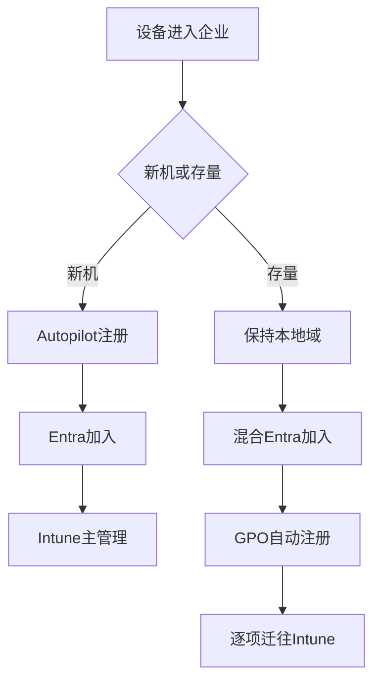
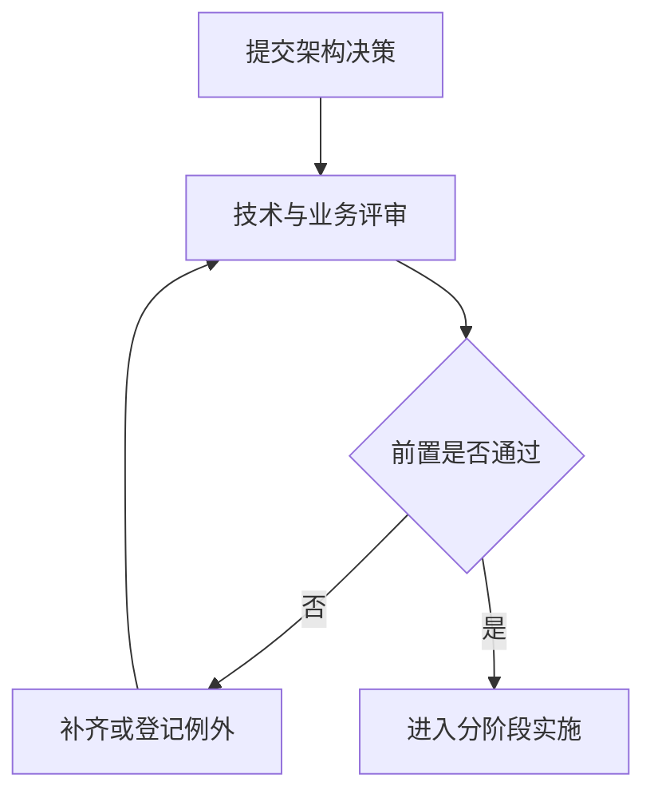

# 第7篇 Microsoft 365 E3 终端安装与管理 · 第10节 适合当前环境的组合方案

> **本节小节：** 7.101 ～ 7.111。
> **导航：** [返回第7篇目录](README.md)｜上一节：[三种技术逐项对比](09-三种技术逐项对比.md)｜下一节：[分阶段实施、回退与验收](11-分阶段实施回退与验收.md)

---

## 7.101 本节目标

本节基于已经确认的企业环境设计方案：**已有本地 AD 域、目标逐步转向纯云、采用净新 Microsoft 365 E3 订阅**。这不是把所有存量电脑立即退出域，也不是让所有新电脑继续复制旧架构，而是建立两条受控路线：

- 新设备：`Microsoft Entra Join + Windows Autopilot + Intune`；
- 存量域设备：`本地 AD 域加入 + 混合 Microsoft Entra Join + 域 GPO 自动注册 Intune`。

最终输出包括：目标架构、工作负载责任边界、配置所有权矩阵、组与OU设计、三个遗留业务试点、网络/身份/许可前置清单和人员职责表。

> **术语说明：** 本节的“共管迁移矩阵”是指 Intune 与域 GPO 在过渡期按工作负载分工，不等同于 Microsoft Configuration Manager 产品中的 co-management。若企业没有 Configuration Manager，不应借用该产品状态名称。

## 7.102 目标架构与两条设备路线

### 7.102.1 新设备纯云路线

1. 采购阶段要求供应商或企业按受支持方式把设备注册到 Windows Autopilot；核对硬件标识、序列号、设备归属和采购记录，并确认设备具有符合 Product Terms 的合格基础 Windows 许可，通常是已激活的 OEM Windows Pro；M365 E3 中的 Windows Enterprise E3 是订阅升级权益，不能替代裸机或 Home 基础许可。
2. 把设备加入预部署/部署配置的受控设备组，分配 Autopilot 配置文件、Enrollment Status Page、基础合规、配置、更新和必需应用。Microsoft 365 Apps 若不阻塞 ESP，可用内置应用类型在进入桌面后继续安装；若必须阻塞 ESP，则用 ODT/XML 封装为 Win32，由 IME 管理并把该 Win32 应用加入 ESP 所选阻塞应用。
3. 用户开机接入互联网，以组织账号完成 Microsoft Entra Join 和 Intune 自动注册。
4. 设备签入后取得策略并安装应用；服务台按设备记录核对 Entra加入类型、Intune受管状态、主用户、合规、更新和应用结果。
5. 文件、打印和老系统访问按7.108的真实业务试点验证；未通过前不能把业务设备批量切换为纯云。

### 7.102.2 存量域设备过渡路线

1. 保持现有本地 AD 域加入关系，不为注册 Intune 而批量退域重加。
2. 用户、组和联系人预配可按需求选择 Cloud Sync 或 Connect Sync；生产混合 Entra Join 的**设备对象同步使用 Microsoft Entra Connect Sync**。若两种工具并用，必须划清对象与属性作用域。Cloud Sync Device Sync 当前为预览，只有租户已开放、微软仍支持且专项试点获批时才评估，不作为生产承诺。
3. 在试点OU完成混合 Microsoft Entra Join，分别验证本地AD计算机对象、Entra设备对象和设备加入状态。
4. 使用经批准的域 GPO 配置自动 MDM 注册，并确认MDM用户范围、用户许可和注册限制允许；普通已许可用户场景把 `Credential Type` 设为 **User Credential**，Device Credential仅用于Configuration Manager共管、受支持AVD多会话等微软明确支持场景。
5. 分别在Entra和Intune验证设备；出现对象不等于注册完成，必须看到正确加入类型、管理机构、最近签入和策略状态。
6. 保留确有依赖的域GPO，同时按配置所有权矩阵把应用、更新、合规和现代配置迁到Intune。

> **终局原则：** 微软不建议把新设备继续采用混合加入或混合 Autopilot 作为终局。本企业不把“先入域、再混合、再迁云”复制给净新设备；只有经架构委员会批准且有明确退出日期的遗留例外，才可临时偏离纯云路线。

## 7.103 平台责任边界

| 平台 | 默认负责 | 明确不负责 | 退出/保留条件 |
|---|---|---|---|
| Intune | 新机全生命周期；应用、配置、合规、更新、设备动作、库存和远程设备可见性；存量机逐步接收迁移工作负载 | 不直接替代文件服务器权限、域打印队列、遗留Kerberos应用本身；不是实时遥控 | 目标长期平台，不设整体退出；单项能力仍须按平台支持验证 |
| 域GPO | 过渡期自动注册Intune；现有登录脚本、映射驱动器、域打印机、遗留应用及尚无云端等价能力的域配置 | 不作为新机默认终局；不承担多平台合规和现代应用状态闭环 | 依赖有负责人、业务理由、验证和退役日期；替代能力稳定后取消链接并观察 |
| 本地组策略 | 实验、复现故障、隔离冲突；极少数经批准的永久离线设备例外 | 不作为企业集中下发平台；不批量承担软件部署与合规证明 | 实验结束恢复原值；永久离线例外按季度复核并有补丁/日志方案 |
| Entra ID | 云身份、设备身份、组、条件访问对象和管理员身份 | 不等于设备已被Intune管理 | 持续作为纯云目标身份平面 |
| 本地AD DS | 存量域身份、Kerberos/NTLM依赖、域计算机、DNS与遗留资源访问 | 不应因终端迁移进展被仓促下线 | 文件、打印、老系统及服务账号依赖全部解除并通过退役评审后再缩减 |

责任边界要落实到可验收对象。例如“打印归GPO”太粗，应拆成：打印服务器与队列由基础设施团队负责，驱动与安全由打印负责人负责，域机队列映射暂由某个GPO负责，纯云机部署方式由Intune策略负责人负责。

## 7.104 共管迁移矩阵：每项配置唯一所有者

以下矩阵是模板，实施时必须替换尖括号占位。**当前所有者和目标所有者在任一时间只能各有一个主写入方；短期试点重叠要记录开始、结束和冲突判定。**

| 工作负载/配置项 | 过渡期唯一所有者 | 目标所有者 | 迁移动作 | 验证证据 | 回退 |
|---|---|---|---|---|---|
| Intune自动注册 | 域GPO `<GPO-MDM-Enroll>` | 域机存续期仍为域GPO；纯云机由Autopilot流程 | 先试点OU，再扩大域机范围 | 加入状态、MDM管理机构、Intune最近签入 | 移出试点范围，恢复GPO原配置并排查 |
| M365 Apps安装 | `<现有域部署>` | Intune应用 | 先决定是否阻塞ESP：不阻塞用内置类型；阻塞则用ODT/XML封装Win32并由IME跟踪；验证后停止旧脚本扩大 | 应用状态、版本、更新频道、ESP/OOBE与启动测试 | 停止新分配，恢复旧安装源/包 |
| 通用Win32应用 | `<脚本或人工>` | Intune Win32 | 封装检测、依赖、取代和卸载 | 检测结果、日志、业务功能 | 分配旧版本或执行已测卸载/恢复 |
| Windows更新 | `<域GPO/WSUS>` | Intune更新策略或Autopatch | 按更新环迁移，旧设置改为未配置 | 更新报表、版本、重启和业务窗口 | 暂停新环，恢复旧策略与批准流程 |
| Office配置 | `<Office域GPO>` | Intune设置目录/管理模板 | 映射单项设置，试点后撤旧设置 | Intune状态、注册表/策略来源、业务行为 | 撤销新分配，恢复原GPO值 |
| Windows安全基线 | `<多个域GPO>` | Intune策略 | 拆分加密、防火墙、防病毒等，不一次全迁 | 配置报告、设备实际状态、应急访问 | 按配置域恢复旧所有者，不解密或破坏现有数据 |
| 合规与条件访问 | Intune | Intune | 先报告模式/小组，再启用访问控制 | 合规原因、登录日志、紧急账号 | 排除受控试点、恢复批准的旧访问路径 |
| 登录脚本 | 域GPO | Intune或业务替代，按脚本逐项决定 | 删除映射/旧盘符等副作用后再迁 | 登录时间、脚本日志和业务资源 | 恢复脚本链接/版本 |
| 映射驱动器 | 域GPO | 现代文件访问方案或有期限域GPO | 先迁共享数据/权限，再迁映射 | VPN内外、权限、文件锁和离线行为 | 恢复旧映射与共享路径 |
| 域打印机 | 域GPO | 经验证的云/Intune打印方案或有期限域GPO | 先验证驱动、队列、纸张和权限 | 测试页、业务打印、日志 | 恢复旧队列映射与驱动 |
| 本地例外设置 | 本地组策略 `<例外ID>` | Intune或退役 | 登记原值、原因、到期日 | 本机导出、业务确认 | 恢复原值/快照 |

迁移顺序固定为：盘点原值与来源 → 确认目标能力 → 指定试点与唯一所有者 → 准备回退 → 小组分配 → 检查平台和客户端 → 撤销旧写入 → 观察 → 结案。不能只在Intune创建相同设置，就宣称GPO已经迁移。

## 7.105 网络与云服务前置

| 网络项 | 新设备纯云路线 | 存量混合路线 | 验证方法 |
|---|---|---|---|
| 互联网出口 | OOBE、Entra认证、Autopilot、Intune、Windows Update、应用内容必须可达 | 除云端点外仍需访问域资源 | 在试点网络、办公网、家庭网分别执行注册和签入测试 |
| TLS检查/代理 | 不得破坏证书信任、设备上下文认证或必需云端点 | 还要验证计算机上下文、登录前代理和VPN | 留存代理日志、失败时间、目标和证书链证据 |
| DNS | 能解析公共Microsoft服务和企业发布资源 | 必须优先满足AD DNS、域控定位及云服务解析 | `dsregcmd`证据、域控定位、共享与云端连通测试 |
| VPN | 纯云管理不要求回域；访问遗留资源时仍可能需要 | 要支持AD DNS、Kerberos、SYSVOL、文件/打印和相关端口 | 测登录前/登录后VPN、休眠恢复和密码变更 |
| 带宽 | 规划Autopilot并发、M365 Apps、Win32和更新；启用适当交付优化 | 还要评估SMB软件源和SYSVOL | 小批量测峰值、下载时长和业务拥塞 |
| 时间与证书 | 时间、根证书、设备证书和撤销检查正常 | 同时满足域时间和内部PKI依赖 | 对比时间源、证书链和事件日志 |
| 防火墙 | 按微软发布的服务端点和最小出口原则维护 | 同时开放到域控、DNS、文件/打印/老系统的必需路径 | 由网络团队记录规则、所有者、复核日和连接日志 |

> **高风险网络变更：** 准备时导出代理、防火墙、VPN与DNS原配置并建立旁路测试；验证时覆盖OOBE、设备上下文、用户登录、应用下载、签入和域资源；失败时恢复原规则，停止新设备发放，并保留测试设备和时间线取证。

## 7.106 身份、注册与安全前置

1. **域名与UPN：** 用户登录名应采用已验证的可路由域名；先处理不可路由后缀、重复UPN和同步冲突。
2. **同步健康：** 用户、组和联系人可按需求选择同步工具；生产混合设备对象使用Connect Sync。若并用Cloud Sync须明确作用域；Cloud Sync Device Sync预览不得直接作为生产基线。
3. **混合加入：** 确认服务连接点、目标域/林、支持的Windows版本、Connect Sync设备对象同步和网络条件。
4. **MDM自动注册：** 配置并验证MDM用户范围、用户许可、注册限制、设备平台限制和每用户设备限制；普通用户场景明确选择User Credential，Device Credential仅限微软支持的共管/AVD多会话等场景。
5. **Autopilot：** 验证设备归属、合格基础Windows许可、部署配置、动态组规则、Enrollment Status Page和必需应用；明确Office是否阻塞ESP，阻塞时使用ODT/XML Win32包；禁止把测试设备误分到生产配置。
6. **管理员安全：** 使用独立云管理员账号、最小权限、MFA和紧急访问账号；紧急账号的存储、告警和演练需受控。
7. **条件访问：** 先观察登录日志和排除紧急账号，再对试点组要求合规；避免在设备尚不能注册时封死注册入口。
8. **对象治理：** 为同一物理设备建立识别规则，处理重复、陈旧和待退役对象；不得为“看起来整齐”盲目删除对象。

身份前置验收要分别记录：本地AD状态、Entra加入类型、Intune注册状态、用户许可、主用户、最近活动和条件访问结果。

## 7.107 组、OU、范围与命名设计

### 7.107.1 建议对象结构

| 对象 | 虚构示例 | 用途 | 管理规则 |
|---|---|---|---|
| 域试点OU | `OU=MDM-Pilot,OU=Workstations,...` | 先应用混合加入/自动注册GPO | 不直接移动关键共享终端；保留原OU与回移步骤 |
| 域生产OU | `<OU-Workstations-Prod>` | 分批承接已验证的注册GPO | 不把所有域根对象一次链接 |
| Entra新机组 | `<GRP-Autopilot-New>` | 分配Autopilot配置 | 动态规则变更先做预览并第二人复核 |
| Intune IT试点组 | `<GRP-Intune-Pilot-IT>` | 最先接收应用、更新和配置 | 成员少、设备型号有代表性 |
| Intune业务试点组 | `<GRP-Intune-Pilot-Business>` | 验证文件、打印和业务应用 | 每个关键部门有业务确认人 |
| 更新环组 | `<GRP-Update-Ring-0/1/2>` | 控制更新节奏和暂停 | 同一设备避免进入冲突更新环 |
| 应用组 | `<GRP-App-Name-Required>` | 分配必需/可用/卸载 | 安装与卸载组互斥，组负责人明确 |
| 例外组 | `<GRP-Exception-Policy>` | 临时排除已知不兼容设备 | 必须有工单、原因、到期日和补救计划 |

### 7.107.2 设计规则

- OU用于域管理边界，不为模仿Intune组而无意义重构整个AD；
- Entra组按用途拆分，避免一个“所有设备”组同时承担Autopilot、应用、更新和例外；
- 用户组适合跟随用户的许可/应用，设备组适合设备阶段和机器配置；具体选择需按策略支持验证；
- 动态组规则发布前先对样本做预览，防止运算符错误导致全量命中；
- 每个分配记录包含策略名、包含组、排除组、筛选器、负责人、变更号和退役日；
- 排除不是永久解决方案，例外组按月复核，过期成员自动进入人工审查。

## 7.108 三个遗留依赖的真实业务试点

试点不能只验证“策略显示成功”，必须让真实岗位在受控测试数据和虚构示例环境中完成日常动作。

### 7.108.1 文件服务器试点

**场景：** 纯云新机和存量混合设备访问虚构共享 `\\files01.contoso.example\Dept`。

- 准备：选择测试文件夹与非敏感样例文件，记录NTFS/共享权限、DNS、SMB、Kerberos、VPN和备份；禁止使用真实机密数据。
- 动作：在办公网、家庭网+VPN测试发现共享、读写、重命名、文件锁、长路径、Office共同编辑边界和密码变更后访问。
- 验收：用户不被反复提示凭据；权限与岗位一致；断网/重连行为可解释；审计日志能定位账号、设备和时间。
- 回退：保留原域设备与旧映射，停止扩大纯云设备，恢复批准的映射方式；不得为解决认证问题放宽Everyone权限。

### 7.108.2 域打印机试点

**场景：** 访问虚构队列 `\\print01.contoso.example\Finance-MFP`。

- 准备：记录队列、驱动版本、Point and Print安全、纸盒/双面/彩色、部门计费和旧GPO；准备已批准驱动与旧队列恢复方式。
- 动作：分别测试普通用户安装/映射、测试页、PDF/Office打印、A3/双面/彩色、凭据变化、VPN和驱动更新。
- 验收：无需授予本地管理员；打印选项正确；失败日志和服务台路径明确；移除策略不会误删其他队列。
- 回退：撤销新分配，恢复旧GPO队列和已验证驱动；若驱动引发崩溃，隔离试点并按打印服务变更流程恢复。

### 7.108.3 Windows集成身份验证老系统试点

**场景：** 纯云新机访问虚构站点 `https://legacy.contoso.example`，该系统使用Windows集成身份验证。

- 准备：记录SPN、DNS别名、服务账号、Kerberos/NTLM现状、浏览器区域/允许列表、代理、VPN和应用所有者；不得在文档保存密码。
- 动作：测试办公网与远程VPN、首次登录、锁屏恢复、密码变更、不同浏览器、访问后端文件/数据库的完整业务事务。
- 验收：确认实际使用的协议，不能只看“页面打开”；无循环凭据提示；授权和审计正确；服务账号没有被随意改成高权限。
- 回退：让试点用户回到已验证域设备或批准的远程应用入口，恢复旧浏览器/策略配置，停止纯云扩大并由应用团队修复身份依赖。

三个试点都通过后，才能批准新机纯云批次扩大；若某项只能依赖域设备，应登记应用所有者、替代方案、预算、风险和退役日期，而不是把所有新机永久改回混合加入。

## 7.109 人员职责与权限分离

| 角色 | 主要职责 | 不应单独完成 | 必留证据 |
|---|---|---|---|
| 项目负责人 | 范围、预算、阶段门、风险和业务协调 | 不替代技术验证批准高风险全量 | 项目计划、决策和风险台账 |
| Entra/身份管理员 | 同步、设备身份、组、条件访问和紧急账号 | 不同时审批并实施自己的高风险条件访问 | 配置导出、登录日志、审批 |
| Intune管理员 | 注册、应用、配置、合规、更新和报表 | 不越权改域、网络或应用后端 | 分配、审计、设备与应用报表 |
| AD/GPO管理员 | OU、GPO、自动注册、脚本、域依赖和备份 | 不用Domain Admins做日常编辑 | GPO报告、备份、链接/权限记录 |
| 网络管理员 | DNS、代理、防火墙、VPN和带宽 | 不以“放通全部”替代诊断 | 规则、流量与回退记录 |
| 安全/合规负责人 | 基线、合规、条件访问风险和审计留存 | 不直接全量启用未试点控制 | 风险接受、例外、复核记录 |
| 应用/业务负责人 | 安装参数、业务测试、数据与退役决定 | 不只确认“能打开” | 测试用例、签字、已知问题 |
| 服务台 | 用户沟通、设备核验、一级排障和升级 | 不删除设备对象或绕过安全控制 | 工单、时间线、解决方案 |
| 变更审批人 | 审核影响、窗口、验证和回退 | 不由实施人自批高风险变更 | 变更单和批准记录 |

最小权限应结合Intune RBAC、范围标签、Entra角色、GPO委派和受控管理员工作站实施。共享管理员账号会破坏审计，不作为常态方案。

## 7.110 许可边界、采购与服务计划核对

| 项目 | 本企业基线 | 实施要求 |
|---|---|---|
| Microsoft 365 E3 | 净新订阅；具体SKU待正式报价确认 | 本项目需要Teams，比较with Teams与no Teams组合，核对地区、渠道、准确SKU和服务计划 |
| Intune Plan 1 | 主体能力 | 用于普通应用、配置、合规、设备、更新和Autopilot；试点用户必须实际启用 |
| Intune Plan 2 | 2026夏季E3新增的高级叠加层 | 当前范围包括Remote Help、Advanced Analytics、Tunnel for MAM、受支持Android FOTA、特色设备管理等；示例不是穷举，逐项验证 |
| Remote Help | Plan 2高级能力；租户可能分列服务计划 | 仍要配置角色、范围、双方许可和客户端；不等于Intune策略实时推送 |
| Advanced Analytics | Plan 2高级能力；租户可能分列服务计划 | 仍需满足设备、数据和隐私前提 |
| Windows Autopatch | 许可层面可用 | Windows Enterprise E3是订阅升级权益；设备仍需合格基础Windows许可，并满足版本、注册、管理和服务先决条件 |
| EPM | E3不含 | 未另购不得把提权管理写入既定范围 |
| Cloud PKI | E3不含 | 证书项目另做许可、PKI和生命周期设计 |
| Enterprise App Management | E3不含 | 未另购时自行维护应用封装、版本和供应链流程 |
| Microsoft Teams | 取决于准确E3 SKU | E3 with Teams已包含基础Teams权利；购买E3 (no Teams)时另购适用Teams产品，不重复采购 |
| Windows Server/访问许可 | 不由M365 E3结论自动覆盖 | 文件、打印、AD和老系统保留期间由许可负责人复核 |

采购验收不是查看产品名称，而是导出租户服务计划，抽查试点用户，核对Intune管理中心实际入口和功能，再由许可负责人签字。许可缺失时不得用试用版静默支撑生产承诺。

## 7.111 架构决策记录与本节验收

架构决策记录至少包含：

| 决策项 | 已批准结论 | 复核触发条件 |
|---|---|---|
| 新设备身份 | Entra Join | 老系统身份依赖变化、Autopilot支持变化 |
| 新设备部署 | Autopilot + Intune | 采购渠道、网络或部署配置变化 |
| 存量设备 | 混合Entra加入 + GPO自动注册Intune | 域依赖解除或设备重置换新 |
| 域GPO | 保留自动注册和明确遗留项 | 每项依赖达到退役条件 |
| 本地策略 | 实验、隔离、永久离线特例 | 例外到期、设备联网能力变化 |
| 配置冲突 | 一项设置一个所有者 | 每次工作负载迁移 |
| 新机混合加入 | 不作为终局 | 仅架构委员会批准的有期限例外 |

- [ ] 已批准新机纯云、存量域机过渡的两条路线。
- [ ] 已确认新机不把混合加入或混合Autopilot当作终局。
- [ ] 已为应用、更新、配置、合规、登录脚本、驱动器和打印指定唯一所有者。
- [ ] 已完成互联网、代理、DNS、VPN、带宽、时间和证书验证计划。
- [ ] 已分别验证同步、混合加入、Intune注册、Autopilot和条件访问前置。
- [ ] 已建立试点OU、Autopilot组、Intune试点组、更新环、应用组和有期限例外组。
- [ ] 已为文件服务器、域打印机、Windows集成身份验证老系统安排真实业务试点和回退。
- [ ] 已完成角色分工、最小权限和高风险变更职责分离。
- [ ] 已核对Plan 1、Plan 2及其Remote Help、Advanced Analytics等高级能力、Autopatch及三项未包含附加产品。
- [ ] 已按准确SKU确认Teams是否随E3提供；no-Teams组合已配适用Teams产品，含Teams组合未重复采购。

> **下一节：** [分阶段实施、回退与验收](11-分阶段实施回退与验收.md)，按阶段入口、动作、验收和暂停/回退门槛执行本方案。