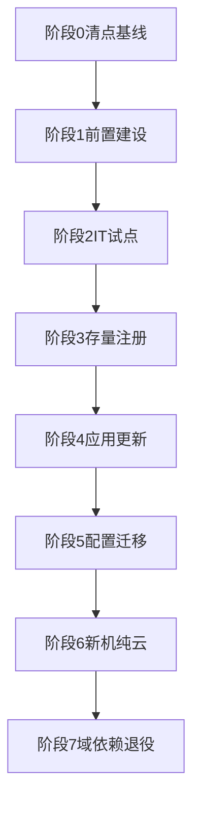
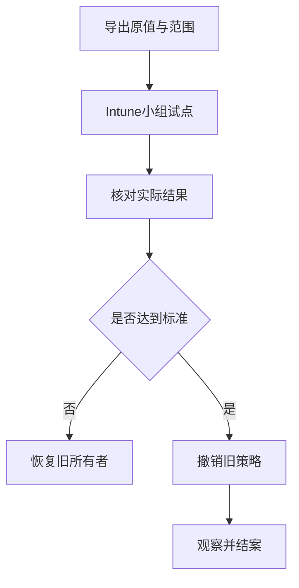
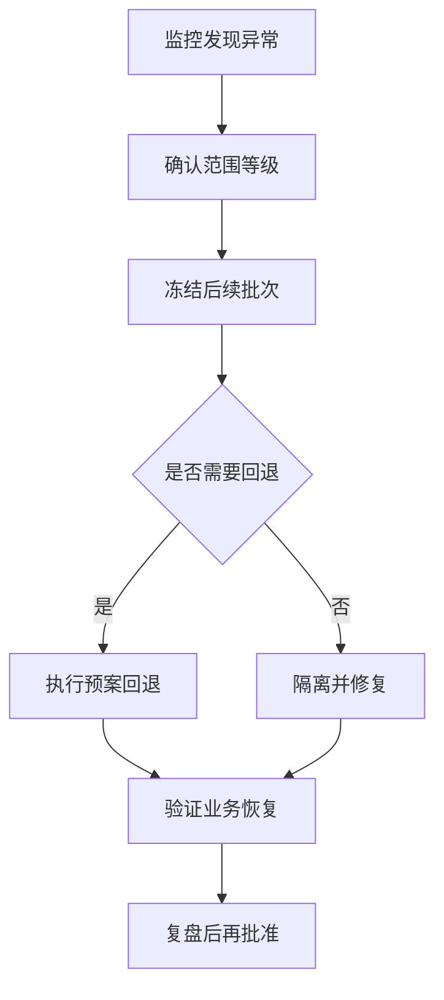

# 第7篇 Microsoft 365 E3 终端安装与管理 · 第11节 分阶段实施、回退与验收

> **本节小节：** 7.112 ～ 7.123。
> **导航：** [返回第7篇目录](README.md)｜上一节：[适合当前环境的组合方案](10-适合当前环境的组合方案.md)｜下一节：[小结与官方参考资料](12-小结与官方参考资料.md)

---

## 7.112 本节目标

本节把目标架构拆成八个可暂停、可验证、可回退的阶段：

0. 清点和基线；
1. 许可、身份与网络；
2. IT试点；
3. 存量设备自动注册；
4. 应用与更新迁移；
5. 配置迁移；
6. 新机纯云；
7. 域依赖退役。

每一阶段都必须具备四类信息：**入口条件、实施动作、验收证据、暂停/回退条件**。项目不能只按日历推进；前一阶段没有证据时，后一阶段不得用“先做再补”绕过阶段门。

> **占位标准：** 本节使用 `<目标成功率>`、`<最小观察期>`、`<最大严重故障数>`、`<批次设备数>` 等占位符。企业必须由业务、技术、安全和变更负责人结合设备数量、关键程度、支持能力、地区与维护窗口批准后替换。本文不写死一个对所有企业都合理的阈值。

## 7.113 阶段0：清点和基线

| 阶段要素 | 可执行要求 |
|---|---|
| 入口 | 项目范围、业务负责人、技术负责人、信息收集权限和数据保护要求已批准；不得在无授权时扫描或导出设备数据 |
| 动作 | 导出设备、用户、许可、Windows版本、基础Windows许可/激活来源、型号、位置、所有者、域/Entra加入、Intune注册、主要应用、更新、GPO、脚本、文件/打印/老系统依赖；新机采购记录区分OEM Windows Pro等合格基础许可与Windows Enterprise E3订阅升级权益；标记重复、陈旧、未知和永久离线设备 |
| 验收 | 设备清单与采购/AD/Entra抽样对账；每个关键应用和GPO有负责人；形成当前安装成功、更新版本、登录时长、故障量等可比较基线；数据字段和缺失率达到企业批准标准 |
| 暂停/回退 | 数据来源相互矛盾、关键设备无负责人、清点影响生产或涉及未批准个人数据时停止；撤销临时读取权限，删除未批准导出，并按数据处理流程报告 |

### 7.113.1 最低清点字段

| 对象 | 必填字段 | 用途 |
|---|---|---|
| 设备 | `<Device-ID>`、序列号、型号、Windows版本、基础Windows许可/激活来源、所有者、地点、网络、域/Entra/Intune状态、最后活动 | 分批、许可前提、兼容性、陈旧设备和重复对象治理 |
| 用户 | 角色、部门、许可状态、关键应用、远程/现场模式 | 设计用户分配和业务试点；不导出无关个人信息 |
| 应用 | 名称、版本、安装类型、静默参数、检测、依赖、卸载、数据影响、负责人 | Intune封装和回退 |
| GPO | 名称/GUID、链接、范围、筛选、设置、脚本、共享、负责人、备份 | 配置所有权和退役 |
| 遗留依赖 | 文件路径、打印队列、老系统、认证、VPN、DNS、服务账号、业务时段 | 纯云试点和域退役门槛 |

清点阶段只收集和核对，不以“顺便整理”为名删除设备对象、GPO、脚本、组或计算机账户。

## 7.114 阶段1：许可、身份与网络

| 阶段要素 | 可执行要求 |
|---|---|
| 入口 | 阶段0清单经批准；目标域名、身份源、网络负责人和试点用户已确定；已有配置已备份 |
| 动作 | 核对M365 E3准确SKU、Teams是否包含及Intune服务计划；验证Plan 1、Plan 2高级能力和未包含项；确认新购设备具有符合Product Terms的合格基础Windows许可（通常已激活OEM Windows Pro），再验证Enterprise订阅激活；用户/组/联系人按设计同步，生产混合设备对象用Connect Sync，Cloud Sync Device Sync预览仅在获批专项试点评估；配置/验证混合加入、MDM用户范围、注册限制、普通用户自动注册GPO的User Credential、Autopilot、管理员MFA/RBAC、紧急账号；测试互联网、代理、DNS、VPN、时间、证书和云端点 |
| 验收 | 正式报价、订单、服务计划与试点用户一致；试点用户许可可用；新机基础Windows激活与Enterprise订阅激活证据完整；测试设备能分别完成Entra身份、Intune注册和签入；自动MDM注册GPO实际值为批准的User Credential；登录前/后网络路径符合设计；紧急账号演练成功并有告警；网络和身份证据可复现 |
| 暂停/回退 | 同步产生重复/错误对象、注册入口被条件访问阻断、代理破坏TLS、域DNS异常或紧急访问不可用时立即停止；恢复同步范围、条件访问、代理/DNS/防火墙原配置，并保留故障时间线 |

### 7.114.1 高风险前置变更三联单

| 环节 | 身份/网络变更必须记录 |
|---|---|
| 准备 | 原配置导出、影响范围、维护窗口、第二管理员、紧急账号、回退脚本/步骤和业务通知 |
| 验证 | 新旧登录、OOBE、设备上下文、Intune签入、域资源、VPN、证书、DNS、日志与未命中对象 |
| 回退 | 触发人、批准人、恢复顺序、预计传播/刷新条件、恢复后复测和证据位置 |

## 7.115 阶段2：IT试点

| 阶段要素 | 可执行要求 |
|---|---|
| 入口 | 阶段1通过；已建立隔离试点组/OU、服务台流程和回退窗口；至少包含代表性型号、远程/现场网络和一台非关键纯云新机 |
| 动作 | 为IT设备分配基础应用、合规、更新环和最少配置；测试重启、锁屏、离线/重连、家庭网络、VPN、公司门户、Remote Help实际可用状态；执行文件、打印和老系统初测 |
| 验收 | 达到企业批准的 `<IT试点成功率>`；连续观察 `<IT最小观察期>`；严重故障不超过 `<IT最大严重故障数>`；平台状态、客户端日志和人工业务测试一致 |
| 暂停/回退 | 登录、网络、加密、关键应用、更新或数据访问出现不可接受影响时停止所有扩大；将设备移出新分配、暂停更新、恢复旧应用/配置或重置测试机到已知基线 |

IT试点设备不能只选最新型号和终端团队成员。应覆盖：普通办公型号、低带宽远程设备、VPN使用者、共享外设、业务插件、不同Windows版本和需要Windows集成身份验证的岗位。所有示例账号和数据均使用虚构测试信息。

## 7.116 阶段3：存量设备自动注册

| 阶段要素 | 可执行要求 |
|---|---|
| 入口 | IT试点稳定；混合Entra加入已在目标域/林验证；Connect Sync设备对象同步、MDM范围、许可、注册限制、自动注册GPO的User Credential和GPO备份完整；设备批次与原OU记录已批准 |
| 动作 | 将首批存量设备纳入混合加入和MDM自动注册GPO范围；普通用户场景保持User Credential，Device Credential仅用于微软明确支持的共管/AVD多会话等场景；等待客户端刷新/登录/计划任务处理；分别核对本地AD、Entra设备身份、GPO实际值和Intune管理状态；处理重复对象和失败码但不盲删对象 |
| 验收 | 每批达到 `<自动注册成功率>`，并观察 `<注册最小观察期>`；加入类型、管理机构、主用户、最近签入和基础策略正确；未注册设备均有原因、负责人和下一动作 |
| 暂停/回退 | 重复设备激增、登录受阻、GPO范围误命中、注册失败超过批准阈值或服务台积压超过能力时冻结后续批次；移回原OU/安全范围、恢复GPO原值，必要时撤销错误分配而非批量删除对象 |

### 7.116.1 注册失败队列

| 分类 | 先检查 | 处理原则 |
|---|---|---|
| 未混合加入 | `dsregcmd`状态、同步范围、SCP、网络、时间 | 修复身份链路，不重复创建计算机对象 |
| 已加入未注册 | MDM用户范围、许可、注册限制、GPO结果、Credential Type（普通用户应为User Credential）、计划任务、事件日志 | 区分用户许可、凭据类型与设备身份问题 |
| 已注册不签入 | 代理、防火墙、证书、时间、服务健康、设备最后活动 | 恢复云端连接并采集日志 |
| 重复/陈旧对象 | 序列号、设备ID、加入时间、最后活动、重置历史 | 先确认主对象和依赖，经审批再清理 |

## 7.117 阶段4：应用与更新迁移

| 阶段要素 | 可执行要求 |
|---|---|
| 入口 | 存量设备已形成稳定Intune管理关系；应用清单包含静默安装、检测、依赖、取代、卸载、数据和负责人；更新基线与业务冻结期明确 |
| 动作 | 按M365 Apps、低风险Win32、复杂Win32、MSI/Store、脚本顺序建立和试点；M365 Apps先决定是否阻塞ESP，不阻塞用内置类型、阻塞则用ODT/XML Win32并由IME跟踪；应用设置检测、依赖和卸载；更新按测试环到生产环迁移，评估Autopatch注册；停止旧GPO/脚本扩大但保留可回退源 |
| 验收 | 每个应用达到批准的 `<应用安装成功率>` 和 `<应用观察期>`；更新达到 `<更新合规标准>`；失败设备有分类；启动、插件、文件关联、用户数据、卸载和重装测试通过 |
| 暂停/回退 | 数据丢失、业务插件失效、重启失控、失败率越过批准阈值或更新引发兼容事故时暂停分配/环；恢复旧应用版本、旧安装源或旧更新所有者，并验证业务数据 |

### 7.117.1 应用迁移顺序与证据

1. 在干净测试设备验证静默安装、退出码、检测、依赖、重启、升级和卸载；
2. 用IT组分配 `Required` 或 `Available`，不要同时把同一设备放进安装与卸载组；
3. 查看Intune状态后，还要到客户端核对版本、日志、服务、快捷方式和业务启动；
4. 扩大业务试点并保持旧包、旧配置、用户数据备份和恢复说明；
5. 观察期通过后停止旧脚本/GPSI扩大，再处理旧源；
6. 旧源只在确认无设备依赖、无回退需求、保留期满足后审批删除。

> **高风险应用回退：** 准备已验证的卸载命令和旧版本包；验证用户数据、插件、文件关联和后台服务；回退时先停止扩大，再恢复旧版/配置，禁止直接删除云端应用对象来“止损”。

## 7.118 阶段5：配置迁移

| 阶段要素 | 可执行要求 |
|---|---|
| 入口 | 配置所有权矩阵已按单项设置建立；GPO报告、原值、范围和备份完整；目标Intune能力经支持性核对；冲突测试设备已准备 |
| 动作 | 按低风险用户体验、Office、更新、安全配置域逐项迁移；先让Intune在试点拥有设置，验证后将对应GPO改为未配置/移出范围；没有等价能力的保留有期限例外 |
| 验收 | 每项只有一个生产所有者；Intune状态、有效配置、注册表/策略来源和业务行为一致；重启、登录、离线/重连和远程场景通过；观察 `<配置最小观察期>` |
| 暂停/回退 | 策略冲突、设备锁定、网络/防火墙中断、加密恢复风险或安全基线造成关键应用失败时立即暂停；撤销新分配并恢复原GPO设置/链接，按刷新条件复测 |

配置迁移不要一次把整套安全基线照搬。账户、登录、网络、防火墙、证书、BitLocker、Defender和更新设置都属于高风险域，必须分别写准备、验证和回退；加密策略回退不等于自动解密设备，也不应为了回退而删除恢复密钥。

## 7.119 阶段6：新机纯云

| 阶段要素 | 可执行要求 |
|---|---|
| 入口 | IT和业务试点通过；文件服务器、域打印机、Windows集成身份验证老系统已有通过结果或批准的临时替代；新机合格基础Windows许可和激活证据可核对；Autopilot、ESP、Office是否阻塞ESP的应用设计和服务台流程稳定 |
| 动作 | 与供应商建立Autopilot注册、OEM Windows Pro等合格基础许可和交付核对；按批次发放Entra Join新机；不阻塞ESP的Office用内置类型在桌面后安装，阻塞ESP的Office使用ODT/XML Win32包；记录OOBE、基础/Enterprise激活、注册、ESP、应用、配置、更新、合规和用户数据迁移；不先入本地域 |
| 验收 | 每批达到 `<新机部署成功率>`，基础Windows激活、Enterprise订阅激活、ESP选择和Office安装结果均可追溯；在 `<新机观察期>` 内登录、办公、文件、打印、VPN和老系统均通过；失败设备有可恢复路径，用户获得快速手册和支持渠道 |
| 暂停/回退 | 供应商注册错误、动态组误命中、ESP阻塞、关键业务不可达或服务台无法承载时停止发机；撤销错误配置/分配，重新部署受影响测试机；业务连续性可临时使用已验证旧域机或远程应用入口 |

微软不建议把新设备继续采用混合加入或混合Autopilot作为终局。若一个关键业务尚未支持纯云设备，应优先保留少量已登记的旧域设备或提供受控替代入口，而不是把所有净新设备永久改回混合路线。

## 7.120 阶段7：域依赖退役

| 阶段要素 | 可执行要求 |
|---|---|
| 入口 | 对应应用/配置已由目标所有者稳定承接；文件、打印、老系统、服务账号、DNS、证书、脚本和计划任务依赖清单完整；业务和基础设施负责人批准退役窗口 |
| 动作 | 先停止新增依赖；按登录脚本、映射、打印、遗留应用、GPO链接、软件源、OU/组等逐项退役；GPO先备份与报告、取消链接并观察，再审批删除；AD整体退役另立项目 |
| 验收 | 无活动设备或业务访问被退役对象；日志/监控在批准观察期内无未知调用；备份、配置、权限、证据和恢复演练可用；CMDB、知识库和灾备文档已更新 |
| 暂停/回退 | 出现未知调用、登录延迟、文件/打印失败、认证降级或监控盲区时恢复旧链接/共享/服务入口；保持名称和数据不被提前删除，完成根因与依赖补录后再评审 |

### 7.120.1 退役顺序

1. 标记“禁止新增依赖”，公告冻结日期和负责人；
2. 通过日志、脚本清单、GPO报告、DNS/SMB/打印/认证记录找出调用者；
3. 迁移少量试点并观察，不先删除名称、数据、服务账号或SPN；
4. 备份GPO、脚本、共享ACL、队列、配置、证书和审计证据；
5. 取消链接、停止分配或改只读，按批准周期观察；
6. 业务、技术、安全共同签字后删除；
7. 更新监控、备份、恢复、许可和容量范围。

终端GPO减少不代表本地AD可以同时下线。只要文件、打印、Kerberos、DNS、服务账号、服务器或其他系统仍依赖AD，就必须继续按生产身份基础设施维护。

## 7.121 设备批次、成功率与观察期标准

### 7.121.1 批次设计模板

| 批次 | 设备范围 | 建议代表性 | 批次数量 | 成功率门槛 | 最小观察期 | 批准人 |
|---|---|---|---|---|---|---|
| Ring 0 | 终端/身份/网络IT | 多型号、现场与远程 | `<R0设备数>` | `<R0成功率>` | `<R0观察期>` | `<技术批准角色>` |
| Ring 1 | 支持团队与低风险业务 | 文件、打印、VPN、插件用户 | `<R1设备数>` | `<R1成功率>` | `<R1观察期>` | `<业务批准角色>` |
| Ring 2 | 代表性部门 | 各地点、岗位和网络 | `<R2设备数>` | `<R2成功率>` | `<R2观察期>` | `<变更委员会>` |
| Ring 3 | 普通生产批次 | 排除已批准例外 | `<R3设备数>` | `<R3成功率>` | `<R3观察期>` | `<项目负责人>` |
| 例外 | 关键/离线/不兼容设备 | 单独方案 | `<例外数>` | 不与普通批次混算 | `<例外复核期>` | `<风险接受角色>` |

上述数字必须由企业批准。批准时至少考虑：设备总量、关键程度、服务台每日处理能力、地区时差、应用复杂度、更新窗口、远程比例和回退耗时。

### 7.121.2 统一计算口径

- **分母**：本批次实际到达执行时间且满足前置条件的设备；因休假、报废、长期离线而未开始的设备单列，不得随意从失败中移除。
- **成功**：平台状态成功且客户端实际结果和业务测试通过；仅“策略已分配”不算成功。
- **失败**：达到预期处理时间后仍失败，或客户端/业务不通过；必须按安装、检测、网络、身份、兼容、用户取消等分类。
- **等待**：尚未签入、仍在允许处理窗口或等待重启；到期后必须转为成功、失败或经批准例外。
- **观察期**：从设备首次满足全部验收项后计算，至少跨过企业批准的重启、登录、后台签入、更新和业务高峰场景。
- **阶段门**：既看比例，也看严重性；即使总体成功率高，出现数据丢失、广泛登录失败或安全绕过也必须暂停。

## 7.122 事故响应、暂停与回退流程

### 7.122.1 事故流程

1. **发现与记录：** 记录首次时间、报告人、设备/用户/地点、变化项、错误、截图/日志位置，不在生产设备上反复试错覆盖证据。
2. **定级与通知：** 由值班角色按企业事故标准定级，通知项目、服务台、业务、安全、身份、网络和应用负责人。
3. **冻结：** 立即暂停后续组成员变更、应用分配、更新环扩大或GPO链接扩大；保留当前范围快照。
4. **止损：** 隔离错误策略/应用/更新，保护数据与凭据；需要时启用已批准业务连续性入口。
5. **决策：** 由授权角色依据严重性、范围、恢复时间和证据决定修复还是回退；实施人不独自批准高风险回退。
6. **回退：** 按预案逆序恢复唯一所有者、原分配、原GPO、旧应用或网络规则，并考虑Intune签入/GPO刷新不是实时的。
7. **验证：** 抽样及受影响设备复测登录、网络、数据、应用、更新、打印、文件和安全状态。
8. **复盘：** 写根因、影响、时间线、修复、监控缺口和预防动作；未经重新批准不得恢复扩大。

### 7.122.2 回退执行卡

| 字段 | 必填内容 |
|---|---|
| 变更/事故号 | `<CHG/INC-ID>` |
| 当前与目标所有者 | `<Domain GPO>` → `<Intune>` |
| 受影响范围 | 组、OU、筛选器、设备清单、地区和业务 |
| 准备 | 原值/备份、旧包、紧急账号、维护窗口、通知、第二管理员 |
| 回退动作 | 按顺序写撤销新分配、恢复旧配置、同步/刷新/重启条件 |
| 验证 | 平台状态、客户端日志、有效配置、业务动作和安全检查 |
| 成功标准 | `<企业批准的恢复标准>` |
| 升级条件 | `<超时/影响扩大/数据或安全事件条件>` |
| 证据位置 | `<受控工单或文档库>` |

不要把批量删除Entra/Intune设备、AD计算机对象、GPO或应用对象作为通用回退。这些动作可能破坏身份、审计、BitLocker密钥关联和根因证据，必须另行审批。

## 7.123 验收矩阵、交付物与30/60/90天复核

### 7.123.1 最终验收矩阵

| 验收域 | 验收项目 | 证据 | 通过标准 | 失败处置 |
|---|---|---|---|---|
| 许可 | E3准确SKU、Teams是否包含、Plan 1、Plan 2高级能力、未包含项、Windows基础许可/订阅升级边界 | 正式报价、订单、服务计划导出、设备激活与采购台账 | 与实际租户、设备基础许可和批准范围一致 | 修正许可/范围，不用试用掩盖缺口 |
| 身份 | Entra Join、混合加入、重复对象、管理员MFA | Entra状态、登录/审计日志 | 每条路线身份正确且可追溯 | 冻结注册，修复同步/范围 |
| Intune注册 | 管理机构、主用户、签入、策略 | 设备报表、客户端日志 | 达到批准门槛且失败有归属 | 保留旧管理路径并修复 |
| 应用 | 安装、检测、依赖、取代、更新、卸载 | Intune状态、版本、安装日志、业务测试 | 平台与实际结果一致 | 停止扩大，恢复旧版/包 |
| 更新 | 环、版本、重启、暂停和回退 | 更新报表、版本抽查、事件 | 符合批准合规和业务窗口 | 暂停环，恢复旧所有者 |
| 配置 | 唯一所有者、冲突、重启/离线结果 | 所有权矩阵、报告、有效值 | 无长期双写，业务与安全通过 | 撤销新策略，恢复原GPO |
| 合规/访问 | 合规原因、条件访问、紧急账号 | 合规报表、登录日志、演练 | 访问控制不误阻断且可应急 | 使用批准排除并修复条件 |
| 遗留业务 | 文件、打印、WIA老系统 | 测试脚本、日志、业务签字 | 现场与远程代表场景通过 | 保留域机/替代入口 |
| 运维 | RBAC、审计、告警、备份、恢复和服务台 | 角色导出、工单、演练报告 | 第二人可按文档复现 | 补文档、培训或演练 |
| 退役 | GPO、脚本、共享和域依赖 | 依赖表、监控、备份、批准 | 无未知调用，恢复路径可用 | 恢复入口并补清点 |

### 7.123.2 最终交付物清单

- [ ] 批准的目标架构与架构决策记录；
- [ ] 设备、用户、应用、GPO和遗留依赖清单；
- [ ] 许可与租户服务计划核对表；
- [ ] 网络、代理、DNS、VPN、证书和端点验证记录；
- [ ] 组、OU、动态规则、包含/排除和范围标签设计；
- [ ] 新机Autopilot配置、合格基础Windows许可核对、ESP、Office阻塞/非阻塞选择、应用与操作手册；
- [ ] 存量混合加入、Connect Sync设备对象同步和GPO自动注册设计（含User Credential）、GPO备份与报告；
- [ ] 应用包、检测、依赖、取代、卸载和回退说明；
- [ ] 更新环/Autopatch评估、暂停与恢复方案；
- [ ] 配置所有权矩阵和冲突验证记录；
- [ ] 文件服务器、域打印机和WIA老系统试点报告；
- [ ] 批次清单、成功率、观察期和失败队列；
- [ ] 事故响应、业务连续性、回退执行卡和演练报告；
- [ ] 管理员与服务台培训、用户快速手册和知识库；
- [ ] 验收签字、例外台账、风险接受和退役路线图。

### 7.123.3 上线后30/60/90天复核

| 时间 | 重点复核 | 输出 |
|---|---|---|
| 30天 | 注册/签入、应用和更新失败、策略冲突、条件访问误阻断、服务台工单、文件/打印/老系统稳定性 | 失败根因Top清单、快速修复、批次门槛调整建议 |
| 60天 | 例外组、长期离线/陈旧设备、GPO与Intune双写、应用版本、更新环、RBAC和审计 | 例外清理、所有权修正、权限复核与第二轮培训 |
| 90天 | 目标架构达成度、域依赖减少、成本/支持量、恢复演练、许可服务计划与退役优先级 | 90天运营报告、下一季度迁移/退役计划和风险接受更新 |

- [ ] 7.112～7.123编号连续且八个实施阶段均有入口、动作、验收和暂停/回退。
- [ ] 所有成功率、设备数和观察期均使用企业批准值，没有照抄不合理通用阈值。
- [ ] 高风险身份、网络、应用、配置和退役操作均有准备、验证、回退。
- [ ] 事故流程能够冻结范围、保护证据、恢复业务并重新审批。
- [ ] 验收同时检查平台状态、客户端实际结果和业务行为。
- [ ] 最终交付物已有负责人、保存位置、版本和复核日期。
- [ ] 30/60/90天复核已进入日历和责任矩阵。

> **下一节：** [小结与官方参考资料](12-小结与官方参考资料.md)，确认最终选型、交付物和长期官方复核入口。