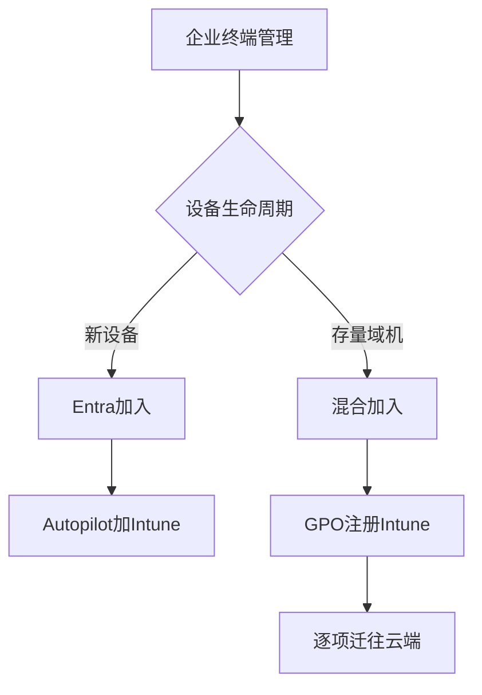

# 第7篇 Microsoft 365 E3 终端安装与管理 · 第12节 小结与官方参考资料

> **本节小节：** 7.124 ～ 7.128。
> **导航：** [返回第7篇目录](README.md)｜上一节：[分阶段实施、回退与验收](11-分阶段实施回退与验收.md)｜[返回全书目录](../README.md)

---

## 7.124 本篇结论

本企业最终选型是：**Intune为目标主平台，域组策略承担存量域设备和遗留依赖的有期限过渡，本地组策略只用于实验、故障隔离和极少数永久离线例外。**

最终路线如下：

1. **新设备：** 采购注册 Windows Autopilot，用户开箱后完成 Microsoft Entra Join、Intune自动注册、应用、配置、合规和更新；不把混合加入或混合Autopilot继续作为新机终局。
2. **存量域设备：** 保持本地AD域关系，完成混合 Microsoft Entra Join，再由域GPO自动注册Intune；按应用、更新、配置和安全域逐项迁移。
3. **遗留域依赖：** 登录脚本、映射驱动器、域打印机、遗留应用和Windows集成身份验证老系统暂由域GPO/本地AD支撑，但每项必须有负责人、业务理由、验证、回退和退役日期。
4. **本地组策略：** 不作为企业推送平台。实验结束恢复原值；永久离线例外必须另有补丁、日志、介质、安全和人工巡检方案。
5. **冲突治理：** 一项设置只有一个生产所有者。Intune、域GPO、本地策略、Office云策略或脚本不得长期同时写同一设置。
6. **处理时机：** Intune依赖设备联网和异步签入；域GPO依赖域客户端在启动、登录、后台刷新或人工触发时拉取；本地策略由单机处理。三者都不是实时遥控。

### 7.124.1 Microsoft 365 E3一致边界

以本书 **2026-08-28** 为时间基线，并以购买渠道、区域、订阅时间和租户实际服务计划为最终依据：

| 能力/产品 | 本篇最终口径 |
|---|---|
| Intune Plan 1 | 应用、配置、合规、设备、更新、Autopilot等主体能力；普通M365 Apps、Win32、MSI和Store应用不要求Plan 2 |
| Intune Plan 2 | 2026夏季起进入E3相关包装的高级叠加层；当前范围包括Remote Help、Advanced Analytics、Tunnel for MAM、受支持Android FOTA、特色设备管理等，示例并非穷举 |
| Remote Help | Plan 2高级能力；租户中可能分列服务计划，仍需双方许可、角色、范围、客户端和审计配置，不是实时策略推送 |
| Advanced Analytics | Plan 2高级能力；租户中可能分列服务计划，仍需设备、数据和隐私前提 |
| Windows Autopatch | 许可层面可用；Windows Enterprise E3是订阅升级权益，设备仍需合格基础Windows许可并满足服务先决条件 |
| Endpoint Privilege Management | **E3不包含**，需要单独许可或适用套件 |
| Cloud PKI | **E3不包含**，需要单独许可或适用套件 |
| Enterprise App Management | **E3不包含**，需要单独许可或适用套件 |
| Microsoft Teams | 按准确SKU判断：E3 with Teams已包含；E3 (no Teams)需要另配适用Teams产品 |

## 7.125 为什么不是三选一

“三选一”会忽略设备生命周期、网络、身份和业务依赖：

| 如果只选 | 短期看似好处 | 实际缺口 | 本企业处理方式 |
|---|---|---|---|
| 只用Intune | 云端统一、适合远程和多平台 | 文件/打印/Kerberos老系统等依赖不会因创建Intune策略而自动消失；存量设备也不能无验证强制退域 | Intune做目标平台，先用双轨消化遗留依赖 |
| 只用域GPO | 复用现有AD，域内Windows配置成熟 | 远程可达性、跨平台、应用状态、合规和纯云新机终局不足；还需维护域控、DNS、SYSVOL和VPN | 只保留自动注册和有期限遗留项，逐项迁移 |
| 只用本地组策略 | 单机不依赖云或域 | 无集中分配、状态、审计、重试和规模化治理；设备越多人工成本越高 | 仅用于实验、隔离和永久离线例外 |

因此，组合方案不是让三个平台长期重复管理同一件事，而是让它们在不同阶段各负其责：

- **设备维度：** 新机直接纯云，存量域机平稳过渡；
- **工作负载维度：** 应用、更新、合规和现代配置迁Intune，遗留域依赖暂留GPO；
- **设置维度：** 每项配置唯一所有者，迁移时短期重叠必须有结束日期；
- **风险维度：** 每个高风险变更都写准备、验证和回退，并用批次与观察期控制影响；
- **退役维度：** 先停止新增依赖，再监控、备份、取消链接、观察，最后审批删除。

> **决策检查：** 如果某项能力“在Intune能找到相似名称”，仍要验证平台、Windows版本、设备身份、策略语义和回退；如果没有受支持等价能力，应保留有期限例外，而不是强行迁移或长期双写。

## 7.126 Microsoft官方参考资料

以下均为 Microsoft 官方入口。云服务、许可、支持矩阵和页面路径会变化；实施前应重新打开链接，核对页面更新时间、适用平台、先决条件、租户消息中心和实际服务计划。下列说明是便于定位的中文摘要，不替代原文。

### 7.126.1 Intune许可与高级能力

1. [Microsoft Intune定价](https://www.microsoft.com/en-us/security/business/microsoft-intune-pricing)：核对Plan 1、Plan 2和附加产品的商业包装。
2. [Microsoft Intune许可](https://learn.microsoft.com/en-us/intune/fundamentals/licensing)：核对Plan 1、Plan 2及Remote Help、Advanced Analytics等高级能力的当前归类，并与租户分列服务计划交叉验证。
3. [Intune高级能力](https://learn.microsoft.com/en-us/intune/fundamentals/advanced-capabilities)：核对高级能力与附加功能边界。
4. [2026 Microsoft 365包装与定价更新](https://www.microsoft.com/en-us/licensing/news/2026-M365-Packaging-Pricing-Updates)：复核2026年Microsoft 365相关包装变化。
5. [Intune服务说明](https://learn.microsoft.com/en-us/intune/fundamentals/what-is-intune)：了解Intune服务范围与能力概览。
6. [Microsoft Intune Suite附加能力](https://learn.microsoft.com/en-us/mem/intune/fundamentals/intune-add-ons)：区分基础计划与附加产品。

### 7.126.2 Intune应用与脚本

7. [在Intune中添加Microsoft 365 Apps](https://learn.microsoft.com/en-us/intune/intune-service/apps/apps-add-office365)：核对内置应用类型配置，并遵守“Office若作为Autopilot ESP跟踪/阻塞应用，应以ODT/XML封装Win32；若不阻塞ESP，可在桌面后使用内置类型安装”的官方建议。
8. [在Intune中部署Windows应用](https://learn.microsoft.com/en-us/intune/intune-service/apps/apps-windows-10-app-deploy)：Windows应用部署类型和基本流程。
9. [添加、分配和监视Win32应用](https://learn.microsoft.com/en-us/intune/intune-service/apps/apps-win32-add)：Win32封装、要求、检测、依赖和分配。
10. [Win32应用管理](https://learn.microsoft.com/en-us/intune/intune-service/apps/apps-win32-app-management)：Win32生命周期与管理说明。
11. [添加Microsoft Store应用](https://learn.microsoft.com/en-us/mem/intune/apps/store-apps-microsoft)：使用新的Microsoft Store应用类型。
12. [在Intune中使用PowerShell脚本](https://learn.microsoft.com/en-us/mem/intune/apps/intune-management-extension)：了解Intune Management Extension与脚本/Win32处理基础。
13. [监视应用信息和分配](https://learn.microsoft.com/en-us/mem/intune/apps/apps-monitor)：核对应用安装状态和监视入口。

### 7.126.3 Intune注册与Windows自动注册

14. [Windows设备注册指南](https://learn.microsoft.com/en-us/mem/intune/enrollment/windows-enroll)：Windows注册方法和管理入口。
15. [Windows注册方法](https://learn.microsoft.com/en-us/mem/intune/enrollment/windows-enrollment-methods)：比较不同Windows注册方式及适用场景。
16. [使用组策略自动注册Windows设备](https://learn.microsoft.com/en-us/windows/client-management/mdm/enroll-a-windows-10-device-automatically-using-group-policy)：普通已许可用户场景选择User Credential；Device Credential仅用于微软明确支持的Configuration Manager共管、AVD多会话等有限场景。
17. [Microsoft Entra设备加入类型](https://learn.microsoft.com/en-us/entra/identity/devices/concept-directory-join)：区分Entra Join、混合加入和注册。
18. [规划混合Microsoft Entra加入](https://learn.microsoft.com/en-us/entra/identity/devices/hybrid-join-plan)：规划存量域设备的混合加入前置；生产设备对象同步使用Microsoft Entra Connect Sync。
- [Cloud Sync Device Sync](https://learn.microsoft.com/en-us/entra/identity/hybrid/cloud-sync/device-sync)：仅在租户已开放、官方仍支持并完成专项试点时评估当前预览路径，不作为本项目生产基线。
19. [排查混合Microsoft Entra加入](https://learn.microsoft.com/en-us/entra/identity/devices/troubleshoot-hybrid-join-windows-current)：定位当前Windows设备混合加入问题。

### 7.126.4 Windows Autopilot

20. [Windows Autopilot概述](https://learn.microsoft.com/en-us/autopilot/overview)：了解Autopilot的定位和核心流程。
21. [Windows Autopilot设备注册概述](https://learn.microsoft.com/en-us/autopilot/registration-overview)：核对设备注册来源与管理方式。
22. [创建和分配Autopilot部署配置文件](https://learn.microsoft.com/en-us/autopilot/profiles)：设计OOBE和加入配置。
23. [Autopilot用户驱动模式](https://learn.microsoft.com/en-us/autopilot/user-driven)：实施用户开箱部署。
24. [Autopilot Enrollment Status Page](https://learn.microsoft.com/en-us/autopilot/enrollment-status)：控制注册期间应用和策略状态体验。
25. [Autopilot已知问题](https://learn.microsoft.com/en-us/autopilot/known-issues)：上线前复核当前限制和已知问题。

### 7.126.5 Windows更新与Autopatch

26. [Intune中的Windows更新管理](https://learn.microsoft.com/en-us/mem/intune/protect/windows-update-for-business-configure)：Windows Update for Business策略入口。
27. [Windows更新环策略](https://learn.microsoft.com/en-us/mem/intune-service/protect/windows-10-update-rings)：配置延期、截止时间、重启和暂停。
28. [Windows功能更新策略](https://learn.microsoft.com/en-us/mem/intune/protect/windows-10-feature-updates)：控制目标功能版本。
29. [Windows驱动程序更新策略](https://learn.microsoft.com/en-us/intune/device-updates/windows/driver-updates-policy)：评估和部署驱动更新。
30. [Windows Autopatch概述](https://learn.microsoft.com/en-us/windows/deployment/windows-autopatch/overview/windows-autopatch-overview)：核对Autopatch服务定位、注册和先决条件。
- [Windows订阅激活](https://learn.microsoft.com/en-us/windows/deployment/windows-subscription-activation)：核对Windows Enterprise E3是基于合格基础Windows的订阅升级权益，不能替代新机基础许可。

### 7.126.6 Remote Help与Endpoint Analytics

31. [Microsoft Intune Remote Help](https://learn.microsoft.com/en-us/mem/intune/fundamentals/remote-help)：核对Remote Help平台、客户端、角色与会话能力。
32. [Endpoint Analytics概述](https://learn.microsoft.com/en-us/intune/endpoint-analytics/)：了解终结点分析的数据与体验入口。
33. [Advanced Analytics](https://learn.microsoft.com/en-us/intune/advanced-analytics)：核对高级分析能力及前置。

### 7.126.7 GPO架构、处理与结果

34. [组策略概述](https://learn.microsoft.com/en-us/windows-server/identity/ad-ds/manage/group-policy/group-policy-overview)：了解AD域组策略的核心对象和管理方式。
35. [组策略处理](https://learn.microsoft.com/en-us/windows-server/identity/ad-ds/manage/group-policy/group-policy-processing)：复核策略作用范围与客户端处理逻辑。
36. [组策略结果工具](https://learn.microsoft.com/en-us/windows-server/identity/ad-ds/manage/group-policy/group-policy-modeling-results)：了解建模与结果证据。
37. [Group Policy Analytics](https://learn.microsoft.com/en-us/mem/intune/configuration/group-policy-analytics)：分析GPO并评估迁移到Intune的支持情况。
38. [MDM策略CSP中的ADMX支持策略](https://learn.microsoft.com/en-us/windows/client-management/understanding-admx-backed-policies)：理解部分ADMX设置与MDM策略映射边界。

### 7.126.8 GPO软件安装与ADMX中央存储

39. [使用组策略安装软件](https://learn.microsoft.com/en-us/troubleshoot/windows-server/group-policy/use-group-policy-to-install-software)：通过Group Policy Software Installation部署合适MSI的官方步骤。
40. [创建和管理组策略管理模板中央存储](https://learn.microsoft.com/en-us/troubleshoot/windows-client/group-policy/create-and-manage-central-store)：建立PolicyDefinitions中央存储并治理ADMX/ADML。
41. [下载Windows管理模板](https://www.microsoft.com/en-us/download/details.aspx?id=104677)：取得Windows管理模板时核对适用版本与下载说明。
42. [下载Microsoft 365 Apps管理模板](https://www.microsoft.com/en-us/download/details.aspx?id=49030)：取得Office ADMX/ADML与相关管理文件。

### 7.126.9 ODT与Microsoft 365 Apps部署

43. [Office Deployment Tool概述](https://learn.microsoft.com/en-us/microsoft-365-apps/deploy/overview-office-deployment-tool)：了解ODT下载、配置和部署流程。
44. [Office Deployment Tool配置选项](https://learn.microsoft.com/en-us/microsoft-365-apps/deploy/office-deployment-tool-configuration-options)：核对XML元素、属性和取值。
45. [Office Deployment Tool下载](https://www.microsoft.com/en-us/download/details.aspx?id=49117)：取得ODT安装文件。
46. [Microsoft 365 Apps更新频道概述](https://learn.microsoft.com/en-us/microsoft-365-apps/updates/overview-update-channels)：选择并治理更新频道。
47. [部署Microsoft 365 Apps语言](https://learn.microsoft.com/en-us/microsoft-365-apps/deploy/overview-deploying-languages-microsoft-365-apps)：规划语言包、校对工具和后续语言变更。
48. [Microsoft 365 Apps部署指南](https://learn.microsoft.com/en-us/microsoft-365-apps/deploy/deployment-guide-microsoft-365-apps)：复核部署规划、源、配置和运维流程。

> **使用方法：** 先查许可与服务说明，再查目标功能的部署页，最后查监视/故障页；记录访问日期、页面更新时间、适用平台和关键结论。不要只保存二手截图或把搜索摘要当作实施依据。

## 7.127 最终交付物

本篇完成不以“文档写完”为标准，而以以下交付物经过负责人确认、版本受控、能够被第二位管理员复现为标准。

| 交付类别 | 必须包含 | 负责人占位 | 复核频率 |
|---|---|---|---|
| 架构与决策 | 目标图、双轨路线、平台责任边界、架构决策记录 | `<架构负责人>` | 每半年或重大变化 |
| 资产与依赖 | 设备、用户、应用、GPO、脚本、文件/打印/老系统依赖 | `<资产负责人>` | 每月增量、每季全量 |
| 许可 | SKU、服务计划、Plan 1/2、附加产品、Teams边界、证据日期 | `<许可负责人>` | 采购/续约/包装变化时 |
| 身份与注册 | Entra加入、混合加入、MDM范围、Autopilot、对象治理 | `<身份负责人>` | 每月及服务变更时 |
| 网络 | 云端点、代理、DNS、VPN、带宽、证书、验证记录 | `<网络负责人>` | 每季及网络变更时 |
| 组和范围 | OU、Entra组、动态规则、包含/排除、筛选器、范围标签 | `<平台负责人>` | 每月 |
| 应用 | 包、参数、检测、依赖、取代、卸载、版本、数据与回退 | `<应用负责人>` | 每次版本变化 |
| 更新 | 更新环、功能版、驱动、Autopatch评估、暂停与恢复 | `<更新负责人>` | 每月发布周期 |
| 配置所有权 | 当前/目标所有者、试点、验证、回退、退役日 | `<配置负责人>` | 每次迁移及每月冲突检查 |
| 遗留试点 | 文件、域打印、WIA老系统用例、日志和业务签字 | `<业务负责人>` | 每次架构/应用变化 |
| 安全与运维 | RBAC、MFA、紧急账号、审计、告警、备份、恢复演练 | `<安全负责人>` | 每月/季度 |
| 实施与验收 | 批次、成功率、观察期、失败队列、事故、验收矩阵 | `<项目负责人>` | 每批和项目结案 |
| 支持与培训 | 管理员手册、服务台知识库、用户快速手册、升级路径 | `<支持负责人>` | 每季及流程变化 |
| 例外与退役 | 永久离线/不兼容例外、风险接受、到期日、域依赖路线图 | `<风险负责人>` | 每月到期复核 |

### 7.127.1 交付物质量要求

- 每份文档有名称、版本、所有者、批准人、日期、适用范围和下次复核日；
- 所有示例和测试数据均为虚构，不保存密码、访问令牌、恢复密钥或无关个人信息；
- 配置导出和截图要能关联变更号、时间、租户/环境和对象名称；
- GPO备份之外还要保存链接、顺序、筛选、WMI、委派、脚本和共享依赖；
- 应用不仅保存安装包，还要保存来源、哈希/签名、静默参数、检测、卸载、旧版和供应链审批；
- 回退必须经过演练，不能只写“恢复备份”；
- 交付仓库实行最小权限、版本控制、保留策略和离线/异地恢复验证；
- 项目结案后把临时个人文件迁入受控仓库并按规则清理。

## 7.128 后续复核清单

### 7.128.1 30/60/90天与持续复核

| 周期 | 复核重点 | 必须回答的问题 |
|---|---|---|
| 上线后30天 | 注册、签入、应用、更新、配置、访问和工单 | 哪类设备失败最多？是平台状态还是实际业务失败？是否需要调整批次门槛？ |
| 上线后60天 | 例外、双写、陈旧设备、RBAC、审计、知识库 | 哪些例外已到期？哪些设置仍被Intune和GPO同时写？服务台能否独立处理常见故障？ |
| 上线后90天 | 架构目标、域依赖、成本、恢复、下一波迁移 | 新机是否真正纯云？哪些域依赖可退役？恢复演练和证据是否通过？ |
| 每月 | 许可分配、注册失败、应用失败、更新环、动态组、例外到期 | 是否出现新失败模式、误分配或无负责人对象？ |
| 每季度 | 服务计划、官方文档、权限、紧急账号、GPO/脚本、恢复抽测 | 2026新增能力是否已在租户可用？三项未包含产品是否被误用？ |
| 每半年 | 目标架构、总拥有成本、域退役、培训和供应商流程 | 组合方案是否仍合理？能否进一步缩小GPO和永久离线范围？ |
| 重大变更时 | Windows版本、许可包装、网络、身份、关键应用和并购 | 原先支持矩阵、门槛和回退是否仍成立？ |

### 7.128.2 最终自检

- [ ] 最终选型明确为Intune主平台、域GPO过渡、本地策略例外，并解释了为什么不三选一。
- [ ] 新设备采用Entra Join + Autopilot + Intune，未把混合加入/混合Autopilot作为终局。
- [ ] 存量域设备采用混合Entra加入并由域GPO自动注册Intune。
- [ ] 文件、域打印机和Windows集成身份验证老系统已有真实业务试点证据。
- [ ] 每个配置项只有一个生产所有者，短期迁移重叠有截止日期。
- [ ] Intune、域GPO和本地策略均未被描述为实时遥控。
- [ ] Plan 1、Plan 2及其Remote Help、Advanced Analytics等高级能力、Autopatch和三项未包含附加产品口径一致。
- [ ] 已按准确SKU确认Teams是否包含；no-Teams组合已配适用Teams产品，含Teams组合未重复采购。
- [ ] 新机已核对合格基础Windows许可；存量自动MDM注册普通用户场景使用User Credential。
- [ ] Microsoft 365 Apps已按是否阻塞ESP选择内置类型或ODT/XML Win32，并完成OOBE试点。
- [ ] 生产混合设备对象使用Connect Sync；Cloud Sync Device Sync预览仅按批准试点评估。
- [ ] 八个实施阶段均有入口、动作、验收、暂停/回退和企业批准门槛。
- [ ] 所有高风险步骤都有准备、验证和回退，没有用批量删除对象代替恢复。
- [ ] 官方链接按许可、应用、注册、Autopilot、更新、远程协助/分析、GPO和ODT分类。
- [ ] 最终交付物、负责人、版本、证据位置和复核频率完整。
- [ ] 30/60/90天及持续复核已进入日历，并由指定角色负责。

> **本篇结束：** 以后新增应用、设备类型或安全设置时，先确认许可和官方支持，再更新配置所有权矩阵，经过试点、观察和回退演练后投入生产。

Content was rephrased for compliance with licensing restrictions.