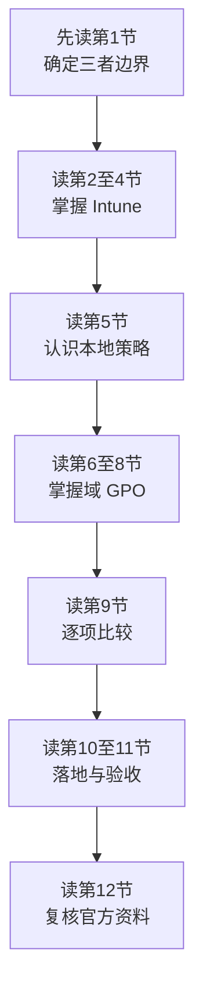

# 第7篇 Microsoft 365 E3 终端安装与管理：Intune、本地组策略与域组策略

> **本篇作用：** 分别讲清 Intune（含 Plan 2）、本地组策略、域组策略对 Microsoft 365 E3 软件推送安装和长期管理的作用，并给出适合“已有本地 AD 域、逐步走向纯云、净新订阅”环境的组合方案。
> **本篇性质：** 专题实施篇。既不把三种技术混成同一种工具，也不把 Intune 的基础能力误写成 Plan 2 专属能力。
> **文档状态：** 正文已完成（12 个小节文件，7.1～7.128）。
> **版本与复核日期：** v1.0，2026-08-28。
> **许可基线：** Microsoft 365 E3；Teams是否包含按地区、渠道与正式报价中的准确SKU确认，不能仅凭“净新订阅”判断。
> **导航：** [返回方案总目录](../README.md)｜上一篇：[第6篇 上线、运维与培训](../06-上线运维与培训/README.md)

---

## 一、先给结论

1. **Intune 是未来的企业主平台。** 新电脑采用 Microsoft Entra Join + Windows Autopilot + Intune；M365 Apps、Win32、MSI、Microsoft Store 应用、配置、合规与更新均以 Intune 为主。
2. **Intune Plan 2 不是“Intune 的全部能力”。** M365 Apps 和普通 Windows 应用推送、配置策略、合规策略等主体能力来自 Intune Plan 1；Plan 2 是高级叠加层，当前包括 Remote Help、Advanced Analytics、Tunnel for MAM、受支持 Android FOTA、特色设备管理等。租户后台可能分列服务计划，但产品能力边界不能因此误拆。
3. **本地组策略不是企业集中平台。** `gpedit.msc` 只管理当前这一台 Windows，适合试验、故障隔离和极少数长期离线例外，不能从管理员电脑集中推送到全公司。
4. **域组策略是过渡期的重要平台。** 它可集中管理已加入本地 AD 域的 Windows，适合登录脚本、映射驱动器、域打印机、遗留应用和 Intune 自动注册；但离开域网络后的可见性、状态报表和跨平台能力弱于 Intune。
5. **不要让同一设置长期由 Intune 和域 GPO 同时下发。** 每个配置项必须指定唯一“配置所有者”，完成试点、迁移、验证后再停用旧策略。
6. **本企业推荐双轨过渡。** 存量域电脑保留域 GPO 并自动注册 Intune；新购电脑直接走纯云。随着遗留依赖减少，逐批把配置所有权从域 GPO 迁到 Intune。

---

## 二、本篇12节

| 顺序 | 文件 | 覆盖小节 | 主要内容 | 读完要回答的问题 |
|---:|---|---|---|---|
| 1 | [三种技术的关系与本篇结论](01-三种技术的关系与本篇结论.md) | 7.1–7.8 | 三种技术定义、控制范围、总体选型 | 三者分别是什么、该用谁？ |
| 2 | [Intune Plan 1 与 Plan 2 技术边界](02-Intune-Plan1与Plan2技术边界.md) | 7.9–7.18 | 架构、许可、设备身份、E3边界 | Plan 1、Plan 2 各自负责什么？ |
| 3 | [Intune 推送安装](03-Intune推送安装.md) | 7.19–7.31 | M365 Apps、Win32、MSI、Store、脚本、检测与报表 | 如何可靠推送、确认成功并回退？ |
| 4 | [Intune 长期管理](04-Intune长期管理.md) | 7.32–7.44 | 配置、合规、更新、远程操作、Remote Help、Analytics、Autopatch | 安装后如何持续管理？ |
| 5 | [本地组策略](05-本地组策略.md) | 7.45–7.53 | `gpedit.msc`、单机配置、安装边界与局限 | 为什么它不能代替企业推送平台？ |
| 6 | [域组策略架构与生效机制](06-域组策略架构与生效机制.md) | 7.54–7.65 | AD、GPMC、GPO、SYSVOL、LSDOU、筛选、回环、ADMX | 域 GPO 如何找到对象并决定胜负？ |
| 7 | [域组策略推送安装](07-域组策略推送安装.md) | 7.66–7.78 | MSI、ODT、启动脚本、计划任务、权限、幂等与回退 | 如何给域电脑安装 M365 Apps？ |
| 8 | [域组策略长期管理与排查](08-域组策略长期管理与排查.md) | 7.79–7.90 | 配置治理、变更、`gpupdate`、`gpresult`、事件日志 | 如何维护和定位策略未生效？ |
| 9 | [三种技术逐项对比](09-三种技术逐项对比.md) | 7.91–7.100 | 安装、管理、网络、设备、报表、回退、成本对比 | 每个维度谁更适合？ |
| 10 | [适合当前环境的组合方案](10-适合当前环境的组合方案.md) | 7.101–7.111 | 存量混合、新机纯云、配置所有权、遗留依赖 | 本企业最终架构是什么？ |
| 11 | [分阶段实施、回退与验收](11-分阶段实施回退与验收.md) | 7.112–7.123 | 清点、试点、分批、回退、验收表 | 如何安全实施且不影响办公？ |
| 12 | [小结与官方参考资料](12-小结与官方参考资料.md) | 7.124–7.128 | 决策摘要、交付物、官方链接 | 如何复核能力和长期维护？ |

---

## 三、建议阅读顺序

---

## 四、本篇必须形成的交付物

- [ ] 设备清单：域加入状态、Windows版本、所有者、地点、网络可达性。
- [ ] 应用清单：安装方式、安装参数、检测规则、卸载参数、负责人。
- [ ] 三种平台的适用范围表。
- [ ] Intune 与域 GPO 的“配置所有权矩阵”。
- [ ] 存量设备混合管理方案。
- [ ] 新设备 Entra Join + Autopilot 标准流程。
- [ ] M365 Apps 推送试点记录和失败设备清单。
- [ ] 域 GPO 依赖清单及迁移优先级。
- [ ] 回退方案、验收记录和例外台账。

---

## 五、阅读边界

- 第4篇仍负责 Office、Teams 和文件协作的业务配置；本篇聚焦**终端侧安装与长期管理平台**。
- 第5篇仍负责安全、合规和设备管理总原则；本篇把 Intune 与两类组策略做技术深化。
- 本篇中的微软许可、产品界面和服务能力会变化，实施前必须按第12节官方链接复核租户实际服务计划。
- 所有示例租户、域名、服务器、共享路径和账号均为虚构占位，不保存真实密码或密钥。
