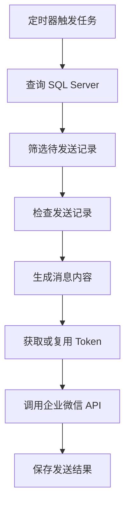
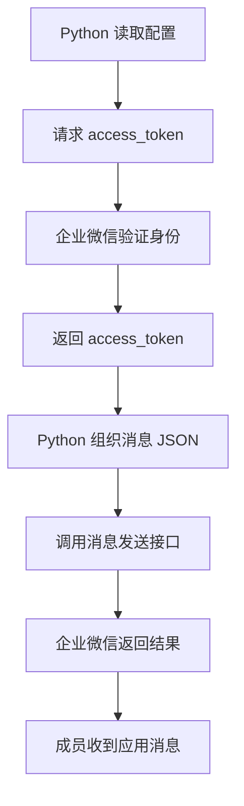

# Python 调用企业微信应用消息 API：从入门到定时、数据库与防重复发送

> 适合读者：第一次使用 Python 调用 HTTP API 的学习者  
> 教程主线：**企业内部自建应用 → 向企业微信成员发送应用消息**  
> 不属于本教程主线：企业微信群机器人 Webhook、第三方服务商应用、模拟操作企业微信客户端

> **正文进度：第 1~18 章已完成**（正文写完），约 20900 行；附录 A~G 与第 0 章待写。  
> 每章正文是同目录下的一个独立文件，点下方各章标题下的链接即可打开。  
> **每章的代码都在沙箱里真实运行验证过**，文中标注"实测"的输出均为真实运行结果；
> 第 15 章把前 14 章代码装成完整项目跑通（111 项断言），第 16 章验证部署（65 项断言），
> 第 17 章交付验收脚本 `acceptance.py`（自身 35 项断言），第 18 章按现象排查（21 项断言，修掉 3 个 bug）。

---

## 一、教程目标

学完本教程后，可以独立完成一个可实际运行的企业微信消息通知程序：

1. 使用 Python 获取企业微信 `access_token`。
2. 向一个指定成员发送最简单的文本消息。
3. 向多个成员、部门或标签发送消息。
4. 发送文本、Markdown、图片、文件等不同类型的消息。
5. 按每天、每周或指定间隔自动发送消息。
6. 从 SQL Server 查询业务数据，并整理成消息发送。
7. 使用企业微信短时防重和 SQL Server 持久化记录，防止业务消息重复发送。
8. 正确处理失败、重试、日志、敏感配置和程序部署。

最终程序的数据流如下：



---

# 详细目录

## 第 0 章　开始之前：先明确我们要做什么

### 0.1 本教程最终要完成的程序
- 用一个具体业务场景贯穿全文
- 示例场景：每天查询 SQL Server 中的“待办事项”，并通知相关负责人
- 从一次性脚本逐步扩展成稳定运行的小型消息服务

### 0.2 “应用消息”和“群机器人消息”不是一回事
- 企业内部自建应用是什么
- 应用消息发给谁、显示在哪里
- 群机器人 Webhook 的用途和限制
- 为什么本教程选择“企业内部自建应用 API”

### 0.3 学习本教程需要具备什么基础
- 会运行最基本的 Python 文件即可
- 不要求预先掌握 HTTP、JSON、API 或面向对象
- SQL Server 部分需要会写简单的 `SELECT`

### 0.4 学习方式：每一阶段都保留可运行版本
- 第一个版本只发送一句话
- 每章只增加一个核心能力
- 先运行成功，再理解和整理代码
- 每章的“完成标志”和自查清单

---

## 第 1 章　先讲原理：Python 是怎样把消息送到企业微信的

> 正文已完成：[`第01章-原理-Python如何把消息送到企业微信.md`](第01章-原理-Python如何把消息送到企业微信.md)

### 1.1 什么是 API
- 把 API 理解成两个程序之间约定好的办事窗口
- 请求方、服务方、接口地址和接口规则
- 为什么不能直接操作企业微信数据库

### 1.2 HTTP 请求的四个基本组成部分
- URL：请求发到哪里
- Method：`GET` 与 `POST` 的区别
- Parameters/JSON：要交给接口的数据
- Response：接口返回的处理结果

### 1.3 JSON 是什么
- JSON 对象、数组、字符串、数字和布尔值
- Python 字典与 JSON 的对应关系
- “Python 字典”和“发送出去的 JSON 文本”有什么区别

### 1.4 企业微信应用消息涉及的五个关键值
- `CorpID`：哪一家企业
- `Secret`：应用的调用凭证
- `AgentId`：哪一个企业应用
- `UserID`：消息发给哪位成员
- `access_token`：一段有有效期的接口访问凭证

### 1.5 为什么不能拿着 Secret 直接发送消息
- 身份凭证与临时访问凭证的区别
- 先获取 `access_token`，再调用业务接口
- `access_token` 为什么要缓存在后端
- 为什么绝不能把 Secret 和 Token 发送给浏览器前端

### 1.6 一条消息的完整旅程



### 1.7 “HTTP 请求成功”不等于“消息发送成功”
- HTTP 状态码表示什么
- 企业微信返回的 `errcode` 和 `errmsg` 表示什么
- 为什么必须同时检查网络结果和业务结果
- `errcode = 0` 的意义

### 1.8 本章小结：用一句话复述发送原理
- 配置身份 → 获取 Token → 组织消息 → 调用接口 → 检查结果

---

## 第 2 章　准备企业微信和 Python 环境

> 正文已完成：[`第02章-准备企业微信和Python环境.md`](第02章-准备企业微信和Python环境.md)

### 2.1 创建企业内部自建应用
- 进入企业微信管理后台
- 创建应用并设置名称、图标和介绍
- 启用应用

### 2.2 设置应用可见范围
- 为什么“接口返回成功但某人收不到”常与可见范围有关
- 添加测试成员
- 正式环境中如何控制可见范围

### 2.3 找到 CorpID、Secret 和 AgentId
- 三个值分别在哪个页面查看
- 如何避免抄错和混用不同应用的 Secret
- 截图位置预留说明

### 2.4 找到测试成员的 UserID
- UserID 与姓名、手机号、微信号的区别
- 从管理后台查看 UserID
- 后续通过手机号查询 UserID 的方式

### 2.5 了解可信 IP 等安全设置
- 为什么企业微信可能拒绝未授权来源的调用
- 本机测试、服务器部署时分别要检查什么
- 动态公网 IP 可能带来的问题

### 2.6 安装 Python 并建立独立项目目录
- 检查 Python 与 `pip`
- 创建虚拟环境 `.venv`
- 激活虚拟环境
- 为什么每个项目使用独立虚拟环境

### 2.7 安装第一批依赖
- `requests`：发送 HTTP 请求
- `python-dotenv`：从 `.env` 读取敏感配置
- 生成 `requirements.txt`

### 2.8 创建最初的项目结构

```text
wecom-message-tutorial/
├── .env
├── .env.example
├── .gitignore
├── requirements.txt
└── send_one_message.py
```

### 2.9 安全规则
- Secret 不写进源代码
- `.env` 不提交到 Git
- 日志中不打印完整 Secret 和 Token
- 泄露后的处理方法

### 2.10 环境准备自查表

---

## 第 3 章　第一个最小示例：向一个成员发送一句话

> 本章只追求最小闭环，不提前做复杂封装。  
> 正文已完成：[`第03章-第一个最小示例-发送第一条消息.md`](第03章-第一个最小示例-发送第一条消息.md)

### 3.1 第一步：单独测试获取 access_token
- 使用 `requests.get()`
- 传入 `corpid` 和 `corpsecret`
- 查看返回的 JSON
- 读取 `access_token` 和 `expires_in`

### 3.2 第二步：准备最简单的文本消息
- `touser`
- `msgtype = "text"`
- `agentid`
- `text.content`

### 3.3 第三步：调用发送应用消息接口
- 使用 `requests.post()`
- `params` 与 `json` 参数各自放什么
- 设置请求超时时间

### 3.4 第四步：判断发送是否真正成功
- 检查 HTTP 状态
- 检查 `errcode`
- 在终端打印清晰结果

### 3.5 完整的单文件最小代码
- 代码逐行中文注释
- 配置值全部来自 `.env`
- 不使用暂时还没讲过的高级语法

### 3.6 在企业微信客户端确认消息

### 3.7 最小示例常见错误
- CorpID 或 Secret 错误
- AgentId 写错
- UserID 不存在
- 用户不在应用可见范围
- 可信 IP 或网络问题
- 请求没有设置超时

### 3.8 本章完成标志
- 指定测试成员收到“Python 测试消息”

---

## 第 4 章　读懂最小代码，而不是只会复制

> 正文已完成：[`第04章-读懂最小代码而不是只会复制.md`](第04章-读懂最小代码而不是只会复制.md)

### 4.1 `import` 到底做了什么
### 4.2 函数参数与返回值
### 4.3 Python 字典如何变成 JSON
### 4.4 `response.json()` 得到了什么
### 4.5 `try/except` 负责处理哪些错误
### 4.6 `raise_for_status()` 能发现什么、不能发现什么
### 4.7 为什么请求必须设置 `timeout`
### 4.8 调试时怎样打印信息而不泄露密码
### 4.9 用流程图重新理解代码执行顺序

---

## 第 5 章　第一次整理：把单文件脚本拆成容易维护的结构

> 正文已完成：[`第05章-把单文件脚本拆成容易维护的结构.md`](第05章-把单文件脚本拆成容易维护的结构.md)

### 5.1 为什么运行成功后还要拆分代码
- 配置、Token、发送逻辑混在一起的问题
- 为后面的多人发送、定时任务和数据库功能做准备

### 5.2 逐步建立项目结构

```text
wecom-message-tutorial/
├── .env
├── .env.example
├── .gitignore
├── requirements.txt
├── main.py
├── config.py
└── wecom_client.py
```

### 5.3 `config.py`：集中读取和校验配置
### 5.4 `wecom_client.py`：封装企业微信 API
### 5.5 `main.py`：只负责编排执行步骤
### 5.6 自定义异常：让错误信息更容易理解
### 5.7 使用类型标注说明参数与返回值
### 5.8 配置缺失时立即停止，而不是带错运行
### 5.9 重构前后功能一致性检查

---

## 第 6 章　向多人、部门和标签发送消息

> 正文已完成：[`第06章-向多人部门标签发送与误发风险控制.md`](第06章-向多人部门标签发送与误发风险控制.md)

### 6.1 `touser` 怎样指定多个 UserID
- 使用竖线 `|` 分隔
- 列表如何转换成接口要求的字符串
- 单次发送人数限制

### 6.2 向两名测试成员发送消息
### 6.3 封装 `send_text_to_users()`
### 6.4 空列表、重复 UserID 和大小写处理
### 6.5 查看 `invaliduser` 与 `unlicenseduser`
- 为什么整体调用成功仍可能有个别成员失败
- 如何记录部分成功结果

### 6.6 使用 `toparty` 向部门发送
### 6.7 使用 `totag` 向标签发送
### 6.8 使用 `@all` 发送给应用可见范围内的全部成员
### 6.9 批量发送的风险控制
- 先发测试用户
- 正式发送前显示人数和名单摘要
- 设置单次发送人数上限
- 增加“测试模式”和“正式模式”

### 6.10 企业微信发送频率和人数限制
### 6.11 本章小项目：向一个测试名单发送系统通知

---

## 第 7 章　增加不同的消息类型

> 正文已完成：[`第07章-多种消息类型与上传素材.md`](第07章-多种消息类型与上传素材.md)

### 7.1 消息类型的共同结构
### 7.2 文本消息
- 换行
- 链接
- 长度限制

### 7.3 Markdown 消息
- 标题、列表、引用和颜色
- 客户端显示差异

### 7.4 文本卡片消息
- 标题、描述、跳转链接和按钮文字

### 7.5 图片与文件消息
- 为什么不能直接把本地文件路径放进发送接口
- 先上传临时素材，再取得 `media_id`
- 再发送图片或文件消息

### 7.6 图文消息和模板卡片概览
### 7.7 使用消息构造函数减少重复代码
### 7.8 防止内容超长
- 发送前计算长度
- 截断、摘要或拆分策略

### 7.9 本章小项目：发送一条带标题、摘要和详情链接的通知

---

## 第 8 章　正确管理 access_token

> 正文已完成：[`第08章-正确管理access_token.md`](第08章-正确管理access_token.md)

### 8.1 为什么不能每发一条消息就重新取 Token
### 8.2 Token 的有效期与 `expires_in`
### 8.3 最简单的内存缓存
### 8.4 提前几分钟刷新，避免临界点失效
### 8.5 企业微信提前使 Token 失效时怎么办
### 8.6 Token 失效后刷新并重试一次
### 8.7 为什么不能无限重试
### 8.8 单进程与多进程的缓存区别
### 8.9 文件缓存、数据库缓存和 Redis 缓存的适用场景
### 8.10 本教程最终采用的简单缓存方案

---

## 第 9 章　定时发送消息

> 正文已完成：[`第09章-定时发送消息.md`](第09章-定时发送消息.md)

### 9.1 定时任务的本质
- 谁负责看时间
- 到时间后调用哪个函数
- 程序关闭后为什么不会继续执行

### 9.2 先把“发送一次”封装成任务函数
### 9.3 使用 APScheduler 完成第一个定时任务
### 9.4 按固定间隔发送
### 9.5 每天固定时间发送
### 9.6 每周指定日期和时间发送
### 9.7 时区问题
- 服务器时间与北京时间
- 显式设置 `Asia/Shanghai`

### 9.8 避开集中发送时段
- 为什么尽量不要集中在整点和半点触发
- 加入几分钟错峰

### 9.9 防止同一任务重叠执行
- 上一次还没结束，下一次又开始的问题
- `max_instances` 与任务并发控制

### 9.10 程序重启后的任务恢复问题
### 9.11 APScheduler 与 Windows 任务计划程序怎样选择
### 9.12 APScheduler 与 Linux cron 怎样选择
### 9.13 本章小项目：每天 09:05 发送测试提醒

---

## 第 10 章　Python 连接 SQL Server

> 正文已完成：[`第10章-Python连接SQL Server.md`](第10章-Python连接SQL%20Server.md)

### 10.1 本阶段的业务目标
- 从表中查询待发送记录
- 把每条记录整理成企业微信消息

### 10.2 安装 SQL Server ODBC 驱动
### 10.3 安装 Python 的 `pyodbc`
### 10.4 准备数据库连接配置
- 服务器名
- 数据库名
- 用户名和密码
- Windows 身份验证与 SQL Server 身份验证
- 是否加密连接及证书配置

### 10.5 第一次连接数据库
### 10.6 执行最简单的 `SELECT`
### 10.7 读取一行、多行和字段名
### 10.8 将查询结果转换成容易处理的数据结构
### 10.9 使用参数化查询防止 SQL 注入
### 10.10 使用 `with` 或 `try/finally` 确保连接关闭
### 10.11 数据库超时和错误处理
### 10.12 本章完成标志
- 在终端正确显示 SQL Server 查询结果

---

## 第 11 章　把 SQL Server 表格信息整理成企业微信消息

> 正文已完成：[`第11章-把SQL数据整理成企业微信消息.md`](第11章-把SQL数据整理成企业微信消息.md)

### 11.1 建立示例业务表
- 待办编号
- 标题
- 负责人 UserID
- 截止时间
- 状态
- 更新时间

### 11.2 查询“当前应该提醒”的记录
### 11.3 一条数据库记录对应一条消息
### 11.4 多条记录合并成一条汇总消息
### 11.5 按负责人分组发送
- 同一负责人只收到一条汇总
- 不同负责人收到各自的数据

### 11.6 处理数据库中的 `NULL`
### 11.7 日期、数字和金额的格式化
### 11.8 内容排序与可读性
### 11.9 超长消息的分页和拆分
### 11.10 查询不到数据时是否发送“暂无数据”
### 11.11 本章小项目：发送个人待办汇总

---

## 第 12 章　防止重复发送：先理解“重复”是怎样产生的

> 正文已完成：[`第12章-防止重复发送.md`](第12章-防止重复发送.md)

### 12.1 常见重复发送场景
- 定时任务重复触发
- 程序重启后再次查到同一条数据
- 网络超时，但企业微信实际上已经收到请求
- 发送成功后，写入发送记录之前程序崩溃
- 两个程序实例同时处理同一条业务记录
- 人工重复运行脚本

### 12.2 第一层防护：企业微信自带的短时重复检查
- `enable_duplicate_check`
- `duplicate_check_interval`
- 默认检查时间和最大检查时间
- 为什么它只能解决短时间内相同请求的重复问题

### 12.3 第二层防护：SQL Server 持久化发送记录
- 为什么业务防重必须由自己的系统负责
- 设计 `WeComMessageSendLog` 表
- 记录业务类型、业务编号、接收人、消息版本和发送状态

### 12.4 什么是“业务唯一键”
- 不能只用消息正文判断是否重复
- 示例唯一键：业务类型 + 业务编号 + 接收人 + 消息版本
- SQL Server 唯一索引如何阻止重复记录

### 12.5 发送状态的设计
- `Pending`：待处理
- `Processing`：已被任务领取
- `Sent`：发送成功
- `Failed`：发送失败

### 12.6 最简单防重方案
- 查询业务表
- 查询发送记录
- 只发送没有成功记录的数据
- 成功后写入发送记录

### 12.7 更可靠的“先占位，再发送”方案
- 原子领取任务
- 唯一约束应对两个程序同时运行
- 发送成功后更新状态
- 失败后保存错误信息

### 12.8 最难的边界：发送结果不确定
- 请求超时不代表企业微信没有收到
- 为什么“遇到超时立即重发”可能造成重复
- 如何结合企业微信短时防重降低风险

### 12.9 消息内容变化后是否允许再次发送
- 引入消息版本
- 业务数据更新时间与提醒轮次
- “同一业务永不再发”和“每天允许提醒一次”的区别

### 12.10 按天防重、永久防重和按内容版本防重
### 12.11 清理历史发送日志
### 12.12 本章小项目：同一条待办每天最多提醒一次

---

## 第 13 章　失败处理与有限重试

> 正文已完成：[`第13章-失败处理与有限重试.md`](第13章-失败处理与有限重试.md)

### 13.1 将错误分为四类
- 配置错误
- 网络错误
- 企业微信业务错误
- SQL Server 错误

### 13.2 哪些失败可以重试
- 临时网络故障
- 服务端短暂异常
- Token 失效

### 13.3 哪些失败不应自动重试
- UserID 错误
- AgentId 错误
- 应用无权限
- 参数格式错误

### 13.4 指数退避与最大重试次数
### 13.5 Token 失效只刷新并重试一次
### 13.6 批量发送中的部分失败
### 13.7 失败记录和下次补发
### 13.8 死信记录：多次失败后转人工处理
### 13.9 重试与防重复机制如何配合

---

## 第 14 章　日志、审计与运行监控

> 正文已完成：[`第14章-日志审计与运行监控.md`](第14章-日志审计与运行监控.md)

### 14.1 为什么不能只使用 `print()`
### 14.2 Python `logging` 基础
### 14.3 日志级别：DEBUG、INFO、WARNING、ERROR
### 14.4 每次任务需要记录什么
- 任务开始和结束时间
- 查询记录数
- 计划发送人数
- 成功数与失败数
- 企业微信返回码

### 14.5 使用任务批次号串联一次执行过程
### 14.6 日志文件轮转，防止磁盘被写满
### 14.7 敏感信息脱敏
### 14.8 数据库发送日志与文本运行日志的分工
### 14.9 连续失败时向管理员告警
### 14.10 不能使用同一个故障通道作为唯一告警方式

---

## 第 15 章　整合成一个完整的小型项目

> 正文已完成：[`第15章-整合成完整项目.md`](第15章-整合成完整项目.md)

### 15.1 最终项目结构

```text
wecom-message-service/
├── .env / .env.example / .gitignore / requirements.txt
├── main.py               ← 唯一入口，四种模式
├── config.py             ← 配置分四组
├── logging_setup.py
├── wecom_client.py / token_cache.py / message_builder.py
├── database.py / todo_repository.py / todo_message.py
├── send_log.py / retry_policy.py / sender.py
├── task_report.py / alerting.py / scheduler_setup.py
├── tasks.py              ← 业务任务总装
├── sql/  01_demo_table.sql  02_send_log.sql  03_sample_data.sql
└── logs/ wecom.log  wecom-error.log  ALERT.txt
```

（17 个 Python 文件、3519 行；**平铺不建 `app/` 包**，理由见正文 15.1.1）

### 15.2 每个文件的职责与依赖方向
### 15.3 配置分成四组（企业微信 / 数据库 / 任务 / 日志）
### 15.4 程序启动流程：四步，顺序不能换
### 15.5 四种模式：check / once / schedule / dead
### 15.6 一次任务的完整执行流程
### 15.7 从查询到发送结果落库的完整代码
### 15.8 测试模式与正式模式
### 15.9 手工执行一次任务
### 15.10 启动定时调度（含时区踩坑实录）
### 15.11 优雅停止程序
### 15.12 出问题的时候：dead 模式与 ALERT.txt
### 15.13 整合之后才暴露的三个 bug
### 15.14 最终配置项清单（30 项 + `.env.example` 全文）
### 15.15 端到端验收：18 组场景、111 项断言

---

## 第 16 章　部署与长期运行

> 正文已完成：[`第16章-部署与长期运行.md`](第16章-部署与长期运行.md)

### 16.1 在开发电脑运行与在服务器运行的区别（四个隐含前提）
### 16.2 第一个坑：工作目录（新增 `paths.py`）
### 16.3 第二个坑：解释器与虚拟环境（依赖固定、`pip freeze`）
### 16.4 Linux 部署：常驻 `systemd` 服务 vs `timer` 定时拉起
- `deploy/wecom-todo.service`（注意 `RestartSec` 默认只有 100 毫秒）
- `deploy/wecom-todo.timer` + `wecom-todo-once.service`（`Persistent=true` 自动补跑）
- cron 方案与包装脚本 `deploy/run_task.sh`

### 16.5 第三个坑：`systemctl stop` 发的是 SIGTERM，Python 默认直接终止进程
### 16.6 第四个坑：服务器重启后错过的那次不会自己补（靠防重"启动补跑"）
### 16.7 Windows 部署：任务计划程序 + `deploy/run_task.bat` + XML 导入
- 四个必勾项、"上次运行结果"错误码对照、账号改密码后任务失效

### 16.8 单实例锁：为什么防重之外还要加一把锁（新增 `single_instance.py`）
### 16.9 配置、密码和权限（`.env` 用 600、服务账号、数据库最小权限）
### 16.10 上线那一天的三个开关：演练 → 灰度 → 停发文件
### 16.11 升级流程：为什么不能直接 `kill -9`
### 16.12 长期运行要盯的四件事（日志占用上限、时区、每日巡检、每月三个数）
### 16.13 本章改动清单（新增 3 个配置项，累计 33 项）

---

## 第 17 章　测试和验收清单

> 正文已完成：[`第17章-测试和验收清单.md`](第17章-测试和验收清单.md)

### 17.1 验收的三条原则（必须亲手制造一次失败）
### 17.2 验收前的准备（测试数据、灰度、先删今天的发送记录）
### 17.3 自动验收：新增 `acceptance.py`（26~29 项，默认只读不发消息）
- 跨数据库查表查列的技巧：`SELECT * FROM 表 WHERE 1=0`
- **最关键的一项：唯一索引在不在**（两种查法）
- 敏感信息扫描：拿真密钥去日志里搜
- `--send-to` 真发一条 / `--dedup-test` 防重实测

### 17.4 人工验收清单（12 组：怎么造条件 / 期望 / 不符合看哪节）
### 17.5 验收矩阵：哪些已自动化、哪些必须人工
### 17.6 最终验收标准（七条，"连跑五次只收到一条"不可讨价还价）
### 17.7 验收记录表模板（可复制、可签字）
### 17.8 上线后 7 天的观察重点
### 17.9 本章改动清单（不改任何业务代码）

---

## 第 18 章　常见问题排查

> 正文已完成：[`第18章-常见问题排查.md`](第18章-常见问题排查.md)

> **按现象查，不按错误码查**——出事时你手上只有现象。开头有一张现象索引表。

### 18.1 先跑 `acceptance.py`（10 秒排除一半可能）
### 18.2 现象：程序立刻退出（退出码 0/1/2 分别意味着什么）
### 18.3 现象：连不上数据库
- 五种情况的真实 SQLSTATE 实测（`HYT00` 区分不了三种原因）
- **实测修正：连接字符串里的 `LoginTimeout` 完全不生效**（15.1 秒 → 3.1 秒）
- **实测更正：Linux 上驱动名写错报 `01000`，不是 `IM002`**

### 18.4 现象：取不到 access_token（`40001` 会封 IP 1 小时）
- **本章修的 bug：凭证坏了却留下一条 `Processing`**

### 18.5 现象：errcode 不是 0（三类处理 + UserID/姓名/手机号混淆）
### 18.6 现象：同事说没收到（十步排查，按排除成本排序）
### 18.7 现象：一部分人收到、一部分没收到（`errcode=0` 不代表都收到）
### 18.8 现象：日志好几天没更新（两种原因，性质相反）
### 18.9 现象：到了 9:05 什么都没发生（时区最常见）
### 18.10 现象：同一条消息发了两次（四种原因，按发生频率）
### 18.11 现象：中文乱码 / `UnicodeEncodeError`
### 18.12 现象：状态一直是 `Processing`（含人工收尾的判断依据）
### 18.13 现象：`45009` 调用超限（多进程各有一份 token 缓存）
### 18.14 排查工具箱（命令与 SQL 清单）
### 18.15 本章改动清单（修了 3 个 bug）

---

# 附录目录

## 附录 A　企业微信关键术语速查表
- CorpID
- Secret
- AgentId
- UserID
- access_token
- errcode
- media_id

## 附录 B　常用 API 速查表
- 获取 access_token
- 发送应用消息
- 通过手机号获取 UserID
- 上传临时素材

## 附录 C　常用消息 JSON 模板
- 单人文本消息
- 多人文本消息
- Markdown 消息
- 文本卡片消息
- 文件消息

## 附录 D　常见返回码与排查顺序

## 附录 E　SQL Server 脚本
- 示例业务表
- 发送日志表
- 唯一索引
- 示例数据
- 历史日志清理脚本

## 附录 F　完整配置模板
- `.env.example`
- `.gitignore`
- `requirements.txt`

## 附录 G　从学习版本到生产版本的功能对照

| 阶段 | 新增能力 | 能解决的问题 |
|---|---|---|
| 1 | 单人文本发送 | 验证最小调用链路 |
| 2 | 代码拆分与配置保护 | 避免代码越来越乱、避免泄密 |
| 3 | 多人、部门、标签发送 | 扩大通知范围 |
| 4 | 多种消息类型 | 改善消息可读性 |
| 5 | Token 缓存 | 避免频繁取 Token |
| 6 | 定时任务 | 自动执行通知 |
| 7 | SQL Server 查询 | 发送真实业务数据 |
| 8 | 两层防重复 | 避免重复打扰用户 |
| 9 | 重试、日志与监控 | 提升长期运行稳定性 |
| 10 | 服务器部署 | 形成完整可运行服务 |

---

# 计划使用的主要 Python 库

| 库 | 用途 | 引入章节 |
|---|---|---|
| `requests` | 调用企业微信 HTTPS API | 第 3 章 |
| `python-dotenv` | 安全读取本地环境配置 | 第 2 章 |
| `APScheduler` | 在 Python 程序内执行定时任务 | 第 9 章 |
| `pyodbc` | 连接和查询 SQL Server | 第 10 章 |
| `logging` | 记录运行日志 | 第 14 章（Python 标准库） |

---

# 官方资料

1. [企业微信开发者中心：获取 access_token](https://developer.work.weixin.qq.com/document/path/91039)
2. [企业微信开发者中心：发送应用消息](https://developer.work.weixin.qq.com/document/path/90236)
3. [企业微信开发者中心：通过手机号获取 UserID](https://developer.work.weixin.qq.com/document/path/95402)

> 本目录中的接口说明依据上述企业微信官方资料重新组织和概括。内容已为遵守许可限制而重新表述；正式编写各章时仍应以企业微信最新官方文档为准。

---

# 建议的正式编写顺序

正式教程建议分四部分完成，便于每一部分都能运行和验证：

1. **基础篇（第 0～4 章）**：彻底讲清原理，完成单人文本消息。
2. **扩展篇（第 5～9 章）**：完成工程化、多人发送、多种消息与定时发送。
3. **业务篇（第 10～12 章）**：读取 SQL Server、生成业务消息并解决重复发送。
4. **稳定运行篇（第 13～18 章）**：增加重试、日志、部署、测试和故障排查。
