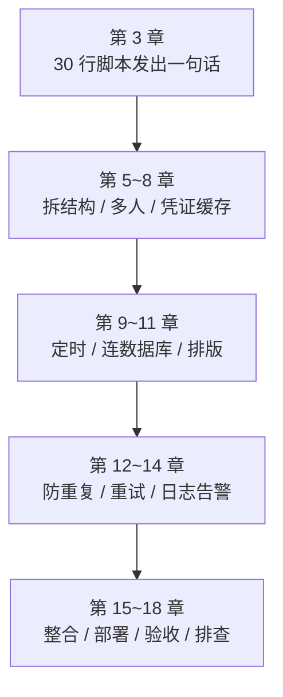
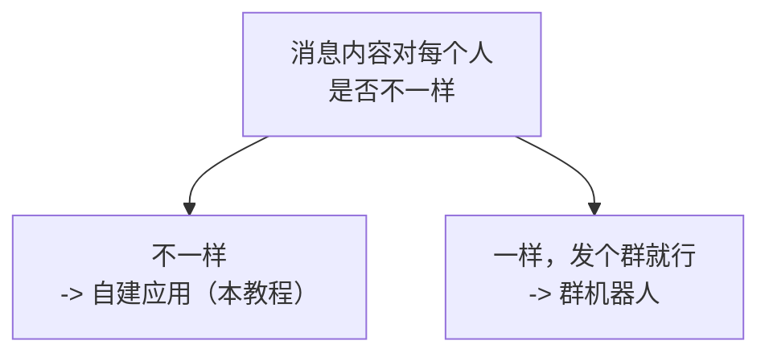
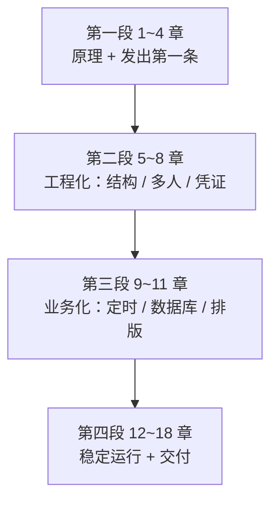

# 第 0 章　开始之前：先明确我们要做什么

> 这一章不写代码。它回答四个问题：**最后做出来的是什么东西、为什么选这条技术路线、你需要什么基础、这本书该怎么读。**
>
> 花十分钟读完它，后面十八章会省你很多回头路。

---

## 0.1 最后交出来的是什么

### 0.1.1 一句话

**一个每天早上自动运行的小程序**：它去 SQL Server 里查"谁有哪些待办快到期了"，然后通过企业微信**分别提醒每个负责人**——而且无论它被运行多少次，同事**每天只收到一条**。

### 0.1.2 同事在手机上看到的东西

这是本教程最终发出的真实消息内容（第 15 章的实测输出）：

```text
## 待办提醒
共 4 项需要处理：

1. 审核 8 月供应商对账单｜已逾期 3 天｜12800.00 元
   > 对方催了两次
2. 提交季度库存盘点表｜今天到期
3. 确认新员工入职设备｜明天到期｜0.00 元
   > 金额是 0
4. 归档 7 月合同扫描件｜2 天后到期（09-07）｜350.50 元

> 其中 1 项已逾期，请优先处理
```

在企业微信里，"已逾期 3 天"和"1 项已逾期"是**橙红色**的。

**注意这条消息里藏着四个决定**，它们都不是随手写的：

| 细节 | 背后的决定 | 在第几章 |
|---|---|---|
| 逾期的排在最前面 | 排序必须**稳定**（否则防重会失效） | 第 11 章 |
| 第 2 项**没有**金额 | `NULL`（没填）和 `0`（确实是零）是两件事 | 第 10、11 章 |
| 第 3 项显示 `0.00 元` | 同上 |  |
| 一个人**一条**消息，而不是四条 | 按人分组、合并发送 | 第 11 章 |

### 0.1.3 你最终会得到四个命令

```bash
python main.py check      # 自检：配置、数据库、凭证都通吗（不发消息）
python main.py once       # 立刻执行一次
python main.py schedule   # 常驻运行，每天定时提醒
python main.py dead       # 查看需要人工处理的记录
```

外加一个验收脚本：

```bash
python acceptance.py      # 26 项自动检查，上线前跑一遍（默认只读）
```

### 0.1.4 一次运行的真实日志

```text
2026-09-05 09:36:20 | INFO | - | main:254 | 程序启动，模式=once｜项目目录=/opt/wecom-todo｜当前工作目录=/
2026-09-05 09:36:20 | INFO | 20260905-093620 | tasks:154 | ===== 任务开始（批次 20260905-093620）=====
2026-09-05 09:36:20 | INFO | 20260905-093620 | tasks:155 | 配置：WeComConfig(corp_id=wwMO...3456, app_secret=***已隐藏***, agent_id=1000002, ...)
2026-09-05 09:36:20 | INFO | 20260905-093620 | todo_repository:67 | 查到待办 7 条（状态=待处理，未来 3 天内）
2026-09-05 09:36:20 | INFO | 20260905-093620 | tasks:173 | 涉及 3 个负责人：['lisi', 'wangwu', 'zhangsan']
2026-09-05 09:36:20 | INFO | 20260905-093620 | sender:62 | 发送成功：待办提醒/p1/lisi/20260905 成功 msgid=...
2026-09-05 09:36:20 | INFO | 20260905-093620 | tasks:218 | ===== 任务结束：计划 3 条｜成功 3 =====
```

**紧接着再跑一次，日志变成这样：**

```text
| INFO | 20260905-093621 | send_log:225 | 跳过（今天已发过）：待办提醒/p1/lisi/20260905
| INFO | 20260905-093621 | send_log:225 | 跳过（今天已发过）：待办提醒/p1/wangwu/20260905
| INFO | 20260905-093621 | send_log:225 | 跳过（今天已发过）：待办提醒/p1/zhangsan/20260905
| INFO | 20260905-093621 | tasks:218 | ===== 任务结束：计划 0 条｜跳过 3 =====
```

**这两屏日志就是本教程的全部野心**：第一屏证明"它能干活"，第二屏证明"它不会骚扰人"。

> **`app_secret=***已隐藏***` 也不是巧合**——第 14 章专门为此写了一层脱敏，因为前面十三章里我们发现了**六种**会把密钥打到日志里的方式，没有一种是"故意打印密钥"。

### 0.1.5 从一句话到一个服务



**每一步都有可运行的版本**——不存在"写到第 12 章才第一次跑起来"这种事。

---

## 0.2 "应用消息"和"群机器人"不是一回事

这是开工前必须搞清的**第一个岔路口**。选错了，后面十八章的内容对你只有一半有用。

### 0.2.1 两条路的区别

| | **企业内部自建应用**（本教程） | **群机器人 / 消息推送**（Webhook） |
|---|---|---|
| 发给谁 | **指定的人**（UserID）、部门、标签 | **只能发到它所在的那个群** |
| 能私聊吗 | **能**，每人收到的内容可以不一样 | **不能**，群里所有人看到同一条 |
| 怎么鉴权 | CorpID + Secret 换 `access_token` | 一个 URL 里的 `key` |
| 频率限制 | 每应用每天 账号数×200 人次；**对同一人 30 次/分钟** | **每个机器人 20 条/分钟** |
| 消息类型 | 文本、Markdown、卡片、图片、语音、视频、文件、模板卡片 | 文本、Markdown、图片、图文、文件、语音、模板卡片 |
| 能撤回吗 | **能**（24 小时内） | 不能 |
| 谁能用 | 需要管理员创建应用、配可见范围 | **拿到 URL 的任何人** |

### 0.2.2 为什么本教程选自建应用

三个理由，第一个是决定性的：

**① 我们的业务要求"每人收到自己的那份"。**

待办提醒的本质是"张三看张三的、李四看李四的"。群机器人做不到——它只能往群里发一条大杂烩，然后每个人自己去找哪几行跟自己有关。**这不是技术偏好，是业务决定的。**

**② 群机器人的 Webhook 地址等于一把没有锁的门。**

官方文档在这一点上说得很直白：

> **"一定要保护好消息推送的 webhook 地址，避免泄漏！不要分享到 github、博客等可被公开查阅的地方，否则坏人就可以用你的消息推送来发垃圾消息了。"**

**这个 URL 没有任何附加校验**——谁拿到谁就能发。而自建应用还有第二道锁：**企业可信 IP**（只允许指定服务器调接口）。

**③ 20 条/分钟撑不住"给每个人发一条"。**

如果有 60 个负责人，群机器人方案就要 3 分钟才能发完（而且还是发到群里）。

### 0.2.3 什么时候该选群机器人

**不要以为自建应用总是更好。**群机器人在这些场景下明显更合适：

| 场景 | 为什么 |
|---|---|
| 构建/部署通知发到技术群 | 大家都要看，@相关人即可；五分钟就能配好 |
| 监控告警发到值班群 | 同上，且不需要管理员创建应用 |
| 临时的一次性通知 | 不值得为它建一个应用 |
| 你**不是管理员**、申请应用要走流程 | 群机器人普通成员就能创建 |

**一句话判断：**



### 0.2.4 还有两条路，本教程都不走

| 方案 | 为什么不走 |
|---|---|
| **第三方服务商应用** | 那是"做一个卖给别的企业用的应用"，要走审核、要处理授权回调。我们只服务自己企业 |
| **模拟操作企业微信客户端** | 用自动化脚本去点客户端界面。**不稳定、违反使用协议、随时因界面改版失效**——这是唯一一条我建议你永远别碰的路 |

> **本教程的主线：企业内部自建应用 → 调官方 API → 给指定成员发应用消息。**这是唯一正当且长期可靠的通道。

---

## 0.3 需要什么基础

### 0.3.1 你需要会的（很少）

| 需要 | 到什么程度 |
|---|---|
| 运行一个 Python 文件 | 会在命令行敲 `python xxx.py` 就够 |
| 看懂简单的 `SELECT` | `SELECT 列 FROM 表 WHERE 条件` 这个层次 |
| 会用一个文本编辑器 | 记事本也行，但推荐 VS Code |

### 0.3.2 你**不需要**提前会的（书里会讲）

- HTTP 是什么、GET 和 POST 的区别（第 1 章）
- JSON 是什么（第 1 章）
- 什么叫 API、什么叫"调接口"（第 1 章）
- Python 的类、异常、装饰器（用到时才讲，第 4、5 章）
- 数据库连接池、事务（第 10、12 章会讲到必要的部分）

**第 4 章是专门为"能跑通但看不懂"准备的**——第 3 章让你把消息发出去，第 4 章逐行解释那 30 行代码为什么这么写。

### 0.3.3 你需要准备的三样东西

| 准备 | 怎么拿到 | 拿不到怎么办 |
|---|---|---|
| **企业微信管理后台的权限**（能创建应用） | 找企业的管理员 | 没有就没法做——这是硬前提 |
| **一台能上网的电脑**（Windows / Linux 都行） | —— | —— |
| **SQL Server 的只读账号** | 找 DBA | **第 1~9 章不需要数据库**，可以先学前九章 |

**第三样可以晚一点。**第 1~9 章只跟企业微信打交道，从第 10 章才开始连数据库。

### 0.3.4 关于"我不是程序员"

如果你是运维、DBA、或者只是想把这件事做出来的业务人员：**这本书是为你写的。**

但要有个预期：**第 12 章（防重复）和第 13 章（重试）会讲一些"看起来过度"的东西**——唯一索引、状态机、指数退避。它们看起来复杂，但每一条都对应一次真实事故。**你可以先跳过它们把消息发出去，但在正式给同事发之前一定要回来读第 12 章。**

理由见 0.4.3 节。

---

## 0.4 这本书怎么读

### 0.4.1 四段式



| 段 | 章 | 读完能做什么 | 大概要多久 |
|---|---|---|---|
| **一** | 0~4 | **给自己发出一条消息，并看懂那段代码** | 半天 |
| **二** | 5~8 | 给一批人发各种类型的消息，凭证管理正确 | 一天 |
| **三** | 9~11 | 定时从数据库取数据发提醒（**已经能用了**） | 一天 |
| **四** | 12~18 | 敢让它无人值守地跑一年 | 两三天 |

### 0.4.2 最短可用路径

**如果你只想尽快看到效果**：

```text
第 2 章（准备环境）→ 第 3 章（发出第一条）
```

**半小时内你就能给自己发出一条消息。**然后再回头读第 1 章的原理，会比一开始就读更有感觉。

### 0.4.3 但这四章不能跳

| 章 | 不读的后果 |
|---|---|
| **第 8 章**（凭证缓存） | 被接口频率拦截；多进程互相让 token 失效 |
| **第 12 章**（防重复） | **任务重跑一次，同事就多收一条**——重复骚扰会让人直接屏蔽这个应用，而且你收不到任何通知 |
| **第 14 章**（日志脱敏） | Secret 进日志 = 谁能读日志谁就能用你的企业身份发消息 |
| **第 4 章 4.9 节**（超时） | 一次网络挂起就卡死定时任务，之后再也不跑 |

**第 12 章是四个里最重要的。**其他毛病都能补救（发晚了可以补发、格式丑可以改），而"因为被骚扰所以屏蔽了应用"是**静默发生**的。

### 0.4.4 每章末尾都有"完成标志"

每一章结尾都有一个**可以动手验证的清单**，例如第 12 章的：

```text
- [ ] python main.py once 第一次运行，正常发出消息
- [ ] 立刻再跑一次，一条都不发
- [ ] 连跑五次，确认总共只发了第一次那些
- [ ] 手工在 SSMS 里执行两次相同的 INSERT，第二次报错 2601
```

**打不完勾就别往下走。**这本书的每一章都依赖前一章真的跑通了。

### 0.4.5 代码在哪

**代码写在正文里，不是一个下载包。**每一章给出该章新增和改动的完整代码，第 15 章给出最终的项目结构和关键文件全文，附录 E、F 给出 SQL 脚本和配置文件全文。

**这是刻意的：**你跟着一章一章写，每章结束都有一个能跑的版本；而下载一个完整项目直接运行，你会跳过所有"为什么这么写"——而这本书大部分价值恰恰在那里。

---

## 0.5 这本书的几个写法约定

读之前知道这几条，会更容易判断哪些内容可以直接照抄、哪些需要在你的环境里再验一遍。

### 0.5.1 标"实测"的都是真跑出来的

书里所有标注**实测**的输出，都是在真实环境里运行的结果，不是手写的示例。全书累计跑了 **300 多项断言**，其中：

| 章 | 实测规模 |
|---|---|
| 第 15 章（整合） | 111 项断言（18 组端到端场景 + 真实定时调度） |
| 第 16 章（部署） | 65 项断言（含真启动、真 SIGTERM、真 venv） |
| 第 17 章（验收） | 35 项断言（验收脚本自身的测试） |
| 第 18 章（排查） | 21 项断言（每种故障真的制造一遍） |
| 第 2~14 章 | 每章 12~24 组测试 |

### 0.5.2 三类验证来源，书里都标明

因为写作环境的限制（没有 SQL Server 实例、没有 systemd、没有真实的企业微信企业），书里把结论分成三类，**每处都标注**：

| 标注 | 含义 |
|---|---|
| **实测** | 在真实组件上跑过（如真实 ODBC Driver 18、真实网络超时、真实进程信号） |
| **实测（DB-API 通用行为）** | 用 sqlite 验证了跨数据库一致的部分（游标、事务、唯一约束冲突） |
| **依据官方文档** | 没在本环境运行（如 systemd 单元、Windows 计划任务、企业微信真实投递） |

**别把第三类当成已验证的**——那些地方我给了官方文档链接，请在你自己的环境里确认一遍。

### 0.5.3 我自己写错的地方都留在书里

这本书最反常的一点：**我把自己写错、然后发现、然后修正的过程写进了正文。**例如：

| 章 | 我的错误 |
|---|---|
| 第 8 章 | 缓存提前量算错，导致缓存永远不命中 |
| 第 13 章 | 指数退避的夹逼顺序写反，抖动突破了上限（71.2 秒 > 60 秒上限） |
| 第 15 章 | 批次号只覆盖了一个文件；"今天到期"被算成逾期；脱敏正则吃掉了已打码文本的后半截 |
| 第 16 章 | 时区算错，测试等了两分半钟什么都没发生 |
| 第 18 章 | `LoginTimeout` 配置项**完全不生效**（15.1 秒 vs 期望 3 秒） |
| 附录 B | 漏解析 `unlicenseduser`，会把"没收到"误判成"发送成功" |

**为什么留着**：这些 bug 的共同点是**只在特定条件下才暴露**（整合之后、失败的时候、真实数据上）。看别人怎么发现它们，比看一份"一开始就正确"的代码有用得多。

### 0.5.4 官方文档是唯一权威

书里引用的每一条限制（长度、频率、有效期）都注明了出处，并且**核对过官方页面**。如果你看到书里的说法和官方文档不一致，**以官方为准**——接口是会变的，这本书写于 2026 年 9 月。

---

## 0.6 全书地图

| 章 | 标题 | 一句话 | 能跳过吗 |
|---|---|---|---|
| **0** | 开始之前 | 你正在读的这一章 | —— |
| **1** | 原理 | 消息是怎么从你的代码走到同事手机上的 | 可以晚读 |
| **2** | 准备环境 | 建应用、拿三个凭证、装 Python | ❌ |
| **3** | 第一个最小示例 | 30 行代码发出第一条消息 | ❌ |
| **4** | 读懂最小代码 | 逐行解释，包括超时为什么必须给 | ❌ 4.9 节 |
| **5** | 拆成可维护的结构 | 三个文件 + 异常体系 | 建议读 |
| **6** | 多人 / 部门 / 标签 | 一次通知一批人 + 误发防护 | 建议读 |
| **7** | 多种消息类型 | Markdown、卡片、图片、文件 + 按字节截断 | 可选 |
| **8** | 管理 access_token | 缓存、提前量、失效重试 | ❌ |
| **9** | 定时发送 | APScheduler + 时区 | 需要定时就读 |
| **10** | 连接 SQL Server | pyodbc、驱动、连接字符串、错误码 | 需要数据库就读 |
| **11** | 把数据整理成消息 | 分组、排序、格式化、分页 | 同上 |
| **12** | **防止重复发送** | 唯一索引 + 状态机 + 三种防重策略 | ❌ **最重要** |
| **13** | 失败处理与重试 | 按错误码分类、指数退避、死信 | 建议读 |
| **14** | 日志、审计与监控 | 脱敏、批次号、告警两条腿 | ❌ 脱敏部分 |
| **15** | 整合成完整项目 | 20 个文件装成一个能交付的东西 | 建议读 |
| **16** | 部署与长期运行 | systemd / 计划任务、单实例、优雅停止 | 要上线就读 |
| **17** | 测试和验收清单 | `acceptance.py` + 12 组人工验收 | 要上线就读 |
| **18** | 常见问题排查 | 按现象查的故障手册 | **出事时读** |
| **附录** | 速查手册 A~G | 术语、API、JSON、错误码、SQL、配置、阶段对照 | 随时查 |

**全书约 22000 行、187 张图。**不用一口气读完——第 1~11 章顺着读，第 12~18 章可以做到哪一步读到哪一步。

---

## 0.7 现在开始

**下一步有两个选择：**

| 你的情况 | 去哪 |
|---|---|
| 想先明白"消息是怎么送过去的" | **第 1 章**（有 11 张图，不用写代码） |
| 想先看到效果，原理回头再补 | **第 2 章**（准备环境）→ **第 3 章**（发出第一条） |

两条路都对。**唯一不建议的是"先把十八章读完再动手"**——这本书的每一章都设计成"读完就能跑一次"，不跑就少了一半。

> **最后提醒一句**：从第 3 章你就会真的发出消息了。**第一条请发给自己**（用你自己的 UserID）。这个习惯贯穿全书——第 16 章的灰度名单、第 17 章的验收流程，本质上都是它的放大版。

---

## 参考的官方文档

1. [企业微信开发者中心：开发前必读](https://developer.work.weixin.qq.com/document/path/90664) —— 自建应用的整体概念
2. [企业微信开发者中心：发送应用消息](https://developer.work.weixin.qq.com/document/path/90236) —— 0.2.1 节的消息类型与频率限制
3. [企业微信开发者中心：群机器人配置说明](https://developer.work.weixin.qq.com/document/path/91770) —— 0.2 节的对比依据，包括"20 条/分钟"限制和官方那句"一定要保护好 webhook 地址"
4. [企业微信开发者中心：撤回应用消息](https://developer.work.weixin.qq.com/document/path/94867) —— 0.2.1 节"能撤回"一项
5. [企业微信开发者中心：全局错误码](https://developer.work.weixin.qq.com/document/path/90313) —— 全书排查的依据

> 本章引用的所有实测输出均来自第 15、16 章的真实运行记录；0.2 节两种方案的对比逐条核对了上述官方文档（核对日期：2026 年 9 月）。
