# 第 1 章　先讲原理：Python 是怎样把消息送到企业微信的

> 所属教程：《Python 调用企业微信应用消息 API：从入门到定时、数据库与防重复发送》  
> 本章目标：**只讲原理，不写完整程序**。读完本章，你要能自己说出“一条消息是怎么从你的 Python 程序走到同事手机上的”。  
> 本章不需要你已经注册好企业微信应用（那是第 2 章的事），也不需要你会写 Python 类。

**本章要解决新手最容易卡住的 7 个疑问：**

1. 我的电脑上的 Python，凭什么能让别人的企业微信弹出一条消息？
2. 什么是 API？为什么必须走 API，不能自己想办法？
3. 那一串 `{"touser": ...}` 是什么东西？
4. `CorpID`、`Secret`、`AgentId`、`UserID`、`access_token` 这五个名字太像了，各自管什么？
5. 为什么不能直接拿密码发消息，非要先换一个 `access_token`？
6. 为什么程序“没报错”，同事却没收到消息？
7. 我到底要按什么顺序写代码？

---

## 1.1 什么是 API

### 1.1.1 一个生活中的比方

你要去银行办转账。你不会自己走进银行的机房去改数据库里的余额数字，而是：

1. 走到**指定的柜台窗口**；
2. 按窗口要求**填一张单子**（账号、金额、用途）；
3. 把单子递进去；
4. 柜员处理后，**给你一张回执**，上面写着成功或失败。

API（Application Programming Interface，应用程序接口）就是软件世界里的这个“窗口”。

- **窗口地址** = 接口的网址（URL）
- **要填的单子** = 接口要求的参数格式
- **回执** = 接口返回的结果

企业微信对外开放了一批这样的窗口，其中一个窗口就叫“发送应用消息”。你的 Python 程序走到这个窗口，按规定填好单子递进去，企业微信就替你把消息推送到成员的企业微信客户端上。

### 1.1.2 三个角色要分清

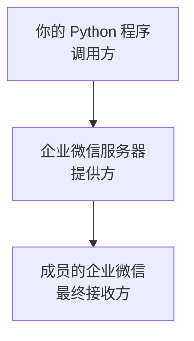

请特别注意第三点：**你的程序并没有直接和同事的手机通信**。你的程序只和企业微信的服务器说话，真正把消息推送到手机上的是企业微信自己。

这解释了一个重要事实：**你的程序发完请求就结束了，它无法保证对方一定看到消息**，它只能保证“企业微信已经接受了这个发送请求”。

### 1.1.3 为什么必须走 API

新手常有一个念头：“能不能让程序模拟我点击企业微信客户端，替我把字打出去？”

不要走这条路，原因是：

| 做法 | 稳定性 | 是否合规 | 是否可自动化 |
|---|---|---|---|
| 调用官方 API | 高，接口有文档和版本保障 | 合规，官方提供 | 是 |
| 模拟操作客户端界面 | 极低，界面一改就失效 | 有风险，可能违反使用条款 | 勉强 |
| 直接改企业微信的数据库 | 不可能 | 不可能 | 不可能 |

企业微信的数据在腾讯的服务器上，你根本没有访问权，也不应该有。**API 是唯一正当且长期可靠的通道。**

### 1.1.4 API 是一份“契约”

窗口有窗口的规矩，接口也一样。接口会明确规定：

- 请求发到哪个网址；
- 用什么方式发（`GET` 还是 `POST`）；
- 必须提供哪些参数、哪些是可选的；
- 每个参数的类型和长度限制；
- 返回什么结构的结果。

**你不能自由发挥。**多写一个字段通常无害，但少写一个必填字段、或者把数字写成文字，接口就会拒绝你。所以查文档是这类开发的日常动作，不是“基础不好才需要查”。

---

## 1.2 HTTP 请求的四个基本组成部分

调用 API，本质上就是发一次 HTTP 请求。HTTP 请求听起来抽象，其实只有四件事要交代清楚。

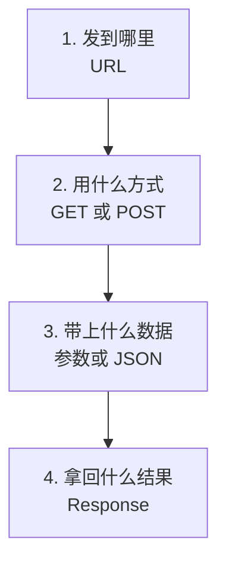

### 1.2.1 URL：请求发到哪里

URL 就是接口地址。企业微信的两个核心接口地址是：

```text
https://qyapi.weixin.qq.com/cgi-bin/gettoken
https://qyapi.weixin.qq.com/cgi-bin/message/send
```

把它拆开看：

| 部分 | 内容 | 含义 |
|---|---|---|
| 协议 | `https` | 加密传输，不能写成 `http` |
| 域名 | `qyapi.weixin.qq.com` | 企业微信开放接口的服务器 |
| 路径 | `/cgi-bin/message/send` | 具体是哪个窗口 |

注意域名是 `qyapi`（企业微信开放接口专用域名），不是我们平时访问的网页地址。写错域名是新手第一类常见错误。

### 1.2.2 Method：`GET` 与 `POST` 的区别

HTTP 有多种请求方式，本教程只用两种。

| 方式 | 语义 | 数据放在哪 | 本教程用途 |
|---|---|---|---|
| `GET` | 我来取一样东西 | 拼在网址后面 | 获取 `access_token` |
| `POST` | 我来提交一件事 | 放在请求体里 | 发送消息 |

`GET` 请求的数据是拼在网址上的，形式是这样：

```text
https://qyapi.weixin.qq.com/cgi-bin/gettoken?corpid=你的企业ID&corpsecret=你的应用密钥
```

- `?` 表示“下面开始是参数”；
- `参数名=参数值`；
- 多个参数之间用 `&` 连接。

因为这些内容会出现在网址里，很容易被日志、浏览器历史记录留下痕迹。这也是**为什么不能把 `Secret` 写进代码后随便分享**的现实原因之一。

`POST` 请求则把数据放在“请求体”里，不出现在网址上，适合提交结构复杂的内容——比如一条完整的消息。

### 1.2.3 要带上的数据：参数与请求体

企业微信的“发送应用消息”接口有个特点，两种数据同时用：

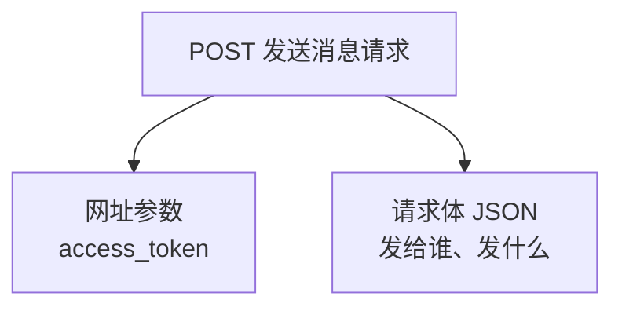

也就是说：

- **凭证**（`access_token`）拼在网址上；
- **消息内容**放在请求体里。

新手常犯的错误是把 `access_token` 也塞进请求体，或者把消息内容拼到网址上，结果接口一直报参数错误。**记住这个分工，能省下你半小时的排查时间。**

### 1.2.4 Response：接口返回的结果

请求发出去后，服务器会回一个响应，包含两层信息：

| 层次 | 名称 | 说明 |
|---|---|---|
| 通信层 | HTTP 状态码 | 这次“对话”是否顺利，例如 `200` 表示服务器正常应答 |
| 业务层 | 响应内容 | 企业微信到底同意还是拒绝，写在返回的 JSON 里 |

这两层完全独立，第 1.7 节会专门讲——因为**这是新手最容易误判成功的地方**。

---

## 1.3 JSON 是什么

### 1.3.1 JSON 是一种“写数据的格式”

程序之间传数据，需要一种双方都认识的书写格式。JSON 就是当今最通用的一种。它长这样：

```json
{
  "touser": "zhangsan",
  "msgtype": "text",
  "agentid": 1000002,
  "text": {
    "content": "服务器磁盘使用率已超过 90%"
  },
  "safe": 0
}
```

规则很少，一看就懂：

| 记号 | 含义 | 例子 |
|---|---|---|
| `{ }` | 一个对象，里面是若干“名称: 值” | `{"a": 1}` |
| `[ ]` | 一个数组，即有序的一串值 | `[1, 2, 3]` |
| `" "` | 字符串必须用双引号 | `"zhangsan"` |
| 数字 | 直接写，不加引号 | `1000002` |
| `true` / `false` | 布尔值 | `true` |
| `null` | 空值 | `null` |
| `,` | 分隔多个成员，**最后一个后面不能加** | 见上例 |

三条新手最常踩的坑：

1. **JSON 里的字符串必须用双引号**，不能用单引号；
2. **最后一项后面不能多一个逗号**；
3. **该是数字的不要写成字符串**。比如 `agentid` 要写 `1000002`，写成 `"1000002"` 可能被接口拒绝。

### 1.3.2 Python 字典和 JSON 的对应关系

好消息是：**在 Python 里你几乎不用手写 JSON 文本。**你只需要写一个 Python 字典，剩下的交给库去转换。

对应关系如下：

| Python | JSON |
|---|---|
| `dict` 字典 | 对象 `{ }` |
| `list` 列表 | 数组 `[ ]` |
| `str` 字符串 | 字符串 |
| `int` / `float` | 数字 |
| `True` / `False` | `true` / `false` |
| `None` | `null` |

于是上面那段 JSON，在 Python 里就是：

```python
# 这是一个普通的 Python 字典，注意 True/False/None 的写法与 JSON 不同
payload = {
    "touser": "zhangsan",          # 发给谁
    "msgtype": "text",             # 消息类型：文本
    "agentid": 1000002,            # 哪个应用发出的，注意是数字，不加引号
    "text": {                      # 字典里可以再套字典，对应 JSON 的嵌套对象
        "content": "服务器磁盘使用率已超过 90%"
    },
    "safe": 0                      # 是否保密消息，0 表示不保密
}
```

写字典比写 JSON 文本安全得多：**引号、逗号、括号的错误会在你运行程序时立刻暴露**，而不是等接口报一个含糊的参数错误。

### 1.3.3 “Python 字典”和“发出去的 JSON 文本”不是一回事

这一点要说清楚，否则后面调试会糊涂。

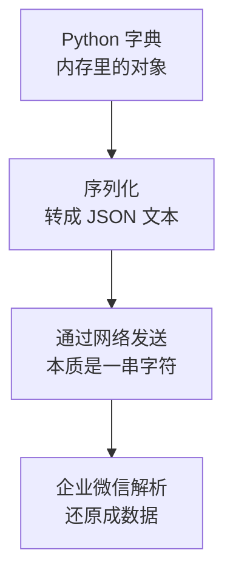

- **字典**是活在你程序内存里的东西，可以取值、可以修改。
- **网络上传输的**必须是一串字符文本。
- 从字典变成文本，叫**序列化**；反过来叫**反序列化**。

在实际代码中，这个转换通常一行都不用你写：使用 `requests` 库时，只要用 `json=payload` 的写法，它会自动完成序列化，并顺便加上正确的内容类型说明。这也是为什么本教程推荐 `json=` 而不是自己拼字符串。

### 1.3.4 中文和换行怎么处理

两个高频问题，先给结论，后面章节会实践：

- **中文不需要你手动编码**。用 `json=payload` 交给库处理即可。乱码几乎都出在“自己拼字符串”或“编码设置错误”上。
- **换行要用 `\n`**。在 Python 字符串里写 `"第一行\n第二行"`，消息在企业微信里就会分两行显示。

---

## 1.4 企业微信应用消息涉及的五个关键值

这五个值名字相似，是新手最大的混淆源。先用一张表建立整体印象。

| 名称 | 回答什么问题 | 大致形态 | 从哪来 | 会变吗 |
|---|---|---|---|---|
| `CorpID` | 哪一家企业 | 一串字母数字 | 管理后台 | 基本不变 |
| `Secret` | 你是否有权代表这个应用 | 一长串随机字符 | 管理后台，应用页面 | 可重置 |
| `AgentId` | 消息由哪个应用发出 | 数字，如 `1000002` | 管理后台，应用页面 | 不变 |
| `UserID` | 消息发给哪位成员 | 如 `zhangsan` | 通讯录 | 一般不变 |
| `access_token` | 本次调用的临时通行证 | 一长串字符 | 调用接口换来的 | **每约 2 小时就换** |

### 1.4.1 `CorpID`：企业的身份证号

一家企业在企业微信里有一个唯一编号，这就是 `CorpID`。**同一家企业下面所有的自建应用，`CorpID` 都是同一个。**

### 1.4.2 `Secret`：应用的密钥，等于密码

`Secret` 是某个应用的凭证密钥。它的地位相当于密码，必须严格保密。

关键特性：**每个应用有自己独立的 `Secret`**。如果你建了“系统告警”和“待办提醒”两个应用，它们的 `Secret` 是两串不同的字符，不能混用。

> 安全提示：`Secret` 不要写在源代码里，不要提交到 Git，不要贴在聊天记录里，不要打印到日志里。第 2 章会介绍用 `.env` 文件保存的做法。

### 1.4.3 `AgentId`：应用的编号

`AgentId` 标识“这条消息是哪个应用发出来的”，是一个整数。成员收到消息时，看到的应用名称和图标就来自这个应用。

`Secret` 和 `AgentId` 的关系要理清：

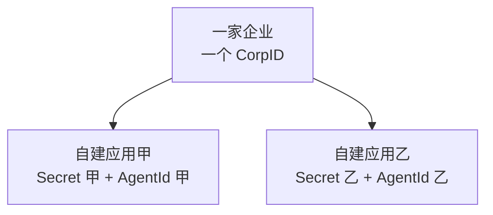

**同一个应用的 `Secret` 和 `AgentId` 必须配对使用。**用甲应用的 `Secret` 换来凭证，却写上乙应用的 `AgentId`，接口会失败。这是新手第二类高频错误。

### 1.4.4 `UserID`：成员在企业微信里的账号

`UserID` 是成员在企业通讯录中的唯一账号，对应管理端的登录账号。请务必把它和其他几个身份信息区分开：

| 你手里的信息 | 能不能直接填进 `touser` |
|---|---|
| `UserID`，如 `zhangsan` | 可以，这才是接口要的 |
| 姓名，如 `张三` | 不行 |
| 手机号 | 不行，但可以先调接口换成 `UserID` |
| 个人微信号 | 不行 |
| 邮箱 | 不行 |

如果你系统里存的是手机号，企业微信提供了“手机号获取 `userid`”的接口可以转换。不过要注意官方的一条限制：**如果查询的手机号错误次数太多（超过企业人数上限的 20%），会导致一天之内无法再调用该接口**。所以不要拿一批脏数据去反复试探。

另外记住一个细节：`UserID` **不区分大小写**，企业微信返回时会统一转成小写。所以在自己的数据库里做比对时，最好统一转成小写再比较，否则你的“防重复发送”逻辑可能会把 `ZhangSan` 和 `zhangsan` 当成两个人（第 12 章会用到这个细节）。

### 1.4.5 `access_token`：临时通行证

`access_token` 是调用业务接口时真正使用的凭证。特点是：

- 用 `CorpID` + `Secret` 调接口换来；
- 有有效期，正常情况约 **7200 秒（2 小时）**；
- **每个应用的 `access_token` 是各自独立的**，不能通用；
- 长度可能较长，官方要求存储时至少预留 512 字节。

下一节专门讲它，因为“为什么要多这一步”是本章最重要的原理。

---

## 1.5 为什么不能拿着 Secret 直接发送消息

### 1.5.1 一个直观的类比

设想你去一家大楼办事：

- **身份证**证明你是谁，但你不会把身份证交给每一个部门传阅；
- 你在前台用身份证**换一张临时门禁卡**；
- 之后进出各个房间，都刷这张门禁卡；
- 门禁卡**当天有效**，丢了也只是丢了一张卡，明天就失效了。

对应关系：

| 大楼 | 企业微信 |
|---|---|
| 身份证 | `CorpID` + `Secret` |
| 前台换卡 | 调用获取 `access_token` 接口 |
| 临时门禁卡 | `access_token` |
| 刷卡进房间 | 调用发送消息等业务接口 |
| 卡当天失效 | 约 2 小时后过期 |

### 1.5.2 这样设计带来三个好处

1. **降低泄露损失。**一次调用中传输的是有效期很短的 `access_token`，而不是长期有效的 `Secret`。
2. **限定权限范围。**换来的凭证只属于这个应用，只能干这个应用被允许干的事。
3. **可以主动作废。**服务端可以让某个凭证提前失效，而不必让企业重置密钥。

### 1.5.3 换取凭证的过程

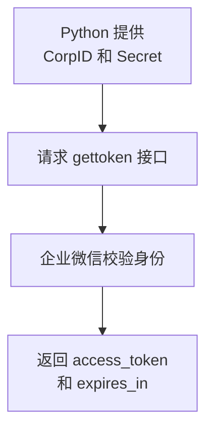

返回的内容大致是这样：

```json
{
  "errcode": 0,
  "errmsg": "ok",
  "access_token": "accesstoken000001",
  "expires_in": 7200
}
```

请注意 `expires_in`，它表示这张“通行证”还能用多少秒。**不要把 7200 当成写死的常量**，正确做法是读取接口返回的这个值。

### 1.5.4 为什么必须缓存，不能每次都去换

官方明确要求开发者缓存 `access_token`，并且**不能频繁调用获取凭证的接口，否则会被频率拦截**。

想象一下：你有 200 个成员要通知，如果每发一条消息都先换一次通行证，就等于两小时内跑了 200 趟前台。结果不是“慢一点”，而是**你会被限流，一条都发不出去**。

所以正确的思路是：

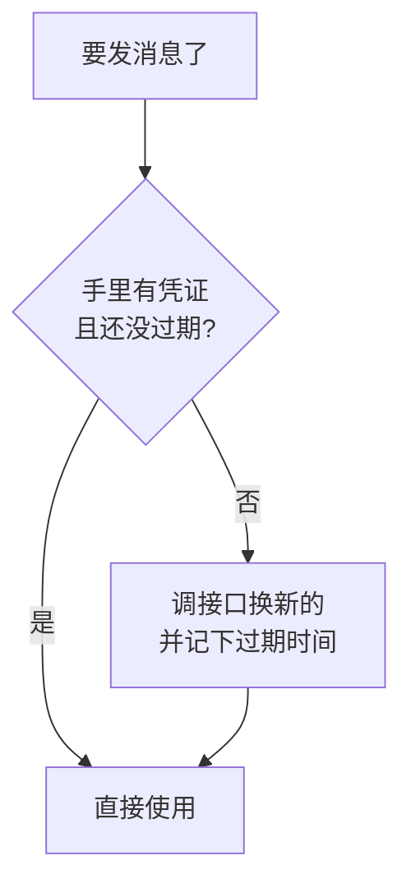

同时还要留一个心眼：官方说明企业微信**可能出于运营需要提前让凭证失效**。所以“按时间判断没过期”并不能 100% 保证可用，程序还需要具备“**用着失效了就刷新一次再重试**”的能力。

本章只要理解这个原理，具体实现放在第 8 章。

### 1.5.5 一条硬性安全规则

官方特别强调：**不要把 `access_token` 返回给前端**。所有访问企业微信 API 的请求都应该由后台发起。

对本教程的含义很直接：`CorpID`、`Secret`、`access_token` 只存在于你的 Python 程序和服务器上，绝不出现在网页、小程序、手机 App 的代码里，也不要打印在给别人看的日志或截图里。

---

## 1.6 一条消息的完整旅程

现在把前面所有零件串起来。这就是你后面每一个版本的程序都在做的事。

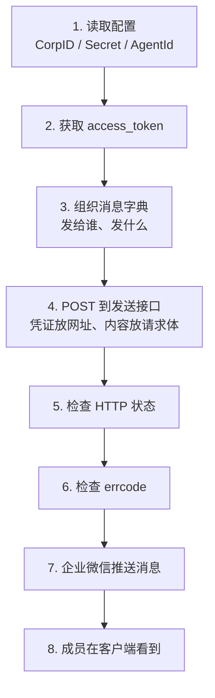

配上每一步的责任说明：

| 步骤 | 谁在做 | 做什么 | 出错的典型表现 |
|---|---|---|---|
| 1 | 你的程序 | 读取三个配置值 | 值为空、抄错、多了空格 |
| 2 | 你的程序 → 企业微信 | 换取临时凭证 | 返回非 0 错误码 |
| 3 | 你的程序 | 拼出消息内容 | 少了必填字段 |
| 4 | 你的程序 → 企业微信 | 提交发送请求 | 参数放错位置 |
| 5 | 你的程序 | 判断通信是否正常 | 网络超时、域名写错 |
| 6 | 你的程序 | 判断业务是否成功 | `errcode` 非 0 却被忽略 |
| 7 | 企业微信 | 推送到客户端 | 成员不在可见范围 |
| 8 | 成员 | 看到消息 | 手机关闭了通知 |

**请特别记住第 5 步和第 6 步是两次不同的检查。**这正是下一节的主题。

另外从这张图能看出一个重要事实：**你的程序只能负责第 1 到第 6 步**。第 7、8 步不在你的控制范围内，这也决定了后面章节里“发送日志”记录的是“企业微信是否已受理”，而不是“对方是否已读”。

---

## 1.7 “HTTP 请求成功”不等于“消息发送成功”

这是本章最值钱的一节。几乎每个新手都会在这里判断失误，然后困惑“程序明明跑通了，为什么没人收到”。

### 1.7.1 两道关卡

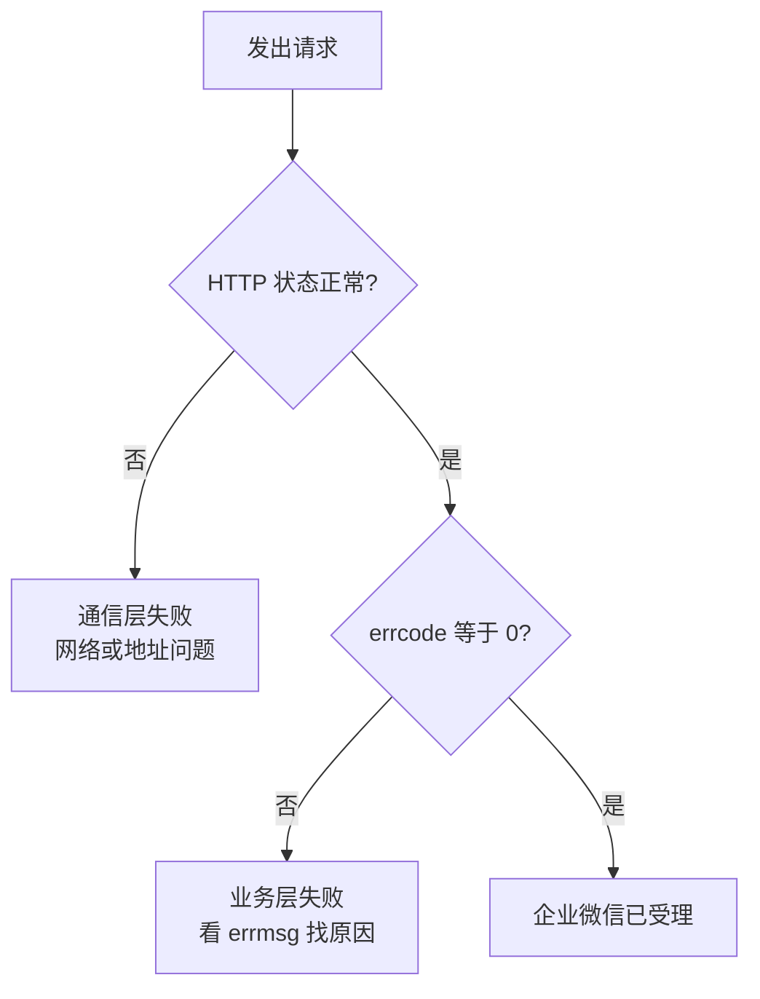

- **第一道关卡是通信层。**HTTP 状态码 `200` 只说明“服务器听见你说话并给了回复”。
- **第二道关卡是业务层。**企业微信在返回内容里用 `errcode` 告诉你“这件事我到底给你办了没有”。

一个典型的失败案例：你把 `UserID` 写错了，请求顺利到达服务器，服务器也正常回复了你，HTTP 状态码是 `200`——但返回内容里写着错误码，消息其实一条也没发出去。如果你的代码只判断了 HTTP 状态码，就会打印“发送成功”，而实际上什么都没发生。

### 1.7.2 返回内容里要看的字段

企业微信发送应用消息成功时，返回大致是这样：

```json
{
  "errcode": 0,
  "errmsg": "ok",
  "invaliduser": "userid1|userid2",
  "invalidparty": "partyid1",
  "invalidtag": "tagid1",
  "unlicenseduser": "userid3",
  "msgid": "xxxx"
}
```

逐个说明：

| 字段 | 含义 | 你该怎么用 |
|---|---|---|
| `errcode` | 错误码，`0` 表示成功 | **必须检查**，非 0 就是失败 |
| `errmsg` | 错误码的文字说明 | 排查时读它，记进日志 |
| `invaliduser` | 无效的成员账号 | 有值说明这些人没发到 |
| `invalidparty` | 无效的部门 | 同上 |
| `invalidtag` | 无效的标签 | 同上 |
| `unlicenseduser` | 在可见范围内但缺少接口许可的成员 | 有值说明这些人没发到 |
| `msgid` | 消息编号 | 想撤回消息时要用到 |

### 1.7.3 还有第三种情况：部分成功

这是比“成功/失败”更需要注意的一层。官方规则是：

- 如果**部分**接收人无权限或不存在，**发送仍然会执行**，只是把无效的那部分列在 `invaliduser` 等字段里；
- 如果**全部**接收人都无权限或不存在，本次调用才返回失败。

也就是说，**`errcode` 为 0 也可能有人没收到**。

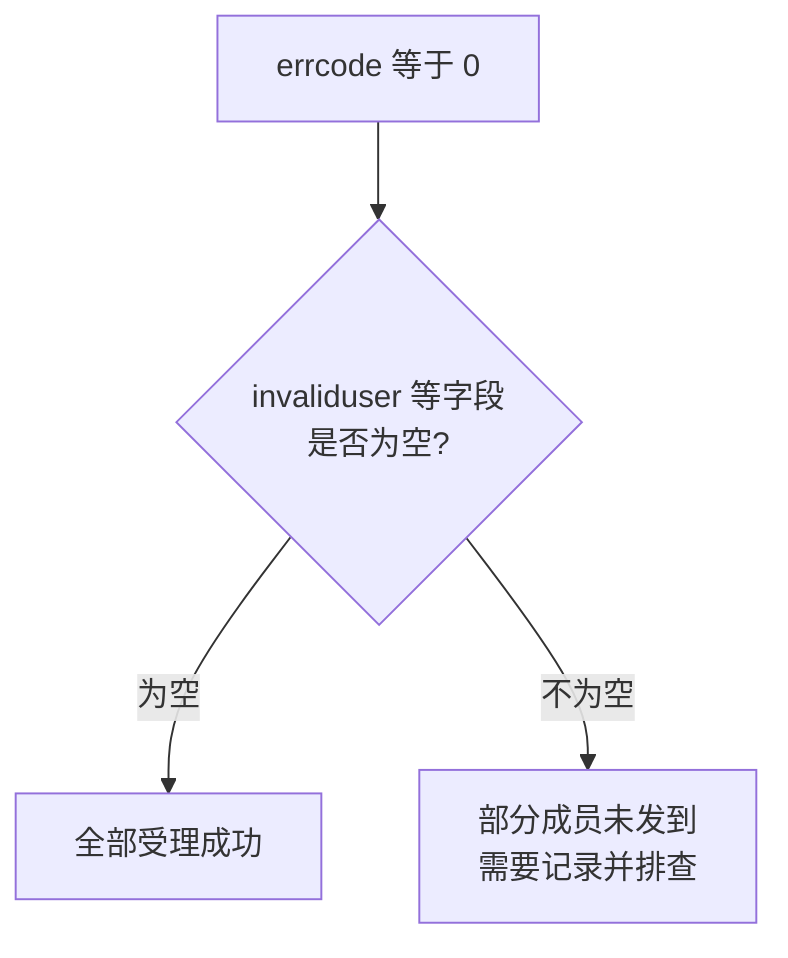

所以一个负责的程序，判断成功要做**三件事**，而不是一件：

1. 通信是否正常；
2. `errcode` 是否为 0；
3. 无效接收人字段是否为空。

这一点会在第 6 章（多人发送）和第 14 章（日志）反复用到。

### 1.7.4 最常见的“成功但收不到”原因

官方指出，出现无效接收人最常见的原因是：**接收人不在这个应用的可见范围内**。

这里所说的权限包含两部分：应用可见范围，以及基础接口权限。`unlicenseduser` 里的成员属于第二种情况——人在可见范围内，但没有基础接口许可（包括许可已过期）。

所以当你遇到“接口说成功，同事没收到”，排查顺序应该是：

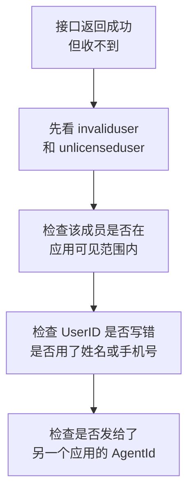

把这个顺序记下来，第 18 章会展开成完整的排查手册。

---

## 1.8 本章小结

### 1.8.1 用一句话复述原理

> **读配置 → 换凭证 → 拼消息 → 调接口 → 查结果。**

展开成一段话：程序从配置里读出 `CorpID`、`Secret` 和 `AgentId`；先用 `CorpID` 和 `Secret` 向企业微信换一张有效期约两小时的 `access_token` 并缓存起来；再把“发给谁、发什么、以哪个应用的名义发”组织成一个 Python 字典；用 `POST` 提交到发送消息接口，凭证放在网址参数里、消息内容放在请求体里；最后依次检查 HTTP 状态、`errcode` 以及无效接收人字段，三者都没问题才算真正受理成功。

### 1.8.2 五个关键值再确认

请不看上文，自己回答：

1. 哪个值代表企业？
2. 哪个值相当于应用的密码？
3. 哪个值决定消息显示为哪个应用发出？
4. 哪个值决定消息发给谁？
5. 哪个值有有效期、需要缓存？

答案依次是：`CorpID`、`Secret`、`AgentId`、`UserID`、`access_token`。

### 1.8.3 本章必须带走的 8 条结论

1. 调用 API 就是按对方规定的格式发一次 HTTP 请求，规则由对方定，你只能遵守。
2. 你的程序只和企业微信服务器通信，推送到手机是企业微信完成的。
3. 发送消息用 `POST`：**凭证放网址参数，消息内容放请求体**。
4. 在 Python 里写字典，不要手写 JSON 文本，让库负责序列化。
5. 不能用 `Secret` 直接发消息，必须先换 `access_token`。
6. `access_token` 必须缓存，频繁获取会被限流；同时要能应对提前失效。
7. `Secret` 和 `access_token` 只留在后台，绝不交给前端，也不要打印到日志。
8. **判断成功要看三层：HTTP 状态、`errcode`、无效接收人字段。**

### 1.8.4 本章不需要你做的事

- 不需要写完整程序；
- 不需要背下接口的全部参数；
- 不需要理解异步、并发、面向对象。

### 1.8.5 下一章预告

第 2 章将进入实际操作：创建企业内部自建应用、设置可见范围、找到 `CorpID`、`Secret`、`AgentId` 和测试成员的 `UserID`、了解可信 IP 设置，并搭好 Python 虚拟环境与项目目录。完成第 2 章后，第 3 章就能真正发出第一条消息。

**建议现在做一件事：**把 1.8.1 那句口诀抄在纸上，贴在显示器旁边。后面十几章的代码，本质上都是在给这五个步骤加“保险措施”。

---

## 参考的官方文档

1. [企业微信开发者中心：获取 access_token](https://developer.work.weixin.qq.com/document/path/91039)
2. [企业微信开发者中心：发送应用消息](https://developer.work.weixin.qq.com/document/path/90236)
3. [企业微信开发者中心：手机号获取 userid](https://developer.work.weixin.qq.com/document/path/95402)

> 本章中的接口地址、字段含义、有效期与限制说明，均依据上述企业微信官方文档整理并重新表述（内容已为遵守许可限制而改写）。接口细节可能随官方更新而调整，实际开发时请以最新官方文档为准。
