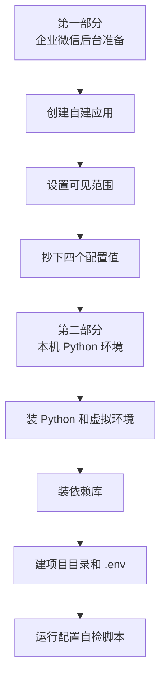
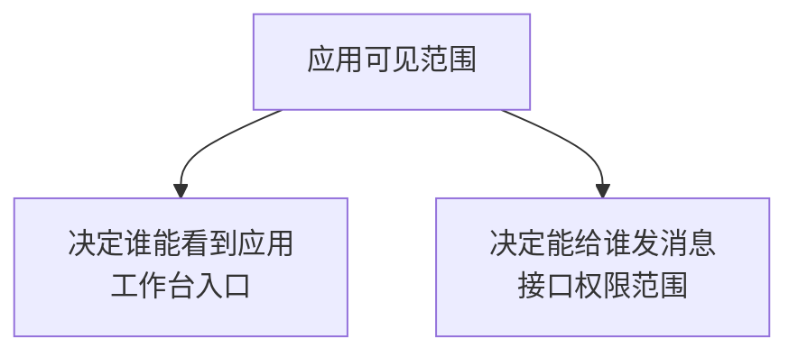
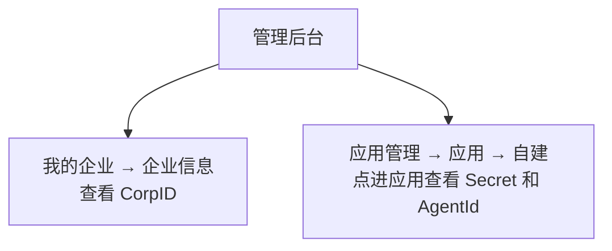
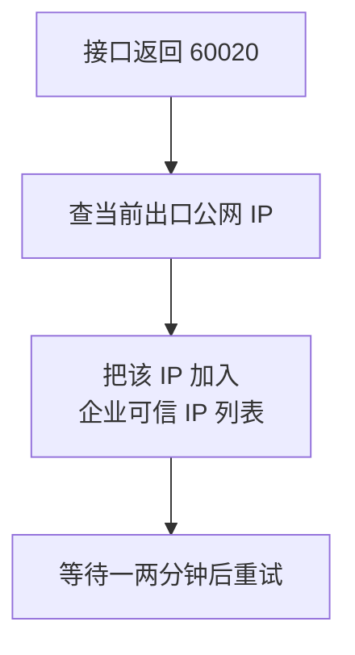
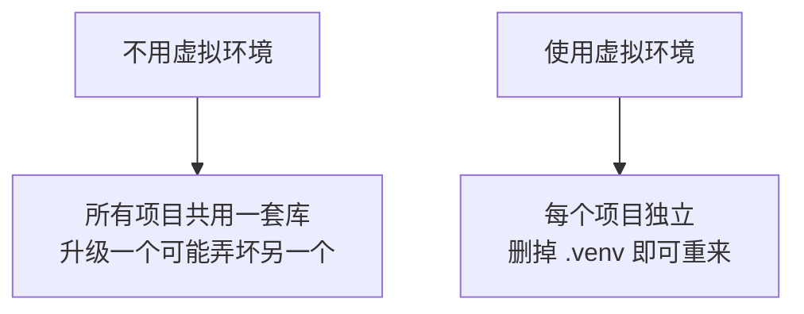
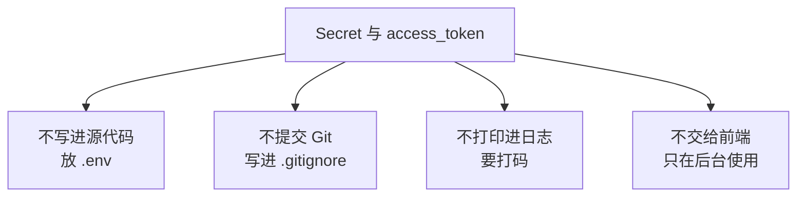
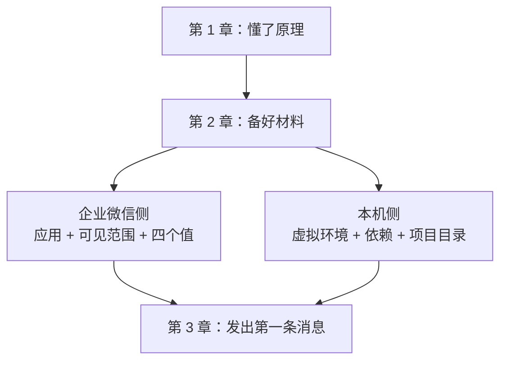

# 第 2 章　准备企业微信和 Python 环境

> 所属教程：《Python 调用企业微信应用消息 API：从入门到定时、数据库与防重复发送》  
> 前置章节：第 1 章（原理）  
> 本章目标：**把第 3 章要用的东西全部准备齐**——一个可用的企业微信自建应用、四个配置值、一个 Python 项目目录。  
> 本章不发送任何消息，但本章做错，第 3 章一定失败。

**本章结束时，你手上应该有这样一张纸（或一个 `.env` 文件）：**

| 项目 | 你的值 |
|---|---|
| `CorpID` | ww………… |
| `Secret` | ………… |
| `AgentId` | 10000…… |
| 测试用 `UserID` | ………… |

以及一个能运行的 Python 项目目录，运行自检脚本后显示“配置齐全”。

---

## 2.0 本章整体路线



前半部分在浏览器里操作，后半部分在命令行里操作。建议一次做完，中间不要隔太久，否则容易忘记自己抄到哪一步。

---

# 第一部分　企业微信后台准备

## 2.1 创建企业内部自建应用

### 2.1.1 前提：你需要管理员权限

创建应用、查看企业 ID 这些操作都需要**管理员权限**。如果你不是管理员，有两种做法：

- 请管理员帮你创建应用，并把 `CorpID`、`Secret`、`AgentId` 给你；
- 请管理员把你设为管理员（大企业通常不会这样做）。

> 如果你只是想学习，还没有真实企业环境，可以自己免费注册一家“企业”用于测试（企业名称填自己能识别的即可）。这样你就是管理员，可以完整走通全部流程。用测试企业学习，也能避免在生产环境误发消息给全公司。

### 2.1.2 操作步骤

1. 用电脑浏览器登录**企业微信管理后台**（管理后台是网页版，不是手机 App）。
2. 进入顶部菜单 **「应用管理」**。
3. 找到 **「应用」** 区域下的 **「自建」** 分组。
4. 点击 **「创建应用」**。
5. 填写三项内容：
   - **应用 logo**：随便传一张图即可，这个图标会显示在成员收到的消息上；
   - **应用名称**：建议直接写用途，例如 `系统通知`、`待办提醒`；
   - **应用介绍**：一句话说明，例如“由内部程序发送的自动通知”。
6. 选择可见范围（下一节详细说明，先随便选自己一个人也可以，之后能改）。
7. 提交创建。

### 2.1.3 命名建议：一个用途一个应用

新手常见做法是建一个应用干所有事。更好的做法是**按用途拆分**：

| 应用名称 | 用途 | 好处 |
|---|---|---|
| `系统告警` | 服务器、任务失败告警 | 出问题时不会被业务消息淹没 |
| `待办提醒` | 业务待办、审批提醒 | 可见范围只给相关同事 |
| `开发测试` | 你自己练习用 | **随便发，不打扰任何人** |

**强烈建议你现在先建一个“开发测试”应用**，可见范围只有你自己。整个教程的练习都在这个应用里做，这样你怎么试都不会误发给同事。等程序稳定了，再切换到正式应用——切换只需要改 `.env` 里的三个值，代码一行都不用动（这是第 5 章要达到的效果）。

### 2.1.4 确认应用处于启用状态

应用创建后应该是启用状态。这一点很重要，因为官方明确指出：**获取凭证时，应用需要是启用状态**。如果应用被停用，第 3 章第一步就会失败。

---

## 2.2 设置应用可见范围

### 2.2.1 可见范围是什么

按官方说明，可见范围决定了两件事：

1. **哪些成员能在企业微信工作台看到并使用这个应用**；
2. **这个应用可以为哪些成员调用接口**——也就是**权限范围**。

第 2 点才是我们真正关心的。请把这句话记牢：

> **不在可见范围内的成员，你发不过去。**

这正是第 1 章 1.7.4 节说的“接口返回成功但收不到”的最常见原因。



### 2.2.2 可见范围可以配置三种对象

| 配置对象 | 生效范围 |
|---|---|
| 成员 | 就这个人 |
| 部门 | **该部门下的所有子部门及成员**都在范围内 |
| 标签 | 该标签下的所有部门与成员都在范围内 |

注意部门是**递归生效**的：配置了一个上级部门，它下面所有子部门的人都进入了可见范围。这既方便，也危险——如果你后面用了 `@all` 或者部门发送，影响面可能比你以为的大得多（第 6 章会专门讲风险控制）。

### 2.2.3 本教程的建议配置

现在这样做：

1. 进入你刚创建的“开发测试”应用；
2. 找到可见范围设置；
3. **只添加你自己**（如果需要测试多人发送，最多再加一个愿意配合的同事）。

### 2.2.4 修改可见范围后的注意事项

- 可见范围随时可以改，不需要重新创建应用；
- 改完之后建议重新发一条测试消息确认；
- **把人从可见范围移除后，再给他发消息会出现在 `invaliduser` 里**，而整体 `errcode` 仍可能是 0。这个现象在第 12 章处理“发送失败重发”时会造成困惑，现在先有个印象。

---

## 2.3 找到 CorpID、Secret 和 AgentId

这三个值在后台的**两个不同位置**，这是新手最容易找错的地方。



### 2.3.1 CorpID：在「我的企业」里

路径：**管理后台 →「我的企业」→「企业信息」→ 企业 ID**

要点：

- 需要管理员权限才能看到；
- **一家企业只有一个 `CorpID`**，所有自建应用共用；
- 通常以 `ww` 开头的一串字母数字。

### 2.3.2 AgentId：在应用详情页里

路径：**管理后台 →「应用管理」→「应用」→ 点进你的应用 → AgentId**

要点：

- 是一个**整数**，例如 `1000002`；
- **每个应用的 `AgentId` 不同**；
- 写进代码时**不要加引号**（第 1 章 1.3.1 讲过原因）。

### 2.3.3 Secret：在自建应用详情页里

路径：**管理后台 →「应用管理」→「应用」→「自建」→ 点进你的应用 → Secret**

要点：

- **每个应用有独立的 `Secret`**；
- 它的地位等同于密码，官方明确要求“务必不能泄漏”；
- 有些后台需要点击“查看”并通过手机确认才显示。

### 2.3.4 抄写这三个值时的防错技巧

这三个值都是长串字符，抄错的概率很高。请遵守：

1. **一律用复制粘贴，绝不手打。**
2. **粘贴后检查有没有多出空格或换行。**值首尾的空格通常会被工具自动去掉，但**夹在值中间的空格、或从网页复制时带进来的换行，会让认证直接失败**，而且肉眼几乎看不出来。
3. **一次只处理一个应用。**如果你同时开了两个应用的页面，极容易把甲的 `Secret` 配上乙的 `AgentId`。
4. 抄完立刻记下它属于哪个应用，例如写成 `开发测试_Secret`。

### 2.3.5 `Secret` 与 `AgentId` 必须配对

再次强调第 1 章的结论，因为这是本章最容易犯的错：

| 组合 | 结果 |
|---|---|
| 甲应用 `Secret` + 甲应用 `AgentId` | 正常 |
| 甲应用 `Secret` + 乙应用 `AgentId` | 失败 |
| 甲应用 `Secret` + 甲 `AgentId` + 不在甲可见范围的成员 | 部分或全部发不到 |

---

## 2.4 找到测试成员的 UserID

### 2.4.1 在哪里看

路径：**管理后台 →「通讯录」→ 点进某个成员的详情页 → 账号**

官方术语说明里写得很明确：每个成员都有唯一的 `userid`，即所谓“**账号**”。所以你在成员详情页要找的字段名就是“账号”，不是“姓名”，也不是“手机”。

### 2.4.2 再次确认：不要拿错字段

| 成员详情页上的字段 | 是不是 `UserID` |
|---|---|
| **账号** | **是，就是它** |
| 姓名 | 不是 |
| 手机 | 不是 |
| 邮箱 | 不是 |
| 微信 | 不是 |

`UserID` 的样子通常是 `zhangsan`、`ZhangSan`、`10086` 或者企业统一的工号，取决于企业当初怎么设置。

### 2.4.3 大小写问题

第 1 章提过：`UserID` **不区分大小写**，企业微信在返回结果里会统一转成小写。

对你的实践含义：

- 填 `ZhangSan` 或 `zhangsan` 都能发到；
- 但如果你把返回结果和自己数据库里的值做比对，**要先统一转小写**，否则会出现“同一个人被当成两个人”的问题；
- 现在先在 `.env` 里**统一用小写记录**，养成习惯，第 12 章做防重复时会省很多事。

### 2.4.4 如果你手上只有手机号

企业微信提供了“手机号获取 userid”接口，`POST` 到：

```text
https://qyapi.weixin.qq.com/cgi-bin/user/getuserid
```

请求体就是一个手机号：

```json
{ "mobile": "13430388888" }
```

但有两条限制必须知道：

1. **应用必须拥有该成员的查看权限**（也就是那个人得在可见范围内）；
2. **如果查询出错的次数超过企业人数上限的 20%，会导致一天不可调用**。

所以千万不要写一个循环，拿一批未清洗的手机号去批量试探——很容易把接口调用权限锁掉一整天。正确做法是先在自己的数据库里清洗手机号格式，再逐个查询并**把结果缓存下来**。

本教程第 11 章会用到这个接口，那时会给出带缓存的写法。现在你只需要手工抄下自己的 `UserID` 就够了。

---

## 2.5 了解可信 IP 等安全设置

### 2.5.1 为什么会有这个设置

企业微信允许企业限制“**允许从哪些 IP 地址调用接口**”。这是一道安全防线：即使 `Secret` 泄露了，从陌生 IP 也调不动接口。

对应的设置在应用详情页里，通常叫**企业可信 IP**。

### 2.5.2 什么时候会遇到它

如果你的调用来源 IP 不在允许列表里，接口会返回一个明确的错误码 **`60020`**，含义就是“不允许从你的 IP 访问”。看到这个错误码，不要怀疑代码，直接去检查这个设置。



### 2.5.3 本机开发和服务器部署的差别

| 场景 | 要填哪个 IP | 麻烦之处 |
|---|---|---|
| 在自己电脑上练习 | 你家/公司的**出口公网 IP** | **宽带 IP 常常是动态的，会变** |
| 部署在公司服务器 | 服务器的出口公网 IP | 一般固定，配一次就好 |
| 部署在云服务器 | 云服务器的公网 IP | 固定，最省事 |

请注意：要填的是**出口公网 IP**，不是你在电脑上看到的 `192.168.x.x` 这类内网地址。查询方法是在浏览器里搜索“我的 IP”一类的查询服务，看到的那个地址才是出口 IP。

### 2.5.4 动态 IP 带来的坑

家庭宽带和很多公司网络的公网 IP 会变化。表现就是：**昨天跑得好好的程序，今天突然报 `60020`**。

应对办法：

- 学习阶段：IP 变了就重新配一次；
- 正式使用：把程序部署到 IP 固定的服务器上，这是第 16 章的内容；
- 不要为了省事去关闭安全设置。

### 2.5.5 关于配置可信 IP 的前置条件

有一点要提醒：在部分情况下，后台要求你**先完成其他配置**（例如设置可信域名或配置接收消息的服务器 URL）之后，才允许填写企业可信 IP。如果你在后台发现这一项无法直接填写，属于正常现象，按后台的提示先完成它要求的前置项即可。

**如果你的后台当前并未强制要求配置可信 IP，那就先不用管它**，直接进入下一部分。等真的遇到 `60020` 再回来处理，不要提前给自己增加难度。

---

# 第二部分　本机 Python 环境准备

## 2.6 安装 Python 并建立独立项目目录

### 2.6.1 检查是否已经装了 Python

打开命令行（Windows 用 PowerShell 或命令提示符，macOS/Linux 用终端），输入：

```bash
python --version
```

如果显示类似 `Python 3.12.4` 就说明装好了。如果提示找不到命令，试试：

```bash
python3 --version
```

**版本要求**：本教程用到的库对版本要求不高，**Python 3.9 及以上**都可以，推荐 3.11 或 3.12。

如果没有安装，去 Python 官网下载安装包。Windows 用户安装时请**务必勾选 “Add Python to PATH”**，否则命令行会找不到 `python` 命令，这是最常见的安装问题。

### 2.6.2 创建项目目录

选一个你自己找得到的位置，新建一个文件夹。

Windows PowerShell：

```powershell
mkdir D:\code\wecom-message-tutorial
cd D:\code\wecom-message-tutorial
```

macOS / Linux：

```bash
mkdir -p ~/code/wecom-message-tutorial
cd ~/code/wecom-message-tutorial
```

**目录名建议用英文、不带空格。**中文路径和空格在某些工具里会引起莫名其妙的问题，没必要给自己找麻烦。

### 2.6.3 创建虚拟环境

在项目目录里执行：

```bash
python -m venv .venv
```

这会生成一个 `.venv` 文件夹，里面是一套**只属于这个项目的** Python 环境。

### 2.6.4 激活虚拟环境

**Windows PowerShell：**

```powershell
.\.venv\Scripts\Activate.ps1
```

**Windows 命令提示符（cmd）：**

```cmd
.venv\Scripts\activate.bat
```

**macOS / Linux：**

```bash
source .venv/bin/activate
```

激活成功的标志是命令行提示符前面多了 `(.venv)`：

```text
(.venv) D:\code\wecom-message-tutorial>
```

> **Windows 常见问题**：如果 PowerShell 报“禁止运行脚本”，是系统的执行策略限制。可以改用 `cmd` 执行 `activate.bat` 绕开，或者查询“PowerShell 执行策略”按提示调整。

### 2.6.5 为什么一定要用虚拟环境



三条实际好处：

1. **互不干扰**：这个项目要 `requests` 新版，另一个项目要旧版，各用各的。
2. **可复现**：把依赖清单交给同事，他能装出一模一样的环境。
3. **可丢弃**：环境搞乱了，删掉 `.venv` 重建，源代码一点不受影响。

**每次新开命令行窗口都要重新激活**——这是新手最容易忘的一步。症状是“明明装过库，却报找不到模块”。

---

## 2.7 安装第一批依赖

### 2.7.1 确认已经激活虚拟环境

看到提示符前面有 `(.venv)` 再往下做。

### 2.7.2 安装两个库

```bash
python -m pip install --upgrade pip
python -m pip install requests python-dotenv
```

这两个库的作用：

| 库 | 作用 | 为什么用它 |
|---|---|---|
| `requests` | 发送 HTTP 请求 | 调用企业微信 API 的工具，写法直观 |
| `python-dotenv` | 从 `.env` 文件读取配置 | **让密钥不出现在源代码里** |

后面章节还会陆续加入 `APScheduler`（第 9 章，定时任务）和 `pyodbc`（第 10 章，连 SQL Server）。**现在不要提前装**，用到哪一步装哪一步，这样你能清楚每个库解决了什么问题。

### 2.7.3 生成依赖清单

```bash
python -m pip freeze > requirements.txt
```

`requirements.txt` 记录了当前环境里所有库及其版本。以后在另一台机器上，只要执行：

```bash
python -m pip install -r requirements.txt
```

就能装出同样的环境。**这个文件要提交到 Git**（而 `.venv` 文件夹不要提交）。

---

## 2.8 创建最初的项目结构

### 2.8.1 目标结构

```text
wecom-message-tutorial/
├── .venv/                  ← 虚拟环境，不提交 Git
├── .env                    ← 真实密钥，不提交 Git
├── .env.example            ← 配置模板，提交 Git
├── .gitignore              ← 告诉 Git 忽略哪些文件
├── requirements.txt        ← 依赖清单，提交 Git
└── check_config.py         ← 本章的配置自检脚本
```

第 3 章会加入 `send_one_message.py`，第 5 章才会拆分成多个模块。**现在保持简单。**

### 2.8.2 创建 `.env`：存放真实配置

新建文件 `.env`，内容如下（把右边换成你自己抄下来的值）：

```ini
# 企业微信配置
# 注意：等号两边不要加空格，值不要加引号
WECOM_CORP_ID=ww1234567890abcdef
WECOM_APP_SECRET=你的应用Secret
WECOM_AGENT_ID=1000002

# 测试用的接收人，统一使用小写
WECOM_TEST_USER_ID=zhangsan
```

写 `.env` 的四条规则：

1. **等号两边不要加空格**，写 `KEY=value`，不要写 `KEY = value`；
2. **值不要加引号**；
3. **行尾不要加分号或逗号**；
4. `#` 开头的是注释。

### 2.8.3 创建 `.env.example`：给别人看的模板

新建文件 `.env.example`：

```ini
# 复制本文件为 .env，并填入真实值
# .env 文件不要提交到 Git

WECOM_CORP_ID=
WECOM_APP_SECRET=
WECOM_AGENT_ID=
WECOM_TEST_USER_ID=
```

这个文件**只有键名，没有值**，所以可以安全地提交到 Git。它的作用是告诉接手的人“这个项目需要哪几个配置”。这是一个很小但很专业的习惯。

### 2.8.4 创建 `.gitignore`

新建文件 `.gitignore`：

```gitignore
# 虚拟环境
.venv/

# 真实配置，含密钥，绝对不能提交
.env

# Python 缓存
__pycache__/
*.pyc

# 日志（第 14 章会用到）
logs/
*.log
```

**这一步不要跳过。**`.env` 一旦提交进 Git，即使后来删掉，历史记录里仍然留着你的 `Secret`。

### 2.8.5 本章的成果：配置自检脚本

新建 `check_config.py`。**这个脚本不调用企业微信接口**，只检查配置是否读得到、格式是否正确。这样能把“配置问题”和“接口问题”分开排查——第 3 章调试时你会感谢这一步。

```python
"""
配置自检脚本（第 2 章）

作用：
    只检查 .env 里的配置能不能正常读出来、格式是否合理。
    本脚本不会连接网络，也不会发送任何消息。

运行方法：
    python check_config.py
"""

import os
from dotenv import load_dotenv


def mask(value: str, keep: int = 4) -> str:
    """
    把敏感值打码后再显示。

    例如 Secret 是 "abcdefghij1234567890"，
    显示成 "abcd... ...7890（共 20 位）"，
    这样既能确认"我确实读到了值"，又不会把完整密钥打印出来。

    参数:
        value: 原始值
        keep:  首尾各保留几位
    """
    if not value:
        return "（空）"
    if len(value) <= keep * 2:
        # 太短的值就只显示长度，避免等于明文输出
        return f"（共 {len(value)} 位，内容已隐藏）"
    return f"{value[:keep]}...{value[-keep:]}（共 {len(value)} 位）"


def main() -> None:
    # load_dotenv() 会读取当前目录下的 .env 文件，
    # 把里面的键值对加载到"环境变量"里，之后用 os.getenv 取用。
    load_dotenv()

    # 定义需要检查的配置项：键名 -> 是否属于敏感信息
    items = {
        "WECOM_CORP_ID": False,
        "WECOM_APP_SECRET": True,      # 敏感，必须打码
        "WECOM_AGENT_ID": False,
        "WECOM_TEST_USER_ID": False,
    }

    print("=" * 52)
    print("企业微信配置自检")
    print("=" * 52)

    missing = []      # 记录缺失的配置项
    problems = []     # 记录格式有问题的配置项

    for key, is_secret in items.items():
        raw = os.getenv(key)

        # 情况一：完全没有这个配置，或者是空字符串
        if raw is None or raw.strip() == "":
            print(f"[缺失] {key}")
            missing.append(key)
            continue

        value = raw.strip()

        # 情况二：值的中间夹了空格、换行或制表符。
        # 说明：python-dotenv 会自动去掉值首尾的空格，
        #      但值"中间"的空白字符它不会处理，只能自己查。
        #      常见来源是从网页复制时带进了换行。
        if any(ch.isspace() for ch in value):
            problems.append(f"{key} 的值中间含有空格或换行，请检查粘贴的内容")

        # 情况三：值里出现了非 ASCII 字符（中文、全角符号等）。
        # 这一条最实用：能抓到"忘记把模板里的中文占位符换成真实值"，
        # 比如 .env 里还留着 WECOM_APP_SECRET=你的应用Secret。
        # 注意：UserID 允许是中文的企业极少，但为免误报，这里只检查前三项。
        if key != "WECOM_TEST_USER_ID" and not value.isascii():
            problems.append(
                f"{key} 的值含有中文或全角字符，"
                f"请确认已替换成后台复制的真实值"
            )

        # 敏感信息打码显示，普通信息直接显示
        shown = mask(value) if is_secret else value
        print(f"[已读到] {key} = {shown}")

    # AgentId 必须是纯数字（第 1 章讲过：它是整型）
    agent_id = (os.getenv("WECOM_AGENT_ID") or "").strip()
    if agent_id and not agent_id.isdigit():
        problems.append("WECOM_AGENT_ID 必须是纯数字，例如 1000002")

    # UserID 建议统一小写，方便以后做防重复比对
    user_id = (os.getenv("WECOM_TEST_USER_ID") or "").strip()
    if user_id and user_id != user_id.lower():
        problems.append(
            f"WECOM_TEST_USER_ID 建议统一写成小写：{user_id.lower()}"
        )

    print("-" * 52)

    # 汇总检查结果
    if missing:
        print(f"检查未通过：有 {len(missing)} 项配置缺失")
        for key in missing:
            print(f"  - 请在 .env 中填写 {key}")
    if problems:
        print("发现以下需要修正的问题：")
        for text in problems:
            print(f"  - {text}")

    if not missing and not problems:
        print("检查通过：四项配置齐全，格式正常。")
        print("可以进入第 3 章，发送第一条消息了。")

    print("=" * 52)


if __name__ == "__main__":
    # 这一行的作用：只有直接运行本文件时才执行 main()，
    # 如果这个文件被别的文件导入，就不会自动运行。
    main()
```

### 2.8.6 运行自检

```bash
python check_config.py
```

期望看到的输出：

```text
====================================================
企业微信配置自检
====================================================
[已读到] WECOM_CORP_ID = ww1234567890abcdef
[已读到] WECOM_APP_SECRET = abcd...7890（共 43 位）
[已读到] WECOM_AGENT_ID = 1000002
[已读到] WECOM_TEST_USER_ID = zhangsan
----------------------------------------------------
检查通过：四项配置齐全，格式正常。
可以进入第 3 章，发送第一条消息了。
====================================================
```

注意 `Secret` 是**打码显示**的。这不是装样子——你以后难免要截图问人、或者把日志贴给同事看，打码习惯能救你一次。

### 2.8.7 自检脚本报错怎么办

| 现象 | 原因 | 处理 |
|---|---|---|
| `ModuleNotFoundError: No module named 'dotenv'` | 没激活虚拟环境，或没装库 | 重新激活 `.venv`，再执行安装命令 |
| 所有项都显示“缺失” | `.env` 不在当前目录，或文件名错了 | 确认文件名就是 `.env`（前面有点，没有 `.txt` 后缀） |
| 提示值中间含有空格或换行 | 复制时带进了换行 | 把值整理成一行，删掉中间空白 |
| 提示含有中文或全角字符 | **忘记把模板里的中文占位符换成真实值** | 回后台重新复制 |
| 提示 `AgentId` 不是纯数字 | 抄成了别的值，或带了引号 | 重新从应用详情页复制 |

> **Windows 用户特别注意**：用记事本另存为时，很容易存成 `.env.txt`。如果资源管理器隐藏了扩展名，你会以为文件名是 `.env`，程序却读不到。请在资源管理器里打开“显示文件扩展名”确认一次。

---

## 2.9 安全规则

这一节篇幅短，但**重要性高于本章其他任何内容**。

### 2.9.1 四条硬规则



第 4 条来自官方的明确要求：不要把 `access_token` 返回给前端，所有访问企业微信 API 的请求都由后台发起。

### 2.9.2 为什么这件事值得认真对待

拿到你的 `CorpID` 和 `Secret` 的人，就能**以你公司这个应用的名义，给可见范围内的所有成员发消息**。想象一下全公司收到一条冒名的“紧急通知”是什么后果。

这不是理论风险。把密钥提交到公开代码仓库是真实世界里最常见的泄露方式之一。

### 2.9.3 如果已经泄露了怎么办

按顺序做：

1. **立刻到管理后台重置该应用的 `Secret`**（`Secret` 是可以重置的）。重置后旧的立即失效，这是最有效的止损。
2. 更新你自己 `.env` 里的新值。
3. 如果泄露到了 Git 仓库：**光删除文件不够**，历史记录里还在。若是内部仓库且能确认无人克隆，重置密钥基本够了；若是公开仓库，必须按 Git 的历史重写方式彻底清除。
4. 检查是否有异常消息发出。

### 2.9.4 日志中的脱敏原则

现在就建立习惯，第 14 章会正式实现：

| 内容 | 能否记进日志 |
|---|---|
| `CorpID` | 可以（但也不必要） |
| `Secret` | **绝对不行** |
| `access_token` | **绝对不行**，最多记前 4 位用于区分 |
| `UserID` | 可以 |
| 消息正文 | 视内容而定，含敏感业务数据时应省略或截断 |
| `errcode` / `errmsg` | **应该记，排查全靠它** |

---

## 2.10 环境准备自查表

在进入第 3 章之前，请逐项确认。**任何一项没打勾，第 3 章都可能失败。**

### 企业微信后台部分

- [ ] 已创建企业内部自建应用（建议是专用的“开发测试”应用）
- [ ] 应用处于**启用**状态
- [ ] 可见范围里**包含你自己**
- [ ] 已从「我的企业 → 企业信息」抄下 `CorpID`
- [ ] 已从应用详情页抄下 `AgentId`（纯数字）
- [ ] 已从应用详情页抄下 `Secret`
- [ ] 确认 `Secret` 和 `AgentId` 来自**同一个应用**
- [ ] 已从「通讯录 → 成员详情 → 账号」抄下自己的 `UserID`
- [ ] 知道遇到 `60020` 时要去检查企业可信 IP

### 本机环境部分

- [ ] `python --version` 能正常显示，且版本不低于 3.9
- [ ] 项目目录已创建，路径为英文、无空格
- [ ] 已创建 `.venv` 虚拟环境
- [ ] 命令行提示符前能看到 `(.venv)`
- [ ] 已安装 `requests` 和 `python-dotenv`
- [ ] 已生成 `requirements.txt`
- [ ] 已创建 `.env` 并填入四个值
- [ ] 已创建 `.env.example`（只有键名）
- [ ] 已创建 `.gitignore`，其中包含 `.env` 和 `.venv/`
- [ ] `python check_config.py` 显示“检查通过”

### 本章完成标志

> 运行 `python check_config.py`，输出“**检查通过：四项配置齐全，格式正常**”。

---

## 2.11 本章小结

### 2.11.1 你现在拥有了什么



### 2.11.2 本章的三个关键认知

1. **可见范围既是显示范围，也是权限范围。**不在范围内的人，接口层面就发不到。
2. **`Secret` 和 `AgentId` 属于同一个应用，必须配对。**这是新手最高频的配置错误。
3. **配置和代码要分开。**配置放 `.env`，代码放 `.py`，`.env` 不进 Git。这样第 5 章之后，你切换测试/正式应用只需要改配置。

### 2.11.3 下一章预告

第 3 章将完成**最小闭环**：用一个单文件脚本，分四步走通“取凭证 → 拼消息 → 调接口 → 判断结果”，让你的企业微信真正弹出一条“Python 测试消息”。那一章的代码会逐行带中文注释，并附上一份完整的错误对照表。

---

## 参考的官方文档

1. [企业微信开发者中心：基本概念介绍](https://developer.work.weixin.qq.com/document/path/90665) —— `corpid`、`userid`、`agentid`、`secret`、应用可见范围的定义与查看位置
2. [企业微信开发者中心：获取 access_token](https://developer.work.weixin.qq.com/document/path/91039) —— 应用需为启用状态、凭证不得返回前端
3. [企业微信开发者中心：手机号获取 userid](https://developer.work.weixin.qq.com/document/path/95402) —— 权限要求与错误次数限制

> 本章中关于后台菜单路径、术语定义、可见范围规则与接口限制的说明，依据上述企业微信官方文档整理并重新表述（内容已为遵守许可限制而改写）。管理后台界面可能随版本调整，若菜单名称与本章描述略有差异，请以后台实际界面为准。
