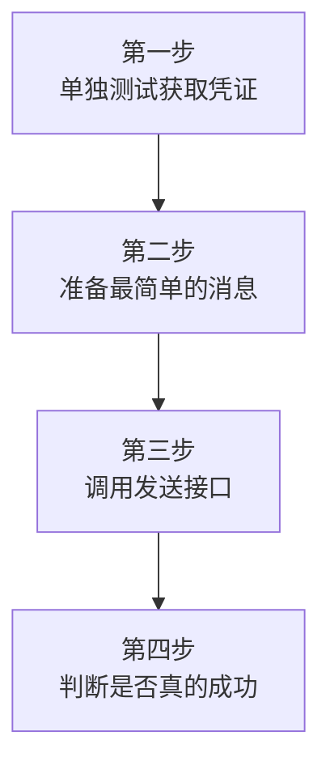
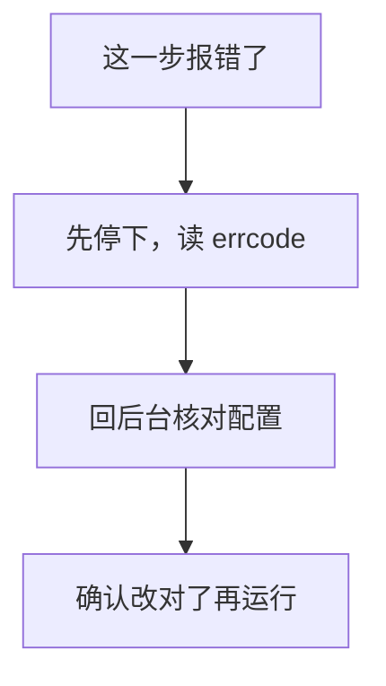
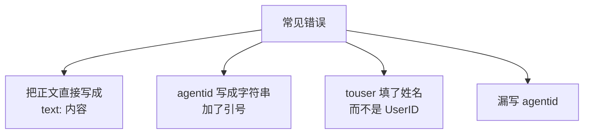
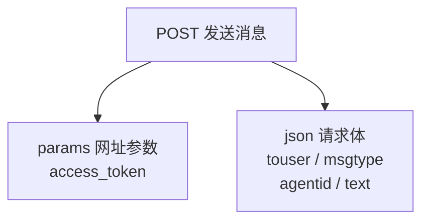
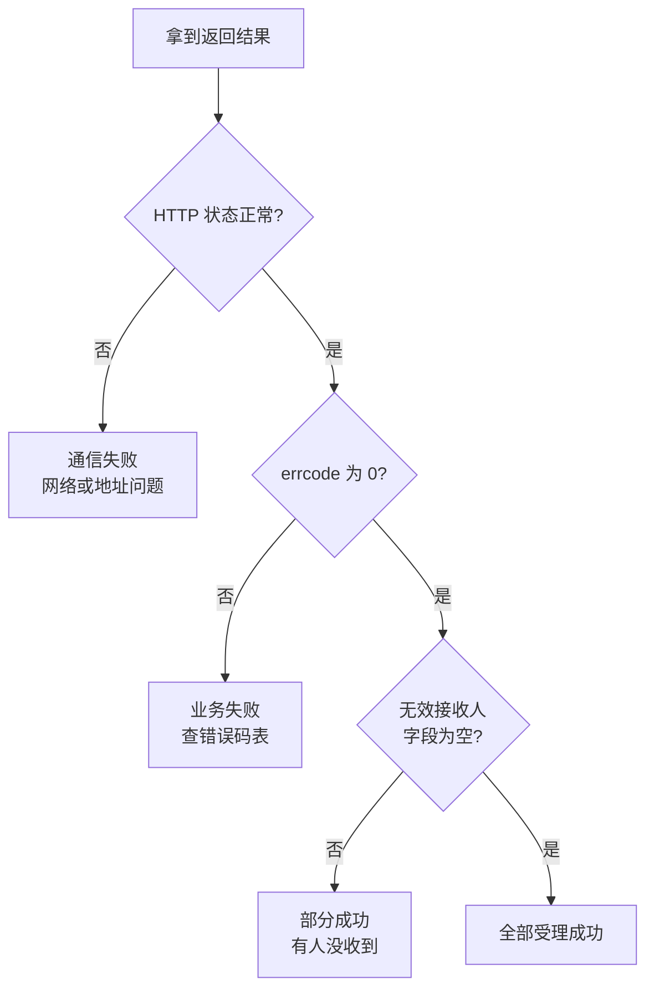
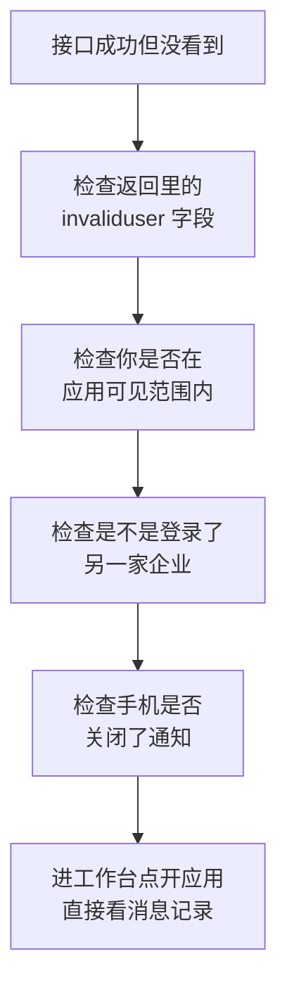
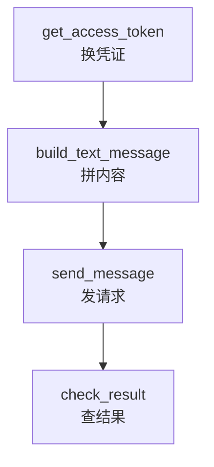

# 第 3 章　第一个最小示例：向一个成员发送一句话

> 所属教程：《Python 调用企业微信应用消息 API：从入门到定时、数据库与防重复发送》  
> 前置章节：第 1 章（原理）、第 2 章（环境准备，`check_config.py` 已显示“检查通过”）  
> 本章目标：**让你的企业微信真正弹出一条由 Python 发出的消息。**

**本章的写法说明：**

本章只追求**最小闭环**，也就是“用最少的东西把整条路走通”。所以这一章：

- 只用**一个文件**，不拆模块（第 5 章再拆）；
- **不做 Token 缓存**（第 8 章再做）；
- **不做失败重试**（第 13 章再做）；
- 不用类，不用异步，不用任何你还没学过的语法。

请先接受这份“简陋”。**能跑通的简陋代码，比写得漂亮却跑不通的代码有价值得多。**

---

## 3.0 本章的四个步骤



**强烈建议按这个顺序，一步一步单独测试**，而不是把完整代码抄下来一次运行。理由很简单：一次只测一步，出错时你立刻知道问题在哪；一次全测，出错时你要在四个可能里猜。

---

## 3.1 第一步：单独测试获取 access_token

### 3.1.1 先只写这一步

在项目目录里新建 `step1_token.py`：

```python
"""
第 3 章 第一步：只测试能不能拿到 access_token

运行：python step1_token.py
"""

import os
import requests
from dotenv import load_dotenv

# 读取 .env 里的配置
load_dotenv()

corp_id = os.getenv("WECOM_CORP_ID")
app_secret = os.getenv("WECOM_APP_SECRET")

# 获取凭证的接口地址（第 1 章讲过：这一步用 GET）
url = "https://qyapi.weixin.qq.com/cgi-bin/gettoken"

# params 是拼在网址后面的参数，requests 会自动帮我们拼成
# ...?corpid=xxx&corpsecret=yyy 的形式
params = {
    "corpid": corp_id,
    "corpsecret": app_secret,
}

# timeout=10 表示最多等 10 秒。
# 千万不要省略这个参数，否则遇到网络问题程序会一直卡住不动。
response = requests.get(url, params=params, timeout=10)

# 先看看服务器返回的原始内容长什么样
print("HTTP 状态码：", response.status_code)
print("返回内容：", response.text)
```

运行：

```bash
python step1_token.py
```

### 3.1.2 成功时你会看到什么

```text
HTTP 状态码： 200
返回内容： {"errcode":0,"errmsg":"ok","access_token":"abcdefg...很长一串","expires_in":7200}
```

请对着这段输出确认三件事：

| 看什么 | 应该是 | 含义 |
|---|---|---|
| `status_code` | `200` | 通信正常（第一道关卡通过） |
| `errcode` | `0` | 业务成功（第二道关卡通过） |
| `expires_in` | `7200` | 这张通行证还能用 7200 秒 |

这就是第 1 章 1.7 节讲的**两道关卡**，你现在亲眼看到了。

### 3.1.3 把值取出来

上面只是打印了原始文本。要在程序里用，得把 JSON 转成 Python 字典。把最后两行换成：

```python
# response.json() 会把返回的 JSON 文本转换成 Python 字典
data = response.json()

# 用 .get() 取值比用 data["errcode"] 更安全：
# 万一没有这个键，.get() 返回 None 而不是直接报错
errcode = data.get("errcode")

if errcode != 0:
    # 失败了就把原因打印出来，不要继续往下走
    print(f"获取凭证失败：errcode={errcode}, errmsg={data.get('errmsg')}")
else:
    access_token = data.get("access_token")
    expires_in = data.get("expires_in")
    # 注意：只打印前 6 位。凭证等同于密码，不要完整打印出来。
    print(f"获取成功！凭证前 6 位：{access_token[:6]}...")
    print(f"长度：{len(access_token)} 位，有效期：{expires_in} 秒")
```

再运行一次，应该看到：

```text
获取成功！凭证前 6 位：abcdef...
长度：136 位，有效期：7200 秒
```

**只打印前 6 位**这个习惯请从现在开始养成。凭证虽然只有两小时有效期，但在这两小时内，拿到它的人可以用你的应用名义发消息。

### 3.1.4 这一步失败了怎么办

先别急着往下做。这一步的错误码非常明确：

| `errcode` | 官方说明 | 你要检查什么 |
|---|---|---|
| `40001` | 不合法的 secret 参数 | ① `Secret` 抄错了；② **`Secret` 和 `CorpID` 不是同一家/同一个应用**；③ **应用被停用了** |
| `40013` | 不合法的 CorpID | `CorpID` 抄错，回「我的企业 → 企业信息」重新复制 |
| `41002` | 缺少 corpid 参数 | `.env` 里 `WECOM_CORP_ID` 是空的 |
| `41004` | 缺少 secret 参数 | `.env` 里 `WECOM_APP_SECRET` 是空的 |
| `60020` | 不安全的访问 IP | 出口公网 IP 不在「企业可信 IP」里（见第 2 章 2.5 节）。**配好后要等约 1 分钟才生效** |
| `50003` | 应用已禁用 | 到「应用管理」里重新启用该应用 |

### 3.1.5 一个必须知道的警告

官方在错误码说明里明确提到：

> **获取 access_token 时，如果应用的 secret 错误多次，会导致同一个 IP 被禁用一小时。**

这条对新手非常关键。想象一下：你 `Secret` 抄错了，程序报错，你不改配置只是反复运行——**试到第若干次，你整个 IP 就被禁一小时**，这时候即使你把 `Secret` 改对了也一样失败，你会彻底困惑。

所以请遵守：



**不要用“再试一次”当作排查手段。**

如果你不幸已经被限制了，唯一的办法是等待，并确认没有别的程序还在用错误的 `Secret` 反复重试。

---

## 3.2 第二步：准备最简单的文本消息

### 3.2.1 一条文本消息的最小结构

发送文本消息，请求体里**必须**有这四项：

| 字段 | 值 | 含义 |
|---|---|---|
| `touser` | 你的 `UserID` | 发给谁 |
| `msgtype` | `"text"` | 这是一条文本消息 |
| `agentid` | 你的 `AgentId`（**数字**） | 以哪个应用的名义发 |
| `text` | `{"content": "..."}` | 消息正文，注意是嵌套的字典 |

写成 Python 字典就是：

```python
payload = {
    "touser": "zhangsan",        # 收件人，必须是 UserID，不是姓名
    "msgtype": "text",           # 消息类型固定写 text
    "agentid": 1000002,          # 数字，不要加引号
    "text": {                    # 注意这里嵌套了一层字典
        "content": "这是我用 Python 发出的第一条消息",
    },
}
```

### 3.2.2 新手在这一步最容易犯的四个错



逐个说明：

1. **`text` 必须是字典，不能是字符串。**

   ```python
   "text": "你好"                  # 错
   "text": {"content": "你好"}     # 对
   ```

2. **`agentid` 是整型。**官方文档明确写“企业应用的 id，整型”，错误码 `40056` 的排查说明里第一条就是“agentid 为整型数字”。

   ```python
   "agentid": "1000002"    # 可能被拒绝
   "agentid": 1000002      # 对
   ```

   因为 `.env` 读出来的都是字符串，所以代码里要转换一次：`int(agent_id)`。

3. **`touser` 必须是 `UserID`。**填姓名会得到 `81013`（全部接收人非法或无权限）。

4. **`agentid` 不能漏。**漏了会得到 `41011`（缺少 agentid 参数）。

### 3.2.3 关于换行

正文里想换行，用 `\n`：

```python
"content": "任务执行完成\n成功：10 条\n失败：0 条"
```

在企业微信里会显示成三行。注意是 `\n`，不是回车键敲出来的真实换行。

### 3.2.4 第一条消息发什么内容

建议带上时间，这样你能确认收到的是**这一次**发的，而不是之前留下的：

```python
from datetime import datetime

now = datetime.now().strftime("%Y-%m-%d %H:%M:%S")
content = f"这是我用 Python 发出的第一条消息\n发送时间：{now}"
```

---

## 3.3 第三步：调用发送应用消息接口

### 3.3.1 关键：参数放在哪里

第 1 章 1.2.3 节强调过，这一步的两类数据**放在不同位置**：



对应的代码：

```python
url = "https://qyapi.weixin.qq.com/cgi-bin/message/send"

response = requests.post(
    url,
    params={"access_token": access_token},   # 凭证：拼到网址上
    json=payload,                            # 消息内容：放在请求体
    timeout=10,
)
```

### 3.3.2 为什么用 `json=` 而不是 `data=`

这是 `requests` 库里一个非常容易搞错的地方：

| 写法 | 实际发出去的内容 | 结果 |
|---|---|---|
| `json=payload` | 标准 JSON 文本，并自动声明内容类型为 JSON | **正确** |
| `data=payload` | 表单格式 `touser=xxx&msgtype=text` | 接口无法解析，报参数错误 |

用 `json=` 还顺带解决了两件事：**帮你做序列化**（第 1 章 1.3.3 节的那个转换），以及**中文不用你自己处理编码**。

> 如果你看到返回的 `errmsg` 里带有 `Warning: wrong json format.`，按官方说明这表示企业微信解析到的参数不完整、JSON 不合法。此时优先怀疑：是不是用了 `data=`，或者自己手工拼了 JSON 字符串。

### 3.3.3 `raise_for_status()` 的作用

```python
response.raise_for_status()
```

这一行的作用是：**如果 HTTP 状态码表示失败（如 404、500），就抛出异常中断程序**。

但请牢记第 1 章的结论——它只管第一道关卡。**状态码 200 但 `errcode` 非 0 的情况，它一概不管。**所以下一节还要自己检查。

---

## 3.4 第四步：判断发送是否真正成功

### 3.4.1 要检查三层，不是一层



第三层最容易被忽略。官方规则是：**部分接收人无权限或不存在时，发送仍然执行**，只是把这些人列在 `invaliduser` 等字段里；只有**全部**接收人都无效，整个调用才会失败（`81013`）。

也就是说，如果你只检查 `errcode`，那么“10 个人里有 3 个没收到”这件事，你的程序完全不会告诉你。

### 3.4.2 检查代码

```python
result = response.json()

errcode = result.get("errcode")
if errcode != 0:
    print(f"发送失败：errcode={errcode}, errmsg={result.get('errmsg')}")
else:
    # 到这里说明企业微信已经受理，但还要看有没有人被跳过
    invalid_fields = {
        "invaliduser": "无效的成员",
        "invalidparty": "无效的部门",
        "invalidtag": "无效的标签",
        "unlicenseduser": "缺少接口许可的成员",
    }

    problems = []
    for field, label in invalid_fields.items():
        value = result.get(field)
        if value:                      # 有内容才算有问题，空字符串忽略
            problems.append(f"{label}：{value}")

    if problems:
        print("部分接收人未发送成功：")
        for text in problems:
            print(f"  - {text}")
    else:
        print("发送成功，全部接收人均已受理。")

    print(f"消息 ID：{result.get('msgid')}")
```

### 3.4.3 `msgid` 有什么用

`msgid` 是这条消息的编号。它的用途是**撤回消息**。

需要注意官方的限制：**仅可撤回 24 小时内的消息**（超时会得到 `42052`）。本教程不展开撤回功能，但请记住一个实际经验：

> 万一把不该发的内容发出去了，`msgid` 是你唯一的补救凭据。所以从第 14 章开始，我们会把 `msgid` 记进日志。

---

## 3.5 完整的单文件最小代码

现在把四步合成一个文件。新建 `send_one_message.py`：

```python
"""
第 3 章：向一个成员发送一条文本消息（最小可运行版本）

设计说明（写给学习者）：
    本文件刻意保持简单，只做一件事：把一条消息发出去。
    以下功能都【故意没有】加入，后续章节会逐步补上：
        - access_token 缓存 ......... 第 8 章
        - 多人 / 部门 / 标签发送 ..... 第 6 章
        - 失败自动重试 .............. 第 13 章
        - 日志记录 .................. 第 14 章

运行前提：
    1. 已按第 2 章准备好 .env，且 python check_config.py 显示"检查通过"
    2. 已激活虚拟环境，且安装了 requests 和 python-dotenv

运行方法：
    python send_one_message.py
"""

import os
from datetime import datetime

import requests
from dotenv import load_dotenv

# ============================================================
# 常量定义
# 把接口地址和超时时间放在文件顶部，方便查看和修改。
# ============================================================

# 获取凭证的接口（GET）
TOKEN_URL = "https://qyapi.weixin.qq.com/cgi-bin/gettoken"

# 发送应用消息的接口（POST）
SEND_URL = "https://qyapi.weixin.qq.com/cgi-bin/message/send"

# 网络请求最多等待多少秒。
# 一定要设置：否则网络异常时程序会一直挂着，既不成功也不失败。
TIMEOUT_SECONDS = 10


# ============================================================
# 第一步：获取 access_token
# ============================================================

def get_access_token(corp_id: str, app_secret: str) -> str:
    """
    用 CorpID 和 Secret 换取 access_token。

    参数:
        corp_id:    企业 ID
        app_secret: 应用的 Secret

    返回:
        access_token 字符串

    出错时:
        抛出 RuntimeError，由调用方处理
    """
    params = {
        "corpid": corp_id,
        "corpsecret": app_secret,
    }

    # 第一道关卡：通信层。网络不通、超时都会在这里抛异常。
    response = requests.get(TOKEN_URL, params=params, timeout=TIMEOUT_SECONDS)
    response.raise_for_status()

    # 把返回的 JSON 文本转成 Python 字典
    data = response.json()

    # 第二道关卡：业务层。HTTP 200 不代表业务成功。
    errcode = data.get("errcode")
    if errcode != 0:
        raise RuntimeError(
            f"获取 access_token 失败：errcode={errcode}, "
            f"errmsg={data.get('errmsg')}"
        )

    access_token = data.get("access_token")
    expires_in = data.get("expires_in")

    # 注意：只打印前 6 位。凭证等同于密码，不可完整输出。
    print(
        f"[1/4] 已获取 access_token："
        f"{access_token[:6]}...（共 {len(access_token)} 位，"
        f"有效期 {expires_in} 秒）"
    )
    return access_token


# ============================================================
# 第二步：构造消息内容
# ============================================================

def build_text_message(agent_id: str, to_user: str, content: str) -> dict:
    """
    组装一条文本消息的请求体。

    参数:
        agent_id: 应用 ID（从 .env 读出来是字符串，这里会转成整数）
        to_user:  接收人的 UserID
        content:  消息正文，用 \\n 换行

    返回:
        可以直接交给 requests 的 json= 参数的字典
    """
    payload = {
        "touser": to_user,          # 发给谁：必须是 UserID
        "msgtype": "text",          # 消息类型：文本
        "agentid": int(agent_id),   # 必须是整型，所以这里转换一次
        "text": {                   # 正文放在嵌套字典里
            "content": content,
        },
        "safe": 0,                  # 0 表示普通消息（1 为保密消息）
    }

    print(f"[2/4] 已准备消息：接收人={to_user}，正文 {len(content)} 字")
    return payload


# ============================================================
# 第三步：调用发送接口
# ============================================================

def send_message(access_token: str, payload: dict) -> dict:
    """
    调用"发送应用消息"接口。

    要点（第 1 章 1.2.3 节）：
        - access_token 放在【网址参数】里
        - 消息内容放在【请求体】里，用 json= 传递
    """
    response = requests.post(
        SEND_URL,
        params={"access_token": access_token},   # 凭证拼在网址上
        json=payload,                            # 内容放请求体，自动转 JSON
        timeout=TIMEOUT_SECONDS,
    )
    response.raise_for_status()

    result = response.json()
    print("[3/4] 请求已送达，正在检查返回结果")
    return result


# ============================================================
# 第四步：检查结果（三层检查中的后两层）
# ============================================================

def check_result(result: dict) -> bool:
    """
    检查发送结果。

    返回:
        True  表示全部接收人都已受理
        False 表示失败，或部分接收人没收到
    """
    # 第二层：业务是否成功
    errcode = result.get("errcode")
    if errcode != 0:
        print(
            f"[4/4] 发送失败：errcode={errcode}, "
            f"errmsg={result.get('errmsg')}"
        )
        print("      请对照本章 3.7 节的错误对照表排查。")
        return False

    # 第三层：是否有接收人被跳过。
    # 官方规则：部分接收人无效时，发送仍会执行，无效的人列在这些字段里。
    invalid_fields = {
        "invaliduser": "无效的成员",
        "invalidparty": "无效的部门",
        "invalidtag": "无效的标签",
        "unlicenseduser": "缺少接口许可的成员",
    }

    problems = []
    for field, label in invalid_fields.items():
        value = result.get(field)
        if value:            # 空字符串或 None 都表示没问题
            problems.append(f"{label}：{value}")

    if problems:
        print("[4/4] 企业微信已受理，但部分接收人未发送成功：")
        for text in problems:
            print(f"      - {text}")
        print("      最常见原因：该成员不在应用的可见范围内。")
        return False

    print(f"[4/4] 发送成功，全部接收人已受理。msgid={result.get('msgid')}")
    return True


# ============================================================
# 主流程
# ============================================================

def main() -> None:
    # 读取 .env 中的配置
    load_dotenv()

    corp_id = os.getenv("WECOM_CORP_ID")
    app_secret = os.getenv("WECOM_APP_SECRET")
    agent_id = os.getenv("WECOM_AGENT_ID")
    to_user = os.getenv("WECOM_TEST_USER_ID")

    # 配置不全就直接停下，不要带着错误往下跑。
    # 这样报错信息清晰，比让接口返回一个含糊的错误码好得多。
    if not all([corp_id, app_secret, agent_id, to_user]):
        print("配置不完整，请先运行 python check_config.py 检查 .env。")
        return

    # 正文里带上时间，方便确认收到的是本次发送的消息
    now = datetime.now().strftime("%Y-%m-%d %H:%M:%S")
    content = f"这是我用 Python 发出的第一条消息\n发送时间：{now}"

    # 用 try/except 兜住网络异常和业务异常，
    # 这样出错时打印一句人话，而不是甩一大段堆栈给你看。
    try:
        access_token = get_access_token(corp_id, app_secret)
        payload = build_text_message(agent_id, to_user, content)
        result = send_message(access_token, payload)
        check_result(result)

    except requests.exceptions.Timeout:
        # 特别注意：超时【不代表】企业微信没收到请求。
        # 这一点在第 12 章处理"防止重复发送"时非常重要。
        print(f"请求超时（超过 {TIMEOUT_SECONDS} 秒）。")
        print("注意：超时不代表消息没发出去，请先到企业微信确认再决定是否重发。")

    except requests.exceptions.RequestException as error:
        # 网络层的其他问题：域名解析失败、连接被拒绝、证书问题等。
        #
        # 【重要】这里只打印异常的"类型名"，不打印异常内容。
        # 原因：requests 的异常信息里通常带着完整请求网址，
        #      而获取凭证的网址上正拼着 corpsecret=你的密钥，
        #      直接 print(error) 会把 Secret 明文输出到终端和日志里。
        print(f"网络请求失败（{type(error).__name__}）。")
        print("请检查网络连接，以及能否访问 qyapi.weixin.qq.com。")

    except RuntimeError as error:
        # 我们自己在业务检查失败时抛出的异常
        print(error)


if __name__ == "__main__":
    main()
```

### 3.5.1 运行

```bash
python send_one_message.py
```

成功时的完整输出：

```text
[1/4] 已获取 access_token：abcdef...（共 136 位，有效期 7200 秒）
[2/4] 已准备消息：接收人=zhangsan，正文 45 字
[3/4] 请求已送达，正在检查返回结果
[4/4] 发送成功，全部接收人已受理。msgid=xxxxxxxxxxxx
```

四行输出对应四个步骤。**哪一步出问题，你一眼就能看出来**——这就是把进度打印出来的价值。

### 3.5.2 特别注意：打印异常也可能泄露密钥

上面代码里有一处细节值得单独拎出来讲，因为几乎所有入门教程都写错了。

新手处理网络异常时通常这样写：

```python
except requests.exceptions.RequestException as error:
    print(f"网络请求失败：{error}")     # 看起来很正常，其实有问题
```

问题在于，`requests` 的异常信息里**通常包含完整的请求网址**。而获取凭证那一步用的是 `GET`，参数是拼在网址上的（第 1 章 1.2.2 节讲过），于是打印出来会是这样：

```text
网络请求失败：HTTPConnectionPool(host='qyapi.weixin.qq.com', port=443):
Max retries exceeded with url:
/cgi-bin/gettoken?corpid=ww123456&corpsecret=你的密钥就这样出现在这里
```

**你的 `Secret` 明文出现在终端里了。**如果这段输出被写进日志文件、贴到群里问人、或者截图发出去，密钥就泄露了。

所以本章代码里写的是：

```python
print(f"网络请求失败（{type(error).__name__}）。")
```

只打印异常的**类型名**（例如 `ConnectionError`、`SSLError`），足够你判断问题性质，又不会带出网址。

> 这一条呼应第 2 章 2.9 节的安全规则：**不要把 `Secret` 打印进日志。**很多人以为自己遵守了，因为代码里确实没有 `print(secret)`——但异常信息会替你打印出来。第 14 章设计日志时会再次处理这个问题。

---

## 3.6 在企业微信客户端确认消息

### 3.6.1 去哪里看

程序说成功了，还要亲眼确认。打开手机或电脑上的**企业微信**（不是微信）：

1. 一般会直接收到通知；
2. 也可以进入**工作台**，找到你创建的那个应用；
3. 点进去就能看到消息记录。

### 3.6.2 消息长什么样

你会看到消息显示为**你创建的那个应用**发来的，带着你上传的图标和应用名称。这就是 `AgentId` 的作用。

### 3.6.3 程序说成功，但就是没看到

按这个顺序查（这是第 1 章 1.7.4 节的顺序，这里补充客户端侧的原因）：



其中第三条容易被忽略：如果你的企业微信登录了多家企业，**要切换到你创建应用的那家企业**才能看到。

最后一条最实用：**通知可能被系统拦截，但工作台里的消息记录不会消失**。所以确认“到底发到没有”，看工作台最可靠。

---

## 3.7 最小示例常见错误对照表

这一节请收藏。表里的错误码和说明依据企业微信官方全局错误码文档整理。

### 3.7.1 获取凭证阶段

| `errcode` | 官方说明 | 处理 |
|---|---|---|
| `40001` | 不合法的 secret 参数 | `Secret` 抄错 / 与 `CorpID` 不匹配 / **应用已停用** / **重置过 Secret 但程序还在用旧的** |
| `40013` | 不合法的 CorpID | 重新从「我的企业 → 企业信息」复制 |
| `41002` | 缺少 corpid 参数 | `.env` 里为空 |
| `41004` | 缺少 secret 参数 | `.env` 里为空 |
| `50003` | 应用已禁用 | 到「应用管理」重新启用 |
| `60020` | 不安全的访问 IP | 配置「企业可信 IP」，**约 1 分钟后生效** |

### 3.7.2 发送消息阶段

| `errcode` | 官方说明 | 最可能的原因 |
|---|---|---|
| `41001` | 缺少 access_token 参数 | **凭证没拼到网址上**，误放进了请求体 |
| `40014` | 不合法的 access_token | 凭证串里混进了非法字符，或用错了类型 |
| `42001` | access_token 已过期 | 超过两小时了，重新获取（第 8 章解决） |
| `40056` | 不合法的 agentid | `AgentId` 写错，或**没写成整型数字** |
| `41011` | 缺少 agentid 参数 | 忘了写 `agentid` |
| `301002` | 无权限操作指定的应用 | **`agentid` 与 `access_token` 不是同一个应用**——就是第 2 章反复强调的“配对”问题 |
| `81013` | UserID、部门 ID、标签 ID 全部非法或无权限 | `UserID` 写错（填了姓名？）；或该成员**不在可见范围**；或已离职被移出通讯录 |
| `81012` | 缺失可见范围 | `touser`、`toparty`、`totag` 一个都没填 |
| `82001` | 指定的成员/部门/标签全部为空 | 同上，参数都是空值 |
| `40003` | 无效的 UserID | `UserID` 格式不合法，或不存在于通讯录 |
| `44004` | 文本消息 content 参数为空 | 正文是空字符串 |
| `45002` | 消息内容大小超过限制 | 文本超过 2048 字节（第 7 章讲怎么防） |
| `40008` | 不合法的 msgtype 参数 | `msgtype` 拼错了 |
| `60011` | 指定的成员/部门/标签参数无权限 | 不在可见范围，或应用对其没有权限 |
| `45009` | 接口调用超过限制 | 触发频率限制，见下文 |

### 3.7.3 `301002` 值得单独说

官方对这个错误码的排查说明大意是：`access_token` 的来源必须拥有指定应用的权限。比如请求里写了 `"agentid": 14`，但用的 `access_token` 是用另一个应用（如 `agentid: 100032`）的 `Secret` 换来的，就会报这个错。

**翻译成人话：你把甲应用的 `Secret` 和乙应用的 `AgentId` 混着用了。**

这就是第 2 章 2.3.5 节那张配对表所说的情况。如果你同时开着两个应用的后台页面抄配置，极容易犯。

### 3.7.4 不是错误码的问题

| 现象 | 原因 | 处理 |
|---|---|---|
| `ModuleNotFoundError: No module named 'requests'` | 没激活虚拟环境 | 重新激活 `.venv` |
| 程序卡住不动 | 没设 `timeout` | 加上 `timeout=10` |
| 报连接错误 / 域名解析失败 | 网址写错，或网络受限 | 确认域名是 `qyapi.weixin.qq.com` |
| `errmsg` 含 `Warning: wrong json format.` | JSON 不合法 | 检查是否误用了 `data=` 而不是 `json=` |
| 中文变成乱码 | 自己拼了 JSON 字符串 | 改用 `json=payload` |
| 打印出 `None` | `.env` 没读到 | 确认文件名是 `.env`，不是 `.env.txt` |

### 3.7.5 关于频率限制

按官方说明，发送应用消息有这些限制：

- **每应用**每天不超过“账号上限数 × 200 人次”（发给 1000 人算 1000 人次）；
- **每应用对同一个成员**不超过 **30 次/分钟**、**1000 次/小时**，超出部分会被丢弃不下发。

请特别注意第二条。学习阶段你就是在**反复给自己一个人发消息**，所以：

> **不要写循环连续跑几十次测试。**一分钟内给自己发超过 30 条，超出的会被直接丢掉，你会误以为是代码坏了。

另外提醒一句：官方还说明调试时如果在 URL 上加 `debug=1` 参数，频率限制会变得极小（每分钟只有 5 次）。本教程不使用这个参数，你也不要加。

---

## 3.8 本章完成标志

请逐项确认：

- [ ] `step1_token.py` 能成功打印出凭证的前 6 位和有效期
- [ ] `send_one_message.py` 完整输出 `[1/4]` 到 `[4/4]` 四行
- [ ] `[4/4]` 那行显示“发送成功，全部接收人已受理”，并带 `msgid`
- [ ] **在企业微信客户端真的看到了这条消息**
- [ ] 消息显示为你创建的那个应用发来的
- [ ] 消息里的时间是你刚才运行的时间
- [ ] 输出里的 `access_token` 是打码的，没有完整出现

### 本章完成标志

> 你的企业微信收到一条消息：“这是我用 Python 发出的第一条消息”，并附有发送时间。

**做到这一步，最难的一关已经过了。**后面所有章节都是在这条链路上加东西，而不是重新来一遍。

---

## 3.9 本章小结

### 3.9.1 你写下的四个函数，就是整个教程的骨架



后面十几章做的事，本质上都是给这四个函数“加装备”：

| 章节 | 给哪个函数加什么 |
|---|---|
| 第 6 章 | `build_text_message` → 支持多人、部门、标签 |
| 第 7 章 | `build_text_message` → 支持 Markdown、图片、文件 |
| 第 8 章 | `get_access_token` → 加缓存 |
| 第 9 章 | `main` → 交给定时器按时调用 |
| 第 11 章 | `build_text_message` → 内容来自 SQL Server |
| 第 12 章 | `main` → 发送前先查“发过没有” |
| 第 13 章 | `send_message` → 失败重试 |
| 第 14 章 | `check_result` → 结果写进日志 |

### 3.9.2 本章必须带走的 6 条结论

1. **一步一步单独测试**，不要一次抄完整代码再运行。
2. **凭证放 `params`，内容放 `json`。**这是最高频的位置错误。
3. **用 `json=` 不用 `data=`**，顺带解决序列化和中文编码。
4. **`agentid` 要转成整数。**
5. **`Secret` 错误反复重试会导致 IP 被禁一小时。**报错先改配置，不要盲目重试。
6. **判断成功要看三层**，尤其别忘了 `invaliduser`。
7. **不要直接打印网络异常内容**，它可能带着拼在网址上的 `Secret`。

### 3.9.3 现在这份代码有什么问题

这是下一章的引子。请自己先想想，这个能跑通的程序有哪些地方“不太对”：

| 问题 | 什么时候会害到你 | 哪一章解决 |
|---|---|---|
| 每次运行都重新换凭证 | 发送量一大就被限流 | 第 8 章 |
| 只能发给一个人 | 要通知一个部门时 | 第 6 章 |
| 正文写死在代码里 | 内容要来自数据库时 | 第 11 章 |
| 用 `print` 输出 | 想查“上周三发了什么”时 | 第 14 章 |
| 失败了就结束 | 遇到网络抖动时 | 第 13 章 |
| 重复运行就重复发送 | 定时任务重复触发时 | 第 12 章 |

### 3.9.4 下一章预告

第 4 章**不写新功能**，而是回过头把这份代码逐行讲透：`import` 到底做了什么、函数的参数和返回值、字典怎么变成 JSON、`try/except` 各自负责什么、`raise_for_status()` 能发现什么不能发现什么、为什么必须设 `timeout`。

**目的是让你从“能复制”变成“能改”。**只有能改，第 5 章的重构才有意义。

---

## 参考的官方文档

1. [企业微信开发者中心：获取 access_token](https://developer.work.weixin.qq.com/document/path/91039) —— 接口地址、参数、`expires_in`
2. [企业微信开发者中心：发送应用消息](https://developer.work.weixin.qq.com/document/path/90236) —— 文本消息结构、返回字段、部分成功规则、频率限制
3. [企业微信开发者中心：全局错误码](https://developer.work.weixin.qq.com/document/path/90313) —— 本章 3.7 节全部错误码及排查方法
4. [企业微信开发者中心：基本概念介绍](https://developer.work.weixin.qq.com/document/path/90665) —— `userid`、`agentid`、`secret`、可见范围

> 本章中的接口字段、错误码含义、频率限制与排查建议，依据上述企业微信官方文档整理并重新表述（内容已为遵守许可限制而改写）。官方明确建议：程序应根据 `errcode` 判断出错情况，不要依赖 `errmsg` 做匹配，因为 `errmsg` 可能会调整。接口细节可能随官方更新而变化，请以最新官方文档为准。
