# 第 4 章　读懂最小代码，而不是只会复制

> 所属教程：《Python 调用企业微信应用消息 API：从入门到定时、数据库与防重复发送》  
> 前置章节：第 3 章（`send_one_message.py` 已成功发出消息）  
> 本章目标：**从“能复制”变成“能改”。**

**本章不新增任何功能。**我们回头把第 3 章那份代码逐行讲透。

为什么要专门花一章做这件事？因为从第 5 章开始，代码会被拆成多个文件，之后还要加缓存、定时、数据库、防重复。**如果你现在对这 240 行只是“看着眼熟”，后面每一次改动都会变成猜谜。**

本章的每个知识点都配一个**小实验**——三五行代码，你自己运行一遍，结论会比读十遍文字都牢。

---

## 4.0 先回顾一下我们要读懂什么

第 3 章的代码结构是这样的：

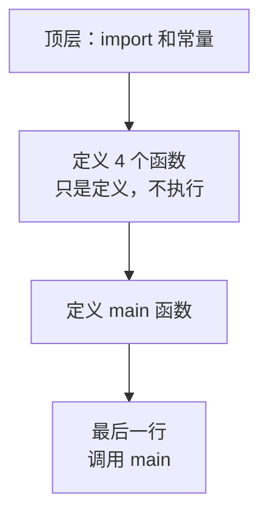

本章按九个问题展开：

| 节 | 要回答的问题 |
|---|---|
| 4.1 | `import` 到底做了什么 |
| 4.2 | 函数的参数和返回值怎么理解 |
| 4.3 | Python 字典是怎么变成 JSON 的 |
| 4.4 | `response.json()` 拿到的是什么 |
| 4.5 | `try/except` 各自管哪种错误 |
| 4.6 | `raise_for_status()` 能发现什么、发现不了什么 |
| 4.7 | 为什么 `timeout` 不能省 |
| 4.8 | 怎么打印调试信息又不泄露密钥 |
| 4.9 | 代码到底按什么顺序执行 |

---

## 4.1 `import` 到底做了什么

### 4.1.1 我们用到的四个 import

```python
import os                          # 标准库：读环境变量
from datetime import datetime      # 标准库：取当前时间
import requests                    # 第三方库：发 HTTP 请求
from dotenv import load_dotenv     # 第三方库：读 .env 文件
```

按来源分成三类，这个分类会一直用到：

| 类别 | 说明 | 本章例子 |
|---|---|---|
| 标准库 | 装了 Python 就有，不用额外安装 | `os`、`datetime`、`json`、`logging` |
| 第三方库 | 需要 `pip install` | `requests`、`python-dotenv`、`pyodbc` |
| 自己写的模块 | 你自己的 `.py` 文件 | 第 5 章会出现 |

按惯例，三类之间空一行分组，顺序是“标准库 → 第三方库 → 自己的模块”。这纯粹是可读性习惯，不影响运行。

### 4.1.2 `import x` 和 `from x import y` 的区别

```python
import os
value = os.getenv("KEY")           # 必须写 os. 前缀

from dotenv import load_dotenv
load_dotenv()                      # 直接用名字，没有前缀
```

| 写法 | 拿到的是 | 使用时 |
|---|---|---|
| `import requests` | 整个模块 | `requests.get(...)` |
| `from dotenv import load_dotenv` | 模块里的**一个函数** | `load_dotenv()` |

那该用哪种？实用建议：

- **`import 模块`**：当你要用模块里很多东西，或者想让代码明确显示“这个功能来自哪个库”。`requests.get` 一眼就知道是 `requests` 的。
- **`from 模块 import 名字`**：当你只用其中一两个，且名字本身足够清楚。

> 注意 `from datetime import datetime` 这一行看着奇怪：**`datetime` 既是模块名，也是模块里的类名**。所以这行的意思是“从 `datetime` 模块里，取出叫 `datetime` 的那个东西”。这是 Python 标准库里一个著名的命名尴尬，记住就好。

### 4.1.3 关键认知：`import` 会**执行**那个文件

很多新手以为 `import` 只是“把名字借过来”。实际上，`import` 会把那个模块文件**从头到尾运行一遍**。

**小实验。**新建 `demo_mod.py`：

```python
print("模块顶层代码被执行了")


def hello():
    print("函数被调用了")


print("函数已定义，但还没被调用")
```

再新建一个文件运行：

```python
print("--- 开始 import ---")
import demo_mod
print("--- import 结束 ---")

demo_mod.hello()

print("--- 再 import 一次 ---")
import demo_mod
print("--- 第二次 import ---")
```

实际输出：

```text
--- 开始 import ---
模块顶层代码被执行了
函数已定义，但还没被调用
--- import 结束 ---
函数被调用了
--- 再 import 一次 ---
--- 第二次 import ---
```

三个结论，都很重要：

1. **`import` 时，模块里的 `print` 真的执行了**——顶层代码会跑。
2. **`def` 只是“定义”，不是“执行”。**定义完函数体里的代码一行都没运行，直到你调用它。
3. **同一个模块 `import` 两次，顶层代码只执行一次。**Python 会缓存已导入的模块。

### 4.1.4 这解释了第 3 章最后那两行

```python
if __name__ == "__main__":
    main()
```

结合上面的实验就清楚了：

- 你**直接运行** `python send_one_message.py` 时，`__name__` 的值是 `"__main__"`，条件成立，`main()` 被调用；
- 如果这个文件**被别的文件 `import`**，`__name__` 就是 `"send_one_message"`，条件不成立，`main()` 不会执行。

**它的作用就是：让这个文件既能直接运行，又能被别人安全地导入。**

如果不写这两行，直接在文件末尾写 `main()`，那么第 5 章你一 `import` 它，消息就被发出去了——这显然不是你想要的。

---

## 4.2 函数参数与返回值

### 4.2.1 拆开看一个函数

```python
def get_access_token(corp_id: str, app_secret: str) -> str:
    ...
    return access_token
```

| 部分 | 含义 |
|---|---|
| `def` | 我要定义一个函数 |
| `get_access_token` | 函数名字 |
| `corp_id`、`app_secret` | 两个参数：调用时要给我的东西 |
| `: str` | 类型标注：我期望它是字符串 |
| `-> str` | 类型标注：我会还给你一个字符串 |
| `return` | 把结果交出去，同时**结束这个函数** |

### 4.2.2 参数是“入口”，返回值是“出口”

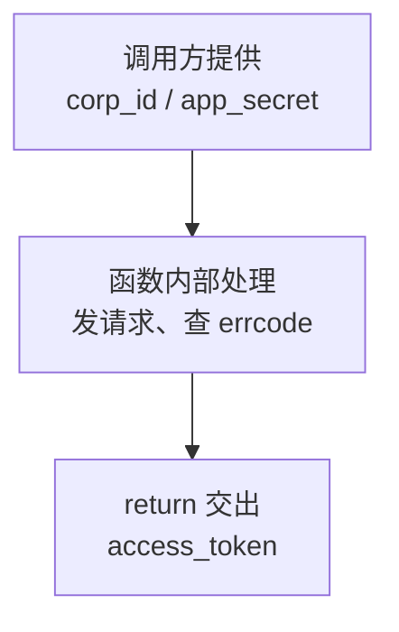

把函数想成一台机器：参数是投料口，返回值是出货口。**函数内部怎么实现，调用方不需要知道。**

这正是第 3 章把四个步骤拆成四个函数的原因。`main()` 读起来是这样的：

```python
access_token = get_access_token(corp_id, app_secret)
payload = build_text_message(agent_id, to_user, content)
result = send_message(access_token, payload)
check_result(result)
```

四行，就是第 1 章那句口诀“换凭证 → 拼消息 → 调接口 → 查结果”。**如果全写在一起，这个结构就看不见了。**

### 4.2.3 没有 `return` 的函数返回什么

`check_result` 有 `return True` / `return False`，但 `main()` 什么都不 `return`。

**规则：函数没有 `return` 时，返回 `None`。**标注写成 `-> None` 就是在说明这一点。

**小实验：**

```python
def no_return():
    print("我什么都不返回")

result = no_return()
print(repr(result))       # 输出：None
```

### 4.2.4 位置参数与关键字参数

```python
build_text_message(agent_id, to_user, content)                        # 按位置
build_text_message(agent_id=..., to_user=..., content=...)             # 按名字
```

按位置传，**顺序必须完全对应**。这有真实风险：

```python
# 假设不小心把后两个参数写反了
build_text_message(agent_id, content, to_user)
```

程序**不会报错**，但它会拿正文当收件人、拿收件人当正文，然后接口返回 `81013`，你会以为是 `UserID` 配错了。

所以本教程的习惯是：**参数超过两三个，或者类型都是字符串容易搞混时，用关键字写法。**多打几个字，换来的是错不了。

第 3 章里 `requests.post(url, params=..., json=..., timeout=...)` 用的就是关键字写法——这也是为什么“凭证放 `params`、内容放 `json`”能一眼看出来。

### 4.2.5 重要：类型标注**不会**被强制执行

这一点必须讲清楚，否则会有安全感错觉。

**小实验：**

```python
def f(n: int) -> int:
    return n

print(repr(f("我是字符串")))
```

实际输出：

```text
'我是字符串'
```

**标注写着要 `int`，传字符串一样跑，一声不吭。**

所以类型标注的真实作用是：

| 作用 | 说明 |
|---|---|
| 给人看 | 读代码时立刻知道该传什么 |
| 给工具看 | 编辑器能据此提示、检查 |
| **不做运行时检查** | Python 不会替你拦 |

这就是为什么 `build_text_message` 里仍然要写 `int(agent_id)` 主动转换——标注 `agent_id: str` 只是说明，不会自动帮你转成整数。

---

## 4.3 Python 字典如何变成 JSON

### 4.3.1 我们从没手写 JSON

回顾第 3 章，我们写的一直是 Python 字典：

```python
payload = {
    "touser": to_user,
    "msgtype": "text",
    "agentid": int(agent_id),
    "text": {"content": content},
    "safe": 0,
}
```

然后交给 `requests`：

```python
requests.post(SEND_URL, params={...}, json=payload, timeout=10)
```

**关键就在 `json=payload` 这个写法。**它替你做了两件事：把字典序列化成 JSON 文本，并声明内容类型是 JSON。

### 4.3.2 实测：`json=` 和 `data=` 发出去的东西完全不同

**小实验**（用 `requests` 的“预备请求”功能，可以看到实际要发的内容，但不真的发出去）：

```python
import requests

payload = {"text": {"content": "磁盘告警\n第二行"}, "agentid": 1000002, "safe": 0}

# 用 json=
req = requests.Request("POST", "https://example.com", json=payload).prepare()
print("Content-Type:", req.headers.get("Content-Type"))
print("body:", req.body)

# 用 data=
req2 = requests.Request("POST", "https://example.com",
                        data={"touser": "zhangsan", "msgtype": "text"}).prepare()
print("Content-Type:", req2.headers.get("Content-Type"))
print("body:", req2.body)
```

实际输出：

```text
Content-Type: application/json
body: b'{"text": {"content": "\\u78c1\\u76d8\\u544a\\u8b66\\n\\u7b2c\\u4e8c\\u884c"}, "agentid": 1000002, "safe": 0}'

Content-Type: application/x-www-form-urlencoded
body: touser=zhangsan&msgtype=text
```

看清区别了：

| | `json=` | `data=` |
|---|---|---|
| 内容类型 | `application/json` | `application/x-www-form-urlencoded` |
| 内容形态 | JSON 文本 | `键=值&键=值` 的表单 |
| 企业微信能否解析 | **能** | **不能** |

这就是第 3 章 3.3.2 节那条规则的实证。用错了，接口会告诉你参数不合法，甚至在 `errmsg` 里带上 `Warning: wrong json format.`。

### 4.3.3 中文被转成了 `\uXXXX`，这正常吗

正常。注意上面输出里的 `\u78c1\u76d8`，那就是“磁盘”两个字。

原因是 Python 的 JSON 序列化默认开启 ASCII 转义：

```python
import json
payload = {"content": "磁盘告警"}
print(json.dumps(payload))                      # {"content": "\u78c1\u76d8\u544a\u8b66"}
print(json.dumps(payload, ensure_ascii=False))  # {"content": "磁盘告警"}
```

两种写法都是**合法的 JSON**，含义完全一样，接收方解析出来都是“磁盘告警”。所以：

> **不用管它。**中文显示为 `\uXXXX` 只是传输时的转义形式，不是乱码。

真正会出乱码的场景是：**你自己拼 JSON 字符串、自己处理编码。**只要坚持“写字典 + 用 `json=`”，这个坑就绕过去了。

### 4.3.4 Python 和 JSON 的三处写法差异

**小实验：**

```python
import json
print(json.dumps({"safe": True, "extra": None}))
```

输出：

```text
{"safe": true, "extra": null}
```

对照表（第 1 章列过，这里是实证）：

| Python 写法 | JSON 写法 |
|---|---|
| `True` / `False` | `true` / `false` |
| `None` | `null` |
| 字符串可用单引号 | **只能双引号** |

这三处差异，正是**不要手写 JSON 文本**的理由：你写 `{'safe': True}` 是合法 Python 但不是合法 JSON，而交给库转换就永远不会错。

### 4.3.5 有些类型不能直接放进 JSON

这是第 11 章从数据库取数据时一定会撞上的问题，提前认识一下。

**小实验：**

```python
import json, datetime
json.dumps({"time": datetime.datetime.now()})
```

实际报错：

```text
TypeError: Object of type datetime is not JSON serializable
```

**日期时间对象不能直接序列化。**这就是第 3 章为什么先转成字符串：

```python
now = datetime.now().strftime("%Y-%m-%d %H:%M:%S")
```

**记住这条：从数据库读出来的日期、金额（`Decimal`）等类型，放进消息之前都要先转成字符串。**第 11 章会专门处理格式化。

---

## 4.4 `response.json()` 得到了什么

### 4.4.1 `.text` 和 `.json()` 的区别

```python
response.text      # 服务器返回的原始字符串
response.json()    # 把那串 JSON 文本解析成 Python 字典
```

第 3 章 3.1 节先用 `.text` 看原始内容，再改成 `.json()` 取值——就是这两者的关系。

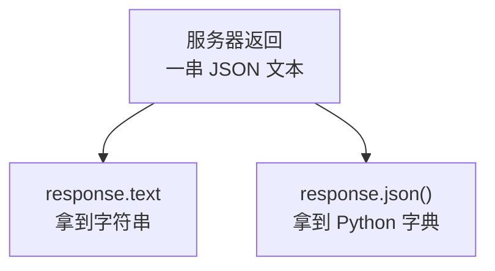

拿到字典之后，就是普通的 Python 操作了：`data.get("errcode")`、`data.get("access_token")`。

### 4.4.2 返回的不是 JSON 时会怎样

**小实验结论**（我实测过）：如果服务器返回的是 HTML 或纯文本，调用 `.json()` 会抛出 `JSONDecodeError`。

什么时候会遇到？典型情况是**公司网络有代理或网关**，它拦截了你的请求并返回了一个 HTML 提示页。这时状态码可能还是 200，但内容根本不是 JSON。

好消息是：在当前版本的 `requests` 里，`JSONDecodeError` 属于 `RequestException` 的子类。所以第 3 章那句 `except requests.exceptions.RequestException` **已经把这种情况兜住了**。

### 4.4.3 `.get()` 和 `[]` 的区别

**小实验：**

```python
data = {"errcode": 0}

print(repr(data.get("errmsg")))            # None
print(repr(data.get("errmsg", "没有")))     # '没有'
print(data["errmsg"])                      # KeyError: 'errmsg'
```

| 写法 | 键不存在时 |
|---|---|
| `data.get("k")` | 返回 `None`，程序继续 |
| `data.get("k", 默认值)` | 返回你指定的默认值 |
| `data["k"]` | **直接抛 `KeyError`，程序中断** |

处理接口返回时，本教程一律用 `.get()`。理由很实际：**接口返回的字段不是每次都齐全。**

比如发送成功时返回里有 `msgid`，但发送失败时可能就没有这个字段。如果写 `result["msgid"]`，失败时你的程序会因为 `KeyError` 崩掉——**真正的失败原因（`errcode`）反而没机会打印出来**，你只看到一个莫名其妙的报错。

### 4.4.4 一个必须知道的陷阱：`None` 和 `0`

**小实验：**

```python
missing = {}                                # 假设返回里根本没有 errcode
print(missing.get("errcode") == 0)          # False
print(missing.get("errcode") != 0)          # True
```

这个结果很关键。看第 3 章的判断：

```python
errcode = result.get("errcode")
if errcode != 0:
    # 判定为失败
```

如果返回里**没有** `errcode` 字段，`errcode` 就是 `None`，而 `None != 0` 成立，所以会被判定为**失败**。

**这正是我们想要的行为**：字段缺失说明返回结果不正常，保守地当作失败处理，比乐观地当成成功安全得多。

反过来，如果当初写成 `if errcode == 0: 成功`，那么字段缺失时会走到 `else`，看起来结果一样——但语义上是“我只在明确看到 0 时才认为成功”。两种写法在这里等价，**但请始终选择“不明确就当失败”的那一种**。这个原则在第 12 章（防止重复发送）里会变得非常重要。

---

## 4.5 `try/except` 负责处理哪些错误

### 4.5.1 第 3 章的四个 `except` 分别管什么

```python
try:
    access_token = get_access_token(corp_id, app_secret)
    payload = build_text_message(agent_id, to_user, content)
    result = send_message(access_token, payload)
    check_result(result)

except requests.exceptions.Timeout:
    ...
except requests.exceptions.RequestException as error:
    ...
except RuntimeError as error:
    ...
```

| `except` 分支 | 管什么 | 什么时候触发 |
|---|---|---|
| `Timeout` | 超时 | 超过 10 秒没响应 |
| `RequestException` | 其他网络问题 | 域名解析失败、连接被拒、证书错误、返回不是 JSON |
| `RuntimeError` | **我们自己抛的业务错误** | `errcode` 非 0 时我们主动 `raise` |

### 4.5.2 异常是怎么“往上传”的

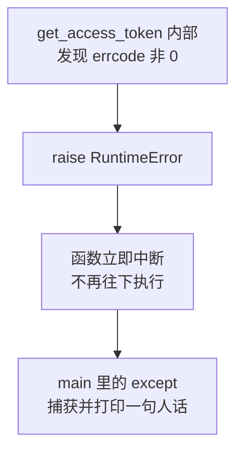

关键点：`raise` 之后，**函数会立刻中断**，后面的代码一行都不执行，异常一路“向上抛”，直到遇到能接住它的 `except`。

这带来一个很实用的好处：`get_access_token` 里不需要写“如果失败就返回一个特殊值，然后调用方记得检查”这类啰嗦逻辑。**失败就抛，让上层统一处理。**

### 4.5.3 关键细节：`except` 的顺序不能随便写

这是本节最重要的内容，也是很多人踩过的坑。

**实测的异常继承关系：**

```text
Timeout          是 RequestException 的子类? True
ConnectionError  是 RequestException 的子类? True
HTTPError        是 RequestException 的子类? True
JSONDecodeError  是 RequestException 的子类? True
```

也就是说，`requests` 的这些异常都在同一个家族里：

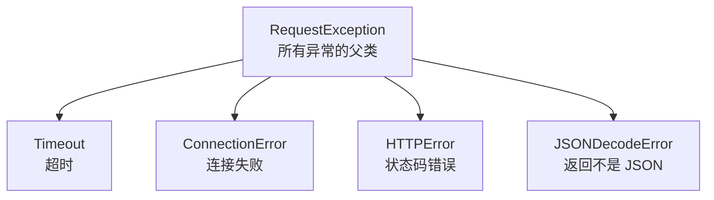

**而 Python 匹配 `except` 是从上到下、第一个匹配就停。**所以：

```python
# 正确：先具体，后笼统
except requests.exceptions.Timeout:
    print("超时了")
except requests.exceptions.RequestException:
    print("其他网络问题")
```

```python
# 错误：顺序颠倒
except requests.exceptions.RequestException:
    print("其他网络问题")
except requests.exceptions.Timeout:
    print("超时了")            # 永远不会执行！
```

第二种写法里，超时会先被父类接住，那个专门处理超时的分支成了**死代码**。而超时恰恰是唯一需要特殊对待的情况（下一小节说明），把它漏掉后果很严重。

> **规则：`except` 一律按“从具体到笼统”排列。**

还有一个有意思的实测发现：`ConnectTimeout`（连接阶段超时）**同时是 `ConnectionError` 和 `Timeout` 的子类**。所以如果你把 `ConnectionError` 写在 `Timeout` 前面，连接超时会跑进“连接失败”分支，而不是“超时”分支。这进一步说明：**顺序真的会改变程序行为。**

### 4.5.4 为什么超时要单独处理

看第 3 章的注释：

```python
except requests.exceptions.Timeout:
    print(f"请求超时（超过 {TIMEOUT_SECONDS} 秒）。")
    print("注意：超时不代表消息没发出去，请先到企业微信确认再决定是否重发。")
```

**这是整个教程最重要的一个概念，请务必理解。**

超时的含义是“我在规定时间内没等到回复”，它**不等于**“对方没收到我的请求”。可能发生的情况是：

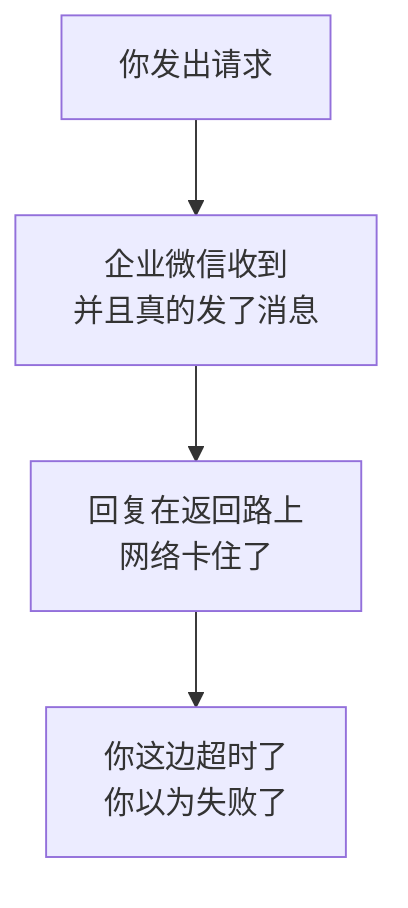

于是：**你判断为失败 → 重发一次 → 对方收到两条。**

这就是第 12 章要专门用一整章解决“防止重复发送”的根源之一。现在你只需要记住这条铁律：

> **超时之后不要盲目重发。**

### 4.5.5 `RuntimeError` 只是权宜之计

第 3 章用 `RuntimeError` 表示业务失败，这是为了不引入新概念。它的缺点是**太笼统**：无法区分“取凭证失败”和“发消息失败”。

第 5 章会改成自定义异常，比如 `TokenError` 和 `SendMessageError`，这样上层可以针对不同情况做不同处理——例如“凭证失效就刷新重试，参数错误就直接放弃”。这在第 13 章设计重试策略时是必需的。

---

## 4.6 `raise_for_status()` 能发现什么、不能发现什么

### 4.6.1 它只看 HTTP 状态码

**小实验实测结果：**

| 服务器返回 | `raise_for_status()` 的反应 |
|---|---|
| `500` | 抛出 `HTTPError` |
| `404` | 抛出 `HTTPError` |
| **`200` + `{"errcode": 40001}`** | **什么都不做** |

第三行就是它的盲区。实测输出是这样的：

```text
状态码: 200
raise_for_status 什么都没做（这就是它的盲区）
但 errcode 明明是失败的: {'errcode': 40001, 'errmsg': 'invalid credential'}
```

### 4.6.2 所以它对应第一道关卡

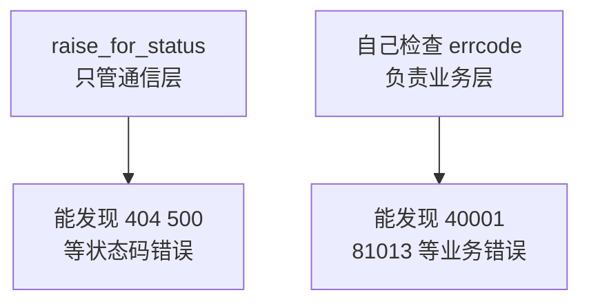

回到第 1 章 1.7 节那两道关卡：`raise_for_status()` 是第一道，**你自己写的 `errcode` 判断是第二道**，两者不能互相替代。

### 4.6.3 既然企业微信几乎总返回 200，这行还有必要吗

有必要。因为返回给你的东西**不一定来自企业微信**。

中间可能还有：公司代理服务器、网关、防火墙、CDN。当它们出问题时，你收到的是它们返回的 `502`、`503`、`407`，而不是企业微信的 JSON。

如果没有 `raise_for_status()`，程序会拿着一段 HTML 去调 `.json()`，然后抛出 `JSONDecodeError`——错误信息会指向“JSON 解析失败”，而真正的问题是“代理返回了 502”。**留着这一行，报错就会直接指向真正的原因。**

一句话总结：

> `raise_for_status()` 让“不是企业微信给的回复”这种情况立刻暴露，而不是伪装成 JSON 解析错误。

---

## 4.7 为什么请求必须设置 `timeout`

### 4.7.1 不设会发生什么

`requests` **默认没有超时限制**。这意味着极端情况下，程序可能一直等下去。

对第 3 章那个手工运行的脚本，后果只是“卡住了，按 Ctrl+C 结束”。但请想一想第 9 章之后的场景：

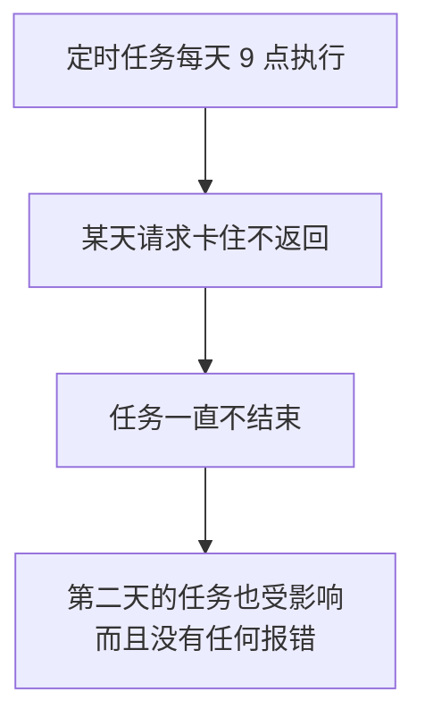

**没有任何错误信息、没有任何日志，程序就那样静静地挂着。**这类问题排查起来非常痛苦。

所以规则很简单：

> **每一个 `requests` 调用都要写 `timeout`。**

### 4.7.2 `timeout=10` 具体在限制什么

`timeout` 实际管两个阶段：

| 阶段 | 含义 |
|---|---|
| 连接超时 | 建立连接花了多久 |
| 读取超时 | 连上之后，等第一批数据花了多久 |

写 `timeout=10` 表示两个阶段各自最多 10 秒。也可以分别指定：

```python
requests.post(url, json=payload, timeout=(5, 30))   # 连接 5 秒，读取 30 秒
```

本教程统一用 `timeout=10`，够用且简单。

### 4.7.3 设多长合适

| 场景 | 建议 |
|---|---|
| 发送消息、获取凭证 | 10 秒左右 |
| 上传图片、文件（第 7 章） | 30～60 秒，文件大要给足时间 |
| 定时任务里的调用 | 不宜过长，避免长期占住任务 |

一个反直觉但重要的提醒：**不要为了“更容易成功”把超时设得很长。**

超时设成 300 秒，遇到问题时你要等 5 分钟才知道失败；而且第 4.5.4 节讲过，**超时越多，“到底发出去没有”这种模糊状态就越多**，反而给第 12 章的防重复增加麻烦。宁可快速失败，然后按第 13 章的策略重试。

### 4.7.4 `timeout` 和第 12 章的关系

再强调一次这条链条：

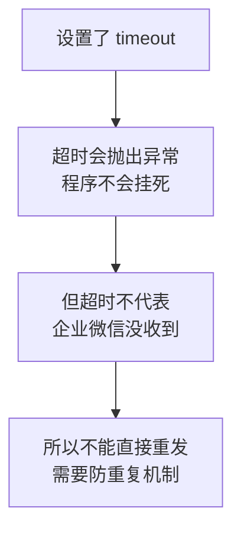

**`timeout` 保护的是你的程序，不是消息的准确性。**这两件事要分开。

---

## 4.8 调试时怎样打印信息而不泄露密码

### 4.8.1 三个会不小心泄露密钥的地方

新手调试时最自然的动作就是“把变量打印出来看看”。但有三处一打印就出事：

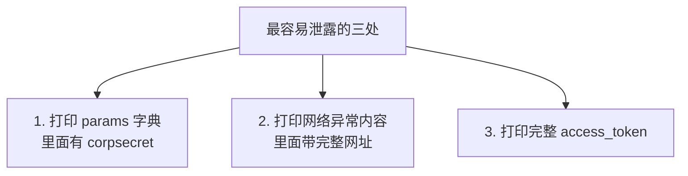

第一处是新增的提醒，第 3 章没讲：

```python
params = {
    "corpid": corp_id,
    "corpsecret": app_secret,
}
print(params)      # 密钥完整输出
```

调试时“打印一下参数看看对不对”是很自然的动作，但这一行就把 `Secret` 明文打出来了。

第二处第 3 章 3.5.2 节详细讲过——`requests` 的异常信息带完整网址，而获取凭证的网址上拼着 `corpsecret`。

### 4.8.2 三条对应的做法

**做法一：打印敏感值时打码。**沿用第 2 章 `check_config.py` 里的思路：

```python
def mask(value: str, keep: int = 4) -> str:
    """把敏感值打码，只留首尾各几位"""
    if not value:
        return "（空）"
    if len(value) <= keep * 2:
        return f"（共 {len(value)} 位，内容已隐藏）"
    return f"{value[:keep]}...{value[-keep:]}（共 {len(value)} 位）"
```

用它来打印参数：

```python
print(f"corpid={corp_id}, corpsecret={mask(app_secret)}")
```

**做法二：只打印异常类型名。**

```python
except requests.exceptions.RequestException as error:
    print(f"网络请求失败（{type(error).__name__}）。")
```

`type(error).__name__` 给你 `ConnectionError`、`SSLError` 这样的名字，足够判断问题性质，又不带网址。

**做法三：凭证只打印前几位。**

```python
print(f"已获取 access_token：{access_token[:6]}...")
```

打印前 6 位是有用的——多次运行时你能看出“凭证换了没有”，这在第 8 章调试缓存时很实用。

### 4.8.3 哪些信息应该大方地打印

反过来说，有些信息**不打印才是错的**：

| 内容 | 打不打 | 理由 |
|---|---|---|
| `Secret` | **不打** | 等于密码 |
| 完整 `access_token` | **不打** | 两小时内等于密码 |
| `access_token` 前几位 | 打 | 用于判断是否换了新凭证 |
| `errcode` / `errmsg` | **一定要打** | 排查全靠它 |
| `UserID` | 打 | 不敏感，且排查必需 |
| `msgid` | 打 | 撤回消息的唯一凭据 |
| 无效接收人字段 | **一定要打** | 否则不知道谁没收到 |

**最容易犯的错误不是“打印了太多”，而是“出错时什么都没打印”。**很多人只打印“发送失败”三个字，然后完全不知道从哪查。

### 4.8.4 这一节现在只是习惯，第 14 章会变成机制

目前我们用的是 `print`，它有两个问题：

- 关掉终端就没了，查不到“上周三发了什么”；
- 没法区分“正常信息”和“严重错误”。

第 14 章会换成 `logging`，并把脱敏做成统一规则，而不是靠你每次记得。**但规则本身现在就要养成，工具是后面的事。**

---

## 4.9 用流程图重新理解代码执行顺序

### 4.9.1 从上到下不等于执行顺序

初学者常以为代码是从第一行执行到最后一行。实际上第 3 章那个文件的执行顺序是这样的：

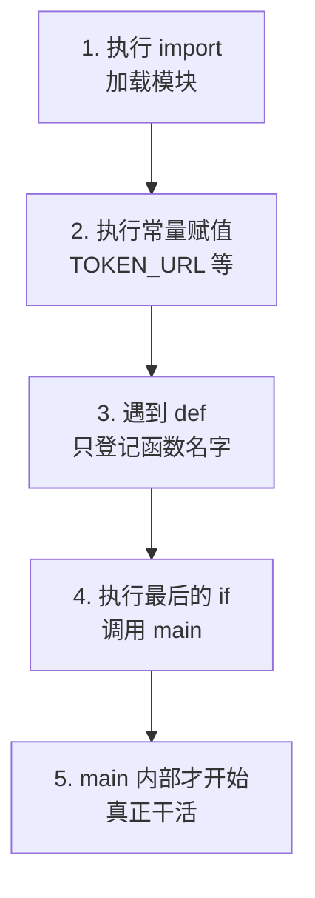

结合 4.1.3 的实验就好理解了：**`def` 是“登记”，不是“执行”。**四个函数的函数体，直到 `main()` 里被调用才会运行。

这解释了一个常见困惑：“为什么函数定义在上面，但我在 `main` 里调用它就能用？”因为第 3 步已经把名字都登记好了，第 5 步才开始按需调用。

### 4.9.2 正常路径

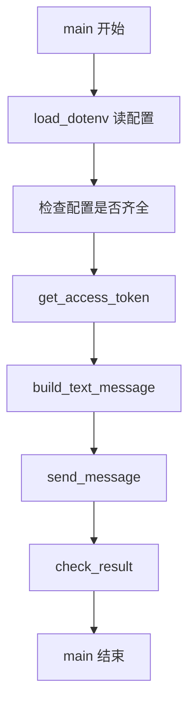

### 4.9.3 出错时的路径

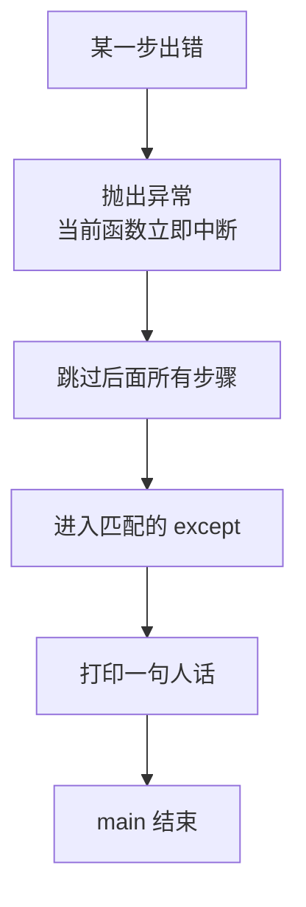

请注意第二个方框：**中间任何一步失败，后面的步骤全部跳过。**

比如取凭证失败，就不会去拼消息、不会去调接口。这正是我们要的——**没有凭证就不该继续往下走**。

### 4.9.4 配置检查为什么放在最前面

```python
if not all([corp_id, app_secret, agent_id, to_user]):
    print("配置不完整，请先运行 python check_config.py 检查 .env。")
    return
```

`return` 让 `main()` 提前结束。这种写法叫“早退”，好处是：

| 不做前置检查 | 做前置检查 |
|---|---|
| 带着空配置去调接口 | 立刻停下 |
| 得到 `41002`、`41004` 这类错误码 | 得到一句中文提示 |
| 你还要去查错误码含义 | 你直接知道该改 `.env` |

**能在本地发现的问题，就不要送到接口那边去发现。**这个原则第 5 章会继续强化，第 6 章发送多人时更重要——那时“空的接收人列表”必须在本地就拦下来。

---

## 4.10 本章小结

### 4.10.1 十条实测得出的结论

1. **`import` 会真正执行模块的顶层代码**，但同一模块只执行一次。
2. **`def` 只是定义**，函数体要等被调用才运行。
3. `if __name__ == "__main__":` 让文件既能直接运行、又能被安全导入。
4. **类型标注不会被强制执行**，该转换还得自己转（`int(agent_id)`）。
5. **`json=` 发 JSON，`data=` 发表单**，企业微信只认前者。
6. **中文变成 `\uXXXX` 是正常转义**，不是乱码。
7. **日期时间对象不能直接放进 JSON**，要先转字符串。
8. **取接口返回值一律用 `.get()`**，字段可能缺失。
9. **`except` 必须从具体到笼统**，否则专门的分支成了死代码。
10. **`raise_for_status()` 只管状态码**，`errcode` 必须自己检查。

### 4.10.2 两条要背下来的铁律

> **铁律一：判断成功要看三层**——HTTP 状态、`errcode`、无效接收人字段。

> **铁律二：超时不代表没发出去**——不要盲目重发。

第一条你已经在代码里实现了。第二条会在第 12 章展开成一整套机制。

### 4.10.3 自测题

不看上文回答，答不上来的回去翻对应小节：

1. 为什么第 3 章的代码里要写 `int(agent_id)`？（4.2.5）
2. 把 `json=payload` 改成 `data=payload` 会发生什么？（4.3.2）
3. `result["msgid"]` 和 `result.get("msgid")` 有什么区别，为什么本教程用后者？（4.4.3）
4. 如果把 `except RequestException` 写在 `except Timeout` 前面，会有什么后果？（4.5.3）
5. 企业微信返回 `200` 且 `errcode` 是 `40001`，`raise_for_status()` 会抛异常吗？（4.6.1）
6. 为什么不能把 `timeout` 设成 300 秒来“提高成功率”？（4.7.3）
7. 调试时打印哪三样东西会泄露密钥？（4.8.1）

### 4.10.4 下一章预告

第 5 章开始动手重构。目前的单文件有几个具体问题：

| 问题 | 后果 |
|---|---|
| 配置读取散落在 `main` 里 | 加新配置要改好几处 |
| 接口地址写在业务代码旁边 | 想换应用要翻代码 |
| `RuntimeError` 太笼统 | 无法区分该重试还是该放弃 |
| 所有东西挤在一个文件 | 加定时、数据库后会变成几百行难以维护的代码 |

第 5 章会拆成 `config.py`、`wecom_client.py`、`main.py` 三个文件，并引入自定义异常。**功能一点不变**——重构的验收标准就是“发出来的消息和第 3 章完全一样”。

---

## 参考的官方文档

1. [企业微信开发者中心：获取 access_token](https://developer.work.weixin.qq.com/document/path/91039)
2. [企业微信开发者中心：发送应用消息](https://developer.work.weixin.qq.com/document/path/90236)
3. [企业微信开发者中心：全局错误码](https://developer.work.weixin.qq.com/document/path/90313) —— 官方明确建议：程序应根据 `errcode` 判断出错情况，不要依赖 `errmsg` 做匹配

> 本章中关于企业微信接口行为的说明依据上述官方文档整理并重新表述（内容已为遵守许可限制而改写）。本章所有 Python 语言行为、`requests` 库行为的结论，均在 Python 环境中实际运行验证；不同版本的库可能存在细微差异，如遇不一致请以你本机的实际运行结果为准。
