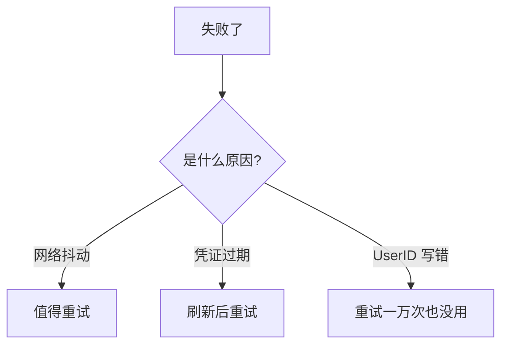
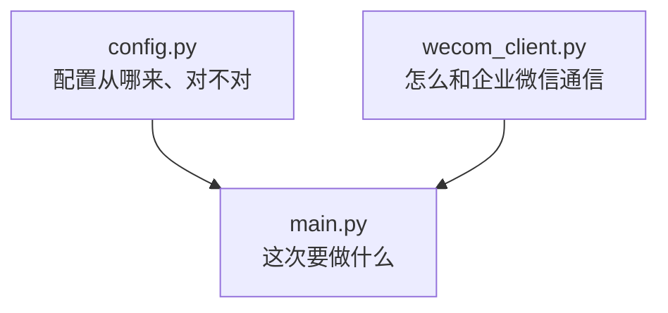
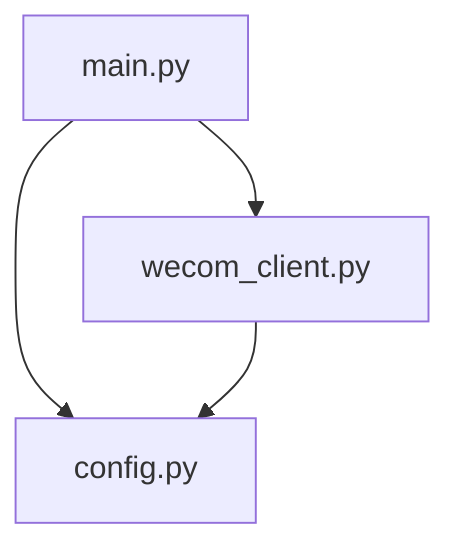
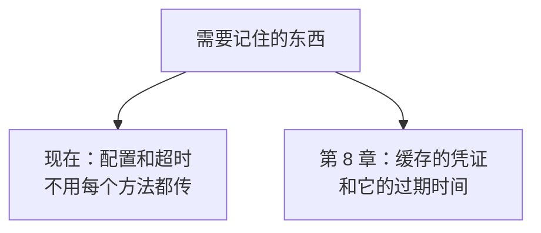
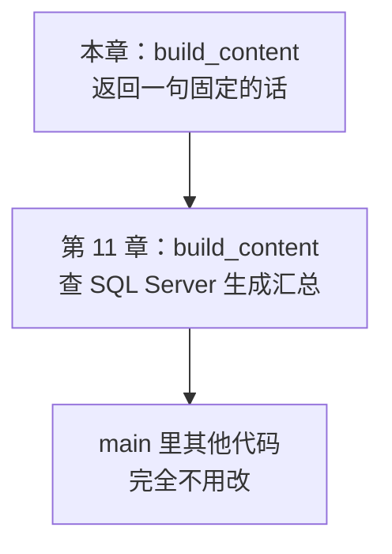
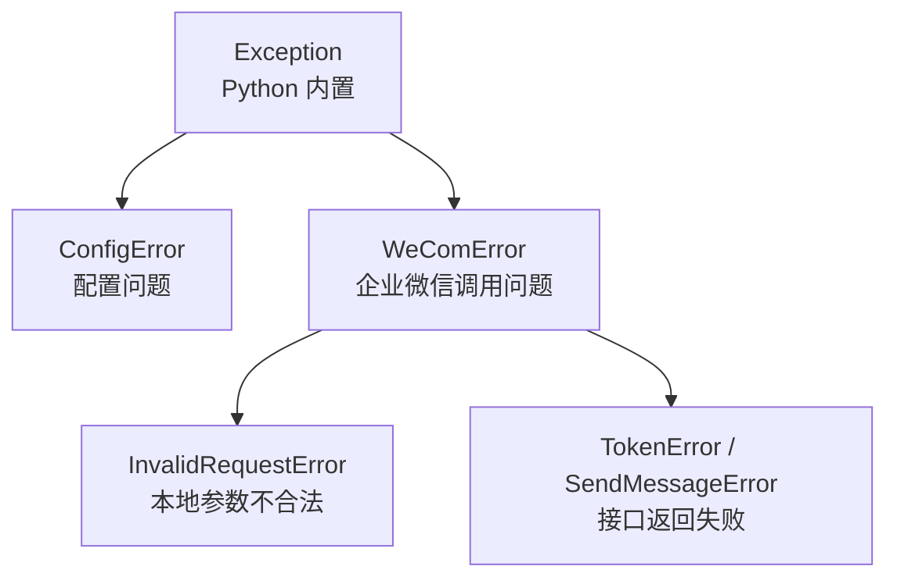
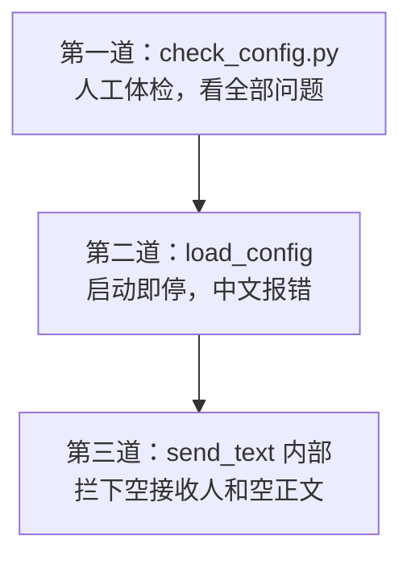

# 第 5 章　第一次整理：把单文件脚本拆成容易维护的结构

> 所属教程：《Python 调用企业微信应用消息 API：从入门到定时、数据库与防重复发送》  
> 前置章节：第 3 章（消息已发出）、第 4 章（读懂了那份代码）  
> 本章目标：把一个文件拆成三个文件，**功能一点不变**。

**本章的验收标准很特别：发出来的消息和第 3 章完全一样。**

这听起来像白干一场。但这一章是整个教程的分水岭——**不做这次拆分，后面每加一个功能，代码都会更难改一点，到第 12 章基本就废了。**

---

## 5.1 为什么运行成功后还要拆分代码

### 5.1.1 先诚实地评价第 3 章那份代码

它有一个巨大优点：**能跑通**。除此之外，问题不少：

| 问题 | 具体表现 | 什么时候害到你 |
|---|---|---|
| 职责混在一起 | 读配置、调接口、打印提示都挤在 `main` | 想改一处，得先读懂全部 |
| 配置读取散落 | 四个 `os.getenv` 加一个 `if not all(...)` | 第 10 章加数据库配置时要改好几处 |
| 校验逻辑重复 | `check_config.py` 检查过一遍，`main` 又检查一遍 | 两处规则会慢慢不一致 |
| 异常太笼统 | 全靠 `RuntimeError` | **无法区分“该重试”和“该放弃”** |
| 结果检查外置 | `check_result` 只是打印，没把结论交出去 | 上层没法根据结果决定下一步 |
| 无法被复用 | 想在别处发消息，只能复制粘贴 | 第 9 章定时任务要调用它 |

### 5.1.2 关键的一条：为什么“异常太笼统”是硬伤

这一条值得单独说，因为它决定了后面几章能不能写下去。

第 13 章要做重试。重试有一条铁律：**只重试有希望成功的错误。**



第 3 章的代码里，后两种情况抛出的都是 `RuntimeError`，**上层根本分不出来**。于是你只有两个糟糕的选择：全都重试（把明显错误的请求发几十次，可能触发频率限制），或者全都不重试（放弃真正的临时故障）。

所以本章要做的不只是“文件分家”，而是**把错误分类这件事建立起来**。

### 5.1.3 拆分的目标：一个文件回答一个问题



判断标准很简单：**出错时，你能立刻说出该去哪个文件找问题吗？**

| 报错信息 | 去哪个文件 |
|---|---|
| “缺少配置项 WECOM_AGENT_ID” | `config.py` |
| “获取 access_token 失败：errcode=40001” | `wecom_client.py` |
| “部分接收人未送达” | `main.py`（怎么提示用户）|

### 5.1.4 重构的纪律

**重构 = 改变代码结构，不改变行为。**

所以本章有一条纪律：**不许顺手加新功能。**

你可能很想“既然都改了，顺便把多人发送加上吧”。**不要。**因为一旦同时改结构又加功能，出问题时你无法判断是拆错了还是新功能写错了。多人发送是第 6 章的事。

---

## 5.2 逐步建立项目结构

### 5.2.1 拆分后的样子

```text
wecom-message-tutorial/
├── .venv/                  ← 不提交 Git
├── .env                    ← 不提交 Git
├── .env.example
├── .gitignore
├── requirements.txt
├── check_config.py         ← 第 2 章的自检脚本，保留
├── send_one_message.py     ← 第 3 章的单文件版，【保留不删】
├── config.py               ← 新增：配置
├── wecom_client.py         ← 新增：企业微信接口
└── main.py                 ← 新增：入口
```

### 5.2.2 为什么保留第 3 章的旧文件

**不要删掉 `send_one_message.py`。**两个理由：

1. **它是你的对照基准。**重构后如果发不出去，你可以运行旧文件确认“到底是环境问题还是我拆错了”。这个判断非常值钱。
2. **它是最小复现样本。**以后遇到诡异问题，用这个 100 行的单文件去试，比在几百行的项目里排查容易得多。

等你完成第 6 章，确认新结构稳定了，再删它。

### 5.2.3 三个文件之间的依赖方向



请注意**箭头只有一个方向**：`main` 依赖另外两个，`wecom_client` 依赖 `config`，反过来都没有。

这条规则叫“**不要循环依赖**”。如果 `config.py` 里又去 `import wecom_client`，Python 可能直接报导入错误，即使不报错，代码也会变得没人敢改。

判断方法很简单：**越通用的放底层，越具体的放上层。**配置最通用，入口最具体。

---

## 5.3 `config.py`：集中读取和校验配置

### 5.3.1 这个文件要达到的效果

- 所有配置**只在这里**读取，别处不再出现 `os.getenv`；
- 读出来时就**完成类型转换和格式校验**；
- 出错时抛出**专门的异常**，信息直接告诉用户改哪一项；
- **打印它时不会泄露 `Secret`**。

### 5.3.2 完整代码

```python
"""
配置模块：负责把 .env 里的配置读出来、检查清楚，然后交给别人使用。

设计原则（第 5 章）：
    这个文件【只做一件事】——提供正确的配置。
    它不发消息、不连网络，所以出错时你能立刻断定"是配置问题"。
"""

import os
from dataclasses import dataclass

from dotenv import load_dotenv


class ConfigError(Exception):
    """
    配置有问题时抛出的异常。

    为什么单独定义一个异常类型？
        因为配置错误属于【本地问题】，不用联网就能发现，
        处理方式也很固定：提示用户去改 .env，然后停止程序。
        把它和"调用接口出错"区分开，上层就能分别处理。
    """


@dataclass(frozen=True)
class WeComConfig:
    """
    存放企业微信的四项配置。

    用 @dataclass 的好处：
        不用手写 __init__，字段一列出来就自动生成。
    用 frozen=True 的好处：
        配置创建后就【不允许再修改】，
        避免程序运行到一半有人偷偷改掉 agent_id 这类难查的问题。
    """

    corp_id: str
    app_secret: str
    agent_id: int          # 注意：这里已经是 int，转换在读取时完成
    default_user_id: str

    def __repr__(self) -> str:
        """
        自定义打印形式，把 Secret 打码。

        这一步很重要：
            调试时 print(config) 是最自然的动作，
            如果不改写 __repr__，dataclass 默认会把 Secret 明文打出来。
            （第 4 章 4.8 节讲过：泄露往往不是因为你写了 print(secret)，
              而是因为别的东西替你打印了它。）
        """
        return (
            f"WeComConfig(corp_id={self.corp_id!r}, "
            f"app_secret='***已隐藏（共 {len(self.app_secret)} 位）***', "
            f"agent_id={self.agent_id}, "
            f"default_user_id={self.default_user_id!r})"
        )


def _read_required(key: str) -> str:
    """
    读取一个必填配置项。

    做三件事：
        1. 取值
        2. 去掉首尾空白
        3. 为空就抛 ConfigError，并告诉用户该改哪里

    函数名前面的下划线表示"这是本模块内部用的"，
    外部不需要直接调用它。这只是约定，Python 不会强制。
    """
    raw = os.getenv(key)

    if raw is None or raw.strip() == "":
        raise ConfigError(f"缺少配置项 {key}，请在 .env 文件中填写。")

    value = raw.strip()

    # 第 2 章讲过的两种粘贴错误，这里统一挡在门口
    if any(ch.isspace() for ch in value):
        raise ConfigError(f"配置项 {key} 的值中间含有空格或换行，请检查粘贴的内容。")

    return value


def load_config() -> WeComConfig:
    """
    从 .env 读取并校验全部配置。

    返回:
        一个校验通过的 WeComConfig

    出错时:
        抛出 ConfigError，错误信息直接说明该改哪一项
    """
    load_dotenv()

    corp_id = _read_required("WECOM_CORP_ID")
    app_secret = _read_required("WECOM_APP_SECRET")
    agent_id_text = _read_required("WECOM_AGENT_ID")
    default_user_id = _read_required("WECOM_TEST_USER_ID")

    # agentid 必须是整数（第 1 章 1.3.1、第 4 章 4.2.5 讲过原因）。
    # 在这里转换一次，后面所有代码就都拿到 int，不用各自记得转。
    if not agent_id_text.isdigit():
        raise ConfigError(
            f"配置项 WECOM_AGENT_ID 必须是纯数字，当前值是 {agent_id_text!r}。"
        )
    agent_id = int(agent_id_text)

    # UserID 统一转小写：企业微信不区分大小写，返回时也统一转小写。
    # 在入口处统一，可以避免第 12 章比对发送记录时把同一个人当成两个人。
    default_user_id = default_user_id.lower()

    return WeComConfig(
        corp_id=corp_id,
        app_secret=app_secret,
        agent_id=agent_id,
        default_user_id=default_user_id,
    )
```

### 5.3.3 `@dataclass` 是什么

如果不用 `dataclass`，存四个配置要这么写：

```python
class WeComConfig:
    def __init__(self, corp_id, app_secret, agent_id, default_user_id):
        self.corp_id = corp_id
        self.app_secret = app_secret
        self.agent_id = agent_id
        self.default_user_id = default_user_id
```

每个字段名要写三遍，加一个字段要改三处。用 `@dataclass` 后，**只写一遍字段名和类型**，`__init__` 自动生成。

### 5.3.4 `frozen=True` 起作用了吗

**实测：**

```python
cfg = load_config()
cfg.agent_id = 999
```

实际报错：

```text
FrozenInstanceError : cannot assign to field 'agent_id'
```

配置**真的改不动了**。这有什么价值？想象一个 500 行的程序里，某个函数偷偷改了 `agent_id`，你要花多久才能找到？现在这种改动**在写下去的那一刻就会报错**。

> 一个通用原则：**配置类的东西应该是只读的。**读进来之后谁也别动。

### 5.3.5 自定义 `__repr__` 挡住了一次泄露

这是本节最实用的一处设计。

`@dataclass` 会自动生成 `__repr__`，效果是把**所有字段原样打印**——包括 `Secret`。而 `print(config)` 是调试时最自然的动作。

所以我们改写了它。**实测输出：**

```text
WeComConfig(corp_id='ww_test_corp', app_secret='***已隐藏（共 43 位）***', agent_id=1000002, default_user_id='zhangsan')
```

同时验证了 `Secret` 的完整值**没有**出现在打印结果里。

这是第 4 章 4.8 节那条经验的延续，现在凑成了泄露密钥的**第四种**方式：

| 泄露方式 | 出现章节 | 防法 |
|---|---|---|
| 直接 `print(secret)` | — | 别写 |
| `print(params)` | 第 4 章 | 打码 |
| `print(网络异常)` | 第 3 章 | 只打类型名 |
| **`print(config)`** | **本章** | **自定义 `__repr__`** |

共同点是：**你并没有主动打印密钥，是别的东西替你打印了。**所以“我没写 `print(secret)` 所以我安全”是靠不住的。

### 5.3.6 实测各种坏配置的报错

```text
AgentId 不是数字   -> ConfigError: 配置项 WECOM_AGENT_ID 必须是纯数字，当前值是 'abc'。
AgentId 为空       -> ConfigError: 缺少配置项 WECOM_AGENT_ID，请在 .env 文件中填写。
值中间有空格       -> ConfigError: 配置项 WECOM_CORP_ID 的值中间含有空格或换行，请检查粘贴的内容。
```

请对比一下：如果不做这些校验，同样的三个错误会变成接口返回的 `41011`、`41002`、`40013`——**你得先去查错误码表，才知道要改 `.env`。**

> **原则：能在本地报出中文错误的，就不要让它变成远端的错误码。**

### 5.3.7 `check_config.py` 还留着吗

留着，但它的定位变了：

| 文件 | 定位 |
|---|---|
| `check_config.py` | **给人用的体检工具**，逐项列出所有问题，一次看全 |
| `config.py` | **给程序用的入口**，遇到第一个问题就抛异常停下 |

两者行为不同是故意的：体检要看全，程序要快停。

---

## 5.4 `wecom_client.py`：封装企业微信 API

### 5.4.1 这个文件的边界

**它管**：拼请求、发请求、检查 `errcode`、把结果整理成对象。

**它不管**：从哪读配置、发什么内容给谁、怎么向用户提示。

这条边界的意义在于：第 7 章加消息类型、第 8 章加缓存、第 13 章加重试，**都只改这一个文件**。

### 5.4.2 完整代码

```python
"""
企业微信接口封装：负责和 qyapi.weixin.qq.com 打交道。

设计原则（第 5 章）：
    这个文件【只管调接口】。
    它不读 .env，不决定"发什么内容给谁"，也不打印业务提示。
    这样以后要换消息类型（第 7 章）、加缓存（第 8 章）、加重试（第 13 章），
    都只需要改这一个文件。
"""

from dataclasses import dataclass, field

import requests

from config import WeComConfig

# ============================================================
# 接口地址
# ============================================================

TOKEN_URL = "https://qyapi.weixin.qq.com/cgi-bin/gettoken"
SEND_URL = "https://qyapi.weixin.qq.com/cgi-bin/message/send"

# 返回结果中表示"这些接收人没收到"的字段，以及给人看的中文名。
# 官方规则：部分接收人无效时，发送仍会执行，无效的人列在这些字段里。
INVALID_RECEIVER_FIELDS = {
    "invaliduser": "无效的成员",
    "invalidparty": "无效的部门",
    "invalidtag": "无效的标签",
    "unlicenseduser": "缺少接口许可的成员",
}


# ============================================================
# 异常定义
# ============================================================

class WeComError(Exception):
    """
    调用企业微信接口出错时的基类。

    为什么要有一个基类？
        因为上层有时想笼统处理"只要是企业微信的问题就记日志"，
        有时又想区分"凭证问题"和"发送问题"分别应对。
        有了基类，两种需求都能满足。
    """


class InvalidRequestError(WeComError):
    """
    参数不合法，在本地就被拦下，【根本没发出请求】。

    为什么要和 SendMessageError 分开？
        因为这类问题是程序自己的错（比如接收人是空的），
        没有企业微信的错误码，重试一万次也不会好，
        必须改代码或改数据。第 13 章判断"该不该重试"时要靠这个区分。
    """


class TokenError(WeComError):
    """获取 access_token 失败。"""


class SendMessageError(WeComError):
    """发送消息失败（errcode 非 0）。"""

    def __init__(self, errcode: int, errmsg: str) -> None:
        # 把错误码单独存下来，第 13 章要靠它判断"该不该重试"
        self.errcode = errcode
        self.errmsg = errmsg
        super().__init__(f"发送失败：errcode={errcode}, errmsg={errmsg}")


# ============================================================
# 发送结果
# ============================================================

@dataclass
class SendResult:
    """
    一次发送的结果。

    为什么不直接返回接口的原始字典？
        因为那样每个调用方都得自己去翻 invaliduser 这些字段，
        很容易漏掉（漏掉就会误以为全部成功）。
        包装成对象后，调用方只要看 all_delivered 就够了。
    """

    msgid: str = ""
    # 未送达的接收人：{"无效的成员": "lisi", ...}
    # 用 field(default_factory=dict) 而不是 = {}，
    # 因为可变默认值在多次创建对象时会互相影响，这是 Python 的经典坑。
    invalid_receivers: dict = field(default_factory=dict)

    @property
    def all_delivered(self) -> bool:
        """企业微信是否受理了全部接收人。"""
        return not self.invalid_receivers


# ============================================================
# 客户端
# ============================================================

class WeComClient:
    """
    企业微信应用消息客户端。

    为什么这里开始用"类"？
        因为接下来它需要【记住一些东西】：
            - 现在记住配置（不用每个方法都传一遍 corp_id）
            - 第 8 章要记住缓存的 access_token 和过期时间
            - 第 13 章要记住重试次数
        函数记不住状态，类可以。
    """

    def __init__(self, config: WeComConfig, timeout: int = 10) -> None:
        """
        参数:
            config:  已校验过的配置
            timeout: 每次网络请求最多等待几秒
        """
        # self 表示"这个对象自己"。赋给 self 的东西，其他方法里都能用。
        self._config = config
        self._timeout = timeout

    # ------------------------------------------------------------
    # 第一步：获取凭证
    # ------------------------------------------------------------

    def get_access_token(self) -> str:
        """
        用 CorpID 和 Secret 换取 access_token。

        注意：本章【仍然没有缓存】，每次调用都会重新获取。
             第 8 章会在这里加缓存。
        """
        params = {
            "corpid": self._config.corp_id,
            "corpsecret": self._config.app_secret,
        }

        response = requests.get(TOKEN_URL, params=params, timeout=self._timeout)
        response.raise_for_status()
        data = response.json()

        errcode = data.get("errcode")
        if errcode != 0:
            # 用专门的 TokenError，而不是笼统的 RuntimeError，
            # 这样上层一看异常类型就知道是"取凭证"这一步失败了。
            raise TokenError(
                f"获取 access_token 失败：errcode={errcode}, "
                f"errmsg={data.get('errmsg')}"
            )

        return data.get("access_token")

    # ------------------------------------------------------------
    # 第二步 + 第三步：构造并发送文本消息
    # ------------------------------------------------------------

    def send_text(self, to_user: str, content: str) -> SendResult:
        """
        向单个成员发送一条文本消息。

        参数:
            to_user: 接收人的 UserID
            content: 消息正文，用 \\n 换行

        返回:
            SendResult。注意：返回成功【不等于】所有人都收到，
            还要看 result.all_delivered。

        出错时:
            TokenError / SendMessageError / requests 的网络异常
        """
        # 本地能发现的问题，就不要送到接口那边去发现（第 4 章 4.9.4）。
        # 注意这里用 InvalidRequestError，因为压根没发请求，没有 errcode 可言。
        if not to_user:
            raise InvalidRequestError("接收人 UserID 不能为空")
        if not content:
            raise InvalidRequestError("消息正文不能为空")

        payload = {
            "touser": to_user,
            "msgtype": "text",
            "agentid": self._config.agent_id,   # 配置里已经是 int
            "text": {"content": content},
            "safe": 0,
        }

        access_token = self.get_access_token()
        raw = self._post_message(access_token, payload)
        return self._parse_result(raw)

    # ------------------------------------------------------------
    # 内部方法：发请求、解析结果
    # ------------------------------------------------------------

    def _post_message(self, access_token: str, payload: dict) -> dict:
        """
        真正发出 POST 请求。

        位置分工（第 1 章 1.2.3）：
            凭证 -> 网址参数 params
            内容 -> 请求体 json
        """
        response = requests.post(
            SEND_URL,
            params={"access_token": access_token},
            json=payload,
            timeout=self._timeout,
        )
        response.raise_for_status()
        return response.json()

    def _parse_result(self, raw: dict) -> SendResult:
        """
        把接口返回的原始字典，变成 SendResult。

        这里完成三层检查中的后两层（第 1 章 1.7）：
            第二层：errcode 是否为 0
            第三层：是否有接收人被跳过
        """
        errcode = raw.get("errcode")
        if errcode != 0:
            # 注意 errcode 可能是 None（字段缺失），第 4 章 4.4.4 讲过：
            # 不明确就当失败。这里用 or -1 保证存下来的是个数字。
            raise SendMessageError(errcode or -1, str(raw.get("errmsg")))

        invalid_receivers = {}
        for field_name, label in INVALID_RECEIVER_FIELDS.items():
            value = raw.get(field_name)
            if value:            # 空字符串和 None 都表示没问题
                invalid_receivers[label] = value

        return SendResult(
            msgid=str(raw.get("msgid", "")),
            invalid_receivers=invalid_receivers,
        )
```

### 5.4.3 为什么这里开始用“类”

第 1 章说过“不需要理解面向对象”，现在为什么要用了？因为出现了**真实需求**：这个客户端需要**记住东西**。



**函数记不住状态，类可以。**如果坚持用函数，第 8 章加缓存时你只能用全局变量——那会带来一堆麻烦。

关于 `self`，只需要理解一句话：**`self` 就是“这个对象自己”**。写进 `self._config` 的东西，同一个对象的其他方法里都能拿到。

```python
def __init__(self, config, timeout=10):
    self._config = config        # 存起来

def get_access_token(self):
    self._config.corp_id         # 别的方法里就能用
```

### 5.4.4 名字前面的下划线是什么意思

代码里有 `self._config`、`_post_message`、`_read_required`。

**单个下划线开头表示“这是内部用的，外面别直接调”。**这纯粹是约定，Python **不会阻止**你调用它。

它的实际价值是给读代码的人划分范围：

| 名字 | 含义 |
|---|---|
| `send_text` | 对外提供的功能，可以放心用 |
| `_post_message` | 内部实现细节，我以后可能改掉 |

这个区分让你以后重构时心里有底：**改带下划线的东西不会影响别人。**

### 5.4.5 `SendResult` 解决了什么问题

第 3 章的 `check_result` 只负责打印，**结论没有交出去**。这导致调用方无法根据结果做决定。

而第 12 章要做的事恰恰是：“**发送成功了才记录到数据库**”。这就必须拿到结论。

所以本章把结果包装成对象：

```python
result = client.send_text(...)

if result.all_delivered:
    ...        # 第 12 章：这里写"记录已发送"
else:
    ...        # 第 12 章：这里写"记录部分失败，等待补发"
```

`@property` 让 `all_delivered` **像字段一样访问**（不用写括号），但实际是即时算出来的：

```python
@property
def all_delivered(self) -> bool:
    return not self.invalid_receivers      # 字典为空就是 True
```

### 5.4.6 一个 Python 经典坑：可变默认值

注意这一行：

```python
invalid_receivers: dict = field(default_factory=dict)
```

为什么不直接写 `= {}`？因为 Python 的默认值**只在定义时创建一次**，之后所有对象**共用同一个字典**——一个对象改了，其他对象跟着变，而且极难排查。

`field(default_factory=dict)` 的意思是“每次创建对象时，现做一个新的空字典”。

> **规则：默认值是列表、字典、集合时，一律用 `default_factory`。**这个坑在纯函数里也一样（`def f(items=[])` 是经典错误写法）。

---

## 5.5 `main.py`：只负责编排执行步骤

### 5.5.1 完整代码

```python
"""
程序入口：只负责【编排步骤】和【向使用者说明结果】。

设计原则（第 5 章）：
    这个文件不写"怎么调接口"，也不写"怎么读配置"，
    它只回答一个问题：这次要做什么，按什么顺序做。

运行方法：
    python main.py
"""

from datetime import datetime

import requests

from config import ConfigError, load_config
from wecom_client import (
    InvalidRequestError,
    SendMessageError,
    TokenError,
    WeComClient,
    WeComError,
)

# 网络请求超时秒数。放在这里而不是写死在提示语里，
# 以后改成 15 秒，提示语会自动跟着变。
TIMEOUT_SECONDS = 10


def build_content() -> str:
    """
    生成这次要发送的正文。

    单独抽成一个函数，是为了第 11 章做准备——
    到那时候，正文将来自 SQL Server 查询结果，
    只要换掉这个函数，其他代码完全不用动。
    """
    now = datetime.now().strftime("%Y-%m-%d %H:%M:%S")
    return f"这是重构后发出的消息\n发送时间：{now}"


def main() -> None:
    # ---------- 第 1 步：准备配置 ----------
    # 配置有问题就立刻停下，不要带着错误往下跑（早退）。
    try:
        config = load_config()
    except ConfigError as error:
        print(f"[配置错误] {error}")
        print("提示：可以先运行 python check_config.py 逐项检查。")
        return

    print(f"[1/3] 配置已加载：{config}")     # __repr__ 已把 Secret 打码

    # ---------- 第 2 步：准备客户端和内容 ----------
    client = WeComClient(config, timeout=TIMEOUT_SECONDS)
    content = build_content()

    # ---------- 第 3 步：发送并说明结果 ----------
    try:
        result = client.send_text(
            to_user=config.default_user_id,
            content=content,
        )

    except InvalidRequestError as error:
        # 本地校验就没通过，请求根本没发出去
        print(f"[参数错误] {error}")
        return

    except TokenError as error:
        # 取凭证失败：配置或可信 IP 的问题，重试也没用
        print(f"[失败] {error}")
        print("提示：对照第 3 章 3.7.1 节的错误对照表排查。")
        return

    except SendMessageError as error:
        # 发送失败：能拿到具体错误码，第 13 章会据此决定是否重试
        print(f"[失败] {error}")
        print("提示：对照第 3 章 3.7.2 节的错误对照表排查。")
        return

    except WeComError as error:
        # 兜底：以后新增的企业微信异常都会走到这里
        print(f"[失败] 企业微信调用出错：{error}")
        return

    except requests.exceptions.Timeout:
        print(f"[超时] 请求超过 {TIMEOUT_SECONDS} 秒没有响应。")
        print("注意：超时不代表消息没发出去，请先到企业微信确认再决定是否重发。")
        return

    except requests.exceptions.RequestException as error:
        # 只打印异常类型名：异常内容里可能带着拼在网址上的 Secret
        print(f"[网络错误] 请求失败（{type(error).__name__}）。")
        return

    # ---------- 检查是否真的全部送达 ----------
    if result.all_delivered:
        print(f"[2/3] 发送成功，全部接收人已受理。msgid={result.msgid}")
    else:
        print("[2/3] 企业微信已受理，但部分接收人未送达：")
        for label, value in result.invalid_receivers.items():
            print(f"       - {label}：{value}")
        print("       最常见原因：该成员不在应用的可见范围内。")

    print("[3/3] 本次任务结束。")


if __name__ == "__main__":
    main()
```

### 5.5.2 `main` 现在读起来像一份说明书

去掉注释和异常处理，`main` 的骨架只有五行：

```python
config = load_config()
client = WeComClient(config)
content = build_content()
result = client.send_text(to_user=..., content=content)
print(结果)
```

**不看实现也能读懂这个程序在干什么**——这就是拆分的收益。

### 5.5.3 为什么 `build_content` 要单独抽出来

现在它只是拼一句话，看着多余。但请看第 11 章会发生什么：



**把“会变的部分”单独隔开**，这是拆分时最值钱的判断。哪部分会变？内容会变，接口调用方式不会变。所以内容单独放一个函数。

### 5.5.4 `except` 的顺序（第 4 章的知识用上了）

注意这个顺序：

```text
InvalidRequestError  ← 具体
TokenError           ← 具体
SendMessageError     ← 具体
WeComError           ← 它们三个的父类，必须放最后
Timeout              ← 具体
RequestException     ← Timeout 的父类，必须放最后
```

**实测的继承关系：**

```text
TokenError         是 WeComError 的子类? True
SendMessageError   是 WeComError 的子类? True
```

如果把 `WeComError` 写到最前面，那三个具体分支就全成了死代码——**这正是第 4 章 4.5.3 节警告过的**。

`WeComError` 这个兜底分支的价值在于：以后 `wecom_client.py` 新增一种异常，即使 `main` 忘了处理，也不会漏成一个难看的崩溃。

### 5.5.5 四类错误，四种态度

这是本章异常设计的最终成果：

| 异常 | 谁的问题 | 发出请求了吗 | 该怎么办 | 能自动重试吗 |
|---|---|---|---|---|
| `ConfigError` | 配置 | 没有 | 改 `.env` | 不能 |
| `InvalidRequestError` | 程序/数据 | **没有** | 改代码或数据 | 不能 |
| `TokenError` | 凭证/可信 IP | 发了 | 查错误码 | 视错误码而定 |
| `SendMessageError` | 参数/权限 | **发了** | 查错误码 | **视错误码而定** |
| `Timeout` | 网络 | **发了，结果未知** | **先确认再说** | **危险** |
| `RequestException` | 网络 | 不确定 | 检查网络 | 通常可以 |

请重点看“发出请求了吗”这一列。这一列就是第 12 章防重复的**全部难点所在**：

> **能确定“没发出去”的失败，重试是安全的。不能确定的，重试就可能发两条。**

---

## 5.6 自定义异常：让错误信息更容易理解

### 5.6.1 异常层级



### 5.6.2 为什么 `ConfigError` 不放在 `WeComError` 下面

这是个有意的设计。因为它们**在不同的时间、不同的地点发生**：

| | `ConfigError` | `WeComError` |
|---|---|---|
| 何时发生 | 程序刚启动 | 已经开始调接口 |
| 需要网络吗 | 不需要 | 需要 |
| 谁的责任 | 部署/配置的人 | 代码或权限设置 |

它们的处理方式完全不同，硬塞进同一个家族只会让 `except` 变得含糊。

### 5.6.3 `SendMessageError` 为什么要存 `errcode`

```python
class SendMessageError(WeComError):
    def __init__(self, errcode: int, errmsg: str) -> None:
        self.errcode = errcode
        self.errmsg = errmsg
        super().__init__(f"发送失败：errcode={errcode}, errmsg={errmsg}")
```

**实测：**

```text
SendMessageError 能取出错误码: 301002 | no privilege to app
```

为什么不只留一句错误文字？因为第 13 章要写这样的判断：

```python
# 第 13 章会出现的代码（现在只是预览）
if error.errcode in (42001, 40014):
    刷新凭证后重试一次
elif error.errcode in (81013, 40056, 301002):
    直接放弃，重试也不会好
```

**错误码是能拿来判断的数据，错误文字只能给人看。**官方也明确建议：程序应根据 `errcode` 判断出错情况，不要依赖 `errmsg` 做匹配，因为 `errmsg` 可能会调整。

所以：**把结构化信息存进异常对象**，别只留一句拼好的字符串。

### 5.6.4 `super().__init__(...)` 那行在干什么

它把拼好的说明交给父类保存，这样 `print(error)` 才有内容可显示。

如果漏了这一行，`print(error)` 会打印出空的，你就只能看到异常类型名，不知道具体原因。

---

## 5.7 使用类型标注说明参数与返回值

### 5.7.1 现在的标注在说什么

```python
def load_config() -> WeComConfig:
def send_text(self, to_user: str, content: str) -> SendResult:
def _post_message(self, access_token: str, payload: dict) -> dict:
def all_delivered(self) -> bool:
```

不看函数体，你就知道每个函数**要什么、给什么**。这在文件变多之后价值巨大——你不必翻到另一个文件去确认“它返回的到底是字典还是对象”。

### 5.7.2 别忘了第 4 章的结论

**标注不会被强制执行。**（第 4 章 4.2.5 节实测过：标注 `int` 传字符串照样跑。）

所以真正的检查还是要自己写。这正是 `config.py` 里那些 `if` 的作用：

```python
if not agent_id_text.isdigit():
    raise ConfigError(...)
agent_id = int(agent_id_text)
```

**标注负责说明，代码负责保证。**两者不能互相替代。

### 5.7.3 一个实用价值：转换只做一次

因为 `WeComConfig.agent_id` 标注并实际转换成了 `int`，所以下游代码可以直接用：

```python
"agentid": self._config.agent_id,      # 不用再写 int(...)
```

**实测确认：**

```text
agent_id 的类型      : int = 1000002
agentid 是整数       : True
```

对比第 3 章——那时每次构造消息都得记着写 `int(agent_id)`，**一次忘了就出错**。现在在入口处转一次，后面全都安全。

> **原则：类型转换和格式统一，都在数据进入程序的那一刻完成。**

这条原则的另一个应用是 `UserID` 转小写：

```text
UserID 是否已转小写  : zhangsan       ← .env 里写的是 ZhangSan
touser 已是小写      : zhangsan
```

第 12 章比对发送记录时，你会感谢这一行。

---

## 5.8 配置缺失时立即停止，而不是带错运行

### 5.8.1 三道防线



### 5.8.2 第三道防线的实测

```text
空接收人 -> InvalidRequestError: 接收人 UserID 不能为空
空正文   -> InvalidRequestError: 消息正文不能为空
```

关键在于：**这两次都没有发出任何网络请求。**

如果不做这个检查，会发生什么？

| 情况 | 接口的反应 |
|---|---|
| 接收人为空 | 返回 `81012` 或 `82001` |
| 正文为空 | 返回 `44004` |

**功能上是一样的**——反正都失败了。但差别在于：

1. 白跑一次网络请求，浪费时间；
2. 你得去查错误码才知道原因；
3. **这类调用也计入频率限制**，学习阶段本来额度就紧。

### 5.8.3 “早退”这种写法

```python
except ConfigError as error:
    print(f"[配置错误] {error}")
    return          # ← 直接结束，不往下走
```

和它相对的是层层嵌套：

```python
if 配置正常:
    if 凭证获取成功:
        if 消息构造成功:
            ...     # 缩进越来越深，很快就看不清了
```

**早退让主流程始终留在最左边**，读代码时不用在脑子里维护一堆条件。这个习惯在第 12 章会特别有用——那时会有一串“查过了吗、发过了吗、要跳过吗”的判断。

---

## 5.9 重构前后功能一致性检查

### 5.9.1 重构必须验证，不能凭感觉

**重构的定义就是“行为不变”。**所以你必须真的去比对，而不是“看起来差不多”。

### 5.9.2 最重要的一项：请求内容完全一致

我用一个本地假服务器截获了重构后真实发出的请求，**实测结果**：

```text
凭证在网址上      : True
发送网址带 token  : True
Content-Type      : application/json
请求体            : {"touser": "zhangsan", "msgtype": "text", "agentid": 1000002,
                    "text": {"content": "..."}, "safe": 0}
agentid 是整数    : True
```

对照第 3 章截获的请求体——**结构、字段、类型完全相同**。这说明拆分没有改变对外行为。

> 这也是一个通用技巧：**验证重构，就去比对“对外的输入输出”，而不是比对代码。**

### 5.9.3 逐项对照表

| 检查项 | 第 3 章 | 第 5 章 | 一致 |
|---|---|---|---|
| 请求体字段 | 5 个字段 | 5 个字段 | 是 |
| `agentid` 类型 | `int` | `int` | 是 |
| 凭证位置 | 网址参数 | 网址参数 | 是 |
| 内容类型 | `application/json` | `application/json` | 是 |
| 成功时的判断 | 三层检查 | 三层检查 | 是 |
| 部分成功的处理 | 列出无效接收人 | 列出无效接收人 | 是 |
| 超时提示 | 提醒不要盲目重发 | 提醒不要盲目重发 | 是 |
| 密钥是否泄露 | 不泄露 | 不泄露（且多防一层）| 是 |

### 5.9.4 四种场景的实测输出

**成功：**

```text
[1/3] 配置已加载：WeComConfig(corp_id='ww_test_corp', app_secret='***已隐藏（共 43 位）***', agent_id=1000002, default_user_id='zhangsan')
[2/3] 发送成功，全部接收人已受理。msgid=MSG999
[3/3] 本次任务结束。
```

**部分成功：**

```text
[2/3] 企业微信已受理，但部分接收人未送达：
       - 无效的成员：lisi
       - 缺少接口许可的成员：wangwu
       最常见原因：该成员不在应用的可见范围内。
```

**`AgentId` 与凭证不匹配（`301002`）：**

```text
[失败] 发送失败：errcode=301002, errmsg=no privilege to app
提示：对照第 3 章 3.7.2 节的错误对照表排查。
```

**`Secret` 错误（`40001`）：**

```text
[失败] 获取 access_token 失败：errcode=40001, errmsg=invalid credential
提示：对照第 3 章 3.7.1 节的错误对照表排查。
```

注意后两种的区别：**一看异常类型就知道是哪一步失败的**。这是第 3 章那个笼统的 `RuntimeError` 做不到的。

### 5.9.5 你自己该怎么验证

对着真实环境跑一遍：

- [ ] `python main.py` 输出 `[1/3]` 到 `[3/3]`
- [ ] 企业微信收到消息，且**显示为同一个应用**发来
- [ ] `[1/3]` 那行里 `Secret` 是打码的
- [ ] 故意把 `.env` 里的 `WECOM_AGENT_ID` 改成 `abc`，应看到中文 `ConfigError`，**而不是接口错误码**
- [ ] 故意把 `WECOM_TEST_USER_ID` 改成一个不存在的值，应看到 `errcode=81013`
- [ ] 改回来，确认恢复正常
- [ ] `python send_one_message.py`（第 3 章旧文件）仍然能跑通

最后一条是对照实验：**新旧两个版本都能发出消息，才能证明是“拆分成功”而不是“碰巧能用”。**

---

## 5.10 本章小结

### 5.10.1 收益清单

| 收益 | 现在的体现 | 后面靠它做什么 |
|---|---|---|
| 配置集中 | 只有 `config.py` 出现 `os.getenv` | 第 10 章加数据库配置只改一处 |
| 转换前置 | `agent_id` 已是 `int`，`UserID` 已小写 | 第 12 章比对不会大小写错乱 |
| 打印安全 | 自定义 `__repr__` | 第 14 章日志脱敏 |
| 错误分类 | 四类异常 | **第 13 章判断该不该重试** |
| 结果对象 | `SendResult.all_delivered` | **第 12 章决定要不要记录已发送** |
| 客户端是类 | 能记住状态 | **第 8 章加凭证缓存** |
| 内容隔离 | `build_content` 独立 | 第 11 章换成数据库查询 |

**这一章没加任何功能，但为后面七章各铺了一块砖。**

### 5.10.2 本章必须带走的 6 条结论

1. **一个文件回答一个问题**，出错时你能立刻说出去哪找。
2. **依赖只能单向**，`config` 不许反过来依赖别人。
3. **`print(config)` 也会泄露密钥**，`dataclass` 要自己写 `__repr__`。
4. **类型转换在入口做一次**，别让每个调用方各自记得。
5. **异常要分类**，因为“该不该重试”取决于它是哪一类。
6. **重构要验证对外行为**，比对请求内容，不是比对代码。

### 5.10.3 自测题

1. 为什么 `ConfigError` 不做成 `WeComError` 的子类？（5.6.2）
2. `field(default_factory=dict)` 和 `= {}` 有什么区别？（5.4.6）
3. 为什么 `except WeComError` 必须写在另外三个之后？（5.5.4）
4. `InvalidRequestError` 和 `SendMessageError` 的本质区别是什么？（5.5.5）
5. 为什么 `check_config.py` 和 `load_config()` 要同时存在？（5.3.7）
6. 怎么证明重构没有改变行为？（5.9.2）

### 5.10.4 下一章预告

第 6 章开始**真正加功能**：向多人、部门、标签发送。

那一章会用到本章的成果，也会带来新问题：

| 新问题 | 为什么棘手 |
|---|---|
| 多个 `UserID` 怎么拼 | 官方要求用 `|` 分隔，单次最多 1000 人 |
| 空列表怎么办 | 本章的第三道防线要扩展 |
| 部分人没收到 | `SendResult` 派上用场 |
| 误发给全公司 | **`@all` 一旦发错，影响面极大** |

第 6 章会专门设计“测试模式”和发送人数上限，把误发风险挡在代码里。

---

## 参考的官方文档

1. [企业微信开发者中心：发送应用消息](https://developer.work.weixin.qq.com/document/path/90236) —— 请求字段、返回字段、部分成功规则
2. [企业微信开发者中心：获取 access_token](https://developer.work.weixin.qq.com/document/path/91039)
3. [企业微信开发者中心：全局错误码](https://developer.work.weixin.qq.com/document/path/90313) —— 官方建议根据 `errcode` 判断出错情况，不要依赖 `errmsg` 匹配

> 本章代码在 Python 环境中配合本地模拟服务器实际运行验证，文中所有标注“实测”的输出均为真实运行结果。企业微信接口行为依据上述官方文档整理并重新表述（内容已为遵守许可限制而改写），请以最新官方文档为准。
