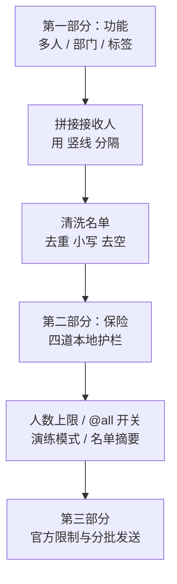
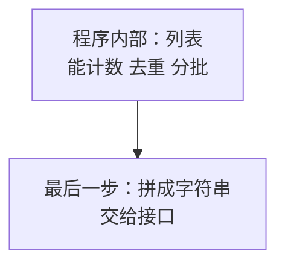
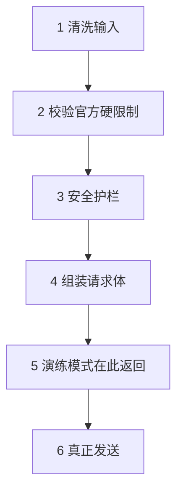
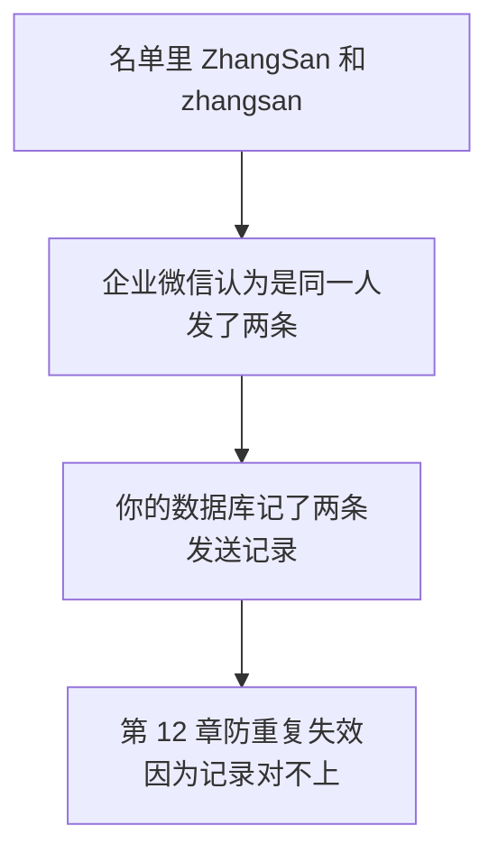
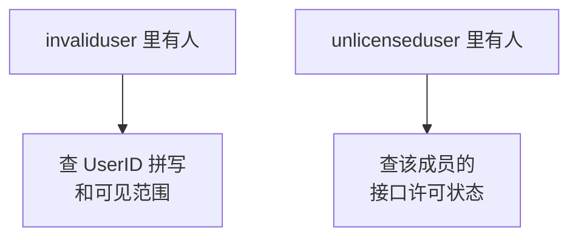
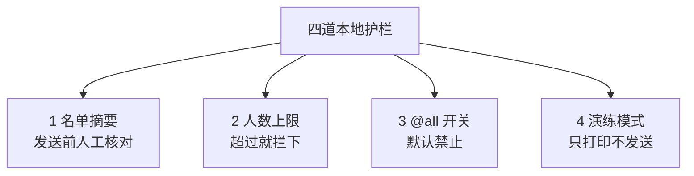
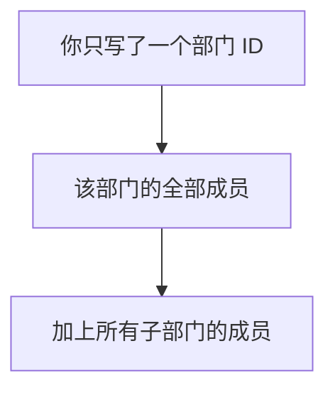
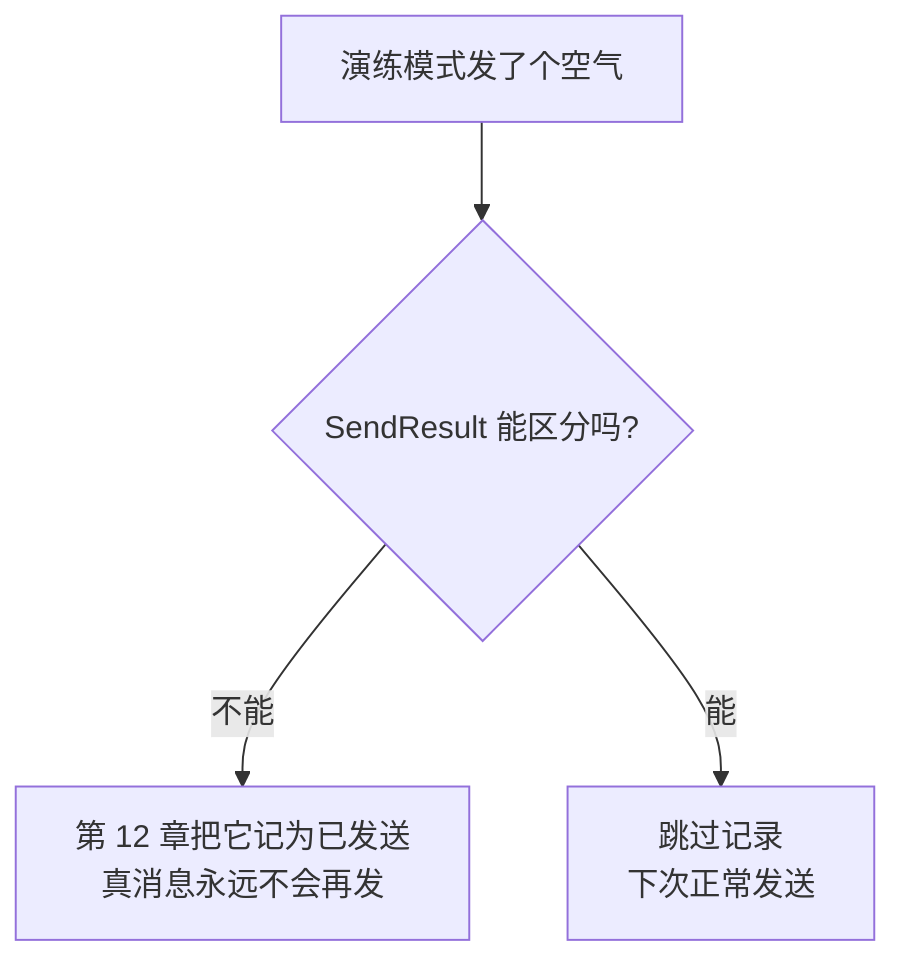
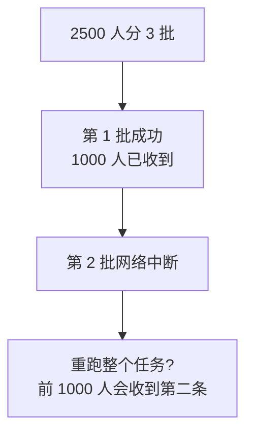

# 第 6 章　向多人、部门和标签发送

> 所属教程：《Python 调用企业微信应用消息 API：从入门到定时、数据库与防重复发送》  
> 前置章节：第 5 章（已拆成 `config.py` / `wecom_client.py` / `main.py`）  
> 本章目标：把接收人从“一个人”扩展到“一批人、一个部门、一个标签”，**同时把误发风险挡在代码里**。

**本章是第一次真正加功能，也是第一次真正有危险。**

前五章你最坏的下场是“自己收不到消息”。从本章起，一个手滑就可能让全公司收到一条测试消息。所以本章的一半篇幅是功能，另一半是**保险**。

---

## 6.0 本章路线



---

# 第一部分　功能：怎么发给多个对象

## 6.1 `touser` 怎样指定多个 UserID

### 6.1.1 官方规则

发送应用消息的请求体里，有三个字段可以指定接收人：

| 字段 | 指定什么 | 单次上限 | 分隔符 |
|---|---|---|---|
| `touser` | 成员 | **1000 个** | `|` |
| `toparty` | 部门 | **100 个** | `|` |
| `totag` | 标签 | **100 个** | `|` |

三条硬性规则：

1. **多个接收者之间用竖线 `|` 分隔**，不是逗号，不是分号；
2. **三者不能同时为空**（否则报 `81012` 或 `82001`）；
3. `touser` 指定为 `@all` 时，**`toparty` 和 `totag` 会被忽略**。

### 6.1.2 所以格式长这样

```json
{
  "touser": "zhangsan|lisi|wangwu",
  "toparty": "2|3",
  "totag": "10|20",
  "msgtype": "text",
  "agentid": 1000002,
  "text": {"content": "..."}
}
```

注意 `touser` 的值是**一个字符串**，不是数组。这一点很反直觉——JSON 明明支持数组，但这个接口要的是竖线拼起来的字符串。

### 6.1.3 在 Python 里怎么转换

我们在程序内部**始终用列表**，只在最后拼请求体时才转成字符串：

```python
def join_receivers(values) -> str:
    """
    把一批接收人拼成接口要求的字符串。

    官方要求多个接收者用 '|' 分隔，例如：
        ['zhangsan', 'lisi']  ->  'zhangsan|lisi'
    """
    return RECEIVER_SEPARATOR.join(str(v) for v in values)
```

**实测：**

```text
['zhangsan', 'lisi', 'wangwu'] -> 'zhangsan|lisi|wangwu'
[1, 2, 3]                      -> '1|2|3'
```

注意 `str(v)` 那一步。部门 ID 和标签 ID 是**数字**，而 `"|".join()` 只接受字符串——如果不转换，会直接报 `TypeError`。这是个很容易忘的细节。

### 6.1.4 为什么内部坚持用列表



因为列表能干很多事，字符串干不了：

| 需求 | 列表 | 竖线字符串 |
|---|---|---|
| 数一数有几个人 | `len(users)` | 得先按 `|` 切开 |
| 去掉重复的人 | 容易 | 麻烦 |
| 超过 1000 人分批 | 容易切 | 很难 |
| 打印名单摘要 | 容易 | 麻烦 |

> **原则：内部用结构化数据（列表），只在与外界交互的那一刻转成对方要的格式。**

---

## 6.2 向两名测试成员发送

### 6.2.1 名单放在 `.env` 里

在 `.env` 里新增一行，用**逗号**分隔（这是给人看的格式，竖线由程序去拼）：

```ini
# 测试名单：逗号分隔。程序会自动去空格、转小写、去重
WECOM_TEST_USER_IDS=zhangsan,lisi
```

为什么用逗号？因为逗号是人类习惯的写法，而竖线容易和其他符号看混。**给人看的格式和给接口的格式，本来就该分开。**

### 6.2.2 读取名单的函数

```python
def read_user_id_list(key: str) -> list:
    """
    从 .env 读取一个用逗号分隔的 UserID 名单。

    例如 .env 里写：
        WECOM_TEST_USER_IDS=zhangsan, LiSi ,zhangsan

    返回:
        ['zhangsan', 'lisi']      ← 去空格、转小写、去重、保持顺序

    为什么在这里就清洗？
        因为"脏名单"是误发和重复发送的源头。
        在数据进入程序的第一道门就洗干净，后面所有代码都省心。
    """
    raw = os.getenv(key)
    if raw is None or raw.strip() == "":
        return []

    return normalize_user_ids(raw.split(","))
```

**实测：**

```text
原始字符串: 'zhangsan, LiSi ,zhangsan,, wangwu'
清洗结果  : ['zhangsan', 'lisi', 'wangwu']
```

一行脏数据里包含了四种问题（空格、大小写、重复、空项），全部被洗掉了。

### 6.2.3 实测发送两个人

```text
[1/4] 配置已加载：WeComConfig(corp_id='ww_test_corp', app_secret='***已隐藏（共 43 位）***', agent_id=1000002, default_user_id='zhangsan', dry_run=False, max_recipients=20, allow_send_to_all=False)
[2/4] 接收人名单：共 2 人：zhangsan, lisi
[3/4] 发送成功，2 人已受理。msgid=MSG-1
[4/4] 本次任务结束。
```

服务器实际收到的请求体：

```json
{"msgtype": "text", "agentid": 1000002, "text": {"content": "..."}, "safe": 0, "touser": "zhangsan|lisi"}
```

`touser` 的值是 `'zhangsan|lisi'`——两个人被正确拼成了一个字符串。

---

## 6.3 封装发送函数

### 6.3.1 新的 `send_text` 签名

第 5 章的签名是 `send_text(to_user, content)`，只能发一个人。现在改成：

```python
def send_text(
    self,
    content: str,
    to_users=None,
    to_parties=None,
    to_tags=None,
) -> SendResult:
```

三个变化，都有理由：

| 变化 | 理由 |
|---|---|
| `content` 提到第一位 | 它是唯一必填的，放前面最自然 |
| 三个接收人参数都默认 `None` | 允许只指定其中任意一个 |
| 复数命名 `to_users` | 名字本身就说明“这是一批” |

### 6.3.2 为什么默认值写 `None` 而不是 `[]`

```python
to_users=None                          # 正确
to_users=[]                            # 危险
```

第 5 章 5.4.6 节讲过这个坑：**默认值只在函数定义时创建一次，之后所有调用共用同一个列表。**一次调用往里加了东西，下一次调用就会看到上次的残留。

所以标准写法是默认 `None`，进函数后再转：

```python
users = normalize_user_ids(to_users or [])
```

`to_users or []` 的意思是：如果 `to_users` 是 `None`（或空列表），就用一个新的空列表。

### 6.3.3 完整的发送方法

```python
    def send_text(
        self,
        content: str,
        to_users=None,
        to_parties=None,
        to_tags=None,
    ) -> SendResult:
        """
        发送一条文本消息，可指定成员、部门、标签。

        参数:
            content:    消息正文
            to_users:   UserID 列表，也可以是 ['@all']
            to_parties: 部门 ID 列表
            to_tags:    标签 ID 列表

        三者可以组合，但【不能都为空】（官方要求）。

        返回:
            SendResult。演练模式下返回 dry_run=True 的结果，不会真的发送。

        出错时:
            UnsafeSendError / InvalidRequestError / TokenError /
            SendMessageError / requests 的网络异常
        """
        # ---------- 1. 清洗输入 ----------
        # 参数默认值写 None 再转成空列表，而不是直接写 =[]，
        # 原因和第 5 章的 default_factory 一样：可变默认值是个坑。
        users = normalize_user_ids(to_users or [])
        parties = [str(p).strip() for p in (to_parties or []) if str(p).strip()]
        tags = [str(t).strip() for t in (to_tags or []) if str(t).strip()]

        # ---------- 2. 本地校验 ----------
        self._check_content(content)
        self._check_receivers(users, parties, tags)

        # ---------- 3. 安全护栏 ----------
        self._check_safety(users, parties, tags)

        # ---------- 4. 组装请求体 ----------
        payload = {
            "msgtype": "text",
            "agentid": self._config.agent_id,
            "text": {"content": content},
            "safe": 0,
        }

        # 只放非空的接收人字段，避免发出 "toparty": "" 这种无意义的内容
        if users:
            payload["touser"] = join_receivers(users)
        if parties:
            payload["toparty"] = join_receivers(parties)
        if tags:
            payload["totag"] = join_receivers(tags)

        # ---------- 5. 演练模式：到此为止，不发请求 ----------
        if self._config.dry_run:
            print("[演练模式] 以下内容【没有】真的发送：")
            print(f"           接收成员：{summarize_receivers(users)}")
            if parties:
                print(f"           接收部门：{join_receivers(parties)}")
            if tags:
                print(f"           接收标签：{join_receivers(tags)}")
            print(f"           正文首行：{content.splitlines()[0]}")
            return SendResult(dry_run=True)

        # ---------- 6. 真正发送 ----------
        access_token = self.get_access_token()
        raw = self._post_message(access_token, payload)
        return self._parse_result(raw)
```

### 6.3.4 六个步骤的顺序是精心排的



**关键：所有检查都在“真正发送”之前。**

尤其注意第 5 步：演练模式的返回点放在**组装请求体之后**。这样演练时打印的内容就是真会发出去的内容——如果放在组装之前，演练就成了走过场，测不出组装环节的错误。

### 6.3.5 “只放非空字段”这个细节

```python
if users:
    payload["touser"] = join_receivers(users)
```

为什么不无条件写进去？因为那样在只发部门时，请求体会变成：

```json
{"touser": "", "toparty": "2"}
```

`"touser": ""` 是个空值。虽然这个接口通常能容忍，但**发送不必要的空字段是坏习惯**：它会让抓包排查时多一份困惑，也可能在某些接口上被判为参数不合法。

---

## 6.4 空列表、重复 UserID 和大小写处理

### 6.4.1 清洗函数

这是本章最值得抄下来的一段代码：

```python
def normalize_user_ids(user_ids) -> list:
    """
    清洗一批 UserID：去首尾空格、转小写、丢掉空项、去重且保持原顺序。

    为什么要转小写？
        官方说明：UserID 不区分大小写，返回结果里统一转为小写。
        所以 'ZhangSan' 和 'zhangsan' 是同一个人。
        如果不统一，第 12 章比对发送记录时会把一个人当成两个人，
        结果就是【同一个人收到两条消息】。

    为什么要去重？
        名单里重复出现同一个人，是重复发送最常见的低级原因。

    为什么用这种写法而不是 set()？
        set() 能去重，但【顺序会乱】。名单顺序乱了，
        打印出来的名单摘要就不稳定，人工核对时很难受。
    """
    cleaned = []
    seen = set()

    for raw in user_ids:
        if raw is None:
            continue

        value = str(raw).strip().lower()

        if not value:            # 空字符串直接丢掉
            continue
        if value in seen:        # 已经出现过就跳过
            continue

        seen.add(value)
        cleaned.append(value)

    return cleaned
```

### 6.4.2 实测四种脏数据

```text
['zhangsan', 'lisi']                     -> ['zhangsan', 'lisi']
['ZhangSan', 'zhangsan', 'ZHANGSAN']     -> ['zhangsan']
[' zhangsan ', '', None, 'lisi']         -> ['zhangsan', 'lisi']
['zhangsan', 'lisi', 'wangwu', 'lisi']   -> ['zhangsan', 'lisi', 'wangwu']
```

第二行值得盯一眼：**三个写法不同的“张三”被合成了一个人。**

如果不做这一步，会发生什么？企业微信不区分大小写，所以这三个都能发到——**同一个人会收到三条一模一样的消息**。而你的程序会认为“我发给了 3 个人，全部成功”。

### 6.4.3 大小写这件事的连锁反应



这就是为什么第 5 章要在配置入口把 `UserID` 转小写，本章又在名单清洗里再转一次。**同一个规则在所有入口都执行**，才不会有漏洞。

### 6.4.4 为什么不用 `set()` 去重

`set()` 是最简单的去重方法，但它**不保证顺序**。顺序为什么重要？

- 打印名单摘要时，每次运行显示的前三个人都不一样，人工核对时会疑惑“是不是名单变了”；
- 分批发送时，批次划分每次都不同，出问题难以复现；
- 日志里的名单顺序不稳定，两次运行的日志无法直接对比。

**用 `seen` 集合判断 + 列表保存顺序**，这是 Python 里“去重且保序”的标准写法，值得记住。

### 6.4.5 空名单必须在本地拦下

```python
if not users and not parties and not tags:
    raise InvalidRequestError(
        "成员、部门、标签不能同时为空，至少要指定一个接收对象"
    )
```

为什么不让接口去报错？因为空名单最常见的来源是**数据库查询返回了 0 行**（第 11 章会遇到）。这种情况正确的做法是“什么都不做”，而不是发一个注定失败的请求。

**实测确认这些校验一个请求都不会发出：**

```text
都为空            -> InvalidRequestError: 成员、部门、标签不能同时为空，至少要指定一个接收对象
成员超 1000       -> InvalidRequestError: 单次最多只能指定 1000 个成员，当前有 1001 个。请改用 send_text_batched() 分批发送。
部门超 100        -> InvalidRequestError: 单次最多只能指定 100 个部门，当前有 101 个。
标签超 100        -> InvalidRequestError: 单次最多只能指定 100 个标签，当前有 101 个。
正文为空          -> InvalidRequestError: 消息正文不能为空
这些校验共发出请求数: 0 （应为 0）
```

对应关系（把官方错误码提前变成中文提示）：

| 本地校验 | 对应的官方错误码 |
|---|---|
| 接收人都为空 | `81012` / `82001` |
| 成员超 1000 | `40032` |
| 部门超 100 | `82002` |
| 标签超 100 | `82003` |
| 正文为空 | `44004` |

---

## 6.5 查看 `invaliduser` 与 `unlicenseduser`

### 6.5.1 多人发送时，“部分成功”变成常态

单人发送时，成功就是成功。**多人发送时，最常见的结果是“大部分成功，个别失败”。**

官方规则回顾：

- **部分**接收人无权限或不存在 → **发送仍然执行**，无效的人列在 `invaliduser` 等字段里；
- **全部**接收人都无效 → 整个调用失败，返回 `81013`。

### 6.5.2 实测部分成功

```text
[2/4] 接收人名单：共 3 人：zhangsan, lisi, zhaoliu
[3/4] 企业微信已受理，但部分接收人未送达：
       - 无效的成员：lisi
       - 缺少接口许可的成员：zhaoliu
       最常见原因：该成员不在应用的可见范围内。
```

3 个人里 1 个成功、2 个失败，而 `errcode` 是 **0**。

**如果只检查 `errcode`，你会打印“发送成功”然后收工。**这就是第 1 章反复强调第三层检查的原因，到本章终于显出真正价值。

### 6.5.3 两个字段的区别

| 字段 | 含义 | 常见原因 |
|---|---|---|
| `invaliduser` | 成员无效 | UserID 写错、成员已离职、**不在应用可见范围** |
| `unlicenseduser` | 成员在可见范围内，但**缺少基础接口许可**（含许可已过期） | 许可未分配或已过期 |

排查顺序不同：



### 6.5.4 这些信息一定要记下来

现在我们只是打印，但请注意这些值的真正用途：

| 章节 | 用它做什么 |
|---|---|
| 第 12 章 | **只把成功的人记为“已发送”**，失败的人下次还要发 |
| 第 13 章 | 判断失败是否值得重试 |
| 第 14 章 | 写进日志，方便事后追查“谁一直收不到” |

所以 `SendResult.invalid_receivers` 不是给人看的装饰，它是**后面几章的输入数据**。

---

# 第二部分　保险：把误发挡在代码里

## 6.6 为什么必须自己加护栏

### 6.6.1 接口不会替你把关

请认清一个事实：**企业微信非常乐意帮你把消息发给全公司。**你写 `@all`，它就发；你写了 800 个人，它就发 800 个人。**出了事，它不负责。**

而误发的后果是真实的：

| 事故 | 后果 |
|---|---|
| 测试消息发给全公司 | 你需要向很多人解释 |
| 循环里名单拼错，发了几百人 | 触发频率限制，正常通知也发不出去 |
| 半夜的定时任务发给全公司 | 影响面更大，且你在睡觉 |

### 6.6.2 四道护栏



四道的共同特点：**都在本地生效，不消耗任何接口调用。**

### 6.6.3 新增三个配置开关

```ini
# ---------- 第 6 章新增：安全开关 ----------

# 演练模式：true 时只打印将要发送的内容，不真的发出去
WECOM_DRY_RUN=false

# 单次发送人数上限。超过就在本地拦下
WECOM_MAX_RECIPIENTS=20

# 是否允许 @all，以及按部门/标签发送（人数不可预估）
WECOM_ALLOW_SEND_TO_ALL=false
```

三个默认值都偏保守：**宁可被拦住，也不要误发。**

---

## 6.7 读取开关型配置：一个必须知道的坑

### 6.7.1 最容易犯的错

`.env` 里存的**全都是字符串**。所以很多人这样写：

```python
dry_run = bool(os.getenv("WECOM_DRY_RUN"))     # 错得很隐蔽
```

问题在于：**`bool("false")` 的结果是 `True`**，因为 `"false"` 是个非空字符串。

于是你在 `.env` 里写 `WECOM_DRY_RUN=false`，程序却认为演练模式是**开着的**——所有消息都不会真的发出去，而你完全不知道为什么。

### 6.7.2 正确的读法

```python
def _read_bool(key: str, default: bool) -> bool:
    """
    读取一个开关型配置项。

    .env 里存的都是字符串，所以要自己判断"什么算真"。
    这里接受 true / 1 / yes / on（不区分大小写），其余都算假。

    为什么不用 bool(os.getenv(key))？
        因为那样 "false" 这个【非空字符串】会被当成 True，
        结果你在 .env 里写 WECOM_DRY_RUN=false，程序却认为开着演练模式。
        这是新手非常容易踩的坑。
    """
    raw = os.getenv(key)

    if raw is None or raw.strip() == "":
        return default

    return raw.strip().lower() in ("true", "1", "yes", "on")
```

### 6.7.3 实测对照

```text
WECOM_DRY_RUN='true'    -> dry_run=True    （若用 bool(字符串) 则会得到 True）
WECOM_DRY_RUN='1'       -> dry_run=True    （若用 bool(字符串) 则会得到 True）
WECOM_DRY_RUN='yes'     -> dry_run=True    （若用 bool(字符串) 则会得到 True）
WECOM_DRY_RUN='false'   -> dry_run=False   （若用 bool(字符串) 则会得到 True）  ← 关键差别
WECOM_DRY_RUN='False'   -> dry_run=False   （若用 bool(字符串) 则会得到 True）  ← 关键差别
WECOM_DRY_RUN='0'       -> dry_run=False   （若用 bool(字符串) 则会得到 True）  ← 关键差别
WECOM_DRY_RUN='no'      -> dry_run=False   （若用 bool(字符串) 则会得到 True）  ← 关键差别
WECOM_DRY_RUN=''        -> dry_run=False   （若用 bool(字符串) 则会得到 False）
```

看清了：**四种“明确表示关闭”的写法，用 `bool()` 全都会变成开启。**

> **规则：从环境变量读布尔值，永远要自己写转换函数。**这条对任何语言、任何配置系统都适用。

### 6.7.4 整数配置也一样

```python
def _read_int(key: str, default: int) -> int:
    """读取一个整数型配置项，格式不对就抛 ConfigError。"""
    raw = os.getenv(key)

    if raw is None or raw.strip() == "":
        return default

    value = raw.strip()
    if not value.isdigit():
        raise ConfigError(f"配置项 {key} 必须是正整数，当前值是 {value!r}。")

    number = int(value)
    if number < 1:
        raise ConfigError(f"配置项 {key} 必须大于 0，当前值是 {number}。")

    return number
```

假设有人把 `WECOM_MAX_RECIPIENTS` 误写成 `2o`（字母 o），如果不校验，`int("2o")` 会在运行到一半时崩掉；而现在会在启动时给出一句中文提示。

---

## 6.8 第一道护栏：名单摘要

### 6.8.1 代码

```python
def summarize_receivers(user_ids, limit: int = 3) -> str:
    """
    生成一段人类可读的名单摘要，用于发送前确认。

    例如 5 个人会显示成：
        共 5 人：zhangsan, lisi, wangwu ... 等 5 人

    为什么需要它？
        因为"我以为只发给 3 个人，其实名单里有 300 个"
        是误发事故最典型的起因。发送前把人数打出来，
        人眼一扫就能发现不对。
    """
    # @all 要特殊说明：它的名单长度是 1，但实际收件人是全部可见成员。
    # 如果按人数打印，会显示"共 1 人：@all"，看的人容易放松警惕。
    if SEND_TO_ALL in user_ids:
        return f"{SEND_TO_ALL}（应用可见范围内的【全部成员】）"

    total = len(user_ids)
    if total == 0:
        return "共 0 人"

    head = ", ".join(user_ids[:limit])
    if total <= limit:
        return f"共 {total} 人：{head}"
    return f"共 {total} 人：{head} ... 等 {total} 人"
```

### 6.8.2 实测

```text
   0 人 -> 共 0 人
   1 人 -> 共 1 人：user0
   3 人 -> 共 3 人：user0, user1, user2
   5 人 -> 共 5 人：user0, user1, user2 ... 等 5 人
 250 人 -> 共 250 人：user0, user1, user2 ... 等 250 人
```

### 6.8.3 为什么不把 250 个人全打出来

因为**全打出来等于没打**。屏幕滚过几百行，人不会去读，摘要的意义就没了。

摘要设计的要点是：**把最关键的数字放在最前面。**“共 250 人”这五个字，才是你真正需要看到的——如果你以为只有 3 个人，这里立刻就暴露了。

### 6.8.4 `@all` 的特殊处理是修出来的

这里有一个我在测试时发现的问题。最初的实现没有特判 `@all`，实测输出是：

```text
[2/4] 接收人名单：共 1 人：@all
[3/4] 发送成功，1 人已受理。
```

**“共 1 人”严重误导**——`@all` 的名单长度确实是 1，但实际收件人是全部可见成员。这种提示会让人放松警惕，而它出现的场合恰恰是最危险的场合。

改成特判后：

```text
[2/4] 接收人名单：@all（应用可见范围内的【全部成员】）
[3/4] 发送成功，应用可见范围内的全部成员已受理。
```

> 这类问题的教训：**安全提示本身也要检查。**一个措辞含糊的警告，比没有警告更危险，因为它会让人产生“我已经确认过了”的错觉。

---

## 6.9 第二、三道护栏：人数上限与 `@all` 开关

### 6.9.1 护栏代码

```python
    def _check_safety(self, users: list, parties: list, tags: list) -> None:
        """
        防止误发给大量成员。

        这些限制【不是官方要求的】，是我们自己加的保险。
        官方接口很乐意帮你把消息发给全公司，出了事它不负责。
        """
        # 护栏一：@all 必须显式开启
        if SEND_TO_ALL in users and not self._config.allow_send_to_all:
            raise UnsafeSendError(
                f"检测到 {SEND_TO_ALL}，这会发给应用可见范围内的【全部成员】。"
                f"如确实需要，请在 .env 中设置 WECOM_ALLOW_SEND_TO_ALL=true。"
            )

        # 护栏二：按部门或标签发送时，人数无法在本地预估，也需要显式开启
        if (parties or tags) and not self._config.allow_send_to_all:
            raise UnsafeSendError(
                "按部门或标签发送时，实际人数无法在本地预估"
                "（部门是递归生效的，子部门成员也会收到）。"
                "如确实需要，请在 .env 中设置 WECOM_ALLOW_SEND_TO_ALL=true。"
            )

        # 护栏三：人数上限
        # 注意 @all 不计入人数统计，它由护栏一负责
        real_users = [u for u in users if u != SEND_TO_ALL]
        if len(real_users) > self._config.max_recipients:
            raise UnsafeSendError(
                f"本次接收人 {len(real_users)} 人，"
                f"超过配置的上限 {self._config.max_recipients} 人。"
                f"确认无误后，请调高 .env 中的 WECOM_MAX_RECIPIENTS。"
            )
```

### 6.9.2 为什么部门和标签也要归到这个开关下

这是一个有意的设计决定。理由是**部门是递归生效的**：



也就是说，你以为在通知“技术部”，实际可能通知了技术部下面所有小组几百人。而这个人数**在本地无法预估**——程序不知道那个部门里有多少人。

所以我把它和 `@all` 归为同一类风险：**收件范围不可预估**。要用就必须显式打开开关，等于逼你确认一次。

> 如果你的项目里“按部门发送”是日常操作，可以拆成两个开关。这里合并是为了让学习阶段的默认状态足够安全。

### 6.9.3 实测：人数超限被拦下

```text
[2/4] 接收人名单：共 10 人：user0, user1, user2 ... 等 10 人
[已拦截] 本次接收人 10 人，超过配置的上限 3 人。确认无误后，请调高 .env 中的 WECOM_MAX_RECIPIENTS。
是否发出了请求: False
```

**最后一行是关键：一个请求都没发出去。**

### 6.9.4 实测：`@all` 默认被拦下

```text
[2/4] 接收人名单：@all（应用可见范围内的【全部成员】）
[已拦截] 检测到 @all，这会发给应用可见范围内的【全部成员】。如确实需要，请在 .env 中设置 WECOM_ALLOW_SEND_TO_ALL=true。
是否发出了请求: False
```

打开开关后就能正常发送：

```text
[2/4] 接收人名单：@all（应用可见范围内的【全部成员】）
[3/4] 发送成功，应用可见范围内的全部成员已受理。msgid=MSG-1
服务器收到的 touser: '@all'
```

### 6.9.5 实测：部门/标签默认被拦下

```text
UnsafeSendError: 按部门或标签发送时，实际人数无法在本地预估（部门是递归生效的，子部门成员也会收到）。如确实需要，请在 .env 中设置 WECOM_ALLOW_SEND_TO_ALL=true。
```

### 6.9.6 `UnsafeSendError`：一种新的异常

```python
class UnsafeSendError(InvalidRequestError):
    """
    请求被本地安全护栏拦下（人数太多、或试图 @all）。

    为什么单独定义？
        因为这不是"写错了"，而是"这次操作可能造成大范围误发"。
        处理方式也不同：参数错要改代码，而这个要【人工确认】后
        明确调高上限或打开开关。
    """
```

**实测继承关系：**

```text
UnsafeSendError 是 InvalidRequestError 的子类? True
UnsafeSendError 是 WeComError 的子类?      True
```

它是 `InvalidRequestError` 的子类，所以第 5 章那套 `except` 顺序仍然有效——但把它单独列在最前面，就能给出不同的提示语：

```python
except UnsafeSendError as error:
    # 被安全护栏拦下：这不是 bug，是保护
    print(f"[已拦截] {error}")
    return
```

用 `[已拦截]` 而不是 `[失败]`，这个措辞是刻意的：**它想告诉你“程序在正常工作，是它在保护你”**，而不是让你以为代码坏了然后去掉这个检查。

---

## 6.10 第四道护栏：演练模式

### 6.10.1 它解决什么问题

写好一个群发任务后，你想验证“名单对不对、内容对不对”——但又不想真的把消息发出去。

演练模式就是干这个的：**走完全部流程，包括组装请求体，唯独不发出去。**

### 6.10.2 实测

```text
[1/4] 配置已加载：WeComConfig(..., dry_run=True, max_recipients=20, allow_send_to_all=False)
[2/4] 接收人名单：共 2 人：zhangsan, lisi
       当前是【演练模式】，不会真的发送。
[演练模式] 以下内容【没有】真的发送：
           接收成员：共 2 人：zhangsan, lisi
           正文首行：系统通知：这是一条群发测试消息
[3/4] 演练结束，未发送任何消息。
[4/4] 本次任务结束。
是否发出了请求: False
```

### 6.10.3 演练模式的两个使用时机

| 时机 | 为什么 |
|---|---|
| 改完名单逻辑之后 | 确认名单真的是你想的那批人 |
| **第 9 章配好定时任务之后** | **确认触发时间对，但不打扰任何人** |

第二条尤其重要。第 9 章你会配置“每天 9:05 发送”，验证它是否按时触发需要等一天。**打开演练模式，你可以放心让它跑一整天**，看日志确认时间点，而没有任何人收到消息。

### 6.10.4 `SendResult` 要能表达“这次是演练”

```python
@dataclass
class SendResult:
    msgid: str = ""
    invalid_receivers: dict = field(default_factory=dict)

    # 第 6 章新增：这次是不是演练（演练时没有真的发出去）
    dry_run: bool = False
```

为什么必须加这个字段？因为演练时 `all_delivered` 会返回 `True`（没有无效接收人），如果不区分，调用方会以为**真的发送成功了**。

这在第 12 章会造成严重后果：



**一个演练模式导致真消息永久丢失**——这种 bug 极难排查。所以现在就把字段加上。

---

# 第三部分　官方限制与分批发送

## 6.11 超过 1000 人怎么办

### 6.11.1 必须自己分批

官方规定 `touser` 单次最多 1000 个成员。超过会得到 `40032`（不合法的 UserID 列表长度）。

所以要自己切分：

```python
def chunked(items, size: int):
    """
    把一个长列表切成若干段，每段最多 size 个。

    例如 chunked([1,2,3,4,5], 2) 会依次给出 [1,2]、[3,4]、[5]。

    用途：接口单次最多 1000 人，人再多就必须分批发。
    """
    if size < 1:
        raise ValueError("size 必须大于 0")

    for start in range(0, len(items), size):
        yield items[start:start + size]
```

### 6.11.2 分批发送方法

```python
    def send_text_batched(self, content: str, to_users) -> list:
        """
        向大量成员发送同一条文本消息，自动按官方上限分批。

        为什么需要它？
            官方规定 touser 单次最多 1000 个成员。
            超过就必须自己拆成多次请求，否则会得到
            errcode 40032（不合法的 UserID 列表长度）。

        返回:
            每一批的 SendResult 组成的列表。
            注意：可能出现"前几批成功、后面某批失败"，
            所以调用方要逐批检查，不能只看最后一个结果。
        """
        users = normalize_user_ids(to_users)

        if not users:
            raise InvalidRequestError("接收人列表为空，没有可发送的对象")

        results = []
        batches = list(chunked(users, MAX_USERS_PER_REQUEST))

        for index, batch in enumerate(batches, start=1):
            print(f"[分批发送] 第 {index}/{len(batches)} 批，{len(batch)} 人")
            results.append(self.send_text(content=content, to_users=batch))

        return results
```

### 6.11.3 实测 2500 人

```text
[分批发送] 第 1/3 批，1000 人
[分批发送] 第 2/3 批，1000 人
[分批发送] 第 3/3 批，500 人
共 3 批，每批人数: [1000, 1000, 500]
全部批次都成功: True
```

分批规则正确：`1000 + 1000 + 500 = 2500`。

### 6.11.4 分批带来一个新的麻烦

请注意那句注释：**“可能出现前几批成功、后面某批失败”。**



**这是“部分完成”问题**，比“完全失败”难处理得多。它没有本章能解决的办法，因为要解决它必须**记住“谁已经发过了”**——那正是第 12 章的主题。

现在你只需要意识到：**只要一次任务被拆成多次请求，重复发送的风险就出现了。**

### 6.11.5 官方的两类限制别搞混

| 类型 | 内容 | 超了会怎样 |
|---|---|---|
| **单次数量** | 成员 1000、部门 100、标签 100 | 报错 `40032` / `82002` / `82003` |
| **调用频率** | 每应用每天不超过“账号上限数 × 200 人次”；每应用对**同一成员**不超过 **30 次/分钟**、**1000 次/小时** | **超出部分被丢弃不下发** |

第二类的表现方式很坑：**不报错，消息就是不到。**

对本章的直接影响是：分批发送 2500 人时，注意“人次”是按人算的——一次发 1000 人算 1000 人次。学习阶段拿几千人的假名单反复测试，很容易把当天额度用掉。**所以大批量测试请开演练模式。**

---

## 6.12 按部门和标签发送

### 6.12.1 怎么找部门 ID 和标签 ID

| 要找的 | 后台路径 |
|---|---|
| 部门 ID | 「通讯录」→「组织架构」→ 点击某个部门右边的小圆点 |
| 标签 ID | 「通讯录」→「标签」→ 选中标签 → 右上角「标签详情」 |

两者都是**数字**。

### 6.12.2 实测三种发法

```text
按部门发送 -> {"msgtype": "text", "agentid": 1000002, "text": {"content": "部门通知"}, "safe": 0, "toparty": "2|3"}
按标签发送 -> {"msgtype": "text", "agentid": 1000002, "text": {"content": "标签通知"}, "safe": 0, "totag": "10|20"}
三者组合   -> {"msgtype": "text", "agentid": 1000002, "text": {"content": "组合发送"}, "safe": 0, "touser": "zhangsan", "toparty": "2", "totag": "10"}
```

调用方式：

```python
client.send_text(content="部门通知", to_parties=[2, 3])
client.send_text(content="标签通知", to_tags=[10, 20])
client.send_text(content="组合发送", to_users=["zhangsan"], to_parties=[2], to_tags=[10])
```

注意数字 ID 被自动转成了字符串并用竖线拼接——这就是 6.1.3 节 `str(v)` 那一步的作用。

### 6.12.3 该用哪一种

| 方式 | 适合 | 风险 |
|---|---|---|
| 成员列表 | 名单来自数据库、精确控制 | 低，人数可知 |
| 部门 | 组织结构稳定的通知 | **递归生效，人数不可知** |
| 标签 | 跨部门的固定人群 | 中，取决于标签维护情况 |

本教程后面的业务场景（第 11 章的待办提醒）**用的是成员列表**，因为业务数据里存的是负责人，需要精确投递。

部门和标签更适合“全员公告”这类场景。

### 6.12.4 一个容易忽略的规则

**`touser` 写成 `@all` 时，`toparty` 和 `totag` 会被忽略。**

所以下面这种写法不会“只发某个部门”：

```python
client.send_text(content="...", to_users=["@all"], to_parties=[2])   # 部门被忽略，实际发给全部成员
```

---

## 6.13 本章小项目：向测试名单发送系统通知

### 6.13.1 `main.py` 的改动

```python
def resolve_recipients(config) -> list:
    """
    确定这次要发给谁。

    优先用 .env 里的 WECOM_TEST_USER_IDS 名单；
    如果没配，就退回到单个 WECOM_TEST_USER_ID。

    这样第 3 到 5 章的 .env 不用改也能继续跑。
    """
    user_ids = read_user_id_list("WECOM_TEST_USER_IDS")

    if user_ids:
        return user_ids

    return [config.default_user_id]
```

**向后兼容**是这里的关键：你不改 `.env` 也能继续运行。这个习惯在正式项目里很重要——**新增配置项要有合理的默认行为，不能让旧配置直接失效。**

### 6.13.2 结果说明部分

```python
    # ---------- 第 4 步：说明结果 ----------
    if result.dry_run:
        print("[3/4] 演练结束，未发送任何消息。")
    elif result.all_delivered:
        # 注意：用了 @all 时，名单长度是 1，但实际收件人是"全部可见成员"。
        # 如果直接打印 len(recipients)，会显示"1 人全部受理"，严重误导。
        if SEND_TO_ALL in recipients:
            scope = "应用可见范围内的全部成员"
        else:
            scope = f"{len(recipients)} 人"
        print(f"[3/4] 发送成功，{scope}已受理。msgid={result.msgid}")
    else:
        print("[3/4] 企业微信已受理，但部分接收人未送达：")
        for label, value in result.invalid_receivers.items():
            print(f"       - {label}：{value}")
        print("       最常见原因：该成员不在应用的可见范围内。")

    print("[4/4] 本次任务结束。")
```

### 6.13.3 建议的练习顺序

**请按这个顺序做，每一步都确认结果再往下：**

1. **先开演练模式**，`.env` 里设 `WECOM_DRY_RUN=true`，运行，确认名单和内容正确；
2. 关掉演练，只填**自己一个人**，运行，确认能收到；
3. 加上**第二个人**（找个同事配合），确认两人都收到；
4. 故意在名单里加一个**不存在的 UserID**，观察 `invaliduser`；
5. 故意把名单写成 `ZhangSan,zhangsan,ZHANGSAN`，**确认只发了一条**；
6. 把 `WECOM_MAX_RECIPIENTS` 改成 `1`，确认被拦下；
7. 试着填 `@all`，**确认被拦下**（不要打开开关）。

第 5、7 步最有价值——**它们验证的是“保险有没有真的生效”**，而不是功能。

---

## 6.14 本章改动清单

本章是在第 5 章的三个文件上修改，不是重写。对照下表逐处改动即可。

### `config.py`

| 改动 | 位置 | 说明 |
|---|---|---|
| 新增 3 个字段 | `WeComConfig` | `dry_run`、`max_recipients`、`allow_send_to_all` |
| 更新 `__repr__` | `WeComConfig` | 把三个开关的状态也打印出来 |
| 新增 `_read_bool()` | 模块级 | 正确读取布尔配置 |
| 新增 `_read_int()` | 模块级 | 读取并校验整数配置 |
| 新增 `read_user_id_list()` | 模块级 | 读取逗号分隔名单 |
| 新增 `normalize_user_ids()` | 模块级 | 清洗名单 |
| 更新 `load_config()` | 模块级 | 读取三个新开关 |

### `wecom_client.py`

| 改动 | 位置 | 说明 |
|---|---|---|
| 新增常量 | 文件顶部 | 三个上限、分隔符、`SEND_TO_ALL` |
| 新增 `UnsafeSendError` | 异常区 | 继承 `InvalidRequestError` |
| `SendResult` 加字段 | 数据类 | `dry_run: bool = False` |
| 新增 `join_receivers()` | 模块级 | 拼竖线 |
| 新增 `summarize_receivers()` | 模块级 | 名单摘要 |
| 新增 `chunked()` | 模块级 | 切分列表 |
| **重写 `send_text()`** | `WeComClient` | 支持三类接收人 + 护栏 + 演练 |
| 新增 `send_text_batched()` | `WeComClient` | 自动分批 |
| 拆出 `_check_content()` | `WeComClient` | 正文校验 |
| 新增 `_check_receivers()` | `WeComClient` | 官方上限校验 |
| 新增 `_check_safety()` | `WeComClient` | 三道安全护栏 |

注意 `send_text` 的调用方式变了（`content` 变成第一个参数、`to_user` 变成 `to_users` 列表），所以**调用它的地方都要改**——本章只有 `main.py` 一处。

### `main.py`

| 改动 | 说明 |
|---|---|
| 新增 `resolve_recipients()` | 优先用名单，没配就退回单人 |
| 新增名单摘要输出 | 发送前打印人数供核对 |
| 新增 `except UnsafeSendError` | 放在其他 `except` 之前，提示语用 `[已拦截]` |
| 结果说明区分演练和 `@all` | 见 6.13.2 |
| 步骤编号 `[1/3]` 改 `[1/4]` | 多了一步“确定名单” |

---

## 6.15 本章完成标志

- [ ] `.env` 里新增了 `WECOM_TEST_USER_IDS` 和三个安全开关
- [ ] 向两名成员发送成功，两人都收到
- [ ] 抓到的 `touser` 值形如 `zhangsan|lisi`（竖线分隔）
- [ ] 名单写成 `ZhangSan,zhangsan` 时，**只发出一条**
- [ ] 名单里有不存在的 UserID 时，能看到 `invaliduser`，而不是显示“全部成功”
- [ ] 演练模式下运行，**没有任何人收到消息**
- [ ] 人数超过 `WECOM_MAX_RECIPIENTS` 时被 `[已拦截]`，且**没发出请求**
- [ ] `@all` 在开关关闭时被 `[已拦截]`

### 本章完成标志

> 两名测试成员同时收到同一条消息；并且当你故意写 `@all` 时，程序**拦住了你**。

---

## 6.16 本章小结

### 6.16.1 功能与保险的对照

| 新增能力 | 对应的保险 |
|---|---|
| 可以发给多人 | 人数上限 + 名单摘要 |
| 可以发给部门/标签 | 需显式打开开关 |
| 可以发给全部成员 | 默认禁止 `@all` |
| 可以批量测试 | 演练模式 |

**每加一分能力，就加一分约束。**这是处理“会影响别人的功能”时应有的态度。

### 6.16.2 本章必须带走的 8 条结论

1. **接收人用竖线 `|` 分隔**，数字 ID 要先转字符串。
2. **内部用列表，只在发请求那一刻拼成字符串。**
3. **名单必须清洗**：去空格、转小写、去重、保序。
4. **`ZhangSan` 和 `zhangsan` 是同一个人**，不去重就会发两条。
5. **多人发送时“部分成功”是常态**，必须检查 `invaliduser`。
6. **从环境变量读布尔值要自己写转换**，`bool("false")` 是 `True`。
7. **超过 1000 人必须自己分批**，而分批就带来了重复发送风险。
8. **演练模式必须能被结果区分**，否则第 12 章会把空气记成已发送。

### 6.16.3 自测题

1. `touser` 的值为什么是字符串而不是数组？（6.1.2）
2. 为什么内部要用列表而不是直接存竖线字符串？（6.1.4）
3. 名单里有 `ZhangSan` 和 `zhangsan`，不去重会发生什么？（6.4.2）
4. 为什么去重不用 `set()`？（6.4.4）
5. `.env` 里写 `WECOM_DRY_RUN=false`，用 `bool(os.getenv(...))` 读会得到什么？（6.7.1）
6. 为什么按部门发送也要显式打开开关？（6.9.2）
7. 如果 `SendResult` 不区分演练模式，第 12 章会出什么问题？（6.10.4）
8. 2500 人分 3 批，第 2 批失败了，直接重跑整个任务会怎样？（6.11.4）

### 6.16.4 下一章预告

第 7 章增加消息类型：Markdown、文本卡片、图片、文件。

其中有一个概念上的新东西：**图片和文件不能直接把本地路径塞进发送接口**，必须先调用“上传临时素材”接口拿到 `media_id`，再用 `media_id` 发送。这是本教程第一次出现“两步式接口调用”。

同时会处理内容长度问题——文本消息最长 2048 字节，超了会被截断或报 `45002`。

---

## 参考的官方文档

1. [企业微信开发者中心：发送应用消息](https://developer.work.weixin.qq.com/document/path/90236) —— `touser`/`toparty`/`totag` 的上限与分隔符、`@all` 规则、部分成功规则、频率限制
2. [企业微信开发者中心：基本概念介绍](https://developer.work.weixin.qq.com/document/path/90665) —— 部门 ID、标签 ID 的查看位置；可见范围递归生效规则
3. [企业微信开发者中心：全局错误码](https://developer.work.weixin.qq.com/document/path/90313) —— `40032`、`81012`、`81013`、`82001`、`82002`、`82003`、`44004` 等

> 本章代码在 Python 环境中配合本地模拟服务器实际运行验证，共 16 组测试，文中所有标注“实测”的输出均为真实运行结果。企业微信接口规则依据上述官方文档整理并重新表述（内容已为遵守许可限制而改写），请以最新官方文档为准。
