# 第 7 章　增加不同的消息类型

> 所属教程：《Python 调用企业微信应用消息 API：从入门到定时、数据库与防重复发送》  
> 前置章节：第 6 章（多人发送 + 四道安全护栏）  
> 本章目标：从只会发纯文本，扩展到 Markdown、文本卡片、图片、文件。

**本章有两个新东西：**

1. **“两步式接口调用”**——图片和文件不能直接把本地路径塞进发送接口，必须先上传素材换 `media_id`，再用 `media_id` 发送。
2. **“字节不是字数”**——官方限制写的是“2048 个字节”，而一个汉字占 3 个字节。这个坑会让你的截断逻辑全错。

---

## 7.0 本章路线

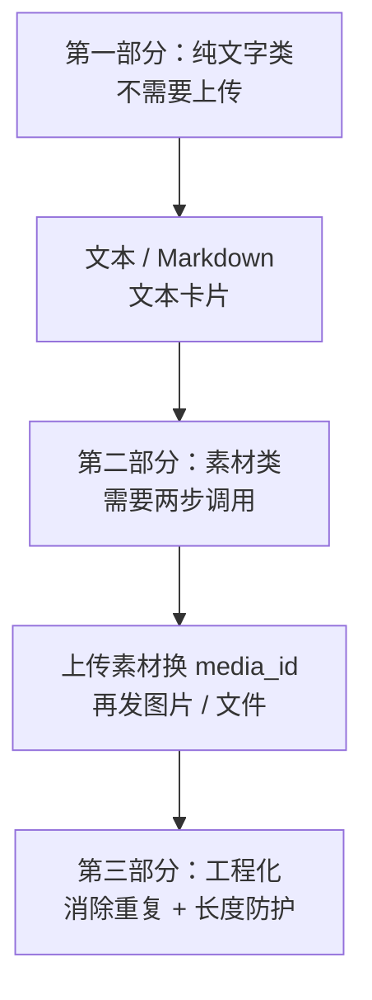

---

# 第一部分　纯文字类消息

## 7.1 消息类型的共同结构

### 7.1.1 所有消息类型长得都一样

不管发什么，请求体都是这三层：

```json
{
  "touser": "zhangsan|lisi",
  "agentid": 1000002,
  "msgtype": "text",
  "text": { "content": "..." }
}
```

| 部分 | 作用 | 各类型是否相同 |
|---|---|---|
| 接收人（`touser`/`toparty`/`totag`） | 发给谁 | **完全相同** |
| `agentid` | 哪个应用发的 | **完全相同** |
| `msgtype` | 消息类型标识 | 不同 |
| **和 `msgtype` 同名的那个字段** | 消息主体 | 不同 |

### 7.1.2 关键规律：`msgtype` 的值就是主体字段的名字

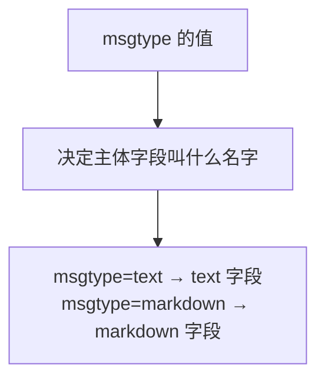

对照一下：

| `msgtype` | 主体字段名 | 主体里放什么 |
|---|---|---|
| `text` | `text` | `content` |
| `markdown` | `markdown` | `content` |
| `textcard` | `textcard` | `title`、`description`、`url`、`btntxt` |
| `image` | `image` | `media_id` |
| `file` | `file` | `media_id` |
| `voice` | `voice` | `media_id` |
| `video` | `video` | `media_id`、`title`、`description` |
| `news` | `news` | `articles` 数组 |

**记住这条规律，你就不需要背每种消息的结构了。**

### 7.1.3 这个规律直接决定了代码怎么写

因为“接收人 + `agentid`”对所有类型都一样，而“`msgtype` + 主体”各不相同，所以自然的分工是：

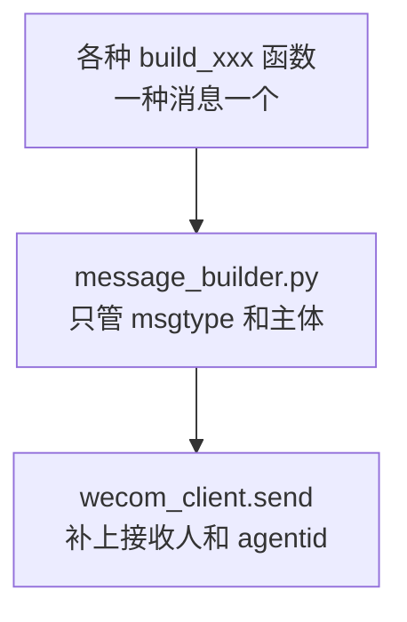

`build_xxx` 函数返回的就是“半个请求体”：

```python
{"msgtype": "text", "text": {"content": "..."}}
```

剩下半个由 `send()` 补齐。这就是 7.7 节要做的重构。

### 7.1.4 三个所有类型通用的可选字段

| 字段 | 含义 | 默认 |
|---|---|---|
| `safe` | 是否保密消息。`1` 表示不能分享且显示水印 | `0` |
| `enable_duplicate_check` | 是否开启重复消息检查 | `0` |
| `duplicate_check_interval` | 重复检查的时间间隔，最大 4 小时 | `1800` 秒 |

后两个是第 12 章的主角，本章先不用。`safe` 有一点要注意：**开启保密后，文件消息只支持部分格式**（txt、pdf、doc、docx、ppt、pptx、xls、xlsx、xml、jpg、jpeg、png、bmp、gif）。

---

## 7.2 文本消息

### 7.2.1 已经会了，补三个细节

文本消息第 3 章就在用，这里只补充官方文档里容易漏掉的三点。

**① 换行必须用转义的 `\n`**

```python
"content": "任务完成\n成功：10 条\n失败：0 条"
```

**② 支持 `a` 标签，可以放可点击的链接**

```python
"content": "快递已到，请前往领取。\n出发前可查看<a href=\"https://work.weixin.qq.com\">实况</a>"
```

这是文本消息里唯一支持的 HTML 标签。想要更丰富的排版，得用 Markdown 或卡片。

**③ 长度上限 2048 字节，超过将截断**

注意是**字节**，不是字数。这一点见 7.8 节。

### 7.2.2 一个必须知道的限制

官方有一条说明，很容易踩：

> 如果在管理端对应用设置了“**在微工作台中始终进入主页**”，应用在微信端只能接收到文本消息，且**文本消息长度限制为 20 字节**，超过会被截断。同时其他消息类型也会转换为文本消息，提示用户到企业微信查看。

**20 字节大约只有 6 个汉字。**所以如果你发现消息在微信端显示得莫名其妙的短、或者精心做的卡片变成了一句提示，先去检查这个后台设置，而不是怀疑代码。

### 7.2.3 构造函数

```python
def build_text(content: str, truncate: bool = True) -> dict:
    """
    构造文本消息主体。

    参数:
        content:  正文，用 \\n 换行，支持 a 标签
        truncate: 超长时是否自动截断。
                  False 时超长会抛 MessageContentError（宁可失败也不丢内容）

    返回:
        {"msgtype": "text", "text": {...}}
    """
    _require_not_blank(content, "文本消息正文")

    content = _fit_bytes(content, MAX_TEXT_BYTES, "文本消息正文", truncate)

    return {"msgtype": "text", "text": {"content": content}}
```

**实测输出：**

```text
{"msgtype": "text", "text": {"content": "任务完成\n成功 10 条"}}
```

---

## 7.3 Markdown 消息

### 7.3.1 支持的语法只是一个子集

官方明确说明“**目前仅支持 markdown 语法的子集**”。能用的就下面这些，其他语法（表格、图片、列表符号等）**不要用**。

| 语法 | 写法 | 注意 |
|---|---|---|
| 标题 1～6 级 | `# 标题一` | **`#` 与文字之间必须有空格** |
| 加粗 | `**bold**` | |
| 链接 | `[文字](http://...)` | |
| 行内代码 | `` `code` `` | **不支持跨行** |
| 引用 | `> 引用文字` | |
| 字体颜色 | `<font color="info">绿色</font>` | **只有 3 种内置颜色** |

三种颜色只能是：

| 值 | 显示颜色 | 适合用来表示 |
|---|---|---|
| `info` | 绿色 | 正常、成功 |
| `comment` | 灰色 | 次要信息、备注 |
| `warning` | 橙红色 | 警告、异常 |

**没有红色、蓝色可选**，只有这三个。想表达“严重错误”，用 `warning`。

### 7.3.2 两条重要限制

1. **内容最长 2048 字节，必须是 UTF-8 编码**（和文本消息一样）。
2. **微工作台（原企业号）不支持展示 Markdown 消息。**

第 2 条的实际含义是：**Markdown 的显示效果依赖客户端**。所以：

> **告警类消息不要把关键信息只放在 Markdown 的格式里。**比如不要指望用绿色/红色区分成功失败——万一颜色没渲染出来，两条消息就长得一模一样了。关键信息要写在文字里。

### 7.3.3 一个实用的模板

```python
content = (
    "### 每日待办提醒\n"
    "> **负责人**：张三\n"
    "> **待办数量**：<font color=\"warning\">3 项</font>\n"
    "> \n"
    "> 1. 采购申请审批（今天到期）\n"
    "> 2. 合同复核（明天到期）\n"
    "> \n"
    "> 详情请点击 [进入系统](https://example.com/todo)"
)
```

两个排版技巧：

- 引用块里想空一行，要写 `> `（竖线加空格），直接写空行会中断引用；
- 官方示例里在行尾用了两个空格再换行，这是 Markdown 的强制换行写法。

### 7.3.4 构造函数

```python
def build_markdown(content: str, truncate: bool = True) -> dict:
    """
    构造 markdown 消息主体。

    注意两条官方说明：
        1. 只支持 markdown 语法的【子集】（见本章 7.3 节列表）
        2. 微工作台（原企业号）不支持展示 markdown 消息
    """
    _require_not_blank(content, "markdown 内容")

    content = _fit_bytes(content, MAX_MARKDOWN_BYTES, "markdown 内容", truncate)

    return {"msgtype": "markdown", "markdown": {"content": content}}
```

**实测输出：**

```text
{"msgtype": "markdown", "markdown": {"content": "### 标题\n> 引用"}}
```

---

## 7.4 文本卡片消息

### 7.4.1 它和 Markdown 的区别

| | Markdown | 文本卡片 |
|---|---|---|
| 主要用途 | 展示格式化的文字 | **引导点击跳转** |
| 有按钮吗 | 没有 | **有**，且整条消息可点 |
| `url` 是否必填 | 无此字段 | **必填** |
| 适合场景 | 状态汇报、数据摘要 | 待审批、待处理、看详情 |

**一句话：要用户点进系统去操作，就用卡片。**

### 7.4.2 四个字段的官方限制

| 字段 | 必填 | 限制 |
|---|---|---|
| `title` | 是 | 不超过 128 字符，超过自动截断 |
| `description` | 是 | 不超过 512 字符，超过自动截断 |
| `url` | 是 | 最长 2048 字节，**必须包含 `http://` 或 `https://` 协议头** |
| `btntxt` | 否 | 按钮文字，**不超过 4 个文字**，默认为“详情” |

注意 `title` 和 `description` 官方写的是“**字符**”，而文本消息的 `content` 写的是“**字节**”。**两者单位不同**，所以代码里要用两个不同的截断函数（见 7.8 节）。

### 7.4.3 描述里可以用 HTML 控制颜色

卡片的 `description` 支持 `div` 标签，通过 `class` 指定三种颜色：

| `class` | 颜色 |
|---|---|
| `gray` | 灰色 |
| `highlight` | 高亮 |
| `normal` | 默认黑色 |

官方示例的写法：

```python
description = (
    '<div class="gray">2026年9月4日</div>'
    '<div class="normal">您有 3 项待办事项即将到期</div>'
    '<div class="highlight">请在今天下班前处理</div>'
)
```

换行可以用 `br` 标签或空格。

### 7.4.4 构造函数：这里有个值得做的检查

```python
def build_textcard(title: str, description: str, url: str,
                   button_text: str = "") -> dict:
    """
    构造文本卡片消息主体。

    参数:
        title:       标题，不超过 128 字符
        description: 描述，不超过 512 字符，支持 div 标签控制颜色
        url:         点击后跳转的链接，【必须带 http:// 或 https:// 协议头】
        button_text: 按钮文字，不超过 4 个字，留空则用官方默认值"详情"
    """
    _require_not_blank(title, "卡片标题")
    _require_not_blank(description, "卡片描述")
    _require_not_blank(url, "卡片链接")

    # 官方要求确保包含协议头。这个检查很值得做：
    # 漏了协议头的链接，消息能发出去，但用户点了打不开，
    # 而你从返回结果里完全看不出问题。
    if not url.startswith(("http://", "https://")):
        raise MessageContentError(
            f"卡片链接必须以 http:// 或 https:// 开头，当前值是 {url!r}"
        )

    if byte_length(url) > MAX_URL_BYTES:
        raise MessageContentError(
            f"卡片链接过长：{byte_length(url)} 字节，"
            f"上限 {MAX_URL_BYTES} 字节"
        )

    card = {
        "title": truncate_by_length(title, MAX_TITLE_LENGTH),
        "description": truncate_by_length(description, MAX_DESCRIPTION_LENGTH),
        "url": url,
    }

    # 只在用户明确指定时才放 btntxt，否则让企业微信用它的默认值"详情"
    if button_text:
        card["btntxt"] = truncate_by_length(button_text, MAX_BUTTON_TEXT_LENGTH)

    return {"msgtype": "textcard", "textcard": card}
```

### 7.4.5 为什么要检查协议头

这是本章最值得学的一个防御性检查。

如果 `url` 写成 `example.com/todo`（漏了 `https://`）：

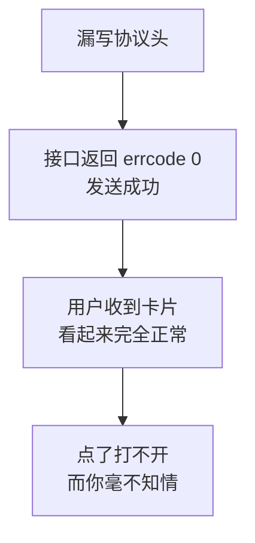

**这是一种“静默失败”**——三层检查全都通过，但功能是坏的。这类问题只能靠**发送前的本地校验**发现。

**实测四种坏输入都被拦下：**

```text
链接漏了协议头   -> MessageContentError: 卡片链接必须以 http:// 或 https:// 开头，当前值是 'example.com'
标题为空         -> MessageContentError: 卡片标题不能为空
描述为空         -> MessageContentError: 卡片描述不能为空
链接过长         -> MessageContentError: 卡片链接过长：2114 字节，上限 2048 字节
```

### 7.4.6 为什么 `btntxt` 不填就不放

```python
if button_text:
    card["btntxt"] = ...
```

因为官方给了默认值“详情”。如果我们无条件写入 `"btntxt": ""`，就可能把默认值覆盖成空按钮。

**实测：**

```text
不填 btntxt 时是否省略该字段: True
```

> **原则：可选字段没值就不要放进请求体**，让服务端用它自己的默认值。第 6 章“只放非空接收人字段”是同一个道理。

---

# 第二部分　图片与文件：两步式调用

## 7.5 上传素材换 `media_id`

### 7.5.1 为什么不能直接发本地文件

新手最自然的想法是：

```python
{"msgtype": "image", "image": {"path": "D:/report.png"}}     # 不存在这种写法
```

**这行不通。**原因很简单：企业微信的服务器在腾讯机房，**它访问不到你电脑上的 `D:/report.png`**。

所以必须分两步：

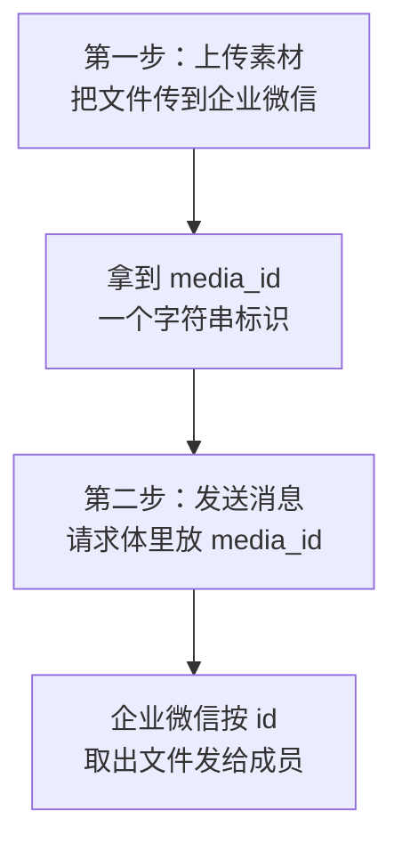

`media_id` 可以理解为**“文件已经在企业微信服务器上了，这是它的取件号”**。

### 7.5.2 上传接口的规格

| 项目 | 内容 |
|---|---|
| 地址 | `https://qyapi.weixin.qq.com/cgi-bin/media/upload` |
| 方式 | `POST` |
| 网址参数 | `access_token` 和 `type` |
| 请求体 | **`multipart/form-data`**，文件字段名必须是 `media` |
| 返回 | `type`、`media_id`、`created_at` |

`type` 只能是四种：`image`、`voice`、`video`、`file`。

### 7.5.3 素材大小和格式限制

| 类型 | 上限 | 格式要求 |
|---|---|---|
| `image` 图片 | 10 MB | 支持 JPG、PNG |
| `voice` 语音 | 2 MB | **仅支持 AMR**，播放长度不超过 60 秒 |
| `video` 视频 | 10 MB | 支持 MP4 |
| `file` 普通文件 | 20 MB | 不限格式 |

另外有一条容易忽略的：**所有文件 size 必须大于 5 个字节**。空文件传不上去。

> 说明：官方错误码 `45001` 的排查说明里，对图片和音频的上限描述与上表略有差异。本教程按“上传临时素材”文档（更新日期更晚）的数值实现，实际以接口返回为准。

### 7.5.4 三天有效期：一个必须记住的坑

官方明确写着：**`media_id` 仅三天内有效**。

这意味着：

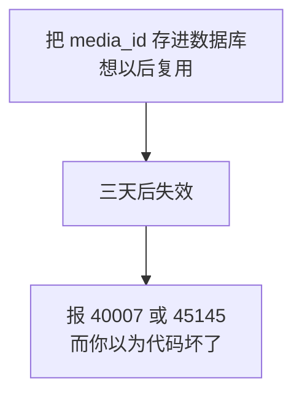

**正确做法：每次要发就重新上传。**不要缓存 `media_id`，也不要把它当成文件的永久标识存进业务表。

顺带一个好消息：官方说明 `media_id` **在同一企业内的应用之间可以共享**。所以如果你有多个自建应用，用一个上传、另一个发送是可行的。

### 7.5.5 上传的实现：本章第一次不用 `json=`

```python
    def upload_media(self, file_path: str, media_type: str) -> str:
        """
        上传本地文件，换取 media_id。

        参数:
            file_path:  本地文件路径
            media_type: image / voice / video / file

        返回:
            media_id 字符串。注意：官方说明它【只有 3 天有效】，
            所以不要长期缓存，也不要存进数据库当永久标识。

        出错时:
            InvalidRequestError（本地校验没过）
            MediaUploadError（接口返回失败）
        """
        # ---------- 1. 本地校验：能在本地发现的，绝不浪费一次上传 ----------
        self._check_media_type(media_type)
        size = self._check_media_file(file_path, media_type)

        file_name = os.path.basename(file_path)
        print(f"[上传素材] {file_name}（{format_size(size)}，类型 {media_type}）")

        access_token = self.get_access_token()

        # ---------- 2. 用 multipart/form-data 上传 ----------
        # 注意这里用的是 files= 参数，而【不是】json=。
        # 上传文件必须用 multipart/form-data，这是本教程第一次不用 json=。
        # 官方要求表单里的文件字段名必须是 "media"。
        with open(file_path, "rb") as file_object:
            files = {
                # 元组的三项分别是：展示用的文件名、文件内容、内容类型。
                # 第一项很重要：官方说明"使用该 media_id 发消息时，
                # 展示的文件名由该字段控制"。
                "media": (file_name, file_object, "application/octet-stream"),
            }

            response = requests.post(
                UPLOAD_URL,
                params={"access_token": access_token, "type": media_type},
                files=files,
                timeout=self._upload_timeout,
            )

        response.raise_for_status()
        data = response.json()

        errcode = data.get("errcode")
        if errcode != 0:
            raise MediaUploadError(
                f"上传素材失败：errcode={errcode}, errmsg={data.get('errmsg')}"
            )

        media_id = data.get("media_id")
        print(f"[上传素材] 成功，media_id={media_id[:12]}...（3 天内有效）")
        return media_id
```

### 7.5.6 三种请求体写法的对照

到目前为止我们用过三种 `requests` 参数，正好对应三种内容类型：

| 参数 | 内容类型 | 用在哪 |
|---|---|---|
| `json=` | `application/json` | **发消息** |
| `files=` | `multipart/form-data` | **上传素材** |
| `data=` | `application/x-www-form-urlencoded` | **本教程不用** |

**实测上传请求确实符合官方要求：**

```text
是否用 multipart  : True
表单字段名是 media: True
body 里的文件名   : test_image.png
```

### 7.5.7 `open()` 为什么要用 `with`

```python
with open(file_path, "rb") as file_object:
    ...
```

`with` 保证**离开这个块时文件一定被关闭**，即使中间抛了异常。

不用 `with` 的后果在 Windows 上特别明显：文件句柄没释放，你会发现**那个文件删不掉、改不了名**，提示“正在被其他程序使用”。

注意 `"rb"` 里的 `b` 表示二进制模式。上传文件必须用二进制，**不能用文本模式**——图片里的字节不是合法文字，用文本模式读会直接报错或损坏内容。

### 7.5.8 上传前的本地校验

```python
    def _check_media_file(self, file_path: str, media_type: str) -> int:
        """
        检查文件是否存在、大小是否合规、扩展名是否匹配。

        返回文件大小（字节）。
        """
        if not os.path.isfile(file_path):
            raise InvalidRequestError(f"文件不存在：{file_path}")

        size = os.path.getsize(file_path)

        # 官方要求：所有文件 size 必须大于 5 个字节
        if size <= MIN_MEDIA_SIZE:
            raise InvalidRequestError(
                f"文件太小（{size} 字节），官方要求必须大于 {MIN_MEDIA_SIZE} 字节"
            )

        limit = MEDIA_SIZE_LIMITS[media_type]
        if size > limit:
            raise InvalidRequestError(
                f"文件过大：{format_size(size)}，"
                f"{media_type} 类型的上限是 {format_size(limit)}"
            )

        # 图片格式检查。官方说明图片仅支持 JPG、PNG，
        # 在本地按扩展名先挡一道，避免白跑一次上传。
        if media_type == "image":
            extension = os.path.splitext(file_path)[1].lower()
            if extension not in IMAGE_EXTENSIONS:
                raise InvalidRequestError(
                    f"图片格式不支持：{extension or '（无扩展名）'}，"
                    f"只支持 {', '.join(IMAGE_EXTENSIONS)}"
                )

        return size
```

**实测四种坏输入，一次上传请求都没发出：**

```text
文件不存在      -> InvalidRequestError: 文件不存在：nothing.png
类型不支持      -> InvalidRequestError: 不支持的素材类型 'picture'，只能是 image, voice, video, file
文件太小        -> InvalidRequestError: 文件太小（3 字节），官方要求必须大于 5 字节
图片格式不支持  -> InvalidRequestError: 图片格式不支持：.gif，只支持 .jpg, .jpeg, .png
这些校验共发出上传请求数: 0 （应为 0）
```

**为什么本地校验在上传这里格外重要？**因为上传是**耗流量、耗时间**的操作。一个 18 MB 的视频传完才被告知“超过 10 MB 上限”，白白浪费一两分钟。

### 7.5.9 把两步合成一个方法

调用方不该关心“先上传再发送”这种细节：

```python
    def send_image(self, file_path: str, to_users=None, to_parties=None,
                   to_tags=None) -> SendResult:
        """
        发送图片：自动完成"上传素材 → 用 media_id 发送"两步。

        注意演练模式下的处理：
            演练时【不上传】，因为上传是真实的网络写操作，
            会在企业微信服务端产生一个素材。演练应该什么都不做。
        """
        if self._config.dry_run:
            print(f"[演练模式] 将上传并发送图片：{file_path}")
            return self.send(mb.build_image("DRY-RUN-MEDIA-ID"),
                             to_users, to_parties, to_tags)

        media_id = self.upload_media(file_path, "image")
        return self.send(mb.build_image(media_id),
                         to_users, to_parties, to_tags)
```

**实测两步式调用：**

```text
[上传素材] test_image.png（508 字节，类型 image）
[上传素材] 成功，media_id=MEDIA-1G6nrL...（3 天内有效）
上传次数: 1  发送次数: 1
发送时用的请求体: {"msgtype": "image", "image": {"media_id": "MEDIA-1G6nrLmr5EC3MMb-zK1dDdzmd0p7cNliYu9V5w7o8K0"}, "agentid": 1000002, "safe": 0, "touser": "zhangsan"}
```

一次调用产生了**两个网络请求**，且第二个请求用的正是第一个返回的 `media_id`。

### 7.5.10 演练模式为什么要跳过上传

这是一个容易想错的地方。

上传素材是**真实的服务端写操作**——文件真的被传到企业微信、真的占用资源、真的产生一个三天有效的 `media_id`。而演练模式的承诺是“**什么都不做**”。

所以演练时不上传，只打印将要上传的文件名，然后用一个假的 `media_id` 走完后续流程，验证请求体组装正确。

**实测：**

```text
[演练模式] 将上传并发送图片：test_image.png
[演练模式] 以下 image 消息【没有】真的发送：
           接收成员：共 1 人：zhangsan
           消息主体：{'media_id': 'DRY-RUN-MEDIA-ID'}
上传次数: 0 （应为 0）
发送次数: 0 （应为 0）
```

### 7.5.11 上传超时要单独设置

```python
    def __init__(self, config: WeComConfig, timeout: int = 10,
                 upload_timeout: int = 60) -> None:
        """
        参数:
            config:         已校验过的配置
            timeout:        普通接口的超时秒数
            upload_timeout: 上传文件的超时秒数。
                            单独设置是因为上传 20MB 的文件明显比发一条文本慢，
                            用同一个 10 秒会频繁超时（第 4 章 4.7.3 讲过）。
        """
```

这正是第 4 章 4.7.3 节说的“**不同场景用不同超时**”。发一条文本 10 秒足够，传一个 20 MB 的文件 10 秒根本不够。

### 7.5.12 新增第五种密钥泄露方式

我在跑测试时打印了上传请求的网址，输出是这样的：

```text
请求网址: /cgi-bin/media/upload?access_token=TOKkkkkkkkkkkkkkkkk...&type=image
```

**`access_token` 完整出现在网址里。**

回想第 1 章：凭证是拼在网址参数上的。所以任何打印“请求网址”的行为，都会连带打印凭证。至此这个清单有五项了：

| 泄露方式 | 章节 | 防法 |
|---|---|---|
| `print(secret)` | — | 别写 |
| `print(params)` | 第 4 章 | 打码 |
| `print(网络异常)` | 第 3 章 | 只打类型名 |
| `print(config)` | 第 5 章 | 自定义 `__repr__` |
| **`print(请求网址)`** | **本章** | **不打网址，或先去掉参数** |

共同点还是那句话：**你并没有主动打印密钥，是别的东西替你打印了。**

---

## 7.6 图文消息和模板卡片概览

本教程的业务场景用不到这两类，但你应该知道它们存在，以后需要时能找对方向。

### 7.6.1 图文消息（`news`）

一条消息里放 1～8 篇“文章卡片”，每篇有标题、描述、配图、跳转链接。

| 字段 | 限制 |
|---|---|
| `articles` | 1～8 条 |
| `title` | 不超过 128 字节 |
| `description` | 不超过 512 字节 |
| `url` | 最长 2048 字节，需协议头 |
| `picurl` | 最长 2048 字节，支持 JPG、PNG。**大图建议 1068×455，小图 150×150** |

注意 `picurl` 是**图片的网址**，不是 `media_id`——所以图文消息**不需要上传素材**，但你得有一个能公网访问的图片地址。

### 7.6.2 图文消息（`mpnews`）

和 `news` 类似，区别是**图文内容存储在企业微信**，正文支持 HTML，最长 666 KB。它的缩略图要用 `thumb_media_id`，**这个需要上传素材**。

另外它是唯一支持 `safe=2`（仅限企业内分享）的消息类型。

### 7.6.3 模板卡片（`template_card`）

功能最强的一类，有五种子类型：

| 子类型 | 用途 |
|---|---|
| 文本通知型 | 结构化的通知 |
| 图文展示型 | 带图的展示 |
| **按钮交互型** | **用户可以点按钮回传** |
| **投票选择型** | **收集选择** |
| **多项选择型** | **下拉多选** |

后三种是真正的“交互”——用户操作后会**产生回调事件**，你的服务器能收到。返回值里的 `response_code` 就是给这类消息用的（72 小时内有效，只能用一次）。

**但请注意：接收回调需要你有一个公网可访问的服务器地址。**这超出了本教程“定时任务 + 数据库”的范围，所以只做概览。

### 7.6.4 该选哪种消息类型

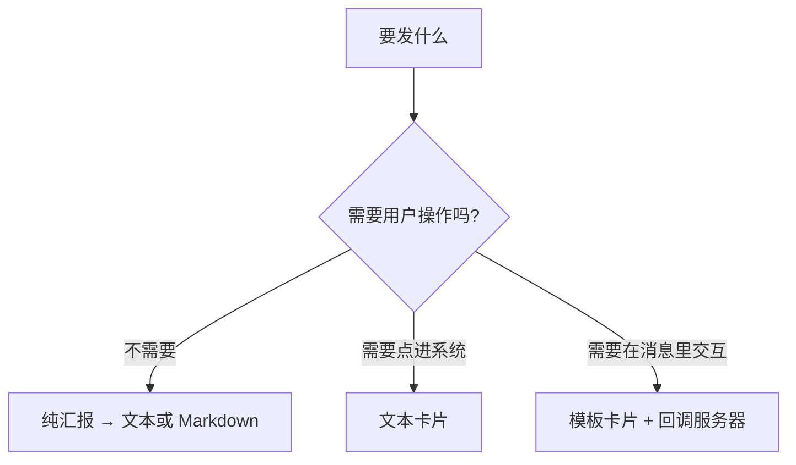

本教程第 11 章的待办提醒会用 **Markdown**（信息密度高）和 **文本卡片**（引导点击）两种。

---

# 第三部分　工程化

## 7.7 使用统一入口减少重复代码

### 7.7.1 问题：5 种消息，5 份重复代码

第 6 章的 `send_text` 里塞了一整套逻辑：

```text
清洗接收人 → 校验官方上限 → 三道安全护栏 → 组装请求体 → 演练模式 → 发送 → 解析结果
```

如果每种消息类型都复制一遍，会有 5 份几乎相同的代码。**后果是：第 12 章要加“发送前查重”，你得改 5 个地方，一定会漏。**

### 7.7.2 解决：抽出 `send()`

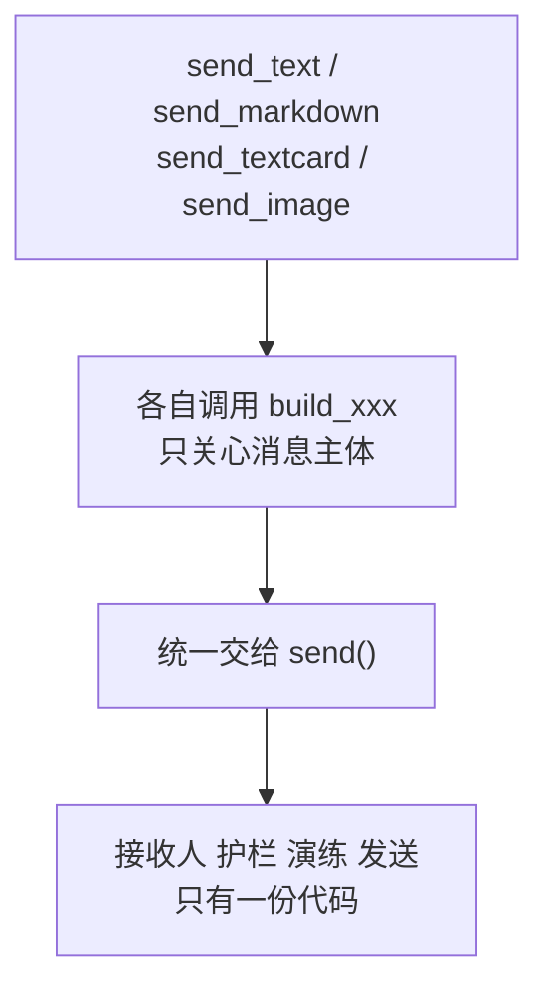

```python
    def send(self, message: dict, to_users=None, to_parties=None,
             to_tags=None) -> SendResult:
        """
        发送任意类型的消息。

        参数:
            message: 由 message_builder 构造的消息主体，
                     形如 {"msgtype": "text", "text": {...}}
            其余参数同第 6 章

        为什么要有这个方法？
            第 6 章只有文本一种消息，逻辑写在 send_text 里没问题。
            现在有 5 种消息，如果每种都复制"清洗接收人 + 三道护栏 +
            演练模式 + 解析结果"这一整套，就会有 5 份重复代码。
            抽出 send() 之后，新增一种消息类型只需要写一个 build 函数。
        """
        # ---------- 1. 清洗接收人 ----------
        users = normalize_user_ids(to_users or [])
        parties = [str(p).strip() for p in (to_parties or []) if str(p).strip()]
        tags = [str(t).strip() for t in (to_tags or []) if str(t).strip()]

        # ---------- 2. 校验 ----------
        self._check_message(message)
        self._check_receivers(users, parties, tags)
        self._check_safety(users, parties, tags)

        # ---------- 3. 组装完整请求体 ----------
        # dict(message) 会复制一份，避免修改调用方传进来的字典。
        # 这个细节很容易忽略：如果直接改 message，调用方复用同一个
        # message 对象发给两批人时，第二次就会带上第一次的接收人。
        payload = dict(message)
        payload["agentid"] = self._config.agent_id
        payload.setdefault("safe", 0)

        if users:
            payload["touser"] = join_receivers(users)
        if parties:
            payload["toparty"] = join_receivers(parties)
        if tags:
            payload["totag"] = join_receivers(tags)

        # ---------- 4. 演练模式 ----------
        if self._config.dry_run:
            self._print_dry_run(payload, users, parties, tags)
            return SendResult(dry_run=True)

        # ---------- 5. 真正发送 ----------
        access_token = self.get_access_token()
        raw = self._post_message(access_token, payload)
        return self._parse_result(raw)
```

### 7.7.3 各类型的便捷方法变得非常薄

```python
    def send_text(self, content: str, to_users=None, to_parties=None,
                  to_tags=None, truncate: bool = True) -> SendResult:
        """发送文本消息。"""
        message = mb.build_text(content, truncate=truncate)
        return self.send(message, to_users, to_parties, to_tags)

    def send_markdown(self, content: str, to_users=None, to_parties=None,
                      to_tags=None, truncate: bool = True) -> SendResult:
        """发送 markdown 消息。"""
        message = mb.build_markdown(content, truncate=truncate)
        return self.send(message, to_users, to_parties, to_tags)

    def send_textcard(self, title: str, description: str, url: str,
                      button_text: str = "", to_users=None,
                      to_parties=None, to_tags=None) -> SendResult:
        """发送文本卡片消息。"""
        message = mb.build_textcard(title, description, url, button_text)
        return self.send(message, to_users, to_parties, to_tags)
```

**每个方法只有两行。**这是重构成功的标志：新增一种消息类型，只需要写一个 `build_xxx` 加一个两行的便捷方法。

### 7.7.4 实测：四种消息的请求体都组装正确

```text
msgtype=text      agentid=1000002 safe=0 touser=zhangsan 主体键=['content']
msgtype=markdown  agentid=1000002 safe=0 touser=zhangsan 主体键=['content']
msgtype=textcard  agentid=1000002 safe=0 touser=zhangsan 主体键=['title', 'description', 'url']
msgtype=image     agentid=1000002 safe=0 touser=zhangsan 主体键=['media_id']
```

四种类型的 `agentid`、`safe`、`touser` 都由 `send()` 统一补齐，主体各不相同。

### 7.7.5 护栏对所有类型自动生效

抽出 `send()` 的最大好处在这里。**实测：**

```text
文本      -> UnsafeSendError: 本次接收人 5 人，超过配置的上限 2 人...
markdown  -> UnsafeSendError: 本次接收人 5 人，超过配置的上限 2 人...
卡片      -> UnsafeSendError: 本次接收人 5 人，超过配置的上限 2 人...
@all      -> UnsafeSendError: 检测到 @all，这会发给应用可见范围内的【全部成员】...
这些调用共发出请求数: 0 （应为 0）
```

第 6 章写的护栏，本章新增的三种消息类型**一行代码都没改就自动继承了**。这就是“只有一份代码”的价值。

### 7.7.6 一个隐蔽的坑：`dict(message)`

```python
payload = dict(message)     # 复制一份，不要直接改 message
```

为什么不直接 `message["touser"] = ...`？因为**字典是可变对象，传进函数的是引用而不是副本**。直接改会污染调用方的字典：

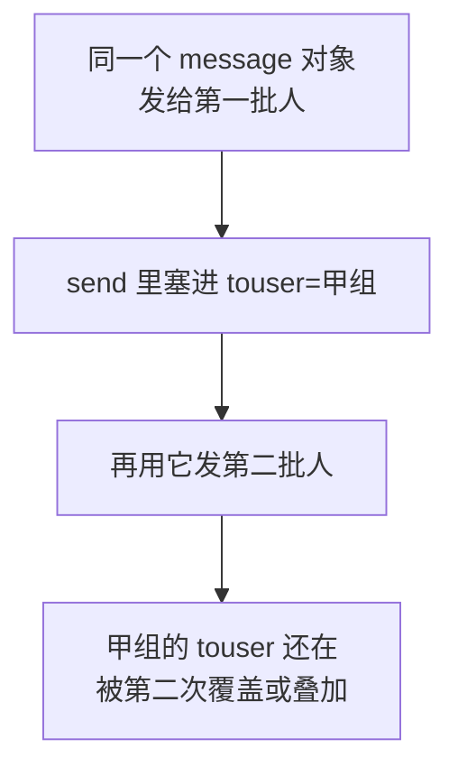

**实测（复用同一个 message 发两次）：**

```text
第一次 touser: zhangsan
第二次 touser: lisi
原始 message 是否被改动: ['msgtype', 'text']
```

原始 `message` 只有 `msgtype` 和 `text` 两个键，**没有被塞进 `touser`**。

这个坑和第 5 章的 `default_factory`、第 6 章的 `to_users=None` 是同一类问题——**Python 里凡是可变对象（列表、字典），都要留意“是不是在改别人的东西”**。

---

## 7.8 防止内容超长

### 7.8.1 核心认知：官方限制的单位是**字节**

先看实测数据：

```text
'hello'                 len()=  5 字   byte_length()=  5 字节
'磁盘告警'               len()=  4 字   byte_length()= 12 字节
'磁盘告警 disk alert'    len()= 15 字   byte_length()= 23 字节
```

**UTF-8 编码下，一个汉字通常占 3 个字节，英文字母占 1 个。**

所以“2048 字节”换算成汉字只有：

```text
2048 字节能装多少个汉字： 682 个（汉字 3 字节）
而 len('汉'*2048) = 2048 字 = 6144 字节 → 严重超标
```

**如果你用 `len(content) > 2048` 判断超长，中文内容会在 682 字时就已经超标，而你的检查毫无反应。**

### 7.8.2 计算字节长度

```python
def byte_length(text: str) -> int:
    """
    返回一段文字的【字节】长度（UTF-8 编码下）。

    为什么要专门写这个？
        官方限制是"2048 个字节"，不是"2048 个字"。
        在 UTF-8 里，一个汉字通常占 3 个字节，英文字母占 1 个。
        所以 len(text) 数出来的是字数，不是字节数，两者差很多。
    """
    return len(text.encode("utf-8"))
```

### 7.8.3 为什么不能直接切片

知道要按字节算之后，很自然会想到：

```python
content.encode("utf-8")[:2048].decode("utf-8")
```

**这会崩。实测：**

```text
原文字节数: 2400
硬切到 2048 字节后 decode:
  UnicodeDecodeError: 'utf-8' codec can't decode bytes in position 2046-2047: unexpected end of data
```

原因是**汉字被劈成了两半**：一个汉字占 3 个字节，切在第 2048 个字节上，正好把某个汉字切断，剩下的残缺字节无法解码。

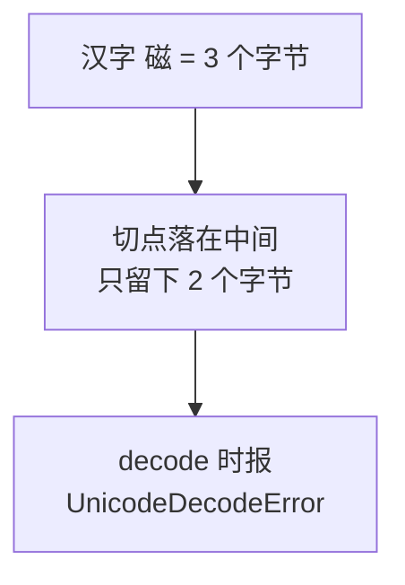

解决办法是加 `errors="ignore"`，让它**丢掉结尾那个残缺字符**：

```text
用 errors='ignore' 才安全: '磁盘告警磁盘'
```

### 7.8.4 安全的截断函数

```python
def truncate_by_bytes(text: str, max_bytes: int,
                      suffix: str = TRUNCATE_SUFFIX) -> str:
    """
    按【字节数】安全地截断一段文字。

    为什么不能直接切片？
        1. text[:2048] 切的是"字符"，2048 个汉字其实是 6144 字节，还是超。
        2. text.encode()[:2048] 切的是字节，但可能把一个汉字劈成两半，
           再 decode 就会抛 UnicodeDecodeError。

    做法：
        先按字节切，再用 errors='ignore' 丢掉结尾那半个残缺字符。

    参数:
        text:      原文
        max_bytes: 允许的最大字节数
        suffix:    截断后追加的提示文字（它自己也占字节，要预留）
    """
    if max_bytes < 1:
        raise ValueError("max_bytes 必须大于 0")

    encoded = text.encode("utf-8")

    # 没超长就原样返回，这是最常见的情况
    if len(encoded) <= max_bytes:
        return text

    suffix_bytes = suffix.encode("utf-8")

    # 极端情况：连提示文字都放不下，那就只保留正文
    if len(suffix_bytes) >= max_bytes:
        return encoded[:max_bytes].decode("utf-8", errors="ignore")

    keep = max_bytes - len(suffix_bytes)

    # errors='ignore' 会丢掉结尾那个被切断的不完整字符，
    # 这正是我们想要的效果：宁可少一个字，也不要报错。
    head = encoded[:keep].decode("utf-8", errors="ignore")

    return head + suffix
```

**实测四种情况：**

```text
原文     9 字节, 上限 2048 -> 结果    9 字节, 尾部 '短文本'
原文  2400 字节, 上限 2048 -> 结果 2046 字节, 尾部 '磁盘告警…（已截断）'
原文    10 字节, 上限    8 -> 结果    8 字节, 尾部 'abcdefgh'
原文    12 字节, 上限    7 -> 结果    6 字节, 尾部 '汉字'
```

三个细节值得说：

1. **第二行结果是 2046 而不是 2048**——因为丢掉了结尾那个被切断的汉字，少了 2 个字节。这是正常的，**上限是“不超过”，不是“必须等于”**。
2. **加了“…（已截断）”提示**，让收到消息的人知道后面还有内容，而不是以为消息就这么短。
3. **第四行触发了极端分支**：上限只有 7 字节，而提示文字本身就占 16 字节，放不下，所以只保留正文。

### 7.8.5 “字符”和“字节”两套函数不能混用

回顾一下官方的单位差异：

| 字段 | 单位 | 用哪个函数 |
|---|---|---|
| 文本 `content` | **字节** 2048 | `truncate_by_bytes` |
| Markdown `content` | **字节** 2048 | `truncate_by_bytes` |
| 卡片 `title` | **字符** 128 | `truncate_by_length` |
| 卡片 `description` | **字符** 512 | `truncate_by_length` |

```python
def truncate_by_length(text: str, max_length: int) -> str:
    """
    按【字符数】截断。

    文本卡片的 title 和 description，官方写的是"字符"而不是"字节"，
    所以这里按字符处理。注意和 truncate_by_bytes 区分开，别用混。
    """
    if len(text) <= max_length:
        return text
    return text[:max_length]
```

**实测卡片截断：**

```text
title  长度: 128 （上限 128）
desc   长度: 512 （上限 512）
btntxt 内容: '按钮文字' （上限 4 个字）
```

传进去的是 200 个“标”、600 个“描”、7 个字的按钮文字，都被截到了上限。

### 7.8.6 截断还是报错：这是一个业务决定

```python
def _fit_bytes(content: str, max_bytes: int, label: str,
               truncate: bool) -> str:
    """
    让内容符合字节上限：要么截断，要么报错。

    为什么要提供"报错"这个选项？
        自动截断很方便，但如果这是一封含金额、单号的业务通知，
        被默默截掉后半段可能造成误解。
        这种场景应该宁可失败并告警，也不要发出一条残缺的消息。
    """
    actual = byte_length(content)

    if actual <= max_bytes:
        return content

    if not truncate:
        raise MessageContentError(
            f"{label}过长：{actual} 字节，上限 {max_bytes} 字节。"
            f"如允许截断，请设置 truncate=True。"
        )

    print(f"[警告] {label}超长（{actual} 字节 > {max_bytes} 字节），已自动截断。")
    return truncate_by_bytes(content, max_bytes)
```

**实测两种模式：**

```text
原文 3600 字节
truncate=True （默认）:
[警告] 文本消息正文超长（3600 字节 > 2048 字节），已自动截断。
  结果 2046 字节
truncate=False:
  MessageContentError: 文本消息正文过长：3600 字节，上限 2048 字节。如允许截断，请设置 truncate=True。
```

怎么选？

| 场景 | 建议 |
|---|---|
| 状态汇报、日志摘要 | `truncate=True`，截断无害 |
| **含金额、单号、审批结论的通知** | **`truncate=False`**，宁可失败告警 |
| 第 11 章的待办汇总 | 先分页拆成多条，而不是截断 |

注意即使自动截断，也**打印了一条警告**。静默截断是很危险的——你永远不知道用户少看了什么。

### 7.8.7 超长的更好办法：拆成多条

截断是最后手段。第 11 章处理“一个人有 50 条待办”时，正确做法是：

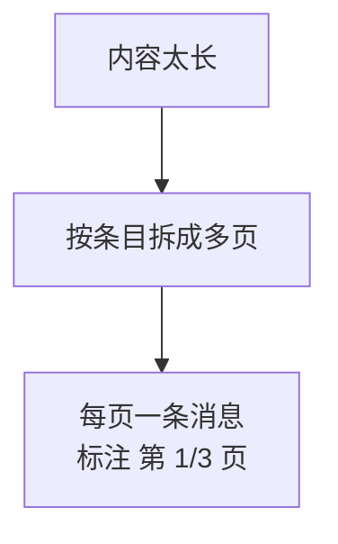

而不是截断到 2048 字节然后丢掉剩下的。**同一个人一分钟最多 30 条消息**（第 6 章的频率限制），拆几页是完全可行的。

---

## 7.9 本章小项目：发一条带标题、摘要和详情链接的通知

### 7.9.1 用 Markdown 版

```python
from datetime import datetime

now = datetime.now().strftime("%Y-%m-%d %H:%M")

content = (
    "### 每日待办提醒\n"
    f"> 统计时间：<font color=\"comment\">{now}</font>\n"
    "> \n"
    "> **待办数量**：<font color=\"warning\">3 项</font>\n"
    "> 1. 采购申请审批（今天到期）\n"
    "> 2. 合同复核（明天到期）\n"
    "> 3. 月度报表提交（本周五）\n"
    "> \n"
    "> [进入系统处理](https://example.com/todo)"
)

client.send_markdown(content, to_users=["zhangsan"])
```

### 7.9.2 用卡片版

```python
client.send_textcard(
    title="您有 3 项待办事项",
    description=(
        f'<div class="gray">{now}</div>'
        '<div class="normal">采购申请审批、合同复核、月度报表提交</div>'
        '<div class="highlight">其中 1 项今天到期</div>'
    ),
    url="https://example.com/todo",
    button_text="去处理",
    to_users=["zhangsan"],
)
```

### 7.9.3 两个版本的选择

| | Markdown | 卡片 |
|---|---|---|
| 能列出全部 3 条 | **能** | 只能塞在描述里 |
| 引导点击 | 链接不显眼 | **整条可点，还有按钮** |
| 微工作台显示 | **不支持** | 支持 |

**建议：信息本身就够用时发 Markdown；需要用户去系统里操作时发卡片。**

### 7.9.4 建议的练习顺序

1. **先开演练模式**，确认两种消息的请求体结构正确；
2. 关掉演练，给自己发 Markdown 版，观察三种颜色和引用块的显示；
3. 发卡片版，**点一下按钮**，确认链接能打开；
4. 故意把卡片的 `url` 写成 `example.com`（去掉协议头），确认被本地拦下；
5. 准备一张 PNG 图片，用 `send_image` 发送；
6. 把图片改名成 `.gif`，确认被本地拦下；
7. 准备一个文本文件，用 `send_file` 发送，**确认收到的文件名和本地一致**；
8. 构造一段 3000 字节的中文正文，观察截断警告。

第 4、6 步验证的是本地校验；第 7 步验证的是上传时 `filename` 字段真的控制了展示名。

---

## 7.10 本章改动清单

### 新增文件 `message_builder.py`

| 内容 | 说明 |
|---|---|
| 长度限制常量 | `MAX_TEXT_BYTES` 等 6 个 |
| `MessageContentError` | 继承 `ValueError` |
| `byte_length()` | 按 UTF-8 算字节数 |
| `truncate_by_bytes()` | 按字节安全截断 |
| `truncate_by_length()` | 按字符截断 |
| `build_text/markdown/textcard` | 三种文字类消息 |
| `build_image/file/voice/video` | 四种素材类消息 |
| `_require_not_blank/_fit_bytes` | 内部工具 |

### `wecom_client.py`

| 改动 | 说明 |
|---|---|
| 新增 `UPLOAD_URL` | 上传素材接口地址 |
| 新增 `MEDIA_SIZE_LIMITS` 等常量 | 素材大小、最小字节、图片扩展名 |
| 新增 `MediaUploadError` | 上传失败专用异常 |
| `__init__` 增加 `upload_timeout` | 上传用 60 秒 |
| 新增 `format_size()` | 字节数转可读形式 |
| **新增 `send()`** | 统一入口，抽出全部通用逻辑 |
| **`send_text` 改为两行** | 只负责构造 + 调用 `send()` |
| 新增 `send_markdown/send_textcard` | 同上 |
| 新增 `send_image/send_file` | 自动完成两步式调用 |
| 新增 `upload_media()` | 上传素材 |
| 新增 `_check_media_type/_check_media_file` | 上传前本地校验 |
| 新增 `_check_message` | 校验消息主体格式 |
| 新增 `_print_dry_run` | 演练输出，各类型通用 |

### `config.py`

本章无改动。

---

## 7.11 本章完成标志

- [ ] Markdown 消息能正确显示标题、引用和三种颜色
- [ ] 文本卡片能显示，且**点击按钮能打开链接**
- [ ] 卡片 `url` 漏写协议头时，**被本地拦下**（不是发出去点不开）
- [ ] 用 `send_image` 发出一张图片，日志里能看到**先上传后发送两步**
- [ ] 用 `send_file` 发出一个文件，**收到的文件名和本地文件名一致**
- [ ] 把图片改成 `.gif`，被本地拦下且**没有发生上传**
- [ ] 3000 字节的中文正文被截断，且**打印了警告**
- [ ] 演练模式下发图片，**没有上传、没有发送**

### 本章完成标志

> 你收到一条带标题、颜色和跳转链接的 Markdown 消息，一条可点击的卡片，一张图片，以及一个文件名正确的附件。

---

## 7.12 本章小结

### 7.12.1 五种消息类型速查

| 类型 | 需要上传素材 | 主要限制 | 适合 |
|---|---|---|---|
| `text` | 否 | 2048 **字节** | 简单通知 |
| `markdown` | 否 | 2048 **字节**，子集语法，微工作台不支持 | 结构化汇报 |
| `textcard` | 否 | 标题 128 **字符**、描述 512 **字符**、需协议头 | 引导点击 |
| `image` | **是** | 10 MB，JPG/PNG | 截图、图表 |
| `file` | **是** | 20 MB | 报表、附件 |

### 7.12.2 本章必须带走的 8 条结论

1. **`msgtype` 的值就是主体字段的名字**，记住这条不用背结构。
2. **图片和文件必须两步走**：上传换 `media_id`，再发送。
3. **`media_id` 只有 3 天有效**，不要缓存、不要入库当永久标识。
4. **上传用 `files=`，发消息用 `json=`**，两者的内容类型不同。
5. **官方限制的单位是字节**，一个汉字 3 字节，`len()` 数的是字数。
6. **按字节切片会把汉字劈成两半**，必须配 `errors="ignore"`。
7. **卡片 `url` 漏协议头是静默失败**，只能靠本地校验发现。
8. **`dict(message)` 复制一份**，否则会污染调用方的字典。

### 7.12.3 自测题

1. 怎么从 `msgtype` 推出主体字段的名字？（7.1.2）
2. Markdown 支持哪三种颜色？为什么不能只靠颜色区分成功失败？（7.3.1、7.3.2）
3. 卡片 `url` 写成 `example.com` 会发生什么？（7.4.5）
4. 为什么不能把 `media_id` 存进数据库长期使用？（7.5.4）
5. 上传素材用 `json=` 还是 `files=`？表单字段名必须叫什么？（7.5.5）
6. `len("磁盘告警")` 和它的字节数分别是多少？（7.8.1）
7. `text.encode("utf-8")[:2048].decode("utf-8")` 会出什么错？（7.8.3）
8. 什么情况下应该用 `truncate=False`？（7.8.6）

### 7.12.4 下一章预告

第 8 章解决一个从第 3 章欠到现在的债：**`access_token` 每次都重新获取。**

本章的 `send_image` 让这个问题变得更明显——**一次发图产生了两个请求，于是取了两次凭证**。发 10 张图就是 20 次。官方明确要求缓存凭证，并警告频繁调用会被限流。

第 8 章会在 `WeComClient` 里加缓存（这正是第 5 章把它改成类的原因），并处理一个棘手情况：**官方说明企业微信可能提前使凭证失效**，所以“按时间判断没过期”并不足够，程序还要能“用着失效了就刷新重试一次”。

---

## 参考的官方文档

1. [企业微信开发者中心：发送应用消息](https://developer.work.weixin.qq.com/document/path/90236) —— 各消息类型的字段与限制、支持的 Markdown 语法子集、卡片的 `div` 颜色、微工作台限制、`safe` 说明
2. [企业微信开发者中心：上传临时素材](https://developer.work.weixin.qq.com/document/path/90253) —— 接口规格、`multipart/form-data` 与 `media` 字段名、`media_id` 三天有效、各类型大小限制
3. [企业微信开发者中心：全局错误码](https://developer.work.weixin.qq.com/document/path/90313) —— `40007`、`45001`、`45002`、`45145`、`40008` 等

> 本章代码在 Python 环境中配合本地模拟服务器实际运行验证，共 17 组测试，文中所有标注“实测”的输出均为真实运行结果。企业微信接口规则依据上述官方文档整理并重新表述（内容已为遵守许可限制而改写），请以最新官方文档为准。
