# 第 8 章　正确管理 access_token

> 所属教程：《Python 调用企业微信应用消息 API：从入门到定时、数据库与防重复发送》  
> 前置章节：第 7 章（多种消息类型 + 上传素材）  
> 本章目标：还掉从第 3 章欠到现在的债——**每次调接口都重新取凭证**。

**这是一笔越拖越贵的债。**

第 3 章时它只是“慢一点”。到了第 7 章，`send_image` 一次调用产生**两个**请求（上传 + 发送），于是取了**两次**凭证。而官方明确要求缓存凭证，并警告频繁获取会被限流。

本章还要解决一个更棘手的问题：**官方说明企业微信可能出于运营需要提前使凭证失效**。所以“按时间算还没过期”并不等于“真的还能用”。

---

## 8.0 本章路线

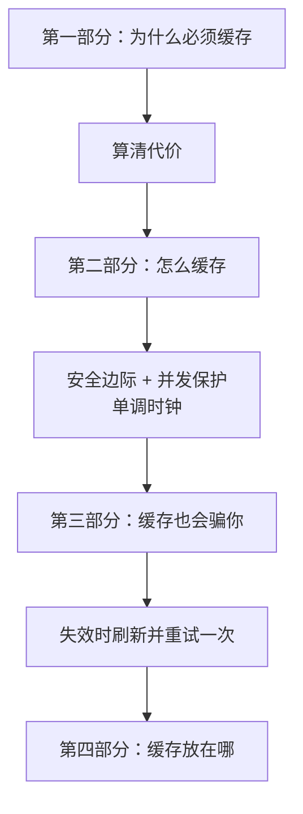

---

# 第一部分　为什么必须缓存

## 8.1 先算清不缓存的代价

### 8.1.1 官方的两条硬性要求

第 1 章引用过，这里再强调一次：

> 开发者需要**缓存 access_token**，用于后续接口的调用。注意：**不能频繁调用 gettoken 接口，否则会受到频率拦截**。

官方在错误码 `45009`（接口调用超过限制）的排查说明里还补了一句更明确的：

> 获取 `access_token` 与获取 `jsapi_ticket` **务必在服务端发起请求，并在服务端做好缓存**，获取之后可以使用 2 小时。

**这不是优化建议，是接口的使用要求。**

### 8.1.2 算一算实际会取多少次

假设一个很普通的场景：**每天给 20 个负责人各发一条待办提醒**。

| 做法 | 取凭证次数 |
|---|---|
| 不缓存，一人一条 | **20 次** |
| 不缓存，还带一张图（上传+发送） | **40 次** |
| 缓存 | **1 次** |

再看第 7 章的 `send_image`——**实测确认了这个问题真实存在**：

```text
上传 1 次，发送 1 次，取凭证 1 次
（第 7 章的做法：这里会取 2 次凭证）
```

### 8.1.3 后果不是“慢”，而是“全都发不出去”

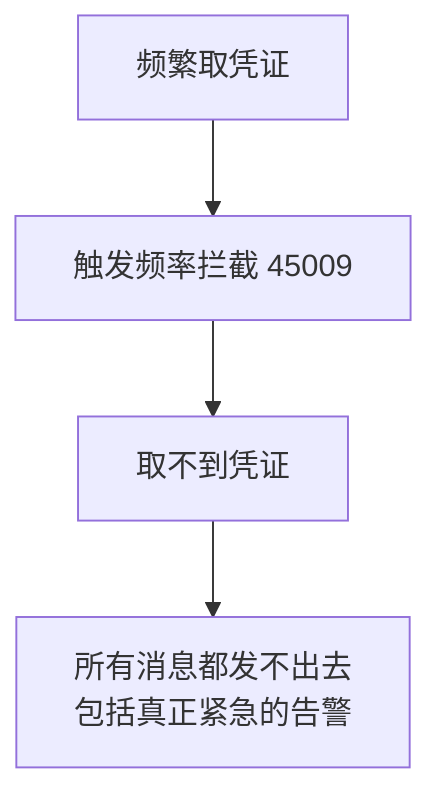

**注意最后一格。**限流不区分“这条是测试、那条是紧急告警”，一旦被拦，全都停摆。而且官方说明频率拦截的时长与限制周期相当（分钟级限制就拦一分钟，小时级就拦一小时）。

### 8.1.4 还有一个更狠的：IP 被禁一小时

第 3 章 3.1.5 节提过，这里再放一次，因为它和本章直接相关：

> 获取 `access_token` 时，如果**应用的 secret 错误多次**，会导致**同一个 IP 被禁用一小时**。

把这两件事合起来看，就得到一条重要结论：

> **每一次“取凭证”都是有代价的操作。**能不取就不取；必须取的时候，要确保参数是对的。

这也解释了本章为什么要设计得这么小心——不是过度工程，而是这个接口本身就“贵”。

---

## 8.2 凭证的有效期与 `expires_in`

### 8.2.1 四条必须知道的官方说明

| 说明 | 对代码的影响 |
|---|---|
| 有效期通过返回的 `expires_in` 传达，**正常情况下为 7200 秒** | **不要把 7200 写死**，要读接口返回值 |
| **每个应用的凭证彼此独立** | 缓存要**按应用区分**，不能混用 |
| 凭证最长 512 字节，存储时至少预留这么多 | 数据库存储时字段要够长 |
| **企业微信可能提前使凭证失效** | 必须有“失效后重新获取”的兜底逻辑（8.5 节） |

### 8.2.2 为什么不能写死 7200

```python
self._expire_at = time.monotonic() + 7200          # 不好
self._expire_at = time.monotonic() + expires_in    # 好
```

原因很直接：`expires_in` 是**接口告诉你的**，官方措辞是“正常情况下为 7200 秒”——这意味着它**可能不是** 7200。写死就等于假设官方永远不变，而这个假设没有依据。

代码里的处理方式是：**用返回值，只在返回值缺失时才用默认值兜底。**

```python
# expires_in 用接口返回的值，不要写死 7200（官方就是这么建议的）
if not expires_in or expires_in <= 0:
    expires_in = DEFAULT_EXPIRES_IN_SECONDS
```

### 8.2.3 “每个应用独立”意味着什么

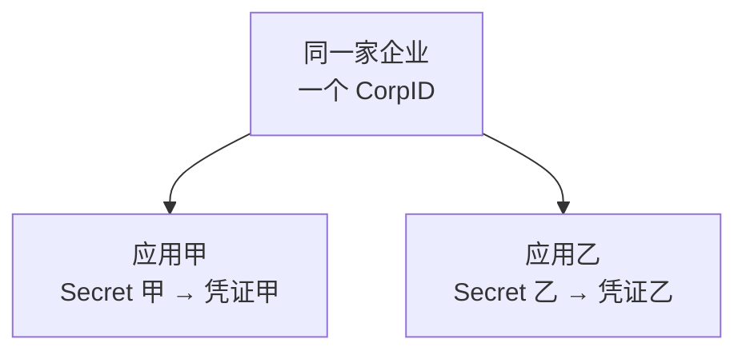

**凭证甲不能用来调用应用乙的接口。**（这就是第 3 章 `301002` 那个错误的另一面。）

所以缓存必须按应用隔离。本章的做法是把缓存放进 `WeComClient`，而客户端本来就是“一个应用一个”。8.8 节会给出两个应用共存时的处理。

---

# 第二部分　怎么缓存

## 8.3 最简单的内存缓存

### 8.3.1 缓存要记住两件事

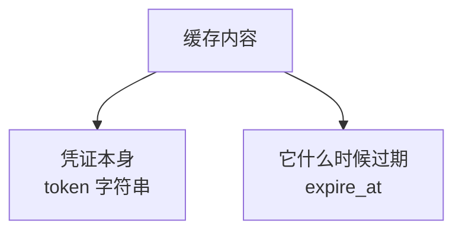

然后取值时判断：

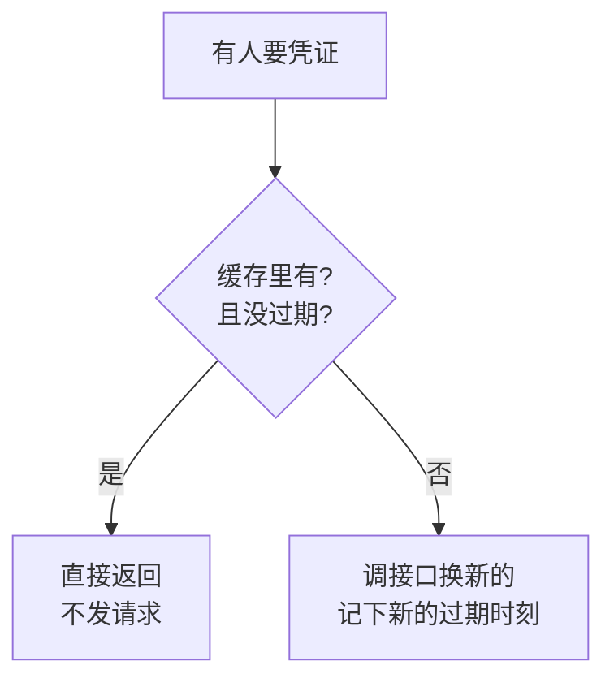

### 8.3.2 单独建一个 `token_cache.py`

```python
"""
凭证缓存模块。

第 8 章新增的文件。

为什么单独一个文件？
    缓存这件事有自己的一套规则（过期判断、安全边际、并发保护），
    和"怎么调接口"是两回事。分开之后：
        - wecom_client 只管"没缓存时去换一个新的"
        - token_cache 只管"什么时候该用缓存、什么时候该换新的"
    以后要把缓存换成文件或 Redis（见 8.9 节），只改这一个文件。
"""
```

### 8.3.3 关键设计：用 `monotonic` 而不是 `time`

这是本章技术含量最高的一处，值得单独讲。

```python
    @staticmethod
    def _now() -> float:
        """
        取当前时刻，用于计算过期。

        注意用的是 time.monotonic() 而不是 time.time()：
            time.time()      返回系统时钟，【可能被调整】。
                             服务器和时间服务器同步、运维手工改时间、
                             夏令时切换，都会让它突然前跳或后退。
                             一旦时钟往后退，我们会误判"凭证还没过期"，
                             继续用一个已经失效的凭证。
            time.monotonic() 是单调递增的，只用来测量"过了多久"，
                             不受系统时钟调整影响。

        规则：判断"过了多久"用 monotonic，显示"几点几分"用 time。
        """
        return time.monotonic()
```

**两者的实际差别（实测）：**

```text
time.time()      = 1788514346.52   ← 系统时钟，可能被调整
time.monotonic() = 7226.85         ← 单调递增，只能用于测量间隔
```

`monotonic` 的值看起来毫无意义（它是从某个任意起点开始计的秒数），**但这正是重点**：它不代表“几点”，只能用来算“过了多久”，而且**保证不会倒退**。

为什么倒退很危险？

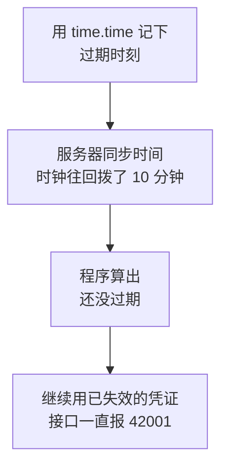

这类问题的排查难度极高——**你的代码看起来完全正确，只是在某个特定时刻突然不对了**。

> **通用规则：凡是判断“过了多久”“有没有超时”“是否过期”，一律用 `time.monotonic()`。只有需要显示或存储“几点几分”时才用 `time.time()`。**

### 8.3.4 为什么要加锁

```python
        # 为什么要加锁？
        #   第 9 章会用定时任务，可能出现两个任务【同时】发现"凭证过期了"，
        #   于是同时去调接口取凭证。轻则浪费调用次数，重则触发频率拦截。
        #   加锁后，同一时刻只有一个线程能进入"检查并取凭证"这段代码。
        self._lock = threading.Lock()
```

这是**为第 9 章提前做的准备**。定时任务框架会用多个线程执行任务，如果两个任务同时启动：

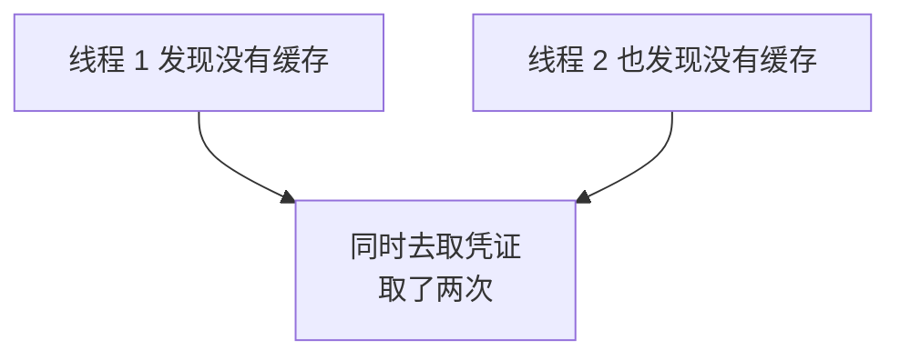

加锁之后，第二个线程会等第一个取完，然后**直接命中缓存**。

**实测 10 个线程并发：**

```text
10 个线程取凭证，实际请求接口 1 次（应为 1）
拿到的凭证是否全部相同: True -> {'TOKEN001'}
统计： 取凭证 1 次，命中缓存 9 次（共 10 次请求凭证），被迫刷新 0 次
```

**10 个线程只取了 1 次凭证**，另外 9 次命中缓存。如果不加锁，很可能取 2 次甚至更多。

### 8.3.5 取值方法

```python
    def get(self, fetcher) -> str:
        """
        取一个可用的凭证。

        参数:
            fetcher: 一个函数，调用它会真的去请求接口换新凭证，
                     返回 (token, expires_in)。
                     把"怎么取"交给调用方，缓存就不需要知道
                     CorpID、Secret 这些细节。

        返回:
            可用的 access_token
        """
        # with self._lock 表示进入这段代码前先拿锁，离开时自动释放
        with self._lock:
            if self._is_valid():
                self.stats.hit_count += 1
                return self._token

            return self._fetch_and_store(fetcher)
```

### 8.3.6 “把 `fetcher` 传进来”这个设计

注意 `get()` 收的是一个**函数**，而不是 `CorpID` 和 `Secret`。

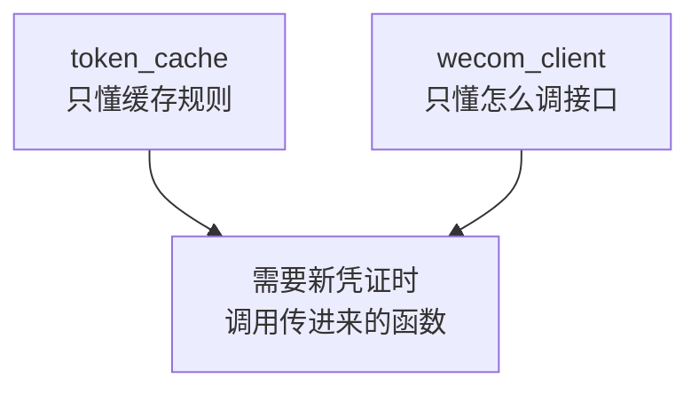

这样分工的好处：

| | 如果缓存自己去调接口 | 现在的做法 |
|---|---|---|
| 缓存要知道 `CorpID`/`Secret` 吗 | **要** | 不用 |
| 缓存要 `import requests` 吗 | **要** | 不用 |
| 想单独测试缓存逻辑 | 得起个假服务器 | **传个假函数就行** |

第三条在我测试时真实发挥了作用——测试安全边际、过期判断这些纯逻辑时，我传的是一个只返回假字符串的函数，**完全不需要网络**。

### 8.3.7 加上统计，用来证明缓存生效了

```python
@dataclass
class TokenStats:
    """
    缓存的使用统计，用来验证"缓存到底有没有生效"。

    这不是业务需要，是【可观测性】需要：
    没有这几个数字，你无法证明缓存起作用了。
    """

    fetch_count: int = 0        # 真正调用接口取凭证的次数
    hit_count: int = 0          # 命中缓存的次数
    refresh_count: int = 0      # 因失效被迫刷新的次数
```

**实测连发 5 条消息：**

```text
发送 5 条消息 -> 取凭证 1 次，发送 5 次
统计： 取凭证 1 次，命中缓存 4 次（共 5 次请求凭证），被迫刷新 0 次
5 次发送用的凭证: ['TOKEN001', 'TOKEN001', 'TOKEN001', 'TOKEN001', 'TOKEN001']
```

5 次发送用的是**同一个凭证**，接口只被调用了 1 次。

**再看 `send_image`（第 7 章那个两次取凭证的问题）：**

```text
上传 1 次，发送 1 次，取凭证 1 次
统计： 取凭证 1 次，命中缓存 1 次（共 2 次请求凭证），被迫刷新 0 次
```

问题解决了。

> **经验：任何“优化”都要有办法证明它生效了。**否则你只是相信自己写对了。这几个计数器加起来不到 10 行，却让“缓存有没有用”从猜测变成事实。

---

## 8.4 提前几分钟刷新，避免临界点失效

### 8.4.1 卡在最后一秒的问题

假设凭证还剩 2 秒有效期，缓存判断“还没过期”，于是拿去用：

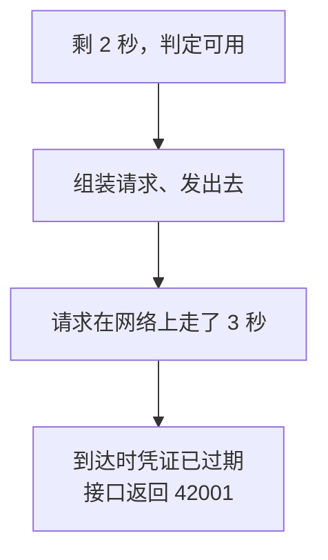

**这个失败是完全可以避免的。**办法就是留一段安全边际：**剩余时间不足 5 分钟，就当作已经过期。**

### 8.4.2 实现

```python
# 提前多少秒就认为凭证"快过期了"。
# 为什么要留这个余量？见本章 8.4 节：
#   如果卡在最后一秒去用，请求在路上凭证就过期了。
TOKEN_SAFETY_MARGIN_SECONDS = 300      # 5 分钟
```

```python
    def _is_valid(self) -> bool:
        """
        缓存是否还能用。

        注意这里减去了安全边际：
            剩余时间不足 5 分钟，就当作已经过期。
        """
        if not self._token:
            return False

        return self._now() < (self._expire_at - self._safety_margin)
```

### 8.4.3 实测四种有效期

```text
expires_in= 7200 -> 扣除 300 秒边际后可用   6900 秒；再取一次是否命中缓存：是
expires_in=  400 -> 扣除 300 秒边际后可用    100 秒；再取一次是否命中缓存：是
expires_in=  300 -> 扣除 300 秒边际后可用      0 秒；再取一次是否命中缓存：否（立即重新获取）
expires_in=  299 -> 扣除 300 秒边际后可用      0 秒；再取一次是否命中缓存：否（立即重新获取）
```

最后两行是边界情况：**接口给的有效期本身就不足 5 分钟时，缓存等于不起作用**，每次都会重新获取。这是正确行为——凭证确实快没用了。

### 8.4.4 缓存命中与过期的实测

用 1 秒有效期、边际设为 0 来快速验证：

```text
连续两次取值：TOK1 / TOK1   是否同一个：True
统计： 取凭证 1 次，命中缓存 1 次

等待 1.1 秒后取值：TOK2   是否换了新的：True
统计： 取凭证 2 次，命中缓存 1 次
```

过期前复用、过期后换新，行为正确。

### 8.4.5 5 分钟这个值怎么定

| 边际太小（如 5 秒） | 边际太大（如 30 分钟） |
|---|---|
| 仍可能卡在临界点 | 凭证只用了 75% 的寿命就丢掉 |
| | 取凭证次数变多，违背缓存初衷 |

**5 分钟是个稳妥的折中**：相对 7200 秒的有效期只浪费约 4%，同时给网络延迟、时钟微小偏差留足了余量。

### 8.4.6 但安全边际解决不了所有问题

请注意：**安全边际只能防“正常到期”，防不了“提前失效”。**因为提前失效不遵守 `expires_in`——这是下一节的主题。

---

# 第三部分　缓存也会骗你

## 8.5 企业微信提前使凭证失效怎么办

### 8.5.1 官方的这句话必须认真对待

> 企业微信可能出于运营需要，**提前使 access_token 失效**，开发者应实现 `access_token` 失效时**重新获取**的逻辑。

翻译成人话：**你的缓存里那个凭证，可能在你以为它还有 6900 秒可用的时候，就已经废了。**

### 8.5.2 两种失效的对比

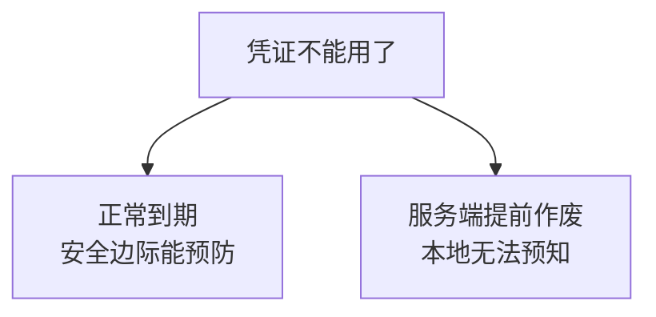

| | 正常到期 | 提前失效 |
|---|---|---|
| 本地能预测吗 | **能**，看 `expires_in` | **完全不能** |
| 靠什么应对 | 安全边际 | **只能事后应对** |
| 表现 | 无 | 接口突然返回 `42001` 或 `40014` |

### 8.5.3 所以缓存必须配一条兜底路径

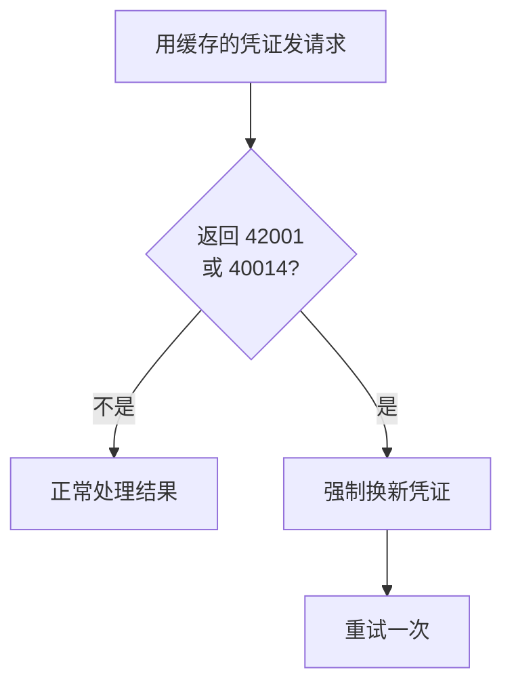

**“按时间判断”是主路径，“失效后刷新重试”是兜底路径。两条都得有。**

---

## 8.6 失效后刷新并重试一次

### 8.6.1 两个要重试的错误码

```python
# 这两个错误码意味着"手上这个凭证不能用了"，
# 处理办法是【换一个新的再试一次】。
#   40014 不合法的 access_token
#   42001 access_token 已过期
TOKEN_INVALID_ERRCODES = (40014, 42001)

# 凭证失效后最多重试几次。
# 为什么是 1 而不是 3？见本章 8.7 节。
MAX_TOKEN_RETRY = 1
```

### 8.6.2 统一的重试包装

```python
    def _call_with_token_retry(self, request_func, error_factory):
        """
        带凭证的接口调用，遇到"凭证失效"时刷新一次再试。

        参数:
            request_func:  接受 access_token、执行一次请求、返回响应字典
            error_factory: 收到业务错误时用它造异常（发消息和上传的异常类型不同）

        为什么要这样包一层？
            官方明确说明：企业微信【可能出于运营需要提前使 access_token 失效】。
            所以"按时间算还没过期"不等于"真的还能用"。
            必须有一条兜底路径：用着失效了 -> 换新的 -> 再试一次。
        """
        # attempt = 0 是首次调用，1 是刷新后的那次重试
        for attempt in range(MAX_TOKEN_RETRY + 1):
            if attempt == 0:
                token = self.get_access_token()
            else:
                # 这一步很关键：不是"再取一次缓存"，而是【强制换新的】。
                # 如果只是重新 get()，拿到的还是那个已失效的凭证，
                # 于是重试必然再失败一次，白跑。
                print("[凭证] 服务端提示凭证失效，正在强制刷新后重试一次")
                token = self._token_cache.force_refresh(self._fetch_new_token)

            data = request_func(token)
            errcode = data.get("errcode")

            if errcode == 0:
                return data

            # 只有"凭证类"错误才值得重试。
            # 参数写错、接收人不存在这类问题，重试一万次也一样（第 5 章 5.5.5）。
            if errcode in TOKEN_INVALID_ERRCODES and attempt < MAX_TOKEN_RETRY:
                # 先把缓存作废，避免别处继续拿这个坏凭证
                self._token_cache.invalidate()
                continue

            raise error_factory(errcode or -1, str(data.get("errmsg")))

        # 理论上走不到这里，写上是为了让函数的返回路径完整
        raise error_factory(-1, "重试后仍然失败")
```

### 8.6.3 最容易写错的一行：必须 `force_refresh` 而不是 `get`

这是本章最关键的一个细节。

```python
token = self._token_cache.force_refresh(...)   # 正确
token = self.get_access_token()                # 错误！
```

为什么？因为 `get()` 会**先检查缓存**。而此刻缓存里那个凭证，从时间上看**完全没过期**（还剩 6900 秒），所以 `get()` 会开心地把那个**已经失效的凭证**再给你一次。

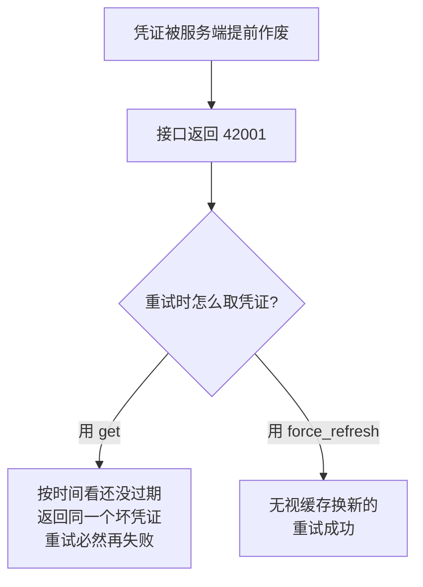

**实测 42001 场景：**

```text
[凭证] 已获取新的 access_token：TOKEN0...（有效期 7200 秒）
--- 此时已取凭证 1 次 ---
[凭证] 服务端提示凭证失效，正在强制刷新后重试一次
[凭证] 已获取新的 access_token：TOKEN0...（有效期 7200 秒）
结果：发送成功，msgid=MSG-3
取凭证 2 次，发送请求 3 次
三次发送用的凭证: ['TOKEN001', 'TOKEN001', 'TOKEN002']
统计： 取凭证 2 次，命中缓存 1 次（共 3 次请求凭证），被迫刷新 1 次
```

看那三个凭证：前两次用 `TOKEN001`（第二次失败了），**重试时换成了 `TOKEN002`**，然后成功。这就是 `force_refresh` 生效的证据。

`40014` 的处理完全一样：

```text
结果：成功，msgid=MSG-2；取凭证 2 次，发送 2 次
```

### 8.6.4 顺手把缓存作废

```python
# 先把缓存作废，避免别处继续拿这个坏凭证
self._token_cache.invalidate()
```

为什么除了 `force_refresh` 还要 `invalidate`？因为在多线程场景下（第 9 章），可能还有别的任务正准备从缓存里取那个坏凭证。**先作废，能防止它们踩同一个坑。**

### 8.6.5 上传素材也走同一条路

第 7 章的 `upload_media` 原来是自己判断 `errcode` 的，现在改成走统一包装：

```python
        # 上传同样要处理凭证失效，所以走统一的重试包装
        data = self._call_with_token_retry(
            lambda token: self._post_upload(token, file_path, file_name,
                                            media_type),
            error_factory=lambda code, msg: MediaUploadError(
                f"上传素材失败：errcode={code}, errmsg={msg}"
            ),
        )
```

`error_factory` 这个参数是为了这个目的存在的：**发消息失败要抛 `SendMessageError`，上传失败要抛 `MediaUploadError`**，重试逻辑却是同一套。

**实测上传遇到凭证失效：**

```text
[上传素材] test.png（308 字节，类型 image）
[凭证] 服务端提示凭证失效，正在强制刷新后重试一次
[上传素材] 成功，media_id=MEDIA-XYZ-12...（3 天内有效）
上传请求 2 次，取凭证 2 次
```

---

## 8.7 为什么不能无限重试

### 8.7.1 只重试一次

```python
MAX_TOKEN_RETRY = 1
```

**实测连续失效三次的情况：**

```text
[凭证] 服务端提示凭证失效，正在强制刷新后重试一次
抛出 SendMessageError: 发送失败：errcode=42001, errmsg=mock error 42001
取凭证 2 次，发送请求 2 次（应为 2 次，不会无限重试）
```

刷新一次、重试一次，还是失败就**如实报错**，不再纠缠。

### 8.7.2 三个理由

**理由一：换了新凭证还是报“凭证无效”，说明问题不在凭证。**

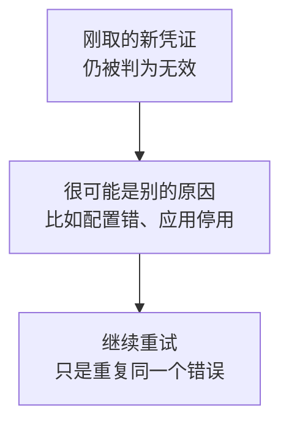

**理由二：每次重试都要取一次凭证，而取凭证本身有频率限制。**

无限重试会变成这样：

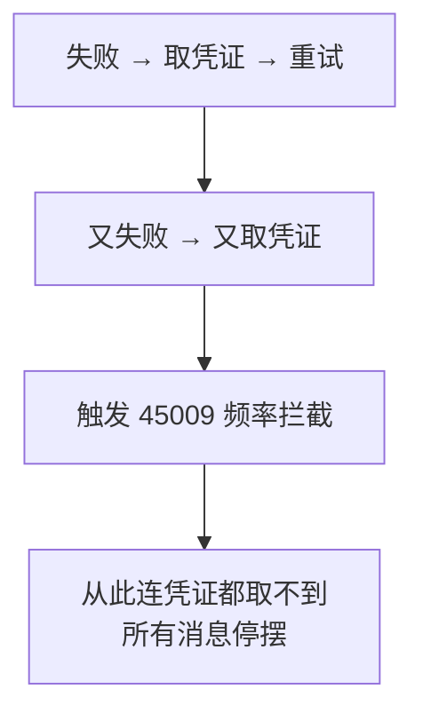

**重试本来是为了提高成功率，结果把整个应用搞停了。**这是重试逻辑最经典的反模式。

**理由三：`Secret` 错误多次会导致 IP 被禁一小时。**

万一失效的真正原因是配置问题，无限重试就是在**不停地用错误参数去撞那个禁用规则**。

### 8.7.3 一条通用原则

> **重试的次数上限，要按“失败原因还有多大可能自愈”来定，而不是按“我希望它成功”来定。**

凭证失效这件事，换一次新凭证就该解决。**换了还不行，多换十次也不行。**

第 13 章会展开完整的重试策略（指数退避、哪些错误码可重试），本章只处理凭证这一种情况。

### 8.7.4 非凭证类错误一律不重试

**实测三种业务错误：**

```text
81013（全部接收人非法）-> 立即失败，发送请求 1 次（应为 1）
301002（无权限操作应用）-> 立即失败，发送请求 1 次（应为 1）
44004（正文为空）      -> 立即失败，发送请求 1 次（应为 1）
```

这三个错误重试一万次结果都一样，所以**一次都不重试**。这正是第 5 章把异常分类的价值兑现。

---

# 第四部分　缓存放在哪

## 8.8 单进程与多进程的区别

### 8.8.1 内存缓存的边界

```python
class TokenCache:
    """
    单进程内存缓存。

    重要限制（见 8.8 节）：
        这个缓存活在【当前进程的内存里】。
        程序一退出就没了；开两个进程就是两份独立的缓存。
    """
```

两个必须知道的限制：

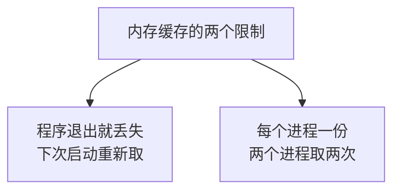

### 8.8.2 这对本教程有什么影响

关键要看程序**怎么运行**：

| 运行方式 | 缓存效果 | 出现章节 |
|---|---|---|
| 手工运行一次脚本 | **几乎无效**（一次就退出了） | 第 3～8 章 |
| 常驻的定时任务进程 | **完全有效** | **第 9 章** |
| 系统计划任务每次启新进程 | **无效**（每次都重新取） | 第 16 章 |

**注意第一行和第三行。**你现在手工运行 `python main.py`，程序发完就退出，内存缓存并没有帮上多少忙——**但发一张图从 2 次凭证降到 1 次，这个收益是实打实的**（8.3.7 节的实测）。

真正的收益在第 9 章：程序常驻不退出，一个凭证能用两小时，几百条消息只取一次凭证。

### 8.8.3 一个应用一个缓存，同一应用共用缓存

因为“每个应用的凭证彼此独立”，所以缓存的归属很重要。客户端允许从外面传入缓存正是为此：

```python
                 token_cache: TokenCache = None) -> None:
        """
        参数:
            config:         已校验过的配置
            timeout:        普通接口超时秒数
            upload_timeout: 上传文件超时秒数
            token_cache:    凭证缓存。不传就自己建一个。

        为什么允许从外面传入缓存？
            因为"每个应用的凭证彼此独立"（官方明确说明）。
            如果你有两个自建应用，就该用两个客户端 + 两个缓存；
            而如果同一个应用被多处使用，则应该【共用一个缓存】，
            否则缓存就白做了。传参让调用方自己决定。
        """
```

**实测两种情形：**

```text
两个客户端各自取凭证，共请求 2 次（应为 2，因为缓存不共享）
两个客户端共用一个缓存，共请求 1 次（应为 1）
```

对应的用法：

```python
# 场景一：两个不同的应用，各自独立的凭证
client_alarm = WeComClient(config_alarm)      # 各自建缓存
client_todo = WeComClient(config_todo)

# 场景二：同一个应用，多处使用，共用缓存
shared = TokenCache()
client_a = WeComClient(config, token_cache=shared)
client_b = WeComClient(config, token_cache=shared)
```

**用错的后果**：场景二如果不共用缓存，就等于每处都自己取一次凭证——缓存白做了。

---

## 8.9 文件缓存、数据库缓存和 Redis 缓存

### 8.9.1 什么时候内存缓存不够用

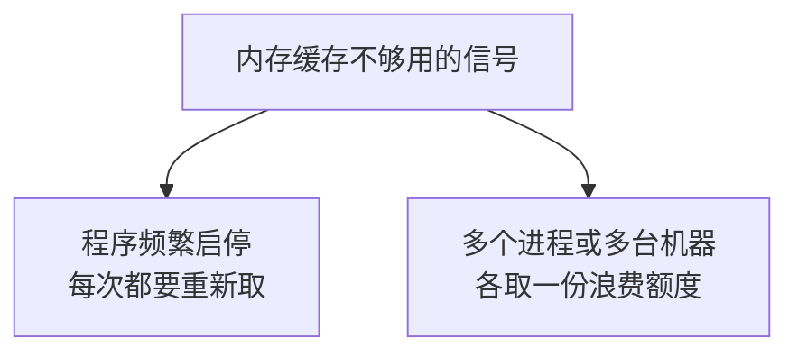

### 8.9.2 四种方案对照

| 方案 | 跨进程 | 跨重启 | 复杂度 | 适合 |
|---|---|---|---|---|
| **内存** | 否 | 否 | 极低 | **常驻的单进程程序（本教程）** |
| 文件 | 是（同机） | **是** | 低 | 计划任务、每次启新进程 |
| 数据库 | 是 | 是 | 中 | 已经有数据库，且要审计 |
| Redis | 是 | 是 | 中高 | 多台机器、并发高 |

### 8.9.3 文件缓存要注意什么

如果你的程序是被系统计划任务反复启动的（第 16 章会讨论），文件缓存是最实用的升级：

| 注意点 | 说明 |
|---|---|
| **文件权限** | 凭证等同于密码，文件不能让其他用户读到 |
| **并发写** | 两个进程同时写同一个文件会互相覆盖，需要文件锁 |
| **不要提交 Git** | 和 `.env` 一样，写进 `.gitignore` |
| **过期时刻怎么存** | 内存里用 `monotonic`，**存文件必须用 `time.time()`**——因为 `monotonic` 的起点每次启动都变，存下来毫无意义 |

最后一条是个真实的坑：**跨进程存储只能用绝对时间**，那就得接受时钟被调整的风险。折中办法是存绝对时间，但把安全边际放大一些。

### 8.9.4 数据库缓存的额外价值

如果你已经在用 SQL Server（第 10 章会接进来），把凭证存表里有一个额外好处：**能看到历史**——什么时候取的、取了多少次、有没有异常频繁。这对排查“为什么被限流”很有用。

但要记住第 2 章的安全规则：**凭证是敏感信息**，存表也要控制访问权限，不要放在人人可查的表里。

### 8.9.5 本教程不上 Redis

Redis 是这个问题的“标准答案”，但本教程不引入，原因是：

- 需要额外部署一个服务；
- 本教程的目标形态是**单个常驻进程 + SQL Server**，内存缓存已经完全够用；
- 引入它会让第 16 章的部署复杂度翻倍。

**技术选型要匹配实际规模。**一个每天发几百条消息的通知程序，不需要为“万一以后要扩展到十台机器”提前付出代价。

---

## 8.10 本教程最终采用的方案

### 8.10.1 方案总结

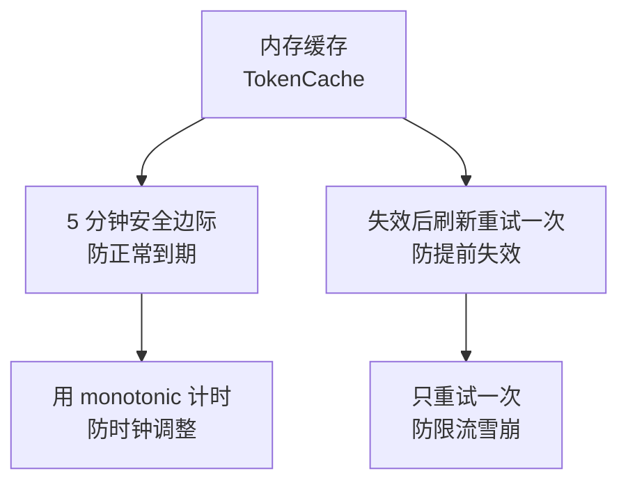

### 8.10.2 为什么这个组合够用

| 要防的问题 | 用什么防 | 是否够 |
|---|---|---|
| 频繁取凭证被限流 | 内存缓存 | 够 |
| 临界点失效 | 5 分钟安全边际 | 够 |
| 服务端提前作废 | 失效后刷新重试 | 够 |
| 系统时钟被调整 | `monotonic` | 够 |
| 并发重复取凭证 | 线程锁 | 够 |
| 程序重启丢缓存 | 不处理 | **可接受**（常驻进程重启不频繁）|
| 多机部署 | 不处理 | **不在本教程范围** |

后两行是**有意识地不解决**——这和“没想到”是两回事。**知道自己的方案边界在哪，比方案本身更重要。**

### 8.10.3 演练模式不消耗凭证

一个容易忽略的细节：演练模式的返回点在**取凭证之前**。

```python
        # 演练模式在这里就返回。
        # 注意它【在取凭证之前】：演练不该消耗一次凭证获取，
        # 更不该因为"取凭证失败"而报错 —— 演练本来就不联网。
        if self._config.dry_run:
            self._print_dry_run(payload, users, parties, tags)
            return SendResult(dry_run=True)
```

**实测：**

```text
[演练模式] 以下 text 消息【没有】真的发送：
[演练模式] 将上传并发送图片：test.png
取凭证 0 次（应为 0）
```

这让演练模式变得**完全离线可用**——第 9 章验证定时任务的触发时间时，你可以让它跑一整天，不产生任何网络请求。

### 8.10.4 排查用的两个方法

```python
    @property
    def token_stats(self):
        """暴露缓存统计，便于验证缓存是否生效。"""
        return self._token_cache.stats

    def describe_token_cache(self) -> str:
        """返回缓存状态的可读描述（凭证已打码）。"""
        return self._token_cache.describe()
```

**实测输出：**

```text
缓存：TOKEN0...，还可用 6900 秒
```

注意**只显示前 6 位**——从第 3 章一直坚持到现在的规则。第 14 章会把这个状态写进日志，遇到限流问题时它是第一手线索。

---

## 8.11 本章改动清单

### 新增文件 `token_cache.py`

| 内容 | 说明 |
|---|---|
| `TOKEN_SAFETY_MARGIN_SECONDS` | 5 分钟安全边际 |
| `DEFAULT_EXPIRES_IN_SECONDS` | 7200 兜底值 |
| `TokenStats` | 三个计数器 + `summary()` |
| `TokenCache.get()` | 优先用缓存 |
| `TokenCache.force_refresh()` | 无视缓存换新的 |
| `TokenCache.invalidate()` | 作废缓存 |
| `_now()` | **用 `monotonic`** |
| `_is_valid()` | 扣除安全边际判断 |
| `remaining_seconds()` / `describe()` | 排查用 |
| `threading.Lock` | 并发保护 |

### `wecom_client.py`

| 改动 | 说明 |
|---|---|
| 新增 `TOKEN_INVALID_ERRCODES` | `(40014, 42001)` |
| 新增 `MAX_TOKEN_RETRY = 1` | 只重试一次 |
| `__init__` 增加 `token_cache` 参数 | 允许共用缓存 |
| `get_access_token()` **改为走缓存** | 主要变化 |
| 新增 `_fetch_new_token()` | 只负责取，不判断该不该取 |
| **新增 `_call_with_token_retry()`** | 统一的失效重试包装 |
| `send()` 改用重试包装 | 不再自己判断 `errcode` |
| `upload_media()` 改用重试包装 | 同上 |
| 新增 `_post_upload()` | 从 `upload_media` 拆出 |
| `_post_message()` **不再判断 `errcode`** | 交给重试包装 |
| `_parse_result()` **不再判断 `errcode`** | 同上 |
| 新增 `token_stats` / `describe_token_cache()` | 排查用 |

### `config.py` 与 `message_builder.py`

本章无改动。

---

## 8.12 本章完成标志

- [ ] 连发 3 条消息，日志里 `[凭证] 已获取新的 access_token` **只出现一次**
- [ ] `send_image` 一次调用，凭证也**只取一次**
- [ ] 打印缓存状态，显示“还可用 6900 秒”左右，且**凭证是打码的**
- [ ] 演练模式下运行，**完全没有取凭证的日志**
- [ ] 统计信息显示“命中缓存 N 次”，N 大于 0

### 本章完成标志

> 连续发送多条消息，`[凭证]` 日志只出现一次，且统计显示命中了缓存。

> **进阶验证（可选）**：把 `TOKEN_SAFETY_MARGIN_SECONDS` 临时改成 `7200`，让安全边际**等于**有效期，这样凭证一取到就“剩余 0 秒可用”，于是每次发送都会重新取。改完发两条消息，确认 `[凭证]` 日志出现两次——这能证明安全边际真的在起作用。**验证完记得改回 300。**
>
> 注意边际必须 **大于等于** `expires_in` 才会次次重取。我最初想写 `7100`，实测发现那样还剩 100 秒可用，缓存照样命中：
>
> ```text
> margin=  300 -> 实际取凭证 1 次，剩余可用 6900 秒，拿到 ['TOK1', 'TOK1', 'TOK1']
> margin= 7100 -> 实际取凭证 1 次，剩余可用  100 秒，拿到 ['TOK1', 'TOK1', 'TOK1']
> margin= 7200 -> 实际取凭证 3 次，剩余可用    0 秒，拿到 ['TOK1', 'TOK2', 'TOK3']
> ```
>
> 这也顺便说明了一件事：**“我以为会重新取”和“真的重新取了”是两回事，得有计数器才能分清。**这正是 8.3.7 节加统计的意义。

---

## 8.13 本章小结

### 8.13.1 本章必须带走的 8 条结论

1. **缓存凭证是官方要求**，不是优化选项；频繁获取会被限流。
2. **不要写死 7200**，用接口返回的 `expires_in`。
3. **每个应用的凭证独立**，缓存要按应用隔离。
4. **判断过期用 `time.monotonic()`**，因为系统时钟可能被调回。
5. **留 5 分钟安全边际**，防止卡在临界点失效。
6. **官方可能提前作废凭证**，所以必须有“失效后刷新重试”的兜底。
7. **重试时必须 `force_refresh`，不能 `get`**——否则拿到的还是那个坏凭证。
8. **只重试一次**，无限重试会触发限流，把整个应用搞停。

### 8.13.2 自测题

1. 为什么不能把有效期写成 `7200` 这个常量？（8.2.2）
2. `time.time()` 和 `time.monotonic()` 该在什么场合各自使用？（8.3.3）
3. 为什么 10 个线程同时要凭证，只该取一次？靠什么保证？（8.3.4）
4. 凭证还剩 2 秒时拿去发消息，可能出什么问题？（8.4.1）
5. 重试时如果用 `get()` 而不是 `force_refresh()`，会发生什么？（8.6.3）
6. 无限重试凭证失效，最坏的后果是什么？（8.7.2）
7. 程序被系统计划任务反复启动时，内存缓存还有用吗？该换成什么？（8.8.2、8.9.3）
8. 演练模式为什么要在取凭证之前返回？（8.10.3）

### 8.13.3 到这里，客户端已经完整了

回顾一下这个客户端现在具备的能力：

| 能力 | 章节 |
|---|---|
| 取凭证、发消息、三层检查 | 第 3 章 |
| 配置集中、异常分类 | 第 5 章 |
| 多人/部门/标签 + 四道护栏 | 第 6 章 |
| 五种消息类型 + 上传素材 | 第 7 章 |
| 凭证缓存 + 失效重试 | **第 8 章** |

**从第 9 章开始，重点从“怎么发”转向“什么时候发、发什么内容”。**客户端本身基本不再改动了。

### 8.13.4 下一章预告

第 9 章加入**定时发送**：用 APScheduler 让程序按时自动执行。

那一章会遇到几个新问题：

| 问题 | 为什么棘手 |
|---|---|
| 时区 | 服务器时间可能不是北京时间 |
| 任务重叠 | 上一次还没跑完，下一次又开始了 |
| 避开整点 | **官方建议避开每小时 0 分和 30 分**，那时资源挤占严重 |
| 程序重启 | 内存里的任务安排全没了 |

而本章的两项工作会在第 9 章立刻发挥作用：**常驻进程让缓存真正生效**，**线程锁应对并发的任务**。

---

## 参考的官方文档

1. [企业微信开发者中心：获取 access_token](https://developer.work.weixin.qq.com/document/path/91039) —— 必须缓存、不能频繁调用、`expires_in`、每个应用独立、512 字节存储、**可能提前失效**
2. [企业微信开发者中心：全局错误码](https://developer.work.weixin.qq.com/document/path/90313) —— `40014`、`42001`、`45009`（含“服务端做好缓存”“secret 错误多次导致 IP 被禁一小时”的排查说明）
3. [企业微信开发者中心：发送应用消息](https://developer.work.weixin.qq.com/document/path/90236) —— 频率限制
4. [企业微信开发者中心：上传临时素材](https://developer.work.weixin.qq.com/document/path/90253)

> 本章代码在 Python 环境中配合本地模拟服务器实际运行验证，共 15 组测试，文中所有标注“实测”的输出均为真实运行结果。企业微信接口规则依据上述官方文档整理并重新表述（内容已为遵守许可限制而改写），请以最新官方文档为准。
