# 第 9 章　定时发送消息

> 所属教程：《Python 调用企业微信应用消息 API：从入门到定时、数据库与防重复发送》  
> 前置章节：第 8 章（凭证缓存）  
> 本章目标：让程序**按时自动发送**，而不是靠你手工运行。  
> 使用的库：APScheduler（实测版本 3.11.3）

**从本章起，程序开始“无人值守”运行。**这带来一个根本性变化：

> **出错时没有人在看屏幕。**

前八章你手工运行，报错就在眼前。而定时任务在凌晨三点失败时，没人知道。所以本章除了“怎么定时”，还要处理“**任务失败了怎么不悄悄消失**”。

---

## 9.0 本章路线

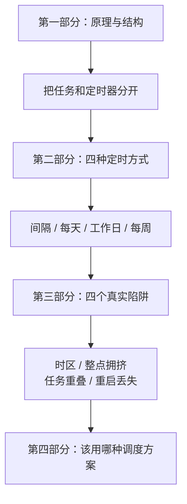

---

# 第一部分　原理与结构

## 9.1 定时任务的本质

### 9.1.1 定时任务只做一件事：到点了叫你

很多新手以为定时任务很神秘。其实它就是一个**不停看表的循环**：

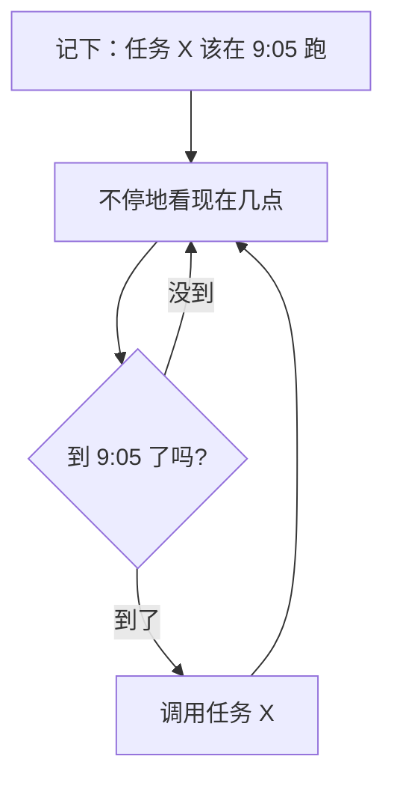

**关键结论：这个“看表的循环”必须一直活着。**

### 9.1.2 所以程序不能退出

这是新手第一个困惑：“我配了每天 9 点发送，为什么没反应？”

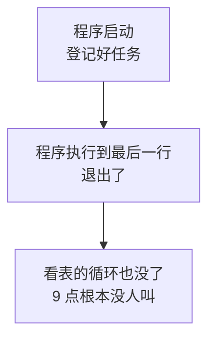

前八章的程序都是“做完一件事就退出”。**定时任务要求程序做完之后继续活着等下一次。**

### 9.1.3 三个角色

| 角色 | 职责 | 本章对应文件 |
|---|---|---|
| **任务** | 被叫到时做什么 | `tasks.py` |
| **触发器** | 什么时候该叫 | `CronTrigger` / `IntervalTrigger` |
| **调度器** | 看表 + 叫人 | `scheduler_setup.py` |

**把这三者分开是本章最重要的结构决策。**理由在下一节。

---

## 9.2 先把“发送一次”封装成任务函数

### 9.2.1 为什么任务要单独放一个文件

```python
"""
任务模块：定义"一次任务要做什么"。

第 9 章新增的文件。

为什么要把任务单独放一个文件？
    定时器只负责"什么时候调用"，任务负责"被调用时做什么"。
    分开之后：
        - 你可以【不启动定时器】直接手工跑一次任务（调试必备）
        - 换调度方式（APScheduler / Windows 计划任务 / cron）不影响任务本身
    第 11 章会把"查 SQL Server"加进任务，第 12 章加"防重复"，
    改的都是这个文件。
"""
```

**第一条理由最实用。**定时任务最折磨人的地方是“要等”——如果只能通过定时器触发，改一行代码就得等到明天早上 9 点才能验证。

所以 `main.py` 提供了两种模式：

```bash
python main.py once       # 立刻跑一次，调试用
python main.py schedule   # 启动定时调度，常驻运行
```

### 9.2.2 最重要的设计：任务函数绝不向外抛异常

```python
def run_notify_task(client: WeComClient, config: WeComConfig) -> bool:
    """
    执行一次通知任务。

    返回:
        True 表示任务顺利完成（含演练），False 表示失败

    【非常重要】这个函数【绝不向外抛异常】。
        原因：定时任务是"无人值守"运行的。
        如果任务抛出异常，虽然 APScheduler 不会因此停止（实测过），
        但异常只会进它的日志，而我们自己什么都不知道。
        所以这里把所有异常都接住，转成一行明确的中文说明 + 返回值。

        换句话说：手工运行时"报错退出"是可以接受的，
                 无人值守时必须"记录下来然后活着"。
    """
```

### 9.2.3 实测：任务抛异常会怎样

先看 APScheduler 的反应：

```text
K. 任务抛异常不会停掉调度器
  任务每次都抛异常，仍被执行了 3 次（调度器没死）
```

**好消息：调度器不会因为任务失败而停止。**坏消息在下一行：

```text
  但注意：异常只进了 APScheduler 的日志，我们自己的代码一无所知
  -> 这就是 tasks.py 必须自己接住所有异常的原因
```

APScheduler 打出的是这样一段东西：

```text
[APScheduler] ERROR Job "broken_job (trigger: interval[...], next run at: ...)" raised an exception
Traceback (most recent call last):
  ...
RuntimeError: 任务内部故意抛错
```

**问题在于：**这段信息在 APScheduler 的日志体系里，而不在你的业务日志里。第 14 章你要统计“今天成功几次、失败几次”时，这些异常**根本进不了你的统计**。

### 9.2.4 所以任务函数接住全部异常

```python
    except UnsafeSendError as error:
        print(f"[任务 {run_id}] 已被安全护栏拦截：{error}")
        return False

    except InvalidRequestError as error:
        print(f"[任务 {run_id}] 参数错误：{error}")
        return False

    except TokenError as error:
        print(f"[任务 {run_id}] 获取凭证失败：{error}")
        return False

    except SendMessageError as error:
        print(f"[任务 {run_id}] 发送失败：errcode={error.errcode}, "
              f"errmsg={error.errmsg}")
        return False
```

最后还有一个**兜底**：

```python
    except Exception as error:
        # 兜底：连我们没预料到的错误也不能让它把任务函数炸穿。
        # 这里打印完整堆栈，因为"没预料到的错误"必须留下足够线索。
        print(f"[任务 {run_id}] 出现未预料的错误（{type(error).__name__}）：{error}")
        traceback.print_exc()
        return False
```

> **注意 `except Exception` 这种写法在平时是不推荐的**（它会掩盖 bug）。但在“无人值守任务的最外层”是**例外**——这里的目标不是让错误显眼，而是**保证任务函数永远有个明确的返回值**，同时把线索完整留下（所以打了完整堆栈）。

### 9.2.5 实测：各种失败都只返回 `False`

```text
errcode=81013（全部接收人非法）-> 返回 False，【没有抛异常】
errcode=44004（正文为空）      -> 返回 False，【没有抛异常】
errcode=301002（无权限操作应用）-> 返回 False，【没有抛异常】
```

网络断开时也一样：

```text
[任务 20260904-094451] 网络请求失败（ConnectionError）
返回 False，【没有抛异常】
```

### 9.2.6 每次运行给一个编号

```python
    # 给每次运行一个编号，方便在一整天的日志里定位某一次执行。
    # 第 14 章会把它换成正式的"任务批次号"。
    run_id = datetime.now().strftime("%Y%m%d-%H%M%S")
```

**实测输出：**

```text
[任务 20260904-094452] 开始执行
[任务 20260904-094452] 接收人：共 2 人：zhangsan, lisi
[任务 20260904-094452] 成功，2 人已受理，msgid=MSG-1，耗时 0.00 秒
```

为什么需要这个编号？因为定时任务的日志是**连续几天几十次执行混在一起**的。没有编号，你无法把“开始执行”和“成功”这两行对应起来——尤其当任务耗时较长、日志交错时。

### 9.2.7 超时在定时任务里格外危险

```python
    except requests.exceptions.Timeout:
        # 定时任务里的超时尤其危险：无人值守，没人去确认到底发出去没有。
        # 所以这里绝不自动重发，只如实记录（第 12 章会用发送记录解决）。
        print(f"[任务 {run_id}] 请求超时。注意：超时不代表消息没发出去，"
              f"本次【不会自动重发】。")
        return False
```

第 4 章 4.5.4 节讲过“超时不代表没发出去”。到了定时任务场景，这个问题变严重了：

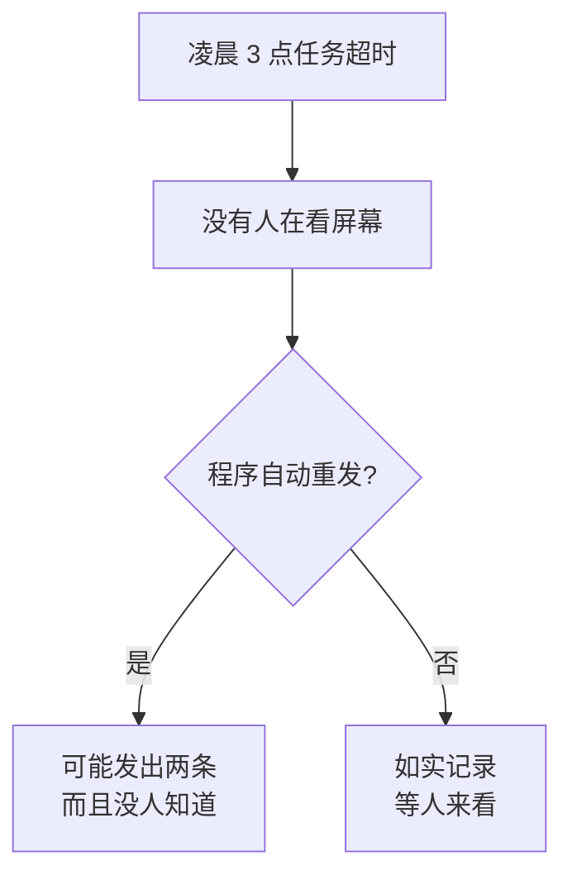

**本章的选择是“不重发，如实记录”。**这不是最终答案——第 12 章会用数据库记录来真正解决它。

---

# 第二部分　四种定时方式

## 9.3 第一个定时任务

### 9.3.1 创建调度器

```python
def create_scheduler() -> BlockingScheduler:
    """
    创建调度器。

    用 BlockingScheduler 而不是 BackgroundScheduler：
        Blocking   —— start() 之后会一直占住当前线程，程序不会退出。
                      适合"这个程序就是个定时任务服务"的场景，也就是本教程。
        Background —— start() 之后立刻返回，任务在后台线程跑。
                      适合"嵌在别的程序里"，比如 Web 服务顺便跑几个定时任务。

    如果用错了 Background 又没别的代码挡着，程序会立刻退出，
    任务一次都不会执行 —— 这是新手最常见的困惑之一。
    """
    return BlockingScheduler(
        timezone=TIMEZONE,
        job_defaults={
            # 同一个任务同时最多只能有 1 个在跑（见 9.9 节）
            "max_instances": 1,
            # 错过多次时合并成一次，而不是逐次补跑（见 9.10 节）
            "coalesce": True,
            "misfire_grace_time": MISFIRE_GRACE_SECONDS,
        },
    )
```

### 9.3.2 两种调度器的选择

| | `BlockingScheduler` | `BackgroundScheduler` |
|---|---|---|
| `start()` 之后 | **一直阻塞**，不返回 | 立刻返回 |
| 适合 | 程序本身就是定时服务 | 嵌在别的程序里 |
| 本教程 | **用这个** | 只在测试里用 |

**用错的症状：**选了 `BackgroundScheduler`，`start()` 后主程序继续往下走、走完就退出了，**任务一次都不会执行**。而且它不报错，你只会疑惑“怎么没反应”。

### 9.3.3 添加任务时最常见的错误

```python
    # add_job 传的是【函数本身】，不是函数的调用结果。
    # 写成 run_notify_task(client, config) 会立刻执行一次然后把返回值当任务，
    # 这是新手最常见的错误之一。这里用 lambda 把参数包进去。
    add_daily_job(
        scheduler,
        lambda: run_notify_task(client, config),
        hour=DAILY_HOUR,
        minute=DAILY_MINUTE,
    )
```

对比一下：

| 写法 | 实际发生的事 |
|---|---|
| `add_job(func)` | 登记 `func`，到点调用 |
| `add_job(func())` | **立刻执行一次**，然后把返回值（`True`/`False`）当成任务登记 |
| `add_job(lambda: func(a, b))` | **正确**，登记一个“调用 `func(a, b)`”的小函数 |

第二种写法的症状很有特点：**程序一启动就发了一条消息，然后再也不发了。**

### 9.3.4 实测：定时器真的会按时调用

用 1 秒间隔快速验证（真实使用当然不会这么频繁）：

```text
[任务 20260904-094452] 成功，2 人已受理，msgid=MSG-1，耗时 0.00 秒
[任务 20260904-094453] 成功，2 人已受理，msgid=MSG-2，耗时 0.00 秒
[任务 20260904-094454] 成功，2 人已受理，msgid=MSG-3，耗时 0.00 秒

3.2 秒内触发了 3 次发送
```

### 9.3.5 第 8 章的缓存终于完全生效

同一次测试的另一组数字：

```text
取凭证 0 次 —— 第 8 章的缓存在常驻进程里终于完全生效
缓存统计： 取凭证 1 次，命中缓存 7 次（共 8 次请求凭证），被迫刷新 0 次
```

**这三次发送一次凭证都没取**（之前已经缓存了）。这正是第 8 章 8.8.2 节说的：

> 手工运行脚本时，内存缓存几乎无效（一次就退出了）；**常驻的定时任务进程里，缓存完全有效**。

所以要注意一个配套细节——**客户端和缓存必须创建一次然后复用**：

```python
def build_client(config):
    """
    创建客户端。

    注意 TokenCache 在这里创建【一次】，然后一直复用。
    如果每次任务都新建一个客户端，缓存就白做了（第 8 章 8.8.3 节）。
    """
    cache = TokenCache()
    return WeComClient(config, timeout=TIMEOUT_SECONDS, token_cache=cache)
```

如果把 `build_client()` 写进任务函数里，每次任务都新建缓存，**第 8 章的工作就全废了**。

---

## 9.4 按固定间隔发送

```python
def add_interval_job(scheduler, func, minutes: int,
                     jitter_seconds: int = 60,
                     job_id: str = "interval_notify"):
    """
    按固定间隔执行。

    参数:
        minutes:        间隔几分钟
        jitter_seconds: 随机抖动秒数。
                        为什么要抖动？如果很多人都写"每 30 分钟"，
                        大家就会挤在同一时刻调用。加几十秒随机偏移，
                        能把请求摊开（见 9.8 节）。
    """
    scheduler.add_job(
        func,
        IntervalTrigger(minutes=minutes, jitter=jitter_seconds,
                        timezone=TIMEZONE),
        id=job_id,
        replace_existing=True,
        name=f"每 {minutes} 分钟发送提醒（抖动 ±{jitter_seconds} 秒）",
    )
    return job_id
```

### 9.4.1 `jitter` 的效果（实测）

给“每 30 分钟”加 ±120 秒抖动，接下来 5 次触发时刻：

```text
18:10:40
18:41:53
19:12:58
19:44:21
20:15:08
```

注意间隔**不是整整 30 分 00 秒**，而是 31:13、31:05、31:23……这就是抖动。9.8 节会讲为什么这很重要。

### 9.4.2 `replace_existing=True` 是什么

```python
        # replace_existing=True 表示同 id 的任务直接替换。
        # 不加这个参数，重复添加同一个 id 会抛错。
        replace_existing=True,
```

没有它的话，同一个 `id` 添加两次会抛 `ConflictingIdError`。加上它，重复添加就是“覆盖”，这在调试阶段方便得多。

---

## 9.5 每天固定时间发送

```python
def add_daily_job(scheduler, func, hour: int, minute: int = DEFAULT_MINUTE,
                  job_id: str = "daily_notify"):
    """
    每天固定时间执行。

    参数:
        hour / minute: 按 TIMEZONE 指定的时区计算，不是服务器本地时间
    """
    _warn_if_busy_minute(minute)

    scheduler.add_job(
        func,
        CronTrigger(hour=hour, minute=minute, timezone=TIMEZONE),
        id=job_id,
        # replace_existing=True 表示同 id 的任务直接替换。
        # 不加这个参数，重复添加同一个 id 会抛错。
        replace_existing=True,
        name=f"每天 {hour:02d}:{minute:02d} 发送提醒",
    )
    return job_id
```

**实测接下来 3 次触发时刻：**

```text
2026-09-05 09:05:00 CST
2026-09-06 09:05:00 CST
2026-09-07 09:05:00 CST
```

### 9.5.1 不用等一天也能验证

这是本章最实用的一个小工具：

```python
def preview_fire_times(trigger, count: int = 3) -> list:
    """
    预览某个触发器接下来几次的触发时刻，用于验证配置。

    好处：不用等一整天就能确认"到底几点会跑"。
    """
    times = []
    previous = None
    now = datetime.now(tz=trigger.timezone)

    for _ in range(count):
        previous = trigger.get_next_fire_time(previous,
                                              previous or now)
        if previous is None:
            break
        times.append(previous)

    return times
```

**定时任务最难验证，而这个函数把“等一天”变成了“等一秒”。**配错了时区、写错了 cron 表达式，在这里立刻现形。

---

## 9.6 工作日与每周指定日

### 9.6.1 只在工作日发送

```python
def add_weekday_job(scheduler, func, hour: int, minute: int = DEFAULT_MINUTE,
                    job_id: str = "weekday_notify"):
    """
    只在工作日（周一到周五）执行。

    day_of_week 支持 mon tue wed thu fri sat sun，
    也支持 mon-fri 这样的区间写法。
    """
```

**实测（当前是 9 月 4 日周五）：**

```text
工作日 09:05：
   2026-09-07 09:05  Monday
   2026-09-08 09:05  Tuesday
   2026-09-09 09:05  Wednesday
   2026-09-10 09:05  Thursday
   2026-09-11 09:05  Friday
```

**周六周日被正确跳过了。**这对“待办提醒”类业务很重要——没人想在周末收到工作提醒。

### 9.6.2 每周指定某一天

```text
每周五 17:30：
   2026-09-11 17:30  Friday
   2026-09-18 17:30  Friday
   2026-09-25 17:30  Friday
```

适合“周报提醒”这类场景。

### 9.6.3 `day_of_week` 的写法

| 写法 | 含义 |
|---|---|
| `"mon"` | 只周一 |
| `"mon-fri"` | 周一到周五 |
| `"mon,wed,fri"` | 周一、三、五 |
| `"sat,sun"` | 周末 |

### 9.6.4 法定节假日怎么办

**APScheduler 不知道中国的法定节假日。**`mon-fri` 只认星期几，春节调休它一概不知。

如果业务要求“节假日不发”，只能自己在**任务函数里**判断：

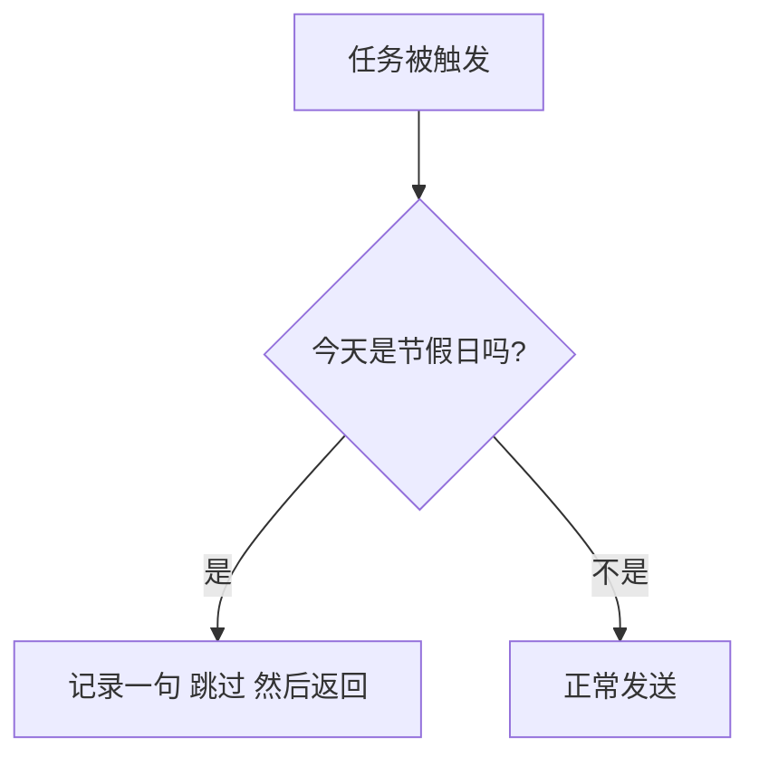

判断依据通常是一张自己维护的节假日表——**第 11 章接入 SQL Server 后，这张表放数据库里最合适**。

---

# 第三部分　四个真实陷阱

## 9.7 时区：最容易出错的一处

### 9.7.1 为什么必须显式指定时区

```python
# 时区。必须显式指定，不能依赖服务器的默认时区（见本章 9.7 节）。
TIMEZONE = "Asia/Shanghai"
```

如果不指定，APScheduler 会用**服务器的本地时区**。而服务器时区常常不是北京时间：

| 环境 | 常见时区 |
|---|---|
| 国内自建服务器 | 通常是 `Asia/Shanghai` |
| **云服务器默认镜像** | **常常是 `UTC`** |
| Docker 容器默认 | **通常是 `UTC`** |

### 9.7.2 实测：同一个 09:05 在不同时区差得很远

```text
timezone=Asia/Shanghai      -> 2026-09-05 09:05 CST （换算成北京时间 09:05）
timezone=UTC                -> 2026-09-05 09:05 UTC （换算成北京时间 17:05）
timezone=America/New_York   -> 2026-09-04 09:05 EDT （换算成北京时间 21:05）
```

**同一行代码 `hour=9, minute=5`，在 UTC 服务器上实际是北京时间下午 5 点发送。**

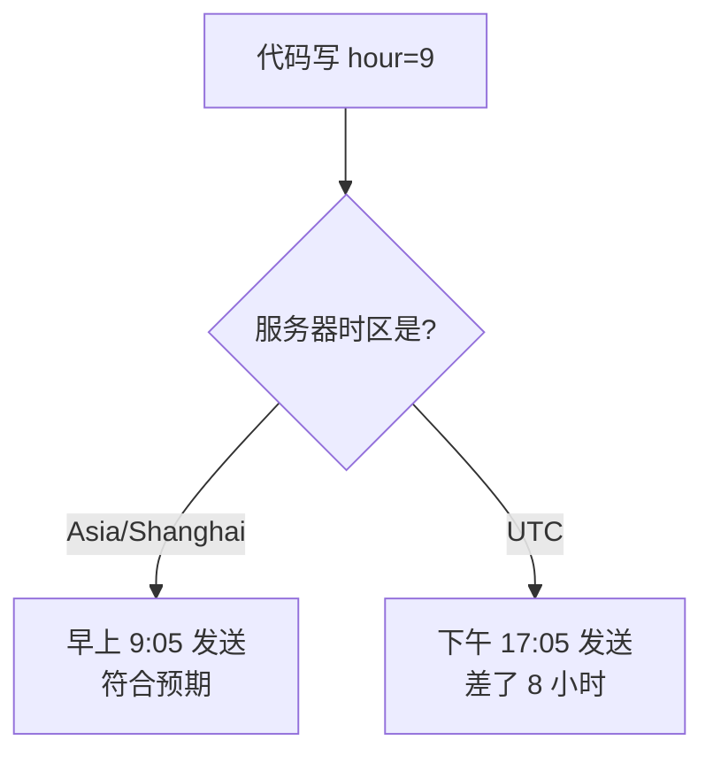

这类 bug 的特点是：**在你的开发机上完全正常，一部署到服务器就错**，而且错得很规律（永远差 8 小时）。

### 9.7.3 三条规则

1. **代码里显式写死时区**，不依赖环境。
2. **启动时把下次触发时间打印出来**（下一节的 `describe_jobs`）——这是最后一道防线。
3. **注意时间显示里的 `CST`/`UTC` 标记**，实测输出里都带着它，这不是装饰。

### 9.7.4 关于 `pytz`

老教程常说 APScheduler 需要 `pytz`。**实测版本 3.11.3 不需要**：

```text
APScheduler 版本: 3.11.3
Python 版本: 3.9.25
zoneinfo 可用: True
pytz: 未安装
```

Python 3.9 起标准库自带 `zoneinfo`，直接传时区名字符串就行。如果你看到要求装 `pytz` 的教程，那是旧版本的做法。

---

## 9.8 避开集中发送时段

### 9.8.1 官方的调用建议

> 大部分企业应用在**每小时的 0 分或 30 分**触发推送消息，容易造成资源挤占，从而**投递不够及时**，建议尽量避开这两个时间点进行调用。

翻译一下：**全世界的程序员都爱写“整点执行”，于是整点那一刻服务器最忙。**

### 9.8.2 两个应对手段

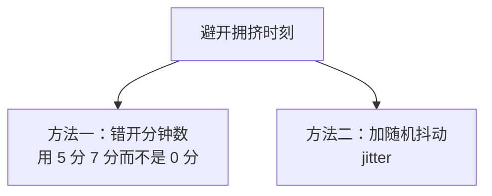

本教程的默认值就是这么定的：

```python
# 官方建议避开每小时的 0 分和 30 分（那时资源挤占严重，投递不够及时）。
# 所以本教程的默认分钟数刻意选了一个"不整"的值。
DEFAULT_MINUTE = 5
```

**实测三种写法的触发时刻：**

```text
每小时 0 分（不推荐）  -> ['09:00', '10:00', '11:00']
每小时 30 分（不推荐） -> ['09:30', '10:30', '11:30']
每小时 7 分（推荐）    -> ['09:07', '10:07', '11:07']
```

### 9.8.3 写错了会收到提示

```python
def _warn_if_busy_minute(minute: int) -> None:
    """
    如果定在 0 分或 30 分，提醒一下。

    官方调用建议：大部分企业应用在每小时的 0 分或 30 分触发推送，
    容易造成资源挤占，从而投递不够及时，建议尽量避开这两个时间点。
    """
    if minute in (0, 30):
        print(f"[提示] 你把任务定在了 {minute} 分。官方建议避开每小时的 "
              f"0 分和 30 分，因为那时容易资源挤占、投递不及时。"
              f"建议改成 {DEFAULT_MINUTE} 分之类的值。")
```

**实测：**

```text
尝试 minute=0： [提示] 你把任务定在了 0 分。官方建议避开每小时的 0 分和 30 分，因为那时容易资源挤占、投递不及时。建议改成 5 分之类的值。（已添加）
尝试 minute=30： [提示] 你把任务定在了 30 分。……（已添加）
尝试 minute=5： （已添加）
```

注意它**只提示、不阻止**（后面跟着“已添加”）。因为这只是官方的建议，不是硬性限制——**该由你决定，但你得知道。**

> 这是一个值得学的取舍：**硬性限制用异常拦住（第 6 章的护栏），软性建议用提示告知。**把建议做成硬拦截会让人恼火，把限制做成提示会让人踩坑。

---

## 9.9 防止同一任务重叠执行

### 9.9.1 问题：上一次还没跑完，下一次又来了

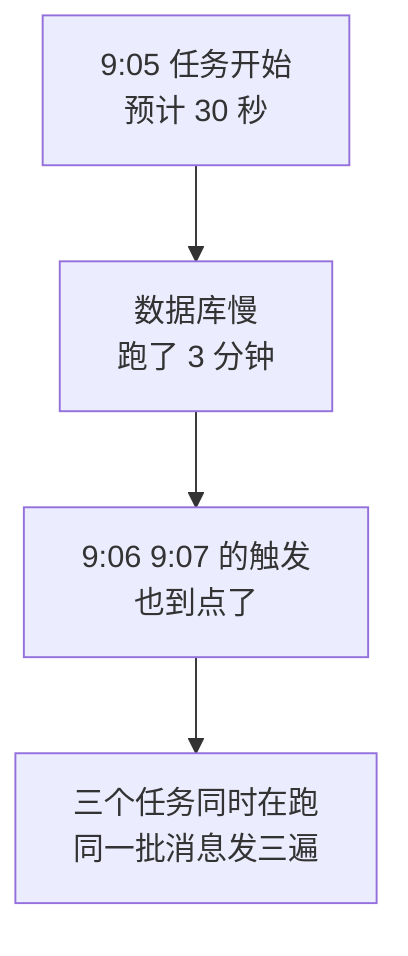

对本教程来说这个后果很具体：**同一个人收到三条相同的提醒。**

### 9.9.2 用 `max_instances` 限制

```python
        job_defaults={
            # 同一个任务同时最多只能有 1 个在跑（见 9.9 节）
            "max_instances": 1,
```

**实测对比（触发间隔 0.5 秒、任务耗时 1.5 秒、观察 3.5 秒）：**

```text
J. 任务重叠：慢任务不会被重复启动
    -> 慢任务开始
    -> 慢任务结束
    -> 慢任务开始
    -> 慢任务结束
  触发间隔 0.5 秒、任务耗时 1.5 秒 -> 实际只执行了 2 次
```

而把 `max_instances` 放宽：

```text
A. max_instances=1（默认）：实际执行了 2 次
B. max_instances=3：实际执行了 6 次
```

**同样的时间窗口，一个执行 2 次，一个执行 6 次。**

### 9.9.3 被跳过时 APScheduler 会警告

实测能看到这样的日志：

```text
[APScheduler] WARNING Execution of job "slow_job (trigger: interval[0:00:00.400000], ...)" skipped: maximum number of running instances reached (1)
```

**这条警告很重要。**如果你在生产日志里频繁看到它，说明：

| 现象 | 含义 |
|---|---|
| 偶尔出现 | 某次任务碰巧慢了，可接受 |
| **持续出现** | **任务耗时超过了触发间隔**，间隔设得太密 |

第 14 章会把这类警告纳入日志监控。

### 9.9.4 `max_instances=1` 够不够

**在单进程里够，跨进程不够。**

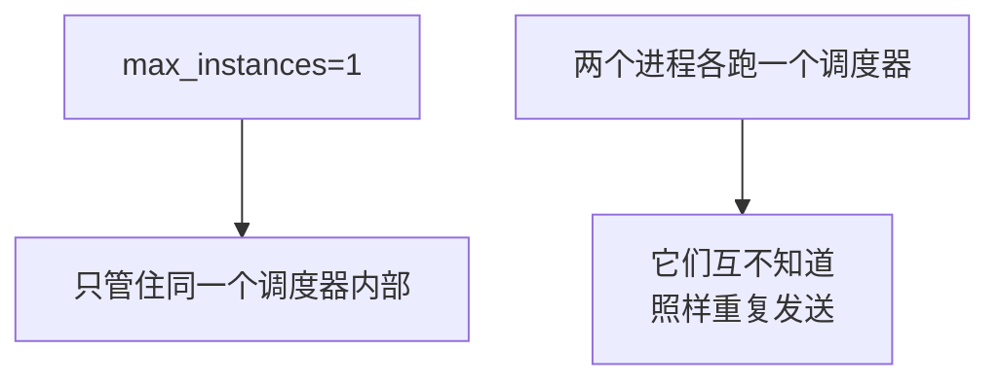

所以如果你不小心把程序启动了两遍（这在部署时很常见），**重复发送照样发生**。这个问题本章解决不了，第 12 章用数据库唯一约束才能真正解决。

---

## 9.10 程序重启后的任务恢复

### 9.10.1 内存里的任务安排会丢

本章用的是**默认的内存任务存储**，所以：

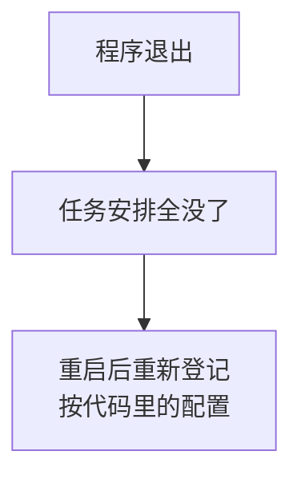

对本教程来说，**这其实没问题**——因为任务安排本来就写在代码里，重启后照样按 9:05 执行。

**真正的问题是另一个：如果程序在 9:05 时没运行，那次提醒就永远错过了。**

### 9.10.2 错过触发怎么处理

APScheduler 有两个参数管这件事：

| 参数 | 作用 |
|---|---|
| `misfire_grace_time` | 错过多久之内还愿意补跑 |
| `coalesce` | 错过多次时，合并成一次还是逐次补跑 |

```python
# 错过触发后的宽限秒数：超过这个时间就不再补跑。
# 为什么给 300 秒？见本章 9.10 节：
#   机器休眠、程序卡顿几分钟后恢复，补发一条提醒是合理的；
#   但如果已经过了几小时，那条"早上 9 点的提醒"在下午发出去只会让人困惑。
MISFIRE_GRACE_SECONDS = 300
```

### 9.10.3 实测这两个参数的组合

我用“暂停调度器 2 秒”模拟“程序卡住”，触发间隔 0.3 秒（本该触发约 6 次）：

```text
  coalesce  grace   执行次数   说明
  ----------------------------------------------------------
  True        1 秒      3 次     错过的多次被合并成 1 次
  True       60 秒      3 次     错过的多次被合并成 1 次
  False       1 秒      5 次     超出宽限期的被丢弃
  False      60 秒      8 次     逐次补跑
```

**关键发现：`coalesce=True`（默认值）会把“错过的多次”压成一次，于是 `misfire_grace_time` 的差别根本看不出来。**

> 这一组数据是我第二次测才得到的。第一次我只改 `misfire_grace_time`、没动 `coalesce`，结果两种设置都是 2 次，**看起来像“参数没生效”**。实际是被 `coalesce=True` 掩盖了。教训：**测一个参数时，要确认没有另一个参数把效果吃掉。**

### 9.10.4 本教程的选择

```python
            # 错过多次时合并成一次，而不是逐次补跑（见 9.10 节）
            "coalesce": True,
            "misfire_grace_time": MISFIRE_GRACE_SECONDS,
```

理由：

| 选择 | 理由 |
|---|---|
| `coalesce=True` | 卡了两小时后恢复，**不该把这两小时的提醒一次性全补发** |
| `misfire_grace_time=300` | 迟到 5 分钟内补发合理；迟到几小时的提醒发出去只会让人困惑 |

**注意这是业务判断，不是技术判断。**如果你的任务是“每小时抓取数据入库”，漏掉的每一次可能都要补——那就该 `coalesce=False`。

### 9.10.5 想让任务安排持久化怎么办

APScheduler 支持把任务存进数据库（`SQLAlchemyJobStore` 等），这样重启后连“上次执行到哪”都能恢复。

**但本教程不用**，因为：

- 我们的任务安排是**写在代码里的固定几条**，重启后自然会重新登记；
- 引入任务存储会增加一层复杂度和一个需要维护的表；
- 真正需要持久化的不是“任务安排”，而是“**哪条业务消息发过了**”——那是第 12 章的发送记录表，价值大得多。

> **判断标准：持久化“调度状态”还是持久化“业务结果”？后者几乎总是更重要。**

---

## 9.11 启动时必须打印任务安排

### 9.11.1 这是防时区错误的最后一道防线

```python
def describe_jobs(scheduler) -> str:
    """
    列出所有任务和它们的下一次触发时间。

    这个函数是【启动后必须打印】的东西：
        它把"我以为定在 9 点"和"实际定在几点"这两件事对上。
        时区配错、cron 写错，在这里一眼就能看出来。
    """
```

**实测输出：**

```text
当前共 3 个任务（时区 Asia/Shanghai）：
  - [daily] 每天 09:05 发送提醒
      下次触发：2026-09-05 09:05:00 CST（尚未启动，按触发器推算）
  - [weekly] 每周fri 17:35 发送提醒
      下次触发：2026-09-11 17:35:00 CST（尚未启动，按触发器推算）
  - [every30] 每 30 分钟发送提醒（抖动 ±60 秒）
      下次触发：2026-09-04 18:16:15 CST（尚未启动，按触发器推算）
```

**部署完看一眼这三行，时区问题就暴露了。**如果这里显示的是 UTC 或者时间不对，立刻就能发现，而不是等到第二天用户说“没收到”。

### 9.11.2 这里有个真实的坑：启动前没有 `next_run_time`

我最初的写法是直接读 `job.next_run_time`，实测直接崩了：

```text
Traceback (most recent call last):
  File "/tmp/ch9/mock_test.py", line 155, in <module>
    print(ss.describe_jobs(sched2))
  File "/tmp/ch9/scheduler_setup.py", line 167, in describe_jobs
    next_run = job.next_run_time
AttributeError: next_run_time
```

原因是：**调度器 `start()` 之前，任务处于“待定（pending）”状态，此时它根本没有 `next_run_time` 这个属性。**

而这正好和我们的需求冲突——**我们恰恰想在启动前就核对时间**。修正后的写法：

```python
    for job in jobs:
        # 【坑】调度器 start() 之前，任务处于"待定"状态，
        # 此时它【根本没有 next_run_time 这个属性】，直接访问会抛 AttributeError。
        # 而我们恰恰想在启动前就把安排打印出来核对，所以必须用 getattr 兜底，
        # 再自己从触发器算出下次时间。
        next_run = getattr(job, "next_run_time", None)

        if next_run is None:
            upcoming = preview_fire_times(job.trigger, 1)
            next_run = upcoming[0] if upcoming else None
            suffix = "（尚未启动，按触发器推算）"
        else:
            suffix = ""
```

注意还加了个后缀说明当前是推算值——**别让人误以为这是调度器的权威安排。**

---

## 9.12 优雅停止

### 9.12.1 直接杀进程的风险

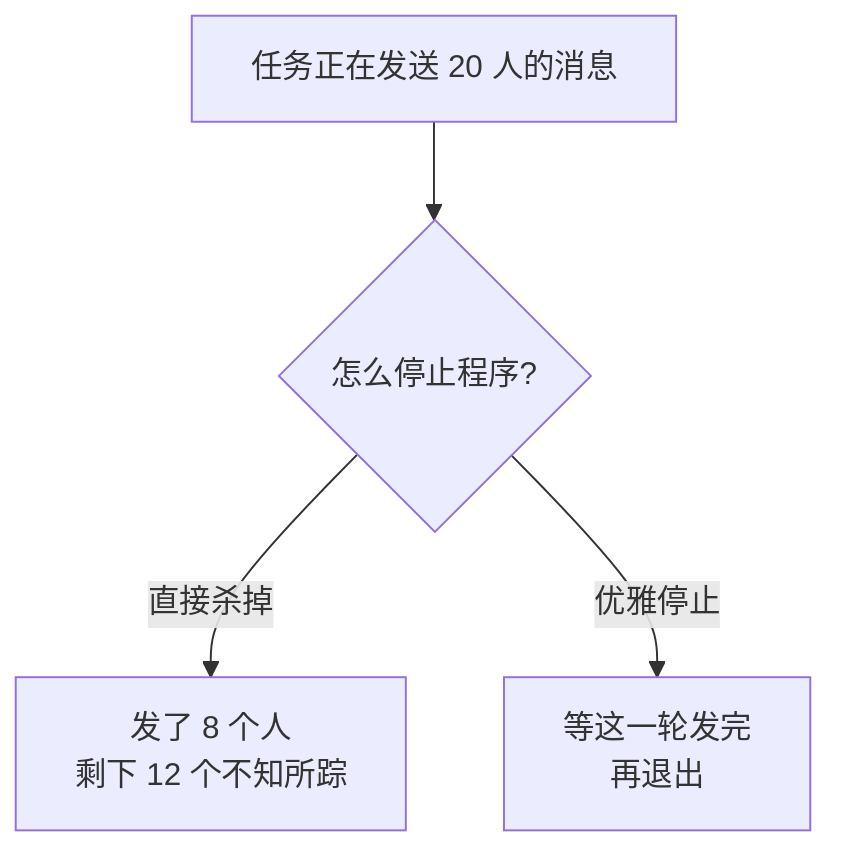

### 9.12.2 实现

```python
    try:
        scheduler.start()
    except (KeyboardInterrupt, SystemExit):
        # 优雅停止：等正在跑的任务结束，避免消息发一半就被掐断
        print("\n收到退出信号，正在等待当前任务结束……")
        scheduler.shutdown(wait=True)
        print("已安全退出。")
```

**实测 `shutdown(wait=True)` 的行为：**

```text
M. 优雅停止：shutdown(wait=True) 会等任务跑完
  shutdown(wait=True) 阻塞了 0.80 秒，任务完成数 1（说明它等任务跑完才退出）
```

它**真的等**——阻塞了 0.8 秒直到那个 1 秒的任务跑完。

### 9.12.3 `wait=True` 和 `wait=False`

| | `wait=True` | `wait=False` |
|---|---|---|
| 正在跑的任务 | **等它跑完** | 不等，直接返回 |
| Ctrl+C 后 | 可能要等几秒 | 立刻退出 |
| 本教程 | **用这个** | |

对“发消息”这类**有副作用**的任务，一定要 `wait=True`。因为发一半被掐断，会留下一个“部分完成”的烂摊子——第 6 章 6.11.4 节讲过这有多难处理。

---

# 第四部分　该用哪种调度方案

## 9.13 APScheduler 与系统计划任务的对比

### 9.13.1 两种思路

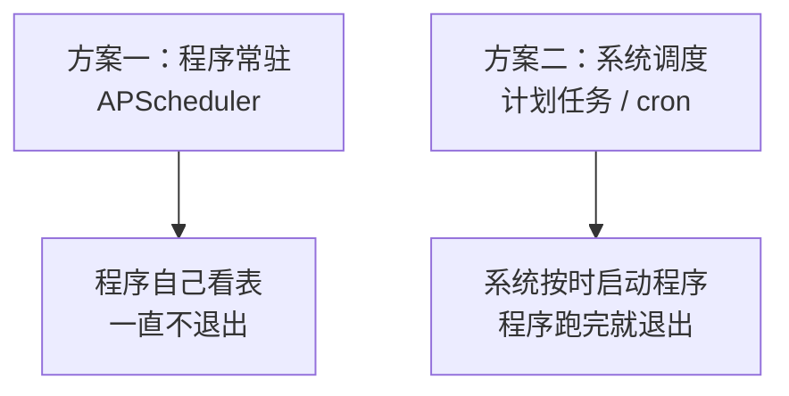

### 9.13.2 对比表

| | APScheduler | Windows 计划任务 / Linux cron |
|---|---|---|
| 程序形态 | **常驻不退出** | 每次启动新进程 |
| 凭证缓存 | **有效**（第 8 章的收益） | **无效**，每次都重新取 |
| 时区控制 | **代码里写死，可靠** | 依赖系统时区 |
| 防重叠 | `max_instances` | 要自己写锁 |
| 复杂调度（工作日、抖动） | **容易** | cron 能做，抖动较难 |
| 程序崩了怎么办 | **没人管，任务全停** | 下次照样启动 |
| 内存泄漏风险 | 长期运行需注意 | **每次新进程，天然干净** |
| 部署复杂度 | 要配开机自启、守护 | **系统自带，最简单** |

### 9.13.3 该怎么选

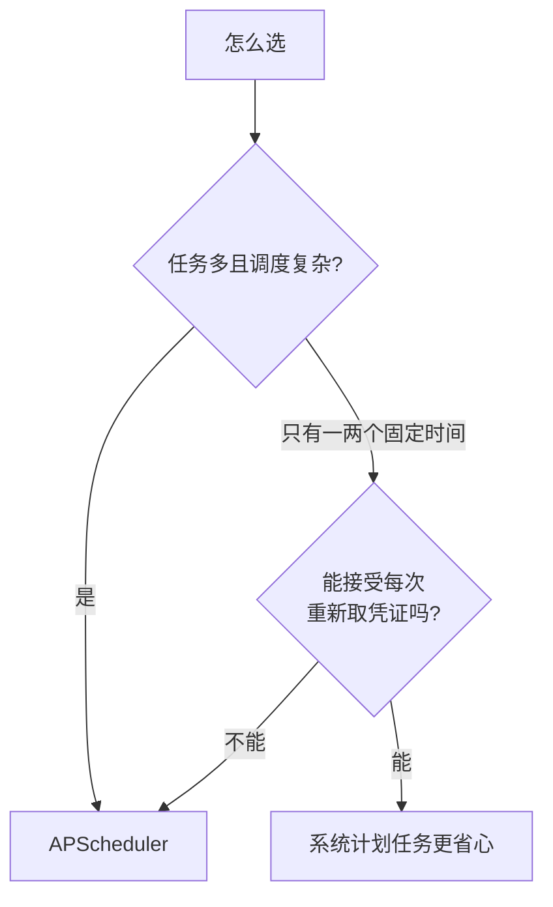

**本教程选 APScheduler**，理由：

1. 凭证缓存能真正发挥作用（第 8 章的成果）；
2. 时区在代码里写死，不受服务器环境影响；
3. 后面第 11 章会有多个任务、不同频率，代码里管理更清楚。

**但要诚实指出它的软肋：程序崩了就全停了。**所以第 16 章会讲怎么配开机自启和进程守护——这恰恰是系统计划任务天然具备的能力。

### 9.13.4 一个折中方案

如果你只有一个每天固定时间的任务，其实有个更省心的组合：

**用系统计划任务每天启动一次 `python main.py once`。**

这样：

- 不需要程序常驻，崩了也不影响明天；
- 凭证缓存失去意义，但一天只取一次凭证也无所谓；
- 部署极简单。

**代价是**：无法应对“每 30 分钟一次”这类高频任务（每次都取凭证会累积很多次调用）。

> 这也是本章 `main.py` 保留 `once` 模式的另一个价值：**它让两种部署方式都可行。**

---

## 9.14 本章小项目：每天 09:05 发送提醒

### 9.14.1 完整的启动流程

```python
def run_schedule(config, client) -> None:
    """启动定时调度，常驻运行。"""
    print("=" * 60)
    print("模式：定时调度")
    print("=" * 60)

    scheduler = create_scheduler()

    # add_job 传的是【函数本身】，不是函数的调用结果。
    # 写成 run_notify_task(client, config) 会立刻执行一次然后把返回值当任务，
    # 这是新手最常见的错误之一。这里用 lambda 把参数包进去。
    add_daily_job(
        scheduler,
        lambda: run_notify_task(client, config),
        hour=DAILY_HOUR,
        minute=DAILY_MINUTE,
    )

    # 启动前把任务安排打印出来，确认时区和时间没配错
    print(describe_jobs(scheduler))

    print("\n接下来 3 次触发时刻：")
    for job in scheduler.get_jobs():
        for moment in preview_fire_times(job.trigger, 3):
            print(f"  {moment.strftime('%Y-%m-%d %H:%M:%S %Z')}")

    if config.dry_run:
        print("\n当前是【演练模式】：会按时触发，但不会真的发送任何消息。")
        print("这正是验证定时配置的正确方式 —— 可以放心让它跑一整天。")

    print("\n调度器已启动，按 Ctrl+C 退出。")
```

### 9.14.2 演练模式在本章的价值最大

第 6 章加的演练模式，到这里才真正显出威力。**实测：**

```text
L. 演练模式：按时触发但不发送、也不取凭证
[演练模式] 以下 text 消息【没有】真的发送：
           接收成员：共 2 人：zhangsan, lisi
[演练模式] 以下 text 消息【没有】真的发送：
           接收成员：共 2 人：zhangsan, lisi
触发了若干次，实际发送 0 次（应为 0），取凭证 0 次（应为 0）
```

**定时触发正常发生，但一条消息都没发、一次凭证都没取。**

这意味着你可以：

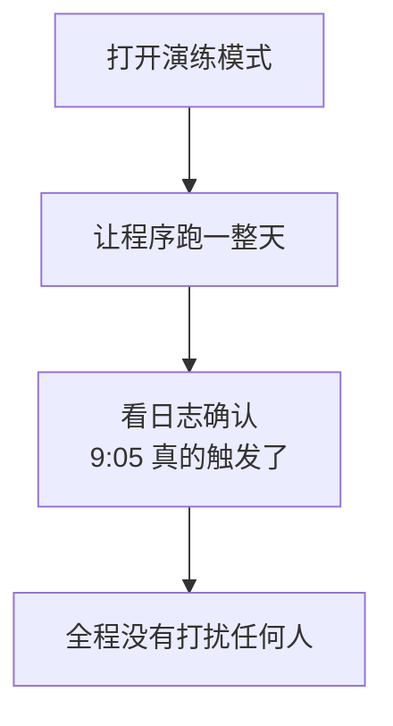

**这是验证定时任务唯一靠谱的办法。**否则你只有两个选择：等一天真发一条（骚扰同事），或者把时间改成一分钟后（但那就没验证到 cron 的正确性）。

### 9.14.3 建议的练习顺序

1. `python main.py once` —— 确认任务函数本身能跑通；
2. `.env` 里设 `WECOM_DRY_RUN=true`，把发送时间**改成两分钟后**，跑 `python main.py schedule`，确认按时触发；
3. 看 `describe_jobs` 的输出，**确认时区显示 CST**；
4. 把时间改成 `minute=0`，确认收到官方建议的提示；
5. 改回 `09:05`，关掉演练，让它真的跑一天；
6. 第二天确认 09:05 收到了消息。

第 3 步最容易被跳过，但它是**部署到服务器后第一个要看的东西**。

---

## 9.15 本章改动清单

### 新增文件 `tasks.py`

| 内容 | 说明 |
|---|---|
| `build_content()` | 生成正文（第 11 章改为查数据库） |
| `resolve_recipients()` | 从 `.env` 取名单 |
| **`run_notify_task()`** | **一次完整任务，绝不抛异常** |

### 新增文件 `scheduler_setup.py`

| 内容 | 说明 |
|---|---|
| `TIMEZONE = "Asia/Shanghai"` | **显式写死时区** |
| `DEFAULT_MINUTE = 5` | 避开 0 分和 30 分 |
| `MISFIRE_GRACE_SECONDS = 300` | 错过 5 分钟内才补 |
| `create_scheduler()` | `BlockingScheduler` + 三个默认值 |
| `add_daily_job()` | 每天 |
| `add_weekday_job()` | 工作日 |
| `add_weekly_job()` | 每周指定日 |
| `add_interval_job()` | 固定间隔 + 抖动 |
| `_warn_if_busy_minute()` | 0/30 分提示 |
| `describe_jobs()` | 启动时打印安排（**含 `getattr` 兜底**） |
| `preview_fire_times()` | 不用等一天就能验证 |

### `main.py`

| 改动 | 说明 |
|---|---|
| 支持 `once` / `schedule` 两种模式 | 调试必备 |
| `build_client()` **只创建一次缓存** | 否则第 8 章白做 |
| 启动前打印任务安排 | 防时区错 |
| `except KeyboardInterrupt` + `shutdown(wait=True)` | 优雅停止 |

### 新增依赖

```bash
python -m pip install apscheduler
python -m pip freeze > requirements.txt
```

### `config.py` / `wecom_client.py` / `message_builder.py` / `token_cache.py`

本章无改动。**注意：从第 9 章起，客户端部分基本定型了。**

---

## 9.16 本章完成标志

- [ ] `python main.py once` 能立刻发出一条消息
- [ ] `python main.py schedule` 启动后**不退出**，打印出任务安排
- [ ] 任务安排里的时间显示 **CST**（不是 UTC）
- [ ] 把时间设成两分钟后 + 演练模式，确认**按时触发但没发消息**
- [ ] 把分钟数设成 `0`，收到官方建议的提示
- [ ] 连续触发多次，`[凭证]` 日志**只出现一次**（缓存生效）
- [ ] 按 Ctrl+C，看到“正在等待当前任务结束”而不是直接崩

### 本章完成标志

> 程序常驻运行，第二天早上 09:05 你自动收到了消息，而你什么都没做。

---

## 9.17 本章小结

### 9.17.1 本章必须带走的 10 条结论

1. **定时任务要求程序常驻**，用 `BlockingScheduler`。
2. **`add_job` 传函数本身**，写成 `func()` 会立刻执行一次然后再也不跑。
3. **任务函数绝不向外抛异常**——无人值守时，异常等于消失。
4. **客户端和缓存只创建一次**，否则第 8 章的缓存白做。
5. **时区必须在代码里写死**，云服务器和容器默认常常是 UTC。
6. **启动时打印下次触发时间**，这是防时区错的最后防线。
7. **避开每小时 0 分和 30 分**（官方建议），用 5 分或加抖动。
8. **`max_instances=1` 防任务重叠**，但**管不了两个进程**。
9. **`coalesce=True` 会掩盖 `misfire_grace_time` 的效果**，测参数时要留意。
10. **`shutdown(wait=True)`**，别让消息发一半被掐断。

### 9.17.2 自测题

1. 为什么 `BackgroundScheduler` 会导致“任务一次都不执行”？（9.3.2）
2. `add_job(run_task(client, config))` 会发生什么？（9.3.3）
3. 为什么任务函数要用 `except Exception` 兜底，而平时不推荐这么写？（9.2.4）
4. 代码写 `hour=9`，部署到 UTC 服务器上实际几点发送？（9.7.2）
5. 官方为什么建议避开 0 分和 30 分？（9.8.1）
6. `max_instances=1` 能防住“程序被启动了两遍”吗？（9.9.4）
7. 只改 `misfire_grace_time` 却看不出效果，可能是什么原因？（9.10.3）
8. 用演练模式验证定时任务，好处是什么？（9.14.2）

### 9.17.3 现在的程序离“可用”还差什么

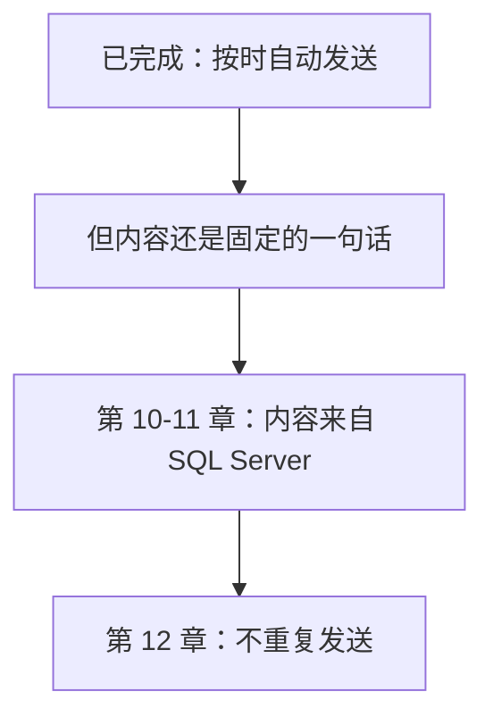

**本章之后，程序已经能无人值守运行了。但它发的还是一句写死的话。**

### 9.17.4 下一章预告

第 10 章开始接入 **SQL Server**：安装 ODBC 驱动、用 `pyodbc` 连接、执行第一个 `SELECT`、参数化查询防注入、以及连接的正确关闭方式。

那一章不发任何消息，目标是**在终端里正确显示出查询结果**。第 11 章才把数据变成消息。

另外提醒一句：本章 9.6.4 节说过“节假日判断需要自己维护一张表”——**第 10 章接入数据库后，这件事就有地方做了。**

---

## 参考的官方文档

1. [企业微信开发者中心：发送应用消息](https://developer.work.weixin.qq.com/document/path/90236) —— **调用建议：避开每小时 0 分和 30 分**；频率限制
2. [企业微信开发者中心：获取 access_token](https://developer.work.weixin.qq.com/document/path/91039) —— 凭证缓存要求
3. [APScheduler 官方文档](https://apscheduler.readthedocs.io/) —— 触发器类型、`max_instances`、`coalesce`、`misfire_grace_time`、调度器种类

> 本章代码在 Python 3.9.25 + APScheduler 3.11.3 环境中实际运行验证，共 13 组测试，文中所有标注“实测”的输出均为真实运行结果。企业微信接口规则依据上述官方文档整理并重新表述（内容已为遵守许可限制而改写）。APScheduler 不同版本的行为可能有差异，请以你本机实际运行结果为准。
