# 第 10 章　Python 连接 SQL Server

> 所属教程：《Python 调用企业微信应用消息 API：从入门到定时、数据库与防重复发送》  
> 前置章节：第 9 章（定时发送）  
> 本章目标：**在终端里正确显示出 SQL Server 的查询结果。**本章不发送任何消息。  
> 使用的库：`pyodbc`（实测版本 5.3.0）+ Microsoft ODBC Driver 18 for SQL Server

**本章是全书唯一“不碰企业微信”的一章。**

这是故意的。数据库和消息发送是两件独立的事，混在一起调试会让你分不清“是查不到数据”还是“是发不出消息”。所以本章只做一件事：**把数据查出来、显示在终端里**。第 11 章才把数据变成消息。

> **关于本章的验证方式（请先读这一段）**
>
> 我在验证环境里装了**真实的 Microsoft ODBC Driver 18** 和 `pyodbc` 5.3.0，但**没有可用的 SQL Server 实例**。所以本章的“实测”分三类，文中会逐处标明：
>
> | 标记 | 含义 |
> |---|---|
> | **实测（真实驱动）** | 用真的 ODBC Driver 18 跑出来的结果，包括各种连接错误的 SQLSTATE |
> | **实测（DB-API 通用）** | 用 `sqlite3` 验证的行为。`pyodbc` 和 `sqlite3` 都遵循 Python DB-API 2.0，在这些点上行为一致 |
> | **依据官方文档** | 需要真实 SQL Server 才能触发的行为，来自微软和 pyodbc 官方文档 |
>
> 这样标注是为了让你知道**哪些结论我亲自跑过、哪些是查来的**。

---

## 10.0 本章路线

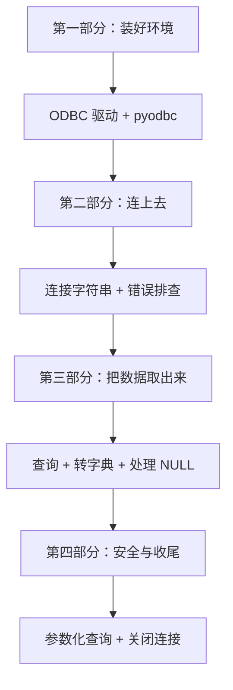

---

# 第一部分　装好环境

## 10.1 本阶段的业务目标

### 10.1.1 最终要实现的业务

从第 11 章起，程序要做的事是：

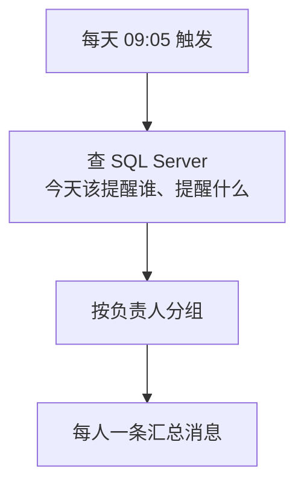

**本章只负责第二格。**

### 10.1.2 示例业务表

我们假设有这样一张待办表（第 11 章会给出完整建表脚本）：

| 字段 | 类型 | 说明 |
|---|---|---|
| 待办编号 | int | 主键 |
| 标题 | nvarchar | 待办事项名称 |
| 负责人 | varchar | **存的是企业微信 UserID** |
| 金额 | decimal | 可能为 NULL |
| 截止时间 | datetime | |
| 状态 | varchar | 待处理 / 已完成 |

请注意“负责人”那一行：**业务表里直接存 UserID**，这样查出来就能直接发送。如果表里存的是姓名或手机号，就还得多一步转换（第 2 章 2.4.4 节提过手机号换 UserID 的接口和它的调用次数限制）。

### 10.1.3 本章的三条要求

| 要求 | 为什么 |
|---|---|
| **不发消息** | 把数据库问题和消息问题分开排查 |
| **结果转成字典** | 用字段名取值，不靠下标 |
| **一律参数化查询** | 防 SQL 注入 |

---

## 10.2 安装 SQL Server ODBC 驱动

### 10.2.1 为什么需要“驱动”这一层

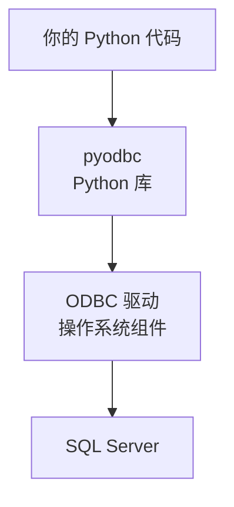

**`pyodbc` 只是个转接头，真正会说 SQL Server 语言的是 ODBC 驱动。**所以光 `pip install pyodbc` 是不够的——驱动要单独装，而且它是操作系统级别的组件。

这也解释了本章最常见的错误：`pip` 装得好好的，一连接就报“找不到驱动”。

### 10.2.2 各系统怎么装

| 系统 | 装什么 |
|---|---|
| **Windows** | 下载并安装 **Microsoft ODBC Driver 18 for SQL Server**（微软官网提供安装包） |
| **Linux** | 按微软文档添加官方软件源，然后安装 `msodbcsql18` |
| **macOS** | 用 Homebrew 添加微软的 tap 后安装 |

> Windows 上如果装过 SQL Server Management Studio，机器上很可能已经有某个版本的驱动了，可以先用下一节的方法查一下。

### 10.2.3 装完先查一下装了什么（最重要的一步）

**别急着写连接代码，先运行这一行：**

```python
python -c "import pyodbc; print(pyodbc.drivers())"
```

**实测（真实驱动）输出：**

```text
pyodbc 版本: 5.3.0
paramstyle : qmark   ← 占位符必须用 ?
驱动列表   : ['PostgreSQL', 'MySQL', 'MySQL-5', 'FreeTDS', 'MariaDB', 'ODBC Driver 18 for SQL Server']
```

**驱动名字必须和这个列表里的完全一致**——一个字母都不能差。这是本章最容易出错的地方，而这一行命令能让你在写代码前就避开它。

如果你的列表里是 `ODBC Driver 17 for SQL Server`，那就用 17，本章的代码把驱动名做成了配置项，改一行就行。

### 10.2.4 版本 17 和 18 的重要差别

**这一节请认真看，它是新手升级驱动后最常见的翻车点。**

微软在 **ODBC Driver 18** 里做了一个破坏性变更：**把 `Encrypt` 的默认值从 `no` 改成了 `yes`**（依据微软官方发布说明）。

后果是：

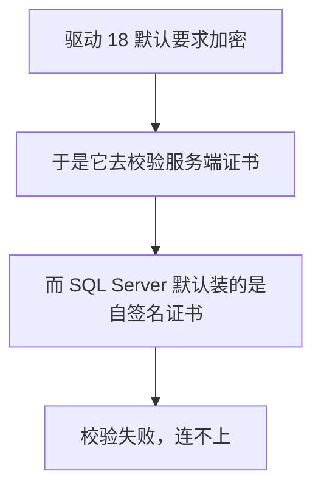

微软的故障排查文档也明确说明：旧驱动假设加密是关闭的，新驱动假设是开启的；因为要加密，驱动会去校验服务端证书然后失败。

**症状**是这样一条错误（内网环境极常见）：

```text
[Microsoft][ODBC Driver 18 for SQL Server]SSL Provider: The certificate chain was issued by an authority that is not trusted
```

两种解决办法：

| 办法 | 做法 | 代价 |
|---|---|---|
| 正规做法 | 给 SQL Server 配一张受信任的证书 | 要运维配合 |
| 内网权宜之计 | 连接字符串加 `TrustServerCertificate=yes` | **放弃证书校验** |

第二种就是本章 `DB_TRUST_SERVER_CERTIFICATE=true` 这个配置项的用途。10.4.5 节会讲它的代价。

---

## 10.3 安装 `pyodbc`

```bash
python -m pip install pyodbc
python -m pip freeze > requirements.txt
```

### 10.3.1 一个必须记住的细节：占位符是问号

**实测（真实驱动）：**

```text
paramstyle : qmark   ← 占位符必须用 ?
```

`qmark` 的意思是参数占位符用 **`?`**：

```python
cursor.execute("SELECT * FROM 待办 WHERE 负责人 = ?", ("zhangsan",))
```

**不是 `%s`**（那是 MySQL 驱动和 psycopg2 的风格），**也不是 `:name`**。用错了会直接报语法错误。

### 10.3.2 装了库还报错找不到驱动？

这是本章第一个高频问题。**实测（真实驱动）在 Linux 上缺少 unixODBC 时：**

```text
ImportError: libodbc.so.2: cannot open shared object file: No such file or directory
```

`pyodbc` 导入就失败了。原因是 Linux 上还需要 **unixODBC** 这个驱动管理器（Windows 自带，不用管）。

| 报错 | 缺什么 |
|---|---|
| `ImportError: libodbc.so.2` | Linux 缺 unixODBC |
| 连接时报找不到驱动 | 缺 SQL Server 的 ODBC 驱动本身 |

---

# 第二部分　连上去

## 10.4 准备数据库连接配置

### 10.4.1 新增的 `.env` 配置项

```ini
# ---------- 第 10 章新增：数据库配置 ----------

# 服务器地址。可以带端口，用【逗号】分隔（SQL Server 的习惯，不是冒号）
DB_SERVER=192.168.1.10,1433

# 数据库名
DB_DATABASE=sankodata

# 身份验证方式：二选一
#   方式一：SQL Server 身份验证 —— 填下面两项
DB_USERNAME=sa
DB_PASSWORD=你的密码
#   方式二：Windows 身份验证 —— 把下面这项设为 true，上面两项留空
DB_TRUSTED_CONNECTION=false

# 驱动名，必须和 pyodbc.drivers() 列出的完全一致
DB_DRIVER=ODBC Driver 18 for SQL Server

# 加密与证书
DB_ENCRYPT=true
# 内网自签名证书环境通常需要设为 true，代价见第 10 章 10.4.5 节
DB_TRUST_SERVER_CERTIFICATE=true

# 超时（秒）
DB_LOGIN_TIMEOUT=10
DB_QUERY_TIMEOUT=30
```

**注意 `DB_SERVER` 的端口用逗号分隔**：`192.168.1.10,1433`。这是 SQL Server 的传统写法，写成冒号 `:1433` 是无效的。

### 10.4.2 两种身份验证方式

| | SQL Server 身份验证 | Windows 身份验证 |
|---|---|---|
| 连接字符串 | `UID=xxx;PWD=xxx` | `Trusted_Connection=yes` |
| 用谁的身份 | 指定的数据库账号 | **运行程序的 Windows 账号** |
| 跨平台 | 都能用 | 基本只在 Windows 域环境可用 |
| 密码要存 `.env` 吗 | **要** | **不要**（这是它的最大优点） |

如果你的程序跑在 Windows 服务器、且数据库在同一个域内，**优先用 Windows 身份验证**——因为它根本不需要在配置文件里存密码。

不过要注意一个坑：用 Windows 身份验证时，**生效的是“运行程序的那个账号”**。你手工双击运行时是你自己的账号（能连上），配成计划任务后可能变成 `SYSTEM` 账号（连不上）。第 16 章部署时会再提这件事。

### 10.4.3 拼连接字符串

```python
def build_connection_string(config: DatabaseConfig) -> str:
    """
    拼出 ODBC 连接字符串。

    单独抽成函数的好处：
        它是个【纯函数】—— 给定配置就产出字符串，不碰网络。
        所以可以直接打印出来检查，也可以单独测试。
        连接失败时，第一件事就是看它拼对了没有。
    """
    parts = [
        # 驱动名必须用花括号包起来，因为名字里有空格
        f"DRIVER={{{config.driver}}}",
        f"SERVER={config.server}",
        f"DATABASE={config.database}",
    ]

    if config.trusted_connection:
        # Windows 身份验证：用当前登录的 Windows 账号，不需要用户名密码
        parts.append("Trusted_Connection=yes")
    else:
        parts.append(f"UID={config.username}")
        parts.append(f"PWD={config.password}")

    # Encrypt：ODBC Driver 18 起默认就是 yes（这是 18 版的破坏性变更）
    parts.append(f"Encrypt={'yes' if config.encrypt else 'no'}")

    if config.trust_server_certificate:
        # 信任服务端证书。内网自签名证书的环境通常需要它，
        # 但它会放弃证书校验，代价见 10.4.5 节。
        parts.append("TrustServerCertificate=yes")

    return ";".join(parts) + ";"
```

**实测（纯函数）两种身份验证拼出来的结果：**

```text
SQL Server 身份验证：
   DRIVER={ODBC Driver 18 for SQL Server};SERVER=192.168.1.10,1433;DATABASE=sankodata;UID=sa;PWD=P@ssw0rd!;Encrypt=yes;TrustServerCertificate=yes;

Windows 身份验证：
   DRIVER={ODBC Driver 18 for SQL Server};SERVER=localhost;DATABASE=sankodata;Trusted_Connection=yes;Encrypt=yes;
```

注意 `DRIVER={...}` 的**花括号是必须的**，因为驱动名里有空格。

### 10.4.4 第六种密钥泄露方式

看上面那行输出：**`PWD=P@ssw0rd!` 明文躺在里面。**

而“连不上时把连接字符串打出来看看”是最自然的调试动作。所以必须有打码函数：

```python
def mask_connection_string(conn_str: str) -> str:
    """
    把连接字符串里的密码打码，用于打印和记日志。

    为什么必须有这个函数？
        连接字符串里带着 PWD=真实密码。
        而"连不上时把连接字符串打出来看看"是最自然的调试动作 ——
        这就是第 5 章那份"泄露清单"的数据库版本。
    """
    safe_parts = []

    for part in conn_str.split(";"):
        if not part:
            continue
        # 只按第一个等号切开，因为密码本身可能含等号
        if "=" in part:
            key, value = part.split("=", 1)
            if key.strip().upper() in ("PWD", "PASSWORD"):
                value = f"***已隐藏（共 {len(value)} 位）***"
            safe_parts.append(f"{key}={value}")
        else:
            safe_parts.append(part)

    return ";".join(safe_parts) + ";"
```

**实测（纯函数）：**

```text
原始（含密码）: ...;UID=sa;PWD=P@ssw0rd!;Encrypt=yes;...
打码后        : ...;UID=sa;PWD=***已隐藏（共 9 位）***;Encrypt=yes;...
密码是否还在打码结果里: False
```

注意 `split("=", 1)` 那个 `1`——**只按第一个等号切**。因为密码本身可能含等号：

```text
D. 含等号的密码也能正确打码
打码后: ...;UID=sa;PWD=***已隐藏（共 7 位）***;Encrypt=yes;
密码是否泄露: False
```

密码是 `a=b=c==`，如果不限制切分次数，会被切成一堆碎片、打码失败。

`DatabaseConfig` 也照第 5 章的规矩自定义了 `__repr__`：

```text
E. print(config) 会泄露密码吗
DatabaseConfig(server='192.168.1.10,1433', database='sankodata', username='sa', password='***已隐藏***', ...)
密码是否出现: False
```

**至此泄露清单有六项了：**

| 泄露方式 | 章节 |
|---|---|
| `print(secret)` | — |
| `print(params)` | 第 4 章 |
| `print(网络异常)` | 第 3 章 |
| `print(config)` | 第 5 章 |
| `print(请求网址)` | 第 7 章 |
| **`print(连接字符串)`** | **本章** |

### 10.4.5 `TrustServerCertificate=yes` 的代价

这个选项让驱动**不校验服务端证书**。它的代价是：**理论上可能遭到中间人攻击**——有人冒充你的数据库服务器，你的程序不会察觉，于是把账号密码交给了对方。

微软文档也明确提示：信任服务端证书会让你面临中间人攻击的风险。

| 环境 | 建议 |
|---|---|
| 学习、内网测试 | 用 `TrustServerCertificate=yes`，先跑通 |
| **生产环境** | **配一张受信任的证书**，把这一项去掉 |

**至少要知道自己在用什么换什么。**很多教程直接让你加上这一行却不说为什么，那是不负责的。

### 10.4.6 配置校验：把问题挡在连接之前

```python
    # 两种身份验证方式必须选一种，且不能都空着。
    # 这个检查很值得做：否则连接字符串会拼出一个"既没账号也没说用 Windows 验证"
    # 的怪东西，报出来的错误码让人完全猜不到原因。
    if not trusted and not username:
        raise DatabaseError(
            "身份验证方式不明确：请在 .env 中二选一 —— "
            "要么设置 DB_TRUSTED_CONNECTION=true 使用 Windows 身份验证，"
            "要么填写 DB_USERNAME 和 DB_PASSWORD 使用 SQL Server 身份验证。"
        )
```

**实测（纯函数）四种坏配置：**

```text
什么都没配          -> DatabaseError: 缺少配置项 DB_SERVER，请在 .env 中填写数据库服务器地址。
只有 server        -> DatabaseError: 缺少配置项 DB_DATABASE，请在 .env 中填写数据库名。
没说用哪种身份验证  -> DatabaseError: 身份验证方式不明确：请在 .env 中二选一 —— 要么设置 DB_TRUSTED_CONNECTION=true……
超时值不是数字      -> DatabaseError: 配置项 DB_LOGIN_TIMEOUT 必须是正整数，当前值是 '十秒'。
```

这是第 5 章那条原则的延续：**能在本地报出中文错误的，就不要让它变成远端的错误码。**

---

## 10.5 第一次连接数据库

### 10.5.1 连接函数

```python
def connect(config: DatabaseConfig):
    """
    建立数据库连接。

    返回:
        pyodbc 的连接对象

    出错时:
        抛出 DatabaseError，并且【不带出密码】
    """
    conn_str = build_connection_string(config)

    try:
        # 注意 timeout= 是【登录超时】，不是查询超时（见 10.11 节）
        connection = pyodbc.connect(conn_str, timeout=config.login_timeout)
    except pyodbc.Error as error:
        raise DatabaseError(describe_pyodbc_error(error, config)) from error

    # 查询超时要单独设在连接对象上，它会作用于这个连接创建的所有游标
    connection.timeout = config.query_timeout

    return connection
```

### 10.5.2 两种超时是两件事

**这是 pyodbc 最容易搞混的一处**（依据 pyodbc 官方文档）：

| 写法 | 管什么 |
|---|---|
| `pyodbc.connect(..., timeout=N)` | **登录超时**——连不上服务器时等多久 |
| `connection.timeout = N` | **查询超时**——一条 SQL 执行多久算超时 |

官方文档特别说明：`connection.timeout` 只影响 SQL 查询，**不影响建立连接**；要设置连接超时得用 `connect()` 的 `timeout` 参数。

还有一点：查询超时是设在**连接**上的，会作用于这个连接创建的所有游标，**无法给单条 SQL 单独设置**。

### 10.5.3 实测 `timeout` 真的生效

**实测（真实驱动，连一个不响应的地址）：**

```text
timeout=2 秒 -> 实际耗时 2.1 秒，SQLSTATE=HYT00
timeout=5 秒 -> 实际耗时 5.1 秒，SQLSTATE=HYT00
```

参数确实起作用了。这很重要——**第 9 章讲过，定时任务里“卡住不动”比“报错”更难排查**，而数据库连接超时是最常见的卡住原因。

### 10.5.4 `raise ... from error` 是什么

```python
raise DatabaseError(...) from error
```

`from error` 的作用是**保留原始异常的信息链**。打印堆栈时会显示：

```text
DatabaseError: 数据库操作失败（SQLSTATE=HYT00）...
The above exception was the direct cause of ...
pyodbc.OperationalError: ...
```

**既给出了人话解释，又保留了技术细节。**如果只写 `raise DatabaseError(...)`，原始的 ODBC 错误就丢了，深入排查时会缺线索。

---

## 10.6 连接失败怎么排查

### 10.6.1 五个错误码，实测拿到的

**实测（真实驱动）：**

| 场景 | SQLSTATE | 驱动原始信息 |
|---|---|---|
| 服务器地址不存在 | `HYT00` | `Login timeout expired` |
| 端口没人监听 | `HYT00` | `Login timeout expired` |
| 主机名解析不了 | `HYT00` | `Login timeout expired` |
| 驱动名写错 / 没装 | `01000` | `Can't open lib '...' : file not found` |
| 少写 `DRIVER=` | `IM002` | `Data source name not found and no default driver specified` |
| 连接字符串语法错 | `08001` | `Neither DSN nor SERVER keyword supplied` |

### 10.6.2 最坑的一点：一个错误码对应三种原因

看上面前三行——**地址错、端口没开、域名解析失败，报的全是 `HYT00` `Login timeout expired`。**

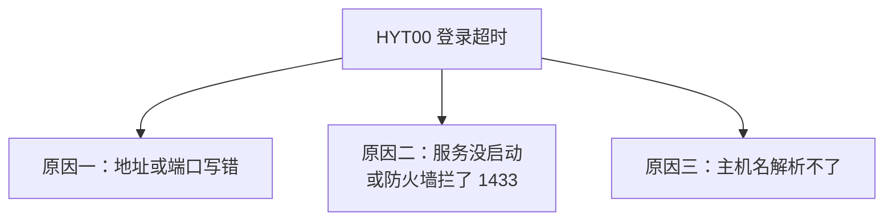

**所以看到 `HYT00` 时，光看错误信息是无法定位的**，必须自己动手确认网络可达（`ping` 主机、`telnet` 端口）。

这也是为什么我把排查方向直接写进了错误提示：

```python
        "HYT00": (
            f"登录超时（{config.login_timeout} 秒内没连上）。"
            "这一个错误码对应三种完全不同的原因："
            "① 服务器地址或端口写错；② 数据库服务没启动或防火墙拦了 1433 端口；"
            "③ 主机名解析不了。请先用 telnet 或 ping 确认网络可达。"
        ),
```

**实测（真实驱动）的实际输出：**

```text
【端口没人监听】
  数据库操作失败（SQLSTATE=HYT00）：登录超时（3 秒内没连上）。这一个错误码对应三种完全不同的原因：① 服务器地址或端口写错；② 数据库服务没启动或防火墙拦了 1433 端口；③ 主机名解析不了。请先用 telnet 或 ping 确认网络可达。
    驱动原始信息：[HYT00] [Microsoft][ODBC Driver 18 for SQL Server]Login timeout expired (0) (SQLDriverConnect)
  密码是否泄露在错误信息里: False

【驱动名写错】
  数据库操作失败（SQLSTATE=01000）：驱动名对不上（多半是拼写错误，或者驱动没装）。同样用 pyodbc.drivers() 核对。
    驱动原始信息：[01000] [unixODBC][Driver Manager]Can't open lib 'ODBC Driver 99 for SQL Server' : file not found (0) (SQLDriverConnect)
  密码是否泄露在错误信息里: False
```

注意最后一行：**错误信息里没有带出密码。**这不是巧合——`describe_pyodbc_error` 只取 SQLSTATE 和驱动信息，不打印连接字符串。

### 10.6.3 完整的错误码对照表

需要真实 SQL Server 才能触发的几个，依据微软官方文档补齐：

| SQLSTATE | 含义 | 排查方向 |
|---|---|---|
| `IM002` | 找不到数据源/驱动 | `DRIVER=` 是否写了、名字是否对 |
| `01000` | 驱动库打不开 | 驱动没装，或名字拼错 |
| `HYT00` | 登录超时 / 查询超时 | **三种原因，见上文** |
| `08001` | 无法建立连接 | 语法错、TCP/IP 未启用、**证书校验失败** |
| `28000` | 登录失败 | 账号密码错、账号无权限、未启用混合验证模式 |
| `42000` | 数据库不存在或无权访问 | `DB_DATABASE` 的值 |
| `42S02` | 表或视图不存在 | 表名、**是否要带架构名 `dbo.`** |

### 10.6.4 pyodbc 的异常层级

**实测（真实驱动）：**

```text
Error              继承自 ['Exception']
InterfaceError     继承自 ['Error']
DatabaseError      继承自 ['Error']
OperationalError   继承自 ['DatabaseError']
ProgrammingError   继承自 ['DatabaseError']
IntegrityError     继承自 ['DatabaseError']
```

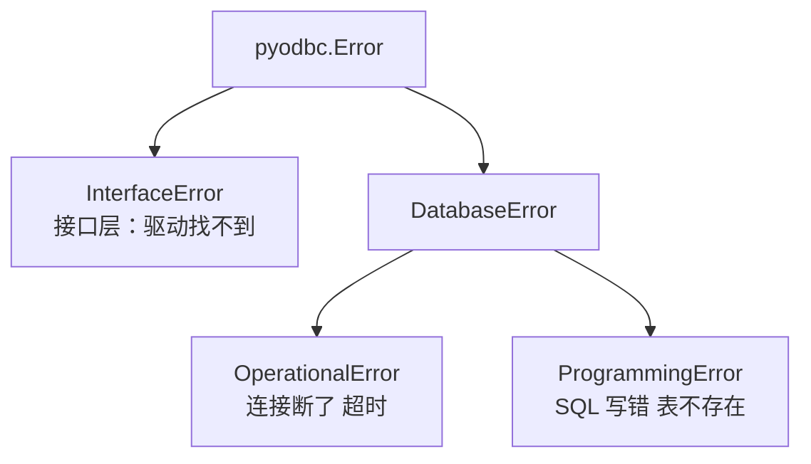

第 4 章 4.5.3 节的规则在这里同样适用：**`except` 要从具体到笼统**，`pyodbc.Error` 必须放最后。

第 12 章会用到 `IntegrityError`——**它就是“唯一约束被违反”时抛出的异常**，那正是防重复发送的关键机制。

---

# 第三部分　把数据取出来

## 10.7 执行查询与读取结果

### 10.7.1 三种取数据的方式

**实测（DB-API 通用）：**

```text
fetchone() 第一次: (1,)
fetchone() 第二次: (2,)
剩下的 fetchall(): [(3,), (4,)]
再 fetchone(): None  ← 取完了返回 None
直接迭代 cursor: [1, 2, 3, 4]
```

| 方法 | 返回 | 适合 |
|---|---|---|
| `fetchone()` | 一行，取完返回 `None` | 只要一行（如取总数） |
| `fetchall()` | 全部行的列表 | 数据量不大时 |
| 直接迭代游标 | 一行一行给 | **数据量大时，不必全装进内存** |

注意 `fetchone()` 和 `fetchall()` 是**接着上次位置往下取**的——上面输出里 `fetchall()` 只拿到了剩下的 `[(3,), (4,)]`。

### 10.7.2 用下标取值的隐患

游标默认返回**元组**，取值只能靠位置：

```python
row = cursor.fetchone()
title = row[1]        # 第 2 个字段
```

问题在于：

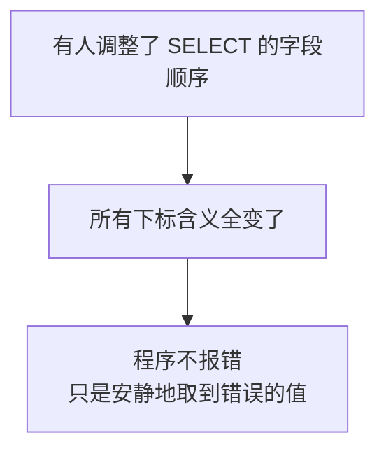

**不报错才是最可怕的。**你会把“负责人”当成“标题”发出去，而三层检查全都通过。

### 10.7.3 所以要转成字典

```python
def column_names(cursor) -> list:
    """
    从游标里取出字段名。

    cursor.description 是 DB-API 规定的属性，它是一个元组的列表，
    每个元组有 7 项，【第一项才是字段名】，其余几项各数据库支持程度不同。
    """
    if cursor.description is None:
        return []
    return [column[0] for column in cursor.description]


def rows_to_dicts(cursor) -> list:
    """
    把查询结果变成"字典的列表"。

    为什么要转成字典？
        游标默认给的是元组，取值只能靠位置：row[0]、row[1]……
        一旦 SELECT 的字段顺序变了，所有下标就全错，而且【不会报错】，
        只会安静地取到错误的值。用字段名取值就没这个问题。

    返回:
        [{'编号': 1, '标题': '...'}, ...]
        查不到数据时返回空列表 []（不是 None）
    """
    names = column_names(cursor)
    return [dict(zip(names, row)) for row in cursor.fetchall()]
```

**实测（DB-API 通用）：**

```text
column_names -> ['待办编号', '标题', '负责人', '金额']
rows_to_dicts ->
    {'待办编号': 1, '标题': '采购申请审批', '负责人': 'zhangsan', '金额': 12500.5}
    {'待办编号': 2, '标题': '合同复核', '负责人': 'zhangsan', '金额': None}
    {'待办编号': 3, '标题': '月度报表提交', '负责人': 'lisi', '金额': 0.0}
```

### 10.7.4 `cursor.description` 长什么样

**实测（DB-API 通用）：**

```text
description 原始: ('编号', None, None, None, None, None, None)
提取字段名     : ['编号', '标题', '金额']
```

DB-API 规定它是**七元组**：字段名、类型码、显示大小、内部大小、精度、小数位数、是否可空。**除第一项外，各数据库的支持程度不一**（上面 sqlite3 全给了 `None`），所以只用第一项最保险。

> 顺带一个提醒：如果 SQL 里用了 `COUNT(*)` 这类表达式而没起别名，字段名可能是个奇怪的值。**所以聚合查询一定要写 `AS 别名`**，本章的 `query_one` 示例就是这么做的。

### 10.7.5 封装成两个便捷函数

```python
def query_all(connection, sql: str, params=None) -> list:
    """
    执行查询并返回全部结果（字典列表）。

    参数:
        sql:    SQL 语句，占位符用【问号 ?】
        params: 参数元组或列表

    注意 pyodbc 的占位符是 ? 而不是 %s（它的 paramstyle 是 qmark）。
    """
    # closing() 保证游标一定被关掉。
    # 为什么不直接 with connection.cursor()：
    #   DB-API 里 with 连接对象的语义是"提交事务"，【不是关闭】（见 10.10 节）。
    #   游标本身支持 with，但用 closing 语义更明确、也更通用。
    with closing(connection.cursor()) as cursor:
        try:
            if params:
                cursor.execute(sql, params)
            else:
                cursor.execute(sql)
            return rows_to_dicts(cursor)
        except pyodbc.Error as error:
            raise DatabaseError(
                f"查询失败（SQLSTATE={error.args[0] if error.args else '未知'}）："
                f"{str(error.args[1])[:200] if len(error.args) > 1 else error}"
            ) from error
```

**实测（DB-API 通用，用 sqlite3 连接跑的）：**

```text
query_all -> [{'待办编号': 1, '标题': '采购申请审批'}, {'待办编号': 2, '标题': '合同复核'}, {'待办编号': 3, '标题': '月度报表提交'}]
query_one -> {'总数': 3}
query_one 查不到 -> None
```

---

## 10.8 查不到数据和 NULL

### 10.8.1 查不到数据返回空列表，不是 `None`

**实测（DB-API 通用）：**

```text
返回值: []  类型: list  长度: 0  布尔值: False
用 if not rows: 判断是否安全: True
```

**这个设计很重要。**如果查不到就返回 `None`，调用方写 `for row in rows:` 会直接崩。而返回空列表，循环自然什么都不做。

所以第 11 章的判断可以放心写成：

```python
rows = query_all(conn, sql, params)
if not rows:
    print("今天没有需要提醒的事项，跳过发送")
    return True
```

> 第 6 章讲过“空名单必须在本地拦下”。**空查询结果是空名单最常见的来源**，两处呼应上了。

### 10.8.2 `NULL` 变成 `None`，直接计算会崩

**实测（DB-API 通用）：**

```text
金额为 NULL 的行: {'待办编号': 2, '标题': '合同复核', '负责人': 'zhangsan', '金额': None}
值: None   is None: True
直接乘以 2 -> TypeError: unsupported operand type(s) for *: 'NoneType' and 'int'
正确写法（or 0）: 0
```

这是从数据库取数据最常见的运行时错误。而它有一个恶劣特点：

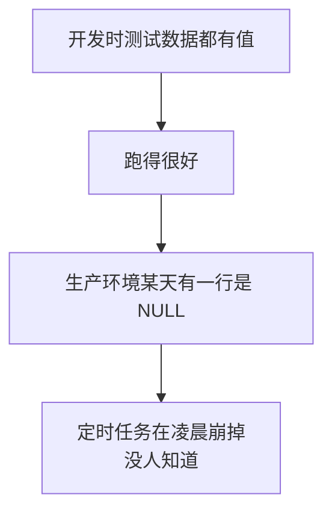

### 10.8.3 三种处理办法

| 办法 | 写法 | 适合 |
|---|---|---|
| Python 侧兜底 | `(row["金额"] or 0)` | 简单，但要每处都记得 |
| **SQL 侧兜底** | `ISNULL(金额, 0) AS 金额` | **推荐**，一次写好 |
| 显式区分 | `if row["金额"] is None: "未填写"` | 需要区分“0”和“没填”时 |

**推荐在 SQL 里用 `ISNULL()`**（SQL Server 的写法，标准 SQL 是 `COALESCE()`）：

```sql
SELECT 待办编号,
       标题,
       ISNULL(金额, 0)          AS 金额,
       ISNULL(备注, '')         AS 备注
FROM 待办事项
WHERE 状态 = ?
```

**理由：数据清洗放在离数据最近的地方。**否则你得在每一处用到它的 Python 代码里都记得兜底，而“记得”是不可靠的。

注意第三种情况：如果“金额为 0”和“金额没填”业务含义不同，就**不能**用 `ISNULL(金额, 0)` 抹掉差别——上面实测数据里第 3 行金额就是真的 `0`，和第 2 行的 `None` 是两回事。

### 10.8.4 别忘了日期和 `Decimal`

第 4 章 4.3.5 节实测过：**`datetime` 对象不能直接放进 JSON**。

```text
TypeError: Object of type datetime is not JSON serializable
```

从 SQL Server 取出来的 `datetime` 字段就是 `datetime` 对象，`decimal` 字段是 `Decimal` 对象，**两者都不能直接塞进消息**。必须先格式化成字符串：

```python
"截止时间": row["截止时间"].strftime("%m-%d %H:%M")
"金额": f"{row['金额']:,.2f}"
```

第 11 章 11.7 节会专门处理格式化。**但注意：如果那个字段可能是 `None`，`None.strftime()` 一样会崩**——所以要先兜底。

---

## 10.9 使用参数化查询防止 SQL 注入

### 10.9.1 拼字符串的后果，实测给你看

**实测（DB-API 通用）：**

```text
恶意输入: "zhangsan' OR '1'='1"
拼接出的 SQL: SELECT * FROM 待办事项 WHERE 负责人 = 'zhangsan' OR '1'='1'
拼接方式查出: 4 行  ← 条件被绕过，全表都出来了
参数化查出  : 0 行  ← 整个字符串被当成一个名字
```

看清了：本来只该查“某个人的待办”，结果**把全表 4 行都查出来了**——包括别人的、以及已完成的。

对本教程的业务含义很具体：**别人的待办事项被发到了这个人的企业微信上。**

### 10.9.2 更狠的情况：表被删掉

**实测（DB-API 通用）：**

```text
恶意输入: "x'; DROP TABLE 重要数据; --"
参数化执行 -> 0 行；表还在吗: 在， 1 行数据
说明：参数化不仅防绕过，还防这类破坏性语句
```

参数化之后，那一整串东西只是**一个普通的名字**，数据库不会把它当命令执行。

### 10.9.3 正确写法

```python
# 正确：SQL 里放问号，值单独传
cursor.execute("SELECT * FROM 待办事项 WHERE 负责人 = ?", ("zhangsan",))

# 错误：把值拼进 SQL
cursor.execute(f"SELECT * FROM 待办事项 WHERE 负责人 = '{user}'")
```

三条注意：

1. **占位符是 `?`**（pyodbc 的 `paramstyle` 是 `qmark`，10.3.1 节实测过）；
2. **参数必须是元组或列表**，单个参数也要写成 `("zhangsan",)`——**那个逗号不能少**，否则 `("zhangsan")` 只是个字符串；
3. **问号周围不要加引号**，写成 `= '?'` 就变成了查找字面量问号。

### 10.9.4 “反正参数是我自己写的，没人能注入”——不成立

新手常有这个想法：“负责人是从数据库查出来的，不是用户输入的，没风险。”

两个反驳：

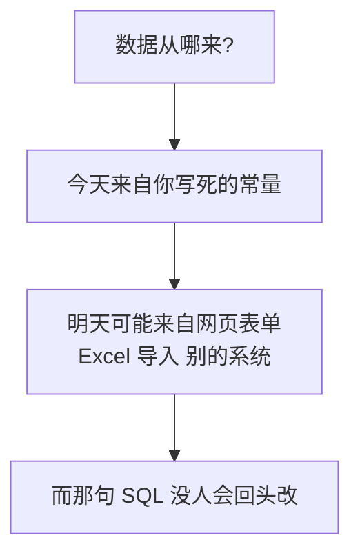

第二个理由更实在：**参数化还顺手解决了引号转义问题。**假设某个人的名字里带一个英文单引号（`O'Brien`），拼接方式会直接把 SQL 语法搞坏，报一个莫名其妙的错。

> **规则：任何变量进 SQL，一律参数化。没有例外，不需要判断“这个值安不安全”。**

### 10.9.5 参数化不能用在哪

有一件事参数化**做不到**：**替换表名、字段名、`ORDER BY` 的字段**。

```python
cursor.execute("SELECT * FROM ?", ("待办事项",))          # 不行
cursor.execute("SELECT * FROM 待办事项 ORDER BY ?", ("金额",))  # 不行
```

因为参数只能是**值**，不能是 SQL 的结构部分。

如果确实需要动态表名或排序字段，唯一安全的做法是**用白名单**：

```python
ALLOWED_ORDER = {"截止时间", "金额", "待办编号"}

if order_by not in ALLOWED_ORDER:
    raise ValueError(f"不允许按 {order_by} 排序")

sql = f"SELECT * FROM 待办事项 ORDER BY {order_by}"   # 已确认在白名单里
```

**关键是“只允许列表里的几个值”，而不是“检查它像不像坏东西”。**

---

# 第四部分　安全收尾

## 10.10 确保连接被关闭

### 10.10.1 一个反直觉的事实：`with 连接` 不会关闭连接

这是 pyodbc（以及整个 DB-API）最容易误解的一处。

很多人以为：

```python
with pyodbc.connect(conn_str) as conn:
    ...
# 以为连接关了
```

**它没关。**pyodbc 官方文档明确说明：`with` 语句在退出时调用的是 `commit()`，**并且连接不会被关闭**。这里的“上下文”指的是**一个数据库事务**，而不是连接。

**实测（DB-API 通用，`sqlite3` 行为一致）：**

```text
离开 with 后连接仍可用（查到 1 行）-> with 只提交事务，不关闭连接
```

### 10.10.2 正确的写法：`contextlib.closing`

pyodbc 官方文档给出的建议就是用 `contextlib.closing`：

```python
from contextlib import closing

with closing(connect(config)) as conn:
    rows = query_all(conn, sql, params)
# 这里连接一定关了
```

**实测（DB-API 通用）：**

```text
用 closing() 包裹后再用 -> ProgrammingError: Cannot operate on a closed database.
```

连接**真的关闭了**——再用就报错。

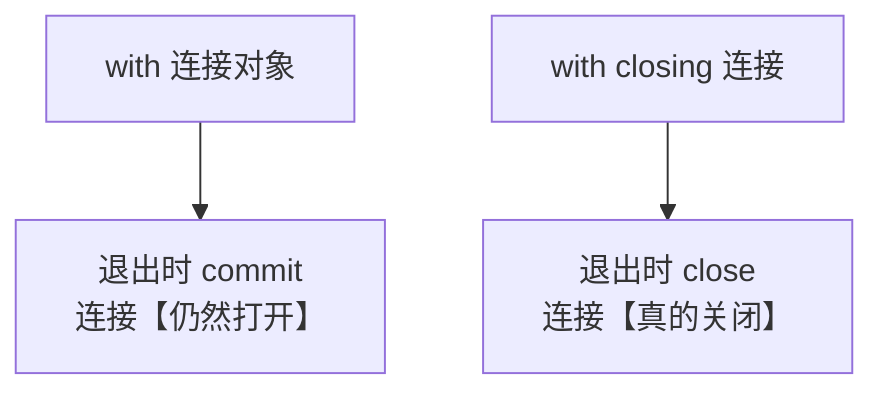

### 10.10.3 不关连接会怎样

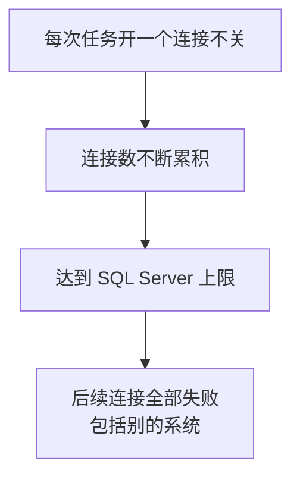

对第 9 章的常驻定时任务来说这个风险是真实的：**程序跑一个月，每天泄漏几个连接，最后把数据库的连接数占满**——而且受害的不只是你的程序。

### 10.10.4 还有一件事：`close()` 会丢掉未提交的修改

pyodbc 官方文档明确警告：`close()` 时，**这个连接上未提交的修改会被回滚并永久丢失**。

本章只做查询，所以无所谓。但第 12 章要写发送记录，**那时候忘记 `commit()` 就等于什么都没写**——而程序不会报错。请现在就记下这一点。

### 10.10.5 `autocommit` 的默认值

依据 pyodbc 官方文档：

| | 值 |
|---|---|
| Python DB-API 规定的默认值 | `False` |
| ODBC 本身的默认值 | `True` |
| **pyodbc 采用** | **`False`**（遵循 DB-API） |

官方文档还有一句建议：**通常你会希望在创建连接时就把 `autocommit` 设为 `True`**。

本章保持默认 `False`，因为只做查询。第 12 章写发送记录时会讨论该不该开——那里需要“先占位再发送”的事务控制，**恰恰是不能随便开 autocommit 的场景**。

---

## 10.11 数据库超时和错误处理

### 10.11.1 两种超时再确认一次

| 超时 | 设置方式 | 触发时的 SQLSTATE |
|---|---|---|
| 登录超时 | `pyodbc.connect(..., timeout=N)` | `HYT00`（实测确认） |
| 查询超时 | `connection.timeout = N` | `HYT00` 或 `HYT01`（依据 pyodbc 文档） |

注意两者**报同一个错误码 `HYT00`**——所以日志里必须写清当时在做什么，否则分不出是连不上还是查得慢。

### 10.11.2 为什么定时任务里必须设查询超时

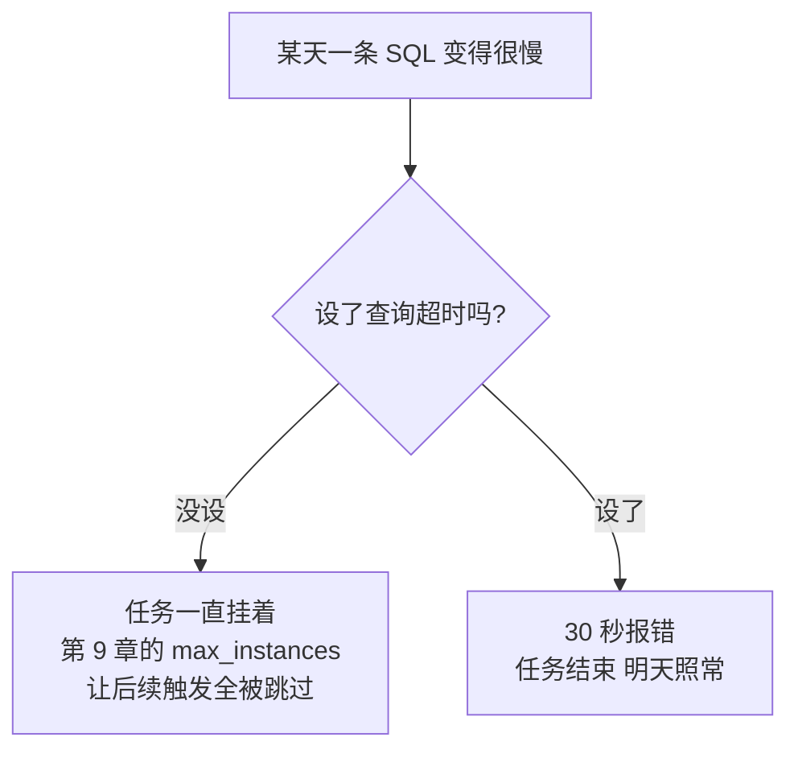

**不设查询超时，一条慢 SQL 能让你的定时任务彻底停摆**——而且第 9 章讲过，`max_instances=1` 会让后续每次触发都被跳过，只在 APScheduler 的日志里留下一行警告。

### 10.11.3 统一的错误翻译

```python
def describe_pyodbc_error(error: pyodbc.Error, config: DatabaseConfig) -> str:
    """
    把 pyodbc 的错误翻译成一句人话 + 给出排查方向。

    为什么值得写这个函数？
        ODBC 的错误信息对新手极不友好，而且【同一个错误码
        可能对应完全不同的原因】（实测见 10.11.2 节）。
        与其每次去搜索 SQLSTATE，不如把排查方向直接写在提示里。
    """
```

### 10.11.4 为什么要包一层 `DatabaseError`

```python
class DatabaseError(Exception):
    """
    数据库相关错误的统一出口。

    为什么要包一层，不直接让 pyodbc 的异常往外抛？
        因为上层（第 11 章的任务函数）不该关心 ODBC 的 SQLSTATE。
        它只需要知道"数据库这边失败了，原因是这句人话"。
        另外 pyodbc 的异常信息里常常包含完整连接字符串 ——
        那里面有密码（见 10.11.4 节）。
    """
```

第二条理由是安全考虑，和第 3 章 3.5.2 节“不要打印网络异常内容”是同一个道理：**异常信息可能替你打印出密码。**

第 9 章的任务函数已经有 `except Exception` 兜底了，但那会打印完整堆栈——**堆栈里可能就有连接字符串**。所以在数据库层就转换成安全的 `DatabaseError`，才是稳妥的做法。

---

## 10.12 本章完成标志

### 10.12.1 一个可以直接跑的验证脚本

```python
"""
数据库连接自检（第 10 章）

作用：确认能连上 SQL Server 并正确取出数据。不发送任何消息。

运行：python check_database.py
"""

from contextlib import closing

import database as db


def main() -> None:
    print("=" * 60)
    print("数据库连接自检")
    print("=" * 60)

    # 第 1 步：读配置
    try:
        config = db.load_database_config()
    except db.DatabaseError as error:
        print(f"[配置错误] {error}")
        return

    print(f"[1/4] 配置已加载：{config}")

    # 第 2 步：看连接字符串拼对了没有（密码已打码）
    conn_str = db.build_connection_string(config)
    print(f"[2/4] 连接字符串：{db.mask_connection_string(conn_str)}")

    # 第 3 步：连接并查询
    try:
        with closing(db.connect(config)) as connection:
            print("[3/4] 连接成功")

            version = db.query_one(connection, "SELECT @@VERSION AS 版本")
            print(f"       服务器版本：{version['版本'].splitlines()[0]}")

            now = db.query_one(connection, "SELECT GETDATE() AS 当前时间")
            print(f"       数据库时间：{now['当前时间']}")

            # 换成你自己的表名试一下
            rows = db.query_all(
                connection,
                "SELECT TOP 5 name AS 表名 FROM sys.tables ORDER BY name",
            )
            print(f"[4/4] 查到 {len(rows)} 张表：")
            for row in rows:
                print(f"       - {row['表名']}")

    except db.DatabaseError as error:
        print(f"[失败] {error}")
        return

    print("-" * 60)
    print("自检通过：数据库可以正常连接和查询。")
```

注意几处细节：

- `mask_connection_string` 让你能**安全地把这段输出贴给别人看**；
- 用 `sys.tables` 而不是你自己的表——这样即使表名还没建好也能验证连接；
- 全程用 `closing()` 确保连接关闭。

### 10.12.2 自查清单

- [ ] `python -c "import pyodbc; print(pyodbc.drivers())"` 能列出 SQL Server 驱动
- [ ] `.env` 里的 `DB_DRIVER` 和列表里的名字**完全一致**
- [ ] 连接字符串打印出来时，**密码是打码的**
- [ ] `SELECT @@VERSION` 能返回服务器版本
- [ ] 查询自己的业务表，结果显示为**字典**（能看到字段名）
- [ ] 故意把 `DB_SERVER` 改错，看到 `HYT00` 和三种原因的提示
- [ ] 故意把 `DB_DRIVER` 改错一个字母，看到 `01000` 的提示
- [ ] 故意把密码改错，看到 `28000` 的提示

### 本章完成标志

> 终端里正确显示出 SQL Server 的查询结果，且每行是带字段名的字典。

---

## 10.13 本章改动清单

### 新增文件 `database.py`

| 内容 | 说明 |
|---|---|
| `DatabaseError` | 数据库错误统一出口 |
| `DatabaseConfig` | 配置类，`__repr__` **隐藏密码** |
| `load_database_config()` | 读取并校验配置 |
| `build_connection_string()` | **纯函数**，可直接检查 |
| `mask_connection_string()` | **密码打码** |
| `connect()` | 建连接 + 设查询超时 |
| `describe_pyodbc_error()` | SQLSTATE 翻译成排查方向 |
| `column_names()` | 取字段名 |
| `rows_to_dicts()` | 结果转字典列表 |
| `query_all()` / `query_one()` | 便捷查询 |

### 新增文件 `check_database.py`

数据库自检脚本，和第 2 章的 `check_config.py` 同一个思路：**把问题分层，一次只验证一件事。**

### `.env` 新增

`DB_SERVER`、`DB_DATABASE`、`DB_USERNAME`、`DB_PASSWORD`、`DB_TRUSTED_CONNECTION`、`DB_DRIVER`、`DB_ENCRYPT`、`DB_TRUST_SERVER_CERTIFICATE`、`DB_LOGIN_TIMEOUT`、`DB_QUERY_TIMEOUT`

### 新增依赖

```bash
python -m pip install pyodbc
python -m pip freeze > requirements.txt
```

Linux 还需要系统级的 unixODBC 和微软的 `msodbcsql18`。

### 其他文件

**本章无改动。**企业微信相关代码一行没动——这正是第 5 章分层的好处。

---

## 10.14 本章小结

### 10.14.1 本章必须带走的 10 条结论

1. **`pyodbc` 只是转接头**，还要单独装 ODBC 驱动（Linux 另需 unixODBC）。
2. **先跑 `pyodbc.drivers()`**，驱动名必须完全一致。
3. **Driver 18 默认加密**，内网自签名证书需要 `TrustServerCertificate=yes`，而它的代价是放弃证书校验。
4. **端口用逗号分隔**：`SERVER=host,1433`。
5. **占位符是 `?`**，不是 `%s`；单个参数别忘了那个逗号。
6. **`HYT00` 对应三种完全不同的原因**，必须自己确认网络可达。
7. **结果转字典**，别用下标——字段顺序变了不会报错，只会取错值。
8. **`NULL` 变 `None`，直接计算会崩**，优先在 SQL 里 `ISNULL()` 兜底。
9. **`with 连接` 只提交事务、不关闭连接**，要用 `contextlib.closing`。
10. **连接字符串含密码**，打印前必须打码。

### 10.14.2 自测题

1. `pip install pyodbc` 成功了，为什么还可能报“找不到驱动”？（10.2.1）
2. 从驱动 17 升到 18 后突然连不上，最可能是什么原因？（10.2.4）
3. `pyodbc.connect(timeout=10)` 和 `conn.timeout = 10` 分别管什么？（10.5.2）
4. 看到 `HYT00 Login timeout expired`，有哪三种可能原因？（10.6.2）
5. 为什么要把查询结果转成字典，而不是用 `row[0]`、`row[1]`？（10.7.2）
6. `ISNULL(金额, 0)` 在什么情况下**不该**用？（10.8.3）
7. 参数化查询能用来替换表名吗？不能的话该怎么办？（10.9.5）
8. `with pyodbc.connect(...) as conn:` 退出时做了什么、没做什么？（10.10.1）

### 10.14.3 下一章预告

第 11 章把两半接起来：**从 SQL Server 查出待办事项，按负责人分组，每人发一条汇总消息。**

那一章要处理的问题包括：

| 问题 | 呼应本章 |
|---|---|
| 日期和金额怎么格式化 | 10.8.4 节 |
| 一个人有 50 条待办、消息超长怎么办 | 第 7 章 7.8 节的分页 |
| 查不到数据要不要发“暂无数据” | 10.8.1 节 |
| 负责人字段是空的怎么办 | 第 6 章的空名单校验 |

另外第 9 章 9.6.4 节说过“法定节假日需要自己维护一张表”——**现在有地方放这张表了。**

---

## 参考的官方文档

1. [Microsoft：ODBC Driver 18.0 for SQL Server 发布说明](https://techcommunity.microsoft.com/blog/sqlserver/odbc-driver-18-0-for-sql-server-released/3169228) —— **`Encrypt` 默认值从 `no` 改为 `yes` 的破坏性变更**
2. [Microsoft：升级驱动后证书链不受信任](https://learn.microsoft.com/troubleshoot/sql/database-engine/connect/certificate-chain-not-trusted) —— 新旧驱动加密默认值差异导致的证书校验失败
3. [Microsoft：ODBC 驱动连接加密故障排查](https://learn.microsoft.com/sql/connect/odbc/connection-troubleshooting) —— 版本 18 起默认启用连接加密
4. [Microsoft：OLE DB 驱动的加密与证书验证](https://learn.microsoft.com/sql/connect/oledb/features/encryption-and-certificate-validation) —— 信任服务端证书的中间人攻击风险
5. [pyodbc 官方 Wiki：Connection](https://github.com/mkleehammer/pyodbc/wiki/Connection) —— `autocommit` 默认值、`timeout` 与连接超时的区别、`close()` 会丢弃未提交修改、**上下文管理器只提交不关闭 + 推荐 `contextlib.closing`**

> 本章 `pyodbc` 与 ODBC 驱动的行为在 Python 3.9.25 + pyodbc 5.3.0 + Microsoft ODBC Driver 18.6.2.1 环境中实际运行验证；DB-API 通用行为用 `sqlite3` 验证；需要真实 SQL Server 实例才能触发的行为依据上述官方文档整理并重新表述（内容已为遵守许可限制而改写）。请以你本机实际运行结果和最新官方文档为准。
