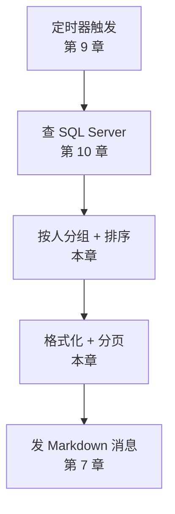
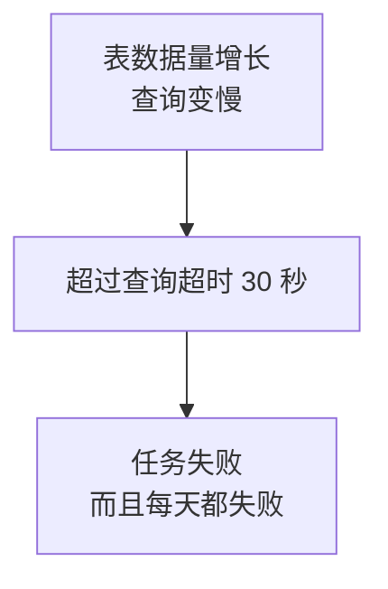
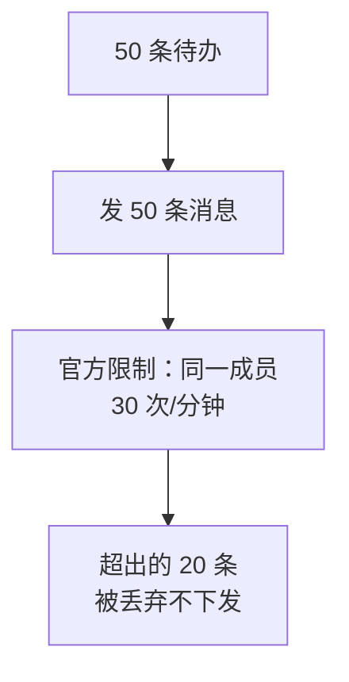
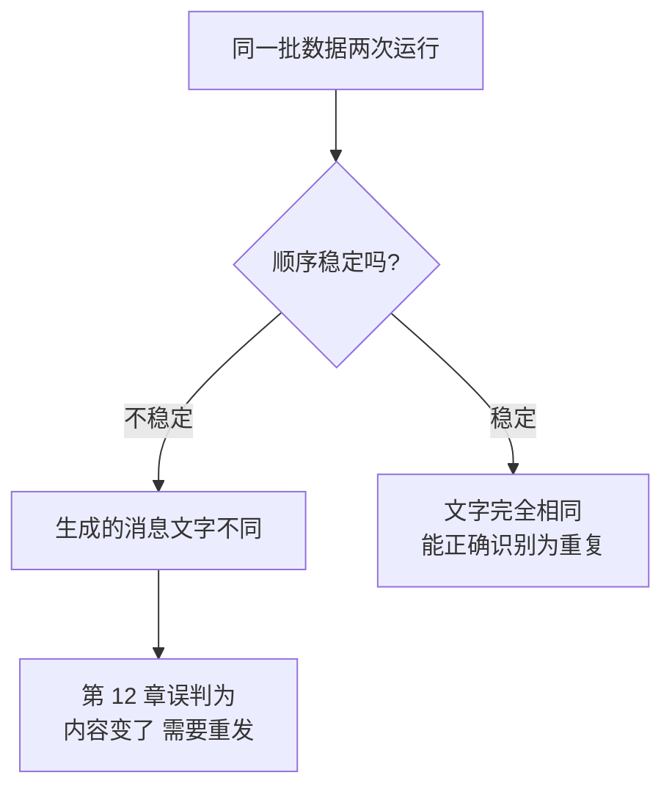
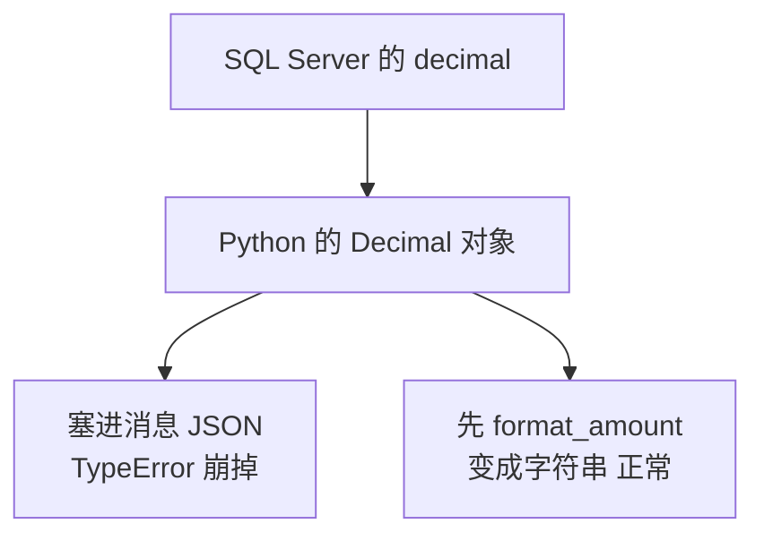
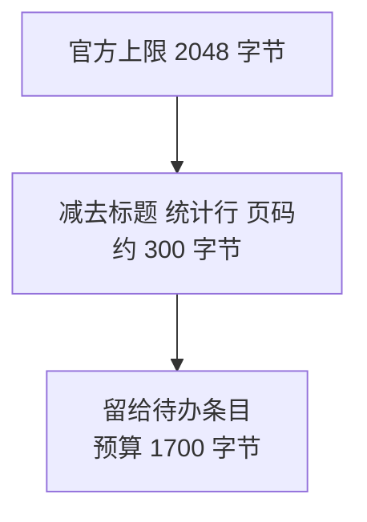
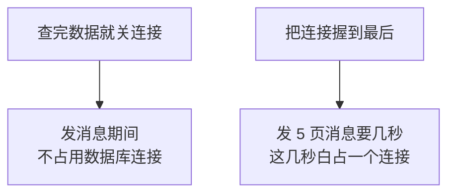
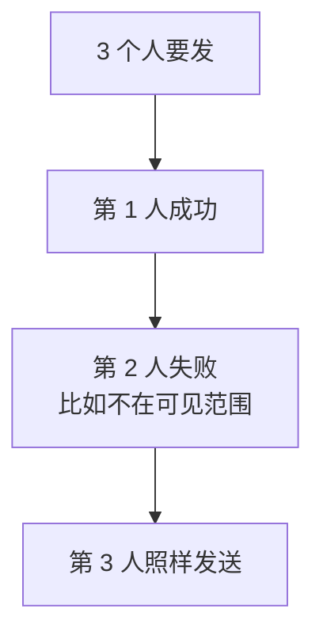
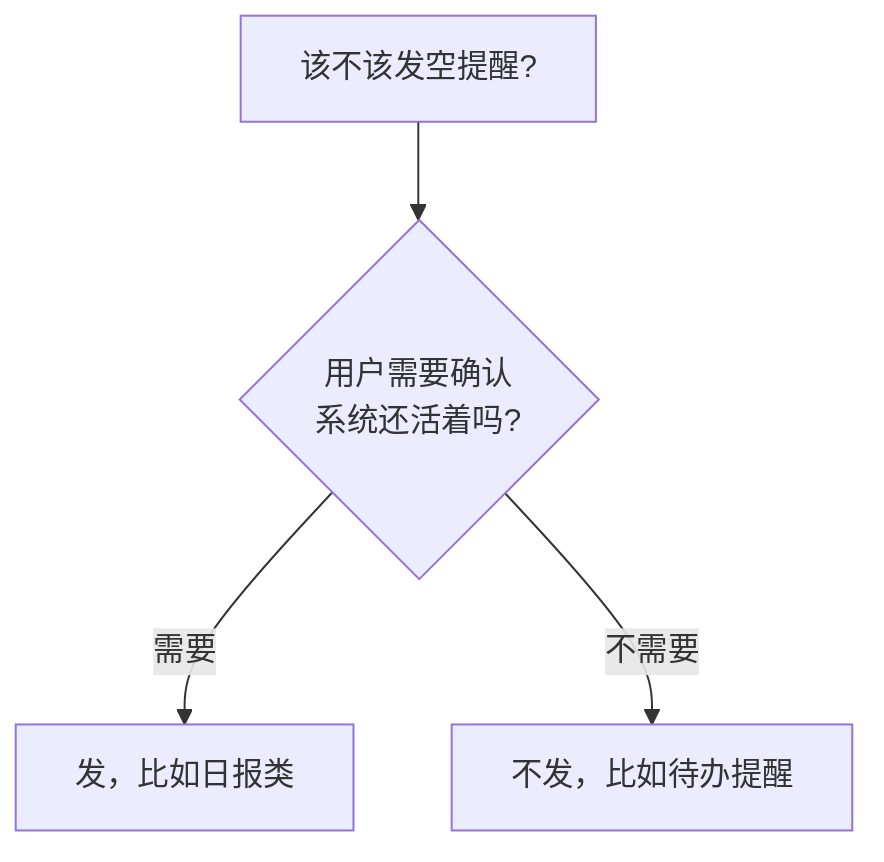
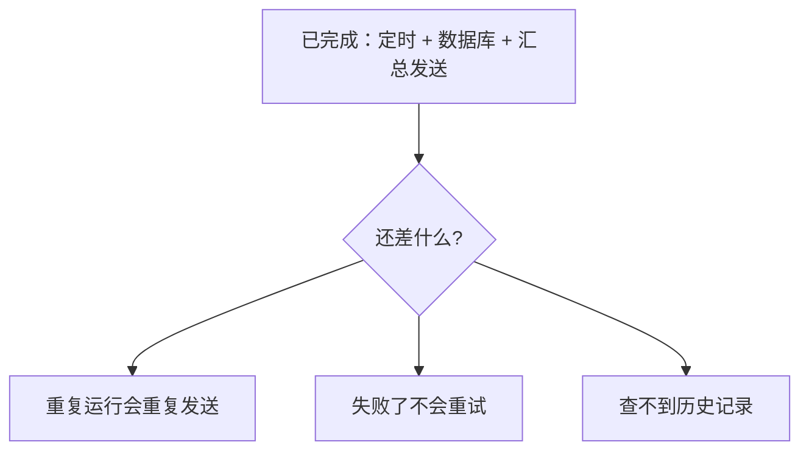

# 第 11 章　把 SQL Server 表格信息整理成企业微信消息

> 所属教程：《Python 调用企业微信应用消息 API：从入门到定时、数据库与防重复发送》  
> 前置章节：第 10 章（能连上 SQL Server 并取出数据）  
> 本章目标：**把数据库里的待办变成每人一条的汇总消息，自动发出去。**

**本章把前十章的成果全部接起来。**这是第一次出现完整的业务闭环：



> **关于验证方式**：沙箱里没有可用的 SQL Server 实例，所以本章的验证分两类，文中会标明：
>
> | 标记 | 含义 |
> |---|---|
> | **实测** | 分组、排序、格式化、分页、以及**完整任务链路**（用返回真实数据类型 `datetime`/`Decimal`/`None` 的假连接 + 本地假企业微信服务器）都真跑过 |
> | **未执行验证** | T-SQL 建表脚本本身，只做人工核对 |

---

## 11.1 建立示例业务表

### 11.1.1 表结构里的三个业务决定

```sql
CREATE TABLE dbo.待办事项
(
    待办编号   INT            IDENTITY(1,1) NOT NULL,
    标题       NVARCHAR(200)  NOT NULL,
    /* 负责人存的是【企业微信 UserID】，不是姓名。
       这样查出来就能直接发送，不需要再做一次转换。
       长度按官方说明：UserID 长度为 1~64 个字节。 */
    负责人     VARCHAR(64)    NOT NULL,
    /* 金额允许为 NULL：因为"没填金额"和"金额是 0"业务含义不同 */
    金额       DECIMAL(18, 2) NULL,
    截止时间   DATETIME       NOT NULL,
    状态       VARCHAR(20)    NOT NULL CONSTRAINT DF_待办事项_状态 DEFAULT ('待处理'),
    备注       NVARCHAR(500)  NULL,
    更新时间   DATETIME       NOT NULL CONSTRAINT DF_待办事项_更新时间 DEFAULT (GETDATE()),

    CONSTRAINT PK_待办事项 PRIMARY KEY CLUSTERED (待办编号)
);
```

三个决定值得说明：

| 决定 | 理由 |
|---|---|
| **负责人存 UserID** | 查出来能直接发。存姓名就得再查一次通讯录 |
| `VARCHAR(64)` | 官方说明 UserID 长度为 1~64 字节 |
| **金额允许 NULL** | “没填”和“是 0”是两件事（第 10 章 10.8.3 节） |

### 11.1.2 索引不是可选项

```sql
/* 查询条件是"状态 + 截止时间 + 负责人"，所以按这个顺序建索引。
   没有索引时，表一大查询就会慢，而慢查询会让定时任务超时
   （第 10 章 10.11.2 节讲过后果）。 */
CREATE NONCLUSTERED INDEX IX_待办事项_状态_截止时间
    ON dbo.待办事项 (状态, 截止时间)
    INCLUDE (负责人);
```

**为什么本章要提索引？**因为这是定时任务，查询慢的后果比手工查询严重得多：



### 11.1.3 示例数据刻意造了七种情况

```sql
INSERT INTO dbo.待办事项 (标题, 负责人, 金额, 截止时间, 状态, 备注)
VALUES
    /* 已逾期：显示"已逾期 N 天"，用醒目颜色 */
    (N'上月采购发票补录',     'zhangsan', 3200.00,  DATEADD(DAY, -2, GETDATE()), N'待处理', N'财务催办'),
    /* 今天到期：最需要提醒的一类 */
    (N'采购申请审批',         'zhangsan', 12500.50, DATEADD(HOUR, 6, CAST(CAST(GETDATE() AS DATE) AS DATETIME)), N'待处理', NULL),
    /* 金额为 NULL：验证不能显示成 0 */
    (N'合同复核',             'zhangsan', NULL,     DATEADD(DAY, 1, GETDATE()), N'待处理', N'法务已初审'),
    /* 金额为 0：和 NULL 要显示得不一样 */
    (N'免费样品寄送确认',     'zhangsan', 0,        DATEADD(DAY, 2, GETDATE()), N'待处理', NULL),
    /* 另一个负责人：验证按人分组 */
    (N'月度报表提交',         'lisi',     NULL,     DATEADD(DAY, 2, GETDATE()), N'待处理', NULL),
    (N'客户回访记录整理',     'lisi',     880.00,   DATEADD(DAY, 3, GETDATE()), N'待处理', NULL),
    /* UserID 大小写不一致：验证会被统一成小写（第 6 章 6.4 节） */
    (N'季度预算复核',         'LiSi',     50000.00, DATEADD(DAY, 1, GETDATE()), N'待处理', NULL),
    /* 已完成：不该被查出来 */
    (N'上周已完成的事',       'zhangsan', 100.00,   DATEADD(DAY, -5, GETDATE()), N'已完成', NULL),
    /* 太远的：超出提醒范围，不该被查出来 */
    (N'下个月的年度盘点',     'zhangsan', NULL,     DATEADD(DAY, 30, GETDATE()), N'待处理', NULL);
```

**造测试数据的原则：每一条都要对应一个你想验证的问题。**上面九条分别验证：逾期显示、今天到期、NULL 金额、零金额、多负责人、大小写合并、状态过滤、时间范围过滤。

还有一条脏数据：

```sql
/* 一条负责人为空格的脏数据，验证 SQL 里的过滤条件真的生效 */
INSERT INTO dbo.待办事项 (标题, 负责人, 金额, 截止时间, 状态)
VALUES (N'负责人没填的脏数据', '   ', NULL, DATEADD(DAY, 1, GETDATE()), N'待处理');
```

> **一定要造脏数据。**只用干净数据测试，等于没测。生产环境的数据永远比你想象的脏。

### 11.1.4 节假日表

第 9 章 9.6.4 节说过 APScheduler 不认识法定节假日。现在有地方放这张表了：

```sql
CREATE TABLE dbo.节假日
(
    日期     DATE          NOT NULL,
    名称     NVARCHAR(50)  NOT NULL,
    CONSTRAINT PK_节假日 PRIMARY KEY CLUSTERED (日期)
);
```

结构极简单，但要有人维护——**每年年初把国务院公布的放假安排录进去**。这是个管理问题，不是技术问题。

---

## 11.2 查询“当前应该提醒”的记录

### 11.2.1 单独建一层“仓储”

```python
"""
待办数据访问模块：只负责"从数据库把该提醒的记录查出来"。

第 11 章新增的文件。

为什么要单独一层（通常叫"仓储 / Repository"）？
    1. SQL 集中在一处，改查询条件不用翻业务代码
    2. 业务代码拿到的是干净的 Python 字典，不关心 SQL 长什么样
    3. 测试时可以换成一个"假仓储"返回固定数据，不需要真数据库
"""
```

**第三条在本章的验证里真的用上了**——我就是靠替换成假仓储，才能在没有 SQL Server 的环境里跑完整条链路。

### 11.2.2 查询语句

```python
SELECT_PENDING_TODOS = """
SELECT 待办编号,
       标题,
       LOWER(LTRIM(RTRIM(负责人))) AS 负责人,
       金额,
       截止时间,
       状态,
       ISNULL(备注, '') AS 备注,
       更新时间
FROM dbo.待办事项
WHERE 状态 = ?
  AND 截止时间 < DATEADD(DAY, ?, CAST(GETDATE() AS DATE))
  AND 负责人 IS NOT NULL
  AND LTRIM(RTRIM(负责人)) <> ''
ORDER BY 负责人, 截止时间, 待办编号
"""
```

### 11.2.3 这句 SQL 里的五个刻意选择

```python
# 几个刻意的写法：
#   1. 明确列出字段，不写 SELECT *
#      —— 表加字段时不会影响程序；也让 rows_to_dicts 的键名可预期
#   2. ISNULL(备注, '')
#      —— 在离数据最近的地方兜底（第 10 章 10.8.3 节）
#      注意【金额没有 ISNULL】：因为"金额为空"和"金额为 0"业务含义不同
#   3. 负责人不为空的过滤
#      —— 负责人是空的记录发不出去，在 SQL 里就排除掉
#   4. ORDER BY 负责人, 截止时间
#      —— 让同一个人的记录挨在一起，分组时更直观
#   5. 占位符用 ?（第 10 章 10.3.1 节：pyodbc 的 paramstyle 是 qmark）
```

**第 1 条和第 2 条值得展开。**

**不写 `SELECT *`**：因为 `rows_to_dicts` 的键名来自 `SELECT` 的字段。写 `*` 的话，某天有人给表加了一个字段，你的字典就多出一个键——虽然不会报错，但如果新字段叫 `金额2` 之类，排查起来很费劲。**明确列出字段，程序的输入就是可预期的。**

**`LOWER(LTRIM(RTRIM(负责人)))`**：在 SQL 里就把 UserID 统一成小写、去掉空格。这是第 6 章 6.4 节那条规则的**第三道防线**——配置入口转过、名单清洗转过、现在数据库出口再转一次。

> **为什么同一个规则要执行三次？**因为数据可以从三个不同的地方进来。**任何一个入口漏了，第 12 章的防重复就会失效。**

### 11.2.4 `截止时间 < DATEADD(DAY, ?, CAST(GETDATE() AS DATE))` 的含义

拆开看：

| 部分 | 作用 |
|---|---|
| `CAST(GETDATE() AS DATE)` | 取今天的**零点**，抹掉时分秒 |
| `DATEADD(DAY, 3, ...)` | 加 3 天 |
| `截止时间 <` | 截止时间在这之前的都算 |

所以传 `days_ahead=3` 时，查的是“**截止时间在 3 天内（含已经逾期的）**”。

**为什么要 `CAST(... AS DATE)` 抹掉时分秒？**否则查询结果会随运行时刻漂移：早上 9 点跑和晚上 9 点跑，边界差 12 小时，同一条记录可能今天查得到、明天查不到。**定时任务需要稳定的边界。**

---

## 11.3 一条记录 vs 一条汇总：为什么必须汇总

### 11.3.1 最自然的想法是错的

新手最直觉的做法：**查到 N 条待办，就发 N 条消息。**



**实测对比：**

```text
汇总方式：50 项 -> 5 条消息
如果一条待办发一条：50 条消息
而官方限制：同一成员 30 次/分钟 -> 超出的 20 条【会被丢弃不下发】
```

注意“**丢弃不下发**”这个措辞——官方的表述就是这样。**它不会报错**，你的程序会认为 50 条全都发成功了，而用户只收到 30 条。

### 11.3.2 还有一个更实际的理由

就算没有频率限制，**收到 50 条独立消息的体验是灾难性的**：手机连震 50 下，重要的和不重要的混在一起，反而没人看。

| | 50 条独立消息 | 5 条汇总消息 |
|---|---|---|
| 触发频率限制 | **会** | 不会 |
| 用户体验 | 灾难 | 可接受 |
| 能看出优先级吗 | 不能 | **能，逾期的排最前** |

**结论：一个人一条（或几条）汇总，这是本章的核心设计。**

---

## 11.4 按负责人分组

### 11.4.1 分组函数

```python
def group_by_owner(rows: list) -> dict:
    """
    按负责人把记录分组。

    返回:
        {'zhangsan': [记录, 记录], 'lisi': [记录]}

    为什么要分组？
        因为业务要求是"每人收到一条属于自己的汇总"，
        而不是"一条待办发一条消息"。
        后者的问题见本章 11.4.2 节：会撞上频率限制。

    为什么不在 SQL 里用 GROUP BY？
        GROUP BY 是用来聚合的（求和、计数），
        而我们要的是"把明细按人装进不同的篮子"，这件事在 Python 里做更自然。

    注意用普通 dict：Python 3.7 起 dict 保持插入顺序，
    而 SQL 已经 ORDER BY 负责人，所以分组结果的顺序是稳定的。
    """
    grouped = {}

    for row in rows:
        owner = (row.get("负责人") or "").strip().lower()

        # 负责人为空的记录直接跳过。
        # SQL 里已经过滤了，这里再挡一次 —— 因为这个函数也可能被
        # 别处（比如测试、或以后新增的查询）调用。
        if not owner:
            continue

        # setdefault：键不存在就先放一个空列表，然后返回它
        grouped.setdefault(owner, []).append(row)

    return grouped
```

### 11.4.2 实测：大小写合并 + 脏数据丢弃

输入里刻意混了六种情况：

```text
zhangsan   -> 2 项：['A', 'C']
lisi       -> 2 项：['B', 'D']
分组数: 2  ← ZhangSan 和 zhangsan 合并了，空负责人被丢弃
```

输入是 `zhangsan`、`LiSi`、`ZhangSan`、`lisi`、`"   "`、`None` 六条，输出只有 2 组。

**如果不合并大小写会怎样？**`ZhangSan` 和 `zhangsan` 会各得一条消息——**同一个人收到两条内容不同的汇总**，而每条都只有一半的事项。

### 11.4.3 `setdefault` 这个写法

```python
grouped.setdefault(owner, []).append(row)
```

等价于：

```python
if owner not in grouped:
    grouped[owner] = []
grouped[owner].append(row)
```

一行搞定三行的事。**注意 `setdefault` 返回的是那个列表本身**，所以可以直接 `.append()`。

---

## 11.5 排序：让最紧急的排最前

### 11.5.1 排序函数

```python
def sort_todos(rows: list) -> list:
    """
    给待办排序：越紧急的排在越前面。

    排序规则：
        1. 截止时间早的在前（最紧急的第一眼就看到）
        2. 截止时间相同时按编号，保证顺序稳定

    为什么"顺序稳定"重要？
        因为同一批数据两次运行应该生成【完全相同】的消息文字。
        否则第 12 章判断"内容变没变"时会误判（内容其实没变，只是顺序抖了）。

    没有截止时间的排最后：它不紧急，也不该占据显眼位置。
    """
    def sort_key(row):
        deadline = row.get("截止时间")
        # 元组比较：第一项 0 表示有日期、1 表示没日期，于是没日期的排最后
        if deadline is None:
            return (1, datetime.max, str(row.get("待办编号", "")))
        return (0, deadline, str(row.get("待办编号", "")))

    return sorted(rows, key=sort_key)
```

### 11.5.2 实测

```text
编号 1  已逾期的事          已逾期 2 天
编号 3  今天的事           今天 18:00
编号 7  明天的事           明天 18:00
编号 5  三天后的事          3 天后（09-07 18:00）
编号 9  没有截止时间         未设置截止时间
连续排两次结果是否完全一致: True
```

逾期的在最上面，没有截止时间的在最下面。

### 11.5.3 用元组做排序键的技巧

```python
return (0, deadline, str(row.get("待办编号", "")))
```

Python 比较元组是**逐项比较**的：先比第一项，相同再比第二项，以此类推。所以：

| 第一项 | 效果 |
|---|---|
| `0` | 有截止时间的 |
| `1` | 没截止时间的，**排在所有 `0` 之后** |

这比写复杂的 `if/else` 干净得多。

### 11.5.4 为什么“顺序稳定”是第 12 章的前提



第 12 章要判断“这条消息发过没有”，其中一种方式是比对内容。**如果同样的数据每次生成的文字都不一样，这个判断就废了。**所以排序键里加了编号作为最后的 tie-breaker。

---

## 11.6 处理 NULL 和格式化

### 11.6.1 日期：显示“还有多久”而不是具体日期

```python
def format_deadline(deadline, now: datetime = None) -> str:
    """
    把截止时间格式化成"人话"。

    为什么不直接 strftime("%Y-%m-%d %H:%M")？
        因为收消息的人真正关心的是"还有多久"，而不是具体日期。
        "今天 18:00" 比 "2026-09-04 18:00" 有用得多。

    参数:
        deadline: datetime 对象，也允许是 None
        now:      当前时间，留空则取系统时间（传参是为了方便测试）

    返回:
        例如 "已逾期 2 天"、"今天 18:00"、"明天 12:00"、"09-11 17:30"
    """
    # 第 10 章 10.8.4 节讲过：None.strftime() 会直接崩，所以先兜底
    if deadline is None:
        return "未设置截止时间"

    if now is None:
        now = datetime.now()

    # 只比日期，不比时分。否则"今天 09:00"在下午会被算成逾期，
    # 而业务上它确实逾期了 —— 但我们希望它显示"今天到期"更醒目。
    days = (deadline.date() - now.date()).days
    clock = deadline.strftime("%H:%M")

    if days < 0:
        return f"已逾期 {abs(days)} 天"
    if days == 0:
        return f"今天 {clock}"
    if days == 1:
        return f"明天 {clock}"
    if days <= 7:
        return f"{days} 天后（{deadline.strftime('%m-%d')} {clock}）"

    return deadline.strftime("%m-%d %H:%M")
```

**实测八种情况：**

```text
五天前     (08-30 18:00) -> 已逾期 5 天
昨天      (09-03 18:00) -> 已逾期 1 天
今天      (09-04 18:00) -> 今天 18:00
明天      (09-05 18:00) -> 明天 18:00
三天后     (09-07 18:00) -> 3 天后（09-07 18:00）
七天后     (09-11 18:00) -> 7 天后（09-11 18:00）
一个月后    (10-04 18:00) -> 10-04 18:00
None                   -> 未设置截止时间  ← 不会崩
```

最后一行很关键：**`None` 被兜住了**。如果直接 `deadline.strftime(...)`，遇到 NULL 会抛 `AttributeError`，而这个错误在凌晨三点的定时任务里没人会看到。

### 11.6.2 `now` 作为参数传进来

```python
def format_deadline(deadline, now: datetime = None) -> str:
```

**这是一个很值钱的小设计。**如果函数内部直接 `datetime.now()`，你就**无法测试**“逾期 5 天时显示什么”——因为你没法让时间倒流。

把 `now` 做成参数后，测试里传一个固定时刻就行。上面那张实测表就是这么来的。

> **规则：涉及“当前时间”的函数，把时间作为参数传入。**这让函数从“不可测”变成“可测”。

### 11.6.3 金额：`Decimal`、`None`、`0` 各不相同

```python
def format_amount(value) -> str:
    """
    把金额格式化成带千分位的字符串。

    为什么要单独写：
        1. 数据库里的 decimal 取出来是 Decimal 对象，
           【不能直接放进 JSON】（第 4 章 4.3.5 节实测过）
        2. None 要显示成"—"，不能显示成 0
        3. 12500.5 应该显示成 12,500.50，不然人眼数不清位数
    """
    if value is None:
        return EMPTY_AMOUNT_TEXT

    # Decimal、int、float 都能被 float() 接受；
    # 顺便挡住"数据库里存了字符串"这种脏数据
    try:
        number = float(value)
    except (TypeError, ValueError):
        return str(value)

    # 千分位 + 保留两位小数
    return f"{number:,.2f}"
```

**实测六种输入：**

```text
12500.50      （Decimal ）-> 12,500.50
0             （Decimal ）-> 0.00
None          （NoneType）-> —
880           （int     ）-> 880.00
1234567.891   （float   ）-> 1,234,567.89
脏数据           （str     ）-> 脏数据
注意 None 显示为 —，而 0 显示为 0.00 —— 两者业务含义不同
```

第二行和第三行是重点：**`0` 显示 `0.00`，`None` 显示 `—`**。如果用 `ISNULL(金额, 0)` 在 SQL 里抹平，这个区别就永远丢了。

### 11.6.4 为什么必须格式化：类型进不了 JSON

**实测（第 4 章 4.3.5 节的延续）：**

```text
Decimal    -> TypeError: Object of type Decimal is not JSON serializable
datetime   -> TypeError: Object of type datetime is not JSON serializable
所以必须先用 format_amount / format_deadline 转成字符串
```

**这两种类型正是从 SQL Server 取数据最常见的两种。**所以“格式化”不是为了好看，是**必须做的类型转换**——不做程序就崩。



---

## 11.7 拼消息

### 11.7.1 单行的格式

```python
def format_todo_line(row: dict, index: int = 0) -> str:
    """
    把一条待办变成一行文字。

    参数:
        index: 序号，0 表示不显示序号

    格式示例：
        1. 采购申请审批 <font color="warning">今天 18:00</font> 12,500.50 元
    """
    title = str(row.get("标题") or "（无标题）")
    deadline = row.get("截止时间")
    deadline_text = format_deadline(deadline)

    # 逾期和今天到期用醒目的颜色（第 7 章 7.3.1 节：只有三种内置颜色）
    if is_overdue(deadline):
        colored = f'<font color="warning">{deadline_text}</font>'
    elif is_due_today(deadline):
        colored = f'<font color="warning">{deadline_text}</font>'
    else:
        colored = f'<font color="comment">{deadline_text}</font>'

    prefix = f"{index}. " if index else "- "

    amount = row.get("金额")
    amount_part = ""
    if amount is not None:
        amount_part = f"　{format_amount(amount)} 元"

    return f"> {prefix}{title}　{colored}{amount_part}\n"
```

**实测：**

```text
> 1. 已逾期的事　<font color="warning">已逾期 2 天</font>　200.00 元
> 1. 今天的事　<font color="warning">今天 18:00</font>　300.00 元
> 1. 明天的事　<font color="comment">明天 18:00</font>
> 1. 三天后的事　<font color="comment">3 天后（09-07 18:00）</font>　100.00 元
```

注意第三行**没有金额部分**——因为金额是 `None`，整个字段被省略了，而不是显示成 `— 元`。

### 11.7.2 颜色只是辅助，文字必须自足

```python
    if is_overdue(deadline):
        colored = f'<font color="warning">{deadline_text}</font>'
```

注意颜色包住的是 **`已逾期 2 天`** 这段文字本身。

**为什么这很重要？**第 7 章 7.3.2 节讲过：**微工作台不支持展示 Markdown**，而且颜色渲染依赖客户端。所以：

| 做法 | 颜色没渲染时 |
|---|---|
| 只靠颜色区分紧急程度 | **完全看不出差别** |
| 文字里就写“已逾期 2 天” | **照样看得懂** |

> **规则：格式是加分项，信息必须写在文字里。**

### 11.7.3 完整的一条消息

```python
def build_todo_markdown(owner_name: str, rows: list,
                        page_index: int = 1, page_count: int = 1,
                        now: datetime = None) -> str:
    """
    拼出一条待办汇总的 Markdown 消息。

    参数:
        owner_name: 显示用的名字（可以是 UserID）
        rows:       这一页的记录
        page_index / page_count: 页码，用于"第 1/3 页"

    返回:
        Markdown 文本
    """
    if now is None:
        now = datetime.now()

    overdue_count = sum(1 for r in rows if is_overdue(r.get("截止时间"), now))
    today_count = sum(1 for r in rows if is_due_today(r.get("截止时间"), now))

    lines = []

    # 标题带上页码。只有多页时才显示，单页时不必让人困惑
    if page_count > 1:
        lines.append(f"### 待办提醒（第 {page_index}/{page_count} 页）\n")
    else:
        lines.append("### 待办提醒\n")

    lines.append(f"> 统计时间：<font color=\"comment\">"
                 f"{now.strftime('%Y-%m-%d %H:%M')}</font>\n")

    # 摘要行：把最关键的数字放最前面（第 6 章 6.8.3 节的思路）
    summary = [f"本页 {len(rows)} 项"]
    if overdue_count:
        summary.append(f'<font color="warning">已逾期 {overdue_count} 项</font>')
    if today_count:
        summary.append(f'<font color="warning">今天到期 {today_count} 项</font>')
    lines.append("> " + "，".join(summary) + "\n")
    lines.append("> \n")

    for index, row in enumerate(rows, start=1):
        lines.append(format_todo_line(row, index))

    return "".join(lines)
```

**实测输出（zhangsan 实际收到的内容）：**

```text
### 待办提醒
> 统计时间：<font color="comment">2026-09-04 12:13</font>
> 本页 4 项，<font color="warning">已逾期 1 项</font>，<font color="warning">今天到期 1 项</font>
> 
> 1. 上月采购发票补录　<font color="warning">已逾期 2 天</font>　3,200.00 元
> 2. 采购申请审批　<font color="warning">今天 18:00</font>　12,500.50 元
> 3. 合同复核　<font color="comment">明天 18:00</font>
> 4. 免费样品寄送确认　<font color="comment">2 天后（09-06 18:00）</font>　0.00 元
```

**逐项对照设计意图：**

| 输出行 | 设计意图 |
|---|---|
| 摘要行 | **数字放最前**，一眼看到“已逾期 1 项” |
| 第 1 项 | 逾期的排最上，橙红色 |
| 第 3 项 | 金额为 NULL，整个金额部分省略 |
| 第 4 项 | 金额为 0，显示 `0.00 元`（和 NULL 明显不同） |

### 11.7.4 摘要行只显示非零项

```python
    if overdue_count:
        summary.append(...)
```

**实测 lisi 收到的内容**（他没有逾期和今天到期的）：

```text
> 本页 3 项
```

只有一句“本页 3 项”，**没有“已逾期 0 项，今天到期 0 项”这种废话**。

> **原则：等于零的统计项不要显示。**满屏的“0 项”会淹没真正需要注意的数字。

---

## 11.8 超长消息的分页

### 11.8.1 分页函数

```python
def paginate_todos(rows: list,
                   byte_budget: int = CONTENT_BYTE_BUDGET,
                   max_items: int = MAX_ITEMS_PER_PAGE) -> list:
    """
    把一批待办切成若干页，每页既不超字节预算、也不超条数上限。

    为什么需要分页而不是截断？
        第 7 章 7.8.7 节讲过：截断会丢内容，而且用户不知道丢了什么。
        分页则是完整送达，只是分几条消息。

    为什么同时限制"字节"和"条数"？
        字节限制是硬要求（接口 2048 字节上限）；
        条数限制是可读性要求 —— 一条消息塞 30 项，没人会看完。

    返回:
        [[第一页的记录...], [第二页的记录...], ...]
        输入为空时返回空列表 []
    """
    if not rows:
        return []

    pages = []
    current = []
    current_bytes = 0

    for row in rows:
        line = format_todo_line(row)
        line_bytes = mb.byte_length(line)

        # 判断"再加这一条会不会超"。两个条件任一超出就翻页。
        would_exceed_bytes = current and (current_bytes + line_bytes > byte_budget)
        would_exceed_items = len(current) >= max_items

        if would_exceed_bytes or would_exceed_items:
            pages.append(current)
            current = []
            current_bytes = 0

        current.append(row)
        current_bytes += line_bytes

    if current:
        pages.append(current)

    return pages
```

### 11.8.2 为什么字节预算是 1700 而不是 2048

```python
# 单条消息留给正文的字节预算。
# 为什么不是 2048（官方上限）？
#   因为标题、页码这些"外壳"也占字节，必须留余量。
#   留出约 15% 的空间，避免拼到最后才发现超了。
CONTENT_BYTE_BUDGET = 1700
```



**分页时只统计条目的字节，而外壳是后加的**——所以预算必须预留。这个思路和第 7 章 7.8.4 节“截断时要为提示文字预留空间”是同一个道理。

### 11.8.3 实测 50 项待办

```text
50 项 -> 分成 5 页，每页条数：[10, 10, 10, 10, 10]
  第 1 页：10 项，1179 字节 ✓ 未超限
  第 2 页：10 项，1151 字节 ✓ 未超限
  第 3 页：10 项，1100 字节 ✓ 未超限
  第 4 页：10 项，1215 字节 ✓ 未超限
  第 5 页：10 项，1230 字节 ✓ 未超限
```

这批数据是**条数上限**先触发的（每页恰好 10 项），字节数还很宽裕。

### 11.8.4 实测极端情况：单条标题就很长

```text
5 条超长标题 -> 分成 2 页，每页条数：[3, 2]
  第 1 页：1595 字节 ✓
  第 2 页：1120 字节 ✓
```

这次是**字节预算**先触发的——每页只放了 3 条和 2 条，远没到 10 条上限。

**两种限制各自在不同场景生效，这正是同时设置两个的意义。**

### 11.8.5 `current and (...)` 这个条件

```python
would_exceed_bytes = current and (current_bytes + line_bytes > byte_budget)
```

前面的 `current and` 是防一种极端情况：**单独一条待办就超过整页预算**。

如果没有这个判断，程序会陷入“当前页是空的，但加一条就超，所以翻页”的死循环——翻到新页还是空的，还是超。

有了 `current and`，**空页面至少会放进一条**（即使它超了）。那种情况下超长的部分会由 `message_builder` 的截断逻辑兜住（第 7 章 7.8.6 节），并打印警告。

> **写分页、分批这类逻辑时，一定要想“单个元素就超过一批容量”的情况。**这是死循环最常见的来源。

---

## 11.9 任务函数的改造

### 11.9.1 新的流程

```python
        # ---------- 第 1 步：查数据 ----------
        # closing() 确保连接一定关闭（第 10 章 10.10 节）
        with closing(db.connect(db_config)) as connection:

            if SKIP_HOLIDAY and repo.is_today_holiday(connection):
                print(f"[任务 {run_id}] 今天是节假日，跳过发送")
                return True

            rows = repo.fetch_pending_todos(connection, days_ahead=DAYS_AHEAD)

        # 注意：连接在这里就已经关闭了。
        # 后面的分组、拼消息、发送都不需要数据库，
        # 所以不要把连接一直握在手里 —— 发消息可能要几秒，
        # 那几秒里占着一个数据库连接是没必要的浪费。
```

### 11.9.2 尽早释放数据库连接

这是个容易忽略的设计点：



对单个程序影响不大，但如果有几十个这样的任务同时跑，**连接数会成为瓶颈**（第 10 章 10.10.3 节讲过后果）。

> **原则：数据库连接是稀缺资源，用完立刻还。**

### 11.9.3 每个人单独发送，失败互不影响

```python
def _send_to_owner(client: WeComClient, run_id: str, owner: str,
                   rows: list) -> bool:
    """
    给一个负责人发送他的待办汇总（可能分成多页）。

    返回:
        True 表示这个人的【全部页】都发送成功

    为什么单独一个函数？
        因为"某个人发失败"不该影响其他人。
        把单人逻辑隔离出来，异常就能在这一层被接住。
    """
```

**关键设计：一个人失败，其他人照发。**



如果不隔离，第 2 个人的异常会中断整个循环，**第 3 个人明明没问题也收不到**。

### 11.9.4 一个例外：凭证错误要往上抛

```python
        except TokenError as error:
            # 凭证问题是全局性的，后面的人也发不出去，所以直接抛出去
            # 让上层结束整个任务，而不是白白失败 N 次。
            raise error
```

**这是有意的不一致。**其他错误都在这一层接住，只有 `TokenError` 往上抛，理由是：

| 错误类型 | 影响范围 | 该怎么办 |
|---|---|---|
| 接收人不在可见范围 | **只影响这一个人** | 接住，继续发下一个 |
| 消息内容有问题 | 只影响这一条 | 接住 |
| **凭证失效/取不到** | **影响所有人** | **立刻停止整个任务** |

如果凭证错误也接住继续，那么 100 个人就会失败 100 次、每次都尝试取一次凭证——**这正是第 8 章 8.7.2 节警告过的“重试把应用搞停”**。

### 11.9.5 数据库错误单独一个分支

```python
    except db.DatabaseError as error:
        # 数据库失败是第 11 章新增的一类。单独接住，因为排查方向完全不同：
        # 这时候不用去看企业微信后台，该去看数据库。
        print(f"[任务 {run_id}] 数据库出错：{error}")
        return False
```

**分开的价值是排查方向不同。**看到“数据库出错”，你直接去查数据库；如果它和企业微信的错误混在一起显示，你可能先去翻了半小时企业微信后台。

---

## 11.10 查不到数据要不要发“暂无数据”

### 11.10.1 默认不发

```python
# 查不到数据时，要不要发一条"今天没有待办"？
# 默认不发，理由见第 11 章 11.10 节。
NOTIFY_WHEN_EMPTY = False
```

**实测：**

```text
[任务 20260904-121353] 查到 0 条待办
[任务 20260904-121353] 没有待办，跳过发送
任务返回值：True（成功），实际发送 0 条（应为 0）
```

注意**返回值是 `True`**——“没有数据”是正常情况，不是失败。

### 11.10.2 为什么默认不发

| 理由 | 说明 |
|---|---|
| **消息疲劳** | 每天收到“今天没有待办”，人很快就会屏蔽这个应用 |
| 消耗额度 | 官方按“人次”计费，无意义的消息也算 |
| 没有行动价值 | 收到它不需要做任何事 |

**一条不需要行动的通知，就是骚扰。**

### 11.10.3 什么时候应该发

但也有该发的场景：



| 场景 | 建议 |
|---|---|
| 待办提醒 | **不发**（本教程的默认） |
| 每日数据日报 | **发**，“今日无异常”本身就是信息 |
| 系统巡检 | **发**，静默会让人怀疑程序死了 |

第三条尤其值得注意：**如果程序坏了也是“没有消息”，那用户无法区分“今天没事”和“程序挂了”。**这种场景下就该发。

> 本教程的取舍是：待办提醒不发空消息，但第 14 章会加**运行日志和失败告警**——用日志确认程序活着，而不是用消息骚扰用户。

---

## 11.11 端到端实测

### 11.11.1 完整链路跑通

**实测（假连接返回真实数据类型 + 本地假企业微信服务器）：**

```text
[任务 20260904-121353] 开始执行
[任务 20260904-121353] 查到 7 条待办
[任务 20260904-121353] 涉及 2 位负责人：zhangsan、lisi
[凭证] 已获取新的 access_token：TOK111...（有效期 7200 秒）
[任务 20260904-121353] zhangsan 第 1 页：成功，msgid=MSG-1
[任务 20260904-121353] lisi 第 1 页：成功，msgid=MSG-2
[任务 20260904-121353] 完成：成功 2 人，失败 0 人，耗时 0.01 秒

任务返回值：True
实际发出 2 条消息：
  -> zhangsan  msgtype=markdown  531 字节
  -> lisi  msgtype=markdown  363 字节
```

**7 条待办 → 2 条消息**，而且第 8 章的凭证缓存生效了（只取一次）。

### 11.11.2 lisi 的消息验证了大小写合并

**实测：**

```text
### 待办提醒
> 统计时间：<font color="comment">2026-09-04 12:13</font>
> 本页 3 项
> 
> 1. 季度预算复核　<font color="comment">明天 18:00</font>　50,000.00 元
> 2. 月度报表提交　<font color="comment">2 天后（09-06 18:00）</font>
> 3. 客户回访记录整理　<font color="comment">3 天后（09-07 18:00）</font>　880.00 元
```

数据里 `lisi` 有 2 条、`LiSi` 有 1 条，**合并成一条 3 项的消息**。如果没有小写统一，他会收到两条消息（2 项 + 1 项）。

### 11.11.3 数据库出错时任务不崩

**实测：**

```text
[任务 20260904-121353] 数据库出错：数据库操作失败（SQLSTATE=HYT00）：登录超时
任务返回值：False（失败），【没有抛异常】，发送 0 条
```

第 9 章 9.2.2 节那条规则依然成立：**无人值守的任务函数绝不向外抛异常。**

### 11.11.4 分页在真实链路里生效

**实测（一个人 50 项）：**

```text
[任务 20260904-121353] zhangsan：50 项，分 5 页发送
[任务 20260904-121353] zhangsan 第 1 页：成功，msgid=MSG-1
...
[任务 20260904-121353] zhangsan 第 5 页：成功，msgid=MSG-5
```

注意日志里那行“**50 项，分 5 页发送**”——只在多页时打印。这让你在日志里能立刻发现“某个人的待办堆积了”。

---

## 11.12 本章改动清单

### 新增文件 `todo_repository.py`

| 内容 | 说明 |
|---|---|
| `SELECT_PENDING_TODOS` | 主查询，含 `LOWER(LTRIM(RTRIM()))` 清洗 |
| `COUNT_PENDING_TODOS` | 计数 |
| `SELECT_IS_HOLIDAY` | 节假日判断 |
| `fetch_pending_todos()` | 查待办 |
| `count_pending_todos()` | 统计 |
| `is_today_holiday()` | 是否节假日 |
| **`group_by_owner()`** | 按人分组，**纯 Python，可单独测试** |

### 新增文件 `todo_message.py`

| 内容 | 说明 |
|---|---|
| `CONTENT_BYTE_BUDGET = 1700` | 给正文的字节预算（留 15% 余量） |
| `MAX_ITEMS_PER_PAGE = 10` | 可读性上限 |
| `format_deadline()` | 日期变人话，**`now` 可传入以便测试** |
| `is_overdue()` / `is_due_today()` | 判断 |
| `format_amount()` | `Decimal` / `None` / `0` 分别处理 |
| `sort_todos()` | 排序，**保证顺序稳定** |
| `paginate_todos()` | 双重限制分页 |
| `format_todo_line()` | 单行 |
| `build_todo_markdown()` | 完整消息 |

### 新增文件 `sql/01_demo_table.sql`

建表 + 索引 + 十条刻意设计的示例数据 + 节假日表。

### `tasks.py`

| 改动 | 说明 |
|---|---|
| `run_notify_task` → **`run_todo_task`** | 增加数据库参数 |
| 新增 `_send_to_owner()` | 单人逻辑隔离 |
| 新增 `except db.DatabaseError` | 数据库错误单独处理 |
| `TokenError` 往上抛 | 全局性错误立刻停止 |
| 新增三个开关 | `DAYS_AHEAD` / `NOTIFY_WHEN_EMPTY` / `SKIP_HOLIDAY` |

### `main.py`

需要把 `db_config` 也传给任务：

```python
db_config = db.load_database_config()
add_daily_job(scheduler,
              lambda: run_todo_task(client, config, db_config),
              hour=DAILY_HOUR, minute=DAILY_MINUTE)
```

### 其他文件

`config.py` / `wecom_client.py` / `message_builder.py` / `token_cache.py` / `database.py` / `scheduler_setup.py` **本章都无改动**。

---

## 11.13 本章完成标志

- [ ] 执行 `sql/01_demo_table.sql`，表和示例数据建好
- [ ] `python main.py once` 能查到数据并发出消息
- [ ] `zhangsan` 收到一条包含 4 项的汇总，**逾期的排在最上面**
- [ ] `lisi` 收到**一条**消息（不是两条）——大小写合并生效
- [ ] 金额为 NULL 的那项**不显示金额**，金额为 0 的显示 `0.00 元`
- [ ] 已完成的、30 天后的记录**没有出现**在消息里
- [ ] 负责人是空格的脏数据**没有出现**
- [ ] 手工往表里插 50 条待办，确认**分成多页发送**
- [ ] 把状态全改成“已完成”，确认**不发消息**且任务返回成功

### 本章完成标志

> 每天 09:05，相关同事各自收到一条属于自己的待办汇总，逾期的排在最前面。

---

## 11.14 本章小结

### 11.14.1 本章必须带走的 10 条结论

1. **负责人字段直接存 UserID**，省掉一次转换。
2. **一个人一条汇总，不是一条待办一条消息**——后者会撞上 30 次/分钟限制且被静默丢弃。
3. **大小写统一要在三个入口都做**：配置、名单、SQL 出口。
4. **排序必须稳定**（加编号做 tie-breaker），否则第 12 章会误判。
5. **`Decimal` 和 `datetime` 进不了 JSON**，必须先格式化。
6. **`None` 和 `0` 要显示得不一样**，所以金额字段不要 `ISNULL(...,0)`。
7. **涉及“当前时间”的函数把 `now` 作为参数**，否则无法测试。
8. **分页而不是截断**，且字节预算要为外壳留余量。
9. **分页逻辑要处理“单条就超预算”**，否则死循环。
10. **一个人失败不影响其他人，但凭证错误要立刻停止整个任务。**

### 11.14.2 自测题

1. 为什么不能“一条待办发一条消息”？后果是什么？（11.3.1）
2. `LOWER(LTRIM(RTRIM(负责人)))` 已经在 SQL 里做了，为什么 Python 里还要再做一次？（11.2.3）
3. 为什么查询条件要 `CAST(GETDATE() AS DATE)` 抹掉时分秒？（11.2.4）
4. 排序键为什么要带上编号？（11.5.4）
5. 为什么 `format_deadline` 要接收 `now` 参数？（11.6.2）
6. 金额字段为什么**不能**用 `ISNULL(金额, 0)`？（11.6.3）
7. 字节预算为什么是 1700 而不是 2048？（11.8.2）
8. `would_exceed_bytes = current and (...)` 里的 `current and` 防的是什么？（11.8.5）
9. 为什么 `TokenError` 要往上抛，而其他错误在单人层接住？（11.9.4）
10. 什么情况下**应该**发“今天没有数据”？（11.10.3）

### 11.14.3 现在的程序已经能用了



**这个程序现在真的能干活了。**但它有一个致命问题——下一章的主题。

### 11.14.4 下一章预告

第 12 章是整本教程**最重要也最难**的一章：**防止重复发送。**

现在的程序有这些重复风险：

| 风险 | 场景 |
|---|---|
| 手工多跑一次 | 你调试时运行了两遍 |
| 定时任务重复触发 | 第 9 章 9.9.4 节：`max_instances` 管不了两个进程 |
| 程序重启 | 重启后又查到同一批数据 |
| **超时后不确定** | 第 4 章 4.5.4 节：超时不代表没发出去 |
| **分页部分成功** | 第 6 章 6.11.4 节：5 页发了 3 页就断了 |

第 12 章会用**企业微信自带的短时重复检查**加**SQL Server 持久化发送记录**两层机制来解决，并处理最难的那个边界：**发送结果不确定时怎么办。**

本章埋下的两个伏笔到那时会用上：**排序稳定**（内容可比对）和**UserID 统一小写**（记录可比对）。

---

## 参考的官方文档

1. [企业微信开发者中心：发送应用消息](https://developer.work.weixin.qq.com/document/path/90236) —— **每应用对同一成员 30 次/分钟、1000 次/小时，超过部分会被丢弃不下发**；Markdown 语法子集与三种颜色；2048 字节上限
2. [企业微信开发者中心：基本概念介绍](https://developer.work.weixin.qq.com/document/path/90665) —— UserID 长度 1~64 字节、不区分大小写
3. [pyodbc 官方 Wiki：Connection](https://github.com/mkleehammer/pyodbc/wiki/Connection) —— 连接与游标的生命周期

> 本章的分组、排序、格式化、分页逻辑，以及完整任务链路（含 `datetime`/`Decimal`/`None` 等真实数据类型）均在 Python 3.9.25 环境中配合本地模拟服务器实际运行验证，共 16 组测试；文中标注“实测”的输出均为真实运行结果。T-SQL 建表脚本未在沙箱执行，请在你的 SQL Server 上核对后使用。企业微信接口规则依据上述官方文档整理并重新表述（内容已为遵守许可限制而改写）。
