# 第 12 章　防止重复发送

> 所属教程：《Python 调用企业微信应用消息 API：从入门到定时、数据库与防重复发送》  
> 前置章节：第 11 章（能查库并发出汇总消息）  
> 本章目标：**让程序无论跑多少次，同一条业务消息只发一次。**

**这是全书最重要、也最难的一章。**

前面十一章都在解决“怎么发出去”。本章要解决一个更难的问题：**怎么保证不多发。**

难在哪？因为有一种情况是**根本无法确定的**——请求超时了，你不知道消息到底发出去没有。这个问题没有完美答案，本章会告诉你**在这种情况下该怎么取舍**。

> **关于验证方式**：本章的核心是唯一索引行为、占位时序、并发竞争，这些都是**标准 SQL + DB-API 行为**，我用 `sqlite3` 完整验证了（含 10 线程并发），并跑通了端到端链路。差异说明：`sqlite3` 抛 `sqlite3.IntegrityError`，SQL Server 经 pyodbc 抛 `pyodbc.IntegrityError`（SQLSTATE `23000`，SQL Server 错误号 2601/2627），语义相同。T-SQL 建表脚本未在沙箱执行。

---

## 12.0 本章路线

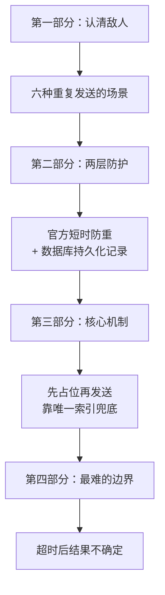

---

# 第一部分　认清敌人

## 12.1 六种重复发送的场景

### 12.1.1 逐个来看

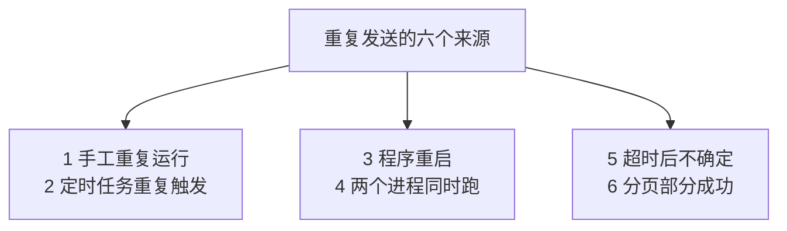

| 场景 | 什么时候发生 | 前面哪一章提到过 |
|---|---|---|
| **手工重复运行** | 你调试时跑了两遍 | — |
| **定时任务重复触发** | misfire 补跑、间隔设太密 | 第 9 章 9.10 节 |
| **程序重启** | 重启后又查到同一批数据 | 第 9 章 9.10.1 节 |
| **两个进程同时跑** | 部署时不小心启了两个 | 第 9 章 9.9.4 节 |
| **超时后不确定** | 网络慢，不知道发出去没有 | 第 4 章 4.5.4 节 |
| **分页部分成功** | 5 页发了 3 页就断了 | 第 6 章 6.11.4 节 |

**注意后两个和前四个的性质完全不同。**前四个是“**我知道我可能重复了**”，后两个是“**我不知道到底发生了什么**”。

### 12.1.2 为什么第 9 章的 `max_instances` 不够

第 9 章用 `max_instances=1` 防止任务重叠，实测有效。**但它只管住同一个调度器内部：**

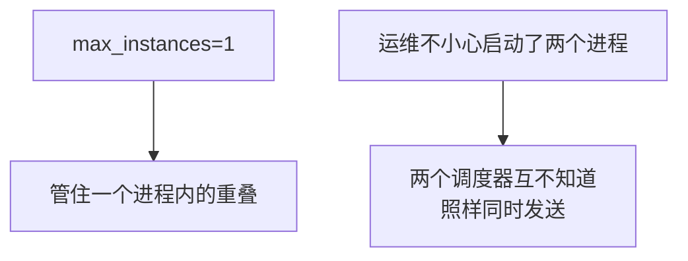

而“启动了两个”在真实部署中非常常见：手工启动一个忘了关，又配了开机自启。

### 12.1.3 结论：防重必须落到数据库

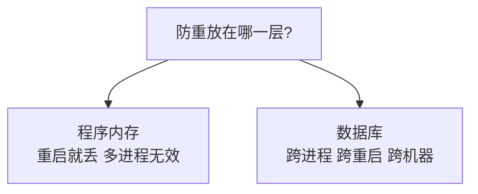

**只有数据库知道“全局到底发过没有”。**这就是本章要建那张发送记录表的原因。

---

## 12.2 第一层防护：企业微信自带的短时重复检查

### 12.2.1 官方提供的能力

官方在发送应用消息接口里提供了两个参数：

| 参数 | 含义 | 默认 |
|---|---|---|
| `enable_duplicate_check` | 是否开启重复消息检查，`1` 开启 | `0`（关闭）|
| `duplicate_check_interval` | 检查的时间间隔（秒） | `1800`，**最大不超过 4 小时** |

官方的说明是：开启后，**在一定时间间隔内，同样内容（请求 json）的消息，不会重复收到**。

### 12.2.2 关键限制：它比的是“请求 json”

请注意官方措辞里那个括号：**同样内容（请求 json）**。

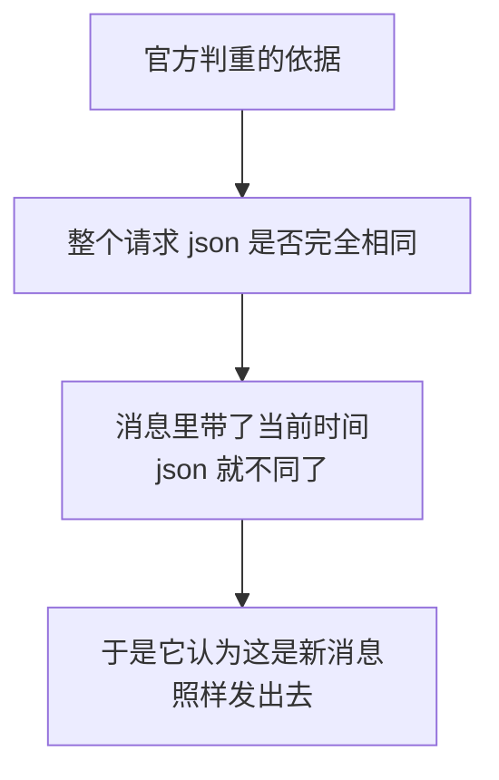

**这对我们的程序是致命的**——第 11 章的消息里有这一行：

```text
> 统计时间：<font color="comment">2026-09-04 12:13</font>
```

**每分钟运行一次，这行就不一样，请求 json 就不一样，官方防重就失效了。**

### 12.2.3 所以它只能是第一层

| | 官方短时防重 | 数据库发送记录 |
|---|---|---|
| 判断依据 | 请求 json 完全相同 | **业务唯一键** |
| 时间范围 | 最多 4 小时 | **永久** |
| 内容带时间戳还有效吗 | **无效** | 有效 |
| 跨进程 | 有效 | 有效 |
| 需要自己写代码吗 | 不需要 | 需要 |

**它的真正价值是兜住“完全相同的请求被重发”这种情况**——尤其是超时重试导致的（12.8 节会用到它）。

### 12.2.4 代码实现

```python
        # 短时重复检查（第一层防护）
        if enable_duplicate_check:
            interval = min(max(int(duplicate_check_interval), 1),
                           MAX_DUPLICATE_CHECK_INTERVAL)
            payload["enable_duplicate_check"] = 1
            payload["duplicate_check_interval"] = interval
```

注意那个 `min(max(...))`：**把间隔限制在合法范围内**。

```python
# 官方默认的检查间隔（秒）
DEFAULT_DUPLICATE_CHECK_INTERVAL = 1800

# 官方上限：最大不超过 4 小时
MAX_DUPLICATE_CHECK_INTERVAL = 4 * 3600
```

**实测：**

```text
H. 检查请求体里的官方防重参数
    enable_duplicate_check = 1
    duplicate_check_interval = 1800

I. 间隔值会被限制在官方上限内
  传入 99999 秒 -> 实际发出 14400 秒（官方上限 14400 秒 = 4 小时）
```

传一个超限的值，程序会自动收敛到 4 小时，而不是让接口报错。

---

# 第二部分　第二层防护：数据库发送记录

## 12.3 表结构设计

### 12.3.1 这张表要回答一个问题

> **这条业务消息，我到底发过没有？**

```sql
CREATE TABLE dbo.企业微信发送记录
(
    记录编号     BIGINT         IDENTITY(1,1) NOT NULL,

    /* ---------- 业务唯一键的四个组成部分 ---------- */

    /* 业务类型：区分不同的提醒业务。
       以后加了"审批超时提醒""库存预警"，它们和"待办提醒"互不干扰。 */
    业务类型     VARCHAR(50)    NOT NULL,

    /* 业务编号：这条消息对应哪条业务记录（这里是待办编号）。
       用 VARCHAR 而不是 INT，因为别的业务可能用单号、合同号这类字符串。 */
    业务编号     VARCHAR(100)   NOT NULL,

    /* 接收人：企业微信 UserID。
       【必须统一小写存入】，否则 ZhangSan 和 zhangsan 会被当成两个人
       （第 6 章 6.4 节、第 11 章 11.2.3 节反复强调过）。 */
    接收人       VARCHAR(64)    NOT NULL,

    /* 消息版本：同一条业务在什么条件下允许再发一次。
       - 按天防重：存日期，如 '20260904'
       - 永久防重：存固定值，如 'once'
       - 内容变更后允许重发：存内容哈希 */
    消息版本     VARCHAR(64)    NOT NULL,
```

### 12.3.2 最重要的一行

```sql
CREATE UNIQUE NONCLUSTERED INDEX UX_企业微信发送记录_业务唯一键
    ON dbo.企业微信发送记录 (业务类型, 业务编号, 接收人, 消息版本);
```

```sql
/* ============================================================
   最重要的一行：业务唯一键

   这个唯一索引是整套防重机制的【最后一道防线】。
   即使程序被同时启动两次、即使代码里的判断有 bug，
   数据库也会拒绝插入第二条相同的记录。

   注意：靠"先查再插"是不可靠的（第 12 章 12.7.3 节有实测），
        只有数据库层面的唯一约束才能真正防住并发。
   ============================================================ */
```

**这一行是整章的技术核心。**12.7 节会用实测证明为什么它不可替代。

### 12.3.3 其余字段

| 字段 | 用途 |
|---|---|
| 状态 | Pending / Processing / Sent / Failed |
| 消息ID | 企业微信返回的 `msgid`，必要时用于撤回（官方：仅可撤回 24 小时内的消息） |
| 错误码 / 错误说明 | **第 13 章判断该不该重试的依据** |
| 尝试次数 | 多次失败后转人工（第 13 章的“死信”） |
| 占位时间 / 完成时间 | 排查、清理、找卡住的记录 |

---

## 12.4 业务唯一键

### 12.4.1 四个字段合起来才唯一

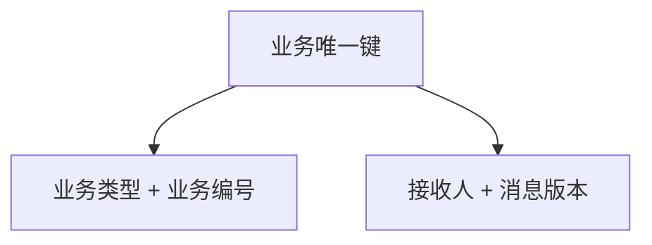

| 字段 | 回答什么 |
|---|---|
| 业务类型 | 这是哪种提醒 |
| 业务编号 | 对应哪一条（本章用页码） |
| 接收人 | 发给谁 |
| **消息版本** | **什么情况下允许再发一次** |

第四个字段是设计上最巧妙的地方——**换一种防重策略，只需要换这个字段的值**（12.10 节展开）。

### 12.4.2 做成一个类，而不是四个散落的参数

```python
@dataclass(frozen=True)
class SendKey:
    """
    业务唯一键：四个字段合起来唯一确定"一次该发的消息"。

    为什么需要一个专门的类？
        因为这四个字段必须【总是一起出现】。
        用四个散落的字符串参数，早晚会有人漏传一个或搞错顺序。
    """

    业务类型: str
    业务编号: str
    接收人: str
    消息版本: str

    def __post_init__(self):
        """
        创建后立刻校验并规范化。

        frozen=True 的对象不能直接改字段，所以用 object.__setattr__。
        这里做两件事：
            1. 接收人统一小写（防重的关键，第 6 章 6.4 节）
            2. 四个字段都不能为空
        """
        object.__setattr__(self, "接收人", str(self.接收人).strip().lower())
        object.__setattr__(self, "业务编号", str(self.业务编号).strip())

        for name in ("业务类型", "业务编号", "接收人", "消息版本"):
            if not getattr(self, name):
                raise ValueError(f"业务唯一键的 {name} 不能为空")
```

**实测：**

```text
输入 'ZhangSan' -> zhangsan
输入数字编号 1  -> '1' （转成字符串）
两个键相等吗   : True   ← 大小写和类型差异被抹平了
能当字典键吗   : a   ← frozen=True 所以可哈希
('', '1', 'z', 'v')     -> ValueError: 业务唯一键的 业务类型 不能为空
('待办', '', 'z', 'v')   -> ValueError: 业务唯一键的 业务编号 不能为空
('待办', '1', '  ', 'v') -> ValueError: 业务唯一键的 接收人 不能为空
('待办', '1', 'z', '')   -> ValueError: 业务唯一键的 消息版本 不能为空
```

**`SendKey("待办提醒", "1", "ZhangSan", "...")` 和 `SendKey("待办提醒", 1, "zhangsan", "...")` 是相等的**——大小写和类型差异在构造时就被抹平了。这是防重能生效的前提。

### 12.4.3 `__post_init__` 里为什么用 `object.__setattr__`

因为 `frozen=True` 禁止赋值，直接写 `self.接收人 = ...` 会报错。`object.__setattr__` 是绕过这个限制的标准写法——**在构造阶段规范化数据，之后就彻底只读**。

### 12.4.4 换一个维度就是一条新消息

**实测：**

```text
同业务同人同版本               -> 占位成功
换接收人                     -> 占位成功
换业务编号                   -> 占位成功
换消息版本（第二天）           -> 占位成功
重复第一个                   -> 占位失败（跳过）
```

四个维度任一不同，就是一条新消息；四个全同，才算重复。

---

## 12.5 发送状态的设计

### 12.5.1 四个状态

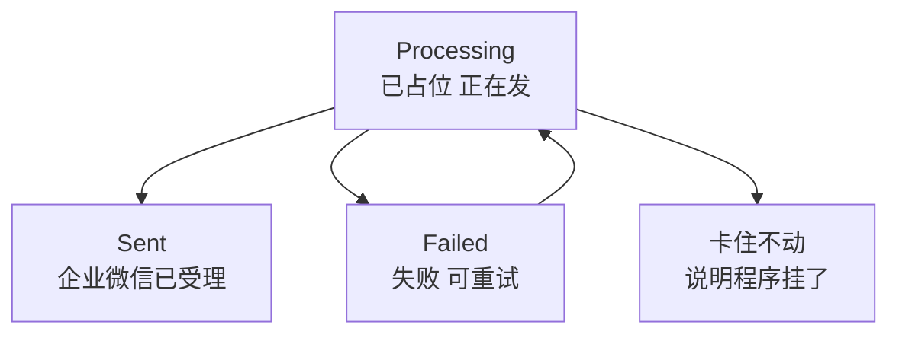

```python
# 已占位，还没开始发（正常情况下很短暂）
STATUS_PENDING = "Pending"

# 已被某次任务领取，正在发送中。
# 如果一条记录长时间停在这个状态，说明程序在发送过程中挂了 —— 见 12.8 节
STATUS_PROCESSING = "Processing"

# 企业微信已受理
STATUS_SENT = "Sent"

# 发送失败，下次可以重来
STATUS_FAILED = "Failed"
```

### 12.5.2 为什么失败要留记录，而不是删掉

```python
def mark_failed(connection, key: SendKey, errcode: int = None,
                errmsg: str = "") -> None:
    """
    发送失败后回写状态。

    注意状态写成 Failed 而不是删除记录：
        删掉记录等于"当作没发过"，下次会重来 —— 有时这是对的，
        但你就永远不知道它失败过几次、为什么失败。
        留下记录，第 13 章才能据此决定"还要不要再试"。
    """
```

**删记录看起来更简单，但你会丢掉全部诊断信息。**留下 `Failed` 记录 + `尝试次数`，才能实现“试了 5 次还不行就别试了，通知管理员”。

### 12.5.3 `Processing` 是最有信息量的状态

一条记录长时间停在 `Processing`，意味着：**程序占了位，但没能写回结果。**

这几乎只有两种原因：

| 原因 | 消息发出去了吗 |
|---|---|
| 程序在发送过程中被杀掉 | **不知道** |
| 请求超时后进程退出 | **不知道** |

**注意都是“不知道”。**这就是 12.8 节要专门处理的边界。

---

# 第三部分　核心机制：先占位，再发送

## 12.6 时序：为什么占位必须在发送之前

### 12.6.1 两种顺序的对比

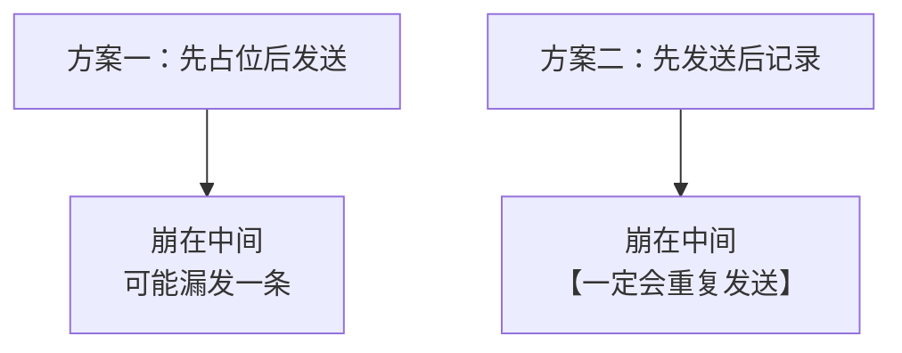

**实测演示：**

```text
情形一：占位在发送【前】（本章的做法）
  占位成功 -> 假设此刻程序崩溃
  记录状态: Processing （卡在 Processing）
  下次运行再占位: False -> 不会重发
  代价：这条消息可能根本没发出去，需要人工确认（见 12.8 节）

情形二：如果占位在发送【后】
  发送成功 -> 程序崩溃 -> 记录没写进去
  下次运行查不到记录 -> 【重复发送】
  结论：占位必须在发送之前，宁可漏发也不重发
```

### 12.6.2 这是一个业务取舍，不是技术优劣

| | 先占位（本章选择） | 先发送 |
|---|---|---|
| 崩溃时的风险 | **可能漏发** | **可能重发** |
| 能被发现吗 | 能（记录卡在 Processing） | **不能** |
| 谁来兜底 | 人工确认 | 没人 |

**为什么选“宁可漏发”？**因为漏发**留下了痕迹**（那条 `Processing` 记录），而重发是静默发生的、没人知道。

> **原则：在两种坏结果之间，选那个“留下证据”的。**

### 12.6.3 完整时序

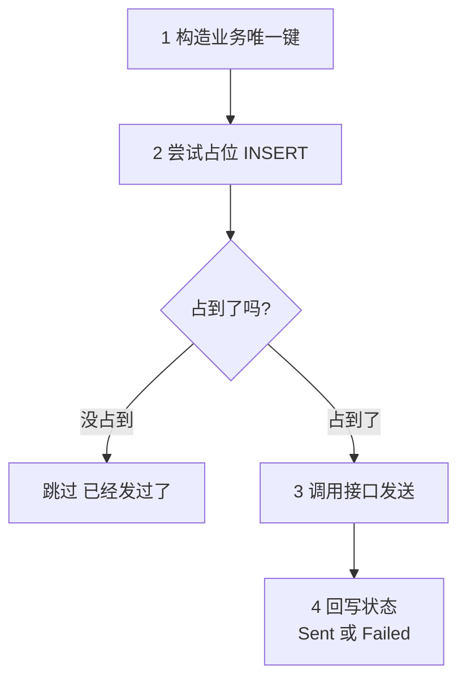

**实测：**

```text
占位: True
状态: {'状态': 'Processing', '消息ID': None, '错误码': None, '尝试次数': 1}
回写后 状态: Sent  消息ID: MSG-123
再次占位: False  ← 已 Sent，不会重发
```

### 12.6.4 失败的记录允许重新领取

```python
def reclaim_failed(connection, key: SendKey) -> bool:
    """
    把一条 Failed 记录改回 Processing，允许重发一次。

    返回:
        True 表示成功领取（原状态确实是 Failed）
        False 表示没领到（可能已经是 Sent，或正被别人处理）

    注意 SQL 里带了 `AND 状态 = 'Failed'` 这个条件：
        这让"领取"这一步也是原子的 —— 两个进程同时来领，
        只有一个能把状态从 Failed 改掉，另一个更新到 0 行。
    """
```

**实测：**

```text
失败后 状态=Failed 错误码=81013 尝试次数=1
直接占位: False  ← 唯一键已存在，占不到
用 reclaim_failed: True  ← 领取成功
领取后 状态=Processing 尝试次数=2
再 reclaim 一次: False  ← 状态已不是 Failed，领不到
```

**`UPDATE ... WHERE 状态 = 'Failed'` 这个写法很重要**：它让“领取”这个动作本身也是原子的。两个进程同时来领，数据库保证只有一个能改成功，另一个的 `rowcount` 是 0。

```python
            # rowcount 是"这次 UPDATE 影响了几行"。
            # 0 行说明状态不是 Failed，没领到。
            affected = cursor.rowcount
```

---

## 12.7 为什么必须靠唯一索引，而不是“先查再插”

### 12.7.1 占位函数

```python
def try_claim(connection, key: SendKey) -> bool:
    """
    尝试占位。

    返回:
        True  = 占位成功，【这次该由我发送】
        False = 已经有人占过了（发过了，或正在发），【我应该跳过】

    这是本章最重要的一个函数。它的可靠性来自一个事实：
        【唯一索引的判断由数据库原子完成】。
        两个进程同时占位，数据库保证只有一个成功。

    对比"先查再插"的写法（12.7.3 节有实测）：
        两个进程可能同时查到"没有记录"，然后都插入、都发送。
        这个时间窗口非常小，但定时任务每天都跑，早晚会撞上。
    """
    with closing(connection.cursor()) as cursor:
        try:
            cursor.execute(INSERT_CLAIM, (
                key.业务类型, key.业务编号, key.接收人, key.消息版本,
                STATUS_PROCESSING,
            ))
            # 必须提交！否则这个"位"只存在于当前事务里，
            # 别的进程看不到（第 10 章 10.10.4 节：close() 会回滚未提交的修改）
            connection.commit()
            return True

        except pyodbc.IntegrityError:
            # 唯一键冲突 —— 说明这条消息已经有记录了。
            # 这【不是错误】，是防重机制正常工作的标志。
            connection.rollback()
            return False

        except pyodbc.Error as error:
            connection.rollback()
            raise DatabaseError(f"占位失败：{error}") from error
```

### 12.7.2 关键点：把 `IntegrityError` 当成正常信号

```python
        except pyodbc.IntegrityError:
            # 唯一键冲突 —— 说明这条消息已经有记录了。
            # 这【不是错误】，是防重机制正常工作的标志。
```

**这是一个思路上的转变。**新手看到异常就想“出错了要处理”，而这里的异常恰恰是**我们期待的答案**：“已经有人发过了”。

**实测三次占位：**

```text
第一次占位: True
第二次占位: False  ← False 表示该跳过
第三次占位: False
表里实际有几条记录: 1
```

### 12.7.3 实测证明：“先查再插”不可靠

这是本章最有说服力的一组实测。我用 5 个线程执行“**先查有没有，没有就插入并发送**”这个看起来很合理的逻辑：

```text
5 个线程「先查再插」的结果: ['我发送了', '被唯一索引挡住', '被唯一索引挡住', '被唯一索引挡住', '被唯一索引挡住']
自认为该发送的线程数: 1  ← 大于 1 就意味着重复发送
被唯一索引挡住的次数: 4
结论：判断逻辑不可靠，但【唯一索引兜住了】—— 这就是它的价值
```

**请仔细看这个结果。**有 4 个线程**通过了“有没有记录”的检查**（它们都认为没有记录、都准备发送），只是在真正插入时被唯一索引拦住了。

也就是说：

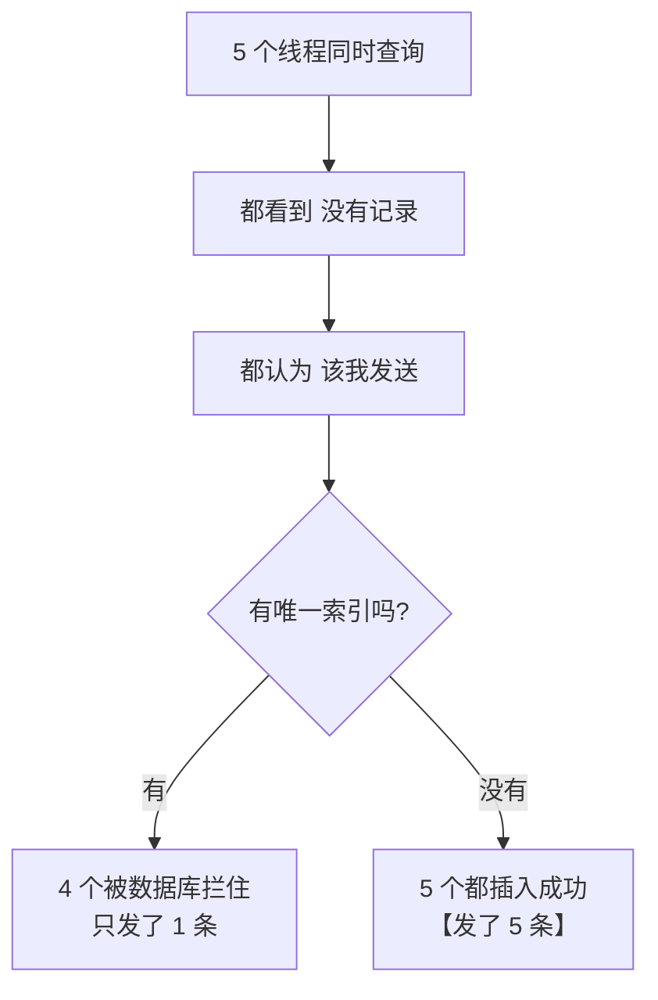

**如果没有唯一索引，这 4 个线程会各自发一条消息。**

### 12.7.4 正确做法的实测

用 `try_claim`（直接 INSERT，靠异常判断）：

```text
10 个线程的占位结果: [True, False, False, False, False, False, False, False, False, False]
成功次数: 1  ← 应为 1
表里记录数: 1  ← 应为 1
```

**10 个线程，恰好 1 个成功。**没有任何时间窗口。

### 12.7.5 一句话总结

> **不要用“查询 + 判断”来保证唯一性，要用数据库的唯一约束。**
>
> 前者是“两步操作”，中间必然有窗口；后者是数据库内部的一步原子操作。

这条原则适用于所有“防重复”场景，不限于本教程。

### 12.7.6 别忘了 `commit()`

```python
            # 必须提交！否则这个"位"只存在于当前事务里，
            # 别的进程看不到（第 10 章 10.10.4 节：close() 会回滚未提交的修改）
            connection.commit()
```

第 10 章 10.10.4 节埋的伏笔在这里兑现：**pyodbc 默认 `autocommit=False`，不提交等于什么都没写**，而且连接关闭时会回滚。

**如果忘了这一行，防重会完全失效**——每个进程都在自己的事务里占位成功，互相看不见。

### 12.7.7 顺手修掉的一个坑：`with cursor` 也不关闭游标

我第一版写的是 `with connection.cursor() as cursor:`，**实测直接报错**：

```text
AttributeError: __enter__
```

（`sqlite3` 的游标不支持上下文管理器。）

查 pyodbc 官方文档后发现更值得注意的事：**pyodbc 的游标虽然支持 `with`，但它的语义和连接一样——退出时调用 `commit()`，并且不关闭游标。**

所以正确写法是和第 10 章一致的：

```python
    with closing(connection.cursor()) as cursor:
```

> 这是第 10 章 10.10.1 节那个坑的**游标版本**。同一个陷阱在两个层面各出现一次。

---

## 12.8 最难的边界：发送结果不确定

### 12.8.1 问题重述

第 4 章 4.5.4 节就埋下了这个问题：

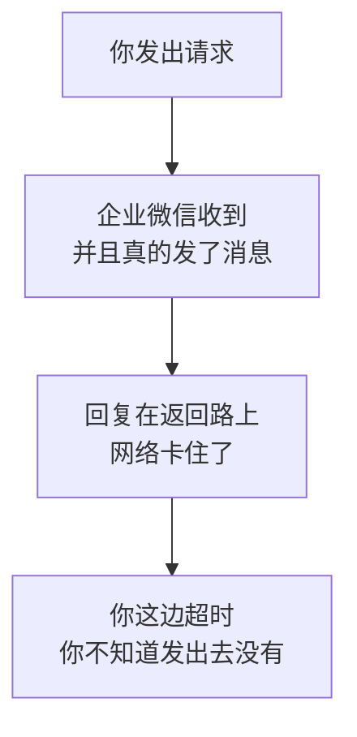

**这是分布式系统的经典难题，没有完美解法。**能做的是把风险降到最低。

### 12.8.2 本章的选择：状态保留在 Processing

```python
        except requests.exceptions.Timeout:
            # 【最难的情况】超时：不知道到底发出去没有。
            # 所以【故意不改状态】，让记录停在 Processing。
            # 这样下次任务不会重发（避免重复），而人可以通过
            # find_stuck() 查出来人工确认（见 12.8 节）。
            print(f"[任务 {run_id}] {key.describe()}：超时，"
                  f"状态保留为 Processing 等待人工确认")
            stats["failed"] += 1
```

**注意“故意不改状态”这四个字。**

| 如果改成 | 后果 |
|---|---|
| `Failed` | 下次会重试 → **可能发出第二条** |
| `Sent` | **可能其实没发出去** → 永久漏发，且以为成功了 |
| **不改（留 Processing）** | 下次不重发，且**留下了痕迹** |

### 12.8.3 靠什么发现这些记录

```python
def find_stuck(connection, older_than_minutes: int = 30) -> list:
    """
    找出卡在 Processing 超过一定时间的记录。

    这些记录意味着：程序曾经占了位，但没能写回结果 ——
    最可能的原因是程序在发送过程中被杀掉，或者请求超时后进程退出了。

    【重要】这些记录【不能自动重发】，因为无法确定消息到底发出去没有。
    见 12.8 节。
    """
```

**实测：**

```text
卡住超过 30 分钟：1 条
  timeoutuser / 999#p1/1 / 占位于 2026-09-05 00:51:01
这些必须【人工确认】后再决定重发还是标记完成（见 12.8 节）
```

另一组实测确认了它**不会误报已完成的记录**：

```text
卡住超过 30 分钟的记录：2 条
  待办提醒/1/zhangsan 占位于 ...
  待办提醒/2/zhangsan 占位于 ...
注意：已 Sent 的 3 号不在其中
```

### 12.8.4 为什么不自动重发

有人会想：“超时了就再发一次，反正官方有短时防重。”**这个想法部分正确，但不能依赖。**

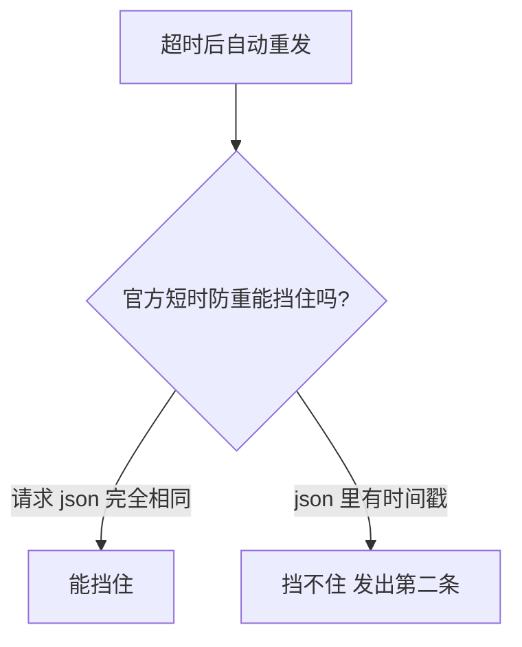

而我们的消息里**恰好有“统计时间”**（12.2.2 节分析过）。所以：

| 前提 | 能不能靠官方防重兜住超时重发 |
|---|---|
| 消息内容完全固定 | **可以**（4 小时内） |
| **消息里有时间戳** | **不行** |

**如果你想让超时可以安全重试**，就要把消息内容做成**幂等的**——去掉“统计时间”这类每次都变的东西。这是一个真实可行的设计选择，代价是消息里少了一点信息。

### 12.8.5 人工处理的流程

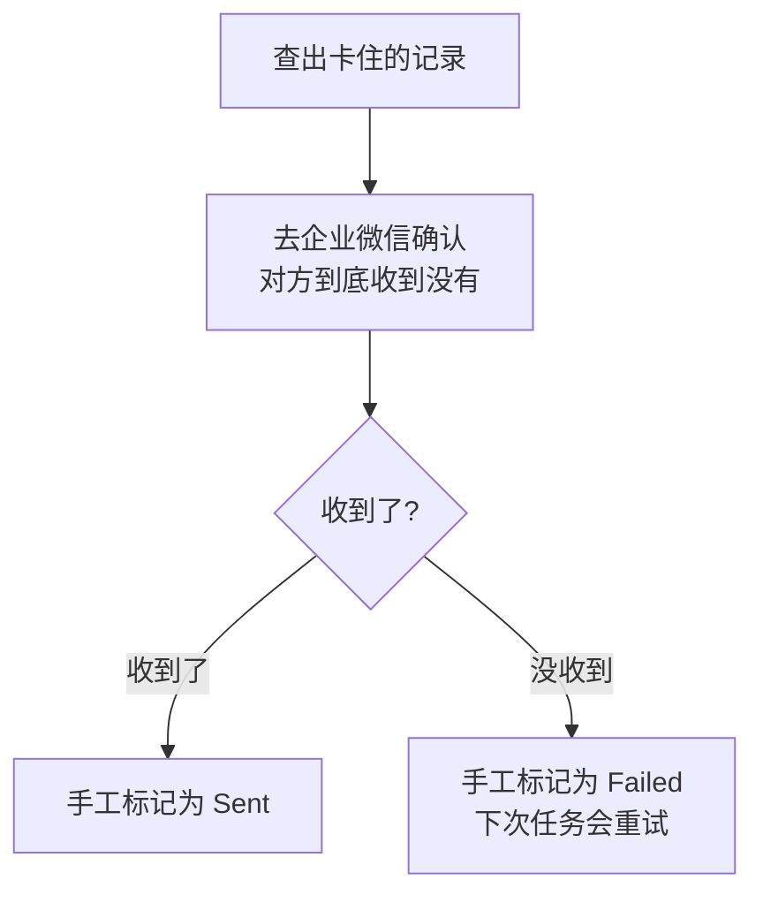

**这一步必须由人来做**，因为只有人能去企业微信里确认。第 14 章会把“卡住的记录数”做成告警，让你不用主动去查。

> **诚实地说**：这不是一个优雅的方案。但在“可能重复打扰用户”和“需要人工确认少数几条”之间，后者是可以接受的代价。**承认某些问题需要人介入，比假装程序能全自动处理更负责。**

---

## 12.9 内容变化后是否允许再次发送

### 12.9.1 两种业务诉求，互相冲突

| 诉求 | 想要的行为 |
|---|---|
| “别重复打扰我” | 同一批待办只提醒一次 |
| “新增的紧急事项要马上通知” | 数据变了就再发一次 |

**这两个诉求不可能同时满足。**必须做选择。

### 12.9.2 我第一版的设计错了

我最初把**待办编号列表**放进业务编号（`"1,2,3#p1/1"`），想法是“待办集合变了就是新消息”。**实测暴露了问题：**

```text
D. 业务数据新增一条 -> 只发新增的那批
  待办提醒/1,2,3#p1/1/zhangsan/20260905：跳过（状态 Sent）
  待办提醒/5,4#p1/1/lisi/20260905：成功 msgid=MSG-1

发送记录表：
  编号=1,2,3#p1/1   接收人=zhangsan  状态=Sent
  编号=4#p1/1       接收人=lisi      状态=Sent     ← 之前发的
  编号=5,4#p1/1     接收人=lisi      状态=Sent     ← 又发了一条
```

**lisi 今天收到了两条消息**：第一条是待办 4，第二条是待办 5 和 4——**待办 4 被通知了两次**。

这违背了本章的目标（“同一条待办每天最多提醒一次”）。

### 12.9.3 还有一个更隐蔽的坑

如果用**最终消息文字**算哈希，会永远失效：

```python
        # 把这一页的待办编号拼起来算哈希：集合一变，版本就变，于是会重发。
        # 注意用【待办编号】而不是最终文字 —— 因为文字里含"统计时间"，
        # 每分钟都不一样，哈希会永远变（见 12.9.3 节）。
        ids = ",".join(str(r.get("待办编号", "")) for r in page_rows)
        version = f"{send_log.version_by_day()}-{send_log.version_by_content(ids)}"
```

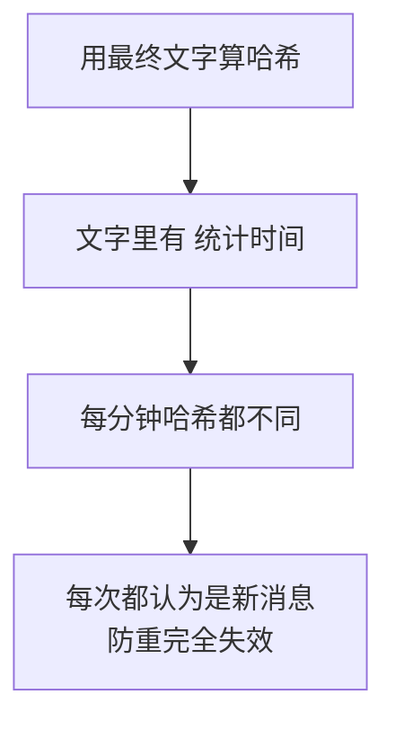

**必须用“业务数据”算哈希，不能用“展示文字”。**这个区别很容易搞错，而搞错之后防重看起来在工作、实际完全没用。

**实测哈希的稳定性：**

```text
内容防重  相同内容两次: 341847ce10d1eefb / 341847ce10d1eefb -> True
内容防重  内容变化后: 6604ee3140c3a35d -> 与原内容相同吗: False
```

### 12.9.4 这也是第 11 章“排序必须稳定”的原因

```python
def version_by_content(content: str) -> str:
    """
    按内容防重：内容没变就不再发，内容变了就允许再发一次。

    做法是取内容的哈希值前 16 位。

    【重要前提】同样的数据必须生成同样的文字。
        这就是第 11 章 11.5.4 节强调"排序必须稳定"的原因 ——
        如果条目顺序每次都抖，哈希就每次都不同，防重直接失效。

    注意：内容里如果带了"统计时间：2026-09-04 12:13"这种当前时间，
         哈希每次都会变。所以算哈希要用【业务数据】而不是【最终文字】，
         见 12.9.3 节。
    """
```

第 11 章埋的伏笔在这里兑现。

---

## 12.10 三种防重策略

### 12.10.1 改成可配置

发现设计问题后，我把它改成了两种可选策略：

```python
# ============================================================
# 防重策略（第 12 章 12.10 节详细对比）
#
#   "每人每天一条"：同一个人一天只收到一条汇总。
#                   当天新增的待办要等到明天才提醒。
#   "内容变化即重发"：待办集合一变就再发一条。
#                   新事项能当天通知到，代价是可能重复看到旧事项。
# ============================================================
DEDUP_PER_OWNER_PER_DAY = "每人每天一条"
DEDUP_ON_CONTENT_CHANGE = "内容变化即重发"

DEDUP_STRATEGY = DEDUP_PER_OWNER_PER_DAY
```

**切换策略只改一个字段：消息版本。**

```python
def _build_send_key(owner: str, page_rows: list,
                    page_index: int) -> send_log.SendKey:
    """
    构造业务唯一键。四个字段的含义：

        业务类型 = "待办提醒"      —— 区分不同业务
        业务编号 = "p1" / "p2"     —— 第几页（分页后每页是独立的一条消息）
        接收人   = UserID
        消息版本 = 取决于防重策略

    为什么业务编号【只放页码、不放总页数】？
        因为总页数会变。早上 4 项分 1 页（p1/1），下午新增到 15 项
        分 2 页（p1/2）—— 如果业务编号里带了总页数，第 1 页就成了
        "新的一条消息"，会被重复发送。这是我第一版真踩到的坑。

    为什么页码要放进业务编号？
        因为分 3 页时是【三条独立的消息】，必须能分别记录
        "第 1 页发过了、第 2 页还没发"。
        这正好解决第 6 章 6.11.4 节提出的"部分完成"难题。
    """
```

### 12.10.2 “业务编号不放总页数”这个细节

这是我踩过的第二个坑：

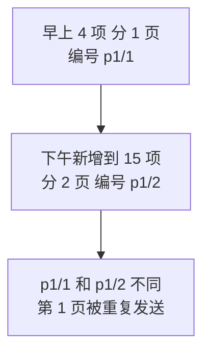

所以业务编号只放 `p1`、`p2`，**不含总页数**。

### 12.10.3 实测两种策略的差别

**策略一：每人每天一条**（默认）

```text
【策略：每人每天一条】实际发出 0 条  ← 应为 0
即使 lisi 新增了一条待办，今天也不再发第二条
发送记录表：
  编号=p1  接收人=zhangsan  版本=20260905  状态=Sent
  编号=p1  接收人=lisi      版本=20260905  状态=Sent
```

**策略二：内容变化即重发**

```text
切换成【内容变化即重发】策略再试：
  待办提醒/p1/zhangsan/20260905-8a6ae15122001229：成功
  待办提醒/p1/lisi/20260905-dd4a68a1cfac97e4：成功
实际发出 2 条：['zhangsan', 'lisi']
lisi 的待办集合变了 -> 版本变了 -> 又发一条（含已通知过的旧事项）
```

注意消息版本变成了 `20260905-8a6ae15122001229`（日期 + 内容哈希）。

### 12.10.4 三种策略对照

**实测（3 天各跑 2 次任务）：**

```text
永久防重：3 天各跑 2 次任务 -> 实际发送 1 次  ['2026-09-04 第1次']
按天防重：3 天各跑 2 次任务 -> 实际发送 3 次  ['2026-09-04 第1次', '2026-09-05 第1次', '2026-09-06 第1次']
```

| 策略 | 消息版本存什么 | 效果 | 适合 |
|---|---|---|---|
| **永久防重** | 固定值 `once` | **一辈子只发一次** | 一次性通知（如“账号已开通”） |
| **按天防重** | 日期 `20260904` | **每天最多一条** | **待办提醒（本教程默认）** |
| **内容变化即重发** | 日期 + 内容哈希 | 数据一变就再发 | 紧急告警（宁可多发） |

### 12.10.5 该怎么选

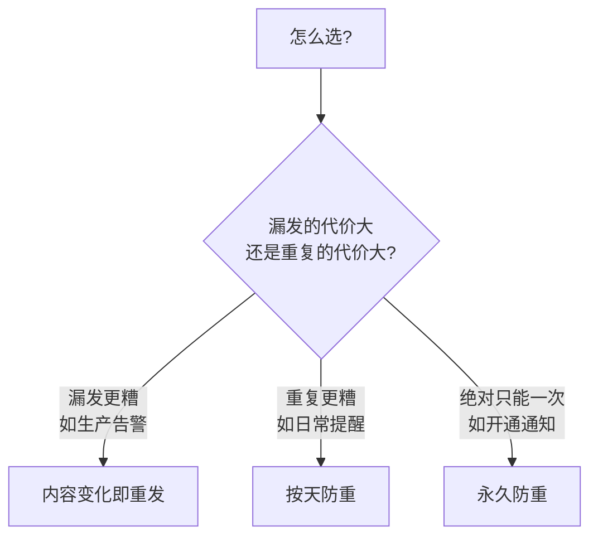

**这是纯粹的业务判断，没有技术上的对错。**关键是**你要知道自己选了什么、代价是什么**。

---

# 第四部分　接进任务

## 12.11 任务函数的改造

### 12.11.1 占位与跳过的逻辑

```python
        # ---------- 第一步：占位 ----------
        claimed = send_log.try_claim(connection, key)

        if not claimed:
            # 占不到位，说明有记录了。看看是什么状态。
            status_row = send_log.get_status(connection, key)
            status = status_row["状态"] if status_row else "未知"

            if status == send_log.STATUS_FAILED and RETRY_FAILED:
                # 上次失败了，允许再试一次
                if send_log.reclaim_failed(connection, key):
                    print(f"[任务 {run_id}] {key.describe()}："
                          f"上次失败，本次重试")
                else:
                    stats["skipped"] += 1
                    continue
            else:
                # 已发过（Sent），或正被别的进程处理（Processing）
                print(f"[任务 {run_id}] {key.describe()}：跳过（状态 {status}）")
                stats["skipped"] += 1
                continue
```

### 12.11.2 一个重要变化：连接要用到发送结束

第 11 章的做法是“**查完就关连接**”，本章不行了：

```python
            # 注意：第 12 章开始，数据库连接要一直用到发送结束。
            # 因为每发一条前要占位、发完要回写状态。
            # 这和第 11 章"查完就关"的做法不同 —— 那时发送不需要数据库。
```

这是**防重带来的必然代价**：占位和回写都要访问数据库。

### 12.11.3 演练模式必须撤销占位

**这是第 6 章 6.10.4 节埋下的伏笔，现在兑现：**

```python
            if result.dry_run:
                # 演练模式什么都没发，所以【必须撤销占位】，
                # 否则真消息永远不会再发（第 6 章 6.10.4 节埋的伏笔）
                send_log.mark_failed(connection, key, None, "演练模式，未发送")
                print(f"[任务 {run_id}] {key.describe()}：演练，占位已撤销")
```

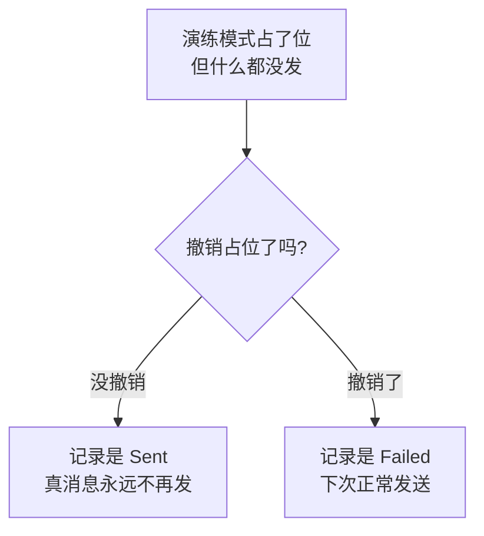

**实测：**

```text
F. 演练模式必须撤销占位（否则真消息永久丢失）
[演练模式] 以下 markdown 消息【没有】真的发送：共 1 人：zhaoliu
待办提醒/p1/zhaoliu/20260905：演练，占位已撤销
  演练后记录：状态=Failed  说明=演练模式，未发送
  实际发送 0 条（应为 0）

关掉演练后再跑：实际发送 1 条  ← 真消息补发成功
```

**如果没有这段处理，你用演练模式验证一次配置，那条真消息就永久丢失了**——而且没有任何报错。这类 bug 极难排查。

### 12.11.4 凭证错误要撤销占位后再抛出

```python
        except TokenError:
            # 凭证问题影响所有人，把占位撤销后向上抛，让整个任务停止
            send_log.mark_failed(connection, key, None, "获取凭证失败")
            raise
```

**先撤销、再抛出。**如果直接抛，这条记录会永远卡在 `Processing`，而它本来只是因为凭证问题——下次完全可以重试。

---

## 12.12 端到端实测

### 12.12.1 第一次运行：正常发送

```text
[任务 ...] 查到 4 条待办
[任务 ...] 涉及 2 位负责人：zhangsan、lisi
[任务 ...] 待办提醒/p1/zhangsan/20260905：成功 msgid=MSG-1
[任务 ...] 待办提醒/p1/lisi/20260905：成功 msgid=MSG-2
[任务 ...] 完成：发送 2 条，跳过 0 条（已发过），失败 0 条

发送记录表：
  编号=p1  接收人=zhangsan  版本=20260905  状态=Sent  msgid=MSG-1  尝试=1
  编号=p1  接收人=lisi      版本=20260905  状态=Sent  msgid=MSG-2  尝试=1
```

### 12.12.2 重复运行：一条都不发

```text
B. 立刻再跑一次（模拟手工重复运行）
[任务 ...] 待办提醒/p1/zhangsan/20260905：跳过（状态 Sent）
[任务 ...] 待办提醒/p1/lisi/20260905：跳过（状态 Sent）
[任务 ...] 完成：发送 0 条，跳过 2 条（已发过），失败 0 条

返回 True，实际发出 0 条消息  ← 应为 0

C. 连续再跑三次
三次任务共发出 0 条消息  ← 应为 0
```

**连跑四次，只发了第一次那两条。**这就是本章的目标。

注意返回值是 `True`——**“跳过”不是失败**，任务是成功的。

### 12.12.3 失败自动重试，成功后不再试

```text
第一次：返回 False，发出 1 次请求
  记录状态=Failed 错误码=81013 尝试次数=1

第二次：返回 True，发出 1 次请求  ← 失败的会重试
  记录状态=Sent msgid=MSG-1 尝试次数=2

第三次：发出 0 次请求  ← 已成功，不再重试
```

**尝试次数从 1 变成 2**，这个计数是第 13 章“试几次就放弃”的依据。

### 12.12.4 分页部分成功：只重发失败的那一页

这解决了第 6 章 6.11.4 节提出的难题。**实测（25 项待办分 3 页，让第 2 页失败）：**

```text
第一次：发出 3 次请求，返回 False
  待办提醒/p1/sunqi/20260905：成功 msgid=MSG-1
  待办提醒/p2/sunqi/20260905：失败 errcode=81013
  待办提醒/p3/sunqi/20260905：成功 msgid=MSG-3

    p1  状态=Sent
    p2  状态=Failed
    p3  状态=Sent

第二次：发出 1 次请求  ← 只重发失败的那一页
  待办提醒/p1/sunqi/20260905：跳过（状态 Sent）
  待办提醒/p2/sunqi/20260905：上次失败，本次重试
  待办提醒/p3/sunqi/20260905：跳过（状态 Sent）
```

**第 1、3 页没有被重发。**如果没有按页记录，重跑会把三页全发一遍——用户收到 5 条消息，其中 2 条是重复的。

---

## 12.13 清理历史记录

### 12.13.1 为什么要清理

这张表**每天都在增长**。一个 200 人的企业、每天每人一条，一年就是 7 万多行。虽然不算大，但：

| 问题 | 影响 |
|---|---|
| 表越来越大 | 查询变慢（虽然有索引） |
| 备份变大 | 运维成本 |
| 三年前的记录 | 没有任何价值 |

### 12.13.2 只清成功的记录

```python
def delete_old_records(connection, keep_days: int = 90,
                       status: str = STATUS_SENT) -> int:
    """
    清理历史记录。

    参数:
        keep_days: 保留最近多少天
        status:    只清理这个状态的（默认只清成功的）

    为什么默认只清 Sent？
        Failed 和 Processing 的记录是"问题线索"，
        清掉它们等于把证据毁了。
    """
```

**实测：**

```text
清理前记录数: 5
清理 90 天前的【成功】记录 -> 删除 3 条
剩下的记录: {'Failed': 2}  ← 失败记录被保留，因为它是问题线索
```

**成功的删了，失败的留着。**因为失败记录回答的是“这条为什么一直发不出去”，而成功记录只是历史。

### 12.13.3 清理要注意的两件事

| 注意点 | 原因 |
|---|---|
| **不要一次删几十万行** | 大事务会长时间锁表，影响正常业务 |
| **保留期要 > 防重周期** | 按天防重就至少留几天，否则删完当天记录会重发 |

第二条尤其要小心：**如果你的防重是“永久只发一次”，那这张表的记录就不能删**（至少不能删对应的行），否则删掉就等于允许再发一次。

---

## 12.14 本章改动清单

### 新增文件 `send_log.py`

| 内容 | 说明 |
|---|---|
| 四个状态常量 | `Pending` / `Processing` / `Sent` / `Failed` |
| `version_by_day()` | 按天防重 |
| `VERSION_ONCE` | 永久防重 |
| `version_by_content()` | 按内容防重 |
| **`SendKey`** | 业务唯一键，**自动小写化 + 非空校验** |
| **`try_claim()`** | **占位，靠 `IntegrityError` 判重** |
| `mark_sent()` / `mark_failed()` | 回写状态 |
| `reclaim_failed()` | 重新领取失败记录（**原子 UPDATE**） |
| `get_status()` | 查状态 |
| `find_stuck()` | 找卡住的记录 |
| `delete_old_records()` | 清理历史 |

### 新增文件 `sql/02_send_log.sql`

建表 + **唯一索引** + 两个辅助索引。

### `wecom_client.py`

| 改动 | 说明 |
|---|---|
| 新增两个常量 | `DEFAULT_DUPLICATE_CHECK_INTERVAL`、`MAX_DUPLICATE_CHECK_INTERVAL` |
| `send()` 新增两个参数 | `enable_duplicate_check`、`duplicate_check_interval` |
| `send_text` / `send_markdown` 同步 | 透传参数 |

### `tasks.py`

| 改动 | 说明 |
|---|---|
| 新增 `BUSINESS_TYPE` | 业务类型标识 |
| 新增 `ENABLE_DUPLICATE_CHECK` | 开启官方短时防重 |
| 新增 `RETRY_FAILED` | 失败是否重试 |
| 新增两种 `DEDUP_STRATEGY` | 防重策略可选 |
| 新增 `_build_send_key()` | **业务编号只放页码，不放总页数** |
| `_send_to_owner` 大改 | 占位 → 发送 → 回写 |
| 连接用到发送结束 | 不再“查完就关” |
| 演练模式撤销占位 | 否则真消息永久丢失 |

### 其他文件

`config.py` / `database.py` / `message_builder.py` / `token_cache.py` / `todo_message.py` / `todo_repository.py` / `scheduler_setup.py` **本章无改动**。

---

## 12.15 本章完成标志

- [ ] 执行 `sql/02_send_log.sql`，表和**唯一索引**建好
- [ ] `python main.py once` 第一次运行，正常发出消息
- [ ] **立刻再跑一次，一条都不发**，日志显示“跳过（状态 Sent）”
- [ ] 连跑五次，确认总共只发了第一次那些
- [ ] 查 `企业微信发送记录` 表，每条都有 `Sent` 状态和 `msgid`
- [ ] 手工在 SSMS 里执行两次相同的 `INSERT`，**第二次报错 2601**
- [ ] 把某条记录的状态手工改成 `Failed`，再跑任务，**它被重试了**
- [ ] 开演练模式跑一次，确认记录变成 `Failed`（占位已撤销）
- [ ] 关掉演练再跑，**真消息补发成功**
- [ ] 第二天再跑，**又发一条**（按天防重生效）

### 本章完成标志

> 无论你把 `python main.py once` 跑多少次，同事今天只收到一条待办提醒。

---

## 12.16 本章小结

### 12.16.1 两层防护的分工

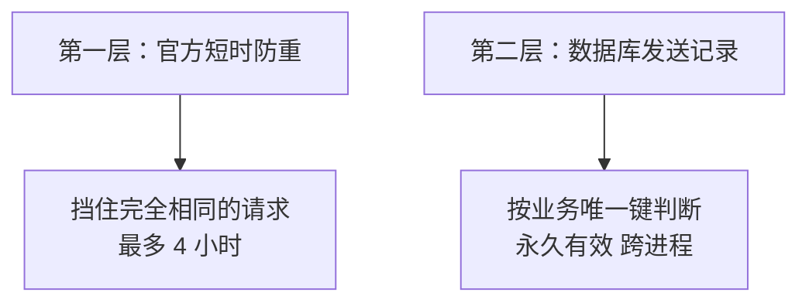

**第二层才是主力，第一层只是保险。**

### 12.16.2 本章必须带走的 12 条结论

1. **防重必须落到数据库**，程序内存挡不住多进程和重启。
2. **官方短时防重比的是“请求 json”**，内容带时间戳就失效。
3. **必须先占位再发送**——宁可漏发（留痕迹），不可重发（无声）。
4. **不要用“先查再插”**，实测 5 个线程有 4 个通过了检查。
5. **唯一索引是最后防线**，10 个线程并发只有 1 个占位成功。
6. **把 `IntegrityError` 当成正常信号**，它意味着“已经发过了”。
7. **别忘 `commit()`**，不提交则别的进程看不到你的占位。
8. **`with cursor` 也不关闭游标**，用 `closing()`。
9. **业务编号不能包含会变的东西**（如总页数），否则会误判为新消息。
10. **内容哈希要用业务数据，不能用展示文字**（文字含时间戳）。
11. **演练模式必须撤销占位**，否则真消息永久丢失。
12. **超时后不改状态**，留 `Processing` 等人工确认。

### 12.16.3 自测题

1. 第 9 章的 `max_instances=1` 为什么防不住重复发送？（12.1.2）
2. 官方的 `enable_duplicate_check` 对我们的消息为什么效果有限？（12.2.2）
3. 为什么占位必须在发送之前？（12.6.1）
4. “先查再插”的问题是什么？实测结果如何？（12.7.3）
5. `try_claim` 里忘了 `commit()` 会怎样？（12.7.6）
6. 为什么业务编号里不能放“总页数”？（12.10.2）
7. 用最终消息文字算内容哈希会出什么问题？（12.9.3）
8. 演练模式不撤销占位的后果是什么？（12.11.3）
9. 超时后为什么既不标 `Sent` 也不标 `Failed`？（12.8.2）
10. 清理历史记录时为什么只删 `Sent`？（12.13.2）

### 12.16.4 前面几章埋的伏笔全部兑现了

| 伏笔 | 出处 | 本章的兑现 |
|---|---|---|
| UserID 统一小写 | 第 6 章 6.4 节 | `SendKey` 自动小写化，防重才能生效 |
| `SendResult.dry_run` 字段 | 第 6 章 6.10.4 节 | 演练模式撤销占位 |
| 分页“部分完成”难题 | 第 6 章 6.11.4 节 | 按页占位，只重发失败页 |
| 超时不代表没发出去 | 第 4 章 4.5.4 节 | `Processing` 状态 + 人工确认 |
| `autocommit` 默认 `False` | 第 10 章 10.10.4 节 | `try_claim` 必须 `commit()` |
| `with` 不关闭连接 | 第 10 章 10.10.1 节 | 游标层同一个坑 |
| 排序必须稳定 | 第 11 章 11.5.4 节 | 内容哈希才稳定 |
| 错误码存进异常 | 第 5 章 5.6.3 节 | 写进发送记录，供第 13 章判断 |

**这不是巧合。**从第 4 章开始，每一次“现在先记住这一点”的提醒，都是为本章做准备。

### 12.16.5 下一章预告

第 13 章处理**失败与重试**。本章已经有了基础设施（`Failed` 状态、`错误码`、`尝试次数`），第 13 章会用它们回答：

| 问题 | 依据 |
|---|---|
| 哪些错误值得重试 | 错误码分类 |
| 重试间隔多久 | 指数退避 |
| 试几次就放弃 | 尝试次数 |
| 放弃之后怎么办 | 死信 + 告警 |

其中最关键的一条原则本章已经反复出现：**能确定“没发出去”的失败，重试是安全的；不能确定的，重试就可能发两条。**

---

## 参考的官方文档

1. [企业微信开发者中心：发送应用消息](https://developer.work.weixin.qq.com/document/path/90236) —— **`enable_duplicate_check` 与 `duplicate_check_interval`（默认 1800 秒、最大不超过 4 小时）**；判重依据是“同样内容（请求 json）”；`msgid` 用于撤回
2. [企业微信开发者中心：全局错误码](https://developer.work.weixin.qq.com/document/path/90313) —— `42052`（仅可撤回 24 小时内的消息）、`81013` 等
3. [pyodbc 官方 Wiki：Cursor](https://github.com/mkleehammer/pyodbc/wiki/Cursor) —— **游标的上下文管理器会提交事务但不关闭游标**，推荐 `contextlib.closing`
4. [pyodbc 官方 Wiki：Connection](https://github.com/mkleehammer/pyodbc/wiki/Connection) —— `autocommit` 默认 `False`

> 本章的唯一约束行为、占位时序、并发竞争（10 线程）、以及完整端到端链路均在 Python 3.9.25 环境中用 `sqlite3` 与本地模拟服务器实际运行验证，共 22 组测试；文中标注“实测”的输出均为真实运行结果。SQL Server 的唯一键冲突经 pyodbc 抛出 `IntegrityError`（SQLSTATE `23000`，SQL Server 错误号 2601/2627），语义与 `sqlite3.IntegrityError` 相同。T-SQL 脚本未在沙箱执行，请在你的 SQL Server 上核对后使用。企业微信接口规则依据上述官方文档整理并重新表述（内容已为遵守许可限制而改写）。
