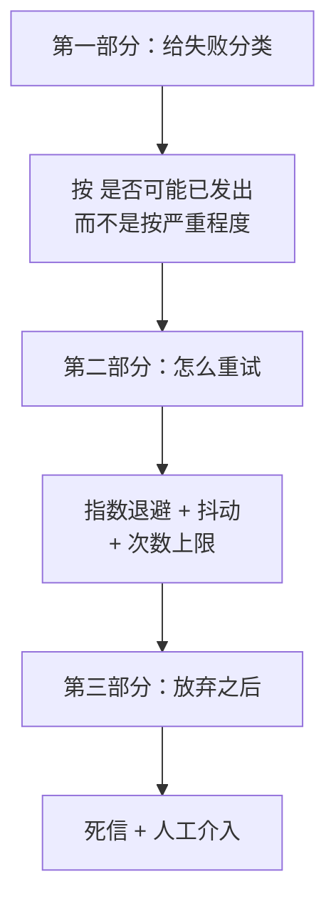
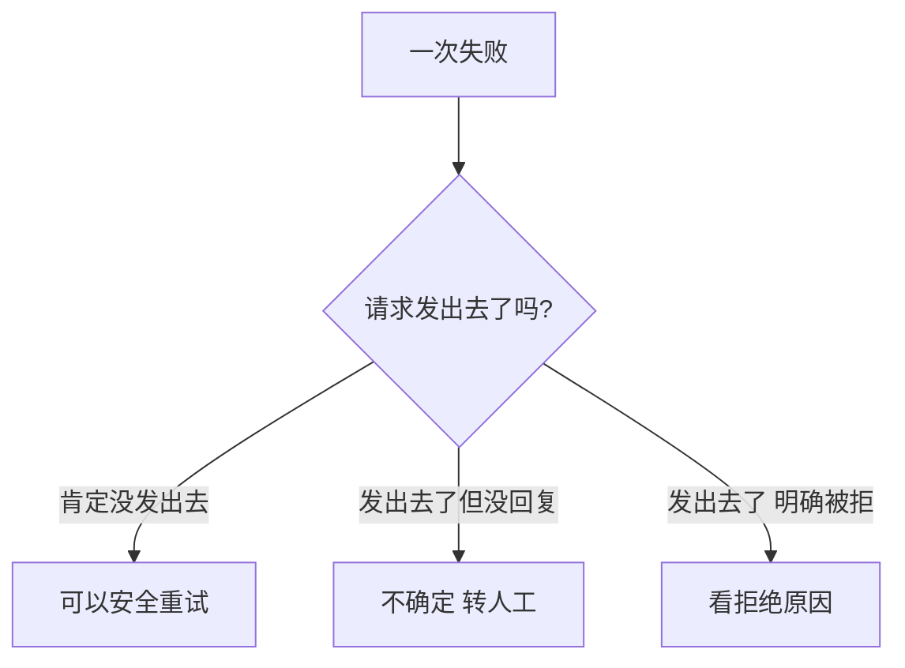
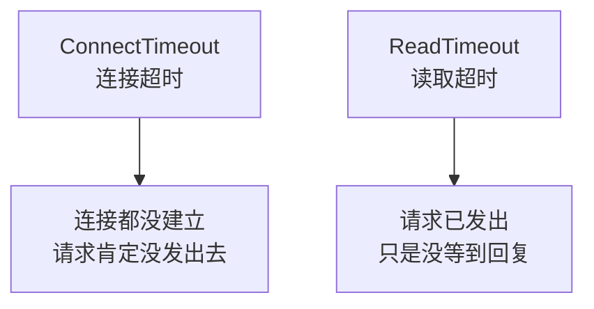
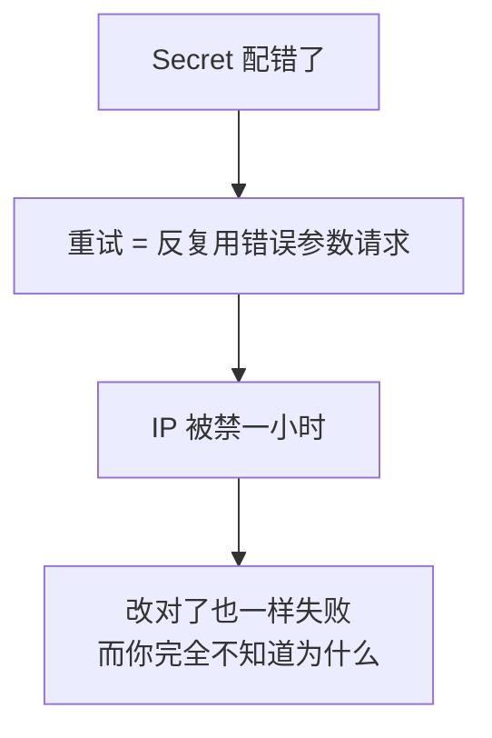
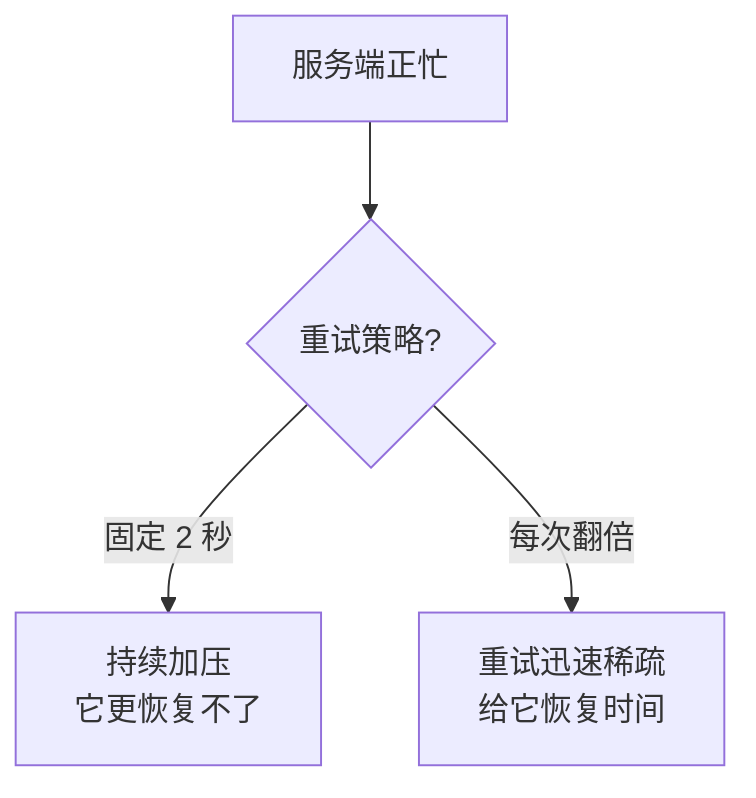
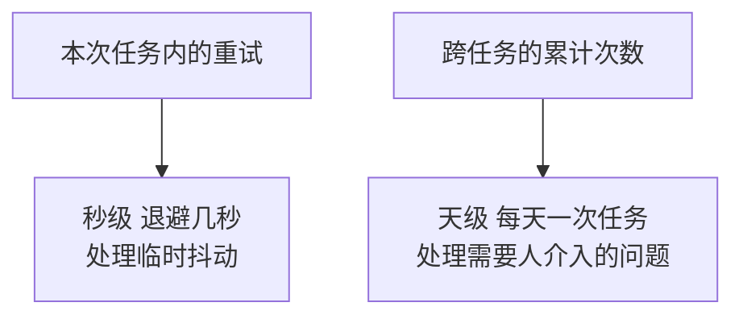
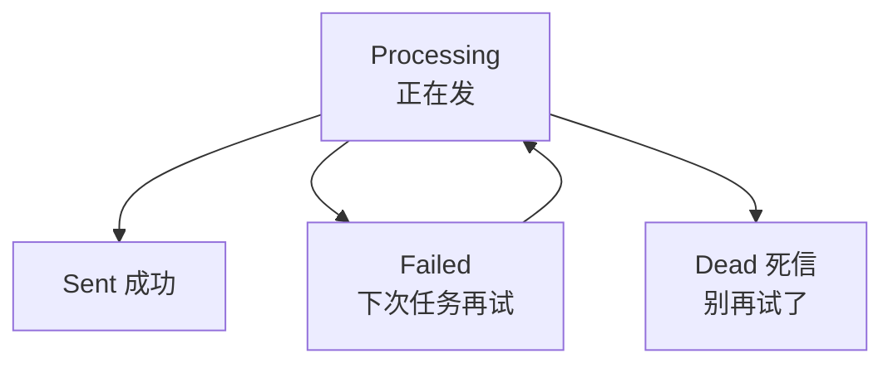
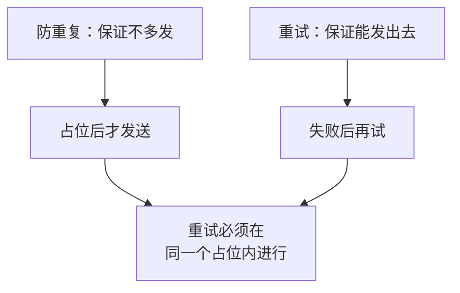
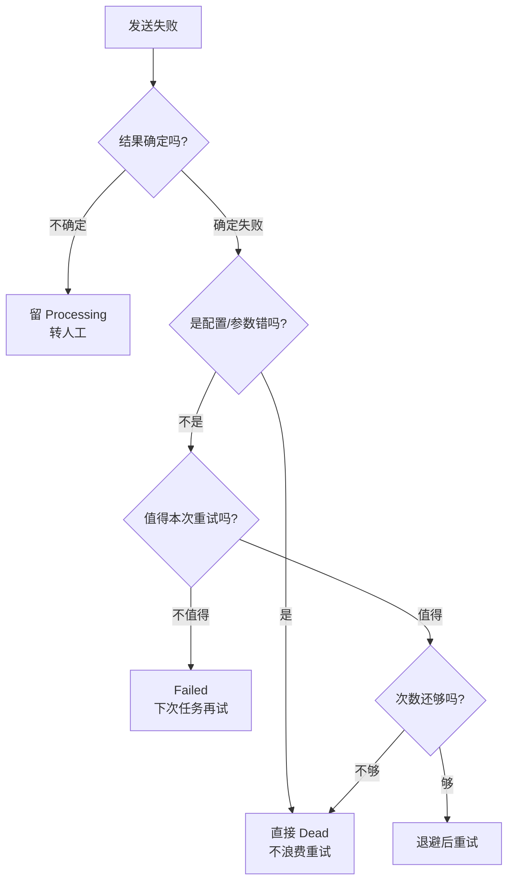
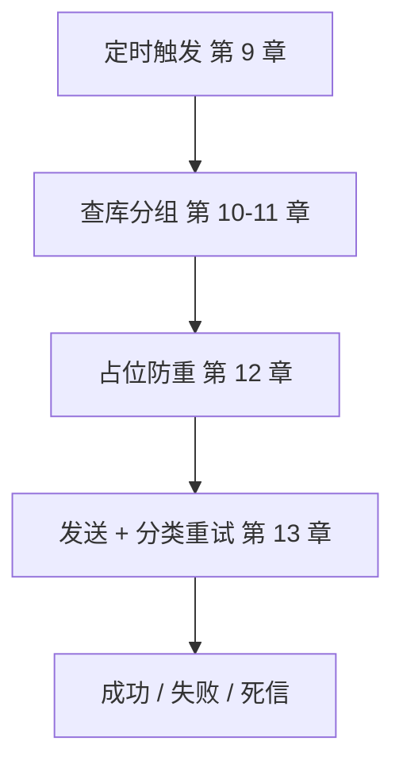

# 第 13 章　失败处理与有限重试

> 所属教程：《Python 调用企业微信应用消息 API：从入门到定时、数据库与防重复发送》  
> 前置章节：第 12 章（防重复，已有 `Failed` 状态、错误码、尝试次数）  
> 本章目标：**让能自动恢复的失败自动恢复，让不能恢复的失败停下来并叫人。**

**本章的核心判断标准只有一条**，从第 5 章 5.5.5 节一路延续到这里：

> **能确定“请求没发出去”的失败，重试是安全的；不能确定的，重试就可能发出第二条。**

所以本章的错误分类**不是按“严重程度”分的，而是按“消息可能已经发出去了吗”分的。**

> **关于验证方式**：本章的网络异常分类用**真实的网络异常**触发验证（不可路由地址造连接超时、本地慢服务器造读取超时），错误码分类、指数退避、死信流程用 `sqlite3` + 本地模拟服务器验证，共 24 组测试。

---

## 13.0 本章路线



---

# 第一部分　给失败分类

## 13.1 六类失败，六种态度

### 13.1.1 分类的依据



### 13.1.2 六种决定

```python
class RetryDecision(Enum):
    """一次失败之后该怎么办。"""

    # 立刻重试（退避后）。适用于"确定没发出去"的失败。
    RETRY = "retry"

    # 刷新凭证后重试一次。第 8 章已在客户端内部实现，这里只是分类完整性。
    REFRESH_TOKEN = "refresh_token"

    # 等较长时间再试。适用于被限流 —— 立刻重试只会让情况更糟。
    BACKOFF_LONG = "backoff_long"

    # 放弃，但下次任务可以再来（比如接收人临时不在可见范围，管理员可能会改）。
    GIVE_UP_RETRY_NEXT_RUN = "give_up_retry_next_run"

    # 永久放弃：重试一万次结果一样，必须改代码或改配置。
    GIVE_UP_PERMANENT = "give_up_permanent"

    # 结果不确定：可能已经发出去了。【绝不自动重试】，转人工确认。
    UNKNOWN_NEEDS_HUMAN = "unknown_needs_human"
```

### 13.1.3 为什么“放弃”要分成两种

这是本章一个容易忽略但很实用的区分：

| | `GIVE_UP_RETRY_NEXT_RUN` | `GIVE_UP_PERMANENT` |
|---|---|---|
| 典型错误 | 接收人不在可见范围（`81013`） | `AgentId` 配错（`40056`） |
| 本次重试有用吗 | 没用 | 没用 |
| **下次任务呢** | **可能就好了**（管理员加了人） | **还是不行**（代码没改） |
| 记录状态 | `Failed` | **`Dead`（死信）** |

**如果不分开，要么“注定失败的消息每天重试”，要么“本来能好的消息永远不再试”。**

---

## 13.2 网络异常：本章最重要的一个区分

### 13.2.1 连接超时和读取超时完全不同

第 4、9、12 章为了简化，一律用 `except Timeout` 笼统处理。**这其实浪费了一批本可以自动恢复的失败。**



**requests 官方文档对这两个异常的说明就不一样。实测把文档字符串打出来：**

```text
requests 官方文档对 ConnectTimeout 的原话：
    Requests that produced this error are safe to retry.
而 ReadTimeout 的文档里【没有】这句话：
    The server did not send any data in the allotted amount of time.
```

**“产生这个错误的请求可以安全重试”**——这是 requests 作者写在异常类文档里的保证。

### 13.2.2 用真实网络异常验证

我没有构造假异常，而是真的制造了这四种网络故障：

| 制造方式 | 触发什么 |
|---|---|
| 连 `192.0.2.1`（RFC 5737 保留的不可路由测试地址） | 连接超时 |
| 连本地一个“接受连接但 10 秒不回复”的服务器 | 读取超时 |
| 连本地无人监听的端口 | 连接被拒 |
| 连一个不存在的主机名 | 解析失败 |

**实测结果：**

```text
连接超时（不可路由地址）  -> ConnectTimeout     耗时  1.5s
                          判定：retry                 可立刻重试=True  需人工=False
读取超时（服务器不回复）  -> ReadTimeout        耗时  1.5s
                          判定：unknown_needs_human   可立刻重试=False 需人工=True
连接被拒（端口没人听）    -> ConnectionError    耗时  0.0s
                          判定：retry                 可立刻重试=True  需人工=False
解析失败（主机名不存在）  -> ConnectionError    耗时  0.0s
                          判定：retry                 可立刻重试=True  需人工=False
```

**同样是“超时”，一个可以自动恢复，一个只能转人工。**

### 13.2.3 分类代码

```python
def advise_by_exception(error: Exception) -> RetryAdvice:
    """
    根据网络异常给出重试建议。

    【本章最关键的区分】连接超时 和 读取超时 的安全性完全不同：

        ConnectTimeout（连接超时）
            连接根本没建立起来，请求【肯定没发出去】。
            requests 官方文档对这个异常的说明就是
            "Requests that produced this error are safe to retry"
            （产生这个错误的请求可以安全重试）。
            -> 可以安全重试

        ReadTimeout（读取超时）
            连接建好了、请求已经发出去了，只是没等到回复。
            企业微信可能已经把消息发给用户了。
            -> 结果不确定，绝不能自动重试

    前面几章为了简化，一律用 except Timeout 笼统处理。
    本章把它拆开 —— 这能让相当一部分失败变成可安全重试的。
    """
    E = requests.exceptions

    # 注意判断顺序：ConnectTimeout 同时是 ConnectionError 和 Timeout 的子类
    # （第 4 章 4.5.3 节实测过），所以必须【先判断它】。
    if isinstance(error, E.ConnectTimeout):
        return RetryAdvice(
            RetryDecision.RETRY,
            "连接超时：连接未建立，请求肯定没发出去，可安全重试")

    if isinstance(error, E.ReadTimeout):
        return RetryAdvice(
            RetryDecision.UNKNOWN_NEEDS_HUMAN,
            "读取超时：请求已发出但没等到回复，消息可能已经送达，"
            "【不可自动重试】，需人工确认")
```

### 13.2.4 判断顺序又一次成为关键

第 4 章 4.5.3 节实测过 `ConnectTimeout` 的继承关系，本章再次用到：

**实测：**

```text
ConnectTimeout 同时是 ConnectionError 和 Timeout 的子类：
  是 ConnectionError 子类：True
  是 Timeout 子类：      True
所以如果先判断 ConnectionError，连接超时会走进『连接失败』分支；
如果先判断 Timeout（笼统的那个），会走进『结果不确定』分支。
本模块先判断 ConnectTimeout，实测结果：retry
```

**顺序写错，分类就全错**——而且不会报错，只是行为悄悄变了。

### 13.2.5 其余网络异常的分类

| 异常 | 决定 | 理由 |
|---|---|---|
| `SSLError` | 永久放弃 | 证书或系统时间问题，重试无用 |
| `ConnectionError` | 重试 | 发生在建连阶段，请求没发出 |
| `HTTPError` | 重试 | 多为中间网关的 502/503 |
| **`JSONDecodeError`** | **转人工** | **代理返回了 HTML，无法判断请求是否被处理** |

`JSONDecodeError` 那条呼应第 4 章 4.4.2 节和第 10 章的排查经验：**收到非 JSON 通常意味着中间有代理拦截**，而请求可能已经穿过去了。

---

## 13.3 错误码分类

### 13.3.1 只看错误码，不看错误文字

```python
def advise_by_errcode(errcode: int) -> RetryAdvice:
    """
    根据企业微信返回的错误码给出重试建议。

    官方明确建议：程序应根据 errcode 判断出错情况，
    不要依赖 errmsg 做匹配，因为 errmsg 可能会调整。
    所以这里【只看错误码】。
    """
```

这是官方在全局错误码文档开头就写明的建议。

### 13.3.2 六组错误码

```python
# 系统繁忙。官方说明：服务器暂不可用，建议稍候重试，
# 且【建议重试次数不超过 3 次】。
ERRCODE_SYSTEM_BUSY = -1

# 凭证类：第 8 章已在客户端内部处理（强制刷新后重试一次）
TOKEN_ERRCODES = (40014, 42001)

# 限流类：立刻重试只会加重拦截，必须等
# 45009 接口调用超过限制
# 45033 接口并发调用超过限制
# 45036 数据访问超过限制
THROTTLE_ERRCODES = (45009, 45033, 45036)

# 并发冲突：稍后重试有意义
# 6000  数据版本冲突（官方：可能有多个调用端同时修改数据，稍后重试）
# 45035 并发操作冲突
CONFLICT_ERRCODES = (6000, 45035)
```

### 13.3.3 实测分类结果

```text
【系统繁忙】
       -1 -> retry                    可重试

【凭证失效】
    40014 -> refresh_token            可重试
    42001 -> refresh_token            可重试

【限流/并发】
    45009 -> backoff_long             可重试
    45033 -> backoff_long             可重试
    45036 -> backoff_long             可重试

【数据冲突】
     6000 -> retry                    可重试
    45035 -> retry                    可重试

【权限/可见范围】
    81013 -> give_up_retry_next_run   不重试
    60011 -> give_up_retry_next_run   不重试
    60021 -> give_up_retry_next_run   不重试
    92000 -> give_up_retry_next_run   不重试
    40003 -> give_up_retry_next_run   不重试
    46004 -> give_up_retry_next_run   不重试

【配置或参数错误】
    40001 -> give_up_permanent        不重试
    40013 -> give_up_permanent        不重试
    40056 -> give_up_permanent        不重试
    44004 -> give_up_permanent        不重试
    45002 -> give_up_permanent        不重试
    50003 -> give_up_permanent        不重试
    60020 -> give_up_permanent        不重试
   301002 -> give_up_permanent        不重试
```

### 13.3.4 `40001` 为什么必须永久放弃

`40001` 是“不合法的 secret”。**这个错误码绝对不能重试**，因为第 3 章 3.1.5 节引用过的官方警告：

> **获取 access_token 时，如果应用的 secret 错误多次，会导致同一个 IP 被禁用一小时。**



**重试在这里不是“没用”，是“有害”。**

### 13.3.5 未收录的错误码：保守处理

```python
    # 没见过的错误码：保守处理。
    # 为什么不默认重试？因为未知错误可能是"已经发出去了但返回异常"，
    # 盲目重试有重复发送的风险（第 12 章 12.8 节的思路）。
    return RetryAdvice(
        RetryDecision.GIVE_UP_RETRY_NEXT_RUN,
        f"未收录的错误码 {errcode}，保守处理：本次不重试，留待下次任务")
```

**实测：**

```text
99999 -> give_up_retry_next_run
理由：未收录的错误码 99999，保守处理：本次不重试，留待下次任务
这是第 12 章 12.8 节思路的延续：不确定就不要自动重试
```

**默认值的选择体现了整章的价值观：不确定时选择“少做”而不是“多做”。**

---

# 第二部分　怎么重试

## 13.4 指数退避与抖动

### 13.4.1 为什么不能固定间隔重试



### 13.4.2 为什么要加随机抖动

```python
    为什么要加随机抖动？
        如果多个任务同时失败、又用同样的退避公式，它们会在
        同一时刻一起重试 —— 相当于把压力又叠回去了。
        加一点随机偏移能把它们错开（第 9 章 9.8 节的 jitter 是同一个道理）。
```

**实测抖动的效果（同一次退避取 1000 个样本）：**

```text
第 3 次失败的理论值：8 秒
实际范围：6.40 ~ 9.60 秒
平均值：8.01 秒
不重复的取值个数：877 / 1000
说明：多个任务同时失败时不会挤在同一时刻重试
```

平均值正好落在理论值 8 秒上，说明抖动是**对称**的，不会系统性地变快或变慢。

### 13.4.3 实测退避数值

```text
第 1 次 -> 范围   1.6 ~   2.4 秒  ✓ 未超上限
第 2 次 -> 范围   3.2 ~   4.8 秒  ✓ 未超上限
第 3 次 -> 范围   6.4 ~   9.6 秒  ✓ 未超上限
第 4 次 -> 范围  12.8 ~  19.2 秒  ✓ 未超上限
第 5 次 -> 范围  25.6 ~  38.4 秒  ✓ 未超上限
第 6 次 -> 范围  48.0 ~  60.0 秒  ✓ 未超上限
第 7 次 -> 范围  48.0 ~  60.0 秒  ✓ 未超上限
2000×8 次抽样的最大值：60.00 秒（上限 60）
```

### 13.4.4 我在这里犯了两个 bug，都是实测发现的

**第一版的代码是这样的**（先限上限，再加抖动）：

```text
第 6 次失败 -> 理论 60 秒，实际抽样 ['51.4', '67.6', '71.2', '60.1', '70.0']
```

**说是上限 60 秒，实际抽到了 71.2 秒。**因为 60 秒加 ±20% 抖动能到 72 秒。

**第二个 bug 更隐蔽：**

```text
第 1 次失败：系统繁忙   1.7 秒 | 被限流  67.7 秒
限流基准 90 秒
```

限流本该等 **90 秒**，实际只等了约 60 秒——**因为 60 秒的通用上限把它压回去了**，“限流要等更久”这个设计完全失效。

**修正后的代码：**

```python
    # 限流是特殊情况：不是"服务端忙"，而是"你被拦了"，要等更久。
    # 注意上限也要放宽 —— 否则 60 秒的上限会把 90 秒的限流等待压回去，
    # 让"等更久"这个设计失效（这是实测发现的一个 bug）。
    if advice is not None and advice.decision == RetryDecision.BACKOFF_LONG:
        delay = float(THROTTLE_DELAY_SECONDS)
        effective_cap = float(max(cap, THROTTLE_DELAY_SECONDS))
    else:
        # 2、4、8、16……
        delay = float(base) * (2 ** (attempt - 1))
        effective_cap = float(cap)

    delay = min(delay, effective_cap)

    # 加抖动
    offset = delay * jitter_ratio
    delay = delay + random.uniform(-offset, offset)

    # 【关键】抖动之后再夹一次上下限。
    # 如果只在抖动【之前】限制，60 秒的上限加 ±20% 抖动后能算出 72 秒 ——
    # 说是上限 60 结果超了，这也是实测发现的 bug。
    return min(max(0.0, delay), effective_cap)
```

**修复后复验：**

```text
限流类（基准 90 秒）：
  范围 72.0 ~ 90.0 秒（基准 90，上限被放宽到 90）
  平均 85.4 秒  ✓ 没被 60 秒上限压掉

对比修复前后：
  修复前：限流等待被压到约 60 秒，且普通退避最多能抽到 72 秒
  修复后：限流等待约 85 秒，普通退避最多 60.0 秒
```

> **教训：`min`/`max` 这类夹逼操作，要想清楚它和其他计算的先后顺序。**这类 bug 不会报错，只会让你的参数悄悄失效——如果我没有打印取值范围，永远发现不了。

### 13.4.5 限流为什么要等更久

```python
# 被限流时的等待时间。官方说明频率拦截时长一般与限制周期相同
# （分钟级限制就拦一分钟），所以至少等一分钟。
THROTTLE_DELAY_SECONDS = 90
```

官方在 `45009` 的排查说明里提到：**频率拦截时长一般与调用的限制时长相同**（分钟级限制就在一分钟后自动解除）。

所以等 2 秒、4 秒是白等——**拦截还没解除，重试只会再被拦一次，还可能延长拦截**。

**实测两种失败的等待差别：**

```text
第 1 次失败：系统繁忙   1.7 秒 | 被限流  67.7 秒（修复后约 85 秒）
第 2 次失败：系统繁忙   3.2 秒 | 被限流  55.7 秒
```

---

## 13.5 凭证失效：第 8 章已经处理了

第 8 章 8.6 节已经在客户端内部实现了“**强制刷新后重试一次**”，本章不重复。

这里只强调两点：

| 要点 | 出处 |
|---|---|
| 必须 `force_refresh` 而不是 `get`，否则拿到的还是那个坏凭证 | 第 8 章 8.6.3 节 |
| **只重试一次**，换了新凭证还不行说明问题不在凭证 | 第 8 章 8.7 节 |

所以本章的错误码表里，`40014` / `42001` 归到 `REFRESH_TOKEN`，实际执行发生在更下层。**分层清楚的好处：同一件事只做一次。**

---

## 13.6 次数上限：两个层面的计数

### 13.6.1 为什么必须有绝对上限

```python
def should_give_up(attempt: int, max_attempts: int = MAX_ATTEMPTS) -> bool:
    """
    尝试次数是否已经用完。

    为什么要有绝对上限？
        因为"看起来可以重试的错误"也可能一直失败。
        没有上限的重试会变成：每天几万次调用打在同一个失败请求上，
        最后触发频率限制，把正常消息也拖死
        （第 8 章 8.7.2 节详细分析过这个反模式）。
    """
    return attempt >= max_attempts
```

**实测：**

```text
已尝试 1 次 -> 放弃？False
已尝试 2 次 -> 放弃？False
已尝试 3 次 -> 放弃？True
上限 MAX_ATTEMPTS = 3（官方对『系统繁忙』的建议是重试不超过 3 次）
```

**上限取 3 不是随便定的**——官方对 `-1 系统繁忙` 的排查说明就是“建议重试次数不超过 3 次”。

### 13.6.2 两个计数要分清

```python
# 一条消息在【同一次任务里】最多尝试几次。
# 注意这和 send_log 里累计的"尝试次数"不是一回事：
#   这里是"本次任务内的循环次数"，
#   数据库里的是"跨任务的累计次数"。
# 两者都要有上限，见第 13 章 13.7 节。
MAX_ATTEMPTS_PER_RUN = rp.MAX_ATTEMPTS
```



| | 任务内重试 | 跨任务重试 |
|---|---|---|
| 时间尺度 | 秒 | 天 |
| 适合的失败 | 系统繁忙、连接超时 | 接收人不在可见范围 |
| 计数存哪 | 内存变量 | **数据库的“尝试次数”字段** |

### 13.6.3 把次数判断放进 SQL

```python
def reclaim_if_attempts_left(connection, key, max_attempts: int) -> bool:
    """
    只在尝试次数还没用完时，才领取这条失败记录。

    返回:
        True  = 领到了，可以重试
        False = 没领到（状态不对，或次数已用完）

    为什么把次数判断放进 SQL 而不是写在 Python 里？
        因为"读出次数 -> 判断 -> 更新"是三步操作，中间有窗口。
        两个进程可能同时读到"已尝试 2 次"，然后都认为还能再试一次，
        于是这条消息被试了 4 次 —— 这是第 12 章 12.7.3 节
        那个"先查再插"问题的翻版。
        放进 WHERE 里，判断和更新就是一步原子操作。
    """
```

对应的 SQL：

```sql
UPDATE dbo.企业微信发送记录
SET 状态 = ?, 尝试次数 = 尝试次数 + 1, 占位时间 = GETDATE()
WHERE 业务类型 = ? AND 业务编号 = ? AND 接收人 = ? AND 消息版本 = ?
  AND 状态 = ?
  AND 尝试次数 < ?
```

**实测：**

```text
领取结果=True，领取后尝试次数=3
再领一次=False  ← 次数已达 3，SQL 的 WHERE 直接挡住
```

**第 12 章 12.7.5 节那条原则在这里第二次用上了**：不要用“查询 + 判断”来保证约束，要把条件写进 SQL。

### 13.6.4 一个需要如实说明的偏差

**实测发现一处不够精确的地方：**

```text
第一次任务（已尝试 1 次）：
  ...三次任务内重试全失败...
  结果=dead，请求 3 次，记录尝试次数=1
```

注意最后：**发出了 3 次请求，但数据库的“尝试次数”还是 1。**

因为任务内的重试没有累加数据库计数，数据库那个字段实际统计的是“**有几次任务尝试过这条消息**”，而不是“总共发了几次 HTTP 请求”。

| | 含义 |
|---|---|
| 数据库“尝试次数” | 有几**次任务**碰过它 |
| 实际 HTTP 请求数 | 可能是它的 3 倍 |

**这在本教程的规模下可以接受**（每天一次任务、任务内最多 3 次），但如果你把任务改成每 5 分钟一次，就要考虑把任务内的重试也累加进数据库——否则实际请求数会比你以为的多不少。

> 我把这个偏差写出来，是因为**知道自己的计数“不精确在哪里”，比以为它精确更有用。**

---

# 第三部分　放弃之后

## 13.7 死信：停下来并叫人

### 13.7.1 为什么要新增一个状态

```python
# 死信：多次重试仍失败，已放弃自动处理，等待人工介入。
# 为什么不继续留在 Failed？
#     因为 Failed 的语义是"下次任务可以再试"，
#     而死信的语义是"别再试了，去看看到底怎么了"。
#     两者混在一起，程序就无法自动停止那些注定失败的重试。
STATUS_DEAD = "Dead"
```



### 13.7.2 什么情况直接变死信

```python
    # 情况二：永久性错误 —— 直接死信，不浪费任何一次重试
    if advice.decision == rp.RetryDecision.GIVE_UP_PERMANENT:
        send_log_ext.mark_dead(connection, key, errcode, advice.reason)
        return SendOutcome.DEAD
```

**实测：配置类错误一次都不重试，直接死信**

```text
agentid 配错       errcode= 40056 -> 结果=dead   请求 1 次，状态=Dead
正文为空           errcode= 44004 -> 结果=dead   请求 1 次，状态=Dead
无权限操作应用      errcode=301002 -> 结果=dead   请求 1 次，状态=Dead
应用已禁用         errcode= 50003 -> 结果=dead   请求 1 次，状态=Dead
这类错误重试一万次结果一样，所以直接死信，不浪费额度
```

**注意“请求 1 次”**——这些错误连一次重试都不做。

### 13.7.3 对比：权限类错误只标 Failed

**实测：**

```text
全部接收人非法      errcode= 81013 -> 结果=failed 请求 1 次，状态=Failed
不在可见范围        errcode= 60021 -> 结果=failed 请求 1 次，状态=Failed
用户不存在          errcode= 46004 -> 结果=failed 请求 1 次，状态=Failed
状态是 Failed 而不是 Dead —— 管理员把人加进可见范围后，下次就能成功
```

**同样是“本次不重试”，但状态不同，命运完全不同。**

### 13.7.4 重试用尽也变死信

**实测（一直系统繁忙）：**

```text
errcode=-1 -> 第 1 次失败，等待 2.1 秒后重试（系统繁忙...）
errcode=-1 -> 第 2 次失败，等待 4.2 秒后重试（系统繁忙...）
errcode=-1 -> 已尝试 3 次，达到上限 3 次，放弃并转人工（系统繁忙...）

结果：dead
发出请求 3 次（上限 3 次）
记录：状态=Dead 错误码=-1
死信查询：1 条 -> 重试 3 次仍失败：mock -1
```

**死信记录里保留了完整的失败原因**，这是它的全部价值：

```python
def mark_dead(connection, key, errcode=None, errmsg="") -> None:
    """
    标记为死信：不再自动重试，等待人工处理。

    注意这里【保留了错误码和说明】——
    死信记录的全部价值就在于"告诉人为什么失败"。
    """
```

### 13.7.5 状态汇总：给第 14 章的告警用

```python
def status_summary(connection, days: int = 1) -> dict:
    """
    统计最近若干天各状态的数量。

    返回形如 {'Sent': 120, 'Failed': 3, 'Dead': 1}
    第 14 章会用它做每日汇总和告警。
    """
```

**实测：**

```text
最近 1 天各状态数量：{'Dead': 1, 'Failed': 1, 'Sent': 3}
Dead 大于 0 就该告警 —— 说明有消息永远发不出去了
```

**这一行数字就是运维的仪表盘。**`Dead > 0` 意味着有消息永久失败了，必须有人去看。

---

## 13.8 重试与防重复怎么配合

### 13.8.1 两者的关系



**关键点：重试不重新占位。**

因为占位的唯一键没变，重新占位会失败（唯一索引拦住）。所以重试是在**已经占好的那个位上**反复尝试，直到成功、放弃、或转人工。

### 13.8.2 三种结局对应三种状态

| 结局 | 状态 | 下次任务的行为 |
|---|---|---|
| 重试成功 | `Sent` | 跳过 |
| 重试用尽 | `Dead` | **跳过（不再试）** |
| 本次放弃 | `Failed` | 重新领取再试 |
| **结果不确定** | **`Processing`（不改）** | **跳过，等人工** |

### 13.8.3 读取超时：三章合力的结果

这是本章和第 12 章配合最紧密的一处。**实测：**

```text
G. 读取超时：不重试、不改状态、转人工
异常 ReadTimeout -> 结果不确定，转人工确认（读取超时：请求已发出但没等到回复...）
  结果：needs_human
  重试次数：0（应为 0）
  记录状态：Processing  ← 【故意保留 Processing】
  因为消息可能已经送达，改成 Failed 会导致下次重发出第二条
```

对照连接超时：

```text
H. 连接超时：可以安全重试
异常 ConnectTimeout -> 第 1 次失败，等待 2.3 秒后重试（连接超时：连接未建立...）
异常 ConnectTimeout -> 第 2 次失败，等待 4.3 秒后重试（...）
  结果：sent
  记录状态：Sent msgid=MSG-RECOVER
  对比 G：同样是超时，连接超时能自动恢复，读取超时只能转人工
```

**同一个“超时”，因为分类不同，一个自动恢复了、一个留给人工。**这就是本章全部工作的价值所在。

### 13.8.4 演练模式的行为保持不变

```text
I. 演练模式仍然撤销占位
  结果：dry_run，记录状态：Failed
  第 12 章的行为保持不变：演练不能占着位置
```

加入重试机制后，**第 12 章那个“演练必须撤销占位”的保护没有被破坏**——这是重构时最该检查的东西。

---

## 13.9 完整的决策树

### 13.9.1 一张表看全

**实测（每一行都是真跑出来的）：**

```text
错误类型                     -> 决定           -> 记录状态
------------------------------------------------------------------
系统繁忙（-1）重试内成功       -> sent           -> Sent
系统繁忙一直失败              -> dead           -> Dead
限流（45009）                -> dead           -> Dead
接收人无权限（81013）          -> failed         -> Failed
agentid 错（40056）          -> dead           -> Dead
未知错误码（99999）           -> failed         -> Failed
```

### 13.9.2 决策流程



### 13.9.3 自动恢复的实际效果

**实测（系统繁忙两次后成功）：**

```text
errcode=-1 -> 第 1 次失败，等待 2.3 秒后重试（系统繁忙...）
errcode=-1 -> 第 2 次失败，等待 3.7 秒后重试（系统繁忙...）

结果：sent
发出请求 3 次，等待 ['1.8', '3.6'] 秒
记录：状态=Sent msgid=MSG-3
```

**用户完全不知道中间失败过两次**——这就是重试机制该有的效果：**故障对用户透明。**

---

## 13.10 日志：写清“为什么失败、接下来怎么办”

### 13.10.1 一句话说明整个决定

```python
def describe_plan(errcode: int = None, error: Exception = None,
                  attempt: int = 1) -> str:
    """
    生成一句人类可读的重试计划说明，用于日志。

    日志里写"失败了"没用，要写"为什么失败、接下来怎么办"。
    """
```

**实测输出：**

```text
系统繁忙，第 1 次失败  : errcode=-1 -> 第 1 次失败，等待 1.8 秒后重试（系统繁忙（官方建议稍候重试，且重试次数不超过 3 次））
系统繁忙，第 3 次失败  : errcode=-1 -> 已尝试 3 次，达到上限 3 次，放弃并转人工（系统繁忙...）
被限流，第 1 次失败    : errcode=45009 -> 第 1 次失败，等待 67.0 秒后重试（触发频率或并发限制，必须等较长时间；立刻重试只会加重拦截）
接收人无权限          : errcode=81013 -> 不重试（接收人无权限或不存在（常见原因：不在应用可见范围）。本次重试无意义，但管理员调整后下次任务可能成功）
agentid 配错         : errcode=40056 -> 不重试（配置或参数错误，必须人工修正，重试毫无意义）
连接超时             : 异常 ConnectTimeout -> 第 1 次失败，等待 2.0 秒后重试（连接超时：连接未建立，请求肯定没发出去，可安全重试）
读取超时             : 异常 ReadTimeout -> 结果不确定，转人工确认（读取超时：请求已发出但没等到回复，消息可能已经送达，【不可自动重试】，需人工确认）
```

**每一行都回答了三件事：什么错、怎么决定、为什么。**

### 13.10.2 对比：没用的日志

| 日志内容 | 有用吗 |
|---|---|
| `发送失败` | 没用 |
| `发送失败：errcode=81013` | 稍好，还得查错误码 |
| **`errcode=81013 -> 不重试（接收人无权限，常见原因是不在可见范围。管理员调整后下次任务可能成功）`** | **看完就知道该干什么** |

**日志的读者是三个月后的你**，那时你已经忘了 `81013` 是什么。

---

## 13.11 测试技巧：把 `sleep` 做成参数

### 13.11.1 问题

重试要等 2 秒、4 秒、8 秒。**测一轮重试就要真等十几秒**，测十种场景就是几分钟——你会因此懒得测。

### 13.11.2 解决

```python
def send_with_retry(client, connection, key, content: str,
                    to_user: str, attempts_so_far: int = 1,
                    sleep_func=time.sleep) -> str:
    """
    发送一条消息，带分类重试。

    参数:
        key:             已经占好位的业务唯一键
        attempts_so_far: 这条消息【累计】已尝试几次（来自数据库）
        sleep_func:      等待用的函数。做成参数是为了测试时可以替换成
                         一个"假睡眠"，否则测一次重试要真等好几秒
```

测试里传一个只记账不真等的函数：

```python
def fake_sleep(seconds):
    """假睡眠：只记账不真等，否则测一轮重试要等十几秒。"""
    SLEPT.append(seconds)
```

于是既能验证**等了几次、每次等多久**，又不浪费时间。本章 24 组测试全部跑完只用了几秒。

> **这和第 11 章 11.6.2 节把 `now` 做成参数是同一个技巧**：**把“环境依赖”变成参数，函数就从不可测变成可测。**

---

## 13.12 本章改动清单

### 新增文件 `retry_policy.py`

| 内容 | 说明 |
|---|---|
| `RetryDecision` | 六种决定 |
| `RetryAdvice` | 决定 + 理由 |
| 六组错误码常量 | 系统繁忙 / 凭证 / 限流 / 冲突 / 权限 / 永久 |
| `advise_by_errcode()` | 按错误码分类 |
| **`advise_by_exception()`** | **按异常分类，区分连接超时和读取超时** |
| `compute_delay()` | 指数退避 + 抖动（**注意夹逼顺序**） |
| `should_give_up()` | 次数上限 |
| `describe_plan()` | 生成日志文字 |

### 新增文件 `sender.py`

| 内容 | 说明 |
|---|---|
| `SendOutcome` | 五种结局 |
| `send_with_retry()` | 带分类重试的发送（**`sleep_func` 可注入**） |
| `_handle_advice()` | 按建议决定下一步 |

### `send_log.py` 增补

| 内容 | 说明 |
|---|---|
| `STATUS_DEAD` | 死信状态 |
| `mark_dead()` | 标记死信，**保留错误原因** |
| `reclaim_if_attempts_left()` | **次数判断写进 SQL 的 WHERE** |
| `find_dead()` | 查死信 |
| `status_summary()` | 状态统计，给第 14 章 |

### `sql/02_send_log.sql` 增补

`状态` 字段的取值增加 `Dead`。**表结构不用改**（原本就是 `VARCHAR(20)`），但建议在注释里补上这个取值。

### `tasks.py`

把原来内联的“发送 + 回写”替换成调用 `sender.send_with_retry()`，并统计四种结局的数量。

---

## 13.13 本章完成标志

- [ ] 用一个不存在的 `AgentId` 跑一次，确认**一次都不重试**、状态是 `Dead`
- [ ] 把某人从应用可见范围移出，跑一次，确认状态是 `Failed`（不是 `Dead`）
- [ ] 把他加回可见范围，再跑一次，确认**自动补发成功**
- [ ] 日志里能看到“等待 X 秒后重试”，且秒数在翻倍
- [ ] 查 `企业微信发送记录` 表，`Dead` 状态的记录带着错误码和说明
- [ ] `status_summary` 能返回各状态的数量

### 本章完成标志

> 临时故障（网络抖动、系统繁忙）程序自己扛过去了；而配置错误立刻停下并留下明确的死信记录。

---

## 13.14 本章小结

### 13.14.1 本章必须带走的 10 条结论

1. **分类依据是“请求发出去了吗”**，不是“错误严重不严重”。
2. **`ConnectTimeout` 可以安全重试**（requests 文档明写），**`ReadTimeout` 不能**。
3. **判断顺序决定分类结果**，`ConnectTimeout` 必须先判断。
4. **只看 `errcode`，不匹配 `errmsg`**（官方建议）。
5. **`40001` 绝不能重试**——secret 错误多次会导致 IP 被禁一小时。
6. **未知错误码默认不重试**，不确定时选择“少做”。
7. **限流要等更久**，官方说明拦截时长与限制周期相同。
8. **夹逼要在抖动之后做**，否则上限会被抖动突破。
9. **“放弃”分两种**：`Failed`（下次再试）和 `Dead`（别再试）。
10. **把次数判断写进 SQL 的 WHERE**，别用“读出来再判断”。

### 13.14.2 自测题

1. 为什么连接超时可以重试而读取超时不行？（13.2.1）
2. 如果把 `except ConnectionError` 写在 `ConnectTimeout` 前面会怎样？（13.2.4）
3. `40001`（secret 错误）为什么必须永久放弃？（13.3.4）
4. 遇到没见过的错误码，默认该重试还是不该？为什么？（13.3.5）
5. 为什么退避要加随机抖动？（13.4.2）
6. 先限上限再加抖动，会出什么问题？（13.4.4）
7. `Failed` 和 `Dead` 的语义差别是什么？（13.7.1）
8. 为什么“尝试次数”的判断要放进 SQL 而不是 Python？（13.6.3）
9. 数据库里的“尝试次数”统计的到底是什么？（13.6.4）
10. 为什么把 `sleep` 做成参数？（13.11.2）

### 13.14.3 现在这个程序的完整能力



**功能上，这个程序已经完整了。**剩下两章解决的是“**你怎么知道它在正常工作**”和“**怎么让它长期活着**”。

### 13.14.4 下一章预告

第 14 章处理**日志、审计与监控**。本章产生了大量有价值的信息（分类理由、退避决定、死信原因），但它们现在都只是 `print` 出来的——关掉终端就没了。

第 14 章会：

| 要做的事 | 用到本章什么 |
|---|---|
| 换成 `logging` 并分级 | `describe_plan()` 的输出 |
| 任务批次号串联一次执行 | 第 9 章的 `run_id` |
| 日志脱敏 | 前面攒下的**六种泄露方式** |
| **`Dead > 0` 时告警** | `status_summary()` |
| 不能用同一个通道告警 | 企业微信挂了怎么通知你 |

最后那条是个有意思的问题：**如果程序的唯一通知手段就是企业微信，而企业微信本身出了问题，你怎么知道？**

---

## 参考的官方文档

1. [企业微信开发者中心：全局错误码](https://developer.work.weixin.qq.com/document/path/90313) —— **`-1 系统繁忙`（建议重试不超过 3 次）**；`45009` 频率拦截时长与限制周期相同；**secret 错误多次导致 IP 被禁一小时**；`6000` 数据版本冲突建议稍后重试；`45033`/`45035`/`45036` 并发与访问限制；官方建议**根据 `errcode` 判断出错情况，不要依赖 `errmsg` 匹配**
2. [企业微信开发者中心：发送应用消息](https://developer.work.weixin.qq.com/document/path/90236) —— 频率限制、部分接收人无效的规则
3. [企业微信开发者中心：获取 access_token](https://developer.work.weixin.qq.com/document/path/91039) —— 凭证可能被提前作废
4. [requests 官方文档：异常](https://requests.readthedocs.io/en/latest/api/#exceptions) —— **`ConnectTimeout`：产生这个错误的请求可以安全重试**

> 本章的网络异常分类用真实网络故障触发验证（RFC 5737 保留地址造连接超时、本地慢速服务器造读取超时），错误码分类、指数退避、死信流程在 Python 3.9.25 环境中用 `sqlite3` 与本地模拟服务器实际运行验证，共 24 组测试；文中标注“实测”的输出均为真实运行结果。企业微信接口规则依据上述官方文档整理并重新表述（内容已为遵守许可限制而改写）。
