# 第 14 章　日志、审计与运行监控

> 所属教程：《Python 调用企业微信应用消息 API：从入门到定时、数据库与防重复发送》  
> 前置章节：第 13 章（分类重试、死信）  
> 本章目标：**让你能回答“它现在好着吗”和“上周三到底发生了什么”。**

**前十三章解决的是“功能对不对”，本章解决的是“你怎么知道它对”。**

到目前为止，程序产生的所有信息都是 `print` 出来的——**关掉终端就没了**。而第 9 章之后它是无人值守运行的，也就是说：**程序在替你干活，但你完全不知道它干得怎么样。**

本章还要回答一个尴尬的问题：

> **如果程序唯一的通知手段就是企业微信，而企业微信本身出了问题，你怎么知道？**

> **关于验证方式**：本章全部内容都是 Python 标准库 `logging` 的行为和我们自己写的代码，**15 组测试全部真实运行**，包括脱敏、轮转、告警落地。

---

## 14.0 本章路线

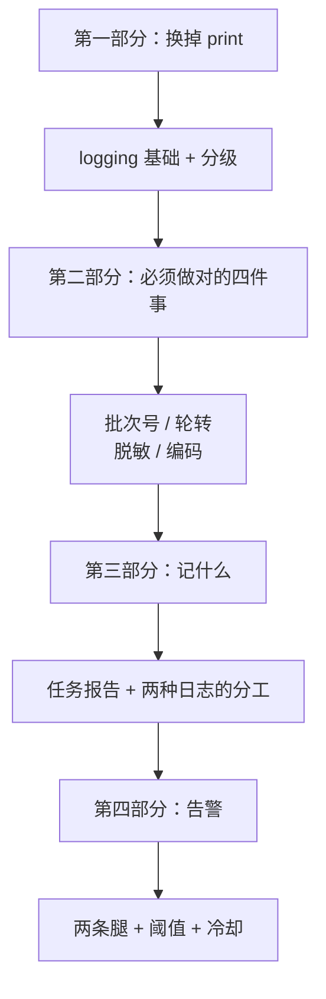

---

# 第一部分　换掉 print

## 14.1 为什么不能只用 `print()`

### 14.1.1 五个致命缺点

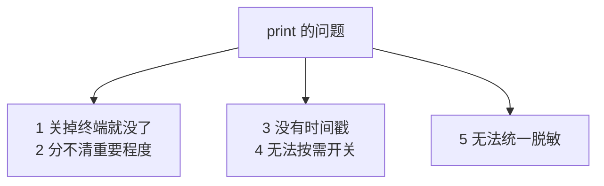

| 缺点 | 具体后果 |
|---|---|
| **留不下** | 想查“上周三 9:05 发生了什么”，没得查 |
| 分不清级别 | 一条“已跳过”和一条“死信”长得一样重要 |
| 没时间戳 | 不知道哪步慢了 |
| 无法开关 | 想看详细过程就得改代码 |
| **无法统一脱敏** | **这是最要命的一条，见 14.7 节** |

### 14.1.2 第五条为什么最要命

前十三章我们**一共发现了六种密钥泄露方式**：

| 泄露方式 | 出处 |
|---|---|
| `print(secret)` | — |
| `print(params)` | 第 4 章 |
| `print(网络异常)` | 第 3 章 |
| `print(config)` | 第 5 章 |
| `print(请求网址)` | 第 7 章 |
| `print(连接字符串)` | 第 10 章 |

**它们的共同点是：你并没有主动打印密钥，是别的东西替你打印了。**

用 `print` 时，防泄露只能靠“每处都记得脱敏”——而这必然会有遗漏。**`logging` 提供了一个统一出口，能在那里一次性兜住全部。**这是本章最大的收益。

---

## 14.2 `logging` 基础

### 14.2.1 四个概念

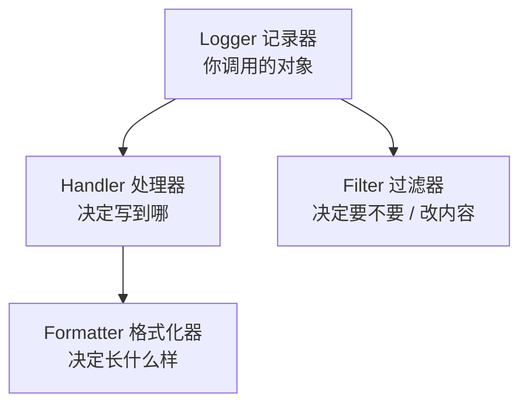

| 概念 | 职责 | 本章怎么用 |
|---|---|---|
| Logger | 你调 `logger.info(...)` | 全程一个，名字叫 `wecom` |
| Handler | 输出到文件/屏幕 | **三个**：全量文件、错误文件、屏幕 |
| Formatter | 排版 | 带时间、级别、批次号、行号 |
| **Filter** | 拦一道 | **脱敏 + 补批次号** |

`Filter` 是本章的关键——**它不只能“过滤掉”，还能“改写内容”**，这正是自动脱敏的实现方式。

### 14.2.2 日志格式里放什么

```python
# 日志格式。为什么带上模块名和行号？
#     因为排查时最想知道的是"这行日志是哪儿打的"。
LOG_FORMAT = ("%(asctime)s | %(levelname)-7s | %(run_id)s | "
              "%(module)s:%(lineno)d | %(message)s")
```

**实测输出：**

```text
2026-09-05 02:38:39 | INFO    | 20260905-090500 | test_logging:141 | 开始执行
2026-09-05 02:38:39 | INFO    | 20260905-090500 | test_logging:142 | 查到 4 条待办
2026-09-05 02:38:39 | INFO    | 20260905-090500 | test_logging:143 | 发送成功 2 条
2026-09-05 02:38:39 | INFO    | - | test_logging:144 | 这条没有批次号
```

五列各有用途：时间定位、级别筛选、**批次号串联**、行号定位代码、内容。

### 14.2.3 自定义字段会导致崩溃——除非补一个 Filter

格式里写了 `%(run_id)s`，但 `LogRecord` **默认没有这个属性**。

```python
class RunIdFilter(logging.Filter):
    """
    给每条日志补上任务批次号字段。

    为什么需要它？
        日志格式里写了 %(run_id)s，但 LogRecord 默认没有这个属性，
        缺了会直接抛 KeyError ——【日志系统自己把程序搞崩】，
        这是新手用自定义格式时最常见的事故。
        这个过滤器保证该字段一定存在。
    """

    def filter(self, record: logging.LogRecord) -> bool:
        if not hasattr(record, "run_id"):
            record.run_id = NO_RUN_ID
        return True
```

**日志系统本身把程序搞崩，是最讽刺的故障。**加这个 Filter 之后，没有批次号的日志会显示 `-`（见上面实测的最后一行）。

### 14.2.4 重复配置会导致日志打印多遍

这是 `logging` 最经典的坑。**实测对比：**

```text
调用 setup_logging 三次后，同一句日志出现 1 次  ✓ 正确

对比：如果不清理旧 handler 会怎样
  同一句日志出现 3 次  ← 这就是 setup_logging 里要先 removeHandler 的原因
```

原因是 `addHandler` 是**累加**的，加三次就输出三次。所以：

```python
    # 【关键】先清掉已有的 handler。
    # 为什么？如果这个函数被调用两次（比如测试里、或者某处手滑），
    # handler 会累加，于是【每条日志被打印两遍、三遍】。
    # 这是 logging 最常见的坑之一，本章 14.2.4 节有实测。
    for handler in list(logger.handlers):
        logger.removeHandler(handler)
        handler.close()

    # 不要把日志再传给根 logger，否则可能又被打印一次
    logger.propagate = False
```

两个细节：

| 写法 | 防的是什么 |
|---|---|
| 先 `removeHandler` | 重复配置导致的多次输出 |
| `propagate = False` | 日志又被根 logger 输出一次 |

> **规则：`setup_logging()` 整个程序只在启动时调用一次**，而且它自己要能容忍被多调用几次。

---

## 14.3 日志级别

### 14.3.1 本教程怎么用这四个级别

| 级别 | 用在什么地方 | 例子 |
|---|---|---|
| `DEBUG` | 排查时才想看的细节 | 请求体内容、退避计算过程 |
| `INFO` | 正常流程的关键节点 | “查到 4 条”“发送成功” |
| `WARNING` | **不正常但程序能继续** | 内容超长被截断、跳过重复、告警冷却中 |
| `ERROR` | **失败了** | 发送失败、数据库连不上、死信 |

**判断标准很简单：**

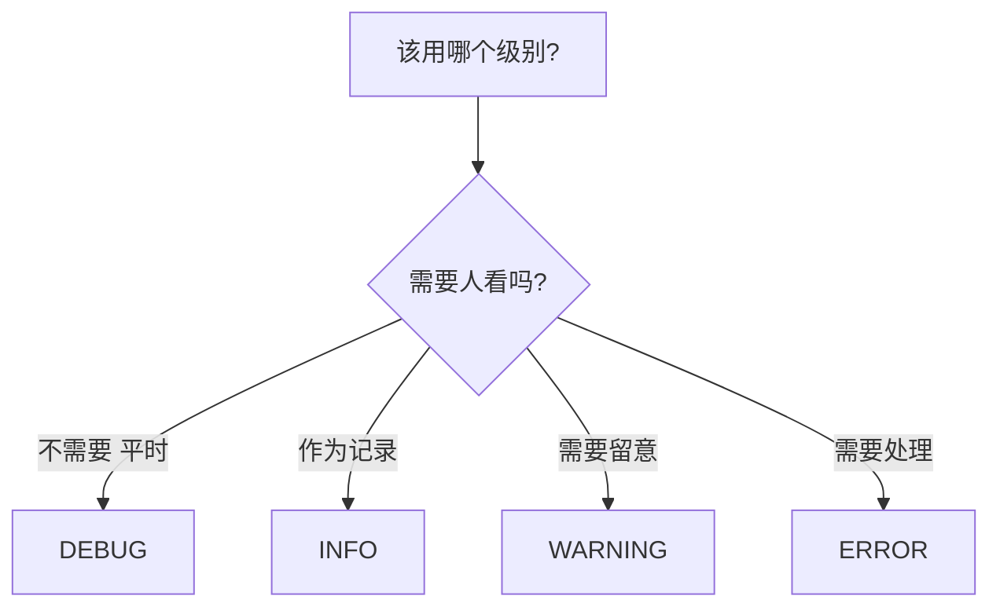

### 14.3.2 实测级别过滤

```text
level=INFO 时 DEBUG    是否记录：False
level=INFO 时 INFO     是否记录：True
level=INFO 时 WARNING  是否记录：True
level=INFO 时 ERROR    是否记录：True
level=DEBUG 时 DEBUG 是否记录：True
```

**平时用 `INFO` 跑，排查时改成 `DEBUG`**——不用改任何业务代码，这就是分级的价值。

### 14.3.3 错误单独写一个文件

```python
    # ---------- 单独一个只记错误的文件 ----------
    # 为什么要分开？因为出问题时你想立刻看到错误，
    # 而不是在几万行 INFO 里翻找。
    error_handler = logging.handlers.RotatingFileHandler(
        filename=os.path.join(log_dir, "wecom-error.log"),
        maxBytes=MAX_BYTES,
        backupCount=BACKUP_COUNT,
        encoding="utf-8",
    )
    error_handler.setLevel(logging.WARNING)
```

**实测：**

```text
wecom.log       行数：3（全部级别）
wecom-error.log 行数：2（只有 WARNING 及以上）
错误文件里有 INFO 吗：False
```

**排查时先看 `wecom-error.log`**，几行就能定位问题；确认细节再去翻全量日志。

### 14.3.4 `logger.exception` 和 `logger.error` 的区别

**实测：**

```text
logger.exception 是否带堆栈：True
logger.error 是否带堆栈：    False
结论：预料之外的错误用 logger.exception，
      已知原因的失败用 logger.error（堆栈只会淹没重点）
```

| 场景 | 用哪个 |
|---|---|
| 发送失败（`errcode=81013`） | `logger.error`——原因已知，堆栈没用 |
| **未预料的异常**（第 9 章的兜底分支） | **`logger.exception`**——需要完整线索 |

**给已知失败打堆栈是有害的**：几十行堆栈会把真正的信息（错误码）挤到屏幕外。

---

# 第二部分　必须做对的四件事

## 14.4 任务批次号

### 14.4.1 问题：几十次执行的日志混在一起

定时任务跑一个月，日志里有几千行。**你怎么知道哪几行属于同一次执行？**

第 9 章已经引入了 `run_id`，但那是手工拼进每条 `print` 里的。本章让它**自动附加**：

```python
def get_task_logger(run_id: str) -> logging.LoggerAdapter:
    """
    取一个"自动带上任务批次号"的 logger。

    用法:
        log = get_task_logger("20260905-090500")
        log.info("查到 %s 条待办", 4)

    LoggerAdapter 是标准库提供的包装器：
        它把 extra 里的字段自动附加到每条日志上，
        这样你不用在每一句 log.info 里手写批次号。
    """
    return logging.LoggerAdapter(logging.getLogger(LOGGER_NAME),
                                 {"run_id": run_id})
```

### 14.4.2 实测效果

```text
2026-09-05 02:38:39 | INFO | 20260905-090500 | test_logging:141 | 开始执行
2026-09-05 02:38:39 | INFO | 20260905-090500 | test_logging:142 | 查到 4 条待办
2026-09-05 02:38:39 | INFO | 20260905-090500 | test_logging:143 | 发送成功 2 条
2026-09-05 02:38:39 | INFO | -               | test_logging:144 | 这条没有批次号
```

**用批次号一搜，一次执行的全过程就出来了。**这在排查“昨天早上那次为什么失败”时是刚需。

### 14.4.3 为什么用 `%s` 而不是 f-string

```python
log.info("查到 %s 条待办", 4)          # 推荐
log.info(f"查到 {4} 条待办")           # 不推荐
```

| 写法 | 差别 |
|---|---|
| `%s` + 参数 | **只在这条日志真要输出时才拼字符串** |
| f-string | 无论级别够不够，**都先拼好** |

如果 `level=INFO` 而你写了大量 `logger.debug(f"...")`，那些字符串**全都白拼了**。日志量大时这是实际开销。

**更重要的是**：`%s` 形式让脱敏过滤器能拿到原始参数，处理更可靠（下一节会看到 `record.getMessage()` 的作用）。

---

## 14.5 日志轮转：别把磁盘写满

### 14.5.1 不轮转的后果

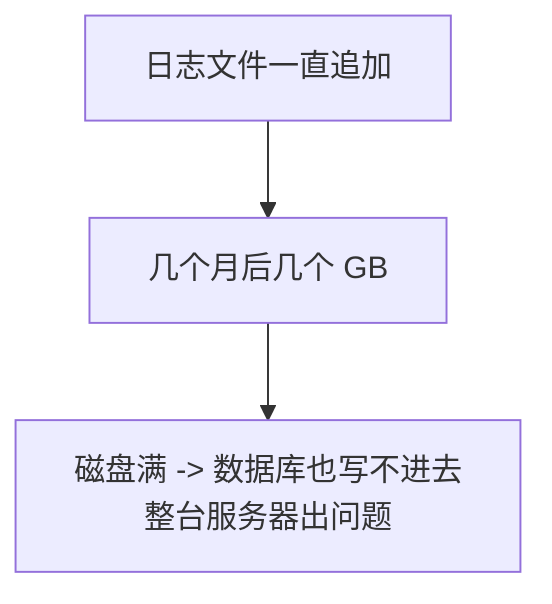

**日志写满磁盘是真实事故**，而且它会连带搞坏别的服务。

### 14.5.2 配置

```python
# 单个日志文件最大多少字节，超过就轮转
MAX_BYTES = 5 * 1024 * 1024          # 5 MB

# 保留多少个历史文件
BACKUP_COUNT = 10
```

**磁盘占用上限是可算的**：`5 MB × (10 + 1) × 2 个文件 ≈ 110 MB`。**心里有数，就不会出事。**

### 14.5.3 实测轮转

用 `maxBytes=2000, backupCount=3` 快速验证：

```text
写入 200 行后产生的文件：['rot.log', 'rot.log.1', 'rot.log.2', 'rot.log.3']
文件个数：4（maxBytes=2000, backupCount=3 -> 最多 4 个）
  rot.log       1408 字节
  rot.log.1     2024 字节
  rot.log.2     2024 字节
  rot.log.3     2024 字节
```

**轮转规则看清楚了**：当前文件是 `rot.log`，历史文件编号越大越旧，超过 `backupCount` 的**自动删除**。

### 14.5.4 按大小还是按时间轮转

| 方式 | 类 | 适合 |
|---|---|---|
| **按大小** | `RotatingFileHandler` | **日志量不确定时**（本教程用它）|
| 按时间 | `TimedRotatingFileHandler` | 想让“每天一个文件”便于按日期找 |

本教程选按大小，因为**它对磁盘的保护是确定的**。按时间轮转时，某天突然爆量仍可能写出一个巨大的文件。

---

## 14.6 编码：必须显式写 `utf-8`

```python
        # 【必须显式指定 utf-8】
        # 不写的话，Windows 上会用系统默认编码（常见是 cp936），
        # 遇到某些字符会抛 UnicodeEncodeError，日志写不进去。
        encoding="utf-8",
```

**实测：**

```text
中文是否正常写入：True
特殊字符是否正常：True
关键：FileHandler 必须显式写 encoding='utf-8'，
      否则 Windows 上用系统默认编码可能抛 UnicodeEncodeError
```

这个坑的恶劣之处在于：**在 Linux 上开发一切正常（默认就是 UTF-8），部署到 Windows 服务器才炸**，而且炸的是日志系统——**你连报错都看不到**。

> 本教程的消息里有 `★`、`✓`、`——`、全角括号这类字符（第 11 章的 Markdown 模板），**它们正是最容易触发编码错误的**。

---

## 14.7 脱敏：本章的核心

### 14.7.1 思路：在唯一出口统一处理

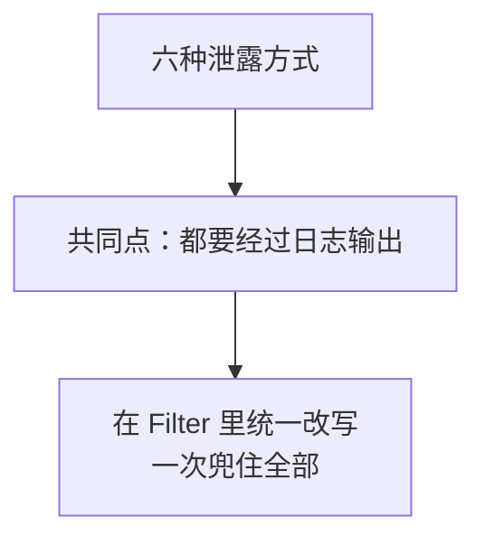

```python
class SecretMaskingFilter(logging.Filter):
    """
    自动把日志里的敏感信息打码。

    为什么要做成过滤器，而不是"每次打日志时自己小心"？
        因为前十三章我们发现了【六种】泄露方式，而它们的共同点是：
        你并没有主动打印密钥，是别的东西替你打印了 ——

            print(secret)          最直接的一种
            print(params)          第 4 章：参数字典里有 corpsecret
            print(网络异常)         第 3 章：异常信息带完整网址
            print(config)          第 5 章：dataclass 的默认 repr
            print(请求网址)         第 7 章：access_token 拼在网址上
            print(连接字符串)       第 10 章：PWD=明文密码

        靠"每次记得脱敏"是不可靠的 —— 总会有一处忘记。
        而过滤器在【所有日志的出口】统一处理，忘不了。
    """
```

### 14.7.2 两种手段：正则 + 具体值

```python
    def __init__(self, extra_secrets=None):
        """
        参数:
            extra_secrets: 额外要打码的具体字符串（比如从配置读到的真实密钥）。

        为什么还要这个参数？
            正则只能覆盖"看起来像密钥赋值"的写法。
            万一密钥被拼进一句普通话里（"用 abc123 去请求失败了"），
            正则认不出来。把真实密钥值登记进来，就能按值精确替换。
        """
```

**实测证明两者都必要。只用正则时：**

```text
① 直接打印密钥              已打码：False   ← 漏了
② 打印参数字典（第 4 章）    已打码：True
③ 打印网络异常（第 3 章）    已打码：True
④ 打印配置对象（第 5 章）    已打码：True
⑤ 打印请求网址（第 7 章）    已打码：True
⑥ 打印连接字符串（第 10 章） 已打码：True

仅正则时 Secret 是否泄露：True
说明：把真实密钥登记进 extra_secrets 才能覆盖『拼进普通话里』的情况
```

第 ① 种（`secret=xxx` 这种自由写法）**只有按值替换才能挡住**。

### 14.7.3 六种泄露方式的实测结果

**加上 `extra_secrets` 后，全部挡住：**

```text
① 直接打印密钥 -> 调试用：secret=***已隐藏***
② 打印参数字典（第 4 章） -> 请求参数：{'corpid': 'ww123456', 'corpsecret': '***已隐藏***'}
③ 打印网络异常（第 3 章） -> 网络请求失败：HTTPSConnectionPool(...)...
④ 打印配置对象（第 5 章） -> WeComConfig(corp_id='ww123456', app_secret='***已隐藏***', agent_id=1000002)
⑤ 打印请求网址（第 7 章） -> 上传素材请求：/cgi-bin/media/upload?access_token=***已隐藏***&type=image
⑥ 打印连接字符串（第 10 章） -> DRIVER={...};SERVER=192.168.1.10,1433;DATABASE=sankodata;UID=sa;PWD=***已隐藏***;

泄露检查：
  应用 Secret      是否出现在日志里：False  ✓ 已挡住
  access_token   是否出现在日志里：False  ✓ 已挡住
  数据库密码        是否出现在日志里：False  ✓ 已挡住
```

**十三章攒下来的六个坑，被一个过滤器一次填平了。**

### 14.7.4 我在这里踩了一个坑：占位符被二次匹配

第一版的输出是这样的（注意第 ⑤ 行）：

```text
⑤ 打印请求网址（第 7 章） -> 上传素材请求：/cgi-bin/media/upload?access_token=***已隐藏*** 42 位）***&type=image
```

**残缺了。**原因是：

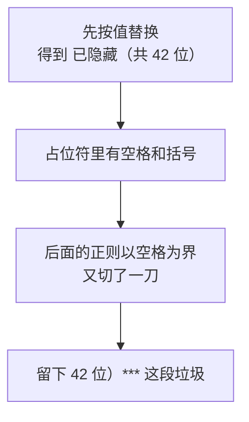

**两处修正：**

```python
# 打码用的占位符。
# 【刻意不含空格和括号】—— 因为脱敏是多个规则依次执行的，
# 占位符如果带空格，会被后面的正则当成"值的结束"再切一刀，
# 结果留下一段残缺文字（实测发现，见 14.7.4 节）。
MASK_PLACEHOLDER = "***已隐藏***"
```

```python
    def mask(self, text: str) -> str:
        """
        把一段文字里的敏感信息替换掉。

        【顺序很关键】必须先跑正则、再按具体值替换。
            反过来会出问题：按值替换后留下的占位符（含空格和括号），
            会被后面的正则【再匹配一次】，切出一段残缺的文字。
            这是实测发现的 bug，见第 14 章 14.7.4 节。
        """
        result = text

        # 第一步：按模式替换（覆盖"看起来像密钥赋值"的写法）
        for pattern, replacement in self.PATTERNS:
            result = pattern.sub(replacement, result)

        # 第二步：按具体值替换（覆盖"密钥被拼进普通话里"的情况）
        for secret in self._extra:
            if secret in result:
                result = result.replace(secret, MASK_PLACEHOLDER)

        return result
```

> **教训：多个改写规则串联执行时，要考虑“前一步的输出会不会被后一步再处理一次”。**这类问题在文本处理里非常常见（第 13 章 13.4.4 节的夹逼顺序是同一类思维错误）。

### 14.7.5 `record.getMessage()` 这一步很关键

```python
        # record.getMessage() 会把 %s 参数套进模板。
        # 必须先合并再脱敏，否则密钥藏在 args 里会漏掉。
        try:
            message = record.getMessage()
        except Exception:
            # 日志格式化本身出错时，不能让它把业务搞崩
            return True
```

因为 `logger.info("参数：%s", params)` 时，**密钥在 `record.args` 里而不在 `record.msg` 里**。只检查 `msg` 会完全漏掉。

改写后还要清掉 `args`：

```python
        if masked != message:
            # 改写后要清掉 args，否则 logging 会再套一次模板导致出错
            record.msg = masked
            record.args = ()
```

### 14.7.6 脱敏不是万能的

必须诚实说明它的**边界**：

| 情况 | 能挡住吗 |
|---|---|
| `logger.info("secret=%s", secret)` | 能 |
| `logger.info("配置：%s", config)` | 能 |
| **密钥被截断后打印**（如 `secret[:20]`） | **不能**（值不完整，匹配不上）|
| **密钥被编码后打印**（如 base64） | **不能** |
| 日志之外的输出（`print`、异常直接抛出） | **不能** |

所以**过滤器是兜底，不是许可证**。前面几章的做法（自定义 `__repr__`、只打印异常类型名、打码函数）**都要保留**——**两层防护，和第 12 章的防重复是同一个思路。**

---

# 第三部分　记什么

## 14.8 每次任务要记录的内容

### 14.8.1 用一个报告对象汇总

```python
@dataclass
class TaskReport:
    """一次任务的执行报告。"""

    run_id: str
    started_at: datetime = field(default_factory=datetime.now)

    # 用 monotonic 计耗时（第 8 章 8.3.3 节：算时长不能用系统时钟）
    _started_monotonic: float = field(default_factory=time.monotonic)

    # 查询阶段
    queried_rows: int = 0            # 查到多少条业务记录
    owner_count: int = 0             # 涉及多少位接收人

    # 发送阶段
    planned_messages: int = 0        # 计划发送多少条消息（分页后）
    sent: int = 0                    # 成功
    skipped: int = 0                 # 跳过（已发过）
    failed: int = 0                  # 失败，下次可重试
    dead: int = 0                    # 死信，需人工
    needs_human: int = 0             # 结果不确定，需人工确认
    dry_run: int = 0                 # 演练
```

**为什么需要它？**

```python
为什么需要它？
    第 9-13 章的日志是"边做边打印"，看得见过程但没有结论。
    而运维真正想知道的是一句话：
        "今天这次任务，查了几条、发了几条、失败几条、耗时多久"
    没有这个汇总，你得从几十行日志里自己数。
```

注意耗时用的是 `time.monotonic()`——**第 8 章 8.3.3 节的规则：算时长不能用系统时钟。**

### 14.8.2 一行汇总

**实测：**

```text
一行汇总：
  查询 12 条，接收人 3 位，计划 4 条，成功 2，跳过 1，失败 1，重试 2 次（等待 6.4 秒），耗时 0.00 秒
```

**设计细节：等于零的项不显示。**（`死信 0`、`待人工 0` 都没出现）——这是第 11 章 11.7.4 节的原则：**满屏的“0”会淹没真正需要注意的数字。**

### 14.8.3 多行明细（告警和排查用）

**实测：**

```text
任务批次：20260905-090500
开始时间：2026-09-05 02:39:11
耗时：0.00 秒
查询 12 条，涉及 3 位接收人
计划发送 4 条
成功 2，跳过 1，失败 1，死信 0，待人工 0
错误码分布：81013 出现 2 次，-1 出现 1 次
```

**最后一行最有价值。**错误码按出现次数排序：

```python
        if self.errcodes:
            # 按出现次数从多到少排，最常见的问题放最前面
            ranked = sorted(self.errcodes.items(), key=lambda kv: -kv[1])
```

**“`81013` 出现 2 次”比“有 2 条失败”有用得多**——它直接告诉你“有两个人不在可见范围”。

### 14.8.4 `skipped` 不算问题

```python
    @property
    def has_problem(self) -> bool:
        """
        这次任务有没有需要关注的问题。

        注意 skipped 不算问题 —— 那是防重机制正常工作（第 12 章）。
        """
        return (self.failed > 0 or self.dead > 0 or self.needs_human > 0)
```

**实测：**

```text
全部成功              has_problem=False
有跳过（防重生效）      has_problem=False   ← 跳过是正常的
有失败但会自动重试      has_problem=True
```

**这个判断很重要。**第 12 章之后，“跳过”会成为最常见的日志——如果把它当问题，你每天都会收到告警。

---

## 14.9 两种日志的分工

### 14.9.1 数据库发送记录 vs 文本运行日志

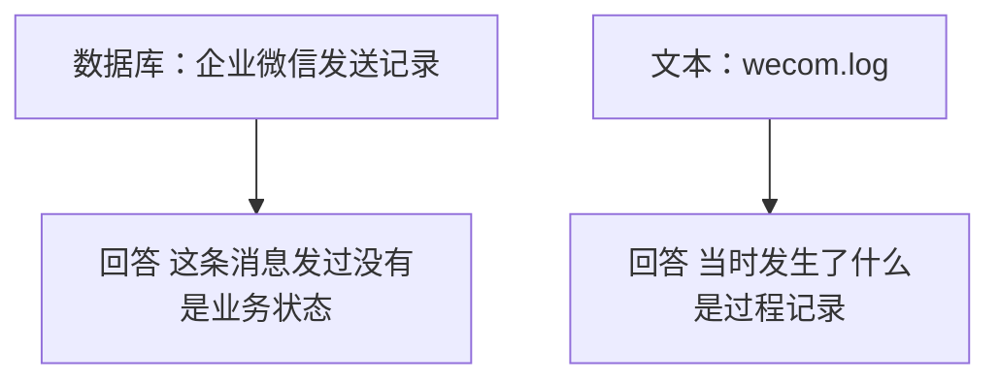

| | 数据库发送记录（第 12 章） | 文本运行日志（本章） |
|---|---|---|
| 回答什么 | **这条消息发过没有** | **当时发生了什么** |
| 程序会读它吗 | **会**（防重靠它） | 不会（只给人看） |
| 结构 | 严格的表结构 | 自由文本 |
| 保留多久 | 至少覆盖防重周期 | 按磁盘容量 |
| 丢了会怎样 | **防重失效，可能重复发送** | 只是查不到历史 |

**最关键的差别在最后一行：数据库记录丢了会导致功能出错，文本日志丢了只是不方便。**

所以：

| 该记在哪 | 内容 |
|---|---|
| **数据库** | 发送状态、`msgid`、错误码、尝试次数 |
| **文本日志** | 决策过程（为什么重试、等了多久）、耗时、汇总 |
| **两边都记** | 错误码——数据库用于判断，日志用于统计 |

### 14.9.2 不要把业务状态只写在日志里

**这是一个常见错误：**用 `grep` 日志来判断“这条发过没有”。

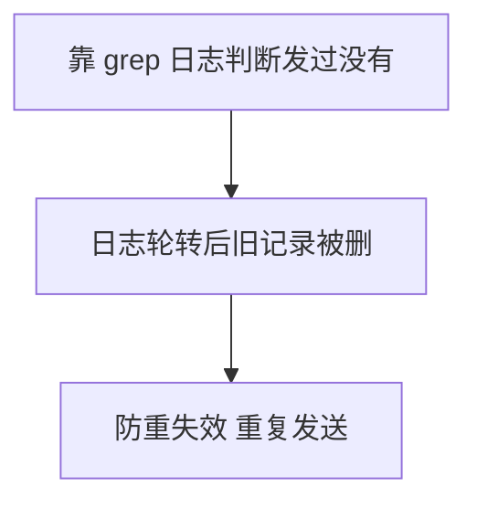

**日志是会被删的**（14.5 节的 `backupCount`）。**凡是程序要读的东西，必须放数据库。**

---

# 第四部分　告警

## 14.10 什么情况才该告警

### 14.10.1 告警疲劳是真实问题

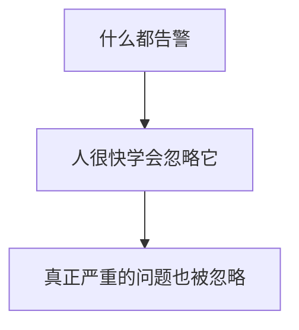

**一个天天响的警报等于没有警报。**所以告警的设计目标不是“不漏报”，而是“**报了就一定值得看**”。

### 14.10.2 只为“自动流程已放弃”的情况告警

```python
    @property
    def needs_alert(self) -> bool:
        """
        是否需要立刻告警。

        为什么 failed 不告警、dead 和 needs_human 才告警？
            failed 的语义是"下次任务会自动再试"（第 13 章 13.7.3 节），
            为它告警等于每天为可自愈的问题打扰人。
            而 dead 和 needs_human 是【自动流程已经放弃】，
            不叫人就永远不会好。
        """
        return self.dead > 0 or self.needs_human > 0
```

**实测五种情形：**

```text
全部成功              has_problem=False  needs_alert=False
有跳过（防重生效）      has_problem=False  needs_alert=False
有失败但会自动重试      has_problem=True   needs_alert=False
有死信                has_problem=True   needs_alert=True
有待人工确认           has_problem=True   needs_alert=True
```

**注意第三行：有失败但不告警。**因为第 13 章已经保证它下次会自动重试——**能自愈的问题不该惊动人。**

### 14.10.3 连续失败才告警

```python
# 连续失败多少次才告警。
# 为什么不是 1 次就告警？
#     偶发失败很常见（网络抖动、系统繁忙），第 13 章已经能自动恢复。
#     一次就告警会造成"告警疲劳"—— 人很快就会屏蔽它，
#     于是真正严重的问题也被忽略。
CONSECUTIVE_FAILURE_THRESHOLD = 2
```

**实测（六次任务，第 3 次成功）：**

```text
第 1 次任务（失败）-> 连续失败 1 次，告警：False
第 2 次任务（失败）-> 连续失败 2 次，告警：True
第 3 次任务（成功）-> 连续失败 0 次，告警：False
第 4 次任务（失败）-> 连续失败 1 次，告警：False
第 5 次任务（失败）-> 连续失败 2 次，告警：False
第 6 次任务（失败）-> 连续失败 3 次，告警：False
```

**第 3 次成功后计数归零**——这是“连续”的含义。

**而第 5、6 次达到阈值却没告警，是冷却期在起作用**（下一节）。

---

## 14.11 告警冷却

### 14.11.1 防止同一问题刷屏

```python
# 同一类告警的最小间隔（秒），防止刷屏。
# 3600 表示：同一个问题一小时内只提醒一次。
ALERT_COOLDOWN_SECONDS = 3600
```

**实测：**

```text
第 1 次调用 send_alert -> True
第 2 次调用 send_alert -> False
第 3 次调用 send_alert -> False
第 4 次调用 send_alert -> False
实际写入告警文件的条数：1（冷却 3600 秒内只记一次）
```

### 14.11.2 冷却有个代价：问题持续存在变得不明显

**这是一个需要如实说明的权衡。**上一节实测里第 5、6 次任务失败时告警返回 `False`，**看起来像告警坏了**。

解决办法是**冷却期内仍然记日志**：

```text
本次任务存在失败，连续失败已 1 次
本次任务存在失败，连续失败已 2 次
已发出告警 [consecutive_failures]：企业微信=成功，本地文件=成功
本次任务存在失败，连续失败已 1 次
本次任务存在失败，连续失败已 2 次
告警 consecutive_failures 处于冷却期内，本次不重复提醒
本次任务存在失败，连续失败已 3 次
告警 consecutive_failures 处于冷却期内，本次不重复提醒
```

**“处于冷却期内”这行日志是必须的**——否则你会怀疑告警逻辑失效了。

> **原则：任何“抑制”行为都要留下记录。**静默地不做某件事，会让人无法区分“抑制了”和“坏了”。

---

## 14.12 告警的两条腿

### 14.12.1 尴尬的问题

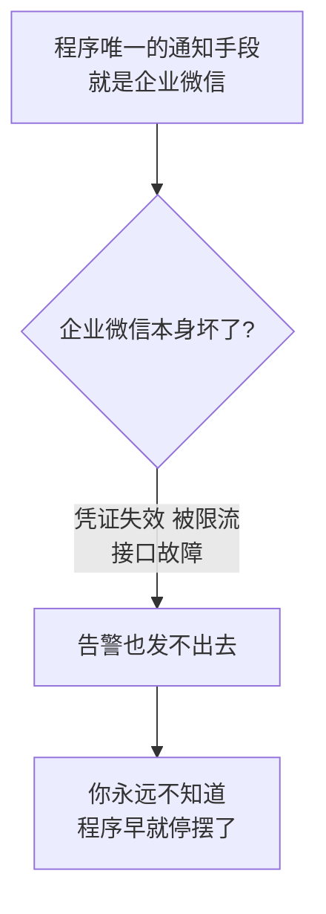

**这等于“用坏了的电话报修电话坏了”。**

```python
本模块要解决一个尴尬的问题：
    我们的程序【唯一的通知手段就是企业微信】。
    如果企业微信本身出了问题（凭证失效、被限流、接口故障），
    那么"用企业微信告警"就等于"用坏了的电话报修电话坏了"。

    所以告警必须有【第二条腿】。
```

### 14.12.2 第二条腿：落地文件

```python
# 落地告警文件。这就是"第二条腿"：
# 即使企业微信完全发不出去，这个文件也一定写得进去。
FALLBACK_ALERT_FILE = "logs/ALERT.txt"
```

**关键设计：先写文件，再发企业微信。**

```python
    # ---------- 第一条腿：落地文件（几乎不会失败）----------
    file_ok = _write_fallback(fallback_file, content)

    # ---------- 第二条腿：企业微信（可能正是它坏了）----------
```

### 14.12.3 实测：企业微信完全不可用时

```text
send_alert 返回：True（企业微信失败，但文件成功）
ALERT.txt 是否生成：True

ALERT.txt 内容：
  [2026-09-05 02:39:11] 任务需要人工介入
    任务批次：20260905-091000
    开始时间：2026-09-05 02:39:11
    耗时：0.00 秒
    查询 0 条，涉及 0 位接收人
    计划发送 0 条
    成功 0，跳过 0，失败 0，死信 2，待人工 0
    错误码分布：40056 出现 1 次
  ------------------------------------------------------------
```

**企业微信抛异常了，但告警内容完整地留在了本地文件里。**

### 14.12.4 为什么用追加而不是覆盖

```python
def _write_fallback(path: str, content: str) -> bool:
    """
    把告警追加到本地文件。

    为什么用追加而不是覆盖？
        因为你要看到"这个问题从什么时候开始的、出现过几次"。
        覆盖只留下最后一次，历史就丢了。
    """
```

### 14.12.5 一个单独的 `ALERT.txt` 而不是混在日志里

**为什么不直接写进 `wecom-error.log`？**

| | `wecom-error.log` | `ALERT.txt` |
|---|---|---|
| 内容 | 所有 WARNING 以上 | **只有需要人处理的** |
| 会轮转吗 | 会（可能被删） | 不轮转 |
| 检查方式 | 需要翻 | **文件存在就说明有事** |

**`ALERT.txt` 存在即异常**——这让检查变成一件极简单的事，甚至可以让运维脚本只看这一个文件。

### 14.12.6 还可以有第三条腿

本教程只做两条腿，但值得知道其他选择：

| 通道 | 优点 | 代价 |
|---|---|---|
| **本地文件** | 几乎不会失败 | **要有人去看** |
| 企业微信 | 主动推送 | **可能正是它坏了** |
| 邮件（SMTP） | 独立通道 | 要配邮件服务器 |
| 短信 | 最独立 | 要花钱 |
| 监控系统 | 专业 | 要部署 |

**如果这个通知程序承担关键业务，至少要加一条真正独立的通道**（邮件或短信）——**否则“程序挂了”这件事只能靠人主动发现。**

---

## 14.13 告警自己失败怎么办

### 14.13.1 绝不能让告警把主流程搞崩

```python
        except Exception as error:
            # 【绝对不能让告警失败反过来把任务搞崩】
            # 告警是辅助功能，它坏了不该影响主流程。
            logger.error("告警发送失败（%s），但已落地到文件 %s",
                         type(error).__name__, fallback_file)
```

**实测（企业微信抛异常 + 文件路径也写不进去）：**

```text
两条腿都失败时 send_alert 返回：False
【关键】它没有抛异常 —— 告警失败不该影响主流程
```

### 14.13.2 这是一条通用原则

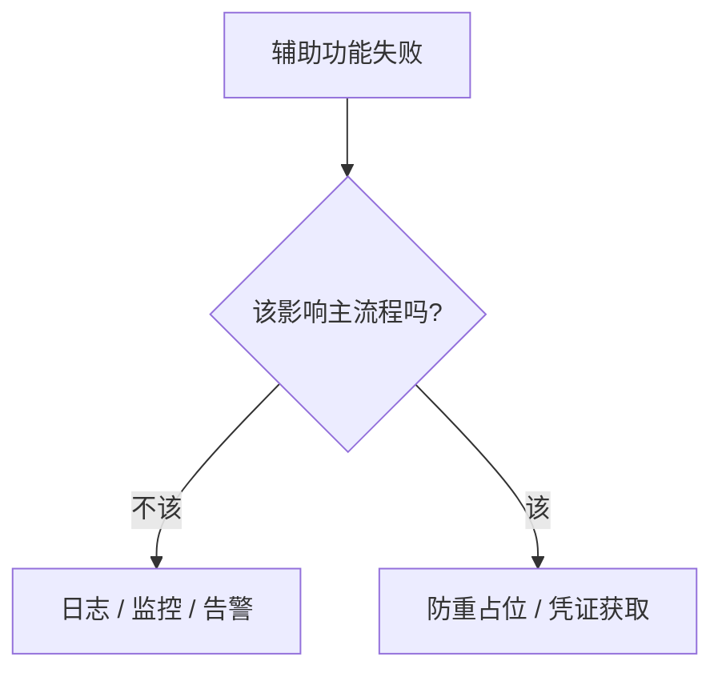

| 功能 | 失败了怎么办 |
|---|---|
| **日志写不进去** | 继续跑（业务照做） |
| **告警发不出去** | 继续跑 |
| **防重占位失败** | **停下**（否则可能重复发送） |
| **取凭证失败** | **停下**（根本发不出去） |

**判断标准：这个功能失败会导致业务出错吗？**日志和告警不会，所以它们必须“安静地失败”。

### 14.13.3 日志格式化本身也要防

```python
        try:
            message = record.getMessage()
        except Exception:
            # 日志格式化本身出错时，不能让它把业务搞崩
            return True
```

比如 `logger.info("值是 %s 和 %s", one)`（参数少给了一个）会在格式化时抛异常。**这一层保护让这种小错误不至于影响业务。**

---

## 14.14 本章改动清单

### 新增文件 `logging_setup.py`

| 内容 | 说明 |
|---|---|
| `LOG_FORMAT` | 五列：时间、级别、**批次号**、模块行号、内容 |
| `MASK_PLACEHOLDER` | **刻意不含空格括号** |
| **`SecretMaskingFilter`** | **统一脱敏，兜住六种泄露方式** |
| `RunIdFilter` | 补 `run_id` 字段，**防 KeyError** |
| `get_task_logger()` | 返回带批次号的 `LoggerAdapter` |
| `setup_logging()` | 三个 handler、**先清旧 handler**、`encoding="utf-8"` |

### 新增文件 `task_report.py`

| 内容 | 说明 |
|---|---|
| `TaskReport` | 八个计数 + 错误码分布 + 重试统计 |
| `has_problem` | **`skipped` 不算问题** |
| `needs_alert` | **只有 `dead`/`needs_human` 才告警** |
| `summary_line()` | 一行汇总，**零值不显示** |
| `detail_lines()` | 多行明细，**错误码按次数排序** |

### 新增文件 `alerting.py`

| 内容 | 说明 |
|---|---|
| `CONSECUTIVE_FAILURE_THRESHOLD` | 连续 2 次才告警 |
| `ALERT_COOLDOWN_SECONDS` | 冷却 1 小时 |
| `AlertState` | 连续失败计数 + 冷却记录 |
| **`send_alert()`** | **两条腿：先落地文件，再发企业微信** |
| `evaluate_and_alert()` | 判断要不要告警 |

### 其他文件的改动

把所有 `print(...)` 换成 `log.info(...)` / `log.warning(...)` / `log.error(...)`：

| 文件 | 改动要点 |
|---|---|
| `main.py` | 启动时调用 `setup_logging()`，**传入真实密钥用于脱敏** |
| `tasks.py` | 用 `get_task_logger(run_id)`，维护 `TaskReport`，末尾调 `evaluate_and_alert()` |
| `sender.py` | `describe_plan()` 的输出改为 `log.warning` |
| `wecom_client.py` / `database.py` 等 | `print` 换成 `logger.debug` / `logger.info` |

> **迁移建议：一个文件一个文件地换，换完立刻跑一次。**一次性全改容易漏掉格式参数，而那类错误只在日志真被输出时才暴露。

### `.gitignore`

第 2 章已经写了 `logs/`，**本章新增的 `ALERT.txt` 也在 `logs/` 下，自动被忽略**。

---

## 14.15 本章完成标志

- [ ] `logs/wecom.log` 生成，每行有时间、级别、批次号、行号
- [ ] `logs/wecom-error.log` 只有 WARNING 及以上
- [ ] **故意在日志里打印配置对象和连接字符串，确认密钥被打码**
- [ ] 用批次号在日志里搜索，能看到一次执行的完整过程
- [ ] 把 `MAX_BYTES` 临时改小（如 2000），跑几次确认生成了 `wecom.log.1`
- [ ] 中文和特殊字符在日志里正常显示
- [ ] 制造一个死信（用错的 `AgentId`），确认 `logs/ALERT.txt` 生成
- [ ] 把企业微信配置改错，确认**告警仍然落地到文件**
- [ ] 连续失败两次才收到告警，第一次不告警

### 本章完成标志

> 制造一个死信，`logs/ALERT.txt` 出现；而把企业微信配置全改错，这个文件**照样**出现。

---

## 14.16 本章小结

### 14.16.1 本章必须带走的 10 条结论

1. **`print` 最大的问题不是留不下，是无法统一脱敏。**
2. **自定义日志字段要配 Filter 兜底**，否则 `KeyError` 会把程序搞崩。
3. **`setup_logging` 要先清旧 handler**，否则日志打印多遍。
4. **`FileHandler` 必须显式 `encoding="utf-8"`**，否则 Windows 上会炸。
5. **脱敏要正则 + 具体值两手都用**，只用正则挡不住自由写法。
6. **多个改写规则串联时，占位符不能含分隔字符**，否则会被二次匹配。
7. **`logger.exception` 用于未预料的错误**，已知失败用 `logger.error`。
8. **`skipped` 不算问题**，否则每天都会误报。
9. **只为“自动流程已放弃”告警**，能自愈的别惊动人。
10. **告警必须有第二条腿**，且**告警失败绝不能影响主流程**。

### 14.16.2 自测题

1. `print` 相比 `logging` 最致命的缺点是什么？（14.1.2）
2. 日志格式里写了 `%(run_id)s` 但不加 Filter，会发生什么？（14.2.3）
3. 为什么 `setup_logging` 里要先 `removeHandler`？（14.2.4）
4. 为什么推荐 `logger.info("查到 %s 条", n)` 而不是 f-string？（14.4.3）
5. 只用正则脱敏，六种泄露方式里哪一种挡不住？（14.7.2）
6. 打码占位符为什么不能带空格和括号？（14.7.4）
7. 为什么脱敏要用 `record.getMessage()` 而不是 `record.msg`？（14.7.5）
8. `skipped` 为什么不算问题？（14.8.4）
9. 有 `failed` 但不告警，理由是什么？（14.10.2）
10. 告警的“第二条腿”为什么必须是本地文件？（14.12.2）

### 14.16.3 六种泄露方式的最终防线

| 泄露方式 | 章节 | 第一层防护 | 第二层（本章）|
|---|---|---|---|
| `print(secret)` | — | 别写 | 脱敏过滤器 |
| `print(params)` | 第 4 章 | 打码函数 | 脱敏过滤器 |
| `print(网络异常)` | 第 3 章 | 只打类型名 | 脱敏过滤器 |
| `print(config)` | 第 5 章 | 自定义 `__repr__` | 脱敏过滤器 |
| `print(请求网址)` | 第 7 章 | 不打网址 | 脱敏过滤器 |
| `print(连接字符串)` | 第 10 章 | `mask_connection_string` | 脱敏过滤器 |

**两层都要保留。**过滤器是兜底，不是替代品——14.7.6 节列出了它挡不住的四种情况。

### 14.16.4 下一章预告

第 15 章把十四章的成果**整合成一个完整项目**：最终目录结构、各文件职责、启动流程、一次任务的完整执行流程、测试模式与正式模式、以及完整的配置项清单。

那一章不引入新概念，是一次**收口**——把散落在各章的代码拼成一个能交付的东西。

之后第 16 章讲部署（Windows 服务 / Linux systemd / 开机自启），第 17 章给完整验收清单，第 18 章是故障排查手册。

---

## 参考的官方文档

1. [Python 官方文档：logging](https://docs.python.org/3/library/logging.html) —— Logger / Handler / Formatter / Filter 的职责划分
2. [Python 官方文档：logging.handlers](https://docs.python.org/3/library/logging.handlers.html) —— `RotatingFileHandler` 与 `TimedRotatingFileHandler`
3. [Python 官方文档：logging cookbook](https://docs.python.org/3/howto/logging-cookbook.html) —— `LoggerAdapter` 添加上下文信息、用 Filter 改写日志内容
4. [企业微信开发者中心：全局错误码](https://developer.work.weixin.qq.com/document/path/90313) —— 告警内容里引用的错误码含义

> 本章的日志级别过滤、文件轮转、脱敏过滤器（含六种泄露方式的复现）、批次号注入、重复配置的后果、告警的两条腿与冷却机制，均在 Python 3.9.25 环境中实际运行验证，共 15 组测试；文中标注“实测”的输出均为真实运行结果。
