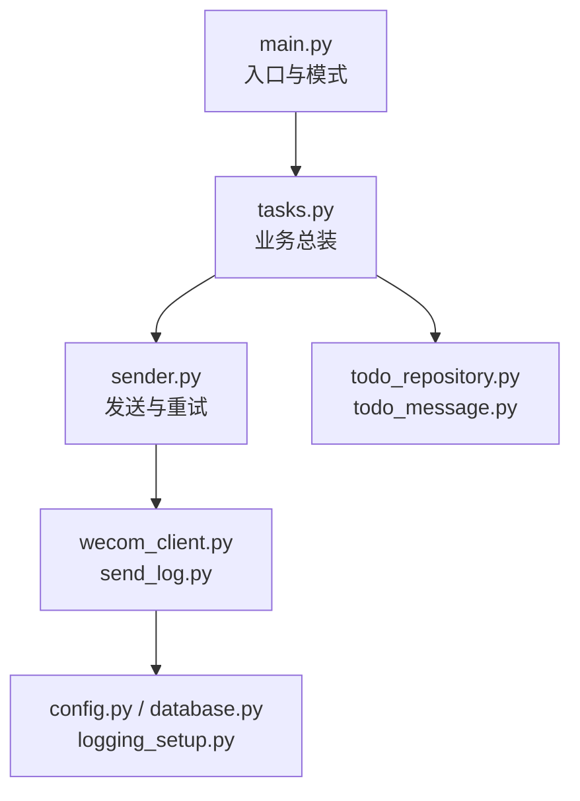
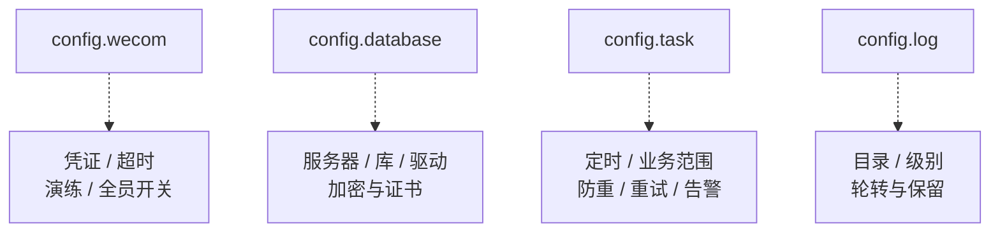
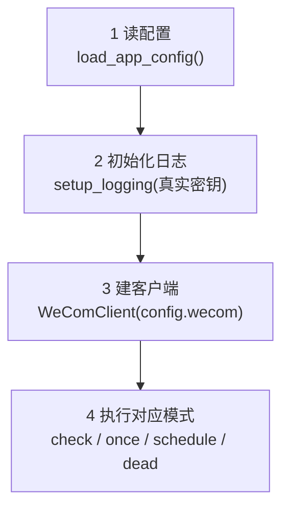
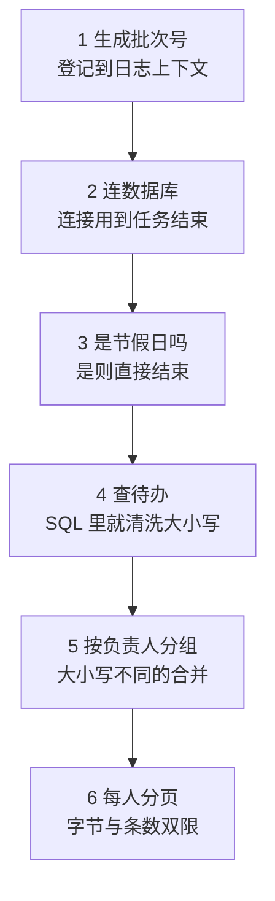
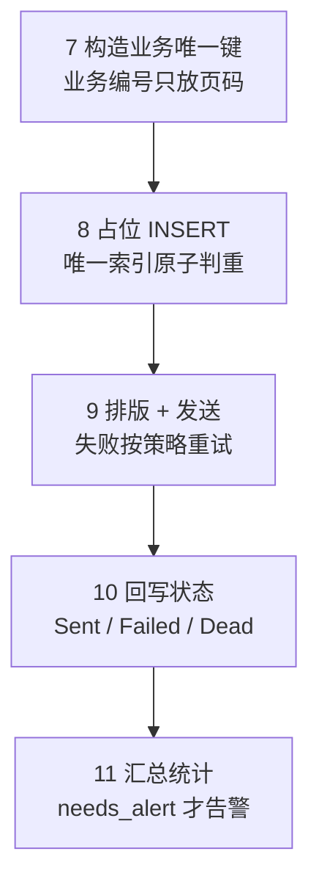
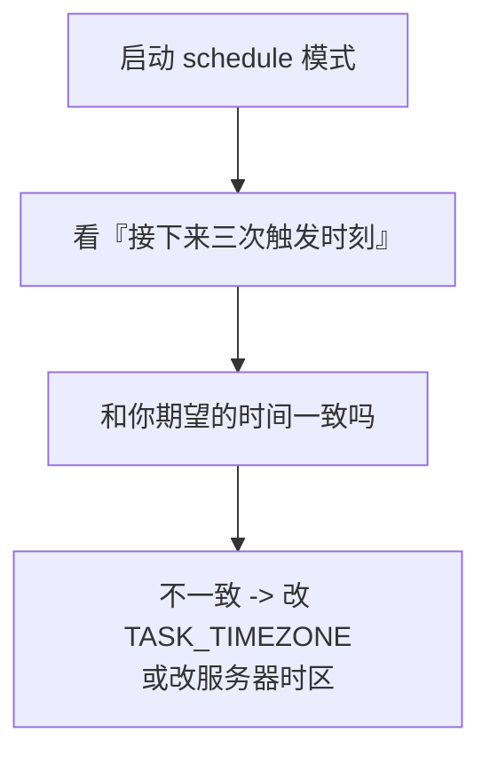
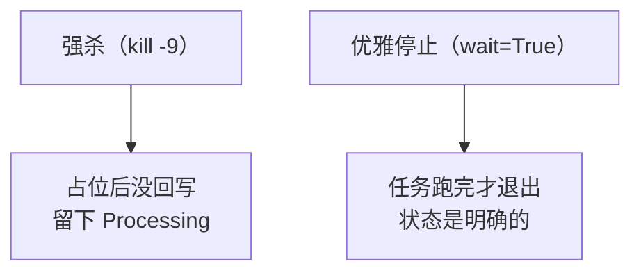
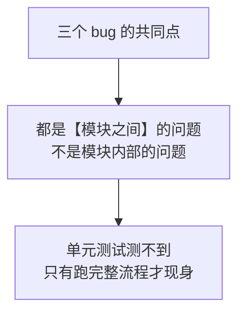

# 第 15 章　整合成一个完整的小型项目

> 本章不引入任何新概念。它做的是一次**收口**：把前十四章散落的代码拼成一个能交付的东西，然后**真的把它跑起来**，证明这些代码放在一起是能协同工作的。
>
> 这一步比听起来重要。前十四章每一章都单独验证过，但"每个零件都合格"和"装起来能开"是两件事——本章就抓到了三个只有在整合后才会暴露的 bug（15.13 节），其中两个是我自己在前面章节里写下的。

---

## 15.0 本章要交付什么

到本章结束，你会有一个这样的东西：

| 能力 | 命令 |
|---|---|
| 检查环境和配置对不对（**不发消息**） | `python main.py check` |
| 立刻执行一次待办提醒 | `python main.py once` |
| 常驻运行，每天定时提醒 | `python main.py schedule` |
| 查看需要人工处理的记录 | `python main.py dead` |

四个命令，覆盖"部署时""调试时""运行时""出事时"四个场景。

### 15.0.1 本章的验证方式

前十四章的代码，本章全部装进一个项目里**实际运行**，共 **111 组断言全部通过**：

```text
端到端测试（18 组场景，103 项断言）：全部通过
定时调度测试（真启动、真等触发、真按 Ctrl+C，8 项断言）：全部通过
```

文中标注"实测"的输出，都是这套测试的真实结果。

> **关于运行环境的说明**（和第 10~14 章一致）：本章在没有 SQL Server 实例的环境里跑通，做法是把 `database.connect()` 换成 sqlite3 连接（DB-API 2.0 是标准接口，`execute` / `description` / `rowcount` / `commit` / `rollback` 的行为两边一致），并用一个本地的假企业微信服务器代替真接口。
>
> 因此本章的实测结论分三类，文中都会标明：
> **① 与数据库品牌无关的流程逻辑**（防重、状态流转、重试、分页、日志、告警、调度）——已实测；
> **② SQL Server 专有语法**（`DATEADD` / `ISNULL` / `IDENTITY` / 唯一索引报错码 2601）——依据第 10~12 章在真实 ODBC 驱动上的实测和官方文档；
> **③ 企业微信真实接口行为**——依据前十四章查证的官方文档与错误码。

---

## 15.1 最终项目结构

```text
wecom-message-service/
├── .env                      ← 【不提交 Git】真实配置
├── .env.example              ← 配置样例，列出全部配置项
├── .gitignore
├── requirements.txt
├── main.py                   ← 唯一入口，四种模式
│
├── config.py                 ← 配置：四组（企业微信/数据库/任务/日志）
├── logging_setup.py          ← 日志与脱敏
│
├── wecom_client.py           ← 企业微信接口
├── token_cache.py            ← 凭证缓存
├── message_builder.py        ← 消息体构造
│
├── database.py               ← 数据库连接
├── todo_repository.py        ← 业务数据查询
├── todo_message.py           ← 消息排版
│
├── send_log.py               ← 发送记录 / 防重复
├── retry_policy.py           ← 重试策略（纯判断）
├── sender.py                 ← 带重试的发送
│
├── task_report.py            ← 一次任务的统计
├── alerting.py               ← 告警
├── scheduler_setup.py        ← 定时调度
├── tasks.py                  ← 业务任务总装
│
├── sql/
│   ├── 01_demo_table.sql     ← 业务表 + 节假日表
│   ├── 02_send_log.sql       ← 发送记录表 + 唯一索引
│   └── 03_sample_data.sql    ← 十条刻意设计的示例数据
└── logs/                     ← 【不提交 Git】
    ├── wecom.log
    ├── wecom-error.log
    └── ALERT.txt             ← 存在即异常
```

**总共 17 个 Python 文件、3519 行**（含注释）。实测行数：

```text
    83 task_report.py       119 scheduler_setup.py     252 tasks.py
   101 message_builder.py   135 alerting.py            266 main.py
   105 todo_repository.py   155 sender.py              337 config.py
   118 token_cache.py       161 retry_policy.py        359 wecom_client.py
   119 database.py（165）   208 todo_message.py        382 send_log.py
                            224 logging_setup.py
```

### 15.1.1 为什么是平铺，不是 `app/` 包

很多教程会让你建一个 `app/` 目录把模块塞进去。这里**故意不这么做**，理由有三个：

| 理由 | 说明 |
|---|---|
| 前十四章一直是平铺的 | 突然改成包，所有 `import` 都要改，而你得到的好处是零 |
| 17 个文件还没到需要分层的规模 | 包结构是为"几十个文件、需要区分公开接口和内部实现"准备的 |
| 平铺时 `python main.py once` 直接能跑 | 用包要处理 `python -m` 和相对导入，新手第一个坑就卡在这 |

**什么时候该改成包？**当你开始做第二个业务（比如"审批超时提醒"），发现 `tasks.py` 要拆成 `tasks_todo.py` 和 `tasks_approval.py`、`sql/` 下的脚本也要分家的时候。**在那之前，平铺是更诚实的结构。**

### 15.1.2 目录里没有的两样东西

| 没有的东西 | 为什么 |
|---|---|
| `tests/` 目录 | 本教程的验证都是"跑一遍看输出"。**自动化测试值得单独一章**（第 17 章会讲验收清单） |
| `utils.py` | 这是个陷阱：一旦有了 `utils.py`，所有"暂时不知道放哪"的函数都会进去，半年后它比业务代码还长 |

---

## 15.2 每个文件的职责

一句话原则：**每个文件只回答一个问题。**

| 文件 | 它回答的问题 | 来自 |
|---|---|---|
| `config.py` | 这个程序有哪些可配的东西？ | 第 5 章 |
| `logging_setup.py` | 日志往哪写？怎么保证不泄露密钥？ | 第 14 章 |
| `message_builder.py` | 怎么把文字变成企业微信要的 JSON？ | 第 7 章 |
| `token_cache.py` | 凭证还能用吗？ | 第 8 章 |
| `wecom_client.py` | 怎么把一条消息发出去？ | 第 5、6、7 章 |
| `database.py` | 怎么连上数据库？结果怎么变成字典？ | 第 10 章 |
| `todo_repository.py` | 哪些待办该提醒？ | 第 11 章 |
| `todo_message.py` | 这些数据排成什么样人愿意读？ | 第 11 章 |
| `send_log.py` | 这条消息发过没有？现在是什么状态？ | 第 12、13 章 |
| `retry_policy.py` | 这次失败该不该再试？ | 第 13 章 |
| `sender.py` | 发送 + 重试 + 记状态，怎么串起来？ | 第 13 章 |
| `task_report.py` | 这次跑得怎么样？ | 第 14 章 |
| `alerting.py` | 要不要惊动人？怎么保证通知得到？ | 第 14 章 |
| `scheduler_setup.py` | 什么时候触发？ | 第 9 章 |
| `tasks.py` | 一次提醒**完整**做哪些事，顺序如何？ | 第 9、11、12、13、14 章 |
| `main.py` | 用户想干什么？程序怎么启动？ | 第 5 章起 |

### 15.2.1 依赖方向：只能从上往下



**这张图最重要的信息是箭头方向：从来没有反向的箭头。**

具体说：

| 规则 | 违反它的后果 |
|---|---|
| `wecom_client.py` **不认识** `tasks.py` | 否则换个业务就得改客户端 |
| `retry_policy.py` **不认识**任何东西（纯函数） | 否则没法单独测 24 种错误码 |
| `todo_message.py` **不碰**数据库和网络 | 否则测排版要先连数据库 |
| 只有 `tasks.py` 知道"业务顺序" | 顺序散落在各处时，没人能说清一次任务到底做了什么 |

### 15.2.2 一个反面例子

如果让 `wecom_client.py` 自己去查发送记录（"发之前我自己看看发过没有"），代码会短一点。但：

- 客户端就绑死了这张表，别的项目没法直接拿去用
- "先占位再发送"这个顺序被藏进了客户端内部，**读 `tasks.py` 再也看不出完整流程**
- 想加一个"演练模式不占位"的开关，得改客户端

**代码短不是目标，能改才是。**

---


## 15.3 配置：从 4 项长到 30 多项之后

第 5 章的配置只有 4 项，一个类装得下。到第 14 章已经有 30 多项，全塞在一个类里，你根本看不出哪几项是数据库的、哪几项是定时的。

本章做的唯一改动是**按用途分成四组**：



分组之后，函数签名也变清楚了：

```python
run_todo_task(client, config)          # 用到全部四组
repo.fetch_pending_todos(connection, status=config.task.pending_status, ...)
```

一眼能看出这个函数用到了哪类配置。

### 15.3.1 `TaskConfig`：一个开关就是一个业务决定

```python
@dataclass(frozen=True)
class TaskConfig:
    """
    "这个任务该怎么跑"的全部开关。

    这一组是最值得单独拎出来的：改这里的值【不用改代码】，
    而且每一项都对应一个业务决定，不是技术细节。
    """

    # ---------- 定时（第 9 章）----------
    daily_hour: int = 9
    daily_minute: int = 5
    timezone: str = "Asia/Shanghai"
    misfire_grace_seconds: int = 300

    # ---------- 业务范围（第 11 章）----------
    days_ahead: int = 3            # 提醒未来几天内到期的
    pending_status: str = "待处理"
    notify_when_empty: bool = False  # 没有待办时要不要发"今天没有待办"
    skip_holiday: bool = True        # 节假日不打扰

    # ---------- 防重（第 12 章）----------
    business_type: str = "待办提醒"
    dedup_strategy: str = "每人每天一条"
    enable_duplicate_check: bool = True      # 企业微信官方的短时防重
    duplicate_check_interval: int = 1800
    retry_failed: bool = True                # 上次失败的，这次要不要重新领取

    # ---------- 重试（第 13 章）----------
    max_attempts: int = 3

    # ---------- 告警（第 14 章）----------
    alert_user_ids: list = field(default_factory=list)
```

**这一组每一项都对应一个业务决定，没有一个是技术细节。**这就是它值得单独成组的原因——改这里的值不用改代码，而且**改之前需要业务上想清楚**。

### 15.3.2 顶层：`AppConfig`

```python
# ============================================================
# 顶层：把四组装在一起
# ============================================================


@dataclass(frozen=True)
class AppConfig:
    """
    整个程序的配置总入口。

    main.py 只做一次 load_app_config()，之后所有函数都从这个对象里取，
    【任何地方都不再直接调用 os.getenv】。

    为什么这条规则重要？
        因为 os.getenv 散落在各处时，你没法回答一个简单问题：
        "这个程序一共有哪些配置项？"
        第 15 章 15.10 节能列出完整清单，靠的就是这条规则。
    """

    wecom: WeComConfig
    database: DatabaseConfig
    task: TaskConfig
    log: LogConfig
```

那条"任何地方都不再直接调用 `os.getenv`"的规则，价值在 15.14 节兑现：**正是因为所有配置项都必须经过 `load_app_config()`，我才能列出一份完整的配置清单。**如果 `os.getenv` 散落在 17 个文件里，这份清单永远是不全的。

### 15.3.3 跨字段校验：程序能启动 ≠ 配置是对的

```python
def _validate(wecom: WeComConfig, task: TaskConfig) -> None:
    """
    跨字段的检查。这些错误单看一项是发现不了的。

    【为什么要有这个函数】
        程序能启动 ≠ 配置是对的。
        比如"收件人一个都没配"，程序照样能跑起来，
        只是每天安静地什么都不发 —— 这种故障最难发现。
    """
    if not (0 <= task.daily_hour <= 23):
        raise ConfigError(f"TASK_DAILY_HOUR 必须在 0~23 之间，当前：{task.daily_hour}")
    if not (0 <= task.daily_minute <= 59):
        raise ConfigError(f"TASK_DAILY_MINUTE 必须在 0~59 之间，当前：{task.daily_minute}")
    if task.days_ahead < 0:
        raise ConfigError(f"TASK_DAYS_AHEAD 不能是负数，当前：{task.days_ahead}")
    if task.max_attempts < 1:
        raise ConfigError(f"TASK_MAX_ATTEMPTS 至少是 1，当前：{task.max_attempts}")
    if task.dedup_strategy not in ("每人每天一条", "内容变化即重发", "永久只发一次"):
        raise ConfigError(
            "TASK_DEDUP_STRATEGY 只能是 每人每天一条 / 内容变化即重发 / 永久只发一次，"
            f"当前：{task.dedup_strategy!r}"
        )
    if not wecom.agent_id.isdigit():
        raise ConfigError(f"WECOM_AGENT_ID 应该是纯数字，当前：{wecom.agent_id!r}")
```

**最值得注意的是"防重策略写错"这一条。**如果不校验，`TASK_DEDUP_STRATEGY=每天一条`（少了"人"字）会怎样？`build_send_key()` 里的 `if / elif / else` 会走到 `else` 分支，**悄悄按"每人每天一条"处理**——程序照跑，你以为配置生效了。

**实测：**

```text
[OK] 缺必填项时退出码为 2   -> 配置有误，程序无法启动：缺少必填配置 WECOM_APP_SECRET。请检查 .env 文件（可参考 .env.example）
[OK] 防重策略写错时拒绝启动
[OK] AgentId 不是数字时拒绝启动
[OK] 小时超范围时拒绝启动
```

> **原则：配置错误要在启动时炸，不要在运行时才发现。**启动时炸，你正盯着屏幕；运行时才发现，是三天后同事问你"我怎么没收到提醒"。

---

## 15.4 程序启动流程：四步，顺序不能换



```python
def main(argv=None) -> int:
    argv = argv if argv is not None else sys.argv[1:]
    mode = (argv[0] if argv else "check").lower()

    if mode in ("-h", "--help", "help") or mode not in MODES:
        print(USAGE)
        return 0 if mode in ("-h", "--help", "help") else 2

    # ---------- 启动的四步，顺序不能换 ----------
    # 1. 先读配置：配置错了后面什么都别做
    try:
        config = load_app_config()
    except ConfigError as error:
        # 【注意这里只能用 print】因为日志还没初始化。
        # 这是整个程序里唯一一处允许 print 的地方。
        print(f"配置有误，程序无法启动：{error}")
        return 2

    # 2. 再初始化日志：把真实密钥交给脱敏过滤器
    #    只有这一步之后，打日志才是安全的。
    log = setup_logging(config.log, extra_secrets=[
        config.wecom.app_secret,
        config.wecom.corp_id,
        config.database.password,
    ])
    log.info("程序启动，模式=%s", mode)

    # 3. 建客户端（此时还不会发任何请求）
    client = build_client(config)

    # 4. 执行对应模式
    try:
        return MODES[mode](config, client, log)
    except KeyboardInterrupt:
        log.info("用户中断。")
        return 130
    except Exception:
        # 兜底：任何漏网的异常都要留下完整堆栈，否则排查无门。
        log.exception("出现未处理的异常，程序退出")
        return 1
```

### 15.4.1 为什么"读配置"必须在"初始化日志"之前

因为脱敏过滤器需要**真实的密钥值**才能工作。

第 14 章说过，脱敏有两手：正则（挡住 `corpsecret=xxx` 这类有名字的写法）+ 比对真实值（挡住裸打印）。第二手需要知道密钥是什么。所以顺序只能是：**先读配置，拿到密钥，再用它初始化日志。**

代价是：**读配置这一步出错时，只能用 `print`。**

```python
    except ConfigError as error:
        # 【注意这里只能用 print】因为日志还没初始化。
        # 这是整个程序里唯一一处允许 print 的地方。
        print(f"配置有误，程序无法启动：{error}")
        return 2
```

**整个项目只有这一处 `print`。**第 14 章立的规矩是"不许用 print"，而这里是那条规矩唯一合理的例外——并且在注释里写清楚了为什么。

### 15.4.2 退出码是给机器看的

| 退出码 | 含义 | 谁在看 |
|---|---|---|
| `0` | 正常（**包括"全部跳过"**） | Windows 计划任务的"上次运行结果" |
| `1` | 需要人工介入（死信 / 结果不确定 / 数据库异常） | 监控脚本、systemd |
| `2` | **配置错误，根本没启动** | 部署的人 |
| `130` | 用户 Ctrl+C | —— |

**把"配置错误"和"运行失败"分成 2 和 1，是给部署的人省时间。**看到 2 就去查 `.env`，看到 1 就去看日志——不用猜。

---

## 15.5 四种模式

### 15.5.1 `check`：部署时的第一个命令

```python
def mode_check(config, client, log) -> int:
    """
    自检。分四项，每项独立报告成功/失败，【全部跑完再退出】。

    为什么不遇到第一个错就退出？
        因为新手部署时往往有好几处配置都错了。
        一次告诉他全部问题，比让他改一处、跑一次、再发现下一处要好得多。
    """
    log.info("========== 开始自检 ==========")
    problems = []

    # 1. 配置
    log.info("[1/4] 配置读取：成功")
    log.info("      企业微信：%s", config.wecom)
    log.info("      数据库：%s", config.database)
    log.info("      任务：每天 %02d:%02d｜提醒未来 %s 天｜防重策略=%s｜最多尝试 %s 次",
             config.task.daily_hour, config.task.daily_minute,
             config.task.days_ahead, config.task.dedup_strategy,
             config.task.max_attempts)
    if not config.task.alert_user_ids:
        log.warning("      没有配置告警接收人 TASK_ALERT_USER_IDS，"
                    "出问题时只会写入 logs/ALERT.txt")

    # 2. 数据库
    try:
        with db.open_connection(config.database) as connection:
            count = repo.count_pending_todos(connection,
                                             status=config.task.pending_status,
                                             days_ahead=config.task.days_ahead)
            holiday = repo.is_today_holiday(connection)
            summary = send_log.status_summary(connection, days=7)
        log.info("[2/4] 数据库连接：成功")
        log.info("      当前符合条件的待办：%s 条", count)
        log.info("      今天是节假日吗：%s", "是" if holiday else "否")
        log.info("      最近 7 天发送记录：%s", summary or "（没有记录）")
    except db.DatabaseError as error:
        problems.append(f"数据库：{error}")
        log.error("[2/4] 数据库连接：失败 —— %s", error)

    # 3. 企业微信凭证
    try:
        token = client.get_access_token()
        log.info("[3/4] 企业微信凭证：成功（长度 %s）", len(token))
        log.info("      %s", client.describe_token_cache())
    except WeComError as error:
        problems.append(f"企业微信：{error}")
        log.error("[3/4] 企业微信凭证：失败 —— %s", error)

    # 4. 日志与告警文件可写
    #    为什么要单独测这一项？因为磁盘满、目录没权限这两种情况下，
    #    程序看起来一切正常，只是【出事时的告警写不进去】——
    #    等你需要它的时候才发现，就太晚了。
    try:
        probe = os.path.join(config.log.log_dir, ".selftest")
        with open(probe, "w", encoding="utf-8") as handle:
            handle.write("自检写入测试")
        os.remove(probe)                 # 测完就删，不留垃圾文件
        log.info("[4/4] 日志与告警目录可写：成功")
    except Exception as error:
        problems.append(f"日志目录：{error}")
        log.error("[4/4] 日志与告警目录：失败 —— %s", error)

    if problems:
        log.error("========== 自检发现 %s 个问题 ==========", len(problems))
        for item in problems:
            log.error("  - %s", item)
        return 1

    log.info("========== 自检全部通过，可以执行 python main.py once ==========")
    return 0


# ============================================================
# 模式二：执行一次
# ============================================================
```

**四项检查全部跑完才退出，不是遇到第一个错就停。**因为新手部署时往往有好几处配置都错了，一次告诉他全部问题，比让他改一处、跑一次、再发现下一处要好得多。

**实测（全部通过时）：**

```text
2026-09-05 09:36:20 | INFO    | - | main:254 | 程序启动，模式=check
2026-09-05 09:36:20 | INFO    | - | main:54 | ========== 开始自检 ==========
2026-09-05 09:36:20 | INFO    | - | main:58 | [1/4] 配置读取：成功
2026-09-05 09:36:20 | INFO    | - | main:59 |       企业微信：WeComConfig(corp_id=wwMO...3456, app_secret=***已隐藏***, agent_id=1000002, default_user_ids=['zhangsan', 'lisi'], dry_run=False)
2026-09-05 09:36:20 | INFO    | - | main:60 |       数据库：DatabaseConfig(server=127.0.0.1, database=DemoDB, user=sa, password=***已隐藏***, driver=ODBC Driver 18 for SQL Server)
2026-09-05 09:36:20 | INFO    | - | main:61 |       任务：每天 09:05｜提醒未来 3 天｜防重策略=每人每天一条｜最多尝试 3 次
2026-09-05 09:36:20 | INFO    | - | main:77 | [2/4] 数据库连接：成功
2026-09-05 09:36:20 | INFO    | - | main:78 |       当前符合条件的待办：8 条
2026-09-05 09:36:20 | INFO    | - | main:79 |       今天是节假日吗：否
2026-09-05 09:36:20 | INFO    | - | main:80 |       最近 7 天发送记录：（没有记录）
2026-09-05 09:36:20 | INFO    | - | main:88 | [3/4] 企业微信凭证：成功（长度 18）
2026-09-05 09:36:20 | INFO    | - | main:89 |       token缓存：有 剩余6899秒 命中0次 取回1次 强制刷新0次
2026-09-05 09:36:20 | INFO    | - | main:103 | [4/4] 日志与告警目录可写：成功
2026-09-05 09:36:20 | INFO    | - | main:114 | ========== 自检全部通过，可以执行 python main.py once ==========
```

三个细节值得注意：

| 输出 | 它证明了什么 |
|---|---|
| `app_secret=***已隐藏***` | 打印配置对象**不会**泄露密钥（第 5 章第四种泄露 + 第 14 章过滤器，两层都在） |
| `当前符合条件的待办：8 条` | 数据库连通、**SQL 条件写对了**。如果这里是 0，就该先去查 SQL 而不是去发消息 |
| `check 模式没有发送任何消息` | 实测断言之一。自检**绝不能**给同事发测试消息 |

### 15.5.2 `once`：调试和补发

```python
def mode_once(config, client, log) -> int:
    """
    执行一次。

    退出码是给【调用方】看的（Windows 计划任务、systemd、监控脚本）：
        0 = 正常（包括"全部跳过"，那也是正常的）
        1 = 需要人工介入（有死信、有结果不确定、或数据库异常）
    """
    report = run_todo_task(client, config)
    log.info("本次结果：%s", report.summary_line())
    return 1 if report.needs_alert else 0
```

### 15.5.3 `schedule`：常驻运行

```python
def mode_schedule(config, client, log) -> int:
    """
    启动定时调度，常驻运行。

    【告警状态必须放在这里创建】
        AlertState 记的是"连续失败几次"，只有在一直运行的进程里才有意义。
        每次任务都新建一个，连续判断就永远是第 1 次，阈值形同虚设。
    """
    alert_state = alerting.AlertState()
    scheduler = create_scheduler(config.task.timezone)

    job = add_daily_job(
        scheduler,
        lambda: run_todo_task(client, config, alert_state=alert_state),
        hour=config.task.daily_hour,
        minute=config.task.daily_minute,
        timezone=config.task.timezone,
    )

    log.info("已注册定时任务：")
    log.info("\n%s", describe_jobs(scheduler))
    log.info("接下来三次触发时刻（用它确认时区没配错）：")
    for when in preview_fire_times(job.trigger, 3):
        log.info("  %s", when.strftime("%Y-%m-%d %H:%M:%S %z"))

    log.info("调度已启动，按 Ctrl+C 停止。")
    try:
        scheduler.start()
    except (KeyboardInterrupt, SystemExit):
        # 【优雅停止】wait=True 表示"等正在跑的那次任务做完再退出"。
        # 为什么重要？因为任务可能正卡在"已占位、还没回写"的状态，
        # 强杀会留下一条 Processing 记录，那条消息就要人工确认了。
        log.info("收到停止信号，等待正在执行的任务结束……")
        scheduler.shutdown(wait=True)
        log.info("已安全停止。")
    return 0
```

**`AlertState` 为什么必须建在这里？**因为它记的是"连续失败几次"。如果每次任务都新建一个，连续判断就永远是第 1 次，第 14 章那个"连续 2 次才告警"的阈值形同虚设。

而 `once` 模式**故意不传** `alert_state`——单次执行本来就只跑一次，"连续"这个概念不适用，有问题就该立刻报。

### 15.5.4 `dead`：出事时看的那一屏

```python
def mode_dead(config, client, log) -> int:
    """
    列出需要人处理的记录。这是每天早上值班的人要看的那一屏。

    两类都要看：
        Dead        —— 自动流程已放弃，必须人工处理
        Processing 卡住 —— 结果不确定，必须人工确认消息到底发出去没有
    """
    try:
        with db.open_connection(config.database) as connection:
            dead = send_log.find_dead(connection, days=7)
            stuck = send_log.find_stuck(connection, older_than_minutes=30)
            summary = send_log.status_summary(connection, days=7)
    except db.DatabaseError as error:
        log.error("查询失败：%s", error)
        return 1

    log.info("最近 7 天各状态数量：%s", summary or "（没有记录）")

    log.info("死信 %s 条：", len(dead))
    for row in dead:
        log.info("  %s/%s/%s 错误码=%s 说明=%s",
                 row["业务类型"], row["业务编号"], row["接收人"],
                 row["错误码"], row["错误说明"])

    log.info("卡在 Processing 超过 30 分钟的 %s 条（需人工确认是否已送达）：", len(stuck))
    for row in stuck:
        log.info("  %s/%s/%s 最后尝试=%s",
                 row["业务类型"], row["业务编号"], row["接收人"], row["最后尝试时间"])

    return 1 if (dead or stuck) else 0
```

**两类都要看，而且性质完全不同：**

| 类别 | 状态 | 该做什么 |
|---|---|---|
| 死信 | `Dead` | 自动流程**已放弃**。看错误码，改配置/权限，然后手工补发 |
| 卡住 | `Processing` 超 30 分钟 | 结果**不确定**。先去问收件人"你收到了吗"，再决定改成 Sent 还是 Failed |

---


## 15.6 一次任务的完整执行流程

这是全书最需要看懂的一张图。**每一步都对应前面某一章的一个结论。**

**前半段：准备（决定"该发给谁、发什么"）**



**后半段：发送（每一页各走一遍）**



**第 8 步和第 9 步的顺序是整个流程的核心。**第 12 章的结论：

| 顺序 | 崩在中间的后果 | 能被发现吗 |
|---|---|---|
| **先占位，再发送**（本项目） | 可能**漏发** | 能——记录卡在 `Processing` |
| 先发送，再记录 | 可能**重发** | **不能**，静默发生 |

> **在两种坏结果之间，选那个"留下证据"的。**

### 15.6.1 连接的生命周期变了

第 10、11 章的写法是"查完就关连接"。到第 12 章不行了——**占位、发送、回写状态都要用同一个连接**，而它们贯穿整个发送过程。

所以本项目的连接是**一次任务开一次、用到任务结束**：

```python
        with db.open_connection(config.database) as connection:
```

用 `with` 是因为第 10 章那个坑：`with pyodbc.connect(...)` 退出时**只提交事务、不关闭连接**，所以 `open_connection()` 里用 `contextlib.closing` 显式关。

---

## 15.7 从查询到发送结果落库的完整代码

### 15.7.1 构造业务唯一键

```python
def build_send_key(owner: str, page_rows: list, page_index: int,
                   task_config) -> send_log.SendKey:
    """
    构造业务唯一键。四个字段的含义：

        业务类型 = "待办提醒"      —— 区分不同业务
        业务编号 = "p1" / "p2"     —— 第几页（分页后每页是独立的一条消息）
        接收人   = UserID
        消息版本 = 取决于防重策略

    为什么业务编号【只放页码、不放总页数】？
        因为总页数会变。早上 4 项分 1 页（p1/1），下午新增到 15 项
        分 2 页（p1/2）—— 如果业务编号里带了总页数，第 1 页就成了
        "新的一条消息"，会被重复发送。这是第 12 章真踩到的坑。

    为什么页码要放进业务编号？
        因为分 3 页时是【三条独立的消息】，必须能分别记录
        "第 1 页发过了、第 2 页还没发"。
    """
    strategy = task_config.dedup_strategy
    if strategy == "永久只发一次":
        version = send_log.VERSION_ONCE
    elif strategy == "内容变化即重发":
        version = (send_log.version_by_day() + "-" +
                   send_log.version_by_content(_business_signature(page_rows)))
    else:                                    # 每人每天一条（默认）
        version = send_log.version_by_day()

    return send_log.SendKey(
        业务类型=task_config.business_type,
        业务编号=f"p{page_index}",
        接收人=owner,
        消息版本=version,
    )
```

**"业务编号只放页码、不放总页数"这一条是踩出来的。**早上 4 项分 1 页（`p1/1`），下午新增到 15 项分 2 页（`p1/2`）——如果业务编号里带了总页数，第 1 页就变成了"一条新消息"，会被重复发送。

### 15.7.2 业务指纹只取业务数据

```python
def _business_signature(page_rows: list) -> str:
    """
    这一页的"业务指纹"：只用【业务数据】，不用最终文字。

    【为什么不能直接对最终消息文字算哈希】
        文字里有"已逾期 3 天"这种随时间变化的表述，
        什么都没变、只是过了一天，指纹也会变 —— 于是又发一条。
        所以指纹只取真正的业务字段。
    """
    parts = []
    for row in page_rows:
        parts.append("|".join([
            str(row.get("待办编号")),
            str(row.get("状态")),
            str(row.get("截止时间")),
            str(row.get("金额")),
        ]))
    return ";".join(parts)
```

这条规则**只有"内容变化即重发"策略才用得到**，但它是最容易写错的一处：拿最终消息文字算哈希，看起来更直接，实际上"已逾期 3 天"过一天就变成"已逾期 4 天"，**什么都没改也会重发一条**。

### 15.7.3 发一页：占位 → 发送 → 回写

```python
def _send_one_page(client, connection, config, log, report, owner,
                   page_rows, page_index, page_count) -> SendOutcome:
    """
    发一页。顺序是【先占位，再发送】—— 这个顺序是第 12 章的核心结论：

        先占位：崩在中间可能【漏发】，但记录卡在 Processing，有痕迹
        先发送：崩在中间可能【重发】，而且是静默的，没人知道

        在两种坏结果之间，选那个"留下证据"的。
    """
    key = build_send_key(owner, page_rows, page_index, config.task)

    decision = send_log.claim_or_skip(
        connection, key,
        retry_failed=config.task.retry_failed,
        max_attempts=config.task.max_attempts,
    )
    if decision == "skip":
        report.skipped += 1
        return SendOutcome.SKIPPED
    if decision == "unknown":
        report.needs_human += 1
        return SendOutcome.NEEDS_HUMAN

    content = todo_message.build_todo_markdown(owner, page_rows,
                                               page_index, page_count)
    report.planned += 1

    outcome = send_with_retry(
        client, connection, key, content, owner,
        max_attempts=config.task.max_attempts,
        report=report,
        enable_duplicate_check=config.task.enable_duplicate_check,
        duplicate_check_interval=config.task.duplicate_check_interval,
    )

    # 【演练模式必须撤销占位】（第 12 章 12.13 节）
    # 否则记录变成 Sent，而消息根本没发出去 ——
    # 这条消息就【永久丢失】了，因为防重会一直拦着它。
    if config.wecom.dry_run and outcome == SendOutcome.SENT:
        send_log.mark_failed(connection, key, None, "演练模式，未真正发送")
        log.warning("演练模式：已撤销占位（状态改回 Failed），下次会真正发送")

    return outcome
```

三个返回值 `claimed / skip / unknown` 是从 `send_log.claim_or_skip()` 来的。**把五种状态组合的判断收在一个函数里**，而不是散在 `tasks.py`——状态判断散落在业务代码里，必然漏掉一种。

这个函数是本章从 `tasks.py` 里**收回来**的（第 12、13 章原来是把状态判断写在业务流程里的）：

```python
def claim_or_skip(connection, key: SendKey, retry_failed: bool = True,
                  max_attempts: int = 3) -> str:
    """
    把"该不该发"这个判断收在一处，返回三种结论之一：

        "claimed"  —— 该发（新占位，或成功领取了上次失败的）
        "skip"     —— 跳过（已发过 / 别人正在发 / 死信 / 次数用尽）
        "unknown"  —— 卡在 Processing 且已超时，需要人工确认

    tasks.py 只看这个返回值，不用自己拼状态判断——
    状态组合有五种，散落在业务代码里必然漏掉一种。
    """
    if try_claim(connection, key):
        return "claimed"

    record = get_status(connection, key)
    if record is None:
        # 极罕见：占位失败但又查不到记录（并发下刚被清理）。保守起来跳过。
        return "skip"

    status = record["状态"]
    if status == STATUS_SENT:
        logger.info("跳过（今天已发过）：%s", key)
        return "skip"
    if status == STATUS_DEAD:
        logger.warning("跳过（死信，等待人工处理）：%s", key)
        return "skip"
    if status == STATUS_FAILED:
        if not retry_failed:
            logger.info("跳过（上次失败，但没开启重试）：%s", key)
            return "skip"
        if reclaim_if_attempts_left(connection, key, max_attempts):
            logger.info("重新领取上次失败的记录（第 %s 次）：%s",
                        record["尝试次数"] + 1, key)
            return "claimed"
        logger.warning("跳过（失败次数已达上限 %s）：%s", max_attempts, key)
        return "skip"

    # 剩下的就是 Processing。
    stale = datetime.now() - _as_datetime(record["最后尝试时间"]) > timedelta(minutes=30)
    if stale:
        logger.warning("发现卡住的记录（Processing 超过 30 分钟），需人工确认：%s", key)
        return "unknown"
    logger.info("跳过（另一个进程正在发送）：%s", key)
    return "skip"
```

**五种情况对应五种结论：**

| 记录当前状态 | 结论 | 理由 |
|---|---|---|
| 不存在 | `claimed` | 占位成功，该我发 |
| `Sent` | `skip` | 今天已经发过 |
| `Dead` | `skip` | 自动流程已放弃，等人处理 |
| `Failed` | `claimed` 或 `skip` | 看还剩几次机会（**次数判断写在 SQL 的 WHERE 里**） |
| `Processing` | `skip` 或 `unknown` | 30 分钟内算"别人正在发"，超过就是卡住了 |

### 15.7.4 主流程

```python
def _run_once(client, config, alert_state, run_id) -> TaskReport:
    """
    跑一次待办提醒任务。返回 TaskReport。

    【返回统计对象而不是 True/False】
        因为"成功"不是一个二选一的概念：
        12 条成功 1 条死信 3 条跳过 —— 这该算成功还是失败？
        返回统计对象，让调用方自己决定怎么解读。

    异常处理的三层取舍：
        TokenError        往上抛  —— 全局故障，整个任务没意义再跑
        DatabaseError     记下来  —— 任务失败，但程序不该崩
        单条消息的失败      吞掉    —— 一个人发不出去，不该影响其他人
    """
    log = get_task_logger(run_id)
    report = TaskReport(run_id=run_id)

    log.info("===== 任务开始（批次 %s）=====", run_id)
    log.info("配置：%s", config.wecom)

    try:
        with db.open_connection(config.database) as connection:
            # ---------- 第一步：该不该跑 ----------
            if config.task.skip_holiday and repo.is_today_holiday(connection):
                log.info("今天是节假日，跳过本次提醒（TASK_SKIP_HOLIDAY=true）")
                log.info("===== 任务结束：%s =====", report.summary_line())
                return report

            # ---------- 第二步：查数据 ----------
            rows = repo.fetch_pending_todos(
                connection,
                status=config.task.pending_status,
                days_ahead=config.task.days_ahead,
            )
            grouped = repo.group_by_owner(rows)
            report.owners = len(grouped)
            log.info("涉及 %s 个负责人：%s", len(grouped), list(grouped.keys()))

            if not grouped:
                if config.task.notify_when_empty and config.wecom.default_user_ids:
                    log.info("没有待办，按配置给默认收件人发一条空报告")
                    client.send_markdown("## 待办提醒\n今天没有需要处理的待办。",
                                         to_users=config.wecom.default_user_ids)
                else:
                    log.info("没有需要提醒的待办，本次不发送")
                log.info("===== 任务结束：%s =====", report.summary_line())
                return report

            # ---------- 第三步：一个人一个人地发 ----------
            for owner, owner_rows in grouped.items():
                pages = todo_message.paginate_todos(owner_rows)
                if len(pages) > 1:
                    log.info("%s 有 %s 项待办，分 %s 页发送",
                             owner, len(owner_rows), len(pages))

                for page_index, page_rows in enumerate(pages, start=1):
                    try:
                        _send_one_page(client, connection, config, log, report,
                                       owner, page_rows, page_index, len(pages))
                    except TokenError:
                        # 全局故障：往上抛，别再折腾剩下的人
                        raise
                    except Exception as error:
                        # 单个人的失败不该影响其他人。
                        # 用 exception 是因为走到这里说明出了【未预料】的错，
                        # 需要完整堆栈才能查。
                        report.failed += 1
                        log.exception("给 %s 发第 %s 页时出现未预料的错误：%s",
                                      owner, page_index, type(error).__name__)

    except db.DatabaseError as error:
        # 数据库连不上/查询失败：这次任务废了，但程序继续活着，
        # 下一个触发点再试。绝不能让它把常驻进程带崩。
        report.db_error = str(error)
        log.error("数据库错误，本次任务中止：%s", error)

    except TokenError as error:
        report.db_error = f"取凭证失败：{error}"
        log.error("取凭证失败，本次任务中止：%s", error)

    # ---------- 第四步：汇总与告警 ----------
    log.info("===== 任务结束：%s =====", report.summary_line())
    if report.has_problem:
        for line in report.detail_lines():
            log.warning("明细：%s", line)

    alerting.evaluate_and_alert(
        report, client=client,
        alert_user_ids=config.task.alert_user_ids,
        state=alert_state,
    )
    return report
```

**异常处理的三层取舍是这个函数最重要的部分：**

| 异常 | 处理 | 为什么 |
|---|---|---|
| `TokenError` | **往上抛** | 全局故障，谁都发不出去，继续跑没意义 |
| `db.DatabaseError` | **记下来，不崩** | 这次任务废了，但常驻进程要活着，下个触发点再试 |
| 单条消息的任何异常 | **吞掉，继续下一个** | 一个人发不出去，不该影响其他人 |

**第三条最容易写错。**新手常在最外层写一个 `try`，结果第一个人发失败，剩下 20 个人全都没收到。

### 15.7.5 为什么返回统计对象而不是 `True` / `False`

因为"成功"不是二选一：**12 条成功、1 条死信、3 条跳过**——这该算成功还是失败？

返回 `TaskReport`，让调用方自己解读：

```python
    return 1 if report.needs_alert else 0        # main.py 的解读
```

而 `needs_alert` 的定义（第 14 章）是：**只有 `dead` / `needs_human` / 数据库异常才算**。`failed` 不算，因为下次任务会自动重试；`skipped` 更不算，它每天都会发生。

---

## 15.8 测试模式与正式模式

### 15.8.1 一个开关，三处生效

```text
WECOM_DRY_RUN=true
```

| 位置 | 行为 |
|---|---|
| `wecom_client.send()` | 不发 HTTP，只打一条 WARNING 日志 |
| `tasks._send_one_page()` | **撤销占位**（状态改回 `Failed`） |
| 数据库 | 记录留下，但不是 `Sent` |

### 15.8.2 演练模式必须撤销占位

这是第 12 章的结论，本章再强调一次，因为**忘了它的后果是"消息永久丢失"**：

```python
    # 【演练模式必须撤销占位】（第 12 章 12.13 节）
    # 否则记录变成 Sent，而消息根本没发出去 ——
    # 这条消息就【永久丢失】了，因为防重会一直拦着它。
    if config.wecom.dry_run and outcome == SendOutcome.SENT:
        send_log.mark_failed(connection, key, None, "演练模式，未真正发送")
```

**实测：**

```text
=== 测试 6：演练模式（dry_run）===
  [OK] 一条真消息都没发出去
  [OK] 日志出现【演练模式】
  [OK] 占位已撤销（状态回到 Failed）  -> ['Failed', 'Failed', 'Failed']
  [OK] 撤销原因写进了记录
     关掉演练模式再跑（验证消息没有被永久丢失）：
  [OK] 这次真发出去 3 条
  [OK] 记录变成 Sent
  [OK] 尝试次数累加到 2  -> [2, 2, 2]
```

**注意最后那个"尝试次数累加到 2"**——它证明第二次是走"重新领取失败记录"的路径进来的，而不是新占了一个位。

### 15.8.3 三个"改配置前先打开它"的场景

| 场景 | 为什么 |
|---|---|
| 改收件人名单 | 名单错了会发给不该收的人，**撤不回来** |
| 改消息内容或排版 | 先看日志里的文字对不对，再让同事看 |
| 换数据库/换环境 | 确认查出来的是**这个库**的数据 |

---

## 15.9 手工执行一次

### 15.9.1 第一次运行

**实测（完整日志，一个字没删）：**

```text
2026-09-05 09:36:20 | INFO    | - | main:254 | 程序启动，模式=once
2026-09-05 09:36:20 | INFO    | 20260905-093620 | tasks:154 | ===== 任务开始（批次 20260905-093620）=====
2026-09-05 09:36:20 | INFO    | 20260905-093620 | tasks:155 | 配置：WeComConfig(corp_id=wwMO...3456, app_secret=***已隐藏***, agent_id=1000002, default_user_ids=['zhangsan', 'lisi'], dry_run=False)
2026-09-05 09:36:20 | INFO    | 20260905-093620 | todo_repository:67 | 查到待办 7 条（状态=待处理，未来 3 天内）
2026-09-05 09:36:20 | INFO    | 20260905-093620 | tasks:173 | 涉及 3 个负责人：['lisi', 'wangwu', 'zhangsan']
2026-09-05 09:36:20 | INFO    | 20260905-093620 | sender:62 | 发送成功：待办提醒/p1/lisi/20260905 成功 msgid=MOCK_MSGID_2
2026-09-05 09:36:20 | INFO    | 20260905-093620 | sender:62 | 发送成功：待办提醒/p1/wangwu/20260905 成功 msgid=MOCK_MSGID_3
2026-09-05 09:36:20 | INFO    | 20260905-093620 | sender:62 | 发送成功：待办提醒/p1/zhangsan/20260905 成功 msgid=MOCK_MSGID_4
2026-09-05 09:36:20 | INFO    | 20260905-093620 | tasks:218 | ===== 任务结束：计划 3 条｜成功 3 =====
2026-09-05 09:36:20 | INFO    | - | main:132 | 本次结果：计划 3 条｜成功 3
```

**从这十行日志能读出的信息：**

| 观察 | 说明 |
|---|---|
| 表里 10 条数据，只查出 7 条 | 已完成的、30 天后的、负责人为空格的被 SQL 挡住了 |
| 7 条待办 → 3 个人 → 3 条消息 | `LiSi` 和 `lisi` 合并了（第 6 章第三道防线） |
| 每行都带批次号 `20260905-093620` | 15.13.1 节修好的问题 |
| `main:254` 那行没有批次号 | **正确**——它是任务开始前打的 |
| 版本号 `20260905` | 按天防重（默认策略） |

### 15.9.2 立刻再跑一次

**实测：**

```text
2026-09-05 09:36:21 | INFO    | 20260905-093621 | todo_repository:67 | 查到待办 7 条（状态=待处理，未来 3 天内）
2026-09-05 09:36:21 | INFO    | 20260905-093621 | tasks:173 | 涉及 3 个负责人：['lisi', 'wangwu', 'zhangsan']
2026-09-05 09:36:21 | INFO    | 20260905-093621 | send_log:225 | 跳过（今天已发过）：待办提醒/p1/lisi/20260905
2026-09-05 09:36:21 | INFO    | 20260905-093621 | send_log:225 | 跳过（今天已发过）：待办提醒/p1/wangwu/20260905
2026-09-05 09:36:21 | INFO    | 20260905-093621 | send_log:225 | 跳过（今天已发过）：待办提醒/p1/zhangsan/20260905
2026-09-05 09:36:21 | INFO    | 20260905-093621 | tasks:218 | ===== 任务结束：计划 0 条｜跳过 3 =====
```

**注意"计划 0 条"**：被跳过的根本没进入"计划发送"的计数。这不是文字游戏——`planned` 是"这次真的要发几条"，它和 `skipped` 加起来才是"本来该发几条"。

**实测连跑五次：**

```text
=== 测试 4：连跑五次，总数不变 ===
  [OK] 五次之后发送记录仍是 3 条  -> 实际 3 条
  [OK] 五次之后一条都没发出去
```

> **本节的完成标志：无论你把 `python main.py once` 跑多少次，同事今天只收到一条待办提醒。**

---


## 15.10 启动定时调度

```text
python main.py schedule
```

**实测（真启动、真等到触发、真按 Ctrl+C）：**

```text
2026-09-05 09:36:51 | INFO | - | main:160 | 已注册定时任务：
  - [daily_notify] 每天 17:38 待办提醒｜下次触发：（尚未启动）
2026-09-05 09:36:51 | INFO | - | main:162 | 接下来三次触发时刻（用它确认时区没配错）：
2026-09-05 09:36:51 | INFO | - | main:164 |   2026-09-05 17:38:00 +0800
2026-09-05 09:36:51 | INFO | - | main:164 |   2026-09-06 17:38:00 +0800
2026-09-05 09:36:51 | INFO | - | main:164 |   2026-09-07 17:38:00 +0800
2026-09-05 09:36:51 | INFO | - | main:166 | 调度已启动，按 Ctrl+C 停止。
2026-09-05 09:38:00 | INFO | 20260905-093800 | tasks:154 | ===== 任务开始（批次 20260905-093800）=====
2026-09-05 09:38:00 | INFO | 20260905-093800 | todo_repository:67 | 查到待办 7 条（状态=待处理，未来 3 天内）
2026-09-05 09:38:00 | INFO | 20260905-093800 | tasks:173 | 涉及 3 个负责人：['lisi', 'wangwu', 'zhangsan']
2026-09-05 09:38:00 | INFO | 20260905-093800 | sender:62 | 发送成功：待办提醒/p1/lisi/20260905 成功 msgid=MOCK_MSGID_2
2026-09-05 09:38:00 | INFO | 20260905-093800 | sender:62 | 发送成功：待办提醒/p1/wangwu/20260905 成功 msgid=MOCK_MSGID_3
2026-09-05 09:38:00 | INFO | 20260905-093800 | sender:62 | 发送成功：待办提醒/p1/zhangsan/20260905 成功 msgid=MOCK_MSGID_4
2026-09-05 09:38:00 | INFO | 20260905-093800 | tasks:218 | ===== 任务结束：计划 3 条｜成功 3 =====
2026-09-05 09:38:02 | INFO | - | main:173 | 收到停止信号，等待正在执行的任务结束……
2026-09-05 09:38:02 | INFO | - | main:175 | 已安全停止。
```

### 15.10.1 时区：我在写这一节的测试时真的栽了一次

看上面那份日志，**有一处矛盾**：日志时间戳是 `09:36:51`，而下次触发时刻是 `17:38:00 +0800`。

因为这台机器的系统时区是 **UTC**，而调度器用的是 `Asia/Shanghai`——**两者差 8 小时**。

我第一版测试脚本是这样算触发时间的：

```python
fire_at = datetime.now() + timedelta(seconds=70)     # 错的
```

`datetime.now()` 给出 UTC 的 `09:10`，我把它填成 `TASK_DAILY_HOUR=9 / TASK_DAILY_MINUTE=10`，调度器把它当成**上海时间 09:10**，也就是 **UTC 01:10**。于是测试等了两分半钟，什么都没发生：

```text
=== schedule 模式：注册每天 09:10，等它在约 70 秒后触发 ===
  [FAIL] 定时任务真的触发并发出了消息  -> Sent 记录 0 条：[]
  [OK  ] 打印了『已安全停止』
```

改成按目标时区计算就对了：

```python
from zoneinfo import ZoneInfo
TZ = ZoneInfo("Asia/Shanghai")
fire_at = datetime.now(TZ) + timedelta(seconds=70)   # 对的
```

**这正是第 9 章那条"必须显式指定时区"的现场演示。**而更值得注意的是：

> **`preview_fire_times()` 打出的"接下来三次触发时刻"，是发现这个问题唯一的线索。**
>
> 如果启动时不打这三行，你只会看到"程序跑着，但到点没动静"，然后开始怀疑代码——而问题在配置。

### 15.10.2 部署到服务器时的检查动作



**一致才算部署成功。**别等到第二天早上问同事"你收到了吗"。

---

## 15.11 优雅停止

```python
    try:
        scheduler.start()
    except (KeyboardInterrupt, SystemExit):
        # 【优雅停止】wait=True 表示"等正在跑的那次任务做完再退出"。
        # 为什么重要？因为任务可能正卡在"已占位、还没回写"的状态，
        # 强杀会留下一条 Processing 记录，那条消息就要人工确认了。
        log.info("收到停止信号，等待正在执行的任务结束……")
        scheduler.shutdown(wait=True)
        log.info("已安全停止。")
```

### 15.11.1 `wait=True` 到底在保护什么



第 12 章说过，`Processing` 是"消息到底发出去没有——**不知道**"。而"不知道"意味着**只能人工确认**。

`wait=True` 把这个代价降到最低：**只要不是强杀，就不会留下无法判断的记录。**

**实测断言：**

```text
  [OK] 进程正常退出（退出码 0）  -> returncode=0
  [OK] 收到停止信号后等任务结束
  [OK] 打印了『已安全停止』
  [OK] 没有留下卡住的 Processing 记录
```

### 15.11.2 三种停止方式的区别

| 方式 | 会发生什么 |
|---|---|
| `Ctrl+C` / `kill`（SIGTERM/SIGINT） | 走上面那段代码，**安全** |
| `kill -9` | 立刻消失，**可能留下 Processing** |
| 关机 / 断电 | 同 `kill -9` |

**所以 `find_stuck()` 这个函数不是多余的**——总有那么几次是断电。

---

## 15.12 出问题的时候

### 15.12.1 一次配置错误的完整现场

把 `AgentId` 配错（模拟返回 `40056`），**实测**：

```text
2026-09-05 09:36:21 | WARNING | 20260905-093621 | sender:95  | 发送失败：待办提醒/p1/lisi/20260905 不重试，直接转死信（配置或内容错误，重试一万次结果一样）
2026-09-05 09:36:21 | ERROR   | 20260905-093621 | send_log:296 | 产生死信：待办提醒/p1/lisi/20260905 错误码=40056 说明=配置或内容错误，重试一万次结果一样
（wangwu、zhangsan 同上）
2026-09-05 09:36:21 | INFO    | 20260905-093621 | tasks:218 | ===== 任务结束：计划 3 条｜死信 3 =====
2026-09-05 09:36:21 | WARNING | 20260905-093621 | tasks:221 | 明细：批次号：20260905-093621
2026-09-05 09:36:21 | WARNING | 20260905-093621 | tasks:221 | 明细：汇总：计划 3 条｜死信 3
2026-09-05 09:36:21 | WARNING | 20260905-093621 | tasks:221 | 明细：错误码分布：40056 出现 3 次
2026-09-05 09:36:21 | ERROR   | 20260905-093621 | alerting:99 | 告警发送失败（内容已落地到 logs/ALERT.txt）：SendMessageError
2026-09-05 09:36:21 | INFO    | - | main:132 | 本次结果：计划 3 条｜死信 3
（退出码 1）
```

**倒数第二行是本章最好的一个意外收获。**

配置错的是 `AgentId`，所以**发给管理员的那条告警也发不出去**——它用的是同一个应用。这正是第 14 章"告警必须有第二条腿"要防的情况，而且它自动发生了：

```text
logs/ALERT.txt：

===== 2026-09-05 09:36:21 =====
【告警】待办提醒任务需要人工介入
批次号：20260905-093621
汇总：计划 3 条｜死信 3
错误码分布：40056 出现 3 次
```

> **告警发不出去，但告警内容一个字没丢。**因为落地文件在前、发企业微信在后，而且发送失败被 `except Exception` 吞掉了，不影响主流程。

### 15.12.2 `dead` 模式的输出

**实测：**

```text
2026-09-05 09:36:21 | INFO | - | main:201 | 最近 7 天各状态数量：{'Dead': 3}
2026-09-05 09:36:21 | INFO | - | main:203 | 死信 3 条：
2026-09-05 09:36:21 | INFO | - | main:205 |   待办提醒/p1/lisi 错误码=40056 说明=配置或内容错误，重试一万次结果一样
2026-09-05 09:36:21 | INFO | - | main:205 |   待办提醒/p1/wangwu 错误码=40056 说明=配置或内容错误，重试一万次结果一样
2026-09-05 09:36:21 | INFO | - | main:205 |   待办提醒/p1/zhangsan 错误码=40056 说明=配置或内容错误，重试一万次结果一样
2026-09-05 09:36:21 | INFO | - | main:209 | 卡在 Processing 超过 30 分钟的 0 条（需人工确认是否已送达）：
（退出码 1）
```

数据库里的记录：

```text
('p1', 'lisi',     '20260905', 'Dead', 1, 40056, '配置或内容错误，重试一万次结果一样')
('p1', 'wangwu',   '20260905', 'Dead', 1, 40056, '配置或内容错误，重试一万次结果一样')
('p1', 'zhangsan', '20260905', 'Dead', 1, 40056, '配置或内容错误，重试一万次结果一样')
```

**注意"尝试次数 = 1"**：配置类错误一次都不重试。第 13 章的判断在整合后依然生效。

### 15.12.3 修好之后怎么补发

死信**不会**自动重试（这是设计）。修好配置后有两种补发方式：

| 方式 | 做法 | 适用 |
|---|---|---|
| 改状态 | `UPDATE 企业微信发送记录 SET 状态='Failed', 尝试次数=0 WHERE 状态='Dead' AND ...` 然后 `python main.py once` | 推荐。留下痕迹 |
| 删记录 | `DELETE FROM 企业微信发送记录 WHERE 状态='Dead' AND ...` | 只在"这条消息内容也要重新生成"时用 |

**注意两种做法都要带 `WHERE`，别把整表清空。**

---

## 15.13 整合之后才暴露的三个 bug

**这是本章最有价值的一节。**这三个 bug 在各章单独测试时都测不出来——它们只在"所有模块一起、跑真实数据、看完整日志"时才现身。

### 15.13.1 批次号只覆盖了一个文件

**第 14 章的承诺是：** 用批次号在日志里搜索，能看到一次执行的完整过程。

**整合后的日志实际长这样：**

```text
2026-09-05 09:13:00 | INFO | 20260905-091300 | tasks:154           | ===== 任务开始 =====
2026-09-05 09:13:00 | INFO | -               | todo_repository:67  | 查到待办 7 条
2026-09-05 09:13:00 | INFO | 20260905-091300 | tasks:173           | 涉及 3 个负责人
2026-09-05 09:13:00 | INFO | -               | sender:62           | 发送成功：待办提醒/p1/lisi/...
```

**一半的行是 `-`。**而那一半恰恰是细节最多的（查到几条、发给谁、msgid 是什么）。

**原因：**第 14 章的批次号是靠 `LoggerAdapter` 实现的，而 `LoggerAdapter` 只作用于**拿着它打日志的那个文件**。`todo_repository` / `sender` / `send_log` 用的是自己的 `get_logger()`，它们不知道批次号。

**修法：**把批次号放进 `ContextVar`，让过滤器去取。

```python
# 当前任务的批次号。
#
# 【第 15 章整合测试才发现的问题】
#     第 14 章的批次号是靠 LoggerAdapter 实现的，
#     所以只有 tasks.py 自己打的日志带批次号，
#     todo_repository / sender / send_log 打出来的都是 "-"。
#     整合之后看完整日志才发现：
#     用批次号 grep，漏掉了一半的行 —— 而那一半恰恰是细节最多的。
#
# 用 ContextVar 而不是全局变量：它是【每个线程/每个上下文各一份】的，
# 调度器用线程池跑任务时不会互相串号。
_current_run_id = contextvars.ContextVar("wecom_run_id", default="-")


def set_run_id(run_id: str) -> None:
    """任务开始时调用。之后【所有模块】打的日志都会带上这个批次号。"""
    _current_run_id.set(run_id or "-")


def clear_run_id() -> None:
    """任务结束时调用（放在 finally 里）。"""
    _current_run_id.set("-")
```

过滤器改一行：

```python
    def filter(self, record: logging.LogRecord) -> bool:
        if not hasattr(record, "run_id"):
            # 没显式带批次号的（也就是除 tasks.py 之外的所有模块），
            # 从当前上下文里取。任务之外打的日志取到的是 "-"。
            record.run_id = _current_run_id.get()
        return True
```

任务入口多一层：

```python
def run_todo_task(client, config, alert_state=None) -> TaskReport:
    """
    对外的任务入口：只做一件额外的事 —— 把批次号登记到当前上下文里。

    【为什么要有这一层】
        批次号原本靠 LoggerAdapter 实现，只有 tasks.py 自己的日志带得上。
        整合之后看完整日志才发现：用批次号 grep，
        todo_repository / sender / send_log 打的行全都漏掉了。

        set_run_id() 之后，全程序【任何模块】打的日志都带这个号，
        "grep 一个批次号看到一次执行的完整过程"这句话才真正成立。

    clear_run_id() 必须放在 finally 里：
        否则任务异常退出后，批次号会留在上下文里，
        让之后那些"不属于任何任务"的日志顶着一个过期的号 —— 更误导人。
    """
    run_id = make_run_id()
    set_run_id(run_id)
    try:
        return _run_once(client, config, alert_state, run_id)
    finally:
        clear_run_id()
```

**为什么用 `ContextVar` 而不是普通全局变量？**因为调度器用线程池跑任务。`ContextVar` 是每个线程/上下文各一份的，两个任务同时跑不会串号；普通全局变量会。

**修好后的实测：**

```text
=== 测试 18：批次号覆盖所有模块（可用一个号 grep 出完整过程）===
  [OK] 日志里只有一个批次号  -> {'20260905-091830'}
  [OK] 任务期间【每一行】都带批次号  -> 12/12 行带批次号
  [OK] 批次号覆盖到了 5 个以上模块（不只 tasks）
       -> ['send_log', 'sender', 'tasks', 'todo_repository', 'token_cache']
  [OK] grep 一个批次号能看到发送成功的明细
  [OK] 任务外的日志批次号为 -
```

**最后那条断言同样重要**：任务结束后必须清掉，否则之后那些"不属于任何任务"的日志会顶着一个过期的批次号——比没有号更误导人。所以 `clear_run_id()` 放在 `finally` 里。

### 15.13.2 "今天到期"却被算成逾期

**实测发出的消息（整合前没人发现）：**

```text
## 待办提醒
共 4 项需要处理：

1. 审核 8 月供应商对账单｜<font color="warning">已逾期 3 天</font>｜12800.00 元
2. 提交季度库存盘点表｜<font color="warning">今天到期</font>          ← 文字说今天，颜色说逾期
3. 确认新员工入职设备｜明天到期｜0.00 元
4. 归档 7 月合同扫描件｜2 天后到期（09-07）｜350.50 元

> 其中 <font color="warning">2 项已逾期</font>，请优先处理      ← 正文只有 1 项写着已逾期
```

**自相矛盾：**末尾说"2 项已逾期"，可正文里只有第 1 项写着已逾期。

**原因：两个函数的比较粒度不一样。**

| 函数 | 怎么比 | 结果 |
|---|---|---|
| `format_deadline()` | `(value.date() - now.date()).days == 0` → **按日期** | "今天到期" |
| `is_overdue()` | `_as_datetime(deadline) < now` → **按时刻** | 09:00 到期、09:07 在跑 → 逾期 |

**为什么第 11 章测不出来？**因为那一章的测试都传了固定的 `now`，日期和时刻是我自己挑的，正好避开了"同一天但时刻已过"这个区间。**而真实数据里，"今天到期"的记录大部分都落在这个区间。**

**修法：**统一成按日期比。

```python
def is_overdue(deadline, now: datetime = None) -> bool:
    """
    是否逾期。

    【第 15 章整合时才发现的 bug】原来这里写的是
        return _as_datetime(deadline) < now          # 按【时刻】比
    而 format_deadline 里判断"今天到期"用的是
        (value.date() - now.date()).days == 0        # 按【日期】比

    两个函数的粒度不一样，于是出现了自相矛盾的消息：
        一条今天 09:00 到期的待办，在 09:07 跑任务时
        文字写着"今天到期"，颜色却标成逾期红，
        末尾还统计成"2 项已逾期"（而正文里只有 1 项写着已逾期）。

    统一成【按日期比】：当天到期的不算逾期。
    这不是技术选择，是业务决定 —— 日报性质的提醒，
    当天到期的事情还没到"过期"的时候。
    """
    now = now or datetime.now()
    return _as_datetime(deadline).date() < now.date()
```

**这不是技术选择，是业务决定：**日报性质的提醒，当天到期的事情还没到"过期"的时候。

**修好后的实测：**

```text
  [OK] 今天到期的不算逾期（末尾只统计 1 项）
  [OK] 今天到期的没有被标红
```

> **教训：跨函数的"同一个概念"必须用同一个粒度。**"逾期"在一个函数里按日期、在另一个函数里按时刻，两个函数各自都对，合起来就是错的。

### 15.13.3 兜底的脱敏过滤器吃掉了好数据

**自检输出里那行数据库配置，第一次跑出来是这样的：**

```text
数据库：DatabaseConfig(server=127.0.0.1, database=DemoDB, user=sa, password=***已隐藏***
```

**后半截不见了**——`driver=ODBC Driver 18 for SQL Server)` 被吃掉了。

**原因：**`DatabaseConfig.__repr__` 已经把密码换成占位符了（第 10 章的第一层防护），而第 14 章过滤器里那条规则是为**连接字符串**写的：

```python
    re.compile(r"(Password=)([^;]*)", re.IGNORECASE)
```

连接字符串的字段用**分号**分隔，所以 `[^;]*`（一直吃到分号）是对的。可 `repr` 里字段用**逗号**分隔，`[^;]*` 就一路吃到了行尾。

**修法：每条规则都加否定预查，已经是占位符的就别再动。**

```python
# 【第 15 章整合测试才发现的第七个坑：兜底过滤器会吃掉已经打过码的文本】
#
#   现象：自检日志里那行数据库配置【被截断】了 ——
#       数据库：DatabaseConfig(server=..., user=sa, password=***已隐藏***
#   后面的 driver=... 不见了。
#
#   原因：DatabaseConfig.__repr__ 已经把密码换成占位符了，
#       而过滤器的 (Password=)([^;]*) 规则是为【连接字符串】写的 ——
#       连接字符串里字段用分号分隔，所以 [^;]* 是对的；
#       可 repr 里字段用逗号分隔，[^;]* 就一路吃到行尾。
#
#   修法：每条规则都加一个否定预查，【已经是占位符的就不再动】。
#       教训：兜底机制要能识别"这里已经处理过了"，否则它会伤到好数据。
_ALREADY_MASKED = r"(?!\*\*\*已隐藏\*\*\*)"

# 需要打码的几种写法。注意每一条都对应前面章节里真实发生过的一次泄露。
_SECRET_PATTERNS = [
    # 网址里的 corpsecret=xxx（第 3 章：异常信息带完整网址）
    re.compile(r"(corpsecret=)" + _ALREADY_MASKED + r"([^&\s]+)", re.IGNORECASE),
    # 网址里的 access_token=xxx（第 7 章：token 拼在 URL 上）
    re.compile(r"(access_token=)" + _ALREADY_MASKED + r"([^&\s]+)", re.IGNORECASE),
    # 参数字典里的 'corpsecret': 'xxx'（第 4 章）
    re.compile(r"(['\"]corpsecret['\"]\s*:\s*['\"])" + _ALREADY_MASKED + r"([^'\"]+)",
               re.IGNORECASE),
    re.compile(r"(['\"]access_token['\"]\s*:\s*['\"])" + _ALREADY_MASKED + r"([^'\"]+)",
               re.IGNORECASE),
    # 连接字符串里的 PWD=xxx;（第 10 章）
    re.compile(r"(PWD=)" + _ALREADY_MASKED + r"([^;]*)", re.IGNORECASE),
    re.compile(r"(Password=)" + _ALREADY_MASKED + r"([^;]*)", re.IGNORECASE),
    # 【第 15 章补的一条】任何 xxx_secret=yyy 形式的写法。
    # 起因：整合测试里我模拟"打印配置对象"这种泄露，用的是
    #     WeComConfig(app_secret=值)
    # 结果没被挡住 —— 因为上面几条规则只认 corpsecret 这个官方参数名，
    # 而【我们自己代码里的字段名叫 app_secret】。
    # 这就是 14.7.6 节说的"过滤器只能挡住它认识的写法"。
    re.compile(r"((?:app_|corp_|_)?secret\s*[=:]\s*['\"]?)" + _ALREADY_MASKED +
               r"([^,;)'\"\s&]+)", re.IGNORECASE),
]
```

**顺带补了第七条规则。**我在测试里模拟"打印配置对象"这种泄露时用了 `WeComConfig(app_secret=值)`，发现**没被挡住**——因为前六条规则只认 `corpsecret` 这个官方参数名，而**我们自己代码里的字段叫 `app_secret`**。

**修好后逐个验证六种泄露方式，实测：**

```text
  [OK] print(secret) 被挡住      -> ***已隐藏***
  [OK] print(params) 被挡住      -> {'corpid': 'ww1', 'corpsecret': '***已隐藏***'}
  [OK] print(网络异常) 被挡住     -> ConnectionError: gettoken?corpid=ww1&corpsecret=***已隐藏***
  [OK] print(config) 被挡住      -> WeComConfig(app_secret=***已隐藏***)
  [OK] print(请求网址) 被挡住     -> message/send?access_token=***已隐藏***
  [OK] print(连接字符串) 被挡住   -> SERVER=x;UID=sa;PWD=***已隐藏***;Encrypt=yes;
  [OK] 已打码的行没有被过滤器吃掉后半截（driver 还在）
```

> **教训：兜底机制要能识别"这里已经处理过了"，否则它会伤到好数据。**而且**兜底机制只认识它见过的写法**——所以各模块自己的打码（`__repr__`、`mask_connection_string`）一个都不能省。

### 15.13.4 这三个 bug 的共同点



| Bug | 单个模块看 | 合起来看 |
|---|---|---|
| 批次号只覆盖 tasks | `LoggerAdapter` 用法完全正确 | 日志一半没有批次号 |
| 今天到期算逾期 | 两个函数各自都对 | 消息自相矛盾 |
| 过滤器吃掉好数据 | 正则对连接字符串完全正确 | 日志行被截断 |

**所以"整合"这一步不能省，而且必须跑真实数据、看完整输出。**光看"每个测试都绿"是不够的。

---


## 15.14 最终配置项清单

**这份清单能列全，靠的是"任何地方都不直接调用 `os.getenv`"这条规则。**所有配置项都必须经过 `load_app_config()`，所以看那一个函数就够了。

### 15.14.1 必填项（4 个）

| 配置项 | 说明 | 填错的表现 |
|---|---|---|
| `WECOM_CORP_ID` | 企业 ID | `40013` 不合法的 CorpID |
| `WECOM_APP_SECRET` | 应用 Secret，**等同密码** | `40001`，**错误次数多会被封 IP 1 小时** |
| `WECOM_AGENT_ID` | 应用 ID，纯数字 | `301002` / `40056`，直接死信 |
| `DB_SERVER` + `DB_DATABASE` | 数据库位置 | `HYT00` 超时 / `42000` 打不开库 |

### 15.14.2 企业微信（第 5~8 章）

| 配置项 | 默认值 | 改它的理由 |
|---|---|---|
| `WECOM_DEFAULT_USER_IDS` | 空 | 自检和"空报告"发给谁 |
| `WECOM_TIMEOUT_SECONDS` | `10` | 网络慢的内网可以加大。**别设太大**，定时任务会被卡住 |
| `WECOM_UPLOAD_TIMEOUT_SECONDS` | `60` | 传大文件时 |
| `WECOM_DRY_RUN` | `false` | **改名单、改内容前先设 true** |
| `WECOM_ALLOW_SEND_TO_ALL` | `false` | **最危险的开关**，除非确实要全员通知 |

### 15.14.3 数据库（第 10 章）

| 配置项 | 默认值 | 说明 |
|---|---|---|
| `DB_USER` / `DB_PASSWORD` | 空 | 用 Windows 验证时留空 |
| `DB_DRIVER` | `ODBC Driver 18 for SQL Server` | **必须和系统实际装的驱动名一致**，写错报 `IM002` |
| `DB_ENCRYPT` | `true` | Driver 18 起默认加密 |
| `DB_TRUST_SERVER_CERTIFICATE` | `true` | **内网自签证书必须为 true**，否则连不上 |
| `DB_USE_WINDOWS_AUTH` | `false` | 只在 Windows 上可用 |
| `DB_LOGIN_TIMEOUT` | `10` | —— |

### 15.14.4 定时（第 9 章）

| 配置项 | 默认值 | 说明 |
|---|---|---|
| `TASK_DAILY_HOUR` | `9` | —— |
| `TASK_DAILY_MINUTE` | `5` | **别用 0 和 30**，那是最拥挤的时刻 |
| `TASK_TIMEZONE` | `Asia/Shanghai` | **必须显式写**（15.10.1 节的教训） |
| `TASK_MISFIRE_GRACE_SECONDS` | `300` | 机器重启错过触发点时的补跑窗口 |

### 15.14.5 业务范围（第 11 章）

| 配置项 | 默认值 | 说明 |
|---|---|---|
| `TASK_DAYS_AHEAD` | `3` | 提醒未来几天内到期的。逾期的总是提醒 |
| `TASK_PENDING_STATUS` | `待处理` | 换自己的业务表时要改 |
| `TASK_NOTIFY_WHEN_EMPTY` | `false` | 打开会每天都发一条，**很快就没人看了** |
| `TASK_SKIP_HOLIDAY` | `true` | 依赖节假日表，**每年年初要维护** |

### 15.14.6 防重与重试（第 12、13 章）

| 配置项 | 默认值 | 说明 |
|---|---|---|
| `TASK_BUSINESS_TYPE` | `待办提醒` | 加第二个提醒业务时各用各的名字 |
| `TASK_DEDUP_STRATEGY` | `每人每天一条` | 三选一，写错**拒绝启动** |
| `TASK_ENABLE_DUPLICATE_CHECK` | `true` | 官方短时防重（第一层） |
| `TASK_DUPLICATE_CHECK_INTERVAL` | `1800` | 上限 14400 秒（4 小时） |
| `TASK_RETRY_FAILED` | `true` | 上次失败的这次要不要重新领 |
| `TASK_MAX_ATTEMPTS` | `3` | 一次任务内同一条消息最多试几次 |

### 15.14.7 日志与告警（第 14 章）

| 配置项 | 默认值 | 说明 |
|---|---|---|
| `TASK_ALERT_USER_IDS` | 空 | **留空也能工作**，但只写 `ALERT.txt`，没人会主动收到 |
| `LOG_DIR` | `logs` | —— |
| `LOG_LEVEL` | `INFO` | 排查问题时临时改 `DEBUG` |
| `LOG_CONSOLE_LEVEL` | `INFO` | 作为服务运行时可以调高 |
| `LOG_MAX_BYTES` | `5242880` | 5 MB |
| `LOG_BACKUP_COUNT` | `10` | 保留 10 个历史文件 |

**共 4 个必填 + 26 个可选 = 30 项。**

### 15.14.8 `.env.example` 全文

**这个文件是交付物的一部分**——同事拿到项目，第一件事就是把它复制成 `.env` 然后填值。所以它必须自带说明，不能让人回头翻文档。

**`.env.example`**

```ini
# ============================================================
# 配置样例。使用方法：
#   1. 复制成 .env         cp .env.example .env
#   2. 填上真实值
#   3. 【确认 .env 已经在 .gitignore 里】
#
# 规则：本文件列出【全部】可用配置项。
#      带 (必填) 的没有默认值，缺了程序不启动。
#      其余项都可以整行删掉，删掉就用注释里写的默认值。
# ============================================================

# ---------------- 企业微信（第 5、6、7、8 章）----------------

# (必填) 企业 ID。企业微信管理后台 -> 我的企业 -> 企业信息，最下面
WECOM_CORP_ID=ww1234567890abcdef

# (必填) 应用的 Secret。应用管理 -> 自建 -> 你的应用 -> Secret（点"查看"会发到企业微信上）
# 【这一项等同于密码。泄露了任何人都能用你的企业身份发消息】
WECOM_APP_SECRET=your_app_secret_here

# (必填) 应用的 AgentId，纯数字。和 Secret 在同一个页面
WECOM_AGENT_ID=1000002

# 默认收件人，多个用英文逗号分隔。用于自检和"没有待办时的空报告"
# 注意填的是【UserID】不是姓名（通讯录里点开某人能看到）
WECOM_DEFAULT_USER_IDS=zhangsan,lisi

# 请求超时秒数（默认 10）
WECOM_TIMEOUT_SECONDS=10
# 上传素材的超时秒数（默认 60）。传 20MB 文件时 10 秒是不够的
WECOM_UPLOAD_TIMEOUT_SECONDS=60

# 演练模式：true = 只打印不真发（默认 false）
# 改收件人名单、改消息内容时，先用 true 跑一次
WECOM_DRY_RUN=false

# 允许发给全体成员 @all（默认 false）
# 【这是最危险的一个开关】发错了撤不回来，除非确实要全员通知，别打开
WECOM_ALLOW_SEND_TO_ALL=false

# ---------------- 数据库（第 10 章）----------------

# (必填) 服务器地址。命名实例写 主机名\实例名，非默认端口写 主机名,1433
DB_SERVER=192.168.1.100
# (必填) 数据库名
DB_DATABASE=DemoDB

# SQL Server 身份验证的账号密码（用 Windows 验证时留空）
DB_USER=sa
DB_PASSWORD=your_db_password

# ODBC 驱动名（默认 ODBC Driver 18 for SQL Server）
# 必须和系统里【实际安装】的驱动名完全一致，写错报 IM002
DB_DRIVER=ODBC Driver 18 for SQL Server

# 是否加密连接（默认 true）
DB_ENCRYPT=true
# 是否信任服务器证书（默认 true）
# 【Driver 18 起 Encrypt 默认变成 yes】，内网自签证书必须信任，否则连不上
DB_TRUST_SERVER_CERTIFICATE=true

# 用 Windows 身份验证（默认 false，只在 Windows 上可用）
DB_USE_WINDOWS_AUTH=false
# 连接超时秒数（默认 10）
DB_LOGIN_TIMEOUT=10

# ---------------- 定时（第 9 章）----------------

# 每天几点几分跑（默认 9 点 5 分）
# 【别用整点和 30 分】——那是全世界定时任务最拥挤的时刻
TASK_DAILY_HOUR=9
TASK_DAILY_MINUTE=5

# 时区（默认 Asia/Shanghai）
# 【必须显式写】服务器时区是 UTC 时，不写会变成北京时间 17:05 才跑
TASK_TIMEZONE=Asia/Shanghai

# 错过触发时刻多少秒之内还补跑（默认 300）
TASK_MISFIRE_GRACE_SECONDS=300

# ---------------- 业务范围（第 11 章）----------------

# 提醒未来几天内到期的待办（默认 3）。逾期的总是会提醒
TASK_DAYS_AHEAD=3
# 什么状态算"待处理"（默认 待处理）
TASK_PENDING_STATUS=待处理
# 没有待办时要不要发一条"今天没有待办"（默认 false）
TASK_NOTIFY_WHEN_EMPTY=false
# 节假日是否跳过（默认 true）。依赖数据库里的 节假日 表，每年年初要维护
TASK_SKIP_HOLIDAY=true

# ---------------- 防重（第 12 章）----------------

# 业务类型标识（默认 待办提醒）。以后加别的提醒业务时，各用各的名字
TASK_BUSINESS_TYPE=待办提醒

# 防重策略（默认 每人每天一条），三选一：
#   每人每天一条    —— 同一人一天只收一条汇总，当天新增等明天
#   内容变化即重发  —— 待办集合一变就再发，新事项当天能通知到，可能重复看到旧事项
#   永久只发一次    —— 一辈子只发一次，适合"账号已开通"这类一次性通知
TASK_DEDUP_STRATEGY=每人每天一条

# 是否启用企业微信官方的短时防重（默认 true）
TASK_ENABLE_DUPLICATE_CHECK=true
# 官方防重的时间窗，秒（默认 1800，上限 14400）
TASK_DUPLICATE_CHECK_INTERVAL=1800

# 上次失败的记录，这次要不要重新领取重试（默认 true）
TASK_RETRY_FAILED=true

# ---------------- 重试（第 13 章）----------------

# 同一条消息在一次任务里最多尝试几次（默认 3）
# 官方对"系统繁忙"的建议也是不超过 3 次
TASK_MAX_ATTEMPTS=3

# ---------------- 告警（第 14 章）----------------

# 出现死信/结果不确定时通知谁，多个用逗号分隔
# 【留空也能工作】——告警会写进 logs/ALERT.txt，但没人会主动收到
TASK_ALERT_USER_IDS=admin_userid

# ---------------- 日志（第 14 章）----------------

# 日志目录（默认 logs）
LOG_DIR=logs
# 文件日志级别（默认 INFO）。排查问题时临时改成 DEBUG
LOG_LEVEL=INFO
# 控制台日志级别（默认 INFO）
LOG_CONSOLE_LEVEL=INFO
# 单个日志文件最大字节数（默认 5242880 = 5MB）
LOG_MAX_BYTES=5242880
# 保留几个历史日志文件（默认 10）
LOG_BACKUP_COUNT=10
```

### 15.14.9 另外两个小文件

**`requirements.txt`**

```text
# 只有四个依赖。每一个都说明"为什么需要它"，
# 这样将来有人问"能不能去掉"，你答得出来。

# 发 HTTP 请求（第 3 章）
requests==2.32.5

# 从 .env 读配置（第 2 章）
python-dotenv==1.2.1

# 连 SQL Server（第 10 章）。注意它还需要系统级的 ODBC 驱动
pyodbc==5.3.0

# 定时调度（第 9 章）
APScheduler==3.11.3
```

**`.gitignore`**

```text
# ============================================================
# 第一条最重要：绝不提交 .env
# 它里面有 Secret 和数据库密码。
# 【一旦提交过，删掉文件也没用】——Git 历史里永远留着，
# 必须去企业微信后台重置 Secret。
# ============================================================
.env

# 虚拟环境
.venv/
venv/

# 日志（含告警文件 logs/ALERT.txt）
logs/

# Python 缓存
__pycache__/
*.pyc

# 编辑器
.idea/
.vscode/
*.swp
```

### 15.14.10 哪些配置改了要重启

| 类型 | 需要重启吗 |
|---|---|
| 所有配置项 | **需要**。程序只在启动时读一次 `.env` |

**这是故意的。**支持"热加载配置"会带来一个很难查的问题：任务跑到一半配置变了，前半段和后半段行为不一致。**重启一次的代价，比这种不一致小得多。**

---

## 15.15 端到端验收：18 组场景

这是本章实际跑过的全部场景。**你自己部署完之后，可以按这张表逐条验证。**

| # | 场景 | 期望结果 |
|---|---|---|
| 1 | `check` 模式 | 四项全绿，**零发送** |
| 2 | `once` 第一次 | 3 人各收到一条，记录 `Sent` 带 msgid |
| 3 | `once` 立刻再跑 | **零发送**，日志"跳过（今天已发过）" |
| 4 | 连跑五次 | 记录数不变，零发送 |
| 5 | 节假日 | 不发；关掉开关后照常发 |
| 6 | 演练模式 | 零发送、占位撤销、关掉后能正常发 |
| 7 | 错误码 `40056` | **一次不重试**，全部 `Dead`，生成 `ALERT.txt` |
| 8 | 前两次 `-1` 后成功 | 最终 `Sent`，日志有"等待 N 秒后重试" |
| 9 | 一直 `-1` | 每条正好 3 次请求，`Dead`，说明写"重试 3 次仍失败" |
| 10 | 错误码 `81013` | `Failed`（不是 `Dead`），修好后**自动补发** |
| 11 | 次数用满 | 尝试次数停在 3，不再增加 |
| 12 | `invaliduser` | errcode=0 但标 `Failed` |
| 13 | 读取超时 | **不重试**，保留 `Processing`，转人工；下次任务跳过 |
| 14 | 24 条待办 | 分 3 页，`p1/p2/p3` 各一条记录，每页 < 4096 字节 |
| 15 | `dead` 模式 | 列出死信和卡住的记录，退出码 1 |
| 16 | 配置写错（4 种） | 退出码 2，**指出是哪一项** |
| 17 | 密钥脱敏 | 日志里搜不到 Secret / 密码 / CorpID |
| 18 | 批次号 | 任务期间每一行都带，覆盖 5 个模块 |

**加上定时调度的 8 项断言，共 111 项，全部通过。**

### 15.15.1 其中最值得你亲手试一遍的三条

| 场景 | 怎么试 | 为什么值得 |
|---|---|---|
| **立刻再跑一次** | `python main.py once` 连按两次 | 这是整套防重机制的唯一验收标准 |
| **演练模式** | `WECOM_DRY_RUN=true` 跑一次，改回 false 再跑 | 验证"演练不会把消息弄丢" |
| **配置改错** | 把 `AgentId` 改成 `999999` | 看它**一次不重试**就死信，并生成 `ALERT.txt` |

---

## 15.16 本章改动清单

**本章没有新增任何功能。**改动只有三类：

### 15.16.1 结构性改动

| 文件 | 改动 |
|---|---|
| `config.py` | 配置拆成 `WeComConfig` / `DatabaseConfig` / `TaskConfig` / `LogConfig`，外面套一层 `AppConfig`；新增 `_validate()` 跨字段校验 |
| `main.py` | 从"跑一次任务"变成**四种模式**的入口；确立启动四步的顺序 |
| `tasks.py` | `run_todo_task()` 拆成对外入口 + `_run_once()`；把配置参数从"三个对象"收成"一个 `config`" |
| `send_log.py` | 新增 `claim_or_skip()`，把五种状态的判断从 `tasks.py` 收回来 |

### 15.16.2 三个 bug 的修复

| 文件 | 修了什么 |
|---|---|
| `logging_setup.py` | 批次号改用 `ContextVar`，**全模块生效**；脱敏规则加否定预查，不再吃掉已打码文本；补 `app_secret=` 规则 |
| `todo_message.py` | `is_overdue()` 从"按时刻比"改成"按日期比" |

### 15.16.3 新增的交付文件

| 文件 | 内容 |
|---|---|
| `.env.example` | **30 项配置全清单**，每项带注释和默认值 |
| `requirements.txt` | 四个依赖，每个都写了"为什么需要它" |
| `.gitignore` | 第一条就是 `.env` |
| `sql/01_demo_table.sql` | 业务表 + 索引 + 节假日表 |
| `sql/02_send_log.sql` | 发送记录表 + **唯一索引** + 两个辅助索引 |
| `sql/03_sample_data.sql` | 十条刻意设计的示例数据 |

---

## 15.17 本章完成标志

- [ ] `python main.py check` 四项全绿，且**没有给任何人发消息**
- [ ] `python main.py once` 同事收到消息，格式和你预期一致
- [ ] **立刻再跑一次，一条都不发**
- [ ] `WECOM_DRY_RUN=true` 跑一次，零发送；改回 `false` 再跑，**消息正常发出**（没被弄丢）
- [ ] 把 `AgentId` 改错跑一次：一次不重试、状态 `Dead`、生成 `logs/ALERT.txt`
- [ ] `python main.py dead` 能列出上一步那三条死信
- [ ] `python main.py schedule` 启动后，**"接下来三次触发时刻"和你期望的时间一致**
- [ ] 等它真的触发一次，日志里能看到完整过程
- [ ] `Ctrl+C` 后出现"已安全停止"，且**没有留下 `Processing` 记录**
- [ ] 在 `logs/wecom.log` 里搜 Secret 和数据库密码，**搜不到**
- [ ] 用一个批次号 grep 日志，**能看到那次执行的每一行**
- [ ] 故意删掉 `.env` 里的 `WECOM_APP_SECRET`，确认退出码是 2 并指出缺哪一项

### 本章完成标志

> 你把这个项目交给同事，他只需要照着 `.env.example` 填一份 `.env`，然后 `python main.py check`——就能知道自己配对了没有。

---

## 15.18 本章小结

### 15.18.1 本章必须带走的 10 条结论

1. **"每个零件都测过"不等于"装起来能用"**，整合必须跑真实数据、看完整输出。
2. **模块之间的 bug 单元测试测不到**：本章三个 bug 全是这一类。
3. **跨函数的同一个概念必须用同一个粒度**（"逾期"按日期还是按时刻，只能选一个）。
4. **兜底机制要能识别"已经处理过"**，否则它会伤到好数据。
5. **依赖方向只能从上往下**：客户端不认识业务，纯函数不认识任何人。
6. **配置分组不是美化**，它让函数签名说得出"我用了哪类配置"。
7. **配置错误要在启动时炸**，并且退出码要和"运行失败"分开。
8. **只在一处允许 `print`**：日志还没初始化的那一刻。
9. **启动时打印"接下来三次触发时刻"**，这是时区配错的唯一线索。
10. **`wait=True` 保护的是数据状态**，不是礼貌——强杀会留下无法判断的 `Processing`。

### 15.18.2 自测题

1. 为什么启动顺序必须是"先读配置、再初始化日志"？（15.4.1）
2. 整个项目为什么只有一处允许 `print`？（15.4.1）
3. 退出码 1 和 2 的区别是什么，谁在看？（15.4.2）
4. `once` 模式为什么不传 `alert_state`？（15.5.3）
5. 演练模式为什么必须撤销占位？不撤销会怎样？（15.8.2）
6. "计划 0 条｜跳过 3"里，为什么被跳过的不算进"计划"？（15.9.2）
7. 批次号原来只覆盖 `tasks.py`，根本原因是什么？（15.13.1）
8. 为什么用 `ContextVar` 而不是全局变量存批次号？（15.13.1）
9. 脱敏正则 `(Password=)([^;]*)` 在什么情况下会吃掉好数据？（15.13.3）
10. 为什么本项目不支持配置热加载？（15.14.10）

### 15.18.3 十四章的成果对照表

| 章 | 它在这个项目里变成了什么 |
|---|---|
| 第 1 章 原理 | 你能看懂 `wecom_client.py` 每一步在干什么 |
| 第 2 章 环境 | `.env` / `.env.example` / `requirements.txt` |
| 第 3 章 最小示例 | `wecom_client.py` 的骨架 |
| 第 4 章 读懂代码 | 知道 `timeout` 保护的是程序、`raise_for_status` 的盲区 |
| 第 5 章 拆结构 | `config.py` + `wecom_client.py` + 异常体系 |
| 第 6 章 多人发送 | `_check_safety()` + 名单三道清洗 |
| 第 7 章 消息类型 | `message_builder.py` + 字节截断 |
| 第 8 章 凭证 | `token_cache.py`（实测一次任务只取 1 次） |
| 第 9 章 定时 | `scheduler_setup.py` + 时区检查 |
| 第 10 章 连库 | `database.py` + 六种泄露里的最后一种 |
| 第 11 章 整理数据 | `todo_repository.py` + `todo_message.py` |
| 第 12 章 防重 | `send_log.py` + **那一个唯一索引** |
| 第 13 章 重试 | `retry_policy.py` + `sender.py` + 死信 |
| 第 14 章 日志监控 | `logging_setup.py` + `task_report.py` + `alerting.py` |

### 15.18.4 下一章预告

项目能在你的机器上跑起来，和它能在服务器上**长期无人值守地跑**，还差一段距离。第 16 章讲部署：

- Windows：计划任务 vs 作为服务运行，以及"用户没登录时任务不跑"这个经典坑
- Linux：`systemd` 单元文件、开机自启、日志接到 `journald`
- 虚拟环境的路径问题（**部署失败最常见的原因**）
- 只允许跑一个实例（防止有人手工又启动一次）
- 升级流程：怎么改代码而不丢正在处理的记录

第 17 章给一份完整的上线验收清单，第 18 章是故障排查手册（按"现象"查，而不是按"错误码"查）。

---

## 参考的官方文档

1. [企业微信开发者中心：发送应用消息](https://developer.work.weixin.qq.com/document/path/90236) —— 消息类型、字段长度、`enable_duplicate_check`
2. [企业微信开发者中心：获取 access_token](https://developer.work.weixin.qq.com/document/path/91039) —— `expires_in` 与调用频率
3. [企业微信开发者中心：全局错误码](https://developer.work.weixin.qq.com/document/path/90313) —— 本章重试策略的分类依据
4. [Python 官方文档：contextvars](https://docs.python.org/3/library/contextvars.html) —— 批次号跨模块传递（15.13.1 节）
5. [Python 官方文档：logging cookbook](https://docs.python.org/3/howto/logging-cookbook.html) —— 用 Filter 改写日志内容
6. [APScheduler 官方文档](https://apscheduler.readthedocs.io/) —— `BlockingScheduler`、`CronTrigger`、`shutdown(wait=True)`
7. [Microsoft Learn：ODBC Driver for SQL Server 连接字符串关键字](https://learn.microsoft.com/sql/connect/odbc/dsn-connection-string-attribute) —— `Encrypt` / `TrustServerCertificate`

> 本章的四种运行模式、防重复（含连跑五次）、演练模式撤销占位、错误码分类重试、读取超时转人工、分页、告警两条腿、密钥脱敏（六种泄露逐个验证）、批次号全模块覆盖、配置校验，以及**真实启动定时调度并按 Ctrl+C 优雅停止**，均在 Python 3.9.25 + APScheduler 3.11.3 环境中实际运行验证，共 **111 项断言全部通过**；文中标注"实测"的输出均为真实运行结果。数据库部分用 sqlite3 验证 DB-API 通用行为，SQL Server 专有语法依据第 10~12 章在真实 ODBC Driver 18 上的实测与官方文档。
