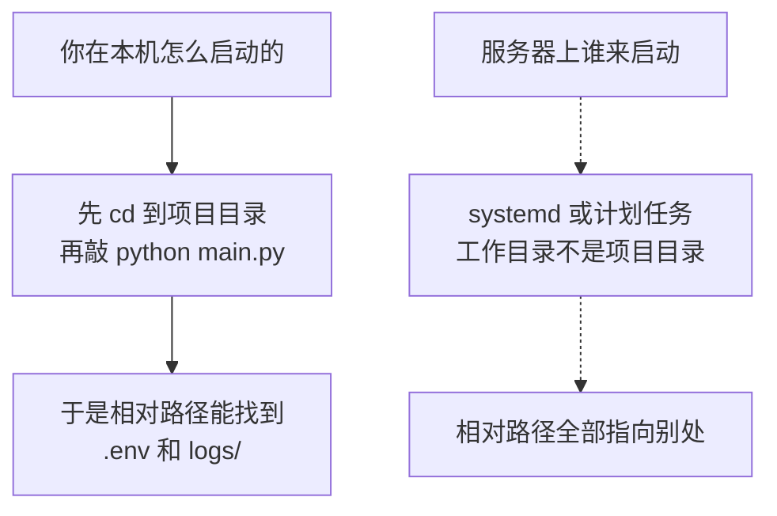
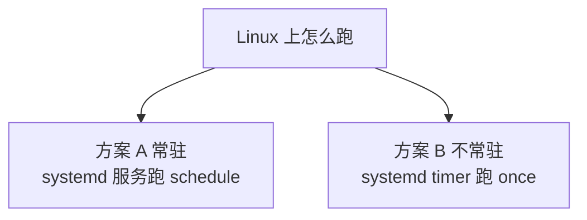
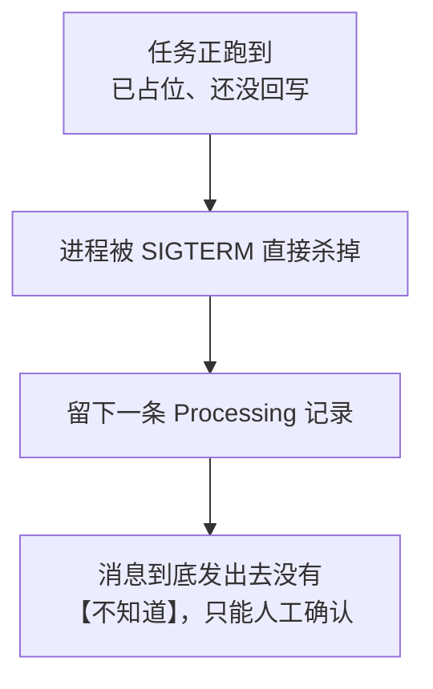
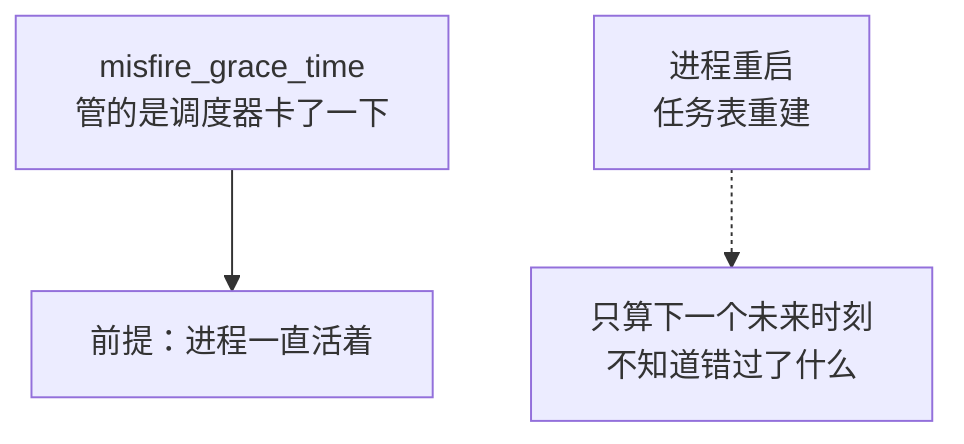
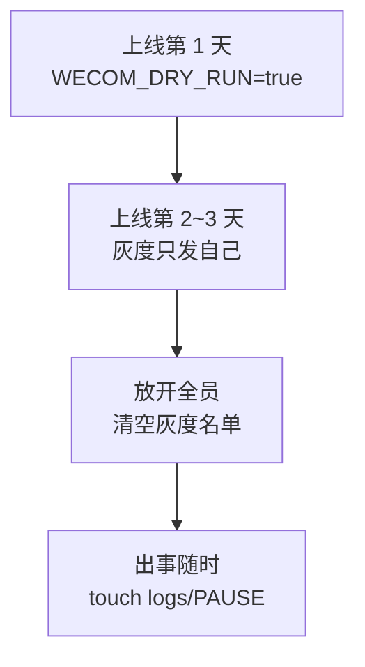
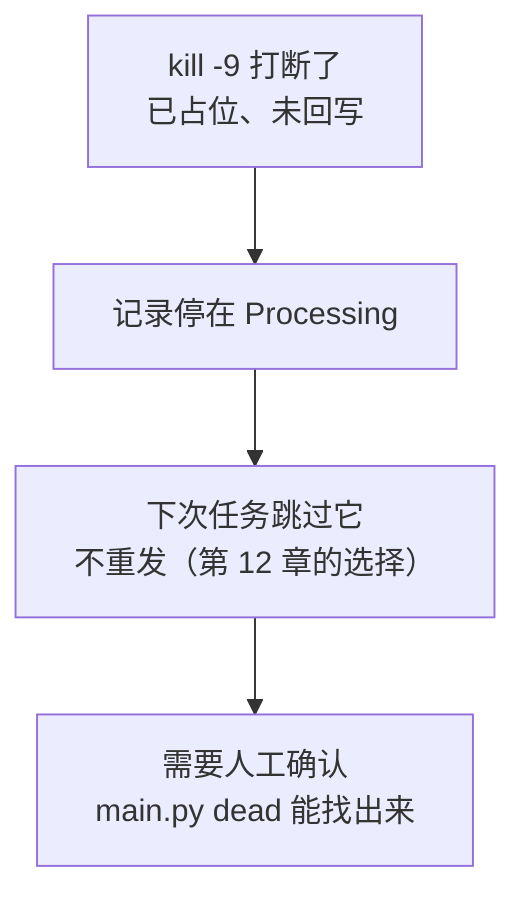
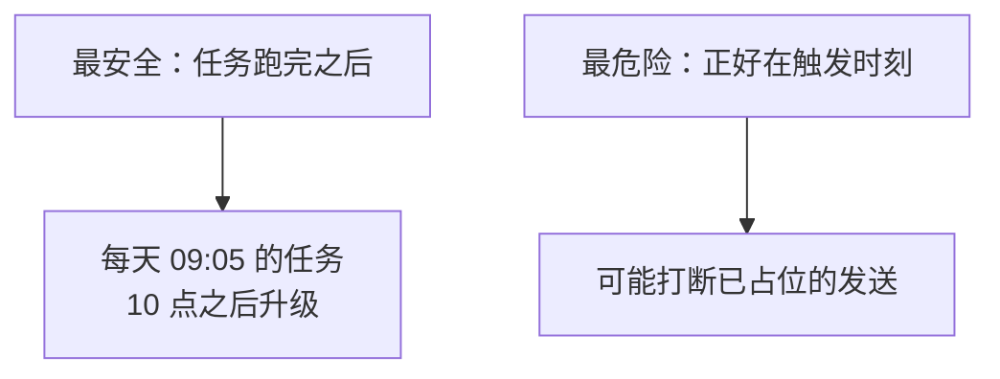

# 第 16 章　部署与长期运行

> 上一章结束时，程序在你的电脑上跑得很好。本章要解决的是另一个问题：**让它在服务器上，没有人看着，跑一年。**
>
> 这两件事的距离比想象中远。本章一共做了 **65 项实测**，其中让第 15 章的代码**真的失败**的有四处——每一处都是在本机永远遇不上、上了服务器必然遇上的问题。

---

## 16.0 本章的验证方式

```text
部署场景测试（8 组，44 项断言）：全部通过
虚拟环境与依赖（4 组，10 项断言）：全部通过
运维场景测试（3 组，11 项断言）：全部通过
                       合计 65 项
```

**实测环境**：Amazon Linux 2023、Python 3.9.25、系统时区 **UTC**（这一点后面很关键）。

> **哪些结论是实测的，哪些是依据文档的**——本章格外需要说清楚：
>
> **① 已实测**：工作目录问题、`.env` 找不到、虚拟环境依赖、单实例锁、`SIGTERM` 优雅停止、错过触发点后的补跑、日志轮转上限、`kill -9` 的代价、服务里的时区、停发开关、灰度名单。这些都在本环境里真跑过。
>
> **② 依据官方文档，未在本环境运行**：`systemd` 单元文件的行为（本沙箱的 PID 1 不是 systemd）、Windows 任务计划程序。这两部分的每一条设置都注明了出处，文末列了官方文档链接。
>
> 我不会把没跑过的东西写成"实测"。

---

## 16.1 在开发电脑上跑，和在服务器上跑，差在哪

新手最容易低估这件事。**同一份代码、同一个 Python 版本，为什么服务器上就不行？**因为你在本机运行时，无意中提供了四个前提：



四个前提，逐条对照：

| 你本机有的前提 | 服务器上的实际情况 | 后果 |
|---|---|---|
| **当前目录是项目目录** | systemd 默认在 `/`；计划任务可能在 `C:\Windows\System32` | 读不到 `.env`、日志写到别处 |
| **`python` 就是那个装了依赖的 python** | `PATH` 完全不同，可能指向系统 python | `ModuleNotFoundError` |
| **环境变量齐全**（`HOME`、`TZ`、`LANG`…） | 服务的环境变量近乎为空 | 时区不对、编码不对 |
| **你在旁边看着，出错了会重启** | 没人看着 | 挂了就一直挂着 |

**本章的做法是：把这四个前提都变成"程序自己保证"，而不是"部署的人记得"。**

### 16.1.1 四个改动，对应四个前提

| 改动 | 解决 |
|---|---|
| 新增 `paths.py`，所有路径以 `main.py` 所在目录为基准 | 工作目录不确定 |
| 部署文件里 python 和脚本**都写绝对路径** | 解释器不确定 |
| 程序自己处理 `SIGTERM`、自己补跑、自己加单实例锁 | 环境不确定、没人看着 |
| systemd `Restart=always` / 计划任务失败重试 | 没人看着 |

---

## 16.2 第一个坑：工作目录

### 16.2.1 现象

第 15 章的代码里，`.env` 是这样读的：

```python
load_dotenv(override=False)          # 第 15 章的写法
```

`python-dotenv` 不带路径时，会从**当前工作目录**开始往上找 `.env`。在你的电脑上你总是先 `cd` 到项目目录，所以一直能找到。

**实测（从根目录启动，一切照旧）：**

```text
当前工作目录 : /
不指定路径 load_dotenv() 返回: False
读到 WECOM_CORP_ID : None
指定路径 load_dotenv(project_path) 返回: True
读到 WECOM_CORP_ID : wwMOCKCORPID123456
日志相对路径会写到哪里 : /logs/wecom.log
用 project_path 会写到哪里 : /projects/sandbox/_ch16_build/logs/wecom.log
```

三行结论：

| 观察 | 意味着 |
|---|---|
| `load_dotenv()` 返回 `False` | **它没找到文件，但不抛异常**——所以你只会看到"缺少必填配置" |
| `WECOM_CORP_ID` 是 `None` | 报错信息会说"缺少 CorpID"，而真实原因是"没读到文件" |
| 日志会写到 `/logs/wecom.log` | 根目录通常不可写；就算可写，你也永远找不到那份日志 |

> **这个坑最恶劣的地方是报错信息和真实原因无关。**你会去检查 `.env` 里 CorpID 那一行有没有写错——而它明明是对的。

### 16.2.2 修法：一个 30 行的模块

```python
"""
路径基准（第 16 章新增）：让程序【不依赖启动时所在的目录】。

为什么需要这个文件？
    在你的电脑上，你总是先 cd 到项目目录再敲 python main.py once，
    所以 ".env"、"logs/wecom.log" 这种相对路径都能找到。

    但服务器上启动程序的不是你，是 systemd 或 Windows 任务计划程序：
        systemd 默认的工作目录是 /
        任务计划程序不填"起始于"时，工作目录可能是 C:\\Windows\\System32

    于是相对路径全部指向了别处 —— 表现是"读不到 .env"或者
    "日志跑到 C:\\Windows\\System32\\logs 里去了"。
    这是部署失败最常见的原因，而且报错信息通常和真实原因无关。

做法：所有路径都以【main.py 所在目录】为基准，而不是以当前目录为基准。
"""

import os

# __file__ 是当前这个 .py 文件的路径。
# abspath 把它变成绝对路径，dirname 取所在目录。
# 因为本文件和 main.py 在同一个目录，所以这就是项目根目录。
BASE_DIR = os.path.dirname(os.path.abspath(__file__))


def project_path(*parts) -> str:
    """
    把相对项目根目录的路径，变成绝对路径。

        project_path(".env")            -> /opt/wecom-todo/.env
        project_path("logs", "a.log")   -> /opt/wecom-todo/logs/a.log

    【规则】程序里所有文件路径都要经过这个函数。
        写死 "logs/wecom.log" 这种相对路径，在服务器上就是一颗定时炸弹。
    """
    return os.path.join(BASE_DIR, *parts)


def resolve(path: str) -> str:
    """
    如果配置里给的是相对路径，按项目根目录解释；绝对路径原样返回。

    为什么允许绝对路径？
        因为运维常常把日志放在专门的分区，比如 /var/log/wecom-todo。
        配置里写绝对路径时，就该听配置的。
    """
    if not path:
        return BASE_DIR
    return path if os.path.isabs(path) else project_path(path)
```

### 16.2.3 三处用上它

```python
# config.py：读 .env
load_dotenv(dotenv_path=project_path(".env"), override=False)

# config.py：日志目录（相对路径按项目根算，绝对路径听配置的）
log_dir=resolve(os.getenv("LOG_DIR", "logs").strip())

# alerting.py：告警落地文件
FALLBACK_ALERT_FILE = project_path("logs", "ALERT.txt")
```

**`alerting.py` 那一处尤其重要。**第 14 章说"告警必须有第二条腿"，而如果那条腿写的是相对路径 `logs/ALERT.txt`，在 systemd 下它会试图写 `/logs/ALERT.txt`——**写不进去，第二条腿也断了**。

### 16.2.4 `override=False` 的意义变了

```python
# 读取 .env。两个参数都很重要：
#
#   dotenv_path=project_path(".env")
#       【第 16 章的教训】不指定路径时，dotenv 会从【当前工作目录】往上找。
#       在你的电脑上你总是先 cd 到项目目录，所以一直能找到；
#       而 systemd 的默认工作目录是 /，任务计划程序可能是 C:\Windows\System32,
#       于是同一份代码在服务器上就报"缺少必填配置" —— 而 .env 明明就在那儿。
#
#   override=False
#       系统环境变量【优先】于 .env 里的值。
#       这样部署时可以用 systemd 的 Environment= 临时覆盖某一项，
#       不用改文件（比如临时把 WECOM_DRY_RUN 打开）。
load_dotenv(dotenv_path=project_path(".env"), override=False)
```

在第 5 章，`override=False` 只是个默认选择。到了部署阶段它有了实际用途：

```ini
# systemd 单元文件里临时打开演练模式，不用改 .env
Environment=WECOM_DRY_RUN=true
```

**实测：**

```text
=== 测试 2：环境变量优先于 .env（部署时可临时覆盖）===
  [OK] 环境变量把 .env 里的 false 覆盖成了 true
  [OK] 演练模式下零真实发送
  [OK] 占位已撤销（Failed）  -> ['Failed', 'Failed', 'Failed']
```

### 16.2.5 启动日志里把两个目录都打出来

```python
    log.info("程序启动，模式=%s｜项目目录=%s｜当前工作目录=%s",
             mode, BASE_DIR, os.getcwd())
```

**实测（从根目录启动）：**

```text
2026-09-05 10:30:20 | INFO | - | main:309 | 程序启动，模式=once｜项目目录=/projects/sandbox/_ch16_build｜当前工作目录=/
```

**这一行日志能省掉一小时排查。**两个目录不一致是正常的（说明程序不依赖工作目录了），但当你怀疑"它到底在读哪个 `.env`"时，这行就是答案。

**实测断言：**

```text
=== 测试 1：从【根目录】启动、【环境变量全空】，照样能跑 ===
  [OK] 退出码 0
  [OK] 读到了项目目录下的 .env（没有报缺配置）
  [OK] 发出 3 条消息
  [OK] 日志写在项目目录下，不是启动目录
  [OK] 日志里同时打印了项目目录和工作目录
  [OK] 数据库记录 3 条全部 Sent
     再跑一次（防重仍然生效）：
  [OK] 零发送
  [OK] 记录数没变
```

注意这一组测试是用 **`env -i`**（清空所有环境变量，只留一个最小 `PATH`）跑的，工作目录是 `/`——尽可能接近服务的处境。

---

## 16.3 第二个坑：解释器与虚拟环境

### 16.3.1 为什么必须用虚拟环境

| 不用虚拟环境 | 用虚拟环境 |
|---|---|
| 依赖装在系统 python 里，和操作系统自带的工具**共用** | 项目自己一份，互不干扰 |
| 系统升级可能把某个包换掉 | 系统升级不影响它 |
| 两个项目要不同版本时**无解** | 各自一份 |

在 Amazon Linux / CentOS 这类系统上还有一条更要紧的理由：**系统 python 是操作系统自己在用的**（`yum`/`dnf` 的一部分工具就是 python 写的）。用 `sudo pip install` 往里塞包，是把操作系统当实验场。

### 16.3.2 建好虚拟环境，但忘了装依赖

这是新手部署时命中率最高的一个错误。**实测：**

```text
=== 测试 9：建虚拟环境，但【忘了装依赖】===
  [OK] 虚拟环境建好了
  [OK] 虚拟环境里的 python 是独立的一个  -> /projects/sandbox/_ch16_build/.venv/bin/python
  [OK] 直接跑会报 ModuleNotFoundError  -> ["ModuleNotFoundError: No module named 'pyodbc'"]
     ↓ 这就是「本地能跑、服务器不跑」最常见的那条报错：
         File "/projects/sandbox/_ch16_build/database.py", line 10, in <module>
           import pyodbc
       ModuleNotFoundError: No module named 'pyodbc'
```

**记住这条报错的形状**：`ModuleNotFoundError` + 一个你明明装过的包。它的含义只有一个——**跑起来的不是你以为的那个 python**。

排查两条命令就够：

```bash
which python3                              # 现在用的是哪个
./.venv/bin/python -c "import sys; print(sys.executable)"   # 你以为的那个
```

### 16.3.3 完整的部署命令（Linux）

```bash
# 1. 建目录并放代码
sudo mkdir -p /opt/wecom-todo
sudo chown -R wecom:wecom /opt/wecom-todo
cd /opt/wecom-todo

# 2. 建虚拟环境（用项目目录下的 .venv，别放到别处）
python3 -m venv .venv

# 3. 装依赖 —— 【注意用 .venv 里的 pip，不是系统 pip】
./.venv/bin/pip install --upgrade pip
./.venv/bin/pip install -r requirements.txt

# 4. 配置
cp .env.example .env
vi .env                    # 填真实值
chmod 600 .env             # 【只有自己能读】见 16.7 节

# 5. 建数据库表（在 SSMS 或 sqlcmd 里执行）
#    sql/01_demo_table.sql、sql/02_send_log.sql

# 6. 自检 —— 【这一步不发消息，可以放心跑】
./.venv/bin/python main.py check
```

**第 6 步是整个部署流程里最重要的一步。**它把 16.2 和 16.3 两类问题一次性暴露出来：读不到配置、连不上库、装错解释器，都会在这里失败。

### 16.3.4 依赖固定：`requirements.txt` 只是"直接依赖"

**实测 `pip freeze`：**

```text
requirements 里 4 个，实际装了 9 个

APScheduler==3.11.3  ← 直接依赖
certifi==2026.7.22
charset-normalizer==3.5.1
idna==3.19
pyodbc==5.3.0  ← 直接依赖
python-dotenv==1.2.1  ← 直接依赖
requests==2.32.5  ← 直接依赖
tzlocal==5.3.1
urllib3==2.6.3
```

**你写了 4 个，实际装了 9 个。**另外 5 个是传递依赖（`requests` 要 `urllib3`、`APScheduler` 要 `tzlocal`……）。

这带来一个现实风险：**半年后在另一台机器上重装，传递依赖可能已经出了新版本**，而新版本不一定和你的代码合得来。两种做法：

| 做法 | 文件 | 适合 |
|---|---|---|
| 只固定直接依赖 | `requirements.txt`（4 行，带注释说明为什么需要） | 人读的 |
| 固定**全部**版本 | `pip freeze > requirements.lock.txt`（9 行） | 机器装的 |

推荐**两个都留**：改依赖时看前者，部署时装后者。

**实测装出来的版本和写的一致：**

```text
=== 测试 11：版本固定到底有没有生效 ===
  [OK] 装出来的版本和 requirements.txt 写的一致  -> 2.32.5 3.11.3 5.3.0
```

### 16.3.5 `pyodbc` 还需要系统级组件

这一条容易忘：**`pip install pyodbc` 只装了转接头，ODBC 驱动是操作系统级的**（第 10 章 10.3 节）。

```bash
# Amazon Linux / RHEL 系
sudo dnf install -y unixODBC
# 微软的驱动要按官方文档加仓库后安装 msodbcsql18

# 验证驱动装好了
odbcinst -q -d              # 应该能看到 [ODBC Driver 18 for SQL Server]
```

**驱动名必须和 `.env` 里的 `DB_DRIVER` 一字不差**，否则报 `IM002`。

---


## 16.4 Linux 部署：两种方案，选一个



| | 方案 A：常驻 | 方案 B：定时拉起 |
|---|---|---|
| 进程 | 一直在（占几十 MB 内存） | 只活几秒 |
| 谁管调度 | **程序自己**（APScheduler） | **操作系统** |
| 改时间 | 改 `.env` + 重启服务 | 改 `.timer` + `daemon-reload` |
| 错过触发点（关机） | 靠程序自己补跑（16.6 节） | `Persistent=true` 自动补 |
| 内存泄漏风险 | 有（长期运行） | **没有**（每次都是新进程） |
| 调试 | 看 `journalctl -f` 实时输出 | 每次执行一段独立日志 |

**建议：如果你只有这一个定时任务，选方案 B。**理由是"进程只活几秒"消掉了一整类问题（内存泄漏、连接句柄泄漏、时钟漂移）。

**什么时候选方案 A？**当你以后要加"每 5 分钟检查一次紧急工单"这类高频任务时——那种频率下反复启动进程、反复建数据库连接、反复取 token 就不合适了。

### 16.4.1 方案 A：常驻服务

**`deploy/wecom-todo.service`**

```ini
# ============================================================
# 方案 A（推荐）：常驻 schedule 模式，由 systemd 看着它
#
# 安装：
#   sudo cp deploy/wecom-todo.service /etc/systemd/system/
#   sudo systemctl daemon-reload
#   sudo systemctl enable --now wecom-todo
#
# 看状态 / 看日志：
#   systemctl status wecom-todo
#   journalctl -u wecom-todo -f
#   journalctl -u wecom-todo --since "today"
# ============================================================

[Unit]
Description=企业微信待办提醒（常驻调度）
Documentation=file:///opt/wecom-todo/README.md

# 【为什么不是 network.target】
#   network.target 只表示"网络子系统起来了"，不代表【能上网】。
#   开机时它可能在拿到 IP 之前就满足了，于是程序启动就取不到 token。
#   network-online.target 才是"网络真的可用"。
After=network-online.target
Wants=network-online.target

# 【重启限流：这两项在 [Unit] 段，不在 [Service] 段】
#   systemd 默认 10 秒内启动 5 次就放弃，然后服务变成 failed 再也不管了。
#   对本程序来说，"因为数据库还没起来而失败" 是很正常的，
#   所以把限流关掉（0 = 不限），让它一直重试。
StartLimitIntervalSec=0

[Service]
Type=simple

# 【绝不用 root 跑】它只需要读项目目录、写 logs、连数据库。
# 建账号：sudo useradd -r -s /sbin/nologin wecom
User=wecom
Group=wecom

# 【必须写】systemd 默认工作目录是 /，
# 不写这一行的话，程序的相对路径全都会指向根目录。
# （本程序已经用 paths.py 做了绝对路径，写上是双保险）
WorkingDirectory=/opt/wecom-todo

# 【两处都用绝对路径】
#   python 用虚拟环境里的那个，不要指望 PATH
#   main.py 也写全路径
ExecStart=/opt/wecom-todo/.venv/bin/python /opt/wecom-todo/main.py schedule

# 挂了就重启。always 表示"不管退出码是几都重启"，
# 因为对常驻服务来说，退出本身就是异常。
Restart=always

# 【必须改】RestartSec 默认是 100 毫秒 ——
# 意味着如果数据库连不上，它会一秒钟重启十次，
# 日志瞬间刷满，还把数据库打得更惨。
RestartSec=10

# 停止时先发 SIGTERM（这也是默认值，写出来是为了明确）。
# 程序里必须处理 SIGTERM，否则会被直接杀掉 —— 见第 16 章 16.5 节。
KillSignal=SIGTERM

# 【给优雅停止留够时间】
#   超过这个时间还没退出，systemd 会 SIGKILL。
#   本程序最坏情况是"正在重试发送"，算上退避等待要几十秒，
#   所以给 120 秒，比默认的 90 秒宽一点。
TimeoutStopSec=120

# 让 print / 日志立刻出现在 journal 里，而不是等缓冲区满
Environment=PYTHONUNBUFFERED=1

# 敏感配置从文件读，不要写在这个单元文件里 ——
# 单元文件在 /etc 下，默认所有人可读。
# EnvironmentFile 里的值优先级低于 .env（因为程序里 override=False），
# 所以这里通常只放"部署环境专属"的覆盖项。
# EnvironmentFile=-/etc/wecom-todo/env

StandardOutput=journal
StandardError=journal
SyslogIdentifier=wecom-todo

# ---------- 收紧权限（可选但建议）----------
# 只允许写这两个目录，别处一律只读。
# 万一程序有漏洞，破坏范围也就到这儿。
ReadWritePaths=/opt/wecom-todo/logs
ProtectSystem=strict
ProtectHome=true
PrivateTmp=true
NoNewPrivileges=true

[Install]
WantedBy=multi-user.target
```

**这个文件里有五个值是必须改默认值的**，逐条说明：

| 设置 | 默认 | 为什么必须改 |
|---|---|---|
| `RestartSec` | **100 毫秒** | 数据库连不上时，它会一秒重启十次。日志刷满、数据库被打得更惨 |
| `StartLimitIntervalSec` | 10 秒内 5 次就放弃 | 数据库晚起来两分钟，服务就永久 `failed` 了 |
| `WorkingDirectory` | `/` | 见 16.2 节 |
| `After=network-online.target` | 常见写成 `network.target` | 后者只表示网络子系统起来了，**不代表能上网** |
| `TimeoutStopSec` | 90 秒 | 本程序最坏情况在重试退避里，给宽一点 |

> **`RestartSec=10` 是本节最值得记住的一行。**`Restart=always` 谁都会写，但配上 100 毫秒的默认间隔，它就从"自动恢复"变成了"自动 DDoS 你的数据库"。

### 16.4.2 方案 B：timer + oneshot

**`deploy/wecom-todo.timer`**

```ini
# ============================================================
# 定时器：每天 09:05 拉起 wecom-todo-once.service
# ============================================================

[Unit]
Description=每天 09:05 触发企业微信待办提醒

[Timer]
# 时间写法：星期 年-月-日 时:分:秒
#   *-*-* 09:05:00      每天 09:05
#   Mon-Fri 09:05:00    工作日 09:05（挡不住调休，节假日还得靠数据库那张表）
OnCalendar=*-*-* 09:05:00

# 【时区】systemd 默认用【系统时区】。
#   服务器时区是 UTC 的话，上面这行是 UTC 的 09:05。
#   两种解决办法，选一个：
#     ① 把服务器时区设对：sudo timedatectl set-timezone Asia/Shanghai
#     ② 在这里显式指定（systemd 版本 ≥ 240）：
# Timezone=Asia/Shanghai

# 【补跑：这一项很重要】
#   true = 记住"上次是什么时候跑的"。如果错过了（机器关机、重启），
#          开机后【立刻补跑一次】。
#   这正是方案 B 比方案 A 省事的地方 ——
#   方案 A 得靠程序自己在启动时补跑（TASK_CATCH_UP_ON_START）。
Persistent=true

# 随机延迟 0~60 秒。理由和第 9 章"别用整点"一样：
# 一台机器上十几个 timer 都定在 09:05，会同时抢 CPU 和网络。
RandomizedDelaySec=60

[Install]
WantedBy=timers.target
```

配套的 `.service`（注意 `Type=oneshot`，且**不要**写 `Restart=`）：

**`deploy/wecom-todo-once.service`**

```ini
# ============================================================
# 方案 B：不常驻。由 systemd timer 定时拉起，跑完就退出。
#
# 和方案 A 的取舍见第 16 章 16.4 节。一句话：
#   方案 A：进程一直在，调度由程序自己管（APScheduler）
#   方案 B：进程只活几秒，调度由操作系统管
#
# 安装（两个文件都要）：
#   sudo cp deploy/wecom-todo-once.service deploy/wecom-todo.timer /etc/systemd/system/
#   sudo systemctl daemon-reload
#   sudo systemctl enable --now wecom-todo.timer
#
# 确认下次什么时候跑：
#   systemctl list-timers wecom-todo.timer
# ============================================================

[Unit]
Description=企业微信待办提醒（执行一次）
After=network-online.target
Wants=network-online.target

[Service]
# oneshot：跑完就结束，systemd 不会认为"进程退出 = 出故障"
Type=oneshot

User=wecom
Group=wecom
WorkingDirectory=/opt/wecom-todo
ExecStart=/opt/wecom-todo/.venv/bin/python /opt/wecom-todo/main.py once

# 【注意这里不要写 Restart=】
#   oneshot 服务失败就该失败，让 timer 下次再来。
#   自动重试会和程序自己的重试策略（第 13 章）打架。

Environment=PYTHONUNBUFFERED=1
StandardOutput=journal
StandardError=journal
SyslogIdentifier=wecom-todo-once
```

**`Persistent=true` 是方案 B 最大的优势**：机器关机错过了 09:05，开机后 systemd 会立刻补跑一次。方案 A 得靠程序自己实现这件事（下面 16.6 节）。

### 16.4.3 装和看

```bash
# 方案 A
sudo cp deploy/wecom-todo.service /etc/systemd/system/
sudo systemctl daemon-reload
sudo systemctl enable --now wecom-todo
systemctl status wecom-todo
journalctl -u wecom-todo -f                 # 实时看
journalctl -u wecom-todo --since "today"    # 看今天的

# 方案 B
sudo cp deploy/wecom-todo-once.service deploy/wecom-todo.timer /etc/systemd/system/
sudo systemctl daemon-reload
sudo systemctl enable --now wecom-todo.timer
systemctl list-timers wecom-todo.timer      # 【看下次什么时候跑】
```

**`systemctl list-timers` 是方案 B 的"下次触发时刻"**，作用和方案 A 里程序自己打印的那三行一样：**它是你唯一能提前发现时区配错的手段。**

### 16.4.4 cron 为什么不推荐

cron 能不能用？能。但它有三个和本章主题正相关的毛病：

| cron 的问题 | 表现 |
|---|---|
| 环境变量极少（`PATH` 通常只有 `/usr/bin:/bin`） | 各种"命令找不到" |
| 默认把输出发本地邮件 | 你根本看不到；`/var/spool/mail` 悄悄变大 |
| 没有"上次跑成功了吗"的记录 | 只能自己 `>> log 2>&1` |

如果确实只能用 cron，**一定要通过包装脚本调用**，别把 python 路径直接写进 crontab：

**`deploy/run_task.sh`**

```bash
#!/bin/bash
# ============================================================
# Linux 包装脚本。cron 或别的调度工具用得上。
#
# 它只做三件事：切目录、用虚拟环境的 python、把退出码传出去。
# 看起来啰嗦，但这三件事正是"本地能跑、服务器不跑"的三大原因。
# ============================================================

# -e 出错立刻退出；-u 用到未定义变量报错；-o pipefail 管道里任一环失败都算失败
set -euo pipefail

# 【关键一行】切到项目根目录（本脚本在 deploy/ 下，所以要往上一层）
# ${BASH_SOURCE[0]} 是脚本自己的路径，比 $0 可靠
cd "$(dirname "${BASH_SOURCE[0]}")/.."

# 【关键第二行】用虚拟环境里的 python。
# 直接写 python3 的话，cron 的 PATH 和你登录时的 PATH 不一样，
# 很可能用到系统 python —— 然后报 ModuleNotFoundError: No module named 'requests'
PYTHON="./.venv/bin/python"

if [ ! -x "$PYTHON" ]; then
    echo "找不到虚拟环境：$PYTHON" >&2
    echo "请先执行：python3 -m venv .venv && ./.venv/bin/pip install -r requirements.txt" >&2
    exit 2
fi

# "$@" 把命令行参数原样传进去，这样 run_task.sh once / check / dead 都能用
exec "$PYTHON" main.py "${@:-once}"
```

crontab 里写：

```cron
# 每天 09:05。注意 cron 用的是【系统时区】
5 9 * * * /opt/wecom-todo/deploy/run_task.sh once >> /opt/wecom-todo/logs/cron.log 2>&1
```

---

## 16.5 第三个坑：`systemctl stop` 会直接杀掉第 15 章的程序

### 16.5.1 现象

第 15 章的 `schedule` 模式是这样停的：

```python
    try:
        scheduler.start()
    except (KeyboardInterrupt, SystemExit):
        log.info("收到停止信号，等待正在执行的任务结束……")
        scheduler.shutdown(wait=True)
```

本机按 `Ctrl+C` 完美工作——因为 `Ctrl+C` 触发的正是 `KeyboardInterrupt`。

**但服务器上停止服务的不是你，是 systemd，它发的是 `SIGTERM`。**而 Python 对 `SIGTERM` 的默认处理是**立刻终止进程**：不抛异常、不执行 `except`、不调 `shutdown()`。

**实测对照（这段是本章最直接的一个证据）：**

```text
     对照：把信号处理去掉（第 15 章的状态）会怎样：
  [OK] 默认行为下进程被直接杀掉（退出码 -15）  -> returncode=-15
  [OK] 清理代码【没有】执行  -> 'started'
```

进程只打印了 `started`，`except (KeyboardInterrupt, SystemExit)` 里那句"走到了清理代码"**一个字都没输出**。退出码 `-15` 就是"被信号 15（SIGTERM）杀死"。

### 16.5.2 代价是什么



也就是说：**每次 `systemctl restart` 都有一定概率制造一条需要人工确认的记录。**而重启是运维日常操作。

### 16.5.3 修法：把 `SIGTERM` 翻译成 `SystemExit`

```python
def install_signal_handlers(log) -> None:
    """
    让 SIGTERM 也能走"优雅停止"那条路（第 16 章新增）。

    【为什么必须加这一段】
        第 15 章的 schedule 模式捕获的是 KeyboardInterrupt 和 SystemExit，
        而 Ctrl+C 触发的正是 KeyboardInterrupt —— 所以本地测试一切正常。

        但服务器上停止服务的人不是你，是 systemd：
            systemctl stop 发的是 SIGTERM，
            而 Python 对 SIGTERM 的默认行为是【立刻终止进程】，
            不抛异常、不执行 except、不做 shutdown。

        后果：任务正跑到"已占位、还没回写"的位置被打断，
        留下一条 Processing 记录 —— 那条消息到底发出去没有，没人知道。

    做法：把 SIGTERM 转成 SystemExit，让它和 Ctrl+C 走同一条清理路径。
    """

    def handler(signum, frame):
        log.info("收到信号 %s，开始优雅停止……", signal.Signals(signum).name)
        # raise SystemExit 会被 scheduler.start() 外面的 except 接住
        raise SystemExit(0)

    for name in ("SIGTERM", "SIGINT"):
        sig = getattr(signal, name, None)
        if sig is not None:
            signal.signal(sig, handler)

    # Windows 上还有一个 SIGBREAK（Ctrl+Break / 服务停止）
    if hasattr(signal, "SIGBREAK"):
        signal.signal(signal.SIGBREAK, handler)


# ============================================================
```

**核心就是一句 `raise SystemExit(0)`**：让 `SIGTERM` 和 `Ctrl+C` 汇入同一条清理路径，`scheduler.shutdown(wait=True)` 于是能正常执行。

**实测（修好之后）：**

```text
=== 测试 8：SIGTERM 优雅停止（systemctl stop 用的就是它）===
  [OK] 进程正常退出（退出码 0，不是 -15）  -> returncode=0
  [OK] 日志记下了收到 SIGTERM
  [OK] 执行了优雅停止
  [OK] 退出很快（没有硬等到 systemd 的 SIGKILL）  -> 0.0 秒
  [OK] 没有留下 Processing 记录
```

日志里能看到完整过程：

```text
| INFO | - | main:70  | 收到信号 SIGTERM，开始优雅停止……
| INFO | - | main:219 | 收到停止信号，等待正在执行的任务结束……
| INFO | - | main:221 | 已安全停止。
```

### 16.5.4 三个容易忽略的细节

| 细节 | 说明 |
|---|---|
| 信号处理器**只在主线程**生效 | APScheduler 的任务跑在别的线程里，所以不能在任务里装处理器 |
| 处理器里**不要做重活** | 只 `raise`，真正的清理交给 `except` 块。信号处理器里做 IO 容易再次被信号打断 |
| `SIGKILL`（`kill -9`）**拦不住** | 这是操作系统的硬保证。所以升级前要用 `systemctl stop`，不要 `kill -9`（16.11 节实测了代价） |

### 16.5.5 Windows 上的对应关系

| 场景 | 收到什么 |
|---|---|
| 控制台按 `Ctrl+C` | `SIGINT`（等同本机调试） |
| 控制台窗口被关掉 / `Ctrl+Break` | `SIGBREAK`（**Windows 独有**，所以代码里也装了它） |
| 任务计划程序"结束任务" | 先尝试正常结束，超时后强制终止 |

---

## 16.6 第四个坑：服务器重启后，错过的那次不会自己补

### 16.6.1 我原以为 `misfire_grace_time` 能兜住

第 9 章设置了 `misfire_grace_time=300`（错过 5 分钟内还补跑）。我以为这就覆盖了"09:04 服务器在重启、09:07 才起来"这种情况。

**实测证明不行：**

```text
=== 测试 7：APScheduler 不会自己补跑错过的触发 ===
  [OK] 错过的那次【没有】被补跑  -> 发送记录 0 条
  [OK] 下次触发是明天
```

做法是：把每日触发时刻设成"**1 分钟之前**"，然后启动调度器等 6 秒。结果一条都没发，而"接下来三次触发时刻"打出来的第一个是**明天**。

### 16.6.2 为什么

因为 `misfire_grace_time` 处理的是"**调度器自己**错过了触发"（比如上一个任务占着线程、或者机器卡住），前提是**调度器当时活着并且知道这次触发应该发生**。

而进程重启后，**任务表是重新建的**（我们用的是内存任务表）。新建的 `CronTrigger` 只会算"下一个未来时刻"——**它根本不知道昨天/今天早上还有一次没跑**。



**要让 APScheduler 自己记住，得用持久化任务表**（`SQLAlchemyJobStore` 之类）。但那要引入新依赖、还要处理任务表和代码不同步的问题——**为一件小事付大代价**。

### 16.6.3 更简单的解法：启动时先跑一次

我们手上有一个第 12 章挣来的东西：**防重复。**

于是补跑变得非常廉价——**启动就跑一次，发过的自然会被跳过**：

```python
    # ---------- 补跑（第 16 章）----------
    # 服务器重启后错过的那次触发，调度器【不会】自己补（16.6 节实测）。
    # 而因为有防重，多跑一次是安全的：发过就跳过，没发过才发。
    # 所以最简单可靠的做法就是启动时先跑一次。
    if config.task.catch_up_on_start:
        log.info("启动补跑：先执行一次（发过的会被防重跳过，所以这是安全的）")
        run_todo_task(client, config, alert_state=alert_state)
```

**实测：**

```text
     打开 TASK_CATCH_UP_ON_START 再来一次：
  [OK] 启动时补跑了一次  -> 发送记录 3 条
  [OK] 日志说明了这是补跑
     再启动一次（验证补跑不会重复发送）：
  [OK] 第二次启动补跑被防重挡住  -> 跳过 3 条
  [OK] 发送记录仍是 3 条
```

**第三组断言是这个方案的关键。**它证明了"每次启动都跑一次"是安全的——哪怕你一天重启服务十次，同事也只收到一条。

> **这是防重复机制的第二次分红。**第一次是"任务重跑安全"（第 12 章），这一次是"重启补跑安全"——**同一个机制，解决了两个完全不同的问题。**
>
> 反过来说：如果没有防重，"启动时跑一次"就是个危险动作，你只能去搞持久化任务表。**先把幂等做对，后面处处省事。**

### 16.6.4 什么时候该关掉它

```ini
TASK_CATCH_UP_ON_START=false
```

两种情况该关：

| 情况 | 理由 |
|---|---|
| 调试期反复重启服务 | 每次启动都查一遍库、打一堆日志，吵 |
| 用方案 B（timer） | timer 的 `Persistent=true` 已经做了这件事，重复没意义 |

---


## 16.7 Windows 部署

> 本节的设置项依据微软官方文档整理，**未在本环境实测**（沙箱是 Linux）。文末列了文档出处。有条件的话，请按 16.13 的清单在你自己的 Windows 服务器上逐项确认。

### 16.7.1 先做个选择：计划任务，还是 Windows 服务

| | 任务计划程序（推荐） | 注册成 Windows 服务 |
|---|---|---|
| 需要额外工具 | 不需要 | **需要**（NSSM、WinSW 之类第三方工具） |
| 跑哪个模式 | `once` | `schedule` |
| 补跑 | 勾"错过时尽快启动" | 靠程序 `TASK_CATCH_UP_ON_START` |
| 查看结果 | 界面上有"上次运行结果" | 事件查看器 + 自己的日志 |

**Windows 上推荐计划任务 + `once` 模式。**因为 Python 程序注册成真正的 Windows 服务需要处理服务控制协议（`SERVICE_CONTROL_STOP` 之类），要么用 `pywin32` 写一堆样板代码，要么依赖第三方封装工具——**为一个每天跑一次的任务，不值得。**

### 16.7.2 部署步骤

```bat
rem 1. 放代码，比如 C:\wecom-todo
rem 2. 建虚拟环境（用完整路径调 python，避免 PATH 里有多个版本）
cd /d C:\wecom-todo
"C:\Program Files\Python39\python.exe" -m venv .venv

rem 3. 装依赖 —— 用 .venv 里的 pip
.venv\Scripts\pip install -r requirements.txt

rem 4. 配置
copy .env.example .env
notepad .env

rem 5. 自检
.venv\Scripts\python main.py check
```

### 16.7.3 包装脚本：三行关键代码

**`deploy/run_task.bat`**

```bat
@echo off
rem ============================================================
rem Windows 包装脚本，给"任务计划程序"用。
rem
rem 【为什么一定要包装一层，不直接让计划任务调 python.exe】
rem   1. 计划任务的"起始于（可选）"很容易忘填，忘了就等于工作目录是
rem      C:\Windows\System32 —— 相对路径全废
rem   2. 包装脚本里能把退出码原样传出去，计划任务的"上次运行结果"才有意义
rem   3. 以后要加"跑之前先备份日志"之类的动作，改这个文件就行，
rem      不用去任务计划程序界面里点
rem ============================================================

rem 切到项目根目录。%~dp0 是本脚本所在目录（带结尾反斜杠）
cd /d "%~dp0.."

rem 用虚拟环境里的 python.exe，不要用 PATH 里的
set PYTHON=.venv\Scripts\python.exe

if not exist "%PYTHON%" (
    echo 找不到虚拟环境：%PYTHON% 1>&2
    echo 请先执行：python -m venv .venv ^&^& .venv\Scripts\pip install -r requirements.txt 1>&2
    exit /b 2
)

rem %* 把参数原样传进去；没给参数时默认 once
set MODE=%*
if "%MODE%"=="" set MODE=once

"%PYTHON%" main.py %MODE%

rem 【必须这一行】把 Python 的退出码传给计划任务，
rem 否则"上次运行结果"永远是 0x0，出错了你也看不出来
exit /b %ERRORLEVEL%
```

三行关键代码，对应三个坑：

| 代码 | 挡住的问题 |
|---|---|
| `cd /d "%~dp0.."` | 计划任务的"起始于"忘填 |
| `set PYTHON=.venv\Scripts\python.exe` | 用错解释器 |
| `exit /b %ERRORLEVEL%` | 计划任务的"上次运行结果"永远显示 0x0 |

### 16.7.4 计划任务的四个必勾项

在"任务计划程序"里新建任务时，这四处最容易出问题：

| 位置 | 要怎么设 | 不这么设的后果 |
|---|---|---|
| 常规 → **不管用户是否登录都要运行** | 选它 | 只有你登录着才跑；服务器一重启就停了 |
| 操作 → **起始于（可选）** | 填 `C:\wecom-todo` | 工作目录变成 `C:\Windows\System32` |
| 设置 → **如果错过计划开始时间，请尽快启动** | 勾上 | 关机错过的那次不补 |
| 设置 → 如果任务已经运行，则**不启动新实例** | 选它 | 上次没跑完又启动一个 |

还有两个"笔记本电脑专属"陷阱（服务器上一般不影响，但值得知道）：

- **"只有在计算机使用交流电源时才启动此任务"默认是勾上的**——拔了电源就不跑
- **"如果计算机切换到电池模式，则停止"默认也是勾上的**

### 16.7.5 用 XML 导入，因为命令行设不了"起始于"

`schtasks` 的命令行参数里**没有设置工作目录的选项**，而那正是最容易出问题的一项。所以推荐用 XML：

```bat
schtasks /create /tn "企业微信待办提醒" /xml deploy\task_scheduler.xml /ru DOMAIN\svc_wecom /rp 密码
```

XML 里和上面四项对应的部分：

```xml
  <Settings>
    <!-- 上一次还没跑完就不要再启动一个 -->
    <MultipleInstancesPolicy>IgnoreNew</MultipleInstancesPolicy>
    <!-- 错过触发时间后，开机就尽快跑一次 -->
    <StartWhenAvailable>true</StartWhenAvailable>
    <!-- 笔记本电脑上很关键 -->
    <DisallowStartIfOnBatteries>false</DisallowStartIfOnBatteries>
    <StopIfGoingOnBatteries>false</StopIfGoingOnBatteries>
    <!-- 跑超过 10 分钟就掐掉 -->
    <ExecutionTimeLimit>PT10M</ExecutionTimeLimit>
  </Settings>

  <Actions Context="Author">
    <Exec>
      <Command>C:\wecom-todo\deploy\run_task.bat</Command>
      <Arguments>once</Arguments>
      <!-- 界面上叫"起始于（可选）"，最容易漏的一项 -->
      <WorkingDirectory>C:\wecom-todo</WorkingDirectory>
    </Exec>
  </Actions>
```

### 16.7.6 "上次运行结果"怎么读

| 结果码 | 含义 | 通常是什么问题 |
|---|---|---|
| `0x0` | 成功 | —— |
| `0x1` | 一般性失败 | **程序自己报错退出**（去看 `logs/wecom.log`），或路径写错 |
| `0x2` | 系统找不到指定的文件 | `run_task.bat` 路径错 |
| `0x41301` | 任务正在运行 | 上一次还没结束（不是错误） |
| `0x41303` | 任务从未运行 | 刚建好还没到时间 |
| `0x8007010B` | 目录名无效 | **"起始于"填错了** |

**注意 `0x1` 和我们程序的退出码是两个体系**：程序返回 1（有死信要人工处理）在计划任务里也显示成 `0x1`。所以**看到 `0x1` 先去看程序日志**，别急着怀疑计划任务。

### 16.7.7 那个"跑了半年突然不跑了"的经典原因

选了"不管用户是否登录都要运行"，Windows 会**保存那个账号的密码**来启动任务。于是：

> **账号密码一改（或者到期强制改），任务第二天就开始失败。**

三种应对：

| 做法 | 代价 |
|---|---|
| 用**服务账号**（密码不过期、不能交互登录） | 需要域管理员配合，**推荐** |
| 用 `SYSTEM` 账号（不需要密码） | 权限过大，且访问网络共享/数据库时身份是机器账号 |
| 记在日历上，改密码后同步改任务 | 迟早会忘 |

另外，该账号需要**"作为批处理作业登录"**这项本地策略权限，否则任务会以"登录失败"结束。

---

## 16.8 单实例：为什么防重之外还要加一把锁

### 16.8.1 先说清楚它不负责什么

**它不是防重复发送的手段。**那是第 12 章那个唯一索引的职责，而且已经被 5 线程实测证明可靠。

那为什么还要锁？因为部署之后会出现三种情况：

| 情况 | 没有锁会怎样 |
|---|---|
| 服务在跑，有人又手工敲了 `main.py once` | 消息不会重复（防重挡住了），但两个进程的日志**交错在一起** |
| 计划任务上次没跑完，下次触发点又到了 | 两个进程互相抢占位，token 互相顶掉 |
| 运维以为服务挂了，又 `systemctl start` 一次 | 同上 |

**锁做的事很简单：让第二个进程立刻退出并说明原因。**

```python
"""
单实例锁（第 16 章新增）：保证同一时刻只有一个进程在跑。

【先说清楚它不负责什么】
    它【不是】防重复发送的手段 —— 那是第 12 章那个唯一索引的职责，
    而且唯一索引在多进程下已经被实测证明可靠。

那为什么还要锁？部署之后会出现三种真实场景：

    1. 服务已经在跑（schedule 模式），有人又手工敲了一次 once
    2. 计划任务上一次还没跑完，下一次触发点又到了
    3. 运维以为服务挂了，又 systemctl start 了一遍

    这三种情况下，防重能保证"不多发消息"，但代价是：
        两个进程互相抢占位、日志交错在一起、token 互相顶掉、
        排查问题时你根本分不清哪行日志属于哪个进程。

    锁做的事很简单：让第二个进程【立刻退出并说明原因】。
"""

import os
import sys

from paths import project_path

# 锁文件放在项目目录下。
# 为什么不放 /var/run？因为那需要 root 权限，而这个程序应该用普通账号跑。
DEFAULT_LOCK_FILE = project_path("logs", ".run.lock")


class AlreadyRunningError(Exception):
    """已经有一个实例在跑。这不是故障，是预期内的情况。"""
```

### 16.8.2 为什么用文件锁，而不是 PID 文件

PID 文件那套做法（写下 PID、启动时检查那个进程还在不在）有个经典漏洞：

> **进程被 `kill -9` 之后，PID 文件还在。**于是程序永远认为"已经在跑了"，需要人工去删文件。

文件锁不同：**它是操作系统在进程退出时自动释放的**——强杀、断电都不会残留。

```python
    def acquire(self) -> None:
        os.makedirs(os.path.dirname(self.lock_file) or ".", exist_ok=True)

        # 用 "a" 打开：不存在就创建，存在也不清空内容。
        # 不能用 "w" —— 那会在【拿到锁之前】就把别人写的内容清掉。
        self._handle = open(self.lock_file, "a+", encoding="utf-8")

        try:
            if sys.platform == "win32":
                import msvcrt
                # 锁文件的第 1 个字节即可，锁的是"这个文件"而不是内容
                msvcrt.locking(self._handle.fileno(), msvcrt.LK_NBLCK, 1)
            else:
                import fcntl
                # LOCK_EX 排他锁，LOCK_NB 表示"拿不到就立刻报错，不要等"
                fcntl.flock(self._handle.fileno(), fcntl.LOCK_EX | fcntl.LOCK_NB)
        except OSError:
            # 拿不到锁：说明另一个进程正持有它。
            # 读出里面的 PID，好让日志能说清"是谁在跑"。
            other = self._read_holder()
            self._handle.close()
            self._handle = None
            raise AlreadyRunningError(
                f"已经有一个实例在运行（{other}）。本次不启动。"
            )

        # 拿到锁了，把自己的信息写进去，方便排查
        self._handle.seek(0)
        self._handle.truncate()
        self._handle.write(f"pid={os.getpid()}\n")
        self._handle.flush()
```

**`LOCK_NB` 那个标志是关键**：没有它，第二个进程会**排队等**第一个跑完，然后接着跑一遍——那不是我们要的（我们要它直接退出）。

### 16.8.3 释放时故意不删锁文件

```python
    def release(self) -> None:
        if self._handle is None:
            return
        try:
            if sys.platform == "win32":
                import msvcrt
                self._handle.seek(0)
                msvcrt.locking(self._handle.fileno(), msvcrt.LK_UNLCK, 1)
            else:
                import fcntl
                fcntl.flock(self._handle.fileno(), fcntl.LOCK_UN)
        except OSError:
            pass
        finally:
            self._handle.close()
            self._handle = None
            # 【故意不删锁文件】
            # 删文件会引入一个竞态：A 正准备加锁时 B 把文件删了，
            # 于是两个进程各自锁住了"不同的文件"（同名但 inode 不同），
            # 两把锁互不相干 —— 锁就白加了。
            # 留一个几十字节的空文件，代价可以忽略。
```

**删文件会引入一个竞态**：A 正准备加锁时 B 把文件删了，于是两个进程各自锁住了"不同的文件"（同名，但 inode 不同）——两把锁互不相干，锁就白加了。留一个几十字节的空文件，代价可以忽略。

### 16.8.4 只给会发消息的模式加锁

```python

    # 4. 执行对应模式
    #    once / schedule 会真的发消息，所以要加单实例锁；
    #    check / dead 只读，不需要（而且它们经常在服务正跑着的时候被人工执行）。
    needs_lock = mode in ("once", "schedule")
    try:
        if needs_lock:
            try:
                with SingleInstance(project_path("logs", ".run.lock")):
                    return MODES[mode](config, client, log)
            except AlreadyRunningError as error:
                # 这【不是】故障：计划任务上一次还没跑完、或者服务已在运行。
                # 用 warning 而不是 error，退出码 0 —— 否则监控会天天误报。
                log.warning("%s", error)
                return 0
        return MODES[mode](config, client, log)
```

| 模式 | 加锁 | 理由 |
|---|---|---|
| `once` / `schedule` | **加** | 会真的发消息 |
| `check` / `dead` | 不加 | 只读。而且这两个**经常需要在服务正跑着的时候**人工执行 |

**退出码是 0，不是 1。**这一点很重要：如果返回 1，监控系统会天天报警——而"服务已经在跑"根本不是故障。

**实测：**

```text
=== 测试 4：单实例锁 ===
  [OK] 第二个进程被挡住  -> ['已经有一个实例在运行（pid=13）。本次不启动。']
  [OK] 退出码是 0（这不是故障，监控不该报警）  -> code=0
  [OK] 一条消息都没发
  [OK] 没有产生任何发送记录
     锁释放后再跑：
  [OK] 正常发出 3 条
  [OK] 锁文件残留但不影响下次运行（靠 flock 而不是 PID 文件）
```

现场日志（第二个进程只活了不到一秒）：

```text
2026-09-05 10:30:21 | INFO    | - | main:309 | 程序启动，模式=once｜项目目录=/projects/sandbox/_ch16_build｜当前工作目录=/
2026-09-05 10:30:21 | WARNING | - | main:327 | 已经有一个实例在运行（pid=13）。本次不启动。
```

**日志里带着对方的 PID**——这样你能立刻用 `ps -p 13` 看它在干什么，而不用猜。

---

## 16.9 配置、密码和权限

### 16.9.1 `.env` 的权限

```bash
chmod 600 .env               # 只有文件所有者能读写
chown wecom:wecom .env
ls -l .env                   # 应该是 -rw-------
```

**为什么是 600 而不是 644**：`.env` 里有企业微信 Secret 和数据库密码。默认的 644 表示**服务器上任何账号都能读**——包括那个用来跑别人业务的账号。

Windows 上对应的操作：右键 → 属性 → 安全 → 高级 → 禁用继承 → 只保留服务账号和 Administrators。

### 16.9.2 四类"配置该放哪"

| 放法 | 适合 | 不适合 |
|---|---|---|
| `.env` 文件（本教程） | 单机部署、几十项配置 | 多台机器要同步 |
| systemd `EnvironmentFile=` | 想让配置和代码彻底分开 | —— |
| 环境变量（`Environment=`） | **临时覆盖某一项** | 存密码（`systemctl show` 能看到） |
| 密钥管理服务（Vault、云上的 Secrets Manager） | 多机、要审计、要轮换 | 小项目（复杂度不划算） |

> **注意第三行**：写在 systemd 单元文件里的 `Environment=` **不是秘密**——`/etc/systemd/system/` 默认全员可读，`systemctl show` 也会打出来。所以那里只放开关，不放密码。

### 16.9.3 服务用什么账号跑

```bash
# 建一个不能登录、没有 home 的服务账号
sudo useradd -r -s /sbin/nologin wecom
sudo chown -R wecom:wecom /opt/wecom-todo
```

**绝不要用 root 跑。**这个程序需要的权限只有三样：读项目目录、写 `logs/`、连数据库。用 root 跑意味着一个 SQL 注入或者一个恶意的待办标题就可能变成整机沦陷。

单元文件里那几行收紧权限的设置也是为这个：

```ini
ReadWritePaths=/opt/wecom-todo/logs      # 只有这个目录可写
ProtectSystem=strict                      # /usr /boot /etc 只读
ProtectHome=true                          # 看不到任何用户的 home
PrivateTmp=true                           # 独立的 /tmp
NoNewPrivileges=true                      # 不能提权
```

### 16.9.4 日志目录不可写时的表现

这是部署时的常见情况：目录属主是 root，服务账号写不进去。

第 15 章的代码在这种情况下会抛一堆堆栈。本章改成给人话：

```python
    except OSError as error:
        # 【第 16 章新增】日志目录建不了/写不了：常见于
        # 服务账号对 /opt/xxx/logs 没有写权限，或者磁盘满了。
        # 这时不能抛一堆堆栈 —— 部署的人需要的是一句人话。
        print(f"无法初始化日志（目录 {config.log.log_dir}）：{error}")
        print("请确认这个目录存在、且运行程序的账号对它有写权限。")
        return 2
```

**实测：**

```text
=== 测试 3：日志目录不可用时，给人话而不是堆栈 ===
  [OK] 退出码 2（配置/环境问题）  -> code=2
  [OK] 提示了具体目录
  [OK] 给出了该怎么办
  [OK] 没有抛出原始堆栈
```

**为什么退出码是 2 而不是 1**：这是"环境没配好"，和"运行时出了业务问题"不是一类。部署的人看到 2 就知道该去检查环境（第 15 章 15.4.2 节定的规矩）。

### 16.9.5 数据库账号的权限

程序需要的权限，比大多数人给的要少得多：

| 表 | 需要的权限 |
|---|---|
| `待办事项`（业务表） | **只要 SELECT** |
| `节假日` | 只要 SELECT |
| `企业微信发送记录` | SELECT / INSERT / UPDATE / DELETE |

```sql
-- 给一个专用账号，只授这些权限
GRANT SELECT ON dbo.待办事项 TO wecom_app;
GRANT SELECT ON dbo.节假日 TO wecom_app;
GRANT SELECT, INSERT, UPDATE, DELETE ON dbo.企业微信发送记录 TO wecom_app;
```

**别用 `db_owner`。**这个程序永远不需要建表、改表结构——上线后如果它突然想改表，那说明出事了。

---


## 16.10 上线那一天：三个开关

装好了不等于可以放开跑。**第一天最该做的事是"让它只影响你自己"。**

本章为此加了三个配置项：

```python
    # ---------- 部署相关（第 16 章新增）----------
    # 启动 schedule 模式时，是否立刻补跑一次。
    # 为什么需要它：APScheduler 的内存任务表【不会】记住"昨天那次没跑"，
    # 所以服务器重启错过触发点后，靠调度器自己是补不回来的（第 16 章 16.6 节实测）。
    # 而因为有防重，"多跑一次"是安全的 —— 于是补跑就成了最简单可靠的做法。
    catch_up_on_start: bool = True

    # 灰度名单：非空时【只给名单里的人发】，其他人跳过。
    # 上线第一天填自己的 UserID，确认无误后再清空。
    only_to_user_ids: list = field(default_factory=list)

    # 停发开关：这个文件存在时，任务只查询不发送。
    # 为什么用文件而不是配置项？因为改配置要重启服务，
    # 而出事的时候你要的是【立刻停下】，不是"改文件、重启、祈祷"。
    pause_file: str = "logs/PAUSE"
```

### 16.10.1 第一步：演练模式（谁都不打扰）

```ini
WECOM_DRY_RUN=true
```

跑一次 `main.py once`，去看 `logs/wecom.log`：**查出来的人对不对、消息文字对不对。**

这一步不需要任何人配合，可以反复跑。第 15 章 15.8 节实测过：演练模式会**撤销占位**，所以不会把真消息弄丢。

### 16.10.2 第二步：灰度名单（只发给自己）

```ini
WECOM_DRY_RUN=false
TASK_ONLY_TO_USER_IDS=你的UserID
```

```python
            log.info("涉及 %s 个负责人：%s", len(grouped), list(grouped.keys()))

            # 灰度名单（第 16 章）：非空时只给名单里的人发。
            # 上线第一天只填自己，看到消息没问题了再清空这一项。
            allow = config.task.only_to_user_ids
            if allow:
                skipped_owners = [o for o in grouped if o not in allow]
                grouped = {o: rows_ for o, rows_ in grouped.items() if o in allow}
                log.warning("灰度模式：只发给 %s；本次跳过 %s 人 %s",
                            allow, len(skipped_owners), skipped_owners)
                report.gray_skipped = len(skipped_owners)
```

**实测：**

```text
=== 测试 6：灰度名单（上线第一天只发给自己）===
  [OK] 只发 1 条  -> 发送 1 次
  [OK] 日志列出了被跳过的人  -> ["灰度模式：只发给 ['zhangsan']；本次跳过 2 人 ['lisi', 'wangwu']"]
  [OK] 只有 zhangsan 有发送记录  -> [('zhangsan', 'Sent')]
     清空灰度名单后，另外两个人第二天照样能收到：
  [OK] 补发 2 条  -> 发送 2 次
  [OK] 三个人都有记录了
```

**最后两条断言解释了为什么灰度是安全的**：被灰度挡住的人**没有留下发送记录**，所以名单清空后他们照样能收到——不会因为"今天已经跑过了"而被防重误伤。

> 这个设计上的细节值得停一下：**灰度过滤放在"分组之后、占位之前"。**如果放在占位之后，被跳过的人就会留下记录，然后被防重永久挡住。**顺序决定对错。**

### 16.10.3 第三步：停发开关（出事时立刻停）

```bash
# 立刻停发（不用改配置、不用重启）
touch logs/PAUSE

# 恢复
rm logs/PAUSE
```

```python
            # ---------- 第一步：该不该跑 ----------
            # 停发开关（第 16 章）：文件存在就只查不发。
            # 放在最前面是故意的 —— 出事的时候，"立刻停下"比"跑完再说"重要。
            pause_file = resolve(config.task.pause_file)
            if os.path.exists(pause_file):
                log.warning("发现停发开关文件 %s，本次【只查询不发送】。"
                            "删掉这个文件即恢复。", pause_file)
                report.paused = True
```

**为什么用文件而不是配置项？**因为改配置要重启服务，而出事的时候你要的是**立刻停下**，不是"改文件、重启、祈祷"。文件的好处是：任何人、任何时候、一条命令。

**停发时连占位都不做：**

```python
    # 停发开关生效时，连占位都不做 —— 占位了却不发，
    # 就等于把这条消息推给"下次重试"，反而制造了积压。
    if report.paused:
        log.warning("停发开关生效，跳过：%s", key)
        report.skipped += 1
        return SendOutcome.SKIPPED
```

**这一点是想过才这么写的。**如果停发时照样占位、只是不发，那些记录会变成 `Failed` 或 `Processing`，等你恢复时它们已经堆成一片需要重试的积压。**停发就该是"什么都没发生过"。**

**实测：**

```text
=== 测试 5：停发开关（PAUSE 文件）===
  [OK] 零发送
  [OK] 日志说明了原因和恢复办法
  [OK] 【没有】产生占位记录（避免制造积压）  -> 记录 0 条
  [OK] 汇总里能看出是停发状态
  [OK] 删掉文件后立刻恢复发送  -> 发送 3 次
```

### 16.10.4 三个开关的关系



| 开关 | 粒度 | 生效方式 |
|---|---|---|
| `WECOM_DRY_RUN` | 完全不发 | 改配置 + 重启 |
| `TASK_ONLY_TO_USER_IDS` | 只发部分人 | 改配置 + 重启 |
| `logs/PAUSE` | 完全不发 | **立刻，不用重启** |

### 16.10.5 回滚：三层

| 层次 | 做法 | 用在什么时候 |
|---|---|---|
| **停发** | `touch logs/PAUSE` | 消息内容有问题，但不确定原因 |
| **停服务** | `sudo systemctl stop wecom-todo`（或禁用计划任务） | 确定要停一段时间 |
| **回代码** | `git checkout 上个版本 && 重启` | 新版本引入了 bug |

**别忘了第四种"回滚"**：企业微信后台可以直接**停用应用**。当消息内容严重出错、而你一时联系不上服务器时，这是最快的止损手段。

---

## 16.11 升级流程：为什么不能直接 `kill -9`

### 16.11.1 实测：强杀的代价

我让假企业微信服务器"发送时卡住 8 秒"（模拟正发到一半），在第 4 秒 `kill -9`：

```text
=== 测试 13：升级时直接 kill -9 的代价 ===
  [OK] 进程被强杀  -> returncode=-9
  [OK] 留下了 Processing 记录（消息到底发出去没有，不知道）  -> Processing 1 条：['lisi']
  [OK] 下次任务【不会】重发那条（宁可漏发不重发）  -> Sent 2 条
     dead 模式能不能把它找出来：
  [OK] dead 模式列出了卡住的记录  -> ['卡在 Processing 超过 30 分钟的 1 条（需人工确认是否已送达）：']
  [OK] 退出码 1（有东西要人工处理）  -> code=1
```

**完整的因果链：**



**注意第三条断言**：`Sent 2 条`——那个被打断的人**这一天再也不会收到提醒了**，除非人工处理。这就是"宁可漏发不重发"的代价，而它是我们在第 12 章主动选的。

### 16.11.2 正确的升级流程

```bash
# 1. 【先停】用 stop，不要 kill -9。它会等当前任务跑完
sudo systemctl stop wecom-todo

# 2. 确认没有残留（应该是 0 条）
./.venv/bin/python main.py dead

# 3. 更新代码
cd /opt/wecom-todo && git pull

# 4. 依赖变了才需要这一步
./.venv/bin/pip install -r requirements.txt

# 5. 【自检】不发消息，先确认环境还是好的
./.venv/bin/python main.py check

# 6. 起服务
sudo systemctl start wecom-todo
journalctl -u wecom-todo -n 30       # 看启动日志
```

**第 2 步和第 5 步是最容易被跳过、也最值得留着的两步。**

### 16.11.3 什么时候升级最安全



如果你必须在触发时刻附近升级，**先 `touch logs/PAUSE`**——这样即使任务被触发，它也只查询不发送，没有占位可以被打断。

### 16.11.4 数据库脚本的升级

本项目的两张表在第一次部署时建好。**如果以后要改表结构**（比如给 `企业微信发送记录` 加一列），顺序是：

| 步骤 | 为什么这个顺序 |
|---|---|
| 1. 先加**可为空**的新列 | 老代码不认识它，但不会报错 |
| 2. 部署新代码 | 新代码开始写这一列 |
| 3. 需要的话再补 `NOT NULL` 约束 | 等历史数据都有值了 |

**别在一个步骤里同时改表和换代码。**那样只要有一步失败，你就同时面对两个不确定。

---

## 16.12 长期运行要盯的四件事

### 16.12.1 日志会不会把磁盘写满

不会——`RotatingFileHandler` 有硬上限。**实测（把上限调到 3000 字节、保留 2 个，跑 6 次）：**

```text
=== 测试 14：日志占用有上限（磁盘不会被写爆）===
  [OK] 发生了轮转（出现 wecom.log.1）  -> ['wecom.log', 'wecom.log.1', 'wecom.log.2']
  [OK] 历史文件数量不超过 LOG_BACKUP_COUNT=2  -> ['wecom.log', 'wecom.log.1', 'wecom.log.2']
  [OK] 总占用不超过 (2+1)×3000 字节 + 一行余量  -> 实际 7097 字节
```

**占用上限的算法：**

```text
最大占用 ≈ LOG_MAX_BYTES × (LOG_BACKUP_COUNT + 1) × 2 个文件（全量 + 错误）
默认值： 5 MB × 11 × 2 = 110 MB
```

**110 MB 是可预测的、封顶的。**所以这个程序不需要配 `logrotate`——它自己会转。

> **提醒一句**：`logs/ALERT.txt` **不参与轮转**（第 14 章设计成"存在即异常"）。它会一直追加，所以处理完告警后**记得删掉它**。

### 16.12.2 时区：日志时间和触发时间不是一回事

这一条在第 15 章 15.10.1 节栽过一次，本章把它测清楚了。

**实测（系统时区 UTC，`TASK_TIMEZONE=Asia/Shanghai`）：**

```text
=== 测试 15：服务里的时区（日志时间和触发时间不是一回事）===
  [OK] 触发时刻按 Asia/Shanghai 算（+0800）  -> ['2026-09-06 09:05:00 +0800']
  [OK] 而日志时间戳用的是【系统时区】（本机是 UTC）  -> 日志首行小时=10
     给进程加上 TZ=Asia/Shanghai 再看：
  [OK] 日志时间戳变成了北京时间  -> 日志小时=18，UTC 小时=10
```

**两个时间来自两个不同的地方：**

| 时间 | 由谁决定 | 怎么改 |
|---|---|---|
| **触发时刻** | 程序里的 `TASK_TIMEZONE` | 改 `.env` |
| **日志时间戳** | `logging` 用的是**系统本地时间** | 改系统时区，或给进程加 `TZ` |

三种做法，选一个：

```bash
# 做法一（推荐）：把服务器时区设对，两边就一致了
sudo timedatectl set-timezone Asia/Shanghai

# 做法二：只给这个服务设时区（单元文件里）
Environment=TZ=Asia/Shanghai

# 做法三：什么都不改，但要知道日志时间是 UTC，看日志时自己 +8
```

**做法三是可以接受的**（很多云上服务器故意保持 UTC），但**必须写进运维文档**——否则半年后有人对着日志里的 `01:05` 百思不得其解。

### 16.12.3 每天要看的一件事

```bash
# 有没有需要人处理的
./.venv/bin/python main.py dead        # 退出码 1 = 有

# 或者更简单：看那个文件在不在
ls logs/ALERT.txt
```

**`logs/ALERT.txt` 存在即异常。**这是第 14 章定的规矩，到部署阶段它的价值体现出来了——**监控脚本只需要检查一个文件是否存在**，不需要解析日志、不需要连数据库：

```bash
# 放进 cron，每小时看一次
0 * * * * [ -f /opt/wecom-todo/logs/ALERT.txt ] && echo "企业微信提醒任务有告警" | mail -s 告警 ops@example.com
```

### 16.12.4 每月值得看一眼的三个数

```sql
-- 1. 最近 30 天各状态数量：Dead 应该长期是 0
SELECT 状态, COUNT(*) FROM dbo.企业微信发送记录
WHERE 最后尝试时间 >= DATEADD(DAY, -30, GETDATE()) GROUP BY 状态;

-- 2. 有没有长期卡着的 Processing（正常应该 0 条）
SELECT * FROM dbo.企业微信发送记录
WHERE 状态 = 'Processing' AND 最后尝试时间 < DATEADD(HOUR, -1, GETDATE());

-- 3. 表有多大了（超过百万行就该清理，第 12 章有 delete_old_records）
SELECT COUNT(*) FROM dbo.企业微信发送记录;
```

| 数字 | 正常 | 不正常说明 |
|---|---|---|
| `Dead` 数量 | 0 | 有消息永久失败了，且没人处理 |
| 卡住的 `Processing` | 0 | 有过强杀或断电，需要人工确认 |
| 表行数 | 每天 ≈ 人数 × 页数 | 超过百万行时查询会变慢，该清理了 |

---

## 16.13 本章改动清单

### 16.13.1 新增文件

| 文件 | 行数 | 作用 |
|---|---|---|
| `paths.py` | 50 | **所有路径以项目目录为基准**，摆脱工作目录依赖 |
| `single_instance.py` | 125 | 文件锁实现的单实例保证 |
| `deploy/wecom-todo.service` | — | 方案 A：常驻服务 |
| `deploy/wecom-todo-once.service` + `.timer` | — | 方案 B：定时拉起 |
| `deploy/run_task.sh` | — | Linux 包装脚本（cron 用） |
| `deploy/run_task.bat` | — | Windows 包装脚本（计划任务用） |
| `deploy/task_scheduler.xml` | — | 计划任务定义（能设"起始于"） |

### 16.13.2 代码改动

| 文件 | 改了什么 |
|---|---|
| `config.py` | `load_dotenv` 指定绝对路径；`log_dir` 解析成绝对路径；新增三项部署配置 |
| `alerting.py` | 告警落地文件改绝对路径（否则第二条腿在 systemd 下也断） |
| `main.py` | 新增 `install_signal_handlers()`；启动时补跑；单实例锁；日志目录失败给人话；启动日志打印两个目录 |
| `tasks.py` | 停发开关；灰度名单 |
| `task_report.py` | 新增 `paused` / `gray_skipped` 两个统计 |
| `.env.example` | 补上本章三个新配置项（这个文件必须始终是**全量**清单） |

### 16.13.3 新增配置项（3 个）

| 配置项 | 默认 | 说明 |
|---|---|---|
| `TASK_CATCH_UP_ON_START` | `true` | 启动时补跑一次（靠防重保证安全） |
| `TASK_ONLY_TO_USER_IDS` | 空 | 灰度名单，非空时只发给这些人 |
| `TASK_PAUSE_FILE` | `logs/PAUSE` | 停发开关文件的位置 |

`.env.example` 里新增的那一段（这个文件必须始终是全量清单，否则同事拿到项目就得靠猜）：

```ini
# ---------------- 部署相关（第 16 章）----------------

# 启动 schedule 模式时是否立刻补跑一次（默认 true）
# 【为什么需要】服务器重启错过的那次触发，调度器【不会】自己补（16.6 节实测）。
# 而因为有防重，多跑一次是安全的：发过就跳过。
# 用 systemd timer 方案（Persistent=true）时可以关掉这一项
TASK_CATCH_UP_ON_START=true

# 灰度名单：非空时【只发给这些人】，其他人跳过（不留发送记录，所以第二天照样能收到）
# 上线第一天填自己的 UserID，确认无误后清空这一行
TASK_ONLY_TO_USER_IDS=

# 停发开关文件（默认 logs/PAUSE）
# 这个文件存在时，任务只查询不发送，也【不占位】。
#   立刻停发： touch logs/PAUSE
#   恢复：     rm logs/PAUSE
# 为什么用文件而不是配置项：改配置要重启，而出事时你要的是立刻停下
TASK_PAUSE_FILE=logs/PAUSE
```

**至此配置项共 33 个。**

---

## 16.14 本章完成标志

**部署环节（在服务器上做）：**

- [ ] `cd /` 然后用**绝对路径**启动 `check` 模式，能正常读到 `.env`
- [ ] 启动日志里"项目目录"和"当前工作目录"两行都打出来了
- [ ] 用 `.venv/bin/python` 而不是 `python3` 启动
- [ ] `.env` 权限是 `600`，属主是服务账号
- [ ] 服务账号**不是 root**，且数据库账号只有必要权限

**服务环节：**

- [ ] `systemctl enable --now`（或计划任务）配好，`systemctl status` 是 `active`
- [ ] 单元文件里 `RestartSec` **不是默认的 100 毫秒**
- [ ] 启动日志里"接下来三次触发时刻"**和你期望的时间一致**
- [ ] `systemctl stop` 时日志出现"收到信号 SIGTERM"和"已安全停止"
- [ ] 停完之后 `main.py dead` 里**没有** `Processing` 残留
- [ ] 重启服务器，确认服务自动起来了（`systemctl is-enabled`）

**上线环节：**

- [ ] 第一天用 `WECOM_DRY_RUN=true` 跑过，日志内容检查无误
- [ ] 第二天用灰度名单只发给自己，确认收到的消息正确
- [ ] `touch logs/PAUSE` 后跑一次，确认零发送、且**没有产生记录**
- [ ] 放开全员后，连续三天早上确认同事收到，且**每天只有一条**

### 本章完成标志

> 你把服务器重启一次，什么都不做——第二天早上同事照样收到提醒，而且只有一条。

---

## 16.15 本章小结

### 16.15.1 本章必须带走的 10 条结论

1. **本机能跑靠的是四个隐含前提**：工作目录、解释器、环境变量、有人看着。服务器上一个都不成立。
2. **所有路径以 `__file__` 所在目录为基准**，绝不用相对路径读配置和写日志。
3. **`load_dotenv()` 找不到文件时返回 `False`，不抛异常**——报错会伪装成"缺少配置"。
4. **`ModuleNotFoundError` + 明明装过的包 = 跑起来的不是你以为的那个 python。**
5. **`systemctl stop` 发的是 `SIGTERM`，Python 默认直接终止进程**——不处理它，优雅停止的代码等于没写。
6. **`Restart=always` 必须配 `RestartSec`**，默认 100 毫秒会变成自动 DDoS。
7. **`misfire_grace_time` 管不了进程重启**，内存任务表重建后不知道错过了什么。
8. **有了防重，"启动时先跑一次"就是最廉价的补跑方案**——幂等做对了，后面处处省事。
9. **灰度过滤必须放在占位之前**，否则被跳过的人会被防重永久挡住。
10. **停发开关用文件，不用配置项**——出事时你要的是立刻停下，不是重启。

### 16.15.2 自测题

1. `load_dotenv()` 不指定路径时，它从哪里开始找 `.env`？（16.2.1）
2. 为什么 `alerting.py` 里的告警文件路径必须是绝对的？（16.2.3）
3. `systemd` 单元文件里 `Environment=` 适合放密码吗？为什么？（16.9.2）
4. `Restart=always` 不改 `RestartSec` 会发生什么？（16.4.1）
5. 为什么 `Ctrl+C` 能触发优雅停止，`systemctl stop` 却不能（改之前）？（16.5.1）
6. 强杀一个正在发送的进程，数据库里会留下什么状态？下次任务会怎么处理？（16.11.1）
7. 为什么单实例锁用文件锁而不是 PID 文件？（16.8.2）
8. 为什么单实例被挡住时退出码是 0 而不是 1？（16.8.4）
9. 灰度名单挡掉的人，为什么第二天还能正常收到？（16.10.2）
10. 日志时间戳和触发时刻可能差 8 小时，各自由什么决定？（16.12.2）

### 16.15.3 两个平台的对照表

| 事情 | Linux | Windows |
|---|---|---|
| 定时 | `systemd timer` / 常驻 schedule | 任务计划程序 |
| 补跑错过的 | `Persistent=true` | 勾"错过时尽快启动" |
| 只跑一个实例 | 程序里的文件锁 + `Type=oneshot` | `IgnoreNew` + 程序里的文件锁 |
| 停止信号 | `SIGTERM` | `SIGBREAK` / 结束任务 |
| 开机自启 | `systemctl enable` | "不管用户是否登录都要运行" |
| 看日志 | `journalctl -u` + `logs/` | 事件查看器 + `logs/` |
| 工作目录 | `WorkingDirectory=` | **"起始于（可选）"** |
| 常见坑 | 忘了 `network-online.target` | **账号改密码后任务失效** |

### 16.15.4 下一章预告

第 17 章是**测试与验收清单**：把前十六章所有"应该验证"的事情整理成一份可以逐条打勾的表，分成三类——

- 功能验收（消息内容、收件人、格式）
- 异常验收（配置错、网络断、库连不上、错误码）
- 长期验收（连续跑一周该看什么）

以及"上线前必须亲手制造一次失败"这个原则：**没见过它失败的样子，就不算验收过。**

第 18 章是故障排查手册，按**现象**查（"同事没收到"、"日志没更新"、"程序不启动"），而不是按错误码查——因为出事时你手上只有现象。

---

## 参考的官方文档

1. [systemd.service(5) —— `Restart=` / `RestartSec=` / `TimeoutStopSec=`](https://www.freedesktop.org/software/systemd/man/systemd.service.html) —— `RestartSec` 默认 100ms、停止超时后发 `SIGKILL`，均出自此文档
2. [systemd.exec(5) —— `WorkingDirectory=` / `EnvironmentFile=` / `ProtectSystem=`](https://www.freedesktop.org/software/systemd/man/systemd.exec.html)
3. [systemd.timer(5) —— `OnCalendar=` / `Persistent=` / `RandomizedDelaySec=`](https://www.freedesktop.org/software/systemd/man/systemd.timer.html)
4. [systemd.kill(5) —— `KillSignal=` / `KillMode=`](https://www.freedesktop.org/software/systemd/man/systemd.kill.html)
5. [Microsoft Learn：Task Scheduler 架构与任务设置](https://learn.microsoft.com/windows/win32/taskschd/task-scheduler-start-page) —— `MultipleInstancesPolicy`、`StartWhenAvailable`、`ExecutionTimeLimit` 等字段
6. [Microsoft Learn：schtasks.exe 命令参考](https://learn.microsoft.com/windows-server/administration/windows-commands/schtasks) —— `/xml` 导入方式
7. [Microsoft Learn：ODBC Driver for SQL Server 安装（Linux）](https://learn.microsoft.com/sql/connect/odbc/linux-mac/installing-the-microsoft-odbc-driver-for-sql-server)
8. [Python 官方文档：signal](https://docs.python.org/3/library/signal.html) —— 信号处理器只在主线程生效、默认 `SIGTERM` 行为
9. [Python 官方文档：venv](https://docs.python.org/3/library/venv.html)
10. [APScheduler 官方文档：misfire_grace_time 与 jobstore](https://apscheduler.readthedocs.io/) —— 内存任务表不持久化

> 本章的工作目录问题、`.env` 读取失败、虚拟环境依赖缺失、依赖版本固定、单实例锁（含并发挡回）、`SIGTERM` 优雅停止（含未处理时的对照）、错过触发点后的补跑行为、`kill -9` 留下的 `Processing` 记录、日志轮转占用上限、服务环境里的时区差异、停发开关与灰度名单，均在 Amazon Linux 2023 + Python 3.9.25 环境中实际运行验证，共 **65 项断言全部通过**；文中标注"实测"的输出均为真实运行结果。`systemd` 单元文件与 Windows 任务计划程序的设置项依据上述官方文档整理，**未在本环境运行**，已在 16.0 和 16.7 节开头明确标注。
